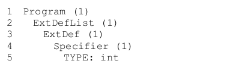
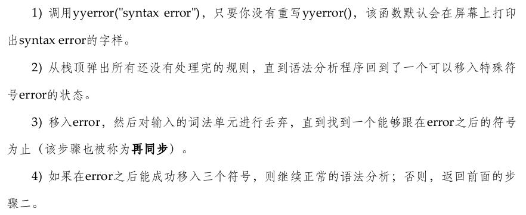
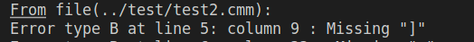

# 编译原理实验一：词法分析与语法分析

```powershell
│  lab1报告.md
│  readme.md  # 编译方法/学习过程记录
│
├─.vscode
│      settings.json
│
├─code # 实验代码
│      makefile
│      compile.sh
│      runtest.sh
│      fileclean.sh
│      main.c
│      lexical.l
│      syntax.y
│      TreeNode.c
│      TreeNode.h
│
├─readme # 存储 readme.md 中的图片
│      image-*.png
│
├─test # 实验样例
│      test1.cmm
│      test2.cmm
│      test3.cmm
│      test4.cmm
│      test5.cmm
│      test_plus1.cmm
│      test_plus2.cmm
│      test_plus3.cmm
│      test_plus4.cmm
│      test_plus5.cmm
│      test_plus6.cmm
│
└─资料
        Appendix_A_C--文法(1).pdf
        实验教程-Project_1.pdf
        编译原理实验指导书-词法分析与语法分析.doc
```

## 0. 编译方法

首先 `cd code` 到 `code` 文件夹下

`make install` 安装最新的 `flex` 和 `bison-3.4.1`

>   官网给出的不同版本的ubuntu安装的最新的bison可能不一样，所以这里的 `make install` 统一安装了最新的 `flex` 和 `bison-3.4.1` ，可以正常使用程序。顺便说一嘴，我这里用的是 `flex-2.6.4` 。下图来自官网：
>
>   

<font color=blue size=4>make 方法</font>

编译 `make`

运行样例 `make test`

删除中间文件 `make clean`

<font color=blue size=4>bash 脚本方法</font>

编译：`./compile.sh`

运行所有样例：`./runtest.sh`

删除中间文件：`./fileclean.sh`

## 1. 实验目的

1．巩固对词法分析与语法分析的基本功能和原理的认识。

2．能够应用自动机的知识进行词法分析与语法分析。

3．理解并处理词法分析与语法分析中的异常和错误。

## 2. 实验内容

编写一个程序对使用C--语言书写的源代码进行词法和语法分析（C--语言的文法参见《编译原理实践与指导教程》附录A），并打印分析结果。实验要求使用词法分析工具GNU Flex和语法分析工具GNU Bison，并使用C语言来完成。

程序要能够查出C--源代码中可能包含的下述几类错误：

1）词法错误（错误类型A）：出现C--词法中未定义的字符以及任何不符合C--词法单元定义的字符；

2）语法错误（错误类型B）。

## 3. 实验要求

（1）输入格式

程序输入是一个包含C--源代码的文本文件，程序需要能够接收一个输入文件名作为参数。例如，假设程序名为cc、输入文件名为test1、程序和输入文件都位于当前目录下，那么在Linux命令行下运行./cc test1即可获得以test1作为输入文件的输出结果。

（2）输出格式

实验一要求通过标准输出打印程序的运行结果。对于那些包含词法或者语法错误的输入文件，只要输出相关的词法或语法有误的信息即可。在这种情况下，注意不要输出任何与语法树有关的内容。要求输出的信息包括错误类型、出错的行号以及说明文字，其格式为：

Error type [错误类型] at Line [行号]: [说明文字].

说明文字的内容没有具体要求，但是错误类型和出错的行号一定要正确，因为这是判断输出错误提示信息是否正确的唯一标准。请严格遵守实验要求中给定的错误分类（即词法错误为错误类型A，语法错误为错误类型B），否则将影响你的实验评分。注意，输入文件中可能包含一个或者多个错误（但输入文件的同一行中保证不出现多个错误），程序需要将这些错误全部报告出来，每一条错误提示信息在输出中单独占一行。

对于那些没有任何词法或语法错误的输入文件，程序需要将构造好的语法树按照先序遍历的方式打印每一个结点的信息，这些信息包括：

1）如果当前结点是一个语法单元并且该语法单元没有产生e（即空串），则打印该语法单元的名称以及它在输入文件中的行号（行号被括号所包围，并且与语法单元名之间有一个空格）。所谓某个语法单元在输入文件中的行号是指该语法单元产生的所有词素中的第一个在输入文件中出现的行号。

2）如果当前结点是一个语法单元并且该语法单元产生了e，则无需打印该语法单元的信息。

3）如果当前结点是一个词法单元，则只要打印该词法单元的名称，而无需打印该词法单元的行号。

a）如果当前结点是词法单元ID，则要求额外打印该标识符所对应的词素；

b）如果当前结点是词法单元TYPE，则要求额外打印说明该类型为int还是float；

c）如果当前结点是词法单元INT或者FLOAT，则要求以十进制的形式额外打印该数字所对应的数值；

d）词法单元所额外打印的信息与词法单元名之间以一个冒号和空格隔开。

每一条词法或语法单元的信息单独占一行，而每个子结点的信息相对于其父结点的信息来说，在行首都要求缩进2个空格。具体输出格式可参见后续的样例。

## 4. 提交要求

1）以Flex、Bison以及C语言编写的可被正确编译运行的源程序。

2）一份PDF格式的实验报告，内容包括：

a）程序实现了哪些功能？简要说明如何实现这些功能。

b）程序应该如何被编译？可以使用脚本、makefile或逐条输入命令进行编译，请详细说明应该如何编译你的程序。

c）实验报告的长度不得超过三页。所以实验报告中需要重点描述的是程序的亮点，是你认为最个性化、最具独创性的内容，而相对简单的、任何人都可以做的内容则可不提或简单地提一下，尤其要避免大段地在报告里贴代码。实验报告中所出现的最小字号不得小于五号字（或英文11号字）。

## 5. 实验过程

linux 安装 flex 和 Bison `sudo apt install flex bison`


### \* Flex 语法

首先通过一个简单的文字统计工具了解 Flex 语法：

>   先看看 `int main(argc, char **argv)` 中这两个参数的意思：
>
>   *   从命令行读入的参数的个数
>   *   从命令行读入的每个参数的名称
>
>   如果直接运行程序，则可以直接 `int main()` ，如果运行程序时后面要跟参数，则必须在括号里加上参数。
>
>   下面看一个例子：
>
>   Try the following program:
>
>   ```c
>   #include <iostream>
>   
>   int main(int argc, char** argv) {
>       std::cout << "Have " << argc << " arguments:" << std::endl;
>       for (int i = 0; i < argc; ++i) {
>           std::cout << argv[i] << std::endl;
>       }
>   }
>   ```
>
>   Running it with `./test a1 b2 c3` will output
>
>   ```c
>   Have 4 arguments:
>   ./test
>   a1
>   b2
>   c3
>   ```

```c
    // ************* definitions part ******************
    // 定义方式： name definition
 // 增加该语句不会报 undefined reference to `yywrap'
%option noyywrap 

%{
    // %{ %} 中的这部分代码，会被直接拷贝到 lex.yy.c 的最前面，可以放库引用、宏定义和一些变量定义。
    #include <stdio.h>

    int chars = 0; // 统计字符数
    int words = 0; // 统计单词数
    int lines = 0; // 统计行数
%}

digit   [0-9]
letter  [_a-zA-Z]

%%
    // ************* rules part ************************
    // 定义方法： pattern {action}，即： 正则表达式 {响应函数}
    // atoi() 把一个字符串表示的整数转化为int类型
    
    // Flex将按照这部分给出的内容依次尝试每一个规则，尽可能匹配最长的输入串。
    // 如果有些内容不匹配任何规则，Flex默认只将其拷贝到标准输出，
    // 想要修改这个默认行为的话只需要在所有规则的最后加上一条“.”（即匹配任何输入）规则，
    // 然后在其对应的action部分书写你想要的行为即可。

    // 变量yytext的类型为char*，它是Flex为我们提供的一个变量，里面保存了当前词法单元所对应的词素。
{digit}+    { printf("Integer value %d\n", atoi(yytext)); } // 遇到整型数的正闭包，打印其结果
{letter}+   { words++; chars += yyleng; }
\n          { chars++; lines++; }
.           { chars++; } // 其余情况

%%
    // ************* user subroutines ******************
    // 用户自定义代码部分： 这部分代码会被原封不动地拷贝到lex.yy.c中，以方便用户自定义所需要执行的函数。
int main(int argc, char **argv) {
    if (argc > 1) {
        /* 
            yyin 是 Flex 内部使用的一个变量，表示输入文件的文件指针，如果不设置它，Flex将它自动设置为 stdin
            如果将 main 函数独立设为一个文件，则需要：
                1. 声明 yyin 为外部变量：extern FILE *yyin;
                2. 编译两个C源文件。例， gcc main.c lex.yy.c -lfl -o scanner 
                   然后对测试文件进行词法分析 ./scanner test.cmm
        */
        if (!(yyin = fopen(argv[1], "r"))) { // 若文件打开失败
            perror(argv[1]); // 抛出一个异常
            return 1; // 退出程序
        }
    }
    // while (yylex() != 0); // 如果文件读取成功，则调用 yylex() 进行词法分析
    yylex(); // 由于在规则部分里我们没有让 yylex()返回任何值，因此在main函数中调用yylex()时可以不套外层的while循环。
    printf("%8d%8d%8d\n", lines, words, chars);
    return 0;
}
```


真正的wc工具可以一次传入多个参数从而统计多个文件。为了能够让 这个Flex程序对多个文件进行统计，我们可以修改main函数如下：

```c
int main(int argc, char **argv) {
    int i, totchars = 0, totwords = 0, totlines = 0;
    if (argc < 2) { /* just read stdin */
        yylex();
        printf("%8d%8d%8d\n", lines, words, chars);
        return 0;
    }
    for (i = 1; i < argc; i++) {
        FILE *f = fopen(argv[i], "r");
        if (!f) {
            perror(argv[i]);
            return 1; // 文件指针不空，说明正确打开，继续读
        }
        yyrestart(f);   // yyrestart(f)函数是Flex提供的库函数，它可以让Flex将其输入文件的文件指针yyin设置为f
                        // （当然你也可以像前面一样手动设置令yyin = f）并重新初始化该文件指针，令其指向输入文件的开头。
        yylex();
        fclose(f);
        printf("%8d%8d%8d\n", lines, words, chars);
        totchars += chars; chars = 0;
        totwords += words; words = 0;
        totlines += lines; lines = 0;
    }
    if (argc > 1) {
        printf("%8d%8d%8d total\n", totlines, totwords, totchars);
    }
    return 0;
}
```


### Flex：书写正则表达式

<font color=blue size=4>规则：</font>

1) 符号“.”匹配除换行符“\n”之外的任何一个字符。

2) 符号“[”和“]”共同匹配一个字符类，即方括号之内只要有一个字符被匹配上了，那么被方括号括起来的整个表达式都被匹配上了。例如，`[0123456789]`表示0~9中任意一个数字字符，`[abcABC]`表示a、b、c三个字母的小写或者大写。方括号中还可以使用连字符`“-”`表示 一个范围，例如`[0123456789]`也可以直接写作`[0-9]`，而所有小写字母字符也 可直接写成`[a-z]` 。如果方括号中的第一个字是`“^”`，则表示对这个字符类取补，即方括号之内如果没有任何一个字符被匹配上，那么被方括号括起来的整个表达式就认为被匹配上了。例如，`[^_0-9a-zA-Z]`表示所有的非字母、数字以及下划线的字符。

3) 符号`“^”`用在方括号之外则会匹配一行的开头，符号`“ $”`用于匹配一行的结尾，符号`“<<EOF>>”`用于匹配文件的结尾。

4) 符号`“{”和“}”`含义比较特殊。如果花括号之内包含了一个或者两个数字，则代表花括号之前的那个表达式需要出现的次数。例如，`A{5}`会匹配`AAAAA`，`A{1,3}`则会匹配A、AA或者AAA。如果花括号之内是一个在 Flex源代码的定义部分定义过的名字，则 表示那个名字对应的正则表达式。例如，在定义部分如果定义了`letter`为`[a-zA-Z]`，则`{letter}{1,3}`表示连续的一至三个英文字母。

5) 符号`“*”`为`Kleene`闭包操作，匹配零个或者多个表达式。例如`{letter}*`表示零个或者多个英文字母。

6) 符号`“+”`为正闭包操作，匹配一个或者多个表达式。例如`{letter}+`表示一个或者多个英文字母。

7) 符号`“?”`匹配零个或者一个表达式。例如表达式`-?[0-9]+`表示前面带一个可选的负号的数字串。无论是*、+还是?，它们都只对其最邻近的那个字符生效。例如`abc+`表示ab后面跟一个或多个c，而不表示一个或者多个abc。如果你要匹配后者，则需要使用号`“(”`和`“)”`将这几个字符括起来：`(abc)+`。

8) 符号`“|”`为选择操作，匹配其之前或之后的任一表达式。例如，`faith | hope | charity`表示这三个串中的任何一个。

9) 符号`“\ ” `用于表示各种转义字符，与 C 语言字符串里` “ \ ”` 的用法类似。例如，`“\n”`表示换行，`“\t”`表示制表符，`“\*”`表示星号，`“\\”`代表字符`“\”`等。

10) 符号`“"”`（英文引号）将逐字匹配被引起来的内容（即无视各种特殊符号及转义字符）。例如，表达式`"..."`就表示三个点而不表示三个除换行符以外的任意字符。

11) 符号`“/”`会查看输入字符的上下文， 例如，`x/y`识别x仅当在输入文件中x之后紧跟着y，`0/1`可以匹配输入串01中的0但不匹配输入串02中的0。

12) 任何不属于上面介绍过的有特殊含义的字符在正则表达式中都仅匹配该字符本身。

**下面我们通过几个例子来练习一下Flex源代码里正则表达式的书写：**

1)   带一个可选的正号或者负号的数字串，可以这样写：`[+−]?[0-9]+`。

2)   带一个可选的正号或者负号以及一个可选的小数点的数字串 ，表示起来要困难一些：`[+−]?([0-9]*\.?[0-9]+|[0-9]+\.)`

### Flex：高级特性

<font color=blue size=4>yylineno选项：</font>
在写编译器程序的过程中，经常会需要记录行号，以便在报错时提示输入文件的哪一行出现了问题。为了能记录这个行号，我们可以自己定义某个变量，例如 lines ，来记录词法分析程序当前读到了输入文件的哪一行。每当识别出 `“\n”`，我们就让 lines = lines + 1 。实际上，Flex 内部已经为我们提供了类似的变量，叫做 yylineno 。我们不必去维护 yylineno 的值，它会在每行结束自动加一。不过，默认状态下它并不开放给用户使用。如果我们想要读取yylineno的值，则需要在Flex源代码的定义部分加入语句 `“%option yylineno”` 。需要说明的是，虽然 yylineno 会自动增加，但当我们在词法分析过程中调用 `yyrestart()` 函数读取另一个输入文件时它却不会重新被初始化，因此我们需要自行添加初始化语句 `yylineno = 1`。

等等，还有缓存区等高级特性。

### 词法分析

粗糙的词法分析代码

```c
    // ************* definitions part ******************
    // 定义方式： name definition
 // 增加该语句不会报 undefined reference to `yywrap'
%option noyywrap 

%{
    // %{ %} 中的这部分代码，会被直接拷贝到 lex.yy.c 的最前面，可以放库引用、宏定义和一些变量定义。
    #include <stdio.h>

    void Hint();

    int chars = 0; // 统计字符
    int words = 0; // 统计单词
    int lines = 0; // 统计行数
    int totchars = 0, totwords = 0, totlines = 0;
%}

digit       [0-9]
letter      [_a-zA-Z]
 /* A sequence of digits without spaces */
INT         [+?]?[0-9]+ 
 /* A real number consisting of digits and one decimal point. The decimal 
    point must be surrounded by at least one digit */
digit_float [+?]?([0-9]*\.?[0-9]+|[0-9]+\.)
 /* A character string consisting of 52 upper- or lower-case alphabetic, 10 numeric
    and one underscore characters. Besides, an identifier must not start with a digit */
id          {letter}({letter}|{digit})*

%%
    // ************* rules part ************************
    // 定义方法：pattern {action}，即：正则表达 {响应函数}
    // atoi() 把一个字符串表示的整数转化为int类型
    
    // Flex将按照这部分给出的内容依次尝试每一个规则，尽可能匹配最长的输入串。
    // 如果有些内容不匹配任何规则，Flex默认只将其拷贝到标准输出。
    // 想要修改这个默认行为的话只需要在所有规则的最后加上一条“.”（即匹配任何输入）规则，
    // 然后在其对应的action部分书写你想要的行为即可。

    // 变量yytext的类型为char*，它是Flex为我们提供的一个变量，里面保存了当前词法单元所对应的词素。
    
    // 关键的字的匹配要放在前面，否则会报错
struct      { printf("STRUCT\n"); }
return      { printf("RETURN\n"); }
if          { printf("IF\n"); }
else        { printf("ELSE\n"); }
while       { printf("WHILE\n"); }

int         { printf("TYPE\n"); }
float       { printf("TYPE\n"); }

{digit}+    { printf("Integer value %d\n", atoi(yytext)); } // 遇到整型数的正闭包，打印其结
{letter}+   { printf("letter\n"); words++; chars += yyleng; }

";"         {Hint();}
","         { printf("COMMA\n"); }
"="         { printf("ASSIGNOP\n"); }
">"         { printf("RELOP\n"); }
"<"         { printf("RELOP\n"); }
">="        { printf("RELOP\n"); }
"<="        { printf("RELOP\n"); }
"=="        { printf("RELOP\n"); }
"!="        { printf("RELOP\n"); }
"+"         { printf("ADD\n"); }
"-"         { printf("SUB\n"); }
"*"         { printf("MUL\n"); }
"/"         { printf("DIV\n"); }
"&&"        { printf("AND\n"); }
"||"        { printf("OR\n"); }
"."         { printf("DOT\n"); }
"!"         { printf("NOT\n"); }
"("         { printf("LP\n"); }
")"         { printf("RP\n"); } 
"["         { printf("LB\n"); }
"]"         { printf("RB\n"); }
"{"         { printf("LC\n"); }
"}"         { printf("RC\n"); }
\n          { chars++; lines++; }
.           { chars++; } // 其余情况

%%
    // ************* user subroutines ******************
    // 用户自定义代码部分： 这部分代码会被原封不动地拷贝到lex.yy.c中，以方便用户自定义所需要执行的函数。
void Print() {
    printf("\n-----------------------------------------------------------\n");
    printf("\n                      词法分析结果                          \n");
    printf("\n-----------------------------------------------------------\n");
    printf("行号\t所属类别\t单词\t种别码\t\n");
}

void Hint() {
    printf("\nline%d: < \t关键字\t，\t%s\t>", totlines, yytext);
}

int main(int argc, char **argv) {
    Print();
    int i;
    totchars = 0, totwords = 0, totlines = 0;
    if (argc < 2) { /* just read stdin */
        yylex();
        printf("From Terminal:\n");
        printf("totlines\ttotwords\ttotchars\t\n", totlines, totwords, totchars);
        printf("%8d\t%8d\t%8d\t\n", totlines, totwords, totchars);
        return 0;
    }
    for (i = 1; i < argc; i++) {
        FILE *f = fopen(argv[i], "r");
        if (!f) {
            perror(argv[i]);
            return 1; // 文件指针不空，说明正确打开，继续读
        }
        yyrestart(f);   // yyrestart(f)函数是Flex提供的库函数，它可以让Flex将其输入文件的文件指针yyin设置为f
                        // （当然你也可以像前面一样手动设置令yyin = f）并重新初始化该文件指针，令其指向输入文件的开头
        yylex();
        fclose(f);
        // printf("totlines\ttotwords\ttotchars\t\n", totlines, totwords, totchars);
        // printf("%8d\t%8d\t%8d\t\n", totlines, totwords, totchars);
        totchars += chars; chars = 0;
        totwords += words; words = 0;
        totlines += lines; lines = 0;
    }
    if (argc > 1) {
        printf("From Files:\n");
        printf("totlines\ttotwords\ttotchars\t\n", totlines, totwords, totchars);
        printf("%8d\t%8d\t%8d\t\n", totlines, totwords, totchars);
    }
    return 0;
}
```

<font color=red size=4>词法分析最终版</font>

```c
    // ************* definitions part ******************
    // 定义方式: name definition
 // 增加该句不会报 undefined reference to `yywrap'
%option noyywrap

%{
    // %{ %} :的这部分代码，会直接拷贝到 lex.yy.c 的最前面，可以放库引用、宏定义和一些变量定义
    #include <stdio.h>
    // #include "syntax.tab.h"

    // int yycolumn = 1;
    // #define YY_USER_ACTION \
    // 			yylloc.first_line = yylloc.last_line = yylineno; \
    // 			yylloc.first_column = yycolumn; \
    // 			yylloc.las_column = yycolumn + yyleng - 1; \
    // 			yycolumn += yyleng;

    void KeyWord(char *name);
    void Operator(char *name);
    void Border(char *name);
    void identifier(char *name);
    void Constant(char *name);

    int chars = 0;
    int words = 0;
    int lines = 1;
    int totchars = 0, totwords = 0, totlines = 0;
%}

digit       [0-9]
letter      [_a-zA-Z]
 /* A sequence of digits without spaces */
INT         {digit}{digit}*|0
 /* A real number consisting of digits and one decimal point. The decimal
    point must be surrounded by at least one digit */
FLOAT       ({digit}*\.?{digit}+|{digit}+\.)
 /* A character string consisting of 52 upper- or lower-case alphabetic, 10 numeric
    and one underscore characters. Besides, an identifier must not start with a digit */
Identifier  {letter}({letter}|{digit})*

%%
    // ************* rules part ************************
    // 定义方法：pattern {action}，即：正则表达 {响应函数}
    // atoi() 把一个字符串表示的整数转化为int类型

    // Flex将按照这部分给出的内容依次尝试每一个规则，尽可能匹配最长的输入串。
    // 如果有些内容不匹配任何规则，Flex默认只将其拷贝到标准输出。
    // 想要修改这个默认行为的话只需要在所有规则的最后加上一条“.”（即匹配任何输入）规则，
    // 然后在其对应的action部分书写你想要的行为即可。

    // 变量yytext的类型为char*，它是Flex为我们提供的一个变量，里面保存了当前词法单元所对应的词素。

    // 关键的字的匹配要放在前面，否则会报错
struct      { KeyWord("STRUCT"); }
return      { KeyWord("RETURN"); }
if          { KeyWord("IF"); }
else        { KeyWord("ELSE"); }
while       { KeyWord("WHILE"); }
int         { KeyWord("TYPE"); }
float       { KeyWord("TYPE"); }
main        { KeyWord("MAIN"); }
include     { KeyWord("INCLUDE"); }

"="         { Operator("ASSIGNOP"); }
">"         { Operator("RELOP"); }
"<"         { Operator("RELOP"); }
">="        { Operator("RELOP"); }
"<="        { Operator("RELOP"); }
"=="        { Operator("RELOP"); }
"!="        { Operator("RELOP"); }
"+"         { Operator("ADD"); }
"-"         { Operator("SUB"); }
"*"         { Operator("MUL"); }
"/"         { Operator("DIV"); }
"&&"        { Operator("AND"); }
"||"        { Operator("OR"); }
"."         { Operator("DOT"); }
"!"         { Operator("NOT"); }

";"         { Border("SEMI"); }
","         { Border("COMMA"); }
"("         { Border("LP"); }
")"         { Border("RP"); }
"["         { Border("LB"); }
"]"         { Border("RB"); }
"{"         { Border("LC"); }
"}"         { Border("RC"); }
"\""        {  }
"'"         {  }
"#"         {  }
" "         {  }

{INT}       { Constant("Integer"); }
{FLOAT}     { Constant("Float"); }
{letter}+   { Constant("String"); words++; chars += yyleng; }
{Identifier} { identifier("ID"); }

\n          { chars++; lines++; }
.           {
              chars++;
              printf("Error type A at Line %d: Mysterious characters \'%s\'\n",
                    lines, yytext);
            } // 其余情况

%%
    // ************* user subroutines ******************
    // 用户自定义代码部分： 这部分代码会被原封不动地拷贝到lex.yy.c中，以方便用户自定义所需要执行的函数。
void Print() {
    printf("\n-----------------------------------------------------------\n");
    printf("\n                      词法分析结果                          \n");
    printf("\n-----------------------------------------------------------\n");
    printf("行号\t\t所属类别\t符号\t\t名称\t\n");
}

void KeyWord(char *name) { // 1. 关键字：程序内置的关键字，如int、main等
    printf("line%d: < \t关键字\t，\t%s\t,\t%s\t>\n", lines, yytext, name);
}

void Operator(char *name) { // 2. 运算符：+-/*等
    printf("line%d: < \t运算符\t，\t%s\t,\t%s\t>\n", lines, yytext, name);
}

void Border(char *name) { // 3. 界符：逗号，分号，、 等
    printf("line%d: < \t界限符\t，\t%s\t,\t%s\t>\n", lines, yytext, name);
}

void identifier(char *name) { // 4. 标识符：自己定义的变量名、函数名
    printf("line%d: < \t标识符\t，\t%s\t,\t%s\t>\n", lines, yytext, name);

}

void Constant(char *name) { // 5. 常数：整数、浮点数、科学计数、字符串、布尔型
    printf("line%d: < \t常量\t，\t%s\t,\t%s\t>\n", lines, yytext, name);
}

int main(int argc, char **argv) {
    Print();
    int i;
    totchars = 0, totwords = 0, totlines = 0;
    if (argc < 2) { /* just read stdin */
        yylex();
        printf("From Terminal:\n");
        printf("totlines\ttotwords\ttotchars\t\n");
        printf("%8d\t%8d\t%8d\t\n", lines, words, chars);
        return 0;
    }
    for (i = 1; i < argc; i++) {
        FILE *f = fopen(argv[i], "r");
        if (!f) {
            perror(argv[i]);
            return 1; // 文件指针不空，说明正确打开，继续读
        }
        yyrestart(f);   // yyrestart(f)函数是Flex提供的库函数，它可以让Flex将其输入文件的文件指针yyin设置为f
                        // （当然你也可以像前面一样手动设置令yyin = f）并重新初始化该文件指针，令其指向输入文件的开头
        yylex();
        fclose(f);
        // 分析完一个文件，打印结果并重置每个文件中的统计变量
        printf("\ntotlines\ttotwords\ttotchars\t（%s）\n", argv[i]);
        printf("%8d\t%8d\t%8d\t\n\n\n", lines, words, chars);
        totchars += chars; chars = 0;
        totwords += words; words = 0;
        totlines += lines; lines = 0;
    }
    if (argc > 2) { // 多文件时，打印总的统计结果
        printf("From %d Files:\n", argc - 1);
        printf("totlines\ttotwords\ttotchars\t\n");
        printf("%8d\t%8d\t%8d\t\n", totlines, totwords, totchars);
    }
    return 0;
}
```


### 语法分析

词法分析的下一阶段是语法分析。语法分析程序的主要任务是读入词法单元流、判断输入程序是否匹配程序设计语言的语法规范，并在匹配规范的情况下构建起输入程序的静态结构。语法分析使得编译器的后续阶段看到的输入程序不再是一串字符流或者单词流，而是一个结构整齐、处理方便的数据对象。

正则表达式难以进行任意大的计数，所以很多在程序设计语言中常见的结构（例如匹配的括号）无法使用正则文法进行表示。为了能够有效地对常见的语法结构进行表示，人们使用了比正则文法表达能力更强的上下文无关文法（Context Free Grammar或CFG）。虽然上下文无关文法在表达能力上要强于正则语言，但在判断某个输入串是否属于特定 CFG 的问题上，时间效率最好的算法也要 $O(n^3)$，这样的效率让人难以接受。因此，现代程序设计语言的语法大多属于一般 CFG 的一个足够大的子集，比较常见的子集有 LL(k) 文法以及 LR(k) 文法。判断一个输入是否属于这两种文法都只需要线性时间。

上下文无关文法G在形式上是一个四元组：终结符号（也就是词法单元）集合 T、非终结符号集合NT、初始符号S以及产生式集合P。产生式集合P是一个文法的核心，它通过产生式定义了一系列的推导规则，从初始符号出发，基于这些产生式，经过不断地将非终结符替换为 其它非终结符以及终结符，即可得到一串符合语法规约的词法单元。这个替换和推导的过程可以使用树形结构表示，称作语法树。**事实上，语法分析的过程就是把词法单元流变成语法树的过程。**

目前最常见的构建语法树的技术只有两种： 
**自顶向下方法** 和 **自底向上方法** 。我们下面将要介绍的工具Bison所生成的语法分析程序就采用了自底向上的LALR(1)分析技术。

和词法分析程 
序的生成工具一样，工具的使用者所要做的仅仅是将输入程序的程序设计语言的语法告诉语法分析程序生成工具，虽然工具本身不能帮助直接构造出语法树，但我们可以通过在语法产生式中插入语义动作这种更加灵活的形式，来实现一些甚至比构造语法树更加复杂的功能。

### \* GNU Bison

每条产生式的最后可以添加一组以花括号`“{”`和`“}”`括起来的语义动作，这组语义动作会在整条产生式归约完成之后执行，如果不明确指定语义动作，那么Bison将采用默认的语义动作`{ $$ = $1 }`。语义动作也可以放在产生式的中间，例如 $A → B \{ … \} C$，这样的写法等价于 $A → BMC$ ，$M → \varepsilon\{ … \}$ ，其中M为额外引入的一个非终结符。

因为我们的yylex()函数是由Flex源代码生成的，因此要想让终结符带有属性值，就必须回头修改Flex源代码。假设在我们的Flex源代码中，INT词法单元对应着一个数字串，那么我们可以将Flex源代码修改为：

```c
...
digit	[0-9]
%% 
{digit}* {
    	yylval = atoi(yytext);
    	return INT;
	}
...
%%
...
```

<font color=blue size=5>下面给出使用书中样例的两种实现方法:</font>

<font color=blue size=5>方式1：(没有独立的 `main.c` )</font>

1. 编译词法分析器 `flex lexical.l` 生成 `lex.yy.c` 

    ```c
        // ************* definitions part ******************
        // 定义方式： name definition
     // 增加该语句不会报 undefined reference to `yywrap'
    %option noyywrap
    
    %{
        // %{ %} 中的这部分代码，会被直接拷贝到 lex.yy.c 的最前面，可以放库引用、宏定义和一些变量定义。
        #include <stdio.h>
    
        void KeyWord(char *name);
        void Operator(char *name);
        void Border(char *name);
        void identifier(char *name);
        void Constant(char *name);
    
        int chars = 0; // 统计字符
        int words = 0; // 统计单词
        int lines = 1; // 统计行数，一般编译器行数从1开始
        int totchars = 0, totwords = 0, totlines = 0;
    %}
    
    digit       [0-9]
    letter      [_a-zA-Z]
    number      {digit}{digit}*|0
     /* A sequence of digits without spaces */
    INT         [+?]?[0-9]+
     /* A real number consisting of digits and one decimal point. The decimal
        point must be surrounded by at least one digit */
    FLOAT       [+?]?([0-9]*\.?[0-9]+|[0-9]+\.)
     /* A character string consisting of 52 upper- or lower-case alphabetic, 10 numeric
        and one underscore characters. Besides, an identifier must not start with a digit */
    Identifier  {letter}({letter}|{digit})*
    
    %%
        // ************* rules part ************************
        // 定义方法：pattern {action}，即：正则表达 {响应函数}
        // atoi() 把一个字符串表示的整数转化为int类型
    
        // Flex将按照这部分给出的内容依次尝试每一个规则，尽可能匹配最长的输入串。
        // 如果有些内容不匹配任何规则，Flex默认只将其拷贝到标准输出。
        // 想要修改这个默认行为的话只需要在所有规则的最后加上一条“.”（即匹配任何输入）规则，
        // 然后在其对应的action部分书写你想要的行为即可。
    
        // 变量yytext的类型为char*，它是Flex为我们提供的一个变量，里面保存了当前词法单元所对应的词素。
    
        // 关键的字的匹配要放在前面，否则会报错
    struct      { KeyWord("STRUCT"); }
    return      { KeyWord("RETURN"); }
    if          { KeyWord("IF"); }
    else        { KeyWord("ELSE"); }
    while       { KeyWord("WHILE"); }
    int         { KeyWord("TYPE"); }
    float       { KeyWord("TYPE"); }
    main        { KeyWord("MAIN"); }
    include     { KeyWord("INCLUDE"); }
    
    "="         { Operator("ASSIGNOP"); }
    ">"         { Operator("RELOP"); }
    "<"         { Operator("RELOP"); }
    ">="        { Operator("RELOP"); }
    "<="        { Operator("RELOP"); }
    "=="        { Operator("RELOP"); }
    "!="        { Operator("RELOP"); }
    "+"         { Operator("ADD"); return ADD; }
    "-"         { Operator("SUB"); return SUB; }
    "*"         { Operator("MUL"); return MUL; }
    "/"         { Operator("DIV"); return DIV; }
    "&&"        { Operator("AND"); }
    "||"        { Operator("OR"); }
    "."         { Operator("DOT"); }
    "!"         { Operator("NOT"); }
    
    ";"         { Border("SEMI"); }
    ","         { Border("COMMA"); }
    "("         { Border("LP"); }
    ")"         { Border("RP"); }
    "["         { Border("LB"); }
    "]"         { Border("RB"); }
    "{"         { Border("LC"); }
    "}"         { Border("RC"); }
    "\""        { Border("双引号"); }
    "'"         { Border("单引号"); }
    " "         { Border("SPACE"); }
    "#"         { Border("井号"); }
    
    {INT}       { Constant("Integer"); yylval = atoi(yytext); return INT; }
    {FLOAT}     { Constant("Float"); }
    {letter}+   { Constant("String"); words++; chars += yyleng; }
    
    {Identifier} { identifier("ID"); }
    
    \n          { chars++; lines++; }
    .           { chars++;
                  printf("Error type A at Line %d: Mysterious characters \'%s\'\n",
                        lines, yytext);
                } // 其余情况
    
    %%
        // ************* user subroutines ******************
        // 用户自定义代码部分： 这部分代码会被原封不动地拷贝到lex.yy.c中，以方便用户自定义所需要执行的函数。
    void Print() {
        printf("\n-----------------------------------------------------------\n");
        printf("\n                      词法分析结果                          \n");
        printf("\n-----------------------------------------------------------\n");
        printf("行号\t\t所属类别\t符号\t\t名称\t\n");
    }
    
    void KeyWord(char *name) { // 1. 关键字：程序内置的关键字，如int、main等
        printf("line%d: < \t关键字\t，\t%s\t,\t%s\t>\n", lines, yytext, name);
    }
    
    void Operator(char *name) { // 2. 运算符：+-/*等
        printf("line%d: < \t运算符\t，\t%s\t,\t%s\t>\n", lines, yytext, name);
    }
    
    void Border(char *name) { // 3. 界符：逗号，分号，、 等
        printf("line%d: < \t界限符\t，\t%s\t,\t%s\t>\n", lines, yytext, name);
    }
    
    void identifier(char *name) { // 4. 标识符：自己定义的变量名、函数名
        printf("line%d: < \t标识符\t，\t%s\t,\t%s\t>\n", lines, yytext, name);
    
    }
    
    void Constant(char *name) { // 5. 常数：整数、浮点数、科学计数、字符串、布尔型
        printf("line%d: < \t常量\t，\t%s\t,\t%s\t>\n", lines, yytext, name);
    }
    ```

2. Bison源代码中引用lex.yy.c：`#include "lex.yy.c"`

    ```c
    %{
        #include <stdio.h>
    %}
     // 以 %token 开头的词法单元（终结符）定义，如果你需要采用Flex生成的yylex()的话，
     // 那么在这里定义的词法单元都可以作为Flex源代码里的返回值。与终结符相对的，所有未被定义为%token的符号
     // 都会被看作非终结符，这些非终结符要求必须在任意产生式的左边至少出现一次。
    
    /* declared tokens */
    %token INT
    %token ADD SUB MUL DIV
    
    %%
     // 第二部分是书写产生式的地方。第一个产生式左边的非终结符默认为初始符号（你也可以
     // 通过在定义部分添加%start X来将另外的某个非终结符X指定为初始符号）。
    
     // 产生式里的箭头在这里用冒号“:”表示，一组产生式与另一组之间以分号“;”隔开。
     // 产生式里无论是终结符还是非终结符都各自对应一个属性值，产生式左边的非终结符对应的属性值用$$表示，
     // 右边的几个符号的属性值按从左到右的顺序依次对应为$1、$2、$3等。
    
    Calc : /* empty */
        | Exp { printf("= %d\n", $1); }
        ;
    Exp : Factor
        | Exp ADD Factor { $$ = $1 + $3; }
        | Exp SUB Factor { $$ = $1 - $3; }
        ;
    Factor : Term
        | Factor MUL Term { $$ = $1 * $3; }
        | Factor DIV Term { $$ = $1 / $3; }
        ;
    Term : INT
        ;
    
    %%
    #include "lex.yy.c"
    int main() {
        yyparse();
    }
    
    yyerror(char *msg) {
        fprintf(stderr, "error: %s\n", msg);
    }
    ```

3. 随后使用Bison编译这份源代码

    * `bison syntax.y`
    * `gcc syntax.tab.c -o testbison`

4. 运行 `./testbison` ,命令行输入 `10-2+3` ,按回车得到运算结果

    

    可以看到我的词法分析器还有些问题,把加号识别为常数前面的正号.

    修改一下正则表达式: 我好像改不出来了,按理说顺序执行的话,应该是先把加号识别成运算符啊。可能是最长前缀匹配？这里我不太懂了，等整个流程熟悉一遍再改吧。先把 `INT` 和 `FLOAT` 的正则表达式的符号部分去掉把。

    > 看完附录A才发现，这里只要求了无符号整型常数和无符号浮点型常数。

    ```c++
    {INT}       { Constant("Integer"); yylval.type_int = atoi(yytext); return INT; }
    {FLOAT}     { Constant("Float"); yylval.type_float = atof(yytext); return FLOAT; }
    {letter}+   { Constant("String"); words++; chars += yyleng; }
    {Identifier} { identifier("ID"); }
    ```

    重复上面的编译过程，得到如下情况：

     

<font color=blue size=5>方式2：(有独立的 `main.c` )</font>

1. 编译词法分析器 `flex lexical.l` 生成 `lex.yy.c` 

2. Bison源代码中引用lex.yy.c：`#include "lex.yy.c"`

    

3. 随后在使用Bison编译这份源代码时，我们需要加上“-d”参数： `bison -d syntax.y`

    这个参数的含义是，将编译的结果分拆成`syntax.tab.c`和`syntax.tab.h`两个文件，其中`.h`文件里包含着一些词法单元的类型定义之类的内容。

4. 修改我们的Flex源代码`lexical.l`，增加对`syntax.tab.h`的引用，并且让Flex源代码中规则部分的每一条action都返回相应的词法单元，如下所示：由于我们刚刚修改了`lexical.l`，需要重新将它编译出来： `flex lexical.l`

    

5. 接下来是重写我们的main函数。由于Bison会在需要时自动调用`yylex()`，我们在main函数中也就不需要调用它了。不过，Bison是不会自己调用`yyparse()`和`yyrestart()`的，因此这两个函数仍需要我们在main函数中显式地进行调用：

    ```c
    // main.c
    #include <stdio.h>
    
    int main(int argc, char **argv) {
        if (argc <= 1) return 1;
        FILE *f = fopen(argv[1], "r");
        if (!f) {
            perror(argv[1]);
            return 1;
        }
    
        yyrestart(f);
        yyparse();
    
        return 0;
    }
    ```

    > 单独创建一个 `main.c` 文件，前面应该把 `lexical.l` 和 `syntax.y` 中的主函数去掉。

6. 现在我们有了三个C语言源代码文件：`main.c`、`lex.yy.c`以及`syntax.tab.c`，其中`lex.yy.c`已经被`syntax.tab.c`引用了，因此我们最后要做的就是把`main.c`和`syntax.tab.c`放到一起进行编译：
    `gcc main.c syntax.tab.c -ly -o parser`

7. 由于这里是文件读入，直接新建个文本文档，里面写 `10-2+3` ，运行 `./parser fileName.txt`

    

> **遇到的问题：**
>
> Linux 系统下：
>
> 一：`/usr/bin/ld: 找不到 -lfl`
>
> <del>解决方法：`sudo apt install flex-old` </del> 后面发现这个方式会导致 flex 的一些功能出问题，比如词法分析的正则表达式出问题了。
>
> 解决方法：直接不用 `-lfl` 了，好像也没啥影响。后面用了 bash 脚本就可以了，emmm。
>
> 二：`/usr/bin/ld: 找不到 -ly`
>
> 解决方法：`sudo apt-get install libbison-dev`
>
> Windows下要找到对应的包的路径来引用。（网上看到的方法，没有尝试过）

### Bison：属性值的类型

在上面的例子中，每个终结符或非终结符的属性值都是int类型。但在我们构建语法树的过程中，我们希望不同的符号对应的属性值能有不同的类型，而且最好能对应任意的类型而不仅仅是int类型。下面我们介绍如何在Bison中解决这个问题。

第一种方法是对宏 YYSTYPE 进行重定义。Bison 里会默认所有属性值的类型以及变量 yylval 的类型都是 YYSTYPE ，默认情况下 YYSTYPE 被定义为 int 。如果你在Bison 源代码的`“%{”`和`“%}”`之间加入`#define YYSTYPE float`，那么所有的属性值就都成为了 float 类型。那么如何使不同的符号对应不同的类型呢？你可以将 YYSTYPE 定义成一个联合体类型，这样你就可以根据符号的不同来访问联合体中不同的域，从而实现多种类型的效果。

原先这个四则运算程序只能计算整数值，现在我们加入浮点数运算的功能:

```c
// syntax.y
%{
    #include <stdio.h>
%}

/* declared types */
%union {
    int type_int;
    float type_float;
    double type_double;
}

/* declared tokens */
%token <type_int> INT
%token <type_float> FLOAT
%token ADD SUB MUL DIV

/* declared non-terminals */
%type <type_double> Exp Factor Term

%%

Calc : /* empty */
    | Exp { printf("= %lf\n", $1); }
    ;
Exp : Factor
    | Exp ADD Factor { $$ = $1 + $3; }
    | Exp SUB Factor { $$ = $1 - $3; }
    ;
Factor : Term
    | Factor MUL Term { $$ = $1 * $3; }
    | Factor DIV Term { $$ = $1 / $3; }
    ;
Term : INT  { $$ = $1; }
    | FLOAT { $$ = $1; }
    ;

%%
#include "lex.yy.c"
```

`lexical.l` 的正则表达式部分部分修改如下，主要添加了对数据类型的联合体声明。

```c
// lexical.l
{INT}       { Constant("Integer"); yylval.type_int = atoi(yytext); return INT; }
{FLOAT}     { Constant("Float"); yylval.type_float = atof(yytext); return FLOAT; }
{letter}+   { Constant("String"); words++; chars += yyleng; }
{Identifier} { identifier("ID"); }
```

方便起见，直接使用 `syntax.y` 中的 `main()` 函数。

 

 

可以看到整数和浮点数运算都能正常进行，只不过整数最后以浮点数的格式打印结果。

### Bison：语法单元的位置

实验要求中需要你输出每一个语法单元出现的位置。你当然可以自己在Flex中定义每个行号和列号以及在每个动作中维护这个行号和这个列号，并将它们作为属性值的一部分返回给语法单元。这种做法需要我们额外编写一些维护性的代码，非常不方便。

**Bison为我们提供了内置的位置信息供我们使用。很方便。**

前面介绍过Bison中每个语法单元都对应了一个属性值，在语义动作中这些属性值可以使用`$$`、`$1`、`$2`等进行引用。实际上除了属性值之外，每个语法单元还对应了一个位置信息，在语义动作中这些位置信息同样可以使用@$、@1、@2等进行引用。位置信息的数据类型是一个 YYLTYPE ，其默认的定义是：

```c
typedef struct YYLTYPE {
    int first_line;		// 该语法单元对应的第一个词素出现的行号
    int first_column;	// 该语法单元对应的第一个词素出现的列号
    int last_line;		// 该语法单元对应的最后一个词素出现的行号
    int last_column;	// 该语法单元对应的最后一个词素出现的列号
}
```

但注意，如果直接引用@1、@2等将每个语法单元的first_line打印出来，你会发现打印出来的行号全都是1。

Bison并不会主动替我们维护这些位置信息，我们需要在Flex源代码文件中自行维护。不过只要稍加利用Flex中的某些机制，维护这些信息并不需要太多的代码量。我们可以在Flex源文件的开头部分定义变量 `yycolumn` ，并添加如下的宏定义 `YY_USER_ACTION` ：

```c
%locations
...
%{
    /* 此处省略 #include 部分 */
    int yycolumn = 1;
    #define YY_USER_ACTION \
    			yylloc.first_line = yylloc.last_line = yylineno; \
    			yylloc.first_column = yycolumn; \
    			yylloc.las_column = yycolumn + yyleng - 1; \
    			yycolumn += yyleng;
%}
```

其中 yylloc 是 Flex 的内置变量，表示当前词法单元所对应的位置信息；YY_USER_ACTION 宏表示在执行每一个动作之前需要先被执行的一段代码，默认为空，而这里我们将其改成了对位置信息的维护代码。除此之外，最后还要在Flex源代码文件中做的更改，就是在发现了换行符之后对变量 yycolumn 进行复位：

```c
...
%%
...
\n          { chars++; lines++; yycolumn = 1; }
```

这样就可以实现在Bison中正常打印位置信息。

### Bison：二义性与冲突处理

Bison有一个非常好用但也很恼人的特性：对于一个有二义性的文法，它有自己的一套隐式的冲突解决方案（一旦出现归约/归约冲突，Bison总会选择靠前的产生式；一旦出现移入/归约冲突，Bison总会选择移入）从而生成相应的语法分析程序，而这些冲突解决方案在某些场合可能并不是我们所期望的。因此，我们建议在使用Bison编译源代码时要留意它所给的提示信息，如果提示文法有冲突，那么请一定对源代码进行修改，尽量把所有冲突全部消解掉。

前面那个四则运算的小程序，如果它的语法变成这样：

```c
Calc → \varepsilon
| Exp
Exp → Factor
| Exp ADD Exp
| Exp SUB Exp
…
```

虽然看起来好像没什么变化（Exp → Exp ADD Factor | Exp SUB Factor变成了Exp → Exp ADD Exp | Exp SUB Exp），但实际上前面之所以没有这样写，是因为这样做会引入二义性。

> 例如，如果输入为1 − 2 + 3，语法分析程序将无法确定先算1 − 2还是2 + 3。语法分析程序在读到1 − 2的时候可以归约（即先算1 − 2）也可以移入（即先算2 + 3），但由于Bison默认移入优先于归约，语法分析程序会继续读入+ 3然后计算2 + 3。

为了解决这里出现的二义性问题:

1. 重写语法（Exp → Exp ADD Factor | Exp SUB Factor相当于规定加减法为左结合）

    一般而言，重写语法是一件比较麻烦的事情，而且会引入不少像Exp → Term这样除了增加可读性之外没任何什么实质用途的产生式。

2. 显式地指定算符的优先级与结合性。**更好。**

    在Bison源代码中，我们可以通过`“%left”`、`“%right”`和`“%nonassoc”`对终结符的结合性进行规定，其中`“%left”`表示左结合，`“%right”`表示右结合，而`“%nonassoc”`表示不可结合。例如，下面这段结合性的声明代码主要针对四则运算、括号以及赋值号：

    ```c
    %right ASSIGN
    %left ADD SUB
    %left MUL DIV
    %left LP RP
    ```

    其中ASSIGN表示赋值号，LP表示左括号，RP表示右括号。此外，Bison也规定任何排在后面的算符其优先级都要高于排在前面的算符。因此，这段代码实际上还规定括号优先级高于乘除、乘除高于加减、加减高于赋值号。

    > 另外一个在程序设计语言中很常见的冲突就是嵌套if-else所出现的冲突（也被称为悬空else问题）。考虑C−−语言的这段语法：
    >
    > ```c
    > Stmt →  IF LP Exp RP Stmt
    >      | IF LP Exp RP Stmt ELSE Stmt
    > ```
    >
    > 假设我们的输入是：if (x > 0) if (x == 0) y = 0; else y = 1;，那么语句最后的这个else是属于前一个if还是后一个if呢？标准C语言规定在这种情况下else总是匹配距离它最近的那个if，这与Bison的默认处理方式（移入/归约冲突时总是移入）是一致的。因此即使我们不在Bison源代码里对这个问题进行任何处理，最后生成的语法分析程序的行为也是正确的。但如果不处理，Bison总是会提示我们该语法中存在一个移入/归约冲突。
    >
    > 显式地解决悬空else问题可以借助于算符的优先级。Bison源代码中每一条产生式后面都可以紧跟一个%prec标记，指明该产生式的优先级等同于一个终结符。下面这段代码通过定义一个比ELSE优先级更低的LOWER_THAN_ELSE算符，降低了归约相对于移入ELSE的优先级：
    >
    > ```C
    > …
    > %nonassoc
    > %nonassoc
    > …
    > %%
    > …
    > Stmt :  IF LP Exp RP Stmt %prec LOWER_THAN_ELSE
    >      | IF LP Exp RP Stmt ELSE Stmt
    > ```
    >
    > 这里 ELSE 和 LOWER_THAN_ELSE 的结合性其实并不重要，重要的是当语法分析程序读到 IF LP Exp RP 时，如果它面临归约和移入 ELSE 这两种选择，它会根据优先级自动选择移入 ELSE。通过指定优先级的办法，我们可以避免Bison在这里报告冲突。
    >
    > > 有了优先级和结合性的帮助，我们几乎可以消除语法中所有的二义性，但我们不建议使用它们解决除了表达式和if-else之外的任何其它冲突。原因很简单：只要是Bison报告的冲突，都有可能成为语法中潜在的一个缺陷，这个缺陷的来源很可能是你所定义的程序设计语言里的一些连你自己都没有意识到的语法问题。表达式和二义性这里，我们之所以敢使用优先级和结合性的方法来解决，是因为我们对冲突的来源非常了解，除此之外，只要是Bison认为有二义性的语法，大部分情况下这个语法也能看出二义性。此时你要做的不是掩盖这些语法上的问题，而是仔细对语法进行修订，发现并解决语法本身的问题。

### Appendix

```c
// High-level Definitions
Program : ExtDefList
ExtDefList : ExtDef ExtDefList
    | // epsilon
ExtDef : Specifier ExtDecList SEMI // 全局变量，例如“int global1, global2;”
    | Specifier SEMI // 专门为结构体准备的
    | Specifier FunDec CompSt // 函数
ExtDecList : VarDec
    | VarDec COMMA ExtDecList

// Specifiers ：与变量的类型有关
Specifier : TYPE // int | float
    | StructSpecifier // 结构体
StructSpecifier : STRUCT OptTag LC DecList RC // struct Complex { int real, image; }
    | STRUCT Tag // 之前已经定义过某个结构体,直接用来定义变量 truct Complex a, b;
OptTag : ID // 结构体名
    | // epsilon 结构体可以匿名
Tag : ID

// Declarators ：与变量和函数的定义有关
VarDec : ID // 可以是变量名
    | VarDec LB INT RB // 可以是数组
FunDec : ID LP VarList RP // 传入参数列表的函数
    | ID LP RP // 不传入参数的函数
VarList : ParamDec COMMA VarList
    | ParamDec // 形参定义
ParamDec : Specifier VarDec

// Statements ：与语句有关
CompSt : LC DefList StmtList RC // { 语句1; 语句2; }
StmtList : Stmt StmtList // 0或多条语句
    | // epsilon
Stmt : Exp SEMI // 一个表达式
    | CompSt // 一个语句块
    | RETURN Exp SEMI // 一条返回语句
    | IF LP Exp RP Stmt // if 语句
    | IF LP Exp RP Stmt ELSE Stmt // if else 语句
    | WHILE LP Exp RP Stmt // while(Exp)

// Local Definitions
DefList : Def DefList // 定义参数列表
    | // epsilon
Def : Specifier Dec
DecList : Dec
    | Dec COMMA DecList
Dec : VarDec
    | VarDec ASSIGNOP Exp // 可以给局部变量初始化

// Expressions
Exp : Exp ASSIGNOP Exp
    | Exp AND Exp
    | Exp OR Exp
    | Exp RELOP Exp
    | Exp PLUS Exp
    | Exp MINUS Exp
    | Exp STAR Exp
    | Exp DIV Exp
    | LP Exp RP
    | MINUS Exp
    | NOT Exp
    | ID LP Args RP // 函数表达式 Func(Args)
    | ID LP RP
    | Exp LB Exp RB
    | Exp DOT ID
    | ID
    | INT
    | FLOAT
Args : Exp COMMA Args
    | Exp
```

通过样例3打印的语法树可以看出，需要构建一颗多叉树，每个节点包含表达式元素对应的名称和非终结符的行号。

 

 
编译运行命令如下：

```powershell
flex lexical.l
bison -d -v syntax.y
flex lexical.l
gcc main.c syntax.tab.c TreeNode.c -ly -o parser
./parser ../test/test3.cmm
```

### 代码存档

`main.c`

```c
#include "TreeNode.h"
#include "syntax.tab.h"

extern int yylineno;
extern int yyparse();
extern void yyrestart(FILE* f);

int syntax_error = 0;
int lexical_error = 0;
extern pNode root;

int main(int argc, char **argv)
{
    int i;

    /* just read stdin */
    if (argc < 2) {
        printf("From Terminal:\n");
        yyparse();
        printf("Line: %8d\n", yylineno);
        return 0;
    }

    /* read from files */
    for (i = 1; i < argc; i++) {
        printf("From file(%s):\n", argv[i]);
        FILE *f = fopen(argv[i], "r");
        if (!f) {
            perror(argv[i]);
            return 1; // 文件指针不空，说明正确打开，继续读
        }
        yyrestart(f); // yyrestart(f)函数是Flex提供的库函数，它可以让Flex将其输入文件的文件指针yyin设置为f
        yylineno = 1;
        yyparse();
        printTree(root, 1);
        fclose(f);
    }

    return 0;
}
```

`lexical.l`

```c
    // ************* definitions part ******************
    // 定义方式: name definition
 // 增加该句不会报 undefined reference to `yywrap'
%option noyywrap
%option yylineno

%{
    // %{ %} :的这部分代码，会直接拷贝到 lex.yy.c 的最前面，可以放库引用、宏定义和一些变量定义
    #include <stdio.h>
    #include "TreeNode.h"
    #include "syntax.tab.h"

    extern int lexical_error;  //词法错误标志
    int yycolumn = 1;
    #define YY_USER_ACTION \
    			yylloc.first_line = yylloc.last_line = yylineno; \
    			yylloc.first_column = yycolumn; \
    			yylloc.last_column = yycolumn + yyleng - 1; \
    			yycolumn += yyleng;

    int KeyWord(int terminal_type, int token_type, char *name);
    int Operator(int terminal_type, int token_type, char *name);
    int Border(int terminal_type, int token_type, char *name);
    int identifier(int terminal_type, int token_type, char *name);
    int Constant(int terminal_type, int token_type, char *name);
    int printErrorA(void);

%}

digit       [0-9]
letter      [_a-zA-Z]
 /* A sequence of digits without spaces */
INT         0|([1-9][0-9]*)
DECERROR    [0-9]+[a-wA-Wy-zY-Z]+[0-9a-dA-Df-zF-Z]*|[0-9]+[0-9]+[a-dA-Df-zF-Z]+[0-9]*[0-9a-dA-Df-zF-Z]*
OCT         0[0-7]+
OCTERROR    0[0-7]*[8-9]+[0-9]*
HEX         0[xX][0-9a-fA-F]+
HEXERROR    0[xX][0-9a-fA-F]*[g-zG-Z]+[0-9a-zA-Z]*
 /* A real number consisting of digits and one decimal point. The decimal
    point must be surrounded by at least one digit */
FLOAT       [0-9]+\.[0-9]+([eE][+-]?[0-9]+)?|[0-9]+[eE][+-]?[0-9]+|\.[0-9]+|[0-9]+\.|[eE][+-]?[0-9]+|[.][0-9]+[Ee][+-]?[0-9]+|[0-9]+\.[Ee][+-]?[0-9]+
FLOATERROR  \.[eE][+-]?[0-9]+|[0-9]*\.[0-9]+[eE][+-]?|[0-9]+\.[0-9]*[eE][+-]?|[0-9]+[Ee][+-]?|\.[eE][+-]?
 /* A character string consisting of 52 upper- or lower-case alphabetic, 10 numeric
    and one underscore characters. Besides, an identifier must not start with a digit */
Identifier  {letter}({letter}|{digit})*
RELOP       >|<|>=|<=|==|!=
TAB         [\t]
ENTER       [\n\r]
%%
    // ************* rules part ************************
    // 定义方法：pattern {action}，即：正则表达 {响应函数}
    // atoi() 把一个字符串表示的整数转化为int类型

    // Flex将按照这部分给出的内容依次尝试每一个规则，尽可能匹配最长的输入串。
    // 如果有些内容不匹配任何规则，Flex默认只将其拷贝到标准输出。
    // 想要修改这个默认行为的话只需要在所有规则的最后加上一条“.”（即匹配任何输入）规则，
    // 然后在其对应的action部分书写你想要的行为即可。

    // 变量yytext的类型为char*，它是Flex为我们提供的一个变量，里面保存了当前词法单元所对应的词素。

    // 关键的字的匹配要放在前面，否则会报错
int         { return KeyWord(terminal_type, TYPE, "int2"); }
float       { return KeyWord(terminal_type, TYPE, "fliat2"); }
struct      { return KeyWord(terminal_other, STRUCT, "STRUCT"); }
return      { return KeyWord(terminal_other, RETURN, "RETURN"); }
if          { return KeyWord(terminal_other, IF, "IF"); }
else        { return KeyWord(terminal_other, ELSE, "ELSE"); }
while       { return KeyWord(terminal_other, WHILE, "WHILE"); }

"="         { return Operator(terminal_other, ASSIGNOP, "ASSIGNOP"); }
{RELOP}     { return Operator(terminal_other, RELOP, "RELOP"); }
"+"         { return Operator(terminal_other, PLUS, "PLUS"); }
"-"         { return Operator(terminal_other, MINUS, "MINUS"); }
"*"         { return Operator(terminal_other, STAR, "STAR"); }
"/"         { return Operator(terminal_other, DIV, "DIV"); }
"&&"        { return Operator(terminal_other, AND, "AND"); }
"||"        { return Operator(terminal_other, OR, "OR"); }
"."         { return Operator(terminal_other, DOT, "DOT"); }
"!"         { return Operator(terminal_other, NOT, "NOT"); }

";"         { return Border(terminal_other, SEMI, "SEMI"); }
","         { return Border(terminal_other, COMMA, "COMMA"); }
"("         { return Border(terminal_other, LP, "LP"); }
")"         { return Border(terminal_other, RP, "RP"); }
"["         { return Border(terminal_other, LB, "LB"); }
"]"         { return Border(terminal_other, RB, "RB"); }
"{"         { return Border(terminal_other, LC, "LC"); }
"}"         { return Border(terminal_other, RC, "RC"); }
"\""        {  }
"'"         {  }
"#"         {  }
" "         {  }
{TAB}       { yycolumn += 4; }
{ENTER}     { yycolumn = 1; }

{OCT}       { return Constant(terminal_oct, INT, "oct"); }
{INT}       { return Constant(terminal_int, INT, "int"); }
{HEX}       { return Constant(terminal_hex, INT, "hex"); }
{FLOAT}     { return Constant(terminal_float, FLOAT, "float"); }
{Identifier} { return identifier(terminal_id, ID, "id"); }

{OCTERROR}  { return printErrorA(); }
{DECERROR}  { return printErrorA(); }
{HEXERROR}  { return printErrorA(); }
{FLOATERROR} {}
.   {printf("Error type A at Line %d: Mysterious characters \'%s\'\n", yylineno, yytext); lexical_error = 1;}

%%
    // ************* user subroutines ******************
    // 用户自定义代码部分： 这部分代码会被原封不动地拷贝到lex.yy.c中，以方便用户自定义所需要执行的函数。

// 1. 关键字：程序内置的关键字，如int、main等
int KeyWord(int terminal_type, int token_type, char *name)
{
    yylval = createNode(yylineno, terminal_type, name, 0);
    return token_type;
}

// 2. 运算符：+-/*等
int Operator(int terminal_type, int token_type, char *name)
{
    yylval = createNode(yylineno, terminal_type, name, 0);
    return token_type;
}

// 3. 界符：逗号，分号，、 等
int Border(int terminal_type, int token_type, char *name)
{
    yylval = createNode(yylineno, terminal_type, name, 0);
    return token_type;
}

// 4. 标识符：自己定义的变量名、函数名
int identifier(int terminal_type, int token_type, char *name)
{
    yylval = createNode(yylineno, terminal_type, name, 0);
    return token_type;
}

// 5. 常数：整数、浮点数、科学计数、字符串、布尔型
int Constant(int terminal_type, int token_type, char *name)
{
    yylval = createNode(yylineno, terminal_type, name, 0);
    return token_type;
}

int printErrorA(void)
{
    printf("Error type A at Line %d: Illegal floating number \'%s\'\n", yylineno, yytext);
    yylval = NULL;
    lexical_error = 1;
    return ERRORNUM;
}

void yyerror(const char* msg)
{
    fprintf(stderr, "Error type B at line %d: column : %d : %s.\n", yylineno, yycolumn, msg);
    return ;
}
```

`syntax.y`

```c
%{
    #define YYSTYPE TreeNode* // 定义 yylval 的类型为 TreeNode*

    #include "TreeNode.h"
    #include "lex.yy.c"

    extern int syntax_error;   // 语法错误标志
    pNode root;
%}

/* declared tokens */
%token INT FLOAT
%token TYPE
%token ID
%token RELOP
%token ASSIGNOP //=
%token PLUS MINUS STAR DIV // operator
%token AND OR NOT // logical operator
%token DOT COMMA SEMI LP RP LB RB LC RC // punctuation
%token STRUCT RETURN IF ELSE WHILE    // keyword
%token ERRORNUM ERRORID

/* declared non-terminals */
%type Program ExtDefList ExtDef ExtDecList   //  High-level Definitions
%type Specifier StructSpecifier OptTag Tag   //  Specifiers
%type VarDec FunDec VarList ParamDec         //  Declarators
%type CompSt StmtList Stmt                   //  Statements
%type DefList Def Dec DecList                //  Local Definitions
%type Exp Args                               //  Expressions


/* precedence and associativity 优先级和关联性 */
%start Program
%right ASSIGNOP
%left OR
%left AND
%left RELOP
%left PLUS MINUS UMINUS // 负号
%left STAR DIV
%right NOT
%left DOT
%left LB RB
%left LP RP
%nonassoc LOWER_THAN_ELSE
%nonassoc ELSE

%%

// High-level Definitions
Program : ExtDefList { $$ = createNode(@$.first_line, non_terminal, "Program", 1, $1); root = $$; }
    ;
ExtDefList : ExtDef ExtDefList { $$ = createNode(@$.first_line, non_terminal, "ExtDefList", 2, $1, $2); }
    | { $$ = NULL; } // epsilon
    ;
         // 全局变量，例如“int global1, global2;”
ExtDef : Specifier ExtDecList SEMI { $$ = createNode(@$.first_line, non_terminal, "ExtDef", 3, $1, $2, $3); }
    // 专门为结构体准备的
    | Specifier SEMI { $$ = createNode(@$.first_line, non_terminal, "ExtDef", 2, $1, $2); }
    // 函数
    | Specifier FunDec CompSt { $$ = createNode(@$.first_line, non_terminal, "ExtDef", 3, $1, $2, $3); }
    // | error SEMI  {syntax_error = 1;}
    // | Specifier error SEMI {syntax_error = 1;}
    // | error Specifier SEMI {syntax_error = 1;}
    ;
ExtDecList : VarDec { $$ = createNode(@$.first_line, non_terminal, "ExtDecList", 1, $1); }
    | VarDec COMMA ExtDecList { $$ = createNode(@$.first_line, non_terminal, "ExtDecList", 3, $1, $2, $3); }
    // | VarDec error ExtDefList {syntax_error = 1;}
    ;

// Specifiers ：与变量的类型有关
Specifier : TYPE { $$ = createNode(@$.first_line, non_terminal, "Specifier", 1, $1); }
    // 结构体
    | StructSpecifier { $$ = createNode(@$.first_line, non_terminal, "Specifier", 1, $1); }
    ;
StructSpecifier : STRUCT OptTag LC DefList RC { $$ = createNode(@$.first_line, non_terminal, "StructSpecifier", 5, $1, $2, $3, $4, $5); }
    // 之前已经定义过某个结构体,直接用来定义变量 truct Complex a, b;
    | STRUCT Tag { $$ = createNode(@$.first_line, non_terminal, "StructSpecifier", 2, $1, $2); }
    ;
OptTag : ID { $$ = createNode(@$.first_line, non_terminal, "OptTag", 1, $1); } // 结构体名
    | { $$ = NULL; } // epsilon 结构体可以匿名
    ;
Tag : ID { $$ = createNode(@$.first_line, non_terminal, "Tag", 1, $1); }
    ;

// Declarators ：与变量和函数的定义有关
VarDec : ID { $$ = createNode(@$.first_line, non_terminal, "VarDec", 1, $1); } // 可以是变量名
    // 可以是数组
    | VarDec LB INT RB { $$ = createNode(@$.first_line, non_terminal, "VarDec", 4, $1, $2, $3, $4); }
    | VarDec LB error RB { syntax_error = 1; }
    | error RB { syntax_error = 1; }
    ;
    // 传入参数列表的函数
FunDec : ID LP VarList RP { $$ = createNode(@$.first_line, non_terminal, "FunDec", 4, $1, $2, $3, $4); }
    // 不传入参数的函数
    | ID LP RP { $$ = createNode(@$.first_line, non_terminal, "FunDec", 3, $1, $2, $3); }
    | ID LP error RP { syntax_error = 1; }
    | error LP VarList RP { syntax_error = 1; }
    ;
VarList : ParamDec COMMA VarList { $$ = createNode(@$.first_line, non_terminal, "VarList", 3, $1, $2, $3); }
    // 形参定义
    | ParamDec { $$ = createNode(@$.first_line, non_terminal, "VarList", 1, $1); }
    ;
ParamDec : Specifier VarDec { $$ = createNode(@$.first_line, non_terminal, "ParamDec", 2, $1, $2); }
    ;

// Statements ：与语句有关
CompSt : LC DefList StmtList RC { $$ = createNode(@$.first_line, non_terminal, "CompSt", 4, $1, $2, $3, $4); } // { 语句1; 语句2; }
    | error RC{ syntax_error = 1; }
    ;
StmtList : Stmt StmtList { $$ = createNode(@$.first_line, non_terminal, "StmtList", 2, $1, $2); } // 0或多条语句
    | { $$ = NULL; } // epsilon
    ;
Stmt : Exp SEMI { $$ = createNode(@$.first_line, non_terminal, "Stmt", 2, $1, $2); } // 一个表达式
    | CompSt { $$ = createNode(@$.first_line, non_terminal, "Stmt", 1, $1); } // 一个语句块
    | RETURN Exp SEMI { $$ = createNode(@$.first_line, non_terminal, "Stmt", 3, $1, $2, $3); } // 一条返回语句
    | IF LP Exp RP Stmt { $$ = createNode(@$.first_line, non_terminal, "Stmt", 5, $1, $2, $3, $4, $5); } // if 语句
    | IF LP Exp RP Stmt ELSE Stmt { $$ = createNode(@$.first_line, non_terminal, "Stmt", 7, $1, $2, $3, $4, $5, $6, $7); } // if else 语句
    | WHILE LP Exp RP Stmt { $$ = createNode(@$.first_line, non_terminal, "Stmt", 5, $1, $2, $3, $4, $5); } // while(Exp)
    | error SEMI    {syntax_error = 1;}
    | Exp error SEMI {syntax_error = 1;}
    | RETURN Exp error  {syntax_error = 1;}
    | RETURN error SEMI  {syntax_error = 1;}
    ;
// Local Definitions
DefList : Def DefList { $$ = createNode(@$.first_line, non_terminal, "DefList", 2, $1, $2); } // 定义参数列表
    | { $$ = NULL; } // epsilon
    ;
Def : Specifier DecList SEMI { $$ = createNode(@$.first_line, non_terminal, "Def", 2, $1, $2); }
    | Specifier error SEMI {syntax_error = 1;}
    | Specifier DecList error {syntax_error = 1;}
    ;
DecList : Dec { $$ = createNode(@$.first_line, non_terminal, "DecList", 1, $1); }
    | Dec COMMA DecList { $$ = createNode(@$.first_line, non_terminal, "DecList", 3, $1, $2, $3); }
    ;
Dec : VarDec { $$ = createNode(@$.first_line, non_terminal, "Dec", 1, $1); }
    | VarDec ASSIGNOP Exp { $$ = createNode(@$.first_line, non_terminal, "Dec", 3, $1, $2, $3); } // 可以给局部变量初始化
    ;

// Expressions
Exp : Exp ASSIGNOP Exp { $$ = createNode(@$.first_line, non_terminal, "Exp", 3, $1, $2, $3); }
    | Exp AND Exp   { $$ = createNode(@$.first_line, non_terminal, "Exp", 3, $1, $2, $3); }
    | Exp OR Exp    { $$ = createNode(@$.first_line, non_terminal, "Exp", 3, $1, $2, $3); }
    | Exp RELOP Exp { $$ = createNode(@$.first_line, non_terminal, "Exp", 3, $1, $2, $3); }
    | Exp PLUS Exp  { $$ = createNode(@$.first_line, non_terminal, "Exp", 3, $1, $2, $3); }
    | Exp MINUS Exp { $$ = createNode(@$.first_line, non_terminal, "Exp", 3, $1, $2, $3); }
    | Exp STAR Exp  { $$ = createNode(@$.first_line, non_terminal, "Exp", 3, $1, $2, $3); }
    | Exp DIV Exp   { $$ = createNode(@$.first_line, non_terminal, "Exp", 3, $1, $2, $3); }
    | LP Exp RP { $$ = createNode(@$.first_line, non_terminal, "Exp", 3, $1, $2, $3); }
    | MINUS Exp { $$ = createNode(@$.first_line, non_terminal, "Exp", 2, $1, $2); }
    | NOT Exp   { $$ = createNode(@$.first_line, non_terminal, "Exp", 2, $1, $2); }
    // 函数表达式 Func(Args)
    | ID LP Args RP { $$ = createNode(@$.first_line, non_terminal, "Exp", 4, $1, $2, $3, $4); }
    | ID LP RP  { $$ = createNode(@$.first_line, non_terminal, "Exp", 3, $1, $2, $3); }
    | Exp LB Exp RB { $$ = createNode(@$.first_line, non_terminal, "Exp", 4, $1, $2, $3, $4); }
    | Exp DOT ID    { $$ = createNode(@$.first_line, non_terminal, "Exp", 3, $1, $2, $3); }
    | ID    { $$ = createNode(@$.first_line, non_terminal, "Exp", 1, $1); }
    | INT   { $$ = createNode(@$.first_line, non_terminal, "Exp", 1, $1); }
    | FLOAT { $$ = createNode(@$.first_line, non_terminal, "Exp", 1, $1); }
    ;
Args : Exp COMMA Args { $$ = createNode(@$.first_line, non_terminal, "Args", 3, $1, $2, $3); }
    | Exp { $$ = createNode(@$.first_line, non_terminal, "Args", 1, $1); }
    ;

%%
// ^_^
```

`TreeNode.c`

```c
#include "TreeNode.h"

pNode createNode(int _lineno, Type _type, char *_name, int args, ...)
{
    pNode curNode = (pNode)malloc(sizeof(TreeNode));
    assert(curNode != NULL);
    curNode->name = (char *)malloc( sizeof(char) * (strlen(_name) + 1) );
    assert(curNode->name != NULL);

    // 给节点赋值
    curNode->lineno = _lineno;
    curNode->type = _type;
    strncpy(curNode->name, _name, strlen(_name) + 1);
    curNode->child = NULL;
    curNode->sibling = NULL;

    if (args > 0) { // 如果有兄弟节点
        va_list ap;
        va_start(ap, args);
        pNode tempNode = va_arg(ap, pNode); // 取出第一个孩子节点
        curNode->child = tempNode;
        for (int i = 1; i < args; i++) { // 取出剩下的孩子节点
            tempNode->sibling = va_arg(ap, pNode);
            if (tempNode->sibling != NULL) { // 指针右移构建兄弟链
                tempNode = tempNode->sibling;
            }
        }
        va_end(ap);
    }

    return curNode;
}

void printTree(pNode root, int level)
{
    int n = level;
    while (root) {
        while (--n) printf("  ");
        if(root->type == non_terminal)
            printf("%s (%d)\n", root->name, root->lineno);
        else if(root->type == terminal_other)
            printf("%s\n", root->name);
        else if(root->type == terminal_type)
            printf("TYPE: %s\n", root->name);
        else if(root->type == terminal_int)
            printf("INT: %d\n", atoi(root->name));
	    else if(root->type == terminal_hex)
            printf("INT: %ld\n", strtol(root->name,NULL,16));
	    else if(root->type == terminal_oct)
            printf("INT: %ld\n", strtol(root->name,NULL,8));
        else if(root->type == terminal_float)
            printf("FLOAT: %f\n", atof(root->name));
        else if(root->type == terminal_id)
            printf("ID: %s\n", root->name);
        if (root->child) printTree(root->child, level + 1);
        root = root->sibling;
        n = level;
    }
}

void delTree(pNode root)
{
    if (root == NULL) return ;

    // 释放根节点
    pNode temp = root;
    root = root->child;
    free(temp);

    // 释放其所有子节点
    while (root) {
        temp = root->sibling;
        delTree(root);
        root = temp;
    }
}
```

`TreeNode.h`

```c
#ifndef TREENODE_H
#define TREENODE_H

#include <stdio.h>
#include <stdlib.h>
#include <string.h>
#include <stdarg.h>
#include <assert.h>

typedef enum Type {
    terminal_int, // 0
    terminal_hex,
    terminal_oct,
    terminal_float,
    terminal_id,
    terminal_type,
    terminal_other,
    non_terminal
} Type;

typedef struct TreeNode {
    int lineno; // 行数
    Type type; // 元素类型
    char *name; // 推导式中的元素名称
    struct TreeNode *child, *sibling; // 指向孩子和兄弟的指针
} TreeNode;

typedef TreeNode* pNode;

// 自顶向下构建语法树
pNode createNode(int _lineno, Type _type, char *_name, int args, ...);

// 先序遍历语法树
void printTree(pNode root, int level);

// 打印完毕，释放语法树空间
void delTree(pNode root);

#endif
```

### 错误恢复

为了方便编译，编写可执行脚本 `complie.sh`

```bash
#!/bin/bash
flex lexical.l
bison -v -d syntax.y
flex lexical.l
gcc main.c syntax.tab.c TreeNode.c -lfl -o parser
```

- 错误恢复目的：在出错时，通过弹出语法单元、忽略输入符号，使语法分析得以继续，而不是每次在遇到一个错误时就结束.

 

这些步骤看起来似乎很复杂，但实际上需要我们做的事情只有一件，即在语法里指定 error 符号应该放到哪里。

**实现举例：从错误的数组访问表达式`a[5,3] = 1.5`中恢复：**

1. 找到对应的产生式：

```c
Exp : 
	| Exp LB Exp RB { $$ = createNode(@$.first_line, non_terminal, "Exp", 4, $1, $2, $3, $4); }
```

2. 对应上述步骤 2 ，弹出所有没有处理完的规则，最后栈顶是 Exp ，在其后移入 error 状态。

```c
Exp : 
	| Exp LB Exp RB { $$ = createNode(@$.first_line, non_terminal, "Exp", 4, $1, $2, $3, $4); }
    | Exp LB Exp error RB { syntax_error = 1; yyerror("Missing \"]\""); } //  Missing ']'
```

在 `syntax.y` 中添加重写的 `yyerror()` 

```c
...
%%
...
%%
// ^_^
void yyerror(const char* msg)
{
    fprintf(stderr, "Error type B at line %d: column %d : %s.\n", yylineno, yycolumn, msg);

    return ;
}
```

3. 运行结果如下：

```c
./compile.sh
./parser ../test/test2.cmm
From file(../test/test2.cmm):
Error type B at line 5: column 9 : syntax error.
Error type B at line 5: column 11 : Missing "]".
Error type B at line 6: column 33 : syntax error.
```

可以看到第 5 行的错误提示了两次，但是显示的列数不同，第一次是遇到错误时提示，第二次是错误恢复的时候又调用了一次 `yyerror()` 。

可以在 `yyerror()` 中不打印最后的 `char *msg` ，如果遇到检测出的错误，在恢复后将错误打印在错误提示的后面。

修改如下：

```C
    | Exp LB Exp error RB { syntax_error = MissRB; printf("Missing \"]\"\n"); } //  Missing ']'
    
    
void yyerror(const char* msg)
{
    fprintf(stderr, "Error type B at line %d: column %d : ", yylineno, yycolumn);

    return ;
}
```

效果如下：

 

**其他的 B 类错误检测同上：**

* `test2.cmm`

```c
if (a[1][2] == 0) i = 1 else i = 0;
```

```c
Stmt : Exp SEMI { $$ = createNode(@$.first_line, non_terminal, "Stmt", 2, $1, $2); } // 一个表达式
    | CompSt { $$ = createNode(@$.first_line, non_terminal, "Stmt", 1, $1); } // 一个语句块
    | RETURN Exp SEMI { $$ = createNode(@$.first_line, non_terminal, "Stmt", 3, $1, $2, $3); } // 一条返回语句
    | IF LP Exp RP Stmt { $$ = createNode(@$.first_line, non_terminal, "Stmt", 5, $1, $2, $3, $4, $5); } // if 语句
    | IF LP Exp RP Stmt ELSE Stmt { $$ = createNode(@$.first_line, non_terminal, "Stmt", 7, $1, $2, $3, $4, $5, $6, $7); } // if else 语句
    | WHILE LP Exp RP Stmt { $$ = createNode(@$.first_line, non_terminal, "Stmt", 5, $1, $2, $3, $4, $5); } // while(Exp)
 
```

添加错误恢复：

```c
Stmt : Exp SEMI { $$ = createNode(@$.first_line, non_terminal, "Stmt", 2, $1, $2); } // 一个表达式
    | error SEMI    {syntax_error = MissSEMI; printf("Missing \";\"\n"); } // Missing ";"
    | Exp error SEMI {syntax_error = MissSEMI; printf("Missing \";\"\n"); } // Missing ";"

    | CompSt { $$ = createNode(@$.first_line, non_terminal, "Stmt", 1, $1); } // 一个语句块

    | RETURN Exp SEMI { $$ = createNode(@$.first_line, non_terminal, "Stmt", 3, $1, $2, $3); } // 一条返回语句
    | RETURN Exp error SEMI { syntax_error = MissSEMI; printf("Missing \";\"\n"); } // Missing ";"
    | RETURN error SEMI  { syntax_error = MissSEMI; printf("Missing \";\"\n"); } // Missing ";"

    | IF LP Exp RP Stmt { $$ = createNode(@$.first_line, non_terminal, "Stmt", 5, $1, $2, $3, $4, $5); } // if 语句
    | IF LP Exp RP Stmt ELSE Stmt { $$ = createNode(@$.first_line, non_terminal, "Stmt", 7, $1, $2, $3, $4, $5, $6, $7); } // if else 语句
    | WHILE LP Exp RP Stmt { $$ = createNode(@$.first_line, non_terminal, "Stmt", 5, $1, $2, $3, $4, $5); } // while(Exp)
    ;
```


* `test_puls2.cmm`

```c
Def : Specifier DecList SEMI { $$ = createNode(@$.first_line, non_terminal, "Def", 3, $1, $2, $3); }
    | Specifier error SEMI {syntax_error = MissSEMI; printf("Missing \";\"\n"); } // Missing ";"
    | Specifier DecList error {syntax_error = MissSEMI; printf("Missing \";\"\n"); } // Missing ";"
    ;
```

再把词法分析的列打出来，效果如下：


可以看到，词法和语法都检测出了错误，这里词法的提示更清楚，修改一下，只打印词法提示即可：

```c
// syntax.y
...
%%
...
%%
void yyerror(const char* msg)
{
    if (lexical_error == 0) {
        fprintf(stderr, "Error type B at Line %d Column %d : ", yylineno, yycolumn);
    }

    return ;
}
```


还是多打了一部分，再改：

```c
Def : Specifier DecList SEMI { $$ = createNode(@$.first_line, non_terminal, "Def", 3, $1, $2, $3); }
    | Specifier error SEMI {syntax_error = MissSEMI; if(!lexical_error) printf("Missing \";\"\n"); } // Missing ";"
    | Specifier DecList error {syntax_error = MissSEMI; if(!lexical_error) printf("Missing \";\"\n"); } // Missing ";"
    ;
```


合理！

**同上，再添加一些错误恢复来提高鲁棒性，这里不再赘述。**

### 最终代码

> 为什么要贴代码在学习过程中，因为我在双系统来回切
>
> 1. 方便改错了回溯
> 2. 双系统来回切，有时候编码格式会乱，但是 markdown 文本不会乱码。

#### 主要代码

##### `lexical.l`

```c
    // ************* definitions part ******************
    // 定义方式: name definition
 // 增加该句不会报 undefined reference to `yywrap'
%option noyywrap
%option yylineno

%{
    // %{ %} :的这部分代码，会直接拷贝到 lex.yy.c 的最前面，可以放库引用、宏定义和一些变量定义
    #include <stdio.h>
    #include "TreeNode.h"
    #include "syntax.tab.h"

    extern int lexical_error;  //词法错误标志
    int yycolumn = 1;
    #define YY_USER_ACTION \
    			yylloc.first_line = yylloc.last_line = yylineno; \
    			yylloc.first_column = yycolumn; \
    			yylloc.last_column = yycolumn + yyleng - 1; \
    			yycolumn += yyleng;

    int KeyWord(int terminal_type, int token_type, char *name);
    int Operator(int terminal_type, int token_type, char *name);
    int Border(int terminal_type, int token_type, char *name);
    int identifier(int terminal_type, int token_type, char *name);
    int Constant(int terminal_type, int token_type, char *name);
    void illegalNumErrorA(char *type);
    void printErrorA(void);

%}

digit       [0-9]
letter      [_a-zA-Z]
 /* A sequence of digits without spaces */
INT         0|([1-9][0-9]*)
DECERROR    [0-9]+[a-wA-Wy-zY-Z]+[0-9a-dA-Df-zF-Z]*|[0-9]+[0-9]+[a-dA-Df-zF-Z]+[0-9]*[0-9a-dA-Df-zF-Z]*
OCT         0[0-7]+
OCTERROR    0[0-7]*[8-9]+[0-9]*
HEX         0[xX][0-9a-fA-F]+
HEXERROR    0[xX][0-9a-fA-F]*[g-zG-Z]+[0-9a-zA-Z]*
 /* A real number consisting of digits and one decimal point. The decimal
    point must be surrounded by at least one digit */
FLOAT       [0-9]+\.[0-9]+([eE][+-]?[0-9]+)?|[0-9]+[eE][+-]?[0-9]+|\.[0-9]+|[0-9]+\.|[eE][+-]?[0-9]+|[.][0-9]+[Ee][+-]?[0-9]+|[0-9]+\.[Ee][+-]?[0-9]+
FLOATERROR  \.[eE][+-]?[0-9]+|[0-9]*\.[0-9]+[eE][+-]?|[0-9]+\.[0-9]*[eE][+-]?|[0-9]+[Ee][+-]?|\.[eE][+-]?
 /* A character string consisting of 52 upper- or lower-case alphabetic, 10 numeric
    and one underscore characters. Besides, an identifier must not start with a digit */
Identifier  {letter}({letter}|{digit})*
RELOP       >|<|>=|<=|==|!=
TAB         [\t]
ENTER       [\n\r]
%%
    // ************* rules part ************************
    // 定义方法：pattern {action}，即：正则表达 {响应函数}
    // atoi() 把一个字符串表示的整数转化为int类型

    // Flex将按照这部分给出的内容依次尝试每一个规则，尽可能匹配最长的输入串。
    // 如果有些内容不匹配任何规则，Flex默认只将其拷贝到标准输出。
    // 想要修改这个默认行为的话只需要在所有规则的最后加上一条“.”（即匹配任何输入）规则，
    // 然后在其对应的action部分书写你想要的行为即可。

    // 变量yytext的类型为char*，它是Flex为我们提供的一个变量，里面保存了当前词法单元所对应的词素。

    // 关键的字的匹配要放在前面，否则会报错
int         { return KeyWord(terminal_type, TYPE, yytext); }
float       { return KeyWord(terminal_type, TYPE, yytext); }
struct      { return KeyWord(terminal_other, STRUCT, "STRUCT"); }
return      { return KeyWord(terminal_other, RETURN, "RETURN"); }
if          { return KeyWord(terminal_other, IF, "IF"); }
else        { return KeyWord(terminal_other, ELSE, "ELSE"); }
while       { return KeyWord(terminal_other, WHILE, "WHILE"); }

"="         { return Operator(terminal_other, ASSIGNOP, "ASSIGNOP"); }
{RELOP}     { return Operator(terminal_other, RELOP, "RELOP"); }
"+"         { return Operator(terminal_other, PLUS, "PLUS"); }
"-"         { return Operator(terminal_other, MINUS, "MINUS"); }
"*"         { return Operator(terminal_other, STAR, "STAR"); }
"/"         { return Operator(terminal_other, DIV, "DIV"); }
"&&"        { return Operator(terminal_other, AND, "AND"); }
"||"        { return Operator(terminal_other, OR, "OR"); }
"."         { return Operator(terminal_other, DOT, "DOT"); }
"!"         { return Operator(terminal_other, NOT, "NOT"); }

";"         { return Border(terminal_other, SEMI, "SEMI"); }
","         { return Border(terminal_other, COMMA, "COMMA"); }
"("         { return Border(terminal_other, LP, "LP"); }
")"         { return Border(terminal_other, RP, "RP"); }
"["         { return Border(terminal_other, LB, "LB"); }
"]"         { return Border(terminal_other, RB, "RB"); }
"{"         { return Border(terminal_other, LC, "LC"); }
"}"         { return Border(terminal_other, RC, "RC"); }
"\""        {  }
"'"         {  }
"#"         {  }
" "         {  }
{TAB}       { yycolumn += 3; }
{ENTER}     { yycolumn = 0; }

{OCT}       { return Constant(terminal_oct, INT, yytext); }
{INT}       { return Constant(terminal_int, INT, yytext); }
{HEX}       { return Constant(terminal_hex, INT, yytext); }
{FLOAT}     { return Constant(terminal_float, FLOAT, yytext); }
{Identifier} { return identifier(terminal_id, ID, yytext); }

{OCTERROR}  { illegalNumErrorA("octal"); }
{DECERROR}  { illegalNumErrorA("decimal"); }
{HEXERROR}  { illegalNumErrorA("hexadecimal"); }
{FLOATERROR} { illegalNumErrorA("floating point"); }

"//"        { while(input() != '\n'); }
"/*"        {
                char ch1 = input();
                char ch2 = input();
                while (ch1 != '*' || ch2 != '/') {
                    ch1 = ch2;
                    ch2 = input();
                    if (ch2 == EOF) {
                        printf("Error type B at Line %d: Missing */.\n",yylineno);
                        break;
                    }
                }
            }
.   { printErrorA(); }

%%
    // ************* user subroutines ******************
    // 用户自定义代码部分： 这部分代码会被原封不动地拷贝到lex.yy.c中，以方便用户自定义所需要执行的函数。

// 1. 关键字：程序内置的关键字，如int、main等
int KeyWord(int terminal_type, int token_type, char *name)
{
    yylval = createNode(yylineno, terminal_type, name, 0);
    return token_type;
}

// 2. 运算符：+-/*等
int Operator(int terminal_type, int token_type, char *name)
{
    yylval = createNode(yylineno, terminal_type, name, 0);
    return token_type;
}

// 3. 界符：逗号，分号，、 等
int Border(int terminal_type, int token_type, char *name)
{
    yylval = createNode(yylineno, terminal_type, name, 0);
    return token_type;
}

// 4. 标识符：自己定义的变量名、函数名
int identifier(int terminal_type, int token_type, char *name)
{
    yylval = createNode(yylineno, terminal_type, name, 0);
    return token_type;
}

// 5. 常数：整数、浮点数、科学计数、字符串、布尔型
int Constant(int terminal_type, int token_type, char *name)
{
    yylval = createNode(yylineno, terminal_type, name, 0);
    return token_type;
}

void illegalNumErrorA(char *type)
{
    printf("Error type A at Line %d Column %d: Illegal %s number \'%s\'\n", yylineno, yycolumn, type, yytext);
    yylval = NULL;
    lexical_error = 1;
    return ;
}

void printErrorA(void)
{
    printf("Error type A at Line %d Column %d: Mysterious characters \'%s\'\n", yylineno, yycolumn, yytext);
    lexical_error = 1;
    return ;
}
```

##### `syntax.y`

```c
%{
    #define YYSTYPE TreeNode* // 定义 yylval 的类型为 TreeNode*

    #include "TreeNode.h"
    #include "lex.yy.c"

    void yyerror(const char*);

    int error_column;
    extern int syntax_error;   // 语法错误标志
    pNode root;
%}

/* declared tokens */
%token INT FLOAT TYPE
%token ID
%token RELOP // >|<|>=|<=|==|!=
%token ASSIGNOP // =
%token PLUS MINUS STAR DIV // operator
%token AND OR NOT // logical operator
%token DOT COMMA SEMI LP RP LB RB LC RC // punctuation
%token STRUCT RETURN IF ELSE WHILE    // keyword

/* declared non-terminals */
%type Program ExtDefList ExtDef ExtDecList   //  High-level Definitions
%type Specifier StructSpecifier OptTag Tag   //  Specifiers
%type VarDec FunDec VarList ParamDec         //  Declarators
%type CompSt StmtList Stmt                   //  Statements
%type DefList Def Dec DecList                //  Local Definitions
%type Exp Args                               //  Expressions


/* precedence and associativity 优先级和关联性 */
%start Program
%right ASSIGNOP
%left OR
%left AND
%left RELOP
%left PLUS MINUS UMINUS // 负号
%left STAR DIV
%right NOT
%left DOT
%left LB RB
%left LP RP
%nonassoc LOWER_THAN_ELSE
%nonassoc ELSE

%%

// High-level Definitions
Program : ExtDefList { $$ = createNode(@$.first_line, non_terminal, "Program", 1, $1); root = $$; }
    ;
ExtDefList : ExtDef ExtDefList { $$ = createNode(@$.first_line, non_terminal, "ExtDefList", 2, $1, $2); }
    | { $$ = NULL; } // epsilon
    ;
         // 全局变量，例如“int global1, global2;”
ExtDef : Specifier ExtDecList SEMI { $$ = createNode(@$.first_line, non_terminal, "ExtDef", 3, $1, $2, $3); }
    // 专门为结构体准备的
    | Specifier SEMI { $$ = createNode(@$.first_line, non_terminal, "ExtDef", 2, $1, $2); }
    | error SEMI { syntax_error = MissSEMI; if(!lexical_error) printf("Missing \";\"\n"); } // Missing ";"
    | Specifier error SEMI { syntax_error = MissSEMI; if(!lexical_error) printf("Missing \";\"\n"); } // Missing ";"
    | error Specifier SEMI { syntax_error = NormalSyntaxError; if(!lexical_error) printf("Syntax error\n"); }
    // 函数
    | Specifier FunDec CompSt { $$ = createNode(@$.first_line, non_terminal, "ExtDef", 3, $1, $2, $3); }
    ;
ExtDecList : VarDec { $$ = createNode(@$.first_line, non_terminal, "ExtDecList", 1, $1); }
    | VarDec COMMA ExtDecList { $$ = createNode(@$.first_line, non_terminal, "ExtDecList", 3, $1, $2, $3); }
    | VarDec error ExtDefList { syntax_error = NormalSyntaxError; if(!lexical_error) printf("Syntax error\n"); }
    ;

// Specifiers ：与变量的类型有关
Specifier : TYPE { $$ = createNode(@$.first_line, non_terminal, "Specifier", 1, $1); }
    // 结构体
    | StructSpecifier { $$ = createNode(@$.first_line, non_terminal, "Specifier", 1, $1); }
    ;
StructSpecifier : STRUCT OptTag LC DefList RC { $$ = createNode(@$.first_line, non_terminal, "StructSpecifier", 5, $1, $2, $3, $4, $5); }
    // 之前已经定义过某个结构体,直接用来定义变量 truct Complex a, b;
    | STRUCT Tag { $$ = createNode(@$.first_line, non_terminal, "StructSpecifier", 2, $1, $2); }
    ;
OptTag : ID { $$ = createNode(@$.first_line, non_terminal, "OptTag", 1, $1); } // 结构体名
    | { $$ = NULL; } // epsilon 结构体可以匿名
    ;
Tag : ID { $$ = createNode(@$.first_line, non_terminal, "Tag", 1, $1); }
    ;

// Declarators ：与变量和函数的定义有关
VarDec : ID { $$ = createNode(@$.first_line, non_terminal, "VarDec", 1, $1); } // 可以是变量名
    // 可以是数组
    | VarDec LB INT RB { $$ = createNode(@$.first_line, non_terminal, "VarDec", 4, $1, $2, $3, $4); }
    | VarDec LB error RB { syntax_error = MissRB; if(!lexical_error) printf("Missing \"]\"\n"); } // Missing "]"
    | error RB { syntax_error = MissRB; if(!lexical_error) printf("Missing \"]\"\n"); } // Missing "]"
    | error LB INT RB { syntax_error = NormalSyntaxError; if(!lexical_error) printf("Syntax error\n"); }
    ;
    // 传入参数列表的函数
FunDec : ID LP VarList RP { $$ = createNode(@$.first_line, non_terminal, "FunDec", 4, $1, $2, $3, $4); }
    // 不传入参数的函数
    | ID LP RP { $$ = createNode(@$.first_line, non_terminal, "FunDec", 3, $1, $2, $3); }
    | ID LP error RP { syntax_error = MissRP; if(!lexical_error) printf("Missing \")\"\n"); } // Missing ")"
    | error LP VarList RP { syntax_error = NormalSyntaxError; if(!lexical_error) printf("Syntax error\n"); }
    ;
VarList : ParamDec COMMA VarList { $$ = createNode(@$.first_line, non_terminal, "VarList", 3, $1, $2, $3); }
    // 形参定义
    | ParamDec { $$ = createNode(@$.first_line, non_terminal, "VarList", 1, $1); }
    ;
ParamDec : Specifier VarDec { $$ = createNode(@$.first_line, non_terminal, "ParamDec", 2, $1, $2); }
    ;

// Statements ：与语句有关
CompSt : LC DefList StmtList RC { $$ = createNode(@$.first_line, non_terminal, "CompSt", 4, $1, $2, $3, $4); } // { 语句1; 语句2; }
    | error RC { syntax_error = MissRC;  if(!lexical_error) printf("Missing \"}\"\n"); } // Missing "}"
    ;
StmtList : Stmt StmtList { $$ = createNode(@$.first_line, non_terminal, "StmtList", 2, $1, $2); } // 0或多条语句
    | { $$ = NULL; } // epsilon
    ;
Stmt : Exp SEMI { $$ = createNode(@$.first_line, non_terminal, "Stmt", 2, $1, $2); } // 一个表达式
    | error SEMI { syntax_error = MissSEMI; if(!lexical_error) printf("Missing \";\"\n"); } // Missing ";"
    | Exp error SEMI { syntax_error = MissSEMI; if(!lexical_error) printf("Missing \";\"\n"); } // Missing ";"

    | CompSt { $$ = createNode(@$.first_line, non_terminal, "Stmt", 1, $1); } // 一个语句块

    | RETURN Exp SEMI { $$ = createNode(@$.first_line, non_terminal, "Stmt", 3, $1, $2, $3); } // 一条返回语句
    | RETURN Exp error SEMI { syntax_error = MissSEMI; if(!lexical_error) printf("Missing \";\"\n"); } // Missing ";"
    | RETURN error SEMI  { syntax_error = MissSEMI; if(!lexical_error) printf("Missing \";\"\n"); } // Missing ";"

    | IF LP Exp RP Stmt { $$ = createNode(@$.first_line, non_terminal, "Stmt", 5, $1, $2, $3, $4, $5); } // if 语句
    | IF LP Exp RP Stmt ELSE Stmt { $$ = createNode(@$.first_line, non_terminal, "Stmt", 7, $1, $2, $3, $4, $5, $6, $7); } // if else 语句
    | WHILE LP Exp RP Stmt { $$ = createNode(@$.first_line, non_terminal, "Stmt", 5, $1, $2, $3, $4, $5); } // while(Exp)
    ;

// Local Definitions
DefList : Def DefList { $$ = createNode(@$.first_line, non_terminal, "DefList", 2, $1, $2); } // 定义参数列表
    | { $$ = NULL; } // epsilon
    ;
Def : Specifier DecList SEMI { $$ = createNode(@$.first_line, non_terminal, "Def", 3, $1, $2, $3); }
    | Specifier error SEMI {syntax_error = MissSEMI; if(!lexical_error) if(!lexical_error) printf("Missing \";\"\n"); } // Missing ";"
    | Specifier DecList error {syntax_error = MissSEMI; if(!lexical_error) if(!lexical_error) printf("Missing \";\"\n"); } // Missing ";"
    ;
DecList : Dec { $$ = createNode(@$.first_line, non_terminal, "DecList", 1, $1); }
    | Dec COMMA DecList { $$ = createNode(@$.first_line, non_terminal, "DecList", 3, $1, $2, $3); }
    ;
Dec : VarDec { $$ = createNode(@$.first_line, non_terminal, "Dec", 1, $1); }
    | VarDec ASSIGNOP Exp { $$ = createNode(@$.first_line, non_terminal, "Dec", 3, $1, $2, $3); } // 可以给局部变量初始化
    ;

// Expressions
Exp : Exp ASSIGNOP Exp { $$ = createNode(@$.first_line, non_terminal, "Exp", 3, $1, $2, $3); }
    | Exp AND Exp   { $$ = createNode(@$.first_line, non_terminal, "Exp", 3, $1, $2, $3); }
    | Exp OR Exp    { $$ = createNode(@$.first_line, non_terminal, "Exp", 3, $1, $2, $3); }
    | Exp RELOP Exp { $$ = createNode(@$.first_line, non_terminal, "Exp", 3, $1, $2, $3); }
    | Exp PLUS Exp  { $$ = createNode(@$.first_line, non_terminal, "Exp", 3, $1, $2, $3); }
    | Exp MINUS Exp { $$ = createNode(@$.first_line, non_terminal, "Exp", 3, $1, $2, $3); }
    | Exp STAR Exp  { $$ = createNode(@$.first_line, non_terminal, "Exp", 3, $1, $2, $3); }
    | Exp DIV Exp   { $$ = createNode(@$.first_line, non_terminal, "Exp", 3, $1, $2, $3); }
    | LP Exp RP { $$ = createNode(@$.first_line, non_terminal, "Exp", 3, $1, $2, $3); }
    | MINUS Exp { $$ = createNode(@$.first_line, non_terminal, "Exp", 2, $1, $2); }
    | NOT Exp   { $$ = createNode(@$.first_line, non_terminal, "Exp", 2, $1, $2); }
    // 函数表达式 Func(Args)
    | ID LP Args RP { $$ = createNode(@$.first_line, non_terminal, "Exp", 4, $1, $2, $3, $4); }
    | ID LP RP  { $$ = createNode(@$.first_line, non_terminal, "Exp", 3, $1, $2, $3); }
    | Exp LB Exp RB { $$ = createNode(@$.first_line, non_terminal, "Exp", 4, $1, $2, $3, $4); }
    | Exp LB Exp error RB { syntax_error = MissRB; if(!lexical_error) printf("Missing \"]\"\n"); } //  Missing ']'
    | Exp DOT ID    { $$ = createNode(@$.first_line, non_terminal, "Exp", 3, $1, $2, $3); }
    | ID    { $$ = createNode(@$.first_line, non_terminal, "Exp", 1, $1); }
    | INT   { $$ = createNode(@$.first_line, non_terminal, "Exp", 1, $1); }
    | FLOAT { $$ = createNode(@$.first_line, non_terminal, "Exp", 1, $1); }
    ;
Args : Exp COMMA Args { $$ = createNode(@$.first_line, non_terminal, "Args", 3, $1, $2, $3); }
    | Exp { $$ = createNode(@$.first_line, non_terminal, "Args", 1, $1); }
    ;

%%
// ^_^
void yyerror(const char* msg)
{
    if (lexical_error == 0) {
        fprintf(stderr, "Error type B at Line %d Column %d : ", yylineno, yycolumn);
    }

    return ;
}
```

##### `TreeNode.h`

```c
#ifndef TREENODE_H
#define TREENODE_H

#include <stdio.h>
#include <stdlib.h>
#include <string.h>
#include <stdarg.h>
#include <assert.h>

typedef enum Type {
    terminal_int,
    terminal_hex,
    terminal_oct,
    terminal_float,
    terminal_id,
    terminal_type,
    terminal_other,
    non_terminal
} Type;

enum SyntaxError {
    NormalSyntaxError = 1,
    MissRB = 2,
    MissRP,
    MissRC,
    MissSEMI,

};

typedef struct TreeNode {
    int lineno; // 行数
    Type type; // 元素类型
    char *name; // 推导式中的元素名称
    struct TreeNode *child, *sibling; // 指向孩子和兄弟的指针
} TreeNode;

typedef TreeNode* pNode;

// 自顶向下构建语法树
pNode createNode(int _lineno, Type _type, char *_name, int args, ...);

// 先序遍历语法树
void printTree(pNode root, int level);

// 打印完毕，释放语法树空间
void delTree(pNode root);
#endif

```

##### `TreeNode.c`

```c
#include "TreeNode.h"

pNode createNode(int _lineno, Type _type, char *_name, int args, ...)
{
    pNode curNode = (pNode)malloc(sizeof(TreeNode));
    assert(curNode != NULL);
    curNode->name = (char *)malloc( sizeof(char) * (strlen(_name) + 1) );
    assert(curNode->name != NULL);

    // 给节点赋值
    curNode->lineno = _lineno;
    curNode->type = _type;
    strncpy(curNode->name, _name, strlen(_name) + 1);
    curNode->child = NULL;
    curNode->sibling = NULL;

    if (args > 0) { // 如果有兄弟节点
        va_list ap;
        va_start(ap, args);
        pNode tempNode = va_arg(ap, pNode); // 取出第一个孩子节点
        curNode->child = tempNode;
        for (int i = 1; i < args; i++) { // 取出剩下的孩子节点
            tempNode->sibling = va_arg(ap, pNode);
            if (tempNode->sibling != NULL) { // 指针右移构建兄弟链
                tempNode = tempNode->sibling;
            }
        }
        va_end(ap);
    }

    return curNode;
}

void printTree(pNode root, int level)
{
    int n = level;
    while (root) {
        while (--n) printf("  ");
        if(root->type == non_terminal)
            printf("%s (%d)\n", root->name, root->lineno);
        else if(root->type == terminal_other)
            printf("%s\n", root->name);
        else if(root->type == terminal_type)
            printf("TYPE: %s\n", root->name);
        else if(root->type == terminal_int)
            printf("INT: %d\n", atoi(root->name));
	    else if(root->type == terminal_hex)
            printf("INT: %ld\n", strtol(root->name,NULL,16));
	    else if(root->type == terminal_oct)
            printf("INT: %ld\n", strtol(root->name,NULL,8));
        else if(root->type == terminal_float)
            printf("FLOAT: %f\n", atof(root->name));
        else if(root->type == terminal_id)
            printf("ID: %s\n", root->name);
        if (root->child) printTree(root->child, level + 1);
        root = root->sibling;
        n = level;
    }
}

void delTree(pNode root)
{
    if (root == NULL) return ;

    // 释放根节点
    pNode temp = root;
    root = root->child;
    free(temp);

    // 释放其所有子节点
    while (root) {
        temp = root->sibling;
        delTree(root);
        root = temp;
    }
}
```

##### `main.c`

```c
#include "TreeNode.h"
#include "syntax.tab.h"

extern int yylineno;
extern int yyparse();
extern void yyrestart(FILE* f);

int syntax_error = 0;
int lexical_error = 0;
extern pNode root;

int main(int argc, char **argv)
{
    int i;

    /* just read stdin */
    if (argc < 2) {
        printf("From Terminal:\n");
        yyparse();
        if (syntax_error == 0 && lexical_error == 0) {
            printTree(root, 1);
        }
        delTree(root);
        return 0;
    }

    /* read from files */
    for (i = 1; i < argc; i++) {
        printf("From file(%s):\n", argv[i]);

        FILE *f = fopen(argv[i], "r");
        if (!f) {
            perror(argv[i]);
            return 1; // 文件指针不空，说明正确打开，继续读
        }
        yyrestart(f); // yyrestart(f)函数是Flex提供的库函数，它可以让Flex将其输入文件的文件指针yyin设置为f
        yylineno = 1;
        lexical_error = 0;
        syntax_error = 0;
        yyparse();

        if (syntax_error == 0 && lexical_error == 0) {
            printTree(root, 1);
        }
        fclose(f);
        delTree(root);
    }

    return 0;
}
```

## 6. 编译脚本

windows 下比较麻烦，程序均在 Linux 上运行。

### bash 脚本

`compile.sh`

```bash
#!/bin/bash
flex lexical.l
bison -v -d syntax.y
flex lexical.l
gcc main.c syntax.tab.c TreeNode.c -lfl -o parser
```

`runtest.sh`

```bash
#!/bin/bash
./parser ../test/test1.cmm
echo -e "\n"
./parser ../test/test2.cmm
echo -e "\n"
./parser ../test/test3.cmm
echo -e "\n"
./parser ../test/test4.cmm
echo -e "\n"
./parser ../test/test_plus1.cmm
echo -e "\n"
./parser ../test/test_plus2.cmm
echo -e "\n"
./parser ../test/test_plus3.cmm
echo -e "\n"
./parser ../test/test_plus4.cmm
echo -e "\n"
./parser ../test/test_plus5.cmm
echo -e "\n"
./parser ../test/test_plus6.cmm
```

`fileclean.sh`

```bash
rm lex.yy.c
rm parser
rm syntax.output
rm syntax.tab.c
rm syntax.tab.h
```

编译：`./compile.sh`

运行所有样例：`./runtest.sh`

删除中间文件：`./fileclean.sh`

### make

通过下面的手册俗速成一波 make

https://seisman.github.io/how-to-write-makefile/

`Makefile`

```makefile
# 编译器设定和编译选项
CC = gcc
FLEX = flex
BISON = bison
CFLAGS = -std=c99

# 编译目标：src目录下的所有.c文件
CFILES = $(shell find ./ -name "*.c")
OBJS = $(CFILES:.c=.o)
LFILE = $(shell find ./ -name "*.l")
YFILE = $(shell find ./ -name "*.y")
LFC = $(shell find ./ -name "*.l" | sed s/[^/]*\\.l/lex.yy.c/)
YFC = $(shell find ./ -name "*.y" | sed s/[^/]*\\.y/syntax.tab.c/)
LFO = $(LFC:.c=.o)
YFO = $(YFC:.c=.o)

parser: syntax $(filter-out $(LFO),$(OBJS))
	$(CC) -o parser $(filter-out $(LFO),$(OBJS)) -lfl

syntax: lexical syntax-c
	$(CC) -c $(YFC) -o $(YFO)

lexical: $(LFILE)
	$(FLEX) -o $(LFC) $(LFILE)

syntax-c: $(YFILE)
	$(BISON) -o $(YFC) -d -v $(YFILE)

-include $(patsubst %.o, %.d, $(OBJS))

# 定义的一些伪目标
.PHONY: clean test
test:
	./parser ../test/test1.cmm
	echo -e "\n"
	./parser ../test/test2.cmm
	echo -e "\n"
	./parser ../test/test3.cmm
	echo -e "\n"
	./parser ../test/test4.cmm
	echo -e "\n"
	./parser ../test/test_plus1.cmm
	echo -e "\n"
	./parser ../test/test_plus2.cmm
	echo -e "\n"
	./parser ../test/test_plus3.cmm
	echo -e "\n"
	./parser ../test/test_plus4.cmm
	echo -e "\n"
	./parser ../test/test_plus5.cmm
	echo -e "\n"
	./parser ../test/test_plus6.cmm
clean:
	rm -f parser lex.yy.c syntax.tab.c syntax.tab.h syntax.output
	rm -f $(OBJS) $(OBJS:.o=.d)
	rm -f $(LFC) $(YFC) $(YFC:.c=.h)
	rm -f *~
```

编译 `make`

运行样例 `make test`

删除中间文件 `make clean`
