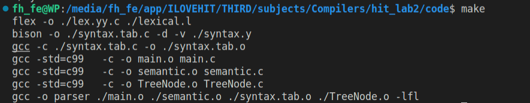

# 实验二 语义分析

<font face="华文琥珀" size=4>姓名：樊启元   学号：7203610712</font>

## 1. 实验完成情况

**完成所有必做内容以及选做所有内容：**

测试用例1-23均通过

完成C--语言文法的全部词义分析

完成C--语言文法函数声明

完成C--语言文法作用域的限制

完成C--语言文法结构等价定义

## 2. 编译方法

```
.
├── code
│   ├── enum.h
│   ├── lexical.l
│   ├── main.c
│   ├── makefile
│   ├── semantic.c
│   ├── semantic.h
│   ├── syntax.y
│   ├── TreeNode.c
│   └── TreeNode.h
├── lab2
│   └── image-20230413194347371.png
├── lab2.md
├── test
│   ├── test1.cmm
│   ├── ...
│   └── test23.cmm
├── 樊启元-7203610712-实验报告.pdf
└── 编译原理实验指导书-语义分析.doc

```

在 `code` 目录下输入 `make` 指令编译所有文件
在 `code` 目录下使用 `make test` 命令进行语义分析，对测试样例进行测试

## 3. 实验亮点

### 1. 利用错误恢复flag防止一个 B 类错误多次恢复

lab1 验收的样例中有一个错误恢复后引发了更多的错误恢复，所以命令行错误提示中出现了多次错误提示。先修改 lab1，设置一个 `recover_error_flag` ，当一个 B 类错误触发，在 `yyerror()` 中将错误恢复标志位置为 0，表示可以恢复。实现错误恢复后，将标志位置为 1 表示已经恢复过了，防止一个错误恢复多次。

### 2. 哈希函数的选择

这里使用哈希表的方法将函数名和变量名标定出来，防止在一个函数体或者命名空间中出现重命名现象。

这里选用的哈希表是 PJW 算法： 

该散列算法是基于贝尔实验室的彼得J温伯格的的研究。在*Compilers*一书中（原则，技术和工具），建议采用这个算法的散列函数的哈希方法。

```c
//int的位数与char位数的乘积 :   (32)
#define BITS_IN_int     ( sizeof(int) * CHAR_BIT )
//BITS_IN_int的3/4  :   (24)
#define THREE_QUARTERS  ((int) ((BITS_IN_int * 3) / 4))
//BITS_IN_int的1/8  :   (4)
#define ONE_EIGHTH         ((int) (BITS_IN_int / 8))
/*
    0按位取反位         1111 1111 1111 1111 1111 1111 1111 1111
    右移ONE_EIGHTH位   0000 1111 1111 1111 1111 1111 1111 1111
    再按位取反为        1111 0000 0000 0000 0000 0000 0000 0000
 */
// 0xF0000000
#define HIGH_BITS              ( ~((unsigned int)(~0) >> ONE_EIGHTH ))
// PJW 哈希算法
static inline unsigned int hash_pjw(char *name)
{
    unsigned int hash_value, i;
    for(hash_value = 0; *name; ++name) {
        // hash_value左移4位并在后8位加上name
        hash_value= (hash_value << ONE_EIGHTH) + *name;
        // 如果最高4位不全为零，即hash_value存放字符达到7个，第8个字符将无法存放。
        if ((i = hash_value & HIGH_BITS) != 0 ) {
            //hash_value与自己右移24位的结果按位异或并将最高4位全置为0，结果存入hash_value
            hash_value = ( hash_value ^ (i >> THREE_QUARTERS) ) & ~HIGH_BITS;
        }
    }
    return hash_value;
}
```

思路：

每次读入一个8位的字符；

先将原h左移4位，再加上读入的字符；

判断最高4位是否为0000（一般在第7次循环时候最高四位出现不全为零的情况）；

若不全为0，则用最高8位与第1-8位进行杂糅；

然后将最高4位改写为0000；

然后进行下一次循环，直至到达字符串的结尾。

 

一共进行了两种杂糅：

第一种，unsigned char型字符占8位，而h每次左移4位，这样每次读入的新字符的最高4位会与5-8位进行杂糅；

第二种，当循环执行到第7次或第7次之后，最高4位不全为0时，用最高8位和1-8位进行杂糅。


<font color=blue size=4>使用上面的 PJW ，哈希表的大小需要开到 0x0fffffff，遍历哈希表的时间也较长。</font>

按照这个原理简化一下 PJW 算法，将 28 位的哈希值减少为 14 位，将右移 4 位简化为右移 2 位。对于本实验不需要太多函数名和变量名的情况下，可以节省不少空间和时间。但是产生哈希冲突的可能也变大了。

```c
// (12)
#define THREE_EIGHTH    12
// (2)
#define ONE_SIXTEENTH   2
// 0x3ffff  :   (14)
#define HIGH_BITS       (unsigned int)14
// PJW 哈希算法
static inline unsigned int hash_pjw(char *name)
{
    unsigned int hash_value, i;
    for(hash_value = 0; *name; ++name) {
        // hash_value左移2位并在后8位加上name
        hash_value = (hash_value << ONE_SIXTEENTH) + *name;
        // 如果最高2位不全为零，即hash_value存放字符达到5个，第6个字符将无法存放。
        if ((i = hash_value & HIGH_BITS) != 0 ) {
            //hash_value与自己右移12位的结果按位异或并将最高(2)位全置为0，结果存入hash_value
            hash_value = ( hash_value ^ (i >> THREE_EIGHTH) ) & ~HIGH_BITS;
        }
    }
    return hash_value;
}
```

### 3. 哈希表

同时建立一个栈和一个哈希表，栈用来判断变量名是否在同一个作用域内；如果在一个作用域内，则利用哈希表查询是否发生哈希冲突。

哈希冲突的解决方法有：

1. 开地址法+线性探测：找到发生哈希冲突的桶，向后找到第一个没有存键值的位置，将目标存入
2. 拉链法：找到目标对应的桶，如果发生哈希冲突，则由该桶引出一条链（链表）来记录哈希值。这里使用头插法，每次将最新出现的发生哈希冲突的值存在桶连接的第一个节点上。

### 4. 扩展功能2.1

允许一个函数有一次定义和多次声明，第一次遇到函数声明或者定义时，记录函数的名称、返回值类型、参数类型、函数是否定义的 flag、函数第一次出现的行数，将其记录在 HashTable 中。后续再次遇到函数声明时，从根据函数名哈希表中找到对应的 item，逐项比对，如果有返回值或者参数类型不匹配或者重复定义，则报错。

最后检查符号表（哈希表）中的所有 item，如果是函数，根据标志位查看函数是否定义，如果没有定义，报错：函数未定义。

### 5. Makefile 文件

```makefile
# 编译器设定和编译选项
CC = gcc
FLEX = flex
BISON = bison
CFLAGS = -std=c99

# 编译目标：src目录下的所有.c文件
CFILES = $(shell find ./ -name "*.c")
OBJS = $(CFILES:.c=.o)
LFILE = $(shell find ./ -name "*.l")
YFILE = $(shell find ./ -name "*.y")
LFC = $(shell find ./ -name "*.l" | sed s/[^/]*\\.l/lex.yy.c/)
YFC = $(shell find ./ -name "*.y" | sed s/[^/]*\\.y/syntax.tab.c/)
LFO = $(LFC:.c=.o)
YFO = $(YFC:.c=.o)

parser: syntax $(filter-out $(LFO),$(OBJS))
	$(CC) -o parser $(filter-out $(LFO),$(OBJS)) -lfl

syntax: lexical syntax-c
	$(CC) -c $(YFC) -o $(YFO)

lexical: $(LFILE)
	$(FLEX) -o $(LFC) $(LFILE)

syntax-c: $(YFILE)
	$(BISON) -o $(YFC) -d -v $(YFILE)

-include $(patsubst %.o, %.d, $(OBJS))

# 定义的一些伪目标
.PHONY: clean test

test:
	./parser ../test/test1.cmm
	@echo ""
	./parser ../test/test2.cmm
	@echo ""
	./parser ../test/test3.cmm
	@echo ""
	./parser ../test/test4.cmm
	@echo ""
	./parser ../test/test5.cmm
	@echo ""
	./parser ../test/test6.cmm
	@echo ""
	./parser ../test/test7.cmm
	@echo ""
	./parser ../test/test8.cmm
	@echo ""
	./parser ../test/test9.cmm
	@echo ""
	./parser ../test/test10.cmm
	@echo ""
	./parser ../test/test11.cmm
	@echo ""
	./parser ../test/test12.cmm
	@echo ""
	./parser ../test/test13.cmm
	@echo ""
	./parser ../test/test14.cmm
	@echo ""
	./parser ../test/test15.cmm
	@echo ""
	./parser ../test/test16.cmm
	@echo ""
	./parser ../test/test17.cmm
	@echo ""
	./parser ../test/test18.cmm
	@echo ""
	./parser ../test/test19.cmm
	@echo ""
	./parser ../test/test20.cmm
	@echo ""
	./parser ../test/test21.cmm
	@echo ""
	./parser ../test/test22.cmm
	@echo ""
	./parser ../test/test23.cmm
	@echo ""

clean:
	rm -f parser lex.yy.c syntax.tab.c syntax.tab.h syntax.output
	rm -f $(OBJS) $(OBJS:.o=.d)
	rm -f $(LFC) $(YFC) $(YFC:.c=.h)
	rm -f *~
```

执行过程如下：

 

### 6. 实验验收要求

同学们好@全体成员 ，为了提高实验课验收效率，后两次实验采取代码评测的方式进行程序验收。简单的说就是同学们在验收前将代码打包发送至课程邮箱中，代码会在助教电脑上进行统一验收。（我们会有专门的评测程序，抽取几个测试样例并比对输出结果）

1.   提交的代码中应包含 Makefile 文件，可以通过 make parser 命令生成名为 parser 的可执行文件。
2.   程序应当能以 ./parser test1.cmm 的方式运行，并将结果打印出来（输出到标准输出流）。请尽量确保输出格式符合要求（例如实验二的 Error type [错误类型] at Line [行号]: [说明文字]. ），不要有 debug 信息等多余的输出。
3.   请同学们于实验课结束前将代码以 zip 形式打包发送到 hitbianyi2023@163.com，邮件主题和压缩包命名：编译原理实验二-代码-姓名-学号
4.   测试系统为 Ubuntu 22.04，如有特殊情况（例如编译不通过，或者你希望在 Windows 上进行开发，仍旧可以采用实验 1 时的方法将测试文件用 U 盘拷到你的电脑上运行）请大家实验课带上电脑，便于在出现问题时用本机环境重新测试。

> 为了实现助教的要求，需要把所有样例放到 `code` 文件夹下

