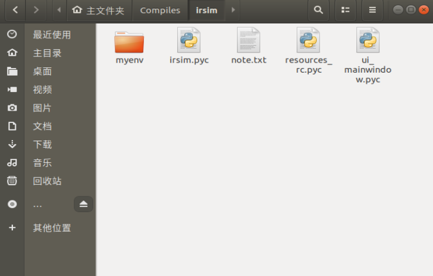
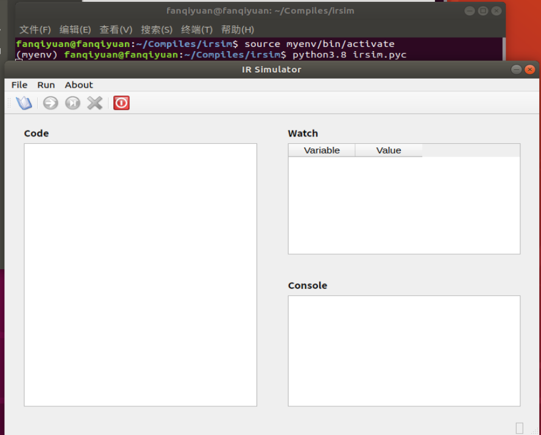
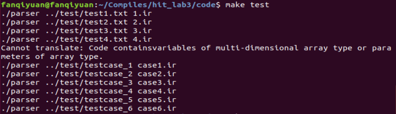
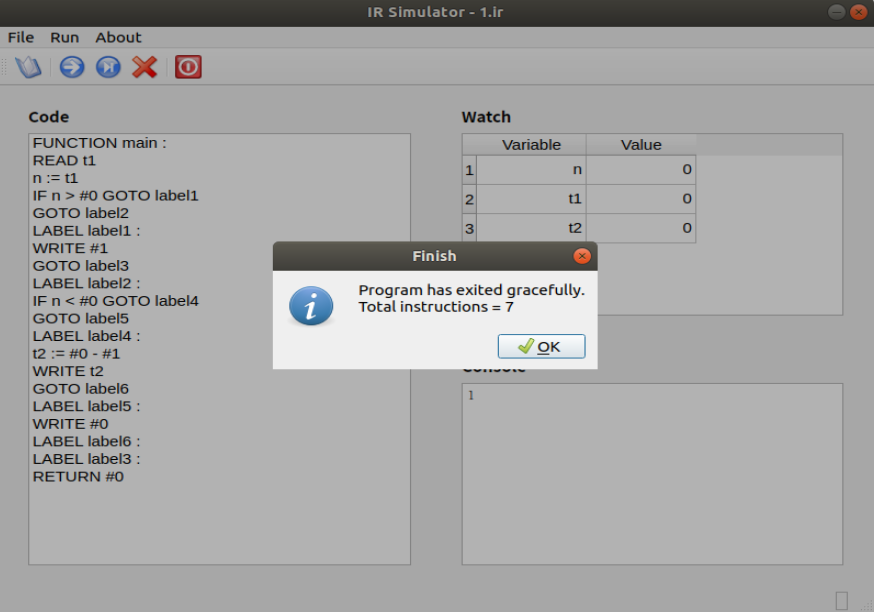
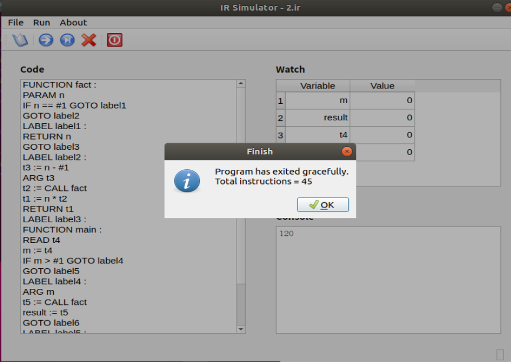
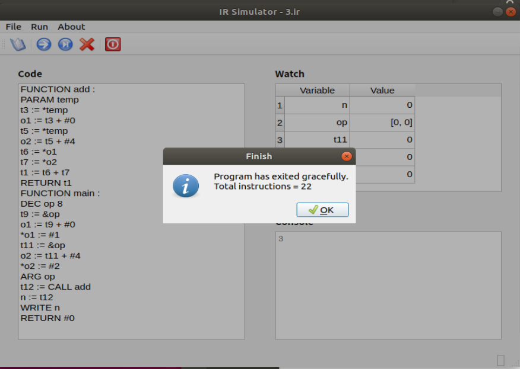

# 实验三 语义分析

## 1. 实验完成情况

**完成所有必做内容以及选做3.1内容：**

## 2. 编译方法

在 `code` 目录下输入 `make` 指令编译所有文件
在 `code` 目录下使用 `make test` 命令进行中间代码生成，对测试样例进行测试

## 3. 实验过程

### 3.1 配置虚拟机小程序环境

解压 `虚拟机小程序执行文件irsim.zip` ，里面放着虚拟机小程序的生成文件

<font color=blue>以我用的 `Ubuntu 18.04` 为例。其默认安装 `python2.7` 和 `python3.6` ，首先安装 `python3.8` </font>

在 Ubuntu 18.04 上默认安装的 Python 版本是 Python 3.6，因此默认的 pip 版本也与之对应。如果你希望在使用 `pip` 命令时默认使用 Python 3.8 的版本，可以按照以下步骤操作：

1.  确认 Python3.8 和 Python3.8-pip 已经安装：

```shell
sudo apt-get update
sudo apt-get install python3.8 python3.8-dev python3.8-venv python3.8-distutils python3.8-tk
```

2.   创建一个新的虚拟环境并激活它：

```shell
python3.8 -m venv myenv
source myenv/bin/activate
```

3.   升级 pip 到最新版本：

```shell
python -m pip install --upgrade pip
```

现在，当你在虚拟环境中启动 `pip` 命令时，它将使用 Python3.8 的 pip 版本。

你可以通过运行 `pip -V` 来检查 `pip` 版本是否已经更改为 Python3.8 的版本。

sh

<font color=blue>想要运行虚拟机小程序，还得使用 pip3.8 安装 pyqt5</font>

在 Python3.8 的虚拟环境中安装 PyQt5，你可以按照以下步骤进行操作：

1.  激活 Python3.8 的虚拟环境：

```shell
source myenv/bin/activate
```

1.  安装 PyQt5 和其依赖项：

```shell
pip install pyqt5
```

如果你使用的是 Ubuntu 18.04，还需要安装 Qt5 的开发包：

```shell
sudo apt-get install qtbase5-dev
```

1.  验证 PyQt5 是否已经成功安装：

```shell
python -c "import PyQt5"
```

如果没有任何错误，则说明 PyQt5 已经成功安装并且可以用于编程了。

在虚拟环境中安装 PyQt5 后，你就可以使用 Python3.8 和 PyQt5 来编写应用程序了。


<font color=blue>我把虚拟环境创建来文件夹 `irsim` 下</font>

 

在虚拟环境中，运行如下命令，虚拟机小程序就运行起来了。

```shell
python3.8 irsim.pyc 
```

 

### 3.2 发现实验二的 hashtable 生成的有问题

发现实验二的 hashtable 的深度记录有问题，但是实验二过了就很奇妙。

用火炬抢救了一波，最近忙炸了，如果实验之前有时间的话，再找找自己的问题，希望还有机会。

果然，在几乎没有摸鱼的爆肝三、四天后，实验验收了，没来得及检查自己的bug，HIT编译原理实验，再见啦！

## 4. 实验亮点

**基本数据结构分析**

在 `𝑖𝑛𝑡𝑒𝑟. ℎ` 文件中:

*   Operand 和 interCode 的结构体定义参考实验指导书，按照实验要求，采用链表式的 IR

*   C-- 中结构体作为参数传递时是通过传址完成，所以可将其看作类似数组的数据结构，循环遍历获得偏移量offset查表得到其中各变量；于是加入一个地址指针，实现低维数组与结构体相关的中间代码生成

**低维数组访问**

在 `𝑖𝑛𝑡𝑒𝑟. 𝑐` 文件中:

*   根据假设，Exp1只会展开为 Exp DOT ID 或 ID，所以让前一种情况将 ID 作为 name，回填至 place，返回到至 base 处，同时在语义分析时将结构体变量也添加至表中（因为假设无重名）这使得两种情况都可以查表得到

*   第二种情况ID[Exp],则需要对ID取址，如果前面是结构体内访问，则会返回一个地址类型，不需要再取址

**结构体访问**

在 `𝑖𝑛𝑡𝑒𝑟. 𝑐` 文件中:

*   两种情况，如果将Exp直接为一个变量，则需要先取址；若Exp为数组，或多层结构体访问，或结构体作为形参，则将target填成地址，直接调用

*   为了访问结构体内部定义的数组，需要把id名通过place回传给上层

**代码优化及分析过程**

在 `𝑖𝑛𝑡𝑒𝑟. 𝑐` 文件中:

*   并未做过多优化，仅针对直接使用的符号与立即数，不创建新临时变量。

*   先进行语义分析，若无语法错误，再遍历语法树生成 IR

## 5. 实验结果

 

 

 

 