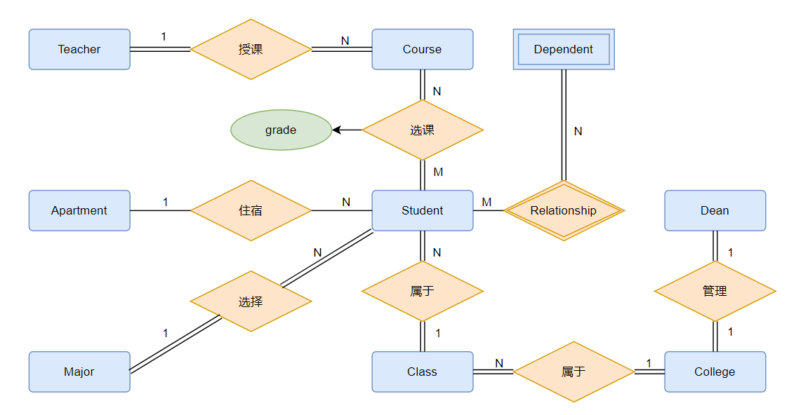

# 数据库 lab2

>   Java 语言，JavaFX 框架。

## 1. E-R 图

>   E-R 图文件，`ER.drawio` ，可在网站 `https://app.diagrams.net/` 打开编辑。




### 9 个实体

 

 

 

### 8 种关系

<font color=blue size=4>联系型约束</font>

*   **基数比（cardinality radio）** ：刻画实体型参与到联系型种的<font color=red>最大基数</font>

    

*   **存在依赖约束（existence dependency constraint）/参与度约束（participation constraint）** ：刻画实体型参与到联系型中的<font color=red>最小基数</font>

     

1.   老师授课

     *   基数比：(1:N)一名老师可以教多门课，一门课只能被1个老师教。
     *   存在依赖约束：每名老师至少教1门课（ **全部参与** ），每门课至少有一名老师教（ **全部参与** ）。

      

2.   学生选课：

     *   基数比：(M:N)一名学生可以选多门课，一门课可以被多名学生选。

     *   存在依赖约束：每个学生至少选1门以上的课（ **全部参与** ），每门课都要有学生选（ **全部参与** ）。

     *   选课自带一个成绩属性。

          

3.   学生属于班级：

     *   基数比：(1:N)每个学生只能有1个班级，每个班级可以有多名学生。

     *   存在依赖约束：每个学生至少属于一个班级（ **全部参与** ），每个班级至少有一个学生（ **全部参与** ）。

          

4.   学生住宿

     *   基数比：(N:1)每个学生只能有1个寝室，每个寝室可以有多名学生。
     *   存在依赖约束：可以有学生没有宿舍（走读）（ **部分参与** ），可以有寝室空着（ **部分参与** ）。

      

5.   班级属于学院

     *   基数比：(N:1)每个班级只能属于一个学院，每个学院可以有多个班级。
     *   存在依赖约束：每个班级至少包含在1个学院内（ **全部参与** ），每个学院至少有1个班级（ **全部参与** ）。

      

6.   学生选择专业

     *   基数比：(N:1)每个学生只能有一个专业，每个专业可以有多个学生。
     *   存在依赖约束：每个学生至少有1个专业（ **全部参与** ），每个专业至少有1个学生（ **全部参与** ）。

      

7.   院长管理学院

     *   基数比：(1:1)每个院长只能管理一个学院，每个学院只能有一个院长。
     *   存在依赖约束：每个院长至少管理一个学院（ **全部参与** ），每个学院至少被一个院长管理（ **全部参与** ）。

      

8.   学生家属

     *   基数比：(M:N)每个学生可以有多个家属，每个家属可能同时有几个孩子是学生。
     *   存在依赖约束：学生可能没有家属（很可怜）（ **部分参与** ），是学生家属至少有一个学生与其是家属关系（ **全部参与** ）。

      

### 数据库具体数据，及数据库创建

```sql
CREATE DATABASE School;

USE School;

-- 创建实体
CREATE TABLE Teacher(
    teacher_id      INT NOT NULL AUTO_INCREMENT,
    teacher_name    text,
    teacher_salary  int,
    PRIMARY KEY(teacher_id)
);

CREATE TABLE Dean(
    dean_id       	INT NOT NULL AUTO_INCREMENT,
    dean_name     	text,
    dean_salary   	int,
    PRIMARY KEY(dean_id)
);

CREATE TABLE Class(
    class_id        INT NOT NULL AUTO_INCREMENT,
    class_name      text,
    PRIMARY KEY(class_id)
);

CREATE TABLE Apartment(
    apartment_id    INT NOT NULL AUTO_INCREMENT,
    apartment_name  text,
    PRIMARY KEY(apartment_id)
);

CREATE TABLE Course(
    course_id       varchar(12),
    course_name     text,
    teacher_id		int,
    teacher_name    text,
    credit          text,
    PRIMARY KEY(course_id),
    FOREIGN KEY(teacher_id) REFERENCES Teacher(teacher_id) on delete cascade -- 外键约束，级联删除
);

CREATE TABLE College(
    college_id      INT NOT NULL AUTO_INCREMENT,
    college_name    text,
    dean_id       	int,
    dean_name     	text,
    PRIMARY KEY(college_id),
    FOREIGN KEY(dean_id) REFERENCES Dean(dean_id) on delete cascade -- 外键约束，级联删除
);

CREATE TABLE Major(
    major_id        INT NOT NULL AUTO_INCREMENT,
    major_name      text,
    PRIMARY KEY(major_id)
);

CREATE TABLE Student(
    student_id      varchar(12),
    student_name    text,
    apartment_id    int,
    apartment_name  text,
    class_id		int,
    class_name      text,
    college_id		int,
    college_name    text,
    PRIMARY KEY(student_id),
    FOREIGN KEY(apartment_id) REFERENCES Apartment(apartment_id) on delete cascade, -- 外键约束，级联删除
    FOREIGN KEY(class_id) REFERENCES Class(class_id) on delete cascade, -- 外键约束，级联删除
    FOREIGN KEY(college_id) REFERENCES College(college_id) on delete cascade -- 外键约束，级联删除
);

CREATE TABLE Dependent(
    dependent_name  varchar(12),
    student_id      varchar(12),
    student_name    text,
    relationship    text,
    PRIMARY KEY(student_id, dependent_name),
    FOREIGN KEY(student_id) REFERENCES Student(student_id) on delete cascade -- 外键约束，级联删除
);

CREATE TABLE SC( -- 学生成绩表
    student_id      varchar(12),
    student_name    text,
    course_id       varchar(12),
    course_name     text,
    grade           text,
    PRIMARY KEY(student_id, course_id),
    FOREIGN KEY(student_id) REFERENCES Student(student_id) on delete cascade, -- 外键约束，级联删除
    FOREIGN KEY(course_id) REFERENCES Course(course_id) on delete cascade -- 外键约束，级联删除
);


-- 创建视图
-- ANY_VALUE() 用于忽略 ONLY_FULL_GROUP_BY 错误
CREATE VIEW ClassInfo AS
SELECT class_id AS cid, ANY_VALUE(class_name) AS cname, COUNT(class_id) AS tot_num
FROM Student
GROUP BY class_id;

    -- 为 cid 来源 Student 表中的 class_id 属性建立索引，加速检索
    CREATE INDEX class_id ON Student(class_id);

-- 创建视图，内连接查询学生选课与对应授课教师
CREATE VIEW StudentTeacher AS
SELECT S.student_id, S.student_name, S.course_name, C.teacher_name
FROM SC S INNER JOIN Course C
ON S.course_id = C.course_id;


-- 创建触发器
-- 建立回收站，将删除的学生信息放入 StuRecycleBin
CREATE TABLE StuRecycleBin(
    student_id      varchar(12),
    student_name    text,
    apartment_id    int,
    apartment_name  text,
    class_id		int,
    class_name      text,
    college_id		int,
    college_name    text,
    PRIMARY KEY(student_id)
);

-- 创建触发器，当学生被删除时，将包含该学生信息的元组放入回收站 StuRecycleBin
DELIMITER //
CREATE TRIGGER deleteStudent BEFORE DELETE ON Student
FOR EACH ROW
BEGIN
    INSERT INTO StuRecycleBin(student_id, student_name, apartment_id, apartment_name, class_id, class_name, college_id, college_name)
    VALUES(OLD.student_id, OLD.student_name, OLD.apartment_id, OLD.apartment_name,
           OLD.class_id, OLD.class_name, OLD.college_id, OLD.college_name
    );
END //
DELIMITER ;
```

## 2. 关系完整性约束

Course 中有 Teacher 的外键约束，teacher_id 是外键。

Student 中有 College 的外键约束，college_id 是外键。

Student 中有 Class 的外键约束，class_id 是外键。

College 中有 Dean 的外键约束，dean_id 是外键。

空值约束全为非空属性，具体约束方法后面程序中会体现。

## 3. 创建查询视图（建立索引）

>   写代码的过程，给每个实体创建一个表，表中包含该实体的属性。`M:N` 型的实体关系也要建表。
>
>   用视图将多个实体连接在一起。

将常用的列放在一切创建一个视图来查看。

创建一个 ClassInfo 视图，查看对于班级的总人数。新增学生或班级后，视图会自动更新。

```sql
-- 创建视图
-- ANY_VALUE() 用于忽略 ONLY_FULL_GROUP_BY 错误
CREATE VIEW ClassInfo AS
SELECT class_id AS cid, ANY_VALUE(class_name) AS cname, COUNT(class_id) AS tot_num
FROM Student
GROUP BY class_id;
```

为 ClassInfo 视图的成员 cid 建立索引：

>   即为其来源 Student 表中的 class_id 属性建立索引，加速检索。

```sql
CREATE INDEX class_id ON Student(class_id);
```

## 4. 插入、删除、连接查询、嵌套查询、分组查询

>   其中插入，删除操作需体现关系表的完整性约束，例如插入空值、重复值时需给予提示或警告等。
>
>   插入、删除很基础，这里就不赘述了。

**连接查询：** 查询学生上哪些课，由哪些老师教。SC 和 Course 表连接。

```sql
SELECT S.student_id, S.student_name, S.course_name, C.teacher_name
FROM SC S INNER JOIN Course C
ON S.course_id = C.course_id;
```

**嵌套查询：** 查询住在 A01 的学生的信号。

```java
"SELECT S.student_id, S.student_name, S.apartment_id, " +
    	"S.apartment_name, S.class_id, S.class_name, S.college_id, S.college_name " +
"FROM Apartment, Student AS S " +
"WHERE S.apartment_id = Apartment.apartment_id AND S.apartment_id IN ( " +
"   SELECT  Apartment.apartment_id " +
"   FROM Apartment " +
"   WHERE Apartment.apartment_name = \"" + name + "\" " +
")";
```

**分组查询和 HAVING 语句：** 查询寝室住的的学生数。

```java
"SELECT Apartment.apartment_name, count(*) AS " +
"FROM Apartment, Student "+
"WHERE Apartment.apartment_id = Student.apartment_id "+
"GROUP BY Apartment.apartment_name " +
"HAVING total >= 1";
```

## 5. 创建触发器

建立一个回收站

```sql
-- 创建触发器
-- 建立回收站，将删除的学生信息放入 StuRecycleBin
CREATE TABLE StuRecycleBin(
    student_id      varchar(12),
    student_name    text,
    apartment_id    int,
    apartment_name  text,
    class_id		int,
    class_name      text,
    college_id		int,
    college_name    text,
    PRIMARY KEY(student_id)
);

-- 创建触发器，当学生被删除时，将包含该学生信息的元组放入回收站 StuRecycleBin
DELIMITER //
CREATE TRIGGER deleteStudent BEFORE DELETE ON Student
FOR EACH ROW
BEGIN
    INSERT INTO StuRecycleBin(student_id, student_name, apartment_id, apartment_name, class_id, class_name, college_id, college_name)
    VALUES(OLD.student_id, OLD.student_name, OLD.apartment_id, OLD.apartment_name,
           OLD.class_id, OLD.class_name, OLD.college_id, OLD.college_name
    );
END //
DELIMITER ;
```

## 6. 事件管理

以添加学生为例：

1.   sql 语句执行后默认提交，这里取消默认提交；
2.   如果添加失败，进入错误恢复，将数据 rollback 到添加之前的情况，防止数据丢失或错乱；
3.   如果语句正常执行，则手动提交；
4.   最后修改回默认提交，避免影响其他语句的执行。

```java
    @FXML
    private void handleNewStudent() {
        try{
            List<Object> objects = this.showAddStudentView();
            boolean okClicked = (Boolean)objects.get(0);
            String sid = (String)objects.get(1);
            String sname = (String)objects.get(2);
            String aname = (String)objects.get(3);
            String clname = (String)objects.get(4);
            String coname = (String)objects.get(5);
            if (okClicked) {
                // 给数据库添加
                Statement stmt  = conn.createStatement();
                conn.setAutoCommit(false);  //将自动提交设置为false

                // 如果外键为空，则不插入该学生
                String sql =    "INSERT INTO Student(student_id, student_name, apartment_id, apartment_name, class_id, class_name, college_id, college_name) " +
                                "SELECT \"" + sid + "\", \"" + sname + "\", apartment_id, apartment_name, class_id, class_name, college_id, college_name " +
                                "FROM Apartment, Class, College " +
                                "WHERE \"" + aname + "\" = Apartment.apartment_name AND \"" + clname + "\" = Class.class_name AND \"" + coname + "\" = College.college_name";
                stmt.executeUpdate(sql);

                refreshTableStudent();
                conn.commit();
                conn.setAutoCommit(true);
            }
        }catch(SQLIntegrityConstraintViolationException e){
            try{
                conn.rollback(); // 回滚
                conn.setAutoCommit(true);
                Alert alert = new Alert(Alert.AlertType.WARNING);
                alert.setHeaderText("由于唯一性索引约束，部分域非法导致添加失败！");
                alert.setContentText("该学生已经存在，请修改！");
                alert.showAndWait();
            }catch(Exception e1){
                e1.printStackTrace();
            }
        }catch(Exception e){
            e.printStackTrace();
        }
    }
```

