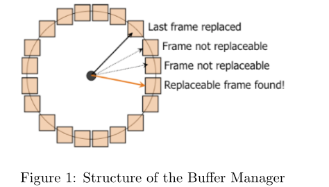
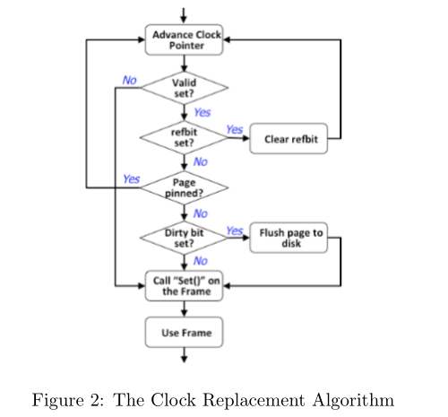

# lab3

## 1. 缓冲区管理器实现

### 一、实验指导（project2）：

#### 1. Introduction

BadgerDB项目的目标是让您亲身了解RDBMS的关键组件。在这个项目中，您需要在提供的存储管理器之上实现一个缓冲区管理器。

#### 1.1 The BadgerDB I/O Layer

BadgerDB数据库系统的最低层是I/O层。这一层允许系统的上层创建/销毁文件，在文件中分配/释放页面，以及读/写文件的页面。

这一层由两个类组成:文件(类file)和页面(类page)类。这些类使用c++异常来处理任何意外事件的发生。为您提供了File类、Page类和异常类的实现。在 Linux 中解压BufMgr.zip，在BufMgr文件夹下安装（`sudo apt install make`）并使用 `make` 命令。然后安装oxygen（`sudo apt install oxygen`），使用命令 `make doc` 然后打开 `doc/index.html` 查看已实现的类及其方法的描述。

#### 1.2 The BadgerDB Buffer Manager

数据库缓冲池是一组固定大小的内存缓冲区，称为帧，用于保存从磁盘读入内存的数据库页（也称为磁盘块）。页是驻留在主存中的磁盘和缓冲池之间的传输单位。大多数现代dbms使用至少8,192字节的页大小。另一个需要注意的重要事项是，内存中的数据库页是第一次读入时磁盘上相应页的精确副本。一旦页面从磁盘读取到缓冲池，DBMS软件就可以更新存储在页面上的信息，从而使缓冲池中的副本与磁盘上的副本不同。这样的页面被称为“dirty”。

由于磁盘上的数据库本身通常大于缓冲池可用的主内存，因此在任何给定时间，内存中只能容纳数据库页面的一个子集。缓冲区管理器用于控制哪些页面驻留在内存中。每当缓冲区管理器接收到对数据页的请求时，缓冲区管理器都会检查所请求的页是否已经在构成缓冲池的某个帧中。如果是，缓冲区管理器只返回一个指向该页的指针。如果没有，缓冲区管理器将释放一个帧(如果该页是脏的，则可能通过将该页包含的页写入磁盘)，然后将请求的页从磁盘读入已释放的帧。

简而言之，就是I/O层为Unix文件提供了一个面向对象的接口，其中包含打开/关闭文件和读取/写入文件页面的方法。现在，您需要知道的关键事情是打开一个文件(通过传入一个字符串名称)返回一个file类型的对象。该类具有读取和写入文件页面的方法。

您将使用这些方法在磁盘和缓冲池之间移动页面。

##### 1.2.1 Buffer Replacement Policies and the Clock Algorithm（缓冲区替换策略和时钟算法）

当需要一个空闲框架时，有很多方法可以决定替换哪个页面。操作系统中常用的策略有FIFO、MRU和LRU。尽管LRU是最常用的策略之一，但它有很高的开销，并且在数据库系统中出现的许多常见情况下并不是最好的策略。相反，许多系统使用近似LRU行为的时钟算法，并且速度快得多。



图1显示了缓冲池的概念布局。在图1中，每个方框对应缓冲池中的一个帧。假设缓冲池中包含numBufs帧，编号为0 ~ numBufs−1。

从概念上讲，缓冲池中的所有帧都排列在一个循环列表中。与每一帧相关联的位称为refbit。每次访问缓冲池中的页面时（通过对缓冲管理器的 `readPage()` 调用），相应帧的refbit被设置为true。在任何时间点，时钟指针（值在0和numBufs−1之间的整数)都以顺时针方式前进（使用模块化算法，因此它不会超过numBufs−1）。对于时针经过的每一帧，refbit都会被检查并清除。如果设置了该位，则对应的帧已被“最近”引用，而不会被替换。另一方面，如果refbit为假，则选择该页面进行替换(假设它没有固定-固定页面将在下面讨论）。如果选定的缓冲帧是脏的（即，它已被修改），则当前占用该帧的页面将被写回磁盘。否则，该帧将被清除，并从磁盘读入一个新的页面到该位置。图2演示了时钟算法的执行。时钟算法的细节如下所示。



##### 1.2.2 The Structure of the Buffer Manager（缓冲区管理器的结构）

BadgerDB缓冲区管理器使用了三个c++类:BufMgr、BufDesc和BufHashTbl。BufMgr类只有一个实例。该类的一个关键组件是实际的缓冲池，它由numBufs帧数组组成，每个帧的大小与数据库页面的大小相同。除了这个数组之外，BufMgr实例还包含一个BufDesc类的numBufs实例数组，用于描述缓冲池中每个帧的状态。散列表用于跟踪当前驻留在缓冲池中的页面。这个散列表是由BufHashTbl类的一个实例实现的。这个实例是BufMgr类的私有数据成员。下面将详细描述这些类。

`The BufHashTbl Class` BufHashTbl 类用于将文件和页码映射到缓冲池帧，并使用链式桶散列实现。我们已经提供了这个类的实现供您使用。

#### 2. 实验部分提示

```c++
The BufMgr Class. The BufMgr class is the heart of the buffer manager. This is where you should write
your new code for this project.
class BufMgr
{
private:
    FrameId clockHand; // clock hand for clock algorithm
    BufHashTbl *hashTable; // hash table mapping (File, page) to frame number
    BufDesc *bufDescTable; // BufDesc objects, one per frame
    std::uint32_t numBufs; // number of frames in the buffer pool
    BufStats bufStats; // statistics about buffer pool usage
    void allocBuf(FrameId & frame); // allocate a free frame using the clock algorithm
    void advanceClock(); // advance clock to next frame in the buffer pool
public:
    Page *bufPool; // actual buffer pool
    BufMgr(std::uint32_t bufs); // constructor
    ~BufMgr(); // destructor
    void readPage(File* file, const PageId PageNo, Page*& page);
    void unPinPage(File* file, const PageId PageNo, const bool dirty);
    void allocPage(File* file, PageId& PageNo, Page*& page);
    void disposePage(File* file, const PageId pageNo);
    void flushFile(const File* file);
};
```

*   `BufMgr(const int bufs)`

    这是类的构造函数。为缓冲池分配一个数组，其中包含bufs页帧和相应的BufDesc表。当分配缓冲池时，所有帧都将处于清除状态。哈希表也将以空状态开始。我们已经提供了构造函数。

*   `~BufMgr()`

    清除所有脏页并重新分配缓冲池和buffdesc表。

*   `void advanceClock()`

    将时钟提前到缓冲池中的下一帧。

*   `void allocBuf(FrameId& frame)`

    使用时钟算法分配空闲帧;如有必要，将脏页写回磁盘。如果所有缓冲帧都被固定，抛出BufferExceededException。这个私有方法将被下面描述的readPage()和allocPage()方法调用。确保如果分配的缓冲帧中有一个有效的页面，则从哈希表中删除相应的条目。

    >   按照上面图二的流程图实现即可。

*   `void readPage(File* file, const PageId PageNo, Page*& page)`

    首先，通过调用lookup()方法检查页面是否已经在缓冲池中，当页面不在缓冲池中时，该方法可能会在哈希表上抛出HashNotFoundException，以获取帧号。根据lookup()调用的结果，有两种情况需要处理:

    *   情况1：Page不在缓冲池中。调用allocBuf()来分配一个缓冲帧，然后调用file->readPage()方法将页面从磁盘读入缓冲池帧。接下来，将页面插入哈希表。最后，在框架上调用Set()以正确设置它。Set()将为设置为1的页面留下pinCnt。通过page参数返回一个指向包含该页的帧的指针。

    *   情况2：页面在缓冲池中。在这种情况下，设置适当的refbit，增加页面的pinCnt，然后通过page参数返回一个指向包含页面的帧的指针。

*   `void unPinPage(File* file, const PageId PageNo, const bool dirty)`

    减少包含(file, PageNo)的帧的pinCnt值，如果dirty == true，则设置dirty位。如果引脚计数已经为0，则抛出pagenotpin。如果在哈希表查找中没有找到页，则不执行任何操作。

*   `void allocPage(File* file, PageId& PageNo, Page*& page)`

    该方法的第一步是通过调用file->allocatePage()方法在指定的文件中分配一个空页。这个方法将返回一个新分配的页面。然后调用allocBuf()来获取缓冲池帧。接下来，将一个条目插入哈希表，并在框架上调用Set()以正确设置它。该方法通过pageNo参数将新分配的页的页码返回给调用者，并通过page参数将指向为该页分配的缓冲帧的指针返回给调用者。

*   `void disposePage(File* file, const PageId pageNo)`

    此方法从文件中删除特定的页面。在从文件中删除该页之前，它确保如果要删除的页在缓冲池中被分配了一个帧，那么该帧将被释放，并相应地从哈希表中删除条目。

*   ` void flushFile(File* file)`

    应该扫描bufTable中属于该文件的页面。对于遇到的每个页面，它应该:(a)如果页面是脏的，调用file->writePage()将该页刷新到磁盘，然后将该页的脏位设置为false， (b)从哈希表中删除该页(无论该页是干净的还是脏的)，以及(c)调用BufDesc的Clear()方法来处理该页帧。

    如果文件的某些页面被固定，抛出PagePinnedException。如果遇到属于文件的无效页面，则抛出BadBufferException。

>   pinPage是为了在读取等从disk到buffer的操作时，Page被锁定，不能做其他操作，来保证数据操作的安全。

### 二、实验过程

#### 1. 代码自动格式化

解压出来的代码缩进简直不忍直视，先快速利用 CLion 将代码 Reformat 一下，不然太难受了。

使用 snap 安装 CLion ：参考博客：https://blog.csdn.net/ChuiGeDaQiQiu/article/details/114324796

1.   snap安装

     `sudo apt-get install snapd`

     `sudo apt-get install snapcraft `

2.   安装 clion

     `sudo snap install clion`

     如果报如下错误：

      

     使用命令 `sudo snap install clion --classic`

申请学生免费使用权限，登入 CLion 即可。或者八仙过海各显神通。实在不行就使用1个月呗，先写个作业再说。

使用 CLion 打开工程文件：

1.   选中要进行代码自动格式化的文件夹，或选中要格式化的文件。
2.   `Code -> Auto-Indent Lines`
3.   `Code -> Reformat Code`

或者觉得麻烦的话，直接在 Windows 上用 CLion 将代码 Reformat 之后，再放入虚拟机。可能会有一些编码异常吧(●'◡'●)

代码整齐多了，舒服了，开始实验。

#### 2. 函数实现

函数实现细节，见代码，按照上面对每个函数的提示，逐句还原即可，真是手把手教学ಥ_ಥ

#### 3. 检查

`make`

`./src/badgerdb_main`

## 2. 文档二选一

带有 B+ 树的实现，我好感兴趣

https://github.com/Huissan/HIT-Database-SQLEXP4

最近太忙了，有更重要的事要做，加上这个仓库代码我跑不通，就搁置了，遗憾。