# 作业2-7203610712-樊启元

## T1

**一、设有关系模式 R(A,B,C,D,E,F)，其函数依赖关系为**
$$
F={AB→C,BC→AD,D→E,CF→B,AB→D}
$$
**1.求 $(𝐴𝐵)_𝐹^+$**

<font color=blue>解：</font>
$$
(𝐴𝐵)_𝐹^+ = \{A,B,C,D,E\}
$$
**2.求 R 的极小函数依赖集**

**思路：** 

1）函数依赖右部分解 

2）删除函数依赖左部冗余

3）删除冗余函数依赖

<font color=blue>解：</font>

（1）右部分解：
$$
F = \{AB\rightarrow C, BC\rightarrow A, BC\rightarrow D, D\rightarrow E, CF\rightarrow B, AB\rightarrow D\}
$$
（2）删除函数依赖左部冗余（依赖的决定因素为单属性时不用检查）

$AB\rightarrow C$

```
    A→C，求(A)+不包含 C，所以 B 不冗余。
    B→C，求(B)+不包含 C，所以 A 不冗余。
```

$BC\rightarrow A$

```
    B→A，求(B)+不包含 A，所以 C 不冗余。
    C→A，求(C)+不包含 A，所以 B 不冗余。
```

$CF\rightarrow B$

```
    C→B，求(C)+不包含 B，所以 F 不冗余。
    F→B，求(F)+不包含 B，所以 C 不冗余。
```

$AB\rightarrow D$

```
    A→D，求(A)+不包含 D，所以 B 不冗余。
    B→D，求(B)+不包含 D，所以 A 不冗余。
```

（3）删除冗余函数依赖

*   判断 $AB\rightarrow C$ 是否冗余： $G_1 = \{BC\rightarrow A, BC\rightarrow D, D\rightarrow E, CF\rightarrow B, AB\rightarrow D\}$ 

    $(AB)_{G_1}^+ = ABDE$ 不包含 $C$ 所以不冗余

*   判断 $BC\rightarrow A$ 是否冗余： $G_2 = \{AB\rightarrow C, BC\rightarrow D, D\rightarrow E, CF\rightarrow B, AB\rightarrow D\}$ 

    $(BC)_{G_2}^+ = BCDE$ 不包含 $A$ 所以不冗余

*   判断 $BC\rightarrow D$ 是否冗余： $G_3 = \{AB\rightarrow C, BC\rightarrow A, D\rightarrow E, CF\rightarrow B, AB\rightarrow D\}$ 

    $(BC)_{G_3}^+ = ABCDE$ 包含 $D$ 所以冗余，去掉该函数依赖，此时函数依赖集变为
    $$
    F = \{AB\rightarrow C, BC\rightarrow A, D\rightarrow E, CF\rightarrow B, AB\rightarrow D\}
    $$

*   判断 $D\rightarrow E$ 是否冗余： $G_4 = \{AB\rightarrow C, BC\rightarrow A, CF\rightarrow B, AB\rightarrow D\}$ 

    $(D)_{G_4}^+ = D$ 不包含 $E$ 所以不冗余

*   判断 $CF\rightarrow B$ 是否冗余： $G_5 = \{AB\rightarrow C, BC\rightarrow A, D\rightarrow E, AB\rightarrow D\}$ 

    $(CF)_{G_5}^+ = CF$ 不包含 $B$ 所以不冗余

*   判断 $AB\rightarrow D$ 是否冗余： $G_6 = \{AB\rightarrow C, BC\rightarrow A, D\rightarrow E, CF\rightarrow B\}$ 

    $(AB)_{G_6}^+ = ABC$ 不包含 $D$ 所以不冗余

去掉左部依赖多余的属性之后：
$$
F = \{AB\rightarrow C, BC\rightarrow A, D\rightarrow E, CF\rightarrow B, AB\rightarrow D\}
$$


综上所述，去掉多余的依赖后得到最小函数依赖集:
$$
F = \{AB\rightarrow C, BC\rightarrow A, D\rightarrow E, CF\rightarrow B, AB\rightarrow D\}
$$
**3.求 R 的候选码（键）**

<font color=blue>解：</font>

**步骤一：**

$L = F$

$R = E$

$LR = ABCD$

$N = \emptyset$

**步骤二：**

$X = L \cup N = \{F\}$

$X_R^+ = F$ 不等于R

在 $LR$ 中选择属性加入其中求闭包：

$\{AF\}_R^+ = AF$ 

$\{BF\}_R^+ = BF$ 

$\{CF\}_R^+ = CFBADE = R$ 所以 $CF$ 是一个候选码  \*

$\{DF\}_R^+ = DFE$

 从剩下的 $\{ABD\}$ 中选择两个加入 X 中继续求闭包：

$\{ABF\}_R^+ = ABFCDE = R$ 所以 $ABF$ 是一个候选码 \*

 $\{ADF\}_R^+ = ADFE$

$\{DEF\}_R^+ = DEF$

综上所述：

R的候选码为： $\{CF,ABF\}$

**4. 将 R 进行分解，使其成为具有无损连接和保持函数依赖的 3NF**

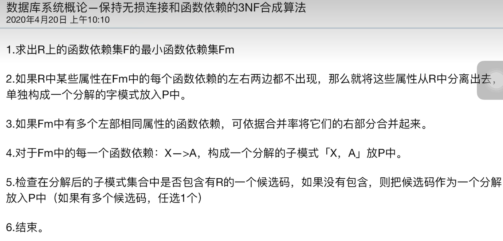

<font color=blue>解：</font>

（1）求最小函数依赖集（2）R中所有所有属性均出现在函数依赖中（3）合并相同左部
$$
F = \{AB\rightarrow CD, BC\rightarrow A, D\rightarrow E, CF\rightarrow B\}
$$
（4）将每个函数依赖构成子模式：$R_1(ABCD)$ $R_2(BCA)$ $R_3(DE)$  $R_4(CFB)$ 

（5）至少有一个候选码包含在其中

（6）R1和R2有包含关系，再次合并的到其具有无损连接和保持函数依赖的 3NF
$$
\rho = 	\{R_1(ABCD),R2(DE),R_3(BCF)\}
$$

## T2

二、考虑关系模式 R(A, B, C, D, E, F)，其函数依赖集为 F={AC→EF, B→CE, C→B, AB→D,E→F}

1)求解 R 的最小函数依赖集

<font color=blue>解：</font>
$$
F=\{B\rightarrow C, B \rightarrow E, C \rightarrow B, AB \rightarrow D, E \rightarrow F\}
$$
>   注意，这里运算顺序不同可能产生不同的结果，其中 $B \rightarrow E$ 换成 $C \rightarrow E$ 也是正确的。

2)列举 R 的全部候选键

<font color=blue>解：</font>
$$
\{AB,AC\}
$$

## T3

三、假设有以下关系模式 `R：R(A,B,C,D,E,F,G) ` 其中，以下依赖关系成立：

{A} → {B,C}
{B,C} → {D,E}
{D} → {F}
{E} → {G}

请回答以下问题：
**1.求出 R 的函数依赖集和候选码。**

<font color=blue>解：</font>

**依赖集：**
$$
F=\{A \rightarrow B, A \rightarrow C, BC \rightarrow D, BC \rightarrow E, D \rightarrow F, E \rightarrow G\}
$$
**候选码：**
$$
\{A\}
$$
**2.判断 R 是否符合第三范式。**

<font color=blue>解：</font>

主属性为 A，非主属性为 B,C,D,E,F,G
由 A → BC，BC → DE 可知，存在非主属性 D，E 传递函数依赖于候选键 A，故 R 不符合第三范式

 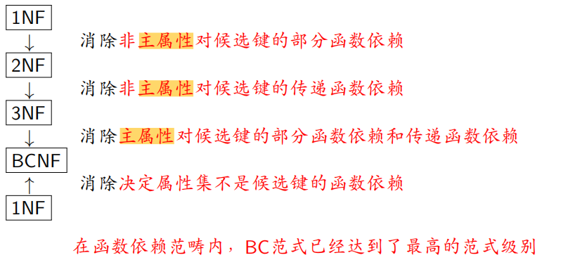

## T4

四、有一个房屋租赁信息表：

`Rental (CNo, CName, PNo, PAddr, STime, ETime, Rent, ONo, OName, OPhone)`
表中各属性的含义为：

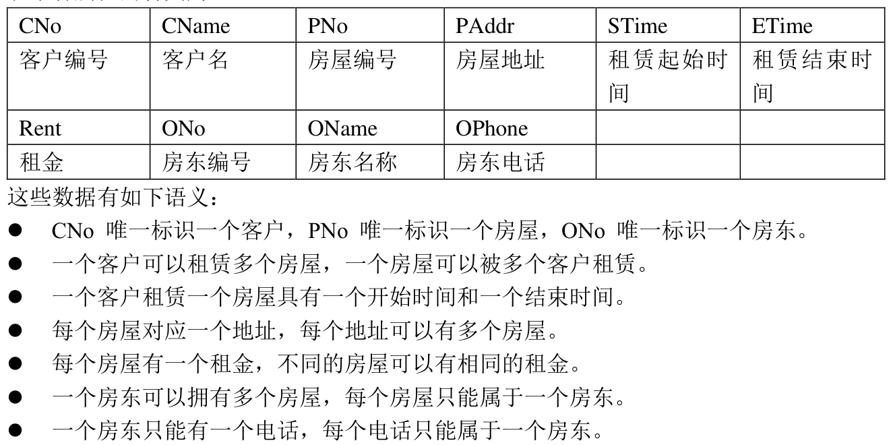

**(1) 根据上述语义写出关系 Rental 的函数依赖集 F，并求 F 的极小函数依赖集 Fm。**

<font color=blue>解：</font>

```
F = {
	 CNo → CName,
	 {CNo, PNo} → {STime, ETime},
	 PNo → {PAddr, Rent, ONo},
	 ONo → {OName,  OPhone},
	 OPhone → ONo
}
```

```
Fm = {
	 CNo → CName,
	 {CNo, PNo} → STime,
	 {CNo, PNo} → ETime,
	 PNo → PAddr,
	 PNo → Rent,
	 PNo → ONo,
	 ONo → OName,
	 ONo → OPhone,
	 OPhone → ONo
}
```

**(2) 判断关系 Rental 所达到的最高范式等级。**

<font color=blue>解：</font>

关系 Rental 的候选键为 {CNo, PNo}，主属性为 CNo, PNo, 其余属性为非主属性

首先，显然 Rental ∈ 1NF。而由于 CNo → CName，即存在非主属性 CName 部分函数依赖于候选键，

故Rental不符合第二范式，因此 Rental 所达到的最高范式等级为 1NF

**(3) 将 Rental 分解为具有无损连接性和保持函数依赖的 3NF。**

<font color=blue>解：</font>

（1）求最小函数依赖集（2）R中所有所有属性均出现在函数依赖中（3）合并相同左部

```
F = {
	 CNo → CName,
	 {CNo, PNo} → {STime, ETime},
	 PNo → {PAddr, Rent, ONo},
	 ONo → {OName,  OPhone},
	 OPhone → ONo
}
```

（4）将每个函数依赖构成子模式：`R1=(CNo CName)` `R2=(CNo PNo STime ETime)` `R3=(PNo PAddr Rent ONo)` `R4=(ONo OName  OPhone)`  `R5=(OPhone ONo)`  

（5）至少有一个候选码包含在其中

（6）R4和R5有包含关系，再次合并的到其具有无损连接和保持函数依赖的 3NF

ρ = { `R1=(CNo CName)`， `R2=(CNo PNo STime ETime)`， `R3=(PNo PAddr Rent ONo)`， `R4=(ONo OName  OPhone)` }

## T5

五、
1.已知一棵 B+树，如下图所示

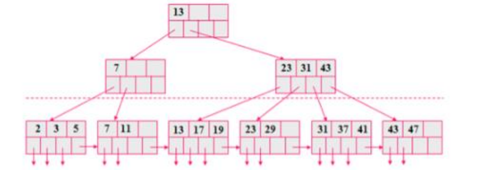

请画出插入 38 后所得的 B+树。

<font color=blue>解：</font>

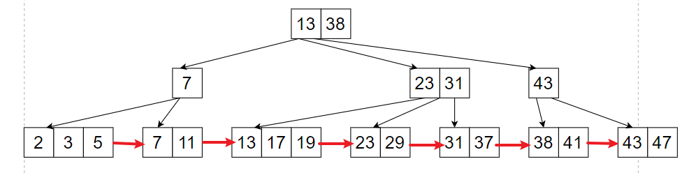

2.已知一棵 B+树，如下图所示

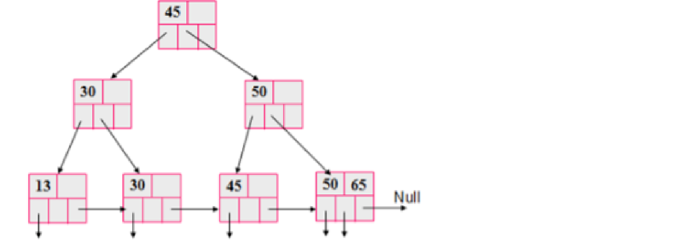

请画出删除 30 后的 B+树。

<font color=blue>解：</font>

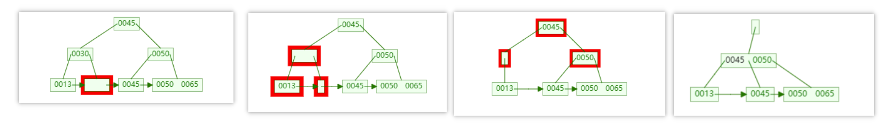

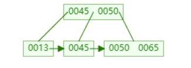


## T6

六、利用线性 hash 方法对以下记录进行 hash 存储：
`5, 19, 24, 26, 35, 48, 53, 61`
设 hash 函数 h(x)= x mod 16，请画出请画出添加以上所有元素后，最终的索引结构以及关键步骤（进行桶的线性增长时）的索引结构。
注：线性 hash 表中最多容纳nbθ个记录，θ = 0.85；初始哈希桶结构为下图。

 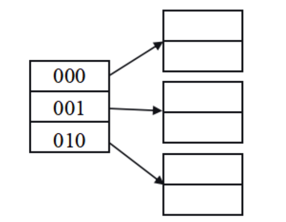

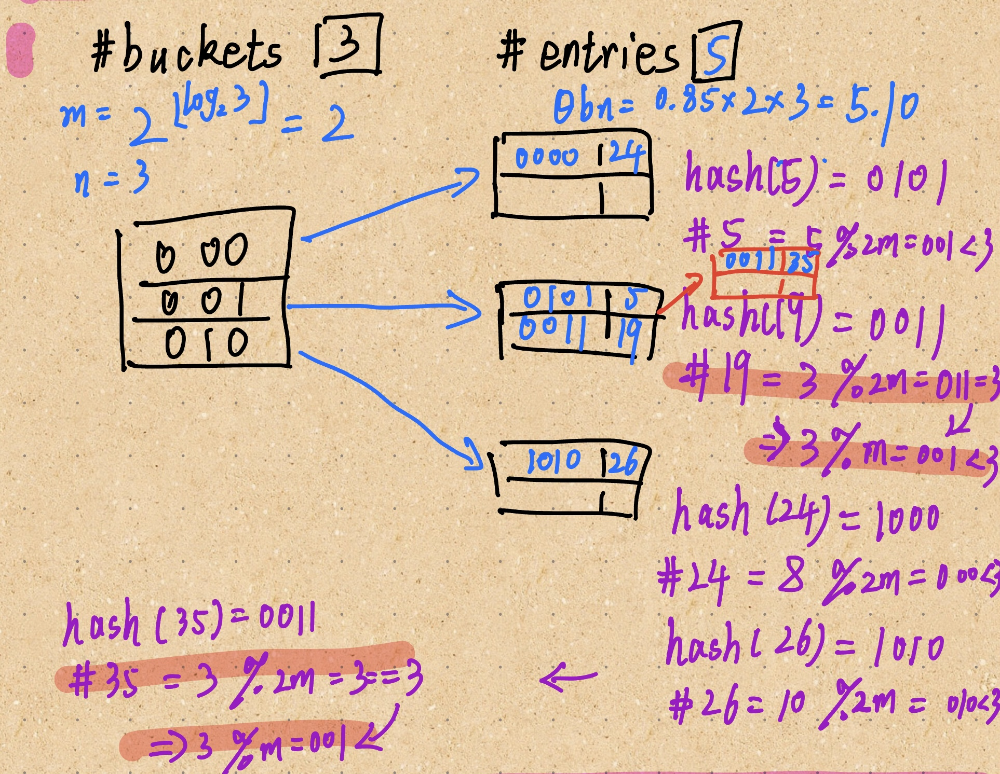

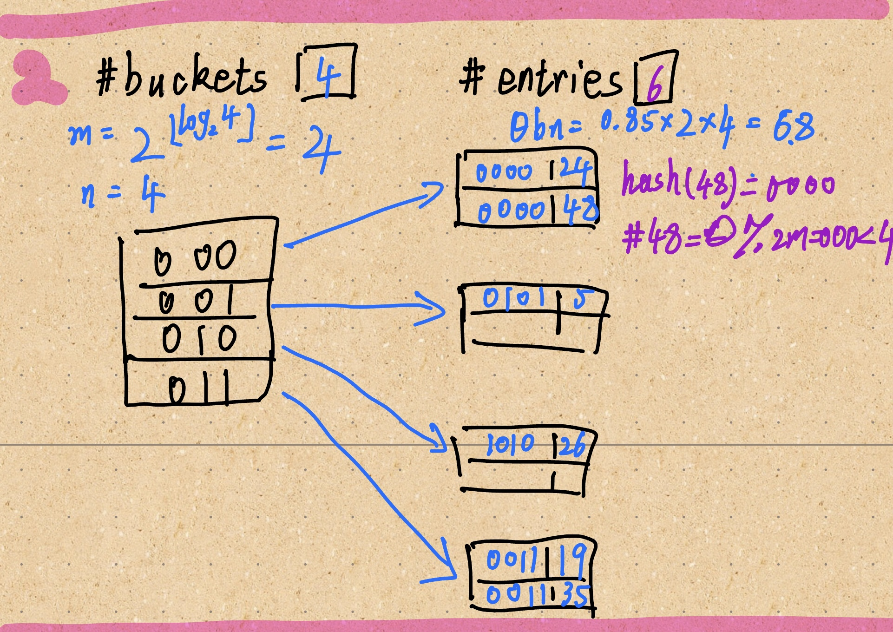


## T7

七、利用可扩展 hash 方法对以下记录进行 hash 存储：

`3, 16, 20, 21, 30, 44, 47, 61`

设 hash 函数 h(x)= x mod 16，其中散列函数 h(k) 是一个 b (足够大)位二进制序列，序列的前 d 位用作索引，来区分每个元素属于哪个。现要求每个桶至多包含 2 个元素，以上元素按从左往右的顺序依次添加。开始时只使序列的前 1 位作索引（即 d=1），当桶满时进行分裂，d 相应增大。请画出添加完以上所有元素后，最终的索引结构。


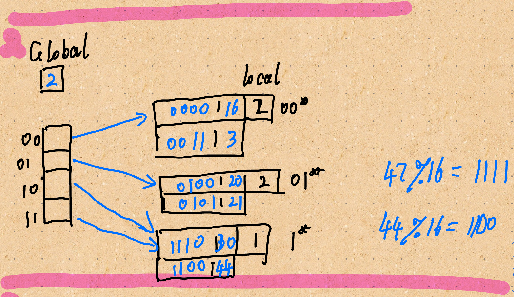


## 参考内容

求最小函数依赖：https://www.cnblogs.com/linfangnan/p/16683327.html

bilibili宝藏教程：https://www.bilibili.com/video/BV1JY4y1X7xE?p=4&spm_id_from=pageDriver&vd_source=e7300d5accad8932a257efb8871bb9ee

3NF合成算法： https://www.bilibili.com/video/BV1bt4y127GB/?spm_id_from=333.999.0.0&vd_source=e7300d5accad8932a257efb8871bb9ee

B+Tree：http://data.biancheng.net/view/61.html

B+Tree演示网站： https://cmudb.io/btree
