# 作业3

7203610712 樊启元

## T1

已知 2 个关系 R(A, B)和 S(B, C)，其主键分别为 R.A 和 S.B。R 有 20000 个元组，S 有 60000 个元组，一块中可以容纳 20 个 R 元组或 30 个 S 元组。设 2 个关系均采用聚簇存储，且每个关系中的元组均已按照其主键值递增排序。现在要执行自然连接操作 R ⨝ S。设缓冲区中可用内存页数为 M = 41。回答下列问题：

(1) 采用嵌套循环连接算法执行 R ⨝ S 分别需要进行多少次 I/O？给出具体分析过程。

(2) 采用归并连接算法执行 R ⨝ S 分别需要进行多少次 I/O？给出具体分析过程。

>   注意，此时 R 和 S 都已经按照主键排序了，要连接，就要都按照 B 排序，将 R 划分为有序的归并段，然后归并连接。

(3) 设 R.B 是关系 R 的外键，参照 S.B。如果 R ⨝ S 的结果中元组的平均大小是R 中元组平均大小的 1.2 倍，R ⨝ S 的结果中元组的平均大小是 S 中元组平均大小的 2 倍，那么在外存中存储 R ⨝ S 的结果需要占用多少个块（页）？给出具体分析过程。

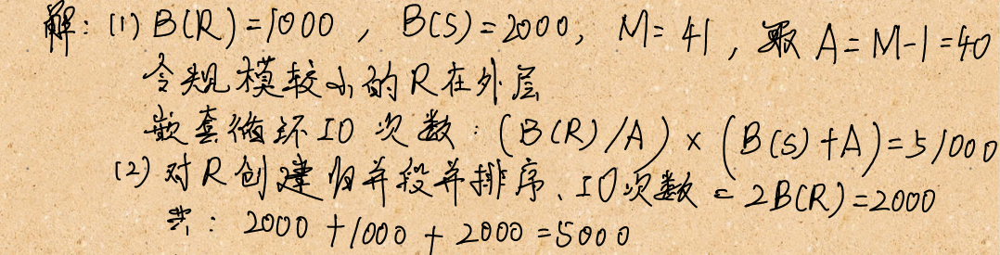

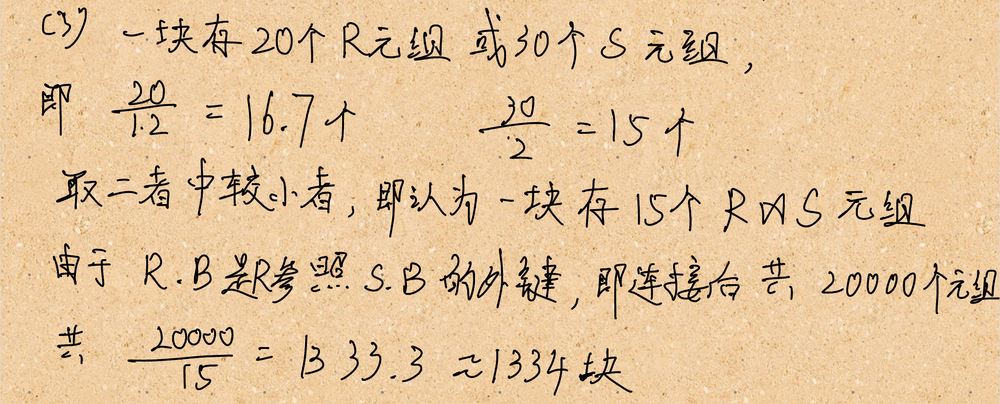

## T2

设关系 R(X, Y)和 S(Y, Z)，R 共有 1000 个元组，S 共有 1500 个元组，每个块中可容纳 20 个 R 元组或 30 个 S 元组。S 中 Y 不同值的个数为 20。

(1) 若在 S.Y 上建有聚簇索引，估计 R 和 S 基于索引连接的 IO 代价。

(2) 若在 S.Y 上建有非聚簇索引，估计 R 和 S 基于索引连接的 IO 代价。

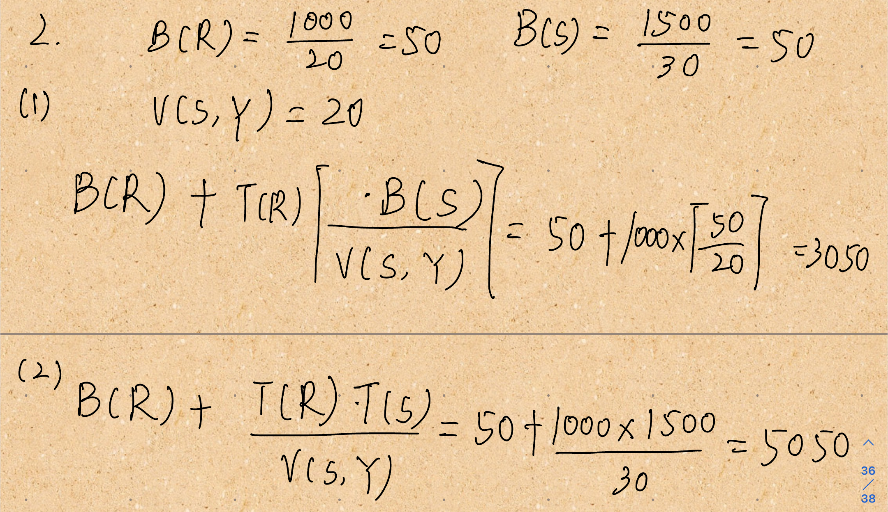

## T3

设教学管理数据库有如下 3 个关系模式：

```sql
S(S#, SNAME, AGE, SEX)

C(C#, CNAME, TEACHER)

SC(S#, C#, GRADE)
```

其中 S 为学生信息表、SC 为选课表、C 为课程信息表；S#、C#分别为 S、C 表的主码，(S#, C#)是 SC 表的主码，也分别是参照 S、C 表的外码用户有一查询语句：

```sql
Select SNAME 

From S, SC, C 

Where SC.S#=S.S# and SC.C#=C.C# and CNAME=“数据库”
```

检索选学“数据库”课程的学生的姓名。

(1)写出以上 SQL 语句所对应的关系代数表达式。

(2)画出上述关系代数表达式所对应的查询计划树。使用启发式查询优化算法，对以上查询计划树进行优化，并画出优化后的查询计划树。

(3)设 SC 表有 10000 条元组，C 表有 50 条元组，S 表中有 1000 条元组，SC中满足选修数据库课程的元组数为 150，计算优化前与优化后的查询计划中每一步所产生的中间结果大小

 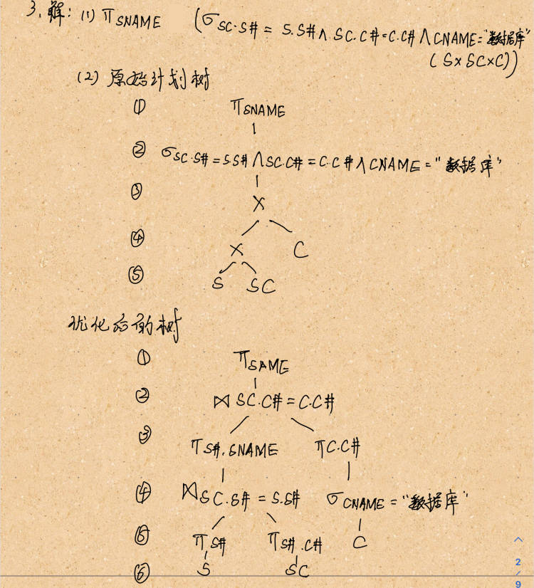

 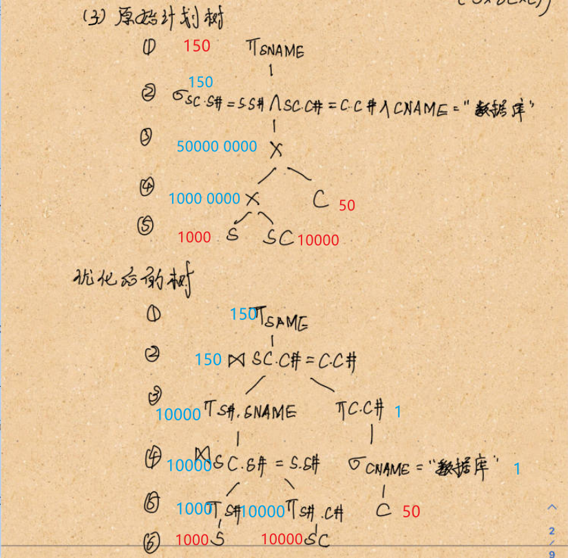

## T4

给定以下关系模式，

```sql
Rabbit (rid, name, color)

Carrot (cid, weight, type)

Allocation (rid, cid, date)
```

(1) 考虑以下的 SQL 查询语句，绘制其查询计划树。

```sql
SELECT C.type

FROM Rabbit R, Carrot C, Allocation A

WHERE R.rid = A.rid

AND C.cid = A.cid

AND R.name = ‘Tutu’

AND C.weight > 100

AND C.weight < 500
```

(2) 假设在 Rabbit.name 和 Allocation.rid 上建有索引，绘制优化后的查询计划树。

 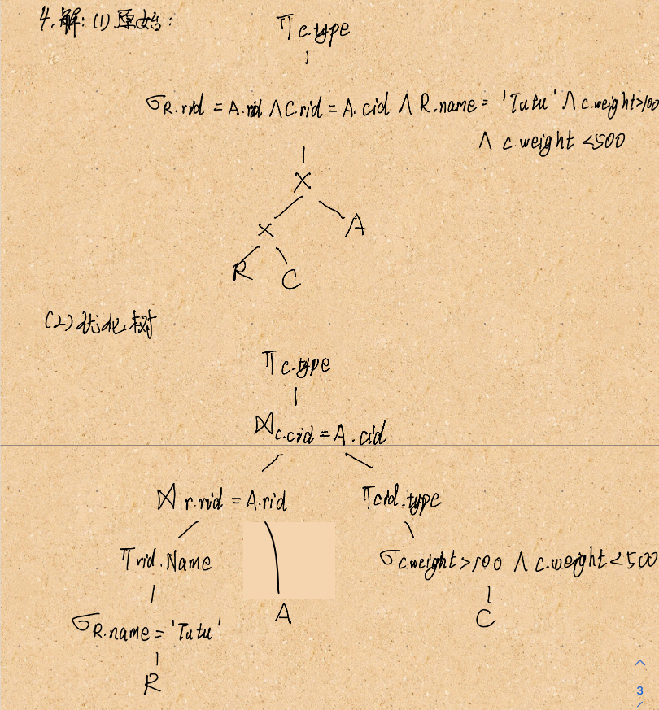

## T5

已知一个关系数据库的模式如下：

关系 B(bno, bname, author)为图书表，其中 bno 为书号，bname 为书名，author 为作者；

关系 S(sno, sname, dept)为学生表，其中 sno 为学号，sname 为姓名，dept 为学生所在系；

关系 L(sno, bno, date)为借书表，其中 sno 为学号，bno 为书号，date 为借书时间。

回答下列问题：

(1) 绘制下面的 SQL 查询语句的逻辑查询计划树。

```SQL
SELECT bname FROM B NATURAL JOIN S NATURAL JOIN L

WHERE date = ‘2021-06-04’ AND college = ‘CS’;
```

(2) 使用启发式查询优化方法对上面的逻辑查询计划树进行优化，绘制优化后得到的逻辑查询计划树，具体说明你进行这些优化的理由。

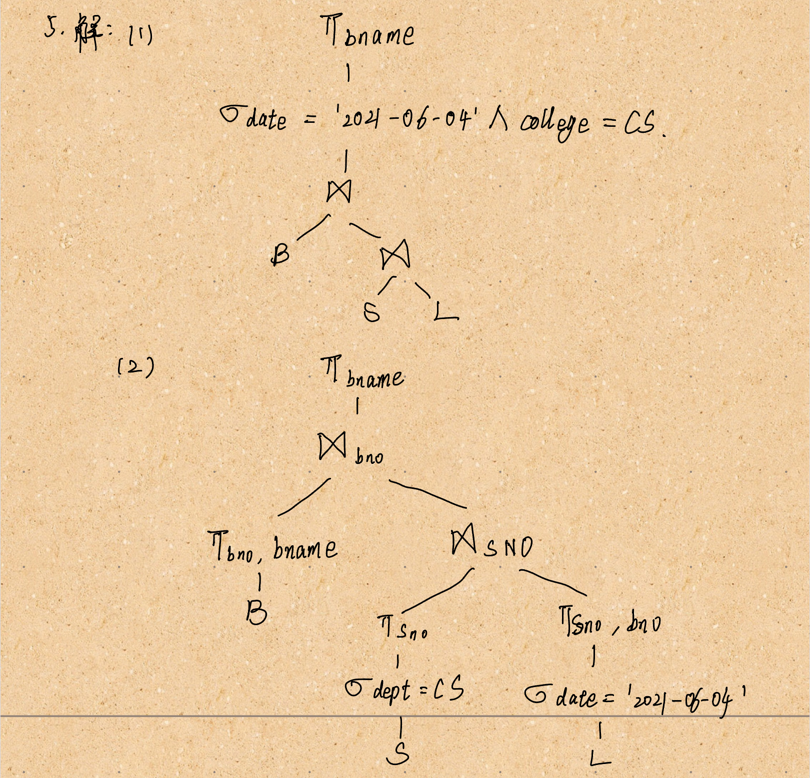

## T6

设 ri(X)与 wi(X)分别表示事物 Ti 读、写数据单元 X，则一个并发调度可以抽象为读、写串。基于上述表示，请判断下面两个并发调度是否是可串行化的，为什么？

调度 S：

𝑟2 (𝐴); 𝑟1 (𝐵); 𝑤2 (𝐴); 𝑟3 (𝐴); 𝑤1 (𝐵); 𝑤3 (𝐴); 𝑟2 (𝐵); 𝑤2(𝐵)

调度 S’：

𝑟2 (𝐴); 𝑟1 (𝐵); 𝑤2 (𝐴); 𝑟2 (𝐵); 𝑟3 (𝐴); 𝑤1 (𝐵); 𝑤3 (𝐴); 𝑤2(𝐵)

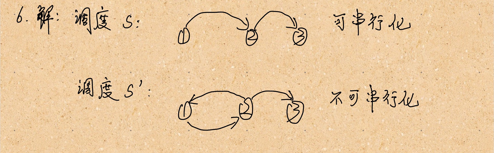

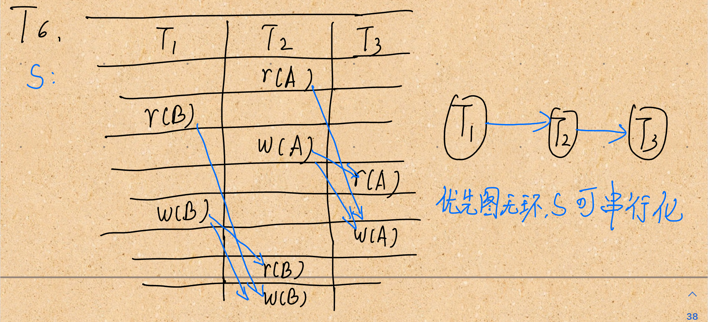

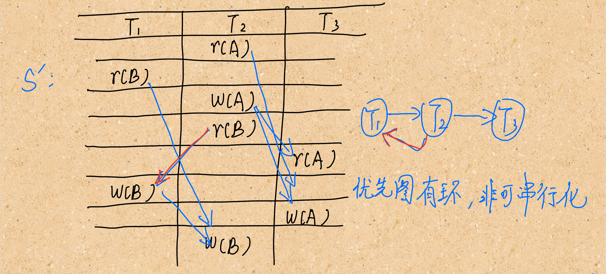

## T7

已知下⾯两个事务：

回答下列问题：

(1) 简述两段锁协议（简称 2PL），并给事务 T1 和 T2 添加加锁和解锁指令，使其遵从 2PL 协议。

(2) 按照你添加的加锁和解锁指令，给出 2PL 下对 T1 和 T2 的⼀个正确的调度.

(3) 什么情况下，T1 和 T2 会发⽣死锁？请给出一个会发生死锁的调度。

(4) 在数据库的实际应用中经常会遇到的与锁相关的异常情况，请简述一下常见的死锁检测方法


 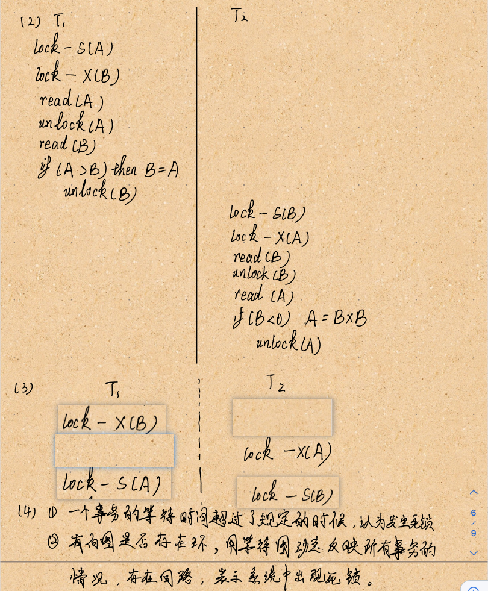

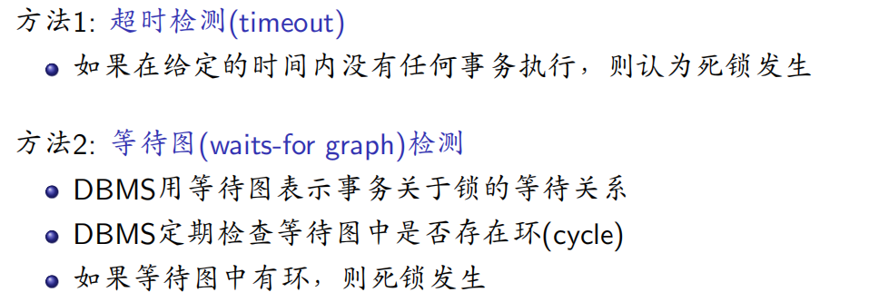

## T8

已知某数据库采用即时更新方法（undo-redo 方法）记录 WAL 日志。设故障发生时 WAL 日志文件内容如下：

```
<T1, begin> 
<T1, A, 114, 114514> 
<T2, begin> 
<T1, B, “hit”, “hitcs”> 
<T1, commit> 
<T3, begin> 
<T3, B, “hitcs”, “hitcsdb”> 
<T2, A, 114514, 1919810>
```

当系统重启后，DBMS 基于该 WAL 日志文件进行故障恢复。回答下列问题：

(1) 该数据库系统的的日志恢复策略为 Undo/Redo 型，那么其对应的缓冲区处理策略是什么？该策略的每一项的具体内容都有什么？

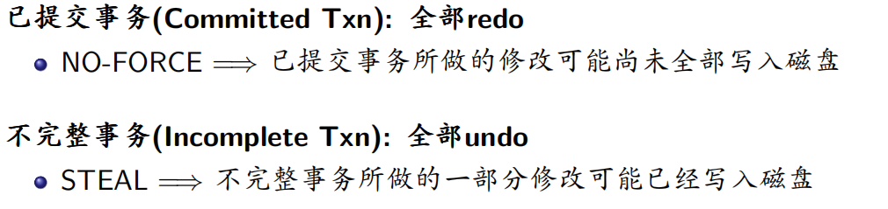

(2)当 DBMS 进行故障恢复时，需要对那些事务进行 undo？对那些事务进行redo？给出具

(3) 当故障恢复完成时，对象 A 和 B 的值分别是什么？描述故障恢复的具体过程。

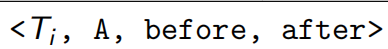

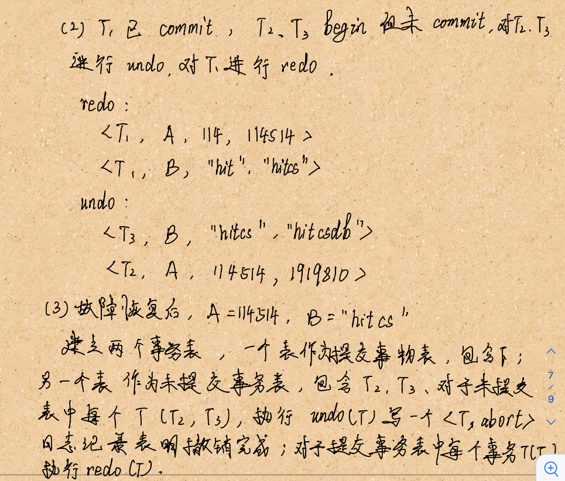

 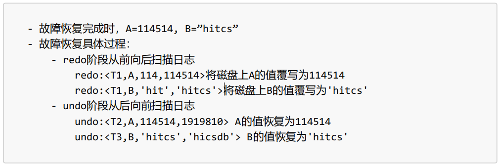

## T9

使用检查点的数据库恢复系统将根据事务的状态和检查点的关系采取相对应的恢复策略，现在有事务𝑇1-𝑇5其执行过程如下图所示（线段左端和右端分别表示事务开始与提交），其执行过程中数据库系统发生如图所示的故障，请回答下列问题

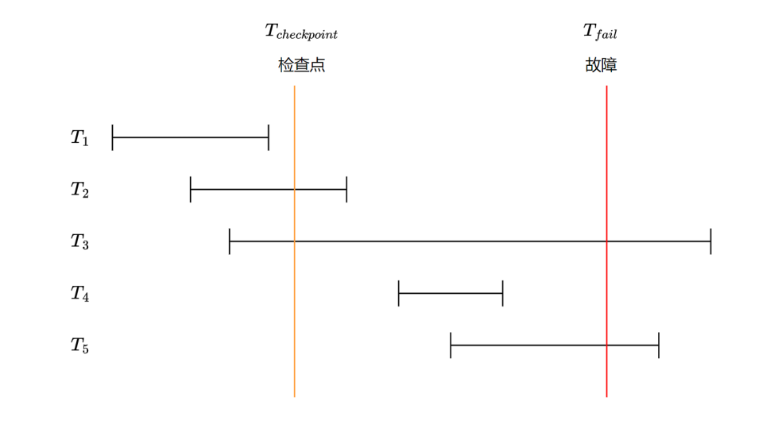

(1)请问在故障恢复时事务𝑇1-𝑇5那些需要撤销，那些需要重做，那些不需要操作？

(2)事务𝑇6-𝑇8 的日志文件如下图所示,`<𝑇𝑖，begin>`表示事务𝑇𝑖开始执行，`<𝑇𝑖，commit>`表示事务𝑇𝑖提交，`<𝑇𝑖，D，𝑉1，𝑉2>`表示事务𝑇𝑖 将数据项 D 的值由𝑉1修改为𝑉2，`<crash>`表示数据库发生故障

```
<𝑇6, begin> 
<𝑇6, X, 100, 1> 
<𝑇7, begin> 
<𝑇7, X, 1,3>
<𝑇8, begin> 
<𝑇7, Y, 50, 6>
<𝑇8, Y, 6, 8>
<𝑇8, Z, 10, 9>
<checkpoint>
<𝑇6,commit>
<𝑇8,Z,9,10>
<crash>
```

数据库系统发生故障时，请给出恢复子系统时需要 undo 的事务列表和需要redo 的事务列表

(3)请简述事务𝑇6-𝑇8 在系统故障后，基于检查点的故障恢复过程

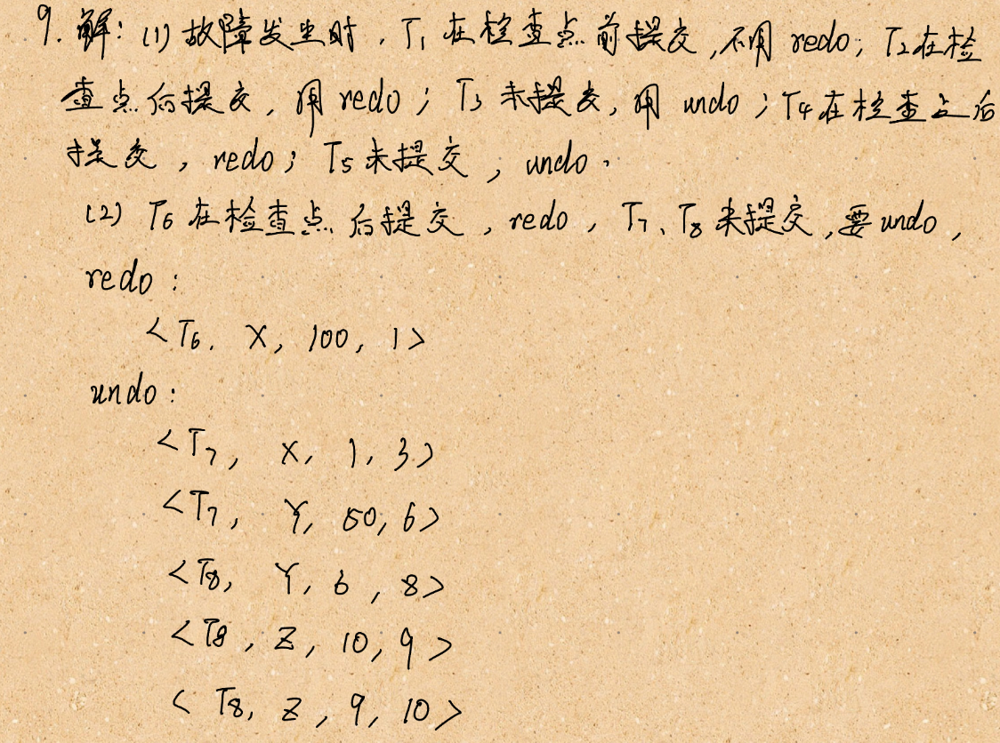

（3）

T6 在检查点之后提交，需要 redo

T7 和 T8 在检查点之后未提交，其所有操作需要 undo。