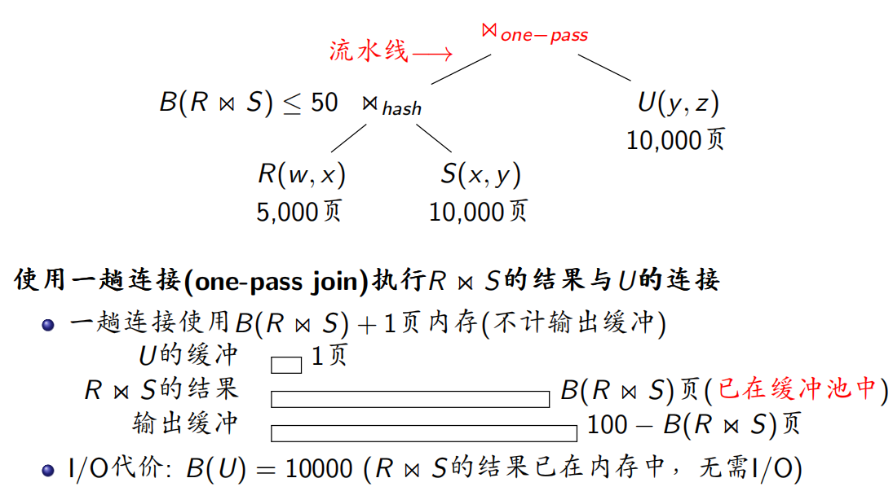
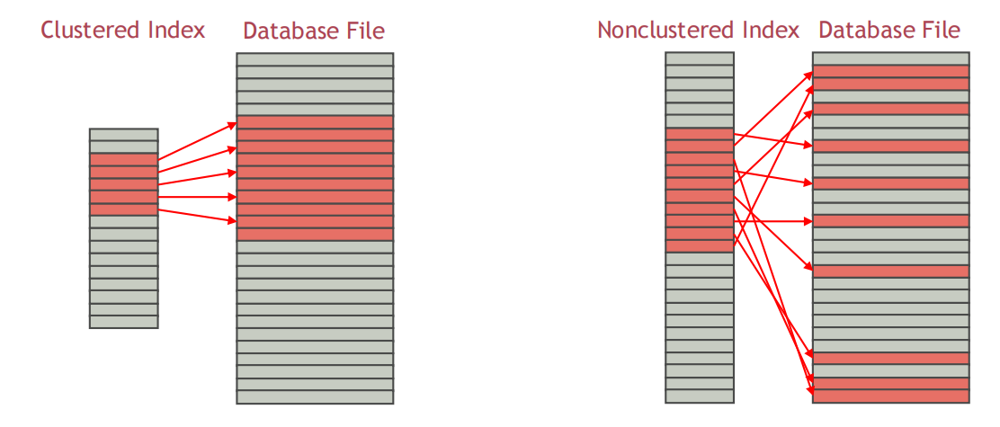
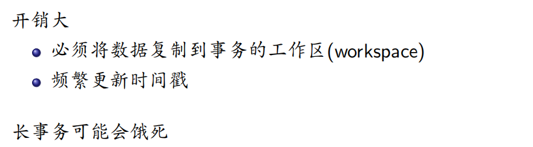

# 数据库期末复习

关于简答题的知识总结，推荐一个成电大佬的总结：[地址](https://www.bilibili.com/read/cv22665009?from=search)

## 第2章: 关系数据库(Relational Databases)

### 2.1 关系数据模型(Relational Data Model)

**关系数据模型的三要素**

1.   关系数据结构

2.   关系操作

3.   关系完整性约束：

     完整性约束(integrity constraints): 关系数据库中的所有数据必须满足的约束条件

     完整性约束的类型

     1.   实体完整性(entity integrity)

          *   关系中任意元组的主键值必须唯一(unique)

          *   关系中任意元组在主键中的属性值非空(not null)

     2.   参照完整性(referential integrity)

          *   *F*的值为空

          *   若*F*的值不为空，则*F*的值必须在*S*中存在

     3.   用户定义完整性(user-defifined integrity)

### 2.2 关系代数(Relational Algebra)

## 第5章: 逻辑数据库设计(Logical Database Design)

### 范式之间的关系

## 第9章: 查询执行(Query Execution)

### 1 Overview

*   SQL 解析器（SQL Parser）: 将一个 SQL 查询转换成关系代数表达式

*   查询优化器：将一个关系代数表达式转换为一个执行效率最高得等价关系代数表达式，并最终转换为一个查询计划（query execution plan）。

*   查询执行计划（Query Execution Plan）：用于执行一个查询的原语操作序列

    

    >   原语操作(primitive operation)是带有“如何执行”注释的关系代数操作。

### 2 External Sort

External Merge Sort

 

*   两趟多路外存归并排序(Two-Pass Multi-Way External Merge Sort)

    

    

    

    1.   创建的归并段的过程中，将所有块（B(R)个）读入缓冲区，一次读入一个归并段的块，在缓冲区中排序形成归并段并写回文件。当所有归并段都创建好后，每个块被读入、写回各一次，共两次 I/O。
    2.   归并的过程将各个归并段并行的读入缓冲区，每个归并段同一时间最多有一个块在缓冲区中，进行比较，最后，每个块被读入一次，即一次 I/O。

    

    1.   每个归并段不超过 M 页，否则没法对归并段内部排序。
    2.   规定最多有 M 个归并段，否则没法利用对各个归并段同时并行的读入并比较的方式进行归并排序。

*   多趟多路外存归并排序(Multi-Pass Multi-Way External Merge Sort)

    

    $B(R) > M^2$ 意味着如果按照最多 M 个归并段来划分，每个归并段的长度超过了 M 页的大小，即归并段内部是无序的。所以得打破这条规定，将归并段拆的更小，以保证归并段内部有序。但是这样归并段的数量超过 M 了，没法一次归并完成排序，所以需要多趟来完成，一次归并可以将归并段的数量减少为原来的一半，每条归并段的长度变为原来的两倍。算法每执行一趟就会有所有块读入一次，写回一次共 $2B(R)$ 次 I/O 操作。最后一次归并只需要考虑读入，然后得到最终的排序结果。所以共 $(2m-1)B(R)$ 次 I/O。

    **可以使用双缓冲的方法优化** ：避免了某个归并段的块在缓冲中处理完了，归并过程挂起等到再次读入一个块的过程。

    

### 3 Execution of Relational Algebraic Operations(关系代数运算的执行)

#### 3.1 Execution of Selection Operations(选择操作的执行)

方法1: 基于扫描的选择算法(Scanning-based Selection)

无脑从磁盘读入数据（按块）到缓冲区，如果数据满足条件，则选出。

方法2: 基于哈希的选择算法(Hash-based Selection)

至少得将一个桶全部读入缓冲区，然后在桶内找目标。

方法3: 基于索引的选择算法(Index-based Selection)

索引基于 B+ 树建立，就像 Hash 一样只需要读入对应区间的元组。聚簇的话，读出所需的连续区间的块即可；非聚簇的话，最坏情况每个元组都在不同的页上。

#### 3.2 Execution of Projection Operations(不带去重的投影算法)

一块一块读入缓冲，将块做投影，将投影属性写入输出缓冲。

#### 3.3 Execution of Duplicate Elimination Operations(去重 Duplicate Elimination 操作)

关系 *R* 上的去重操作 *δ*(*R*) 返回*R*中互不相同的元组

方法1: 一趟去重算法(One-Pass Duplicate Elimination)

除了用于读入磁盘数据的一页，其他页全部可以用来存储 hash 表。

方法2: 基于排序的去重算法(Sort-based Duplicate Elimination)

基于排序的去重算法与多路归并排序(multi-way merge sort)算法本质上一样，两点区别如下:

*   在创建归并段(run)时，按整个元组进行排序

*   在归并阶段，相同元组只输出1个，其他全部丢弃

方法3: 基于哈希的去重算法(Hash-based Duplicate Elimination)

步骤：

1.   哈希分桶（重复的元组必定落入相同的桶中）
2.   逐桶去重

#### 3.4 Execution of Aggregation Operations(聚集操作的执行)

聚集操作和去重操作的执行在本质上一样

方法1: 一趟聚集算法(One-Pass Aggregation)

方法2: 基于排序的聚集算法(Sort-based Aggregation)

方法3: 基于哈希的聚集算法(Hash-based Aggregation)

#### 3.5 Execution of Set Operations

##### 3.5.1 集合差操作的执行

方法1: 一趟集合差算法(One-Pass Set Difffference)

步骤：

1.   首先向缓冲池读入一个集合，将并建立内存查找结构（哈希表或者平衡二叉树），要留出至少一页用于读入另一个集合；
2.   读入另一个集合的块，如果读入的数据在查找结构中找不到，则写入输出缓冲区。

方法2: 基于排序的集合差算法(Sort-based Set Difffference)

步骤：

1.   对 R 的元组创建归并段并写入文件
2.   对 S 的元组创建归并段并写入文件
3.   对 R 和 S 的最小元素进行比较，相同的则同时删除，不同则将小的写入输出缓冲。

方法3: 基于哈希的集合差算法(Hash-based Set Difffference)

步骤：

1.   将 R 元组哈希到 M-1 个桶中，然后写入文件
2.   将 S 元组哈希到 M-1 个桶中，然后写入文件
3.   对每个桶进行一趟集合差

##### 3.5.2 集合并操作的执行

集合并操作和集合差操作的执行在本质上一样

方法1: 一趟集合并算法(One-Pass Set Union)

方法2: 基于排序的集合并算法(Sort-based Set Union)

方法3: 基于哈希的集合并算法(Hash-based Set Union)

##### 3.5.3 集合交操作的执行

集合交操作和集合差操作的执行在本质上一样

方法1: 一趟集合交算法(One-Pass Set Intersection)

方法2: 基于排序的集合交算法(Sort-based Set Intersection)

方法3: 基于哈希的集合交算法(Hash-based Set Intersection)

#### 3.6 Execution of Join Operations(连接操作的执行)

下面以 $R(X, Y) \bowtie S(Y, Z)$ 为例，介绍连接操作的执行算法

方法1: 一趟连接算法(One-Pass Join)

步骤：

1.   将 S 读入缓冲，建立查找结构（哈希表或平衡二叉树）
2.   将 R 的块读入，查找匹配的键，将连接后的结果写入输出缓冲

方法2: 嵌套循环连接算法(Nested-Loop Join)

*   基于元组的

这是一个复杂度的惨不忍睹的方法：

步骤：

1.   S 每读入一个块，就把整个 R 全部读入一次，做连接。

*   基于块的

>   这不禁让我回想起 CSAPP 中的循环优化方法

步骤：

1.   和上面差不多，但是每次读入 S 的 M-1 页元组，这样就可减少相当多次对于 R 的 I/O。

方法3: 排序归并连接算法(Sort-Merge Join)

步骤：

1.   对 R 建立归并段
2.   对 S 建立归并段
3.   对 R 和 S 的归并段进行归并操作（这里操作略微复杂，将所有可连接的元组连接，按照关键字从升序的顺序）

方法4: 哈希连接算法(Hash Join)

如果一趟连接算法使用的内存查找结构是哈希表，则该算法称为经典哈希连接算法

方法5: 索引连接算法(Index Join)

### 4 Execution of Expressions(查询计划的执行方法)

#### 4.1 方法1: 物化执行(materialization)

#### 4.2 方法2: 流水线执行(piplining)/火山模型(the volcano model)

>   迭代器模型(Iterator Model)
>
>   结论：效率低，不好用

### 5 Optimization of Query Execution(查询执行优化)

查询执行优化: 利用计算机系统的特性来提高查询计划的执行效率

>当代CPU的特性
>
>*   当代CPU的特性是数据库查询执行优化的背后驱动力
>*   超标量流水线与乱序执行
>*   分支预测
>*   多级存储与数据预取
>*   单指令多数据流(SIMD)

*   方法1: 编译执行(Compiled Execution)

    *   拉取式(pull-based)执行模型
        *   火山模型采用了拉取式执行模型
        *   大量虚函数调用导致性能损失
    *   推送式(push-based)执行模型
        *   编译执行采用了推送式执行模型
        *   与拉取式模型相反，推送式模型自低向上执行，执行逻辑由最底层operator开始，处理完一条元组之后，将元组传给上层operator继续进行处理

    编译执行方法将查询计划划分为多个流水线

    在每个流水线内，数据可以一直留在寄存器中

*   方法2: 向量化执行(Vectorized Execution)

    *   向量化执行仍然采用拉取式执行模型
    *   区别在于每个迭代器的next()函数每次返回一批数据(如1000行)，而不是一条元组

    向量化执行的优点

    *   减少了火山模型中虚函数调用的数量
    *   以块为单位处理数据，提高了cache命中率
    *   多行并发处理，符合当代CPU乱序执行与并发执行的特性
    *   同时处理多行数据，使SIMD有了用武之地

*openGauss* 采用了编译执行和向量化执行

>查询执行的优化(第9章) $\neq$ 查询优化(第10章)

## 第10章: 查询优化(Query Optimization)

### 1 Overview of Query Optimization

### 2 Logical Query Optimization

#### 2.1 Cost-based Query Optimization

**查询执行计划的代价为该计划的所有操作的执行代价之和**

>   比较不同查询的查询计划的代价没有意义

所有 DBMS 都采用基于代价的查询优化去找代价最低的查询执行计划

*   计划枚举(plan enumeration)

从初始查询计划*P*开始，生成与*P*等价的查询计划*P'*

*   代价计算(cost evaluation)

对每个生成的查询计划，计算该计划的代价

#### 2.2 Plan Enumeration

查询计划枚举(Query Plan Enumeration)

*   关系代数表达式的等价变换

    将一个关系代数表达式转换为等价的关系代数表达式

*   连接顺序(join order)优化

    确定连接操作的最优执行顺序

#### 2.3 Relational Algebra Equivalences

**等价关系代数表达式**

如果两个关系代数表达式在任意数据库实例上的结果都相同，则这两个关系代数表达式等价(equivalent)

**关系代数表达式的等价变换规则**

##### 有关选择的等价变换规则

##### 选择下推(Selection Pushdown)

##### 有关投影的等价变换规则

##### 投影下推(Projection Pushdown)

将关系代数表达式树中的投影操作向下推通常可以提高查询执行效率

#### 2.4 Cardinality Estimation

##### 逻辑查询计划的代价模型(Cost Model)

**基数估计(Cardinality Estimation)**

基数估计: 估计查询结果的元组数

属性值分布的精确近似

>   实际数据经常不满足均匀分布假设，导致基数估计的误差较大。

**直方图(Histogram)**

DBMS使用直方图来记录属性值在不同区间内的出现频率，用于近似数据分布

*   等宽直方图(equal-width histogram)
*   等高直方图(equal-height histogram)
*   压缩直方图(compressed histogram)

大多数DBMS使用等高直方图。

**属性相关性(Attribute Correlation)**

当数据不满足属性独立性假设时，上述基数估计方法的误差较大

#### 2.5 Join Ordering(连接顺序优化)

这块还挺有意思的，也是考试重点，见PPT。

### 3 Physical Query Optimization

#### 3.1 Determining Selection Algorithms(确定选择操作的物理执行算法)

*   索引扫描(Index Scan)+过滤(Filtering)

    首先通过索引将条件1筛选出的目标读入缓冲区，然后通过利用条件2进一步筛选。

    

*   多索引扫描+求交集(Intersection)

    在不同索引上筛选不同条件，然后最后取出筛选的得到的交集。

     

*   仅用索引(Index-Only)

    索引*I*是覆盖索引(covering index)，其中包含*L*中的所有属性

    则可以完全利用索引进行筛选

     

*   顺序扫描(Sequential Scan)

    就是最普通的方法啦，将元组读入缓冲中，然后进行条件筛选。

#### 3.2 Determining Join Algorithms(确定连接操作的执行算法)

*   一趟连接(One-Pass Join)

    适用条件: 左关系可以全部读入缓冲池的可用页面

*   索引连接(Index Join)

    适用条件

    *   左关系较小

    *   右关系在连接属性上建有索引

*   排序归并连接(Sort-Merge Join)

    适用条件

    *   至少有一个关系已经按连接属性排序

    *   多个关系在相同连接属性上做多路连接也适合使用排序归并连接，如 $R(a, b) \bowtie S(a, c) \bowtie T(a, d)$

*   哈希连接(Hash Join)

    适用条件: 在一趟连接、排序归并连接、索引连接都不适用的情况下，哈希连接总是好的选择

*   嵌套循环连接(Nested-Loop Join)

    适用条件: 当内存缓冲区的可用页面特别少时，可使用嵌套循环连接

#### 3.3 Determining Execution Model(查询计划的执行模型)

缓冲池的可用页数影响着查询计划执行模型的选择

*   模型**1:** 物化执行(materialization)

    

*   模型**2:** 流水线执行(piplining)/火山模型(the volcano model)

    

#### 3.4 Physical Query Plan Enumeration(物理查询计划生成)

这部分就是前面内容的应用

## 第11章: 并发控制(Concurrency Control)

### 1 事务(Transaction)

**SQL事务语句(Transactional Statement)**

*   事务启动(start): BEGIN;

*   事务提交(commit): COMMIT;

    将事务对数据库的修改持久地写入数据库中

*   事务中止(abort): ROLLBACK;

    将事务对数据库的修改全部撤销(undo)，就好像从未执行过该事务

    事务既可以被自己中止，也可以被DBMS中止

**事务的ACID性质(The ACID Properties)**

*   原子性(Atomicity):“All or nothing”

    *   事务的操作要么全部执行，要么一个也不执行

    

*   一致性(Consistency):“It looks correct to me”

    *   如果事务的程序正确，并且事务启动时数据库处于一致状态(consistent state)，则事务结束时数据库一定处于一致状态

    

*   隔离性(Isolation):“As if alone”

    *   一个事务的执行不受其他事务的干扰

    

*   持久性(Durability):“Survive failures”

    *   事务一旦提交，则它对数据库的修改一定全部持久地写到数据库中

    

### 2 Concurrency Control

调度(Schedule)

不同的串行调度可能导致数据库处于不同的最终状态，但都是一致状态

非串行调度可能会破坏数据库的一致性

异常(Anomaly)

非串行调度会导致事务的异常行为(anomaly behavior)，从而破坏数据库的一致性

*   脏写(dirty write)

    在事务*T*2提交前，*T*2写的*A*值被事务*T*1修改

*   脏读(dirty read)

    在事务*T*1提交前，*T*1写的*A*值被事务*T*2读取

*   不可重复读(unrepeatable read)

    事务*T*2修改了事务*T*1读过的对象*A*的值，且*T*2提交。如果*T*1再次读*A*的值，那么它将得到一个不同于前一次读到的*A*值，即便*T*1在此期间并未对*A*进行修改

*   幻读(phantom)

    涉及数据的插入和删除，后面会提到。

等价调度(Equivalent Schedule)

如果两个调度在任意数据库实例上的效果都相同，则这两个调度等价。

可串行化调度(Serializable Schedule)

如果一个调度等价于一个串行调度，则该调度是可串行化调度

**优点：**

**缺点：**

隔离级别(Isolation Level)

*   Read Uncommitted

    未提交事务所做的修改对其他事务可见

    

*   Read Committed

    只有已提交的事务所做的修改才对其他事务可见

    

    >   PostgreSQL的默认隔离级别是Read Committed

*   可重复读(Repeatable Read)

    如果一个事务不修改对象*X*的值，则该事务在任何时候读到的*X*值都等于事务启动时读到的*X*值

    

    >MySQL的默认隔离级别是Repeatable Read

*   可串行化(Serializable)

可串行化(Serializability)

冲突可串行化(Conflflict Serializability)

支持可串行化隔离级别的DBMS实施(enforce)的都是冲突可串行化

*   冲突可串行化比一般可串行化的条件更严

*   冲突可串行化更便于在DBMS中实施

*   冲突等价(Conflflict Equivalence)
*   冲突可串行化调度(Conflflict Serializable Schedule)
*   非冲突可串行化调度
*   冲突可串行化测试(Conflflict Serializability Test)
*   视图可串行化(View Serializability)

并发控制协议(Concurrency Control Protocol)

并发控制协议用于对并发事务实施正确的(运行时)调度，而无需预先确定整个(静态)调度

*   悲观并发控制(pessimistic concurrency control)
*   乐观并发控制(optimistic concurrency control)

并发控制协议的分类

*   方法1: 基于锁的并发控制(lock-based concurrency control)

*   方法2: 时间戳定序的并发控制(timestamp ordering concurrency control)

*   方法3: 多版本并发控制(multi-version concurrency control, MVCC)

### 3 Lock-based Concurrency Control

>   Locks
>
>   Two-Phase Locking (2PL)
>
>   Deadlocks
>
>   Multi-Granularity Locking
>
>   Phantoms

*   锁(Lock)

    用锁来保护数据库对象

    *   事务Ti只有获得了对象A的锁，才能读或写A
    *   如果事务Ti请求了对象A的锁，但并未获得，则Ti开始等待，直至获得A的锁为止
    *   如果事务Ti已经获得了对象A的锁，则在Ti完成对A的操作后，Ti必须释放A的锁

*   共享锁(shared lock)/S锁(S-lock)

    *   事务Ti只有获得了对象A的共享锁，才能读A

*   互斥锁(exclusive lock)/X锁(X-lock)

    *   事务Ti只有获得了对象A的互斥锁，才能写A
    *   Ti获得了A的互斥锁后，亦可读A

*   锁的相容性(Compatibility)

*   两阶段锁协议(Two-Phase Locking, 2PL)

    

    

    *   级联中止(Cascading Abort)

        如果一个进程(T1)修改过东西，但是不想要了，就在提交前终止该进程，但是为了防止这部分修改被其他进程(T2)透露出去，就将 T1 修改后终止前的时间段内，对该数据进行读/写操作的进程也中止。

    *   严格调度(Strict Schedule)

        如果一个调度中任意事务在结束前由它写入的数据库对象的值没有被其他事务读过或修改过，则该调度被称为严格调度

        严格调度不会引发级联中止

*   强两阶段锁(Strong Strict Two-Phase Locking, SS2PL/Rigorous 2PL)

    

*   死锁(Deadlock)

    死锁的处理：

    *   措施1: 死锁检测(deadlock detection)

        检测出死锁后的解决方案：

        *   Wait-Die规则—“尊老爱幼”
        *   Wound-Wait规则—“论资排辈”

    *   措施2: 死锁预防(deadlock prevention)

*   多粒度锁协议(Multi-Granularity Locking)

    *    

    *   锁升级(Lock Escalation)

        如果一个事务已经请求了大量低级别对象上的锁，则DBMS会动态地将这些锁升级为上一级别对象上的锁

*   动态数据库(Dynamic Databases)

    如果事务还执行插入或删除操作，则可能出现幻读(phantom)

### 4 Timestamp Ordering (T/O) Concurrency Control

*   Basic T/O

    *   Thomas写规则(Thomas Write Rule)

    **缺点：**

    

*   乐观并发控制(Optimistic Concurrency Control, OCC)

    **基本假设**

    *   并发事务的冲突很少
    *   大多数事务都很短

    **OCC中事务的三个执行阶段**

    1.   读阶段(read phase)
    2.   验证阶段(validation phase)
    3.   写阶段(write phase)

    **优点：** 在并发事务冲突很少的情况下，OCC很有效

    *   例如，事务都是只读的

    *   例如，事务访问的数据子集互不相交

    **缺点：** 

    *   将数据复制到工作区的开销很大

    *   验证阶段和写阶段是瓶颈

    *   OCC比2PL的事务中止代价高，因为中止事务的读阶段已经完成

*   Basic T/O和OCC的区别

    Basic T/O

    *   Basic T/O在执行事务的每个读写操作前都要进行时间戳检查

    *   事务的运行时代价比较高

    OCC

    *   OCC在执行事务的读写操作前不需要进行时间戳检查，只需在验证阶段进行检查

    *   事务中止的代价比较高

### 5 Multi-Version Concurrency Control (MVCC)

*   写不阻塞读
*   读不阻塞写
*   写阻塞写

## 第12章: 故障恢复(Failure Recovery)

### 1 故障(Failure)

 

故障类型

事务故障(transaction failures)

系统故障(system failures)

存储介质故障(storage media failures)

### 2 Buffffer Pool Policies

**DBMS在进行故障恢复时会执行两种操作**

撤销(Undo)

*   撤销(Undo)未完成事务(incomplete txn)对数据库的修改

重做(Redo)

*   重做(Redo)已提交事务(committed txn)对数据库的修改

DBMS如何运用undo和redo取决于DBMS如何管理缓冲池(buffffer pool)

**STEAL/NO-STEAL策略**

DBMS是否允许将未提交事务所做的修改写到磁盘并覆盖现有数据?

*   **STEAL**: 允许

*   **NO-STEAL**: 不允许

**FORCE/NO-FORCE策略**

DBMS是否强制事务在提交前必须将其所做的修改全部写回磁盘?

*   **FORCE**: 强制

*   **NO-FORCE**: 不强制

### 3 预写式日志(Write-Ahead Log, WAL)

>   *DBMS*在将修改过的对象写到磁盘之前，必须先将修改此对象的日志记录刷写到磁盘

WAL协议(WAL Protocol)

根据缓冲池策略的不同，可以实现三类WAL协议

*   Undo Logging: WAL + STEAL + FORCE

    

*   Redo Logging: WAL + NO-STEAL + NO-FORCE

    

*   Redo+Undo Logging: WAL + STEAL + NO-FORCE

    

### 4 Checkpoints

