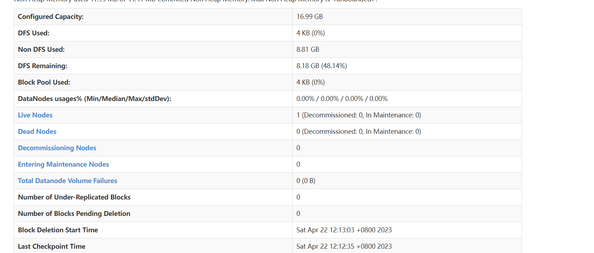

# Hadoop 环境搭建

## 遇到的问题:

在启动Hadoop时，通过jps目录发现没有datanode进程。

```
[root@hadoop ~]# jps
1792 SecondaryNameNode
1937 Jps
1650 DataNode
```



全为0的问题是 jps 不对。


## 解决方案：clusterID不匹配导致的问题

网上搜了下，网上的说法都是由于进行hadoop格式化的时候没有事先结束所有进程，或者多次进行了format导致的datanode的clusterID 和 namenode的clusterID不匹配，从而在启动后没有datanode进程。

解决方法有两种：
**方案一: 保留现有数据**
用 NameNode 节点的 `~/dfs/name/current/VERSION` 中的 namenode 的 clusterID 替换所有 datanode 节点机器中`~/dfs/data/current/VERSION` 中的 clusterID。
重启启动 hadoop: 	`start-all.sh`
这种方式不影响现有的数据，避免了重新的格式化。

**方案二: 重新格式化**
执行 `./stop-all.sh` 关闭集群
删除存放 hdfs 数据块的文件夹(`hadoop/tmp/`)，然后重建该文件夹
删除 hadoop 下的日志文件 logs
执行 `hadoop namenode -format` 格式化 hadoop
重启hadoop集群


————————————————
原文链接：https://blog.csdn.net/m0_67402564/article/details/126565378