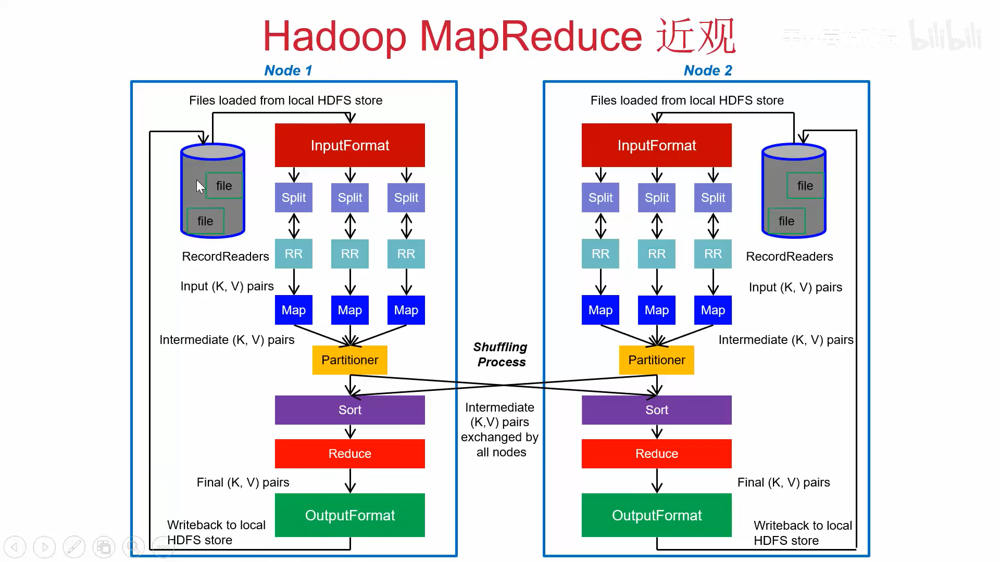
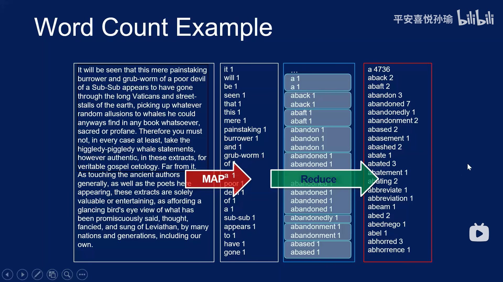

# 分布式系统实验二

## 1. 环境配置

### 1.1 JDK 安装

在Windows端安装与虚拟机相同版本的JDK。

查看 Centos 中的JDK 版本：

```bash
[fanqieyuan@master ~]$ java -version
java version "1.8.0_191"
Java(TM) SE Runtime Environment (build 1.8.0_191-b12)
Java HotSpot(TM) 64-Bit Server VM (build 25.191-b12, mixed mode)
```

然后在[官网](https://www.oracle.com/java/technologies/javase/8u191-relnotes.html)查到：

The full version string for this update release is 1.8.0_191-b12 (where "b" means "build"). The version number is 8u191.

在[官网](https://www.oracle.com/java/technologies/javase/javase8-archive-downloads.html)找到 Windows 下的 java 8u191，我打算安装 x64 的试试。


官网还得注册账号，真麻烦，去[镜像网站](https://repo.huaweicloud.com/java/jdk/8u191-b12/)下载。

接下来跟着这个[安装教程](https://juejin.cn/post/6844904174941896717)走即可。


现在Windows端与虚拟机拥有相同版本的JDK了。

### 1.2 Eclipse 安装

进入该[网站](https://www.eclipse.org/downloads/)


下载后双击安装即可。

 

，

上面这个 INSTALLING 的过程灰常之慢，因为会安装一些软件，但是网站又在境外，所以最简单的方法就是科学上网。也可以安装老版本，据说解压即可用。

### 1.3 下载 hadoop-3.3.1

[官网](https://www.apache.org/dyn/closer.cgi/hadoop/common/hadoop-3.3.1/hadoop-3.3.1.tar.gz)下载，或者去[清华镜像源](https://mirrors.tuna.tsinghua.edu.cn/apache/hadoop/common/hadoop-3.3.1/)快些。

 

下载后解压该压缩包。

### 1.4 配置 Eclipse 连接 Hadoop

新建一个 Java Project，名为 `experiment2` 

 

（1）配置.jar 包

（2）加入插件

（3）添加 2 个环境变量，路径为 hadoop 的安装文件路径。

（4）将Hadoop安装目录下的`“share\hadoop\mapreduce\sources”`目录下的`hadoop-mapreduce- examples-3.1.4-sources.jar`文件解压缩，解压后在子目录`“org/apache/hadoop/examples”`中即可找到一个名称为`“WordCount.java”`的代码文件，即为WordCount程序的源代码，使用Eclipse打开代码文件。测试数据由老师提供。

>   在 src 文件夹下添加`WordCount.java`，然后修改最上面一行代码为 `package experiment2` 即可。

编译运行，命令行输出：


按理说应该要在命令行运行的时候追加两个参数：`输入文件地址` `输出文件地址`

在 Eclipse 中追加参数方式如下：

`Run -> Run Configurations -> Arguments -> Program arguments 中输入参数（中间用空格隔开） -> Apply -> Run `

 

修改后完整代码如下：

```java
package experiment2;

import java.io.IOException;
import java.util.StringTokenizer;

import org.apache.hadoop.conf.Configuration;
import org.apache.hadoop.fs.Path;
import org.apache.hadoop.io.IntWritable;
import org.apache.hadoop.io.Text;
import org.apache.hadoop.mapreduce.Job;
import org.apache.hadoop.mapreduce.Mapper;
import org.apache.hadoop.mapreduce.Reducer;
import org.apache.hadoop.mapreduce.lib.input.FileInputFormat;
import org.apache.hadoop.mapreduce.lib.output.FileOutputFormat;
import org.apache.hadoop.util.GenericOptionsParser;

public class WordCount {

	  public static class TokenizerMapper 
	       extends Mapper<Object, Text, Text, IntWritable>{
	    
	    private final static IntWritable one = new IntWritable(1);
	    private Text word = new Text();
	      
	    public void map(Object key, Text value, Context context
	                    ) throws IOException, InterruptedException {
	      StringTokenizer itr = new StringTokenizer(value.toString());
	      while (itr.hasMoreTokens()) {
	        word.set(itr.nextToken());
	        context.write(word, one);
	      }
	    }
	  }
	  
	  public static class IntSumReducer 
	       extends Reducer<Text,IntWritable,Text,IntWritable> {
	    private IntWritable result = new IntWritable();

	    public void reduce(Text key, Iterable<IntWritable> values, 
	                       Context context
	                       ) throws IOException, InterruptedException {
	      int sum = 0;
	      for (IntWritable val : values) {
	        sum += val.get();
	      }
	      result.set(sum);
	      context.write(key, result);
	    }
	  }

	  public static void main(String[] args) throws Exception {
	    Configuration conf = new Configuration();
	    
	    String[] ioPath = new String[2];
	    /* input flie */
//	    ioPath[0] = "E:\\ILOVEHIT\\THIRD\\subjects\\Distributed\\lab\\lab2\\data\\wordCount.txt";
	    ioPath[0] = "/user/dfstest/wordCount.txt";
	    /* result folder */
//	    ioPath[1] = "E:\\ILOVEHIT\\THIRD\\subjects\\Distributed\\lab\\lab2\\data\\result"; 
	    ioPath[1] = "/user/dfstest/result";
	    
	    /* delete output folder if exists */
	    Path outputPath = new Path(ioPath[1]);
	    outputPath.getFileSystem(conf).delete(outputPath, true);
	    
	    String[] otherArgs = new GenericOptionsParser(conf, ioPath).getRemainingArgs();
	    if (otherArgs.length < 2) {
	      System.err.println("Usage: wordcount <in> [<in>...] <out>");
	      System.exit(2);
	    }
	    Job job = Job.getInstance(conf, "word count");
	    job.setJarByClass(WordCount.class);
	    job.setMapperClass(TokenizerMapper.class);
	    job.setCombinerClass(IntSumReducer.class);
	    job.setReducerClass(IntSumReducer.class);
	    job.setOutputKeyClass(Text.class);
	    job.setOutputValueClass(IntWritable.class);
	    for (int i = 0; i < otherArgs.length - 1; ++i) {
	      FileInputFormat.addInputPath(job, new Path(otherArgs[i]));
	    }
	    FileOutputFormat.setOutputPath(job, new Path(otherArgs[otherArgs.length - 1]));
	    System.exit(job.waitForCompletion(true) ? 0 : 1);
	  }
}
```


运行后，在 `result` 文件夹下查看结果：


### 1.5 Eclipse 使用

①**编译完成后，生成 jar 包，然后上传到 hadoop 平台使用。**
右键工程名后，单机 export，选中 jar file，定义 jar 包名称，然后选择 MainClass -> finish 后生成 jar 包。


②**将 jar 包上传到/usr/local 文件夹中，然后执行 jar 包。其中 testjar 是 jar 包名称。**


## 2. MapReduce原理

以本文统计单词为例：

1.   Map 阶段读入文本
     *   输入 `<key, value>` 是 `<行数, 字符串>` 
     *   输出 `<key, value>` 是 `<单词, 1>` 

2.   中间框架自己完成 Shuffle & sort 操作，
     *   输入 `<key, value>` 是 `<单词, 1>` 
     *   输出 `<key, value>` 是 `<单词, list(1,1,...)>` 按照 key 排序
3.   Reduce 阶段整理输出数据
     *   输入 `<key, value>` 是 `<单词, list(1,1,...)>` 
     *   输出 `<key, value>` 是 `<单词, 出现次数>` 








## 3. 准备工作

apache官网查看：https://hadoop.apache.org/

在这个[网址](https://hadoop.apache.org/docs/stable/hadoop-mapreduce-client/hadoop-mapreduce-client-core/MapReduceTutorial.html)下查看关于 MapReduce 的介绍，和两个 demo ：`WordCount v1.0` ` WordCount v2.0`

这个[网址](https://hadoop.apache.org/docs/stable/api/index.html)下查看对 Java API 的介绍

<font color=blue size=4>关键代码注释：</font>

```java
	/*
	 * @Object 存储<key, value>对的 key 值，此处为文本数据起始位置的偏移量
	 * 
	 * @Text 存储<key, value>对的 value，是具体的文本数据，查API知是String的封装
	 * 
	 * @Text 输出<key, value>对的 key 值，此处为每一个单词，例如`name`
	 * 
	 * @IntWritable 输出<key, value>对的 value，这里是 1，IntWritable是对Integer的封装
	 */
	public static class TokenizerMapper extends Mapper<Object, Text, Text, IntWritable> {

		private final static IntWritable one = new IntWritable(1);
		private Text word = new Text();

		/*
		 * @key 输入在源数据的偏移量
		 * 
		 * @value 一段字符串
		 * 
		 * @context 暂存 map 处理后的结果
		 */
		public void map(Object key, Text value, Context context) throws IOException, InterruptedException {
			// 将读入的每一行转化为字符串
			StringTokenizer itr = new StringTokenizer(value.toString());
			// 将字符串拆分为单词，并打包成<word, 1>暂存在context中
			while (itr.hasMoreTokens()) {
				word.set(itr.nextToken());
				context.write(word, one);
			}
		}
	}

	/*
	 * @Text 输入单词名
	 * 
	 * @IntWritable 输入shuffle和sort操作之后的列表<1,1,1,1...>
	 * 
	 * @Text 输出单词名
	 * 
	 * @IntWritable 输出每个单词对应的出现次数
	 */
	public static class IntSumReducer extends Reducer<Text, IntWritable, Text, IntWritable> {

		private IntWritable result = new IntWritable();

		/*
		 * @key 输入单词名
		 * 
		 * @values 输入单词列表 <1,1,1...>
		 * 
		 * @context 暂存输出<key, value>对
		 */
		public void reduce(Text key, Iterable<IntWritable> values, Context context)
				throws IOException, InterruptedException {
			int sum = 0;
			// 统计单词出现的次数
			for (IntWritable val : values) {
				sum += val.get();
			}
			result.set(sum);
			context.write(key, result);
		}
	}
```


要下手敲代码了，发现缩进非常糟糕，于是乎，

**Eclipse 的自动排版**功能派上用场了：

具体方法：windows-->Preferences-->Java --> Editor-->Save Actions, 看到右边的选项了吧，勾选“Perform the selected actions on save”，其他选项根据需要自己选择或者配置就可以了。

别忘了，最后Apply和Ok一下。

**代码自动补全：**

1.打开软件**Eclipse** -> Wndow -> Perferences 

2.找到Java -> Editor ->Content Assist 

3.将下图中方框内改成`.abcdefghijklmnopqrstuvwxyzABCDEFGHIJKLMNOPQRSTUVWXYZ(`，然后点击应用，就可以自动补全了。

 

## 4. task1

<font color=green size=4><b>①开启 hadoop：</b></font>

**启动与停止Hadoop**
Hadoop伪分布式集群的启动，可以依次单独启动HDFS和YARN，也可以一次启动所有的节点，一般建议依次单独启动HDFS和YARN。NameNode格式化

*   在Hadoop的解压目录：/usr/local/hadoop/bin下执行

    ```
    hdfs namenode -format
    ```

*   启动/停止HDFS
    在Hadoop的解压目录：/usr/local/hodoop/sbin下存放启动、停止的所有脚本文件

    ```
    start-dfs.sh
    stop-dfs.sh
    ```

*   启动/停止YARN

    ```
    start-yarn.sh
    stop-yarn.sh
    ```

*   一次性同时启动HDFS和YARN（此种方式不建议使用）

    ```
    start-all.sh
    stop-all.sh
    ```

*   开启后查看是否正常开启：

    ```
    jps
    ```

     

*   输入下面的网页查看

    ```
    http://localhost:50070/
    http://192.168.88.135:8088/
    ```

<font color=green size=4><b>②将数据文件加入到 hdfs 文件中。</b></font>

1. 在 HDFS 中创建/user/dfstest 目录

>   记得切换到 `root` 模式再创建，否则没有权限。

 

```shell
hdfs dfs -mkdir /user
hdfs dfs -mkdir /user/dfstest
hdfs dfs -mkdir -p /user/test/example
```

注意：hdfs 系统中的文件在 linux 系统中不可见。


2.将 `wordCount.txt` 文件上传至 dfstest 文件夹中 –put 后是 CentOs 上的本地路径 目标路径。

```
hdfs dfs -put /usr/local/wordCount.txt /user/dfstest/wordCount.txt
```

3.删除 hdfs 上的文件 a.txt（要参数-r 用于递归删除文件夹即 `hdfs dfs –rm –r /user/dfstest/`）

```
hdfs dfs -rm /user/dfstest/wordCount.txt
```

4.删除 hdfs 上的文件夹

```
hadoop fs -rm -r -skipTrash /user/dfstest
```

5.查看 hdfs 文件系统中文件内容

```
hdfs dfs -cat /user/dfstest/wordCount.txt
```

6.查看 hdfs 文件系统中的文件列表

```
hdfs dfs -ls /user/dfstest
```

7.运行 `testjar.jar`

<font color=blue size=4>a) 地址写死的情况下运行：</font>

```
hadoop jar /usr/local/testjar.jar
```


<font color=blue size=4>b)改成可追加输入输出文件的代码，重新导出一个 `test1jar.jar` 文件，运行代码如下：</font>

```
hadoop jar /usr/local/test1jar.jar /user/dfstest/wordCount.txt /user/dfstest/result2
```


可以看到代码正常执行，生成了 `result2` 文件夹和结果


查看运行结果：

```
hdfs dfs -cat /user/dfstest/result2/part-r-00000
```

 

附上可追加输入地址的关键代码（其实就是一开始什么也不加的代码）：

```java
...
public static void main(String[] args) throws Exception {
	    Configuration conf = new Configuration();

	    /* delete output folder if exists */
	    Path outputPath = new Path(args[1]);
	    outputPath.getFileSystem(conf).delete(outputPath, true);
	    
	    String[] otherArgs = new GenericOptionsParser(conf, args).getRemainingArgs();
...
```


## 5. Join 方法

使用 SQL 语句合并两个表很容易，但是文件中不是表格格式，没法用 sql 语句。

我们先选个小表（占用内存小）建立哈希映射并缓存，将大表一行行读入，匹配相同的项，将其他项join到一起。


## 6. task2

创建一个文件夹  `task2`

```
hdfs dfs -mkdir /user/task2
```

把 `movies.dat` 和 `ratings.dat` 放到 `/usr/local` 下

>   这里 `ratings.dat` 文件较大，可能需要用 Xftp 才能传上去，VM Tools 顶不住啦。

然后把这两个文件上传到 `/user/task2/`

```
hdfs dfs -put /usr/local/movies.dat /user/task2/
```

```
hdfs dfs -put /usr/local/ratings.dat /user/task2/
```


```
hadoop jar task2jar.jar M_Join_R.HomeWork1 /user/task2/ratings.dat /user/task2/output /user/task2/movies.dat
```

参考：https://blog.csdn.net/qq_41851454/article/details/79616831

`task2` 代码如下：

```java
package task2;

import java.io.BufferedReader;
import java.io.File;
import java.io.FileReader;
import java.io.IOException;
import java.net.URI;
import java.util.HashMap;
import java.util.Map;

import org.apache.hadoop.conf.Configuration;
import org.apache.hadoop.fs.FileSystem;
import org.apache.hadoop.fs.Path;
import org.apache.hadoop.io.IntWritable;
import org.apache.hadoop.io.Text;
import org.apache.hadoop.mapreduce.Job;
import org.apache.hadoop.mapreduce.Mapper;
import org.apache.hadoop.mapreduce.Reducer;
import org.apache.hadoop.mapreduce.lib.input.FileInputFormat;
import org.apache.hadoop.mapreduce.lib.output.FileOutputFormat;

/*
 * 1. 缓存 movies.dat （MovieID, MovieName, Genres电影类型） -> (MovieID, Genres)
 * 2. 读取 ratings.dat （UserID, MovieID, Rating, Timestamp）
 * 3. 进行 join 将读取的 ratings.dat 中的 电影评分变成一条评论记录IntWritable(1)，因为最后输出（MovieID, Genres, 评分次数）
 */

public class MJMapper {

	public static class StepOneMapper extends Mapper<Object, Text, Text, IntWritable>{
		/*
		 * 1. 缓存 movies.dat （MovieID, MovieName, Genres电影类型） -> (MovieID, Genres) setup
		 * 在任务开始的时候执行一次，map方法执行前
		 * 
		 * 作用：初始化
		 */
	
		private Map<String, String> movieMap = new HashMap<>();
	
		@Override
		protected void setup(Context context) throws IOException, InterruptedException {
			// 建立小表的 Hash 映射
			// 创建文件系统对象——目的创建流
	
			/*
			 * //使用的时候getLocalCacheArchives()这个方法被标记位过时，但是不影响使用 //获取缓存文件的路径 Path[]
			 * cacheFilePath = context.getLocalCacheArchives(); //由于只缓存了一个文件，所以在这里就不进行判断了
			 * String path = cacheFilePath[0].toUri().toString(); //通过File IO读取指定路径的文件进行处理
			 * BufferedReader bf1 = new BufferedReader(new FileReader(new File(path)));
			 * 
			 * //以上这些是为了在集群中运行
			 */
	
			// 在本地测试，这样读取缓存文件，因为文件已经缓存到工作空间中了，所以直接通过文件名读取即可
			BufferedReader bf = new BufferedReader(new FileReader(new File("movies.dat")));
			String line = null;
			while ((line = bf.readLine()) != null) {
				String[] movies = line.toString().split("::");
				// 这里直接将userId看作字符串进行处理
				String movieId = movies[0];
				String movieGenres = movies[2];
				movieMap.put(movieId, movieGenres);
			}
	
			// 关闭流
			bf.close();
	
		}
	
		/*
		 * 2. 读取 ratings.dat (UserID, MovieID, Rating, Timestamp)
		 * 
		 * 3. 进行 join 将读取的 ratings.dat 中的 电影评分替换电影名称，因为最后输出(MovieID, Genres, 评分次数)
		 */
		Text K = new Text();
		IntWritable V = new IntWritable(1);
		
		@Override
		protected void map(Object key, Text value, Context context) throws IOException, InterruptedException {
			// UserID, MovieID, Rating, Timestamp
			// 1::1193::5::978300760
			// 逐行读取ratings.dat文件 这里不多说读取的机制，详情见以后的源码分析
			String[] ratings = value.toString().split("::");
			String movieId = ratings[1];
	
			// 判断评分记录中的电影ID是否在电影信息中
			// 只要查到一条记录，就增加一条（评论）
			if (movieMap.containsKey(movieId)) {
				String outKey = movieId + "\t" + movieMap.get(movieId);
				K.set(outKey);
				context.write(K, V);
			}
		}

	}
	

	public static class StepOneReducer extends Reducer<Text, IntWritable, Text, IntWritable>{
	
		Text K = new Text();
		private IntWritable result = new IntWritable();
		
		@Override
		protected void reduce(Text key, Iterable<IntWritable> values, Context context)
				throws IOException, InterruptedException {
			
			//map端的输出最终可以看作 <k,{v1,v2,v3,...vn}>这种形式
			//所以在这里迭代统计评分次数，就是一个wordCount
			int sum = 0;
			for (IntWritable val : values) {
				//因为intWritable.get()都是1，所以直接++或者 += val
				sum += val.get();
			}
			result.set(sum);
			
			K.set(key.toString());
			context.write(K, result);
		}
	}
	
	public static void main(String[] args) throws Exception {
		
		/*
		 * step1: 合并两表，统计(MovieID, Genres, 评分次数)
		 */
		
		Configuration conf = new Configuration();
		FileSystem fs = FileSystem.get(conf);
		
		Job job = Job.getInstance(conf);
		
		job.setJarByClass(MJMapper.class);
	
//		 job.addArchiveToClassPath(new Path("")); //缓存压缩文件到classPath
//		 job.addCacheArchive(new URI("file:/E:/movies.dat")); //缓存普通文件到工作目录
//		 job.addFileToClassPath(new URI("file:/E:/movies.dat")); //缓存普通文件到classPath
		// 这里使用的时候缓存普通文件到工作目录
		// 这里要在本地进行测试，所以使用的本地文件系统的文件路径
		// 如果要打jar包运行在集群上，使用HDFS文件系统的路径
//		job.addCacheFile(new URI("file:///E:/movies.dat"));
		job.addCacheFile(new URI("/user/task2/movies.dat"));
	
		job.setMapperClass(StepOneMapper.class);
		job.setReducerClass(StepOneReducer.class);
	
		job.setMapOutputKeyClass(Text.class);
		job.setMapOutputValueClass(IntWritable.class);
	
		job.setOutputKeyClass(Text.class);
		job.setOutputValueClass(IntWritable.class);
	
		// 因为输入文件夹中有多个文件，为了区分，这里指定到文件名称
//		Path inputPath = new Path("E:\\ratings.dat");
		Path inputPath = new Path("/user/task2/ratings.dat");
//		Path outputPath = new Path("E:\\output1_1");
		Path outputPath = new Path("/user/task2/output");

		// 判断输出目录是否存在，如果存在，就删除
		if(fs.exists(outputPath))
		{
			fs.delete(outputPath, true);
		}
	
		// 设置数据的输入输出路径
		FileInputFormat.setInputPaths(job, inputPath);
		FileOutputFormat.setOutputPath(job, outputPath);
		
		/*
		 * step2: 对 MovieID 排序
		 * 			省略
		 */
		
		
		System.exit(job.waitForCompletion(true) ? 0 : 1);
	}

}
```

运行 `hadoop jar /usr/local/task2jar.jar`


查看前五条结果

```
hdfs dfs -cat /user/task2/output/part-r-00000 |head -5
```

 

查看全部结果

```
hdfs dfs -cat /user/task2/output/part-r-00000
```

省略结果。