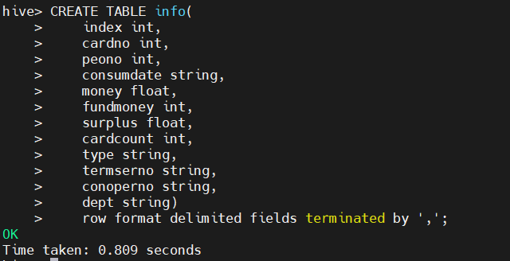

# lab3 Hive

## 1. 配置 Hadoop 3.3.1 环境

### 1.1 查看当前 hadoop 版本

```
hadoop version
```


修改 `/usr/local/hadoop` 为 `/usr/local/hadoop2`

### 1.2 下载安装包

```
wget --no-check-certificate  https://mirrors.bfsu.edu.cn/apache/hadoop/common/hadoop-3.3.1/hadoop-3.3.1.tar.gz
```

### 1.3 解压Hadoop3.3.1

```
tar -zxvf hadoop-3.3.1.tar.gz
```


修改文件夹名称 `/usr/local/hadoop-3.3.1` -> `/usr/local/hadoop`

```
mv /usr/local/hadoop-3.3.1 /usr/local/hadoop
```

### 1.4 环境配置

```
vim /etc/profile

export HADOOP_HOME=/usr/local/hadoop
export PATH=.:$HADOOP_HOME/bin:$HADOOP_HOME/sbin:$PATH
```

生效配置文件

```
source /etc/profile
```

查看 

```
hadoop version
```


想写换回 hadoop2 修改 `usr/local/` 下对应的文件夹名称即可。

### 1.5 信息配置

在`/usr/local/hadoop/etc/hadoop` 下，在 `hadoop-env.sh` 中加入下面路径

```
# The java implementation to use. By default, this environment
# variable is REQUIRED on ALL platforms except OS X!
# export JAVA_HOME=
export JAVA_HOME=/usr/local/jdk

# 设置用户以执行对应角色shell命令
export HDFS_NAMENODE_USER=root
export HDFS_DATANODE_USER=root
export HDFS_SECONDARYNAMENODE_USER=root
export YARN_RESOURCEMANAGER_USER=root
export YARN_NODEMANAGER_USER=root
```

>   对于执行 shell 用户的设置是 hadoop3 与 hadoop2 不同的地方，需要单独配置。

`vim /usr/local/hadoop/etc/hadoop/hdfs-site.xml`

```
<configuration>
    <!-- 副本数 -->
       <property>
          <name>dfs.replication</name>
          <value>1</value>
       </property>
    
    <!-- namenode元数据存储路径 -->
    <property>
        <name>dfs.namenode.name.dir</name>
        <value>file:/usr/local/hadoop/tmp/dfs/name</value>
    </property>
	
	<!-- 数据存储路径 -->
    <property>
        <name>dfs.datanode.data.dir</name>
        <value>file:/usr/local/hadoop/tmp/dfs/data</value>
    </property>
</configuration>
```

`vim /usr/local/hadoop/etc/hadoop/core-site.xml`

```
<configuration>
    <property>
        <!-- HDFS资源路径 -->
        <name>fs.defaultFS</name>
        <value>hdfs://master:8020</value>
    </property>
	
	<!-- Hadoop临时文件存放目录 -->
    <property>
        <name>hadoop.tmp.dir</name>
        <value>/usr/local/hadoop/tmp</value>
    </property>
</configuration>
```

`vim /usr/local/hadoop/etc/hadoop/mapred-site.xml`

```
<configuration>
   <property>
      <name>mapreduce.framework.name</name>
      <value>yarn</value>
   </property>
</configuration>
```

`vim /usr/local/hadoop/etc/hadoop/yarn-site.xml`

```
<configuration>
	<!--配置resourceManager在哪台机器 -->
    <property>
        <name>yarn.resourcemanager.hostname</name>
        <value>master</value>
    </property>
	
	<!-- 在nodemanager中运行mapreduce服务 -->
	<property>
		<name>yarn.nodemanager.aux-services</name>
		<value>mapreduce_shuffle</value>
	</property>
</configuration>
```

检查是否安装成功：

```
hadoop version
```


### 1.6 节点配置与开启

在 `/usr/local/hadoop/bin` 下执行  

```
hdfs namenode -format
```


*   启动/停止HDFS

    在Hadoop的解压目录：/usr/local/hodoop/sbin下存放启动、停止的所有脚本文件 

    ```
    # 开启
    start-dfs.sh    
    
    # 关闭
    stop-dfs.sh
    ```

     

*   启动/停止YARN

    ```
    # 开启
    start-yarn.sh
    
    # 关闭
    stop-yarn.sh
    ```

     

*   一次性同时启动HDFS和YARN（此种方式不建议使用）

    ```
    # 开启
    start-all.sh
    
    # 关闭
    stop-all.sh
    ```

*   查看资源是否开启成功

    ```
    jps
    ```

     

### 1.7 网页查看

http://192.168.88.135:9870/

http://192.168.88.135:8088/

## 2. 配置 MySQL 数据库

>Hive 会将表中的元数据信息存储在数据库中，但 Hive 的默认数据库 Derby 存在并发性能差的问题，在实际生产环境中适用性较差，因此常常会使用其他数据库作为元数据库。MySQL 是一个开源的关系型数据库管理系统，适合作为存储 Hive 元数据的数据库。

wget：Linux 中的一个下载文件的工具。

下载并安装 Wget：

```
yum install wget
```

下载 `mysql8.x` 源：

```
wget https://repo.mysql.com//mysql80-community-release-el7-3.noarch.rpm
```

加载本地 yum 源：

```
yum localinstall mysql80-community-release-el7-3.noarch.rpm
```

查询是否存在 `mysql-community-server.x86_64` ：

```
yum search mysql
```


下载 mysql 服务：

```
yum install mysql-community-server.x86_64 –nogpgcheck
```

>   **遇到问题了：**
>
>   
>
>   解决方案
>
>   ```
>   yum install mysql-server --nogpgcheck
>   ```

启动 mysql：

```
service mysqld start
```

 

查看 mysql 状态：

```
service mysqld status
```


查询 mysql 初始密码，冒号空格后面为密码：

```
cat /var/log/mysqld.log | grep password
```


记录一下密码：

```
t)<7(l>tAs7!
```

使用初始密码登录，在跳出对话框中粘贴刚刚复制的密码：

```
mysql -u root -p
```


设置自定义密码：

```
alter user 'root'@'localhost' identified by '2023%%DtSy';
```

 

MySQL 设置远程访问权限命令：

```
use mysql;

update user set host='%' where user='root';

grant all privileges on *.* to 'root'@'%';

grant all privileges on *.* to 'root'@'%';
```


刷新权限：

```
flush privileges;
```

设置完毕退出 mysql 数据库：

```
exit;
```

## **3.** **配置** **Hive** 数据仓库

下载 Hive 安装包和 MySQL 驱动包并上传至/usr/local/src 内

下载地址：

http://archive.apache.org/dist/hive/hive-3.1.2/

https://repo.maven.apache.org/maven2/mysql/mysql-connector-java/8.0.20/mysql-connector-java-8.0.20.jar

我这里在 Windows 下载后用 Xftp 把包传进去。

*   把 `apache-hive-3.1.2-bin.tar.gz` 放在 `/usr/local/src/` 下
*   把 `mysql-connector-java-8.0.20.jar` 也放在 `/usr/local/src/` 下

转至 `/usr/local/src` 内：

```
cd /usr/local/src
```

 

解压至/usr/local 内：

```
tar -xzvf apache-hive-3.1.2-bin.tar.gz -C /usr/local/
```

 

在命令行输入

```
mv /usr/local/apache-hive-3.1.2-bin hive
```

修改 `apache-hive-3.1.2-bin` 名称为 `hive`

进入 `/usr/local/hive/conf` 目录下

```
cd /usr/local/hive/conf
```

```
cp hive-env.sh.template hive-env.sh
```

```
vim hive-env.sh
```

在当前文件末尾加入 hadoop 安装目录的路径，这里请大家按照自身实际安装情况填写路径。


在 `/etc/profile` 加入 hive 环境变量

```
vim /etc/profile
```

在已有的 PATH 变量后面增加 `$HIVE_HOME/bin`


若没有 PATH 则添加

```
export PATH=$HIVE_HOME/bin:$PATH
```

至尾端

在当前文件添加

```
export HIVE_HOME=/usr/local/hive
```

 

激活修改后的环境变量

```
source /etc/profile
```

>   `vim` 操作：
>
>   *   复制粘贴：
>
>   1.  进入normal/正常模式（刚进入**vim** 的默认模式），如果你在insert 模式，按下若干次Esc 可以进入normal 模式。
>   2.  把光标移动到开始**复制**的位置。
>   3.  按下 v 来选择字符。（ ...
>   4.  光标移动 到结束**复制**的位置。
>   5.  按下 y 来**复制**。
>   6.  光标移动到想要粘贴的位置，按下 p 粘贴
>
>   *   撤销：
>
>       undo(撤销)是最常用的操作之一，可以通过按 u 实现

在 `/usr/local/hive/conf` 目录下，新建一个名为 `hive-site.xml` 的文件

```
vim /usr/local/hive/conf/hive-site.xml
```

将下列代码复制到该文件内

```
<?xml version="1.0"?>
<?xml-stylesheet type="text/xsl" href="configuration.xsl"?>
<configuration>
	<property>
        <name>hive.exec.scratchdir</name>
        <value>hdfs://master:8020/user/hive/tmp</value>
    </property>
    <property>
        <name>hive.metastore.warehouse.dir</name>
        <value>hdfs://master:8020/user/hive/warehouse</value>
    </property>
    <property>
        <name>hive.querylog.location</name>
        <value>hdfs://master:8020/user/hive/log</value>
    </property>
    <property>
        <name>hive.metastore.uris</name>
        <value>thrift://master:9083</value>
    </property>
    <property>
    	<name>javax.jdo.option.ConnectionURL</name>
    	<value>jdbc:mysql://master:3306/hive?createDatabaseIfNotExist=true&amp;characterEncoding=UTF-8&amp;useSSL=false&amp;allowPublicKeyRetrieval=true</value>
    </property>
    <property>
        <name>javax.jdo.option.ConnectionDriverName</name>
        <value>com.mysql.cj.jdbc.Driver</value>
    </property>
    <property>
        <name>javax.jdo.option.ConnectionUserName</name>
        <value>root</value>
    </property>
    <property>
        <name>javax.jdo.option.ConnectionPassword</name>
        <value>2023%%DtSy</value>
    </property>
    <property>
        <name>hive.metastore.schema.verification</name>
        <value>false</value>
    </property>
    <property>
        <name>datanucleus.schema.autoCreateAll</name>
        <value>true</value>
    </property>
    <property>
        <name>hive.support.concurrency</name>
        <value>true</value>
    </property> 
    <property>
        <name>hive.txn.manager</name>
        <value>org.apache.hadoop.hive.ql.lockmgr.DbTxnManager</value>
	</property>
</configuration>
```

注意上述文件内密码要改成自己的密码，如果密码和教程密码一样可以直接复制

进入 `$HIVE_HOME/lib` 目录：

```
cd $HIVE_HOME/lib
```

将 MySQL 驱动包复制到 `$HIVE_HOME/lib` 目录中：

```
cp /usr/local/src/mysql-connector-java-8.0.20.jar $HIVE_HOME/lib/
```

更改 `guava jar` 包版本

移除 Hive 自带的 `guava-19.0.jar`

```
rm -rf /usr/local/hive/lib/guava-19.0.jar
```

将 hadoop 自带的 `guava-27.0-jre.jar` 配置到 hive 上

```
cp $HADOOP_HOME/share/hadoop/common/lib/guava-27.0-jre.jar $HIVE_HOME/lib/
```

```
find $HIVE_HOME/lib/ -name guava-27.0-jre.jar
```

 

初始化 hive

```
# 数据备份
mv /usr/local/hive/lib/log4j-slf4j-impl-2.10.0.jar /usr/local/hive/lib/log4j-slf4j-impl-2.10.0.jar.bak
```

```
source /etc/profile
```

```
schematool -dbType mysql -initSchema
```

启动 hive(启动之前需要先启动 hadoop 和 mysql)

```
start-all.sh
```

```
service mysqld start
# 登录: mysql -u root -p
# 密码: 2023%%DtSy
```

启动 hive 服务，并打开

```
hive --service metastore & hive
```

启动成功后，之后使用 hive 直接输入

```
hive
```


>   如果执行命令后遇到如下问题：
>
>   
>
>   上一次的 hive 占用资源没有关闭
>
>   `jps` 查看
>
>   `kill -9 xxx xxx` 
>
>   杀死所有 Runjar 后重启 hive 就好了。

## 4. HiveQL 查询语句

### 4.1 创建数据表

创建数据库：

```
CREATE DATABASE card;
```

 

创建内部表 info：

首先，进入数据库 card

```
USE card;
```

 

在数据库 card 下创建成绩信息表 score 和 info

```
CREATE TABLE score(
    stu_no string,
    cla_no string,
    grade float
    ) partitioned by (class_name string);
```

 

```
CREATE TABLE info(
    index int,
    cardno int,
    peono int,
    consumdate string,
    money float,
    fundmoney int,
    surplus float,
    cardcount int,
    type string,
    termserno string,
    conoperno string,
    dept string)
    row format delimited fields terminated by ',';
```

 

将表 score 重命名成 stu_score

```
alter table score rename to stu_score;
```

添加列

```
alter table stu_score add columns (credit int, gpa float);
```

新增分区

```
alter table stu_score add partition(class_name='07111301');
```

删除分区

```
alter table stu_score drop if exists partition(class_name = '07111301');
```

###  4.2 Hive 表的数据装载

将文件系统的数据导入 Hive 表

首先将数据 `data1.csv` 上传至 `/data` 内，`data2.csv` 上传至 HDFS 的 `/user/root/data` 内

```
hdfs dfs -mkdir -p /user/root/data
hdfs dfs -mkdir /data
```

```
hdfs dfs -put /usr/local/src/data1.csv /data/
hdfs dfs -put /usr/local/src/data2.csv /user/root/data/
```

 

将本地文件系统中的 `data1.csv` 导入表 `student`

根据 `data1.csv` 的内容创建 `student` 表

 

```
hive
use card
```

```
CREATE TABLE student(
    index int,
    cardno int,
    sex string,
    major string,
    accessCardNo int
    )
    row format delimited fields terminated by ',';
```

>   删除表：
>
>   ```
>   drop table if exists student; 
>   ```
>
>   这里我创建表出问题了想把表格删掉，但是 hive 中会卡住，网上找到的原因如下：
>
>   在建好hive数据库后,没有第一时间将 `character_set_database` 编码由 `utf8` 修改为 `latin1` ，而是去 hive 中 create 了一张表，而后才将 `character_set_database` 编码由 `utf8` 改成了 `latin1`
>
>   解决办法:
>   在 mysql 中
>
>   ```
>   drop database hive;
>   ```
>
>   重新
>
>   ```
>   create database hive;
>   ```
>
>   修改编码
>
>   ```
>   alter database hive character set latin1;
>   ```
>
>   进入hive shell
>
>   创建表,drop表,正常!
>
>   emmm,根本没用。。。

```
load data local inpath '/usr/local/src/data1.csv' overwrite into table student;
```

 

将 HDFS 中的 `data2.csv` 导入至表 `info`

```
load data inpath '/user/root/data/data2.csv' overwrite into table info;
```

 

### 4.3 掌握 select 查询

由于 SQL 的广泛应用，所以根据 Hive 本身的特性设计了类 SQL 的查询语言 HQL。

HQL 查询语句 select 的语法如下：

```
select [all | distinct] select_expr, select_expr, ...

 from table_reference

 [where where_condition]

 [group by col_list]

 [having having_condition]

 [order by col_list]

 [cluster by col_list | [distribute by col_list] [sort by col_list]]

 [limit [offset,] rows]
```

group by：表示根据某个字段对数据进行分组，一般情况下，group by 必须要配合聚合函数（如 count()、max()等）一起使用，以实现在分组之后对组内结果的聚合操作。

order by：使用该关键字可以令查询结果按照某个字段进行排序，默认的情况下为升序（ASC）排序。用户也可以使用 DESC 关键字对查询结果进行降序排序。

limit：limit 关键字可用于约束查询结果返回的行数。

**例如： ** 查看 info 表中的 cardno、消费类型为消费的消费地点数据

```
select cardno,type,dept from info where type=="消费";
```

### 4.4 Hive 单表插入数据示例

语法如下：

```
insert [overwrite|into] table 表 1 

[partition (part1=val1,part2=val2)]

select 字段 1, 字段 2, 字段 3 from 表 2 ;
```

该语句表示从表 2 查询出字段 1、字段 2 和字段 3 的数据并插入表 1 中，表 1 中的 3 个字段的类型与表 2 中的 3 个字段的类型应一致。

### 4.5 表生成函数

表生成函数可将单个输入行转换为多个输出行。

表生成函数的语法

```
select udtf（col） as colAlias...
```

### 4.6 聚合函数

聚合函数是对一组值进行计算并返回单一值的函数。聚合函数经常与 select 语句的 group by

子句一同使用。常用的聚合函数如下表。

 


## 5. 实验

**上传数据：**

```
hadoop fs -put /usr/local/src/jizhan_information.csv /user/root/data/jz.csv
```

**在 hive 的 card 数据库中创建表格：**

```sql
CREATE TABLE jz (
    record_time string,
    imei int,
    cell string,
    ph_num int,
    call_num int,
    drop_num int,
    duration int,
    drop_rate double,
    net_type string,
    erl int)
    row format delimited fields terminated by ','
;
```

**装载数据：**

```
# 本地文件TODO:
load data local inpath '' overwrite into table jz;
# HDFS中文件
load data inpath '/user/local/src/jizhan_information.csv' overwrite into table jz;
```

**执行命令：**

```sql
SELECT imei, SUM(drop_num)/SUM(duration) AS droprate
FROM jz
GROUP BY imei
ORDER BY droprate
desc limit 10;
```

**发现报错：**

错误: 找不到或无法加载主类org.apache.hadoop.mapreduce.v2.app.MRAppMaster

**解决方法：**

在命令行下输入如下命令，并将返回的地址复制：

```
hadoop classpath
```

编辑 `yarn-site.xml` 

```
vim /usr/local/hadoop/etc/hadoop/yarn-site.xml
```

添加下面内容

```
<configuration>
    <property>
        <name>yarn.application.classpath</name>
        <value>输入刚才返回的Hadoop classpath路径</value>
    </property>
</configuration>
```

我的是下面这样

```
    <property>
        <name>yarn.application.classpath</name>
        <value>/usr/local/hadoop/etc/hadoop:/usr/local/hadoop/share/hadoop/common/lib/*:/usr/local/hadoop/share/hadoop/common/*:/usr/local/hadoop/share/hadoop/hdfs:/usr/local/hadoop/share/hadoop/hdfs/lib/*:/usr/local/hadoop/share/hadoop/hdfs/*:/usr/local/hadoop/share/hadoop/mapreduce/*:/usr/local/hadoop/share/hadoop/yarn:/usr/local/hadoop/share/hadoop/yarn/lib/*:/usr/local/hadoop/share/hadoop/yarn/*
</value>
    </property>
```

**重启再次执行命令：**


最终结果

