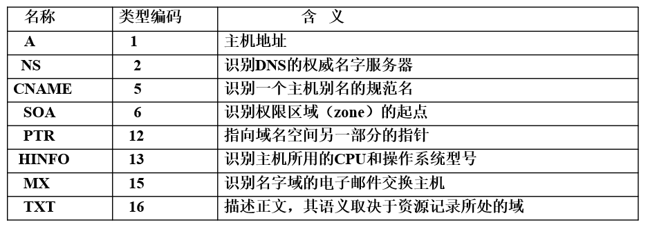
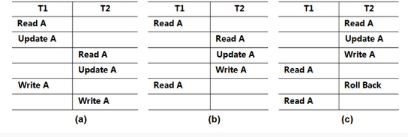
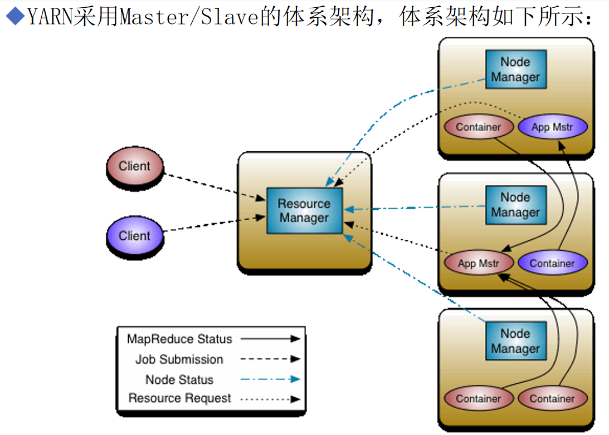

# 分布式系统复习

分布式系统是温老师和臧老师两位老师讲的，据说是第一次作为本科生课程开设，我太感动了，一点往年题没有啊。

复习计划就是，两位老师的 PPT 全部过一遍，温老师发了习题，把习题全做了，藏老师讲的部分就把算法原理搞明白，剩下的全靠临场发挥了。

## 习题部分

**1.什么是分布式系统？它的实质是什么？**

分布式计算系统是由多个相互连接的计算机组成的一个整体，这些计算机在一组系统软件（分布式操作系统或中间件）环境下，合作执行一个共同的或不同的任务，最少依赖于集中的控制过程、数据和硬件。

实质：分布计算系统=分布式硬件+分布式控制+分布式数据。

>   分布式系统的实质是将一个单一的任务或应用程序分解为多个子任务，并交给不同的计算机来处理。每个计算机都可以独立地执行自己的任务，并通过网络与其他计算机进行通信和协作，以完成整个任务或应用程序。

**2.分布式系统的目标是什么？**

分布式系统的目标是通过合理地利用不同计算机节点的资源和能力，实现高性能、高可用性、高容错性和高可扩展性的计算机系统。

**3.什么是分布式系统的透明性。**

分布式系统向用户和应用程序隐藏了分布式计算系统部件的差异，可以让用户和应用程序无需关心底层的物理环境、网络拓扑和故障恢复等细节，从而简化了对分布式系统的使用和管理。

透明性主要包括访问透明性和位置透明性等。

>透明性可以分为以下几个方面：
>
>1.   访问透明性：访问透明性是指用户无需了解分布式系统中各个节点的位置和访问方式，就可以通过简单的调用接口来访问系统中的资源。
>2.   位置透明性：位置透明性是指用户不需要知道系统中资源的物理位置，就可以像使用本地资源一样的方式来访问它们。
>3.   移动透明性：移动透明性是指用户和应用程序不需要关心计算机节点的移动和重新配置，即使节点被移到另一个位置或更改了网络地址，也能够自动适应并继续提供服务。
>4.   故障透明性：故障透明性是指系统可以自动检测和处理部分节点失效或通信失败的情况，从而实现系统的容错性和可靠性。
>5.   重组透明性：重组透明性是指分布式系统可以根据不同任务和应用程序的需求，自动地对计算机节点进行重新配置和优化，以提高系统的性能和吞吐量。

**4.简要描述两种分布式计算机系统。**

分布式计算机系统是指由多个计算机节点组成的一个系统，它们通过网络连接进行通信和协同工作，以完成特定的任务或提供某种服务。

下面简要描述两种常见的分布式计算机系统：

1.  集群系统：集群系统由多台计算机组成，这些计算机可以相互通信和共享资源，比如存储和处理能力。通常，集群系统采用主从架构，即有一台主节点来控制整个系统的运行，其他从节点负责执行具体的任务。集群系统通常用于科学计算、数据处理等需要高性能计算的应用中。
2.  分布式数据库系统：分布式数据库系统是一种将数据存储在多个计算机节点上的系统，每个节点都有自己的数据存储和处理能力。这种系统通常采用副本机制，即将数据分散到不同的节点上，以增加可靠性和容错能力。分布式数据库系统常用于大规模数据存储与管理，比如在线交易系统、搜索引擎等应用中。

**5.分布式选举算法有哪几种？**

分布式选举算法是指一种在分布式计算机系统中，通过协调各个节点的行为，从而选出一个节点作为系统的领导者（或主节点）的算法。下面介绍几种常见的分布式选举算法：

1.  Bully算法：Bully算法是一种基于节点能力大小进行选举的算法。每个节点都有一个唯一的ID，当一个节点发现自己的主节点不可用时，它会将选举消息发送给比自己ID大的其他节点，如果没有比自己ID大的节点回复，则该节点被选为新的主节点。
2.  Ring（环选举）算法：Ring算法是一种基于环形拓扑结构进行选举的算法。每个节点都有一个逻辑指针指向下一个节点，当一个节点发现自己的主节点不可用时，它将选举消息沿着环形传递，直到消息回到发起节点。如果一轮选举结束后没有节点响应，则该节点被选为新的主节点。
3.  Paxos算法：Paxos算法是一种基于共识机制进行选举的算法。每个节点都可以提出一个提案，并请求其他节点投票支持。在算法的多轮交互过程中，最终选出的提案被接受并成为新的主节点。
4.  Raft算法：Raft算法是一种类似Paxos算法的选举算法，它将选举过程分为三个阶段：选举、日志复制和安全性。在选举阶段中，每个节点通过相互通信来选出一个新的主节点；在日志复制阶段中，主节点将自己的日志发送给从节点进行同步；在安全性阶段中，确保主节点不会丢失数据或重复执行操作。

这些算法都有各自的优缺点，应根据实际应用场景选择合适的算法。

**6.Cristian 时钟同步算法中，如何解决出现的时钟回调问题？**

在Cristian时钟同步算法中，出现时钟回调问题的原因是，在将时间戳发送给服务器后，可能由于网络延迟或其他因素导致该消息的到达时间比本地时钟快。这会导致服务器计算出来的时间偏早，而且在客户端收到响应之前本地时钟已经向前移动了一段时间，从而导致时钟回调。

为了解决这个问题，可以采用以下方法：

1.  缩小时间戳范围：将时间戳的精度降低，例如使用毫秒级别的时间戳而非微秒级别的时间戳，从而减少由于网络延迟引起的误差。

2.  两次请求获取时间：客户端可以两次向服务器请求时间，第一次获取时间戳T1，第二次获取时间戳T2，并记录两次请求的时间T0和T3。然后，根据下面的公式计算出客户端的时间偏差d：

    d = ((T1 - T0) + (T2 - T3)) / 2

    最后，通过将本地时钟加上时间偏差d来消除时钟回调问题。

3.  使用NTP协议：网络时间协议（NTP）是一种专门用于同步网络中各个节点时钟的协议。通过使用NTP协议，可以从可靠的NTP服务器获取准确的时间信息，并校准本地时钟，从而避免时钟回调问题。

这些方法可以有效地解决Cristian时钟同步算法中的时钟回调问题，但需要根据具体情况进行选择。为了获得更高的精度和稳定性，建议使用NTP协议来进行时钟同步。

**7.RPC 通信中，如果服务器的应答消息丢失，叙述出现的后果及处理方法？**

*   客户发出一个RPC请求，并启动一个计时器。如果计时器超时，客户没有收到响应，客户便使用与原先相同的 XID（事务标识符）重传原先的RPC请求。如果文件服务器还没有处理完原先的RPC请求，服务器只需简单地忽略这个重传的请求。

*   服务器可能刚想客户返回响应就接收但客户的RPC重传请求，如果重传请求的到达时间与服务器发出响应的时间非常接近，服务器就断定重传请求与原先的响应相互交叉，服务器忽略重传请求。

*   响应确实丢失了。服务器从缓存堆找出原先的响应，作为RPC重传请求的响应发送给客户。

**8.试比较分布式操作系统、网络操作系统和基于中间件的分布式系统之间的异同。**

分布式操作系统、网络操作系统和基于中间件的分布式系统都是用于支持分布式计算的技术。它们之间有以下异同：

1.  概念：
    *   分布式操作系统是一种支持分布式计算的操作系统，它提供了对分布式资源的统一管理和调度。
    *   网络操作系统是构建在网络服务器上的操作系统，旨在为客户端提供服务。
    *   基于中间件的分布式系统是使用中间件来协调分布式环境中各个节点之间的通信。
2.  目标：
    *   分布式操作系统的目标是实现透明的分布式计算，使得用户无需关心计算机资源的位置和物理属性。
    *   网络操作系统的目标是通过网络为远程用户提供高效便捷的计算服务。
    *   基于中间件的分布式系统的目标是通过中间件协调分布式环境中各个节点之间的通信以实现分布式计算。
3.  功能：
    *   分布式操作系统的主要功能包括进程管理、资源管理、命名管理、安全管理等。
    *   网络操作系统的主要功能包括网络管理、用户管理、文件管理等。
    *   基于中间件的分布式系统主要功能包括消息传递、远程过程调用、对象请求等。
4.  实现方式：
    *   分布式操作系统是作为一个单独的操作系统运行在分布式环境中的各个节点上。
    *   网络操作系统是构建在网络服务器上的操作系统，为远程用户提供服务。
    *   基于中间件的分布式系统则是将各种中间件组合在一起实现分布式通信和协调。

总的来说，这三种技术都是为了实现分布式计算而设计的，但它们的实现方式、目标和功能不完全相同。如果需要根据具体应用场景选择合适的技术，需要根据实际需求进行评估和比较。

**9.如何理解事务的回滚操作。**

事务的回滚操作是指在一个事务中，如果发生了错误或者异常情况导致事务无法正常执行，则系统会撤销该事务所做出的所有修改，将数据库恢复到事务开始前的状态，用于维持事务的一致性和原子性。

**10.分布式系统有哪些计算模式。**

分布式系统具有多种计算模式，以下是其中的几种：

1.  客户端-服务器计算模式：客户端向服务器发送请求，服务器响应并返回结果。这种模式通常用于Web应用程序和数据库管理系统。
2.  对等网络计算模式：对等网络计算模式中，每台计算机都可以作为服务提供者或客户端，它们相互协作以实现某些目标。例如，文件共享和点对点（P2P）网络就使用了这种模式。
3.  流处理计算模式：流处理计算模式是一种连续的计算模式，在该模式下，数据被不断地输入、处理和输出。这种模式通常用于实时监控和数据分析。
4.  批处理计算模式：批处理计算模式将一个大型任务分成若干个小的子任务，并将这些任务分配给不同的计算机进行处理。所有的处理结果最终会被汇总在一起。这种模式通常用于大规模数据处理和科学计算。
5.  MapReduce计算模式：这是一种特殊的批处理计算模式，它通过将大规模的数据集分成许多小块，然后将这些小块分配给不同的计算机进行处理，最终将结果统一汇总。MapReduce计算模式通常用于大规模数据处理和分布式存储系统。

总之，分布式系统可以通过许多不同的计算模式来实现其目标，并且这些模式可以根据特定的业务需求进行调整和组合。

**11.实体的名称、地址、标识符和属性的区别是什么。**

**实体**

实体是一个包含一些资源的东西。在计算机中称呼实体有很多方法，包括**名字、地址和标识符**

*   实体的名字

    实体的名字是一个用户可读的、便于记忆的字符串。

    例如：名字 /etc/passwd 是UNIX操作系统中一个文件名，或称文件路径名。具体是指根目录“/”下的目录etc中的文件passwd。

*   实体的地址

    实体需要一个**访问点**。

    **访问点**在分布式系统中是一个特殊实体，它的名字称为**地址**。网络中实体地址包括实体的网络层IP地址和实体的传输层TCP（或UDP）端口号。

    一个实体可以提供多个访问点 （多个地址）

    一个实体经过一定时间后可改变访问点

*   标识符/内部标识符

    当客户用文件名打开一个文件时，文件系统会向客户返回一个文件句柄，这个文件句柄就是文件的标识符，以后就可以直接用这个标识符对文件执行读或写等操作。实体标识符在系统内是唯一的。

    一个标识符最多引用一个实体。

    每个实体最多由一个标识符引用。

    一个标识符始终引用同一个实体。

*   属性

    实体内部元素的属性特点组成一个实体的属性集合，一个实体有若干属性， 用属性对<类型-值>表示

    如打印机： <型号-值>, <类型-彩色值>

    通过属性也可以找到实体。

**12.有哪些名字服务形式？名字服务器的组成与功能是什么。**

**名字服务形式：** 根据名字使用的目的分类：

1.   **名字服务**    名字数据库是命名实体与其属性（地址）绑定的集合。名字服务是根据实体的名字查找它的属性（地址），俗称白页服务。如Internet的域名服务DNS、CORBA的命名服务。
2.   **目录服务**    目录数据库是命名实体与其一个或多个属性绑定的集合，属性包括属性类型和一个或多个属性值。俗称黄页服务。如X.500 目录服务。
3.   **合约服务**     是一种增强的目录服务，它通过技术规范来定位一个命名实体，也称绿页服务。如Web服务。

**名字服务器组成：**

>   名字空间是由名字服务器实现与管理的。名字服务器主要有**数据库**和**名字解析软件**组成。

*   **数据库**实现实体名和它的地址的绑定，还包括实体的其他信息，如主机的结构和操作系统的类型等，成为名字解析上下文。

*   **名字解析软件**，在常见的分布式系统中，名字解析软件最常用的是**DNS（Domain Name System）**。DNS是一种分布式的、层次化的命名系统，它将域名映射到与之对应的IP地址。当客户端需要解析一个域名时，它向本地的DNS解析器发起请求。本地DNS解析器会首先查询自身的缓存，如果缓存中没有相关记录，则向根域名服务器发起请求。根域名服务器会指导本地DNS解析器向相应的顶级域名服务器发起请求，逐级迭代查询，最终找到负责该域名的授权域名服务器。授权域名服务器会返回该域名对应的IP地址，本地DNS解析器将结果返回给客户端。

名字服务结构由客户端（客户与名字代理）和名字服务器通过网络互连而成。名字代理是名字服务器与客户之间的一个接口，它与名字服务器协调，生成名字解析上下文和进行名字解析，同时缓存名字查询和名字解析的结果。名字服务器管理名字解析上下文、实现名字查询与解析和其它名字服务器通信协调。

**13.什么是资源记录，它在域名服务中的作用是什么。**

在分布式系统中，资源记录（Resource Record）是在域名系统（DNS）中使用的数据结构，用于描述特定域名下的各种资源的信息。每个资源记录包含与特定主机或服务相关联的数据。

资源记录包含以下信息：

1. 域名（Domain Name）/（owner）：资源记录所属的域名。

2. 类型（Type）：表示记录的类型，常见的类型包括A记录（用于映射域名到IPv4地址）、AAAA记录（用于映射域名到IPv6地址）、CNAME记录（用于创建别名）、MX记录（用于指定邮件交换服务器）、NS记录（用于指定域名服务器）等。

  

3. 生存时间（Time to Live，TTL）：指定资源记录在DNS缓存中的有效期。TTL决定了缓存该记录的时间长度，过期后需要重新查询。

4. 数据（Data）：根据资源记录的类型，可能包含不同的数据信息。例如，A记录包含一个IPv4地址，MX记录包含一个邮件服务器的域名，NS记录包含一个域名服务器的域名等。

  

**作用**

资源记录的主要作用是在域名系统中建立域名与相应资源的映射关系。当客户端需要访问某个域名下的资源时，它会向域名服务器发送查询请求，并返回与域名对应的资源记录。这样，客户端就能够获得所需资源的信息，如服务器的IP地址、邮件交换服务器、域名服务器等。

通过资源记录，分布式系统中的各种资源可以被正确地映射和访问，实现域名到资源的解析和路由。资源记录的管理和配置由域名的管理者或运维人员负责，以确保正确的资源信息在分布式系统中得到传播和使用

**14.许多分布式算法需要使用协调进程。讨论一下，这样的算法实际上可以在什么程度上被看作是分布式的？**

分布式算法的目标是解决在分布式环境下多个节点之间协同完成某项任务的问题。这种算法通常需要使用协调进程来确保各个节点能够正确地协同工作。因此，可以说这样的算法在某种程度上是分布式的。

然而，在实际应用中，通过引入协调进程来解决问题并不一定总是最佳方案。因为协调进程可能会成为系统的瓶颈，并且可能导致单点故障。因此，在设计分布式算法时，我们需要仔细权衡使用协调进程和不使用协调进程的优缺点。

一些分布式算法可以完全避免使用协调进程。例如，在Paxos算法和Raft算法中，虽然存在一个Leader节点用于进行主要决策，但它并不是必须的，因为其他节点可以通过互相交换信息来达成共识。这些算法被认为是“无中心化”的分布式算法。

因此，尽管许多分布式算法需要使用协调进程，但我们仍然可以从各种角度来评估这些算法是否真正实现了分布式的目标。如果算法能够有效地利用分布式计算资源来完成任务，同时又能够避免使用协调进程，那么这样的算法就可以被看作是真正的分布式算法。

**15.下图所示为一分布式系统中的三个进程通信的过程，其中图中数字为其本机时间戳。若该系统使用Lamport时间戳算法进行逻辑时钟同步，请从先发生关系的角度分析该通信过程存在什么问题，以及解决方法。**

 

存在的问题：各个进程的本地时钟不一致，可能出现接收消息的时间早于发送消息的时间这种情况

解决方法：利用 Lamport 算法，消息3->61，消息4->65。

16.

 

a) 修改不一致

b) 两次读A数据不一致

c) 两次读A数据不一致

**17.分布式文件系统分为远程访问模式和上传/下载模式，它们各适于何种环境。**

**远程访问模式** 适用于需要实时访问和操作远程文件的场景，例如在集群计算中，多个节点需要共享和处理相同的数据集。它提供了低延迟和高带宽的访问方式，使得应用程序可以直接在远程文件系统上进行处理。

**上传/下载模式** 适用于需要离线处理或批量处理的场景，例如数据分析、数据备份等。客户端可以在本地对文件进行预处理，然后上传到分布式文件系统进行大规模的计算或处理。这种模式适合于较大的文件或批量处理任务，可以有效利用分布式计算资源。

 

**18.NFS 如何访问远程文件，它的虚拟文件系统的作用是什么。**

**访问过程**
三个部分：

1. 挂载远程文件系统：建立挂载节点，客户端使用mount命令或类似的方式将远程文件系统挂载到本地文件系统的一个目录上。挂载过程中，客户端指定远程服务器的地址和共享的文件系统路径。
2. RPC协议远程访问：见上描述RPC部分
3. 客户端缓存和写回：为了提高性能，NFS客户端通常会缓存部分远程文件的数据到本地。客户端可以在本地缓存中读取文件数据，避免每次都通过网络访问服务器。对于写操作，客户端可能会将更改的数据缓存在本地，然后定期将更改的内容写回到远程服务器。

**虚拟文件系统VFS的作用：**

*   VFS的思路是隐藏文件系统之间的差异，已成为不同分布式文件系统接口的标准

*   VFS接口上的操作或传送到本地文件系统，或传送到NFS客户的组件上（负责处理对存储在远程服务器上文件的访问，该访问通过RPC用户桩发出RPC调用实现的）

**19.为什么要两阶段加锁。**

两阶段加锁（Two-Phase Locking，2PL）是一种用于并发控制的技术，它在事务处理中广泛使用。该技术的目的是确保多个事务不会同时访问相同的资源并产生冲突。

在两阶段加锁协议中，事务分为两个阶段：加锁阶段和解锁阶段。在加锁阶段，事务需要获取所有需要的锁，并且在这个阶段之后不再获取新的锁。在解锁阶段，事务释放所有持有的锁。

这样做的好处在于，在加锁阶段之后，事务不再获取新的锁，因此能够避免死锁的情况。同时，在解锁阶段，事务释放所有持有的锁，从而允许其他事务对这些资源进行访问。

总的来说，两阶段加锁协议可以有效地避免并发访问资源时可能出现的问题，保证数据库的数据一致性和完整性。

**20.分布式事务并发控制的三种方法有哪些？简单论述。**

**一、事务加锁** 对象加锁—使其它并发事务暂时不能访问该对象  

二阶段加锁：事务已经开始释放锁，它就不能再有加锁活动从事务开始到第一次释放称为施加锁阶段（增长阶段）从第一次释放锁到事务的最后一次活动为释放锁阶段（收缩阶段）

**二、事务时间戳**

**三、乐观并发控制** 事务阶段工作（读）阶段验证阶段修改（写）阶段事务验证后向验证前向验证并行验证饥饿分布式乐观并发控制乐观并发控制是在每个事务提交之前进行验证。事务号在验证开始指派给事务，并按事务号的次序将并发事务串行化。分布式事务验证是通过汇集各个服务器的验证结果，各服务器验证必须在提交的第一阶段完成。

**21.HDFS 的写数据流程。**

 

 

1）客户端首先与NameNode建立连接，发起文件上传请求。

2）NameNode检查上传路径是否存在，目标文件是否存在，权限是否允许。若无问题则修改命名空间，并反馈允许上传。

3）客户端收到允许上传反馈后再次请求第一个block所在的节点名。

4）NameNode根据机架感知原理选取三个节点（datanode1，datanode2，datanode3）并将其反馈给客户端。

5）客户端从获取的三个节点中选取一个节点建立pipeline连接，请求上传数据。节点1收到请求后与节点2获取连接，节点2收到请求后与节点3获取连接。

6）连接全部建立成功后，客户端开始向第一个节点传输第一个block。该block数据以packet为单位进行传输。数据的校验则是以更小的chunk单位进行。数据在客户端本地和datanode端都有读取和写入的缓存队列。每一次packet在pipeline上的传输都需要反向应答。直到写完预定的block为止。同样的，节点1、节点2和节点3之间也会以同样的方式同步传输。

7）当第一个block传输完成后，客户端再次发送请求到NameNode，将整个流程再次重复。

1）客户端首先与NameNode建立连接，发起文件读取请求。NameNode检查上传路径是否存在，目标文件是否存在，权限是否允许。

2）客户端请求NameNode的元数据信息（获取文件的块保存的位置）。

3）NameNode反馈目标文件block和datanode节点的对应关系。

4）客户端与所有的目标datanode建立连接。

5）客户端开始从目标节点读取数据块写入缓存，再从缓存写入文件。

6）第一个block读入成功后再启动第二个block的读取流程，以此类推。

**22.YARN 的体系架构 。**

YARN是Hadoop2.0中的资源管理系统，它的基本思想是将资源管理和作业调度/监视功能拆分为两个独立的守护程序。

*   ResourceManager  负责整个集群的资源管理和分配
    *   ResourceManager(RM)YARN的核心组件，一般分配在Master节点上。
    *   包括Scheduler和ApplicationsManager两个主要组件。
    *   Scheduler    RM中的调度器，根据容量、队列等限制条件将系统资源分配给各种正在运行的应用程序。
    *   ApplicationsManager    负责管理整个系统中所有应用程序，包括应用程序提交、与调度器协商资源以启动ApplicationMaster、监控ApplicationMaster运行状态并在失败时重新启动它等。      

*   ApplicationMaster  负责任务协调工作
    *   ApplicationMaster(AM)代替了MRv1中的JobTracker。
    *   用户每提交一个应用程序就会产生一个对应的AM。
    *   为运行的应用向RM申请资源。
    *   在Job中对Task实现调度。
    *   与NodeManager通信以启动或者停止任务。
    *   监控所有任务的运行情况，任务失败后重新申请资源以重启任务。      
*   NodeManager(NM)
    *   代替了MRv1中的TaskTracker。
    *   定向通过心跳向RM汇报本节点的资源使用和各个Container的运行情况。
    *   接收并且处理来自AM的Container启动和停止的各种请求。
*   Container
    *   是YARN中的资源抽象，是系统资源分配的基本单位。
    *   封装内存、CPU、磁盘、网络等资源。
    *   YARN为每个任务分配一个Container。

**设计思想：**

1.用户向YARN中提交应用程序，其中包括ApplicationMaster程序、启动ApplicationMaster的命令、用户程序等。 

2.ResourceManager为该应用程序分配第一个Container，并与对应的NodeManager通信，要求它在这个Container中启动应用程序的ApplicationMaster。

3.ApplicationMaster首先向ResourceManager注册，这样用户可以直接通过ResourceManager查看应用程序的运行状态，然后它将为各个任务申请资源，并监控它的运行状态，直到运行结束。 

4.ApplicationMaster采用轮询的方式通过RPC协议向ResourceManager申请和领取资源。

5.一旦ApplicationMaster申请到资源后，便与对应的NodeManager通信，要求它启动任务。 

6.NodeManager为任务设置好运行环境后，将任务启动命令写到一个脚本中，并通过运行该脚本启动任务。 

7.各个任务通过某个RPC协议向ApplicationMaster汇报自己的状态和进度，以让ApplicationMaster随时掌握各个任务的运行状态，从而可以在任务失败时重新启动任务。在应用程序运行过程中，用户可以随时通过RPC向ApplicationMaster查询应用程序的当前运行状态。 

8.应用程序运行完成后，ApplicationMaster向ResourceManager注销并关闭自己。

**23.MapReduce 的执行过程。**

## PPT 理解

## 臧老师部分

1.   paxos
2.   PBFT
3.   PoW 和 PoS （**Algorand**）
4.   Raft

## 考后回忆

基本全是 PPT 内容，好好理解，多推两遍。臧老师部分考了一个 Algorand 区块链算法，这个是我没有熟练掌握的部分，但也看了一遍，凭借着为数不多的映像也把关键技术写了个七七八八。我们是第一次本科生开这个课，整体难度就是概念级的，PPT 过两遍，原理都搞懂，温老师部分把习题全做了，该背的概念都背了就差不多了。