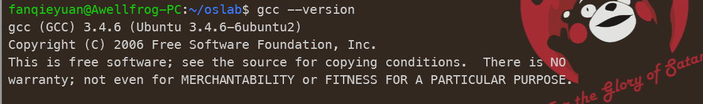

# lab0

## 1. WSL 配置

VMWare + Ubuntu 用太多了，想试一试 WSL 看看好不好用。

官方教程：https://learn.microsoft.com/zh-cn/windows/wsl/setup/environment

<font color=green>① 安装 WSL</font>

`wsl --install` 

输入命令后出现 ==无法解析服务器的名称或地址== ，这是因为有的域名没法访问。

解决方法：1.科学上网。2.修改DNS后重启。

 

<font color=green>② 跟着[华为](https://huaweicloud.csdn.net/635605e8d3efff3090b58d26.html?spm=1001.2101.3001.6650.9&utm_medium=distribute.pc_relevant.none-task-blog-2%7Edefault%7EBlogCommendFromBaidu%7Eactivity-9-122390018-blog-123671239.235%5Ev32%5Epc_relevant_default_base3&depth_1-utm_source=distribute.pc_relevant.none-task-blog-2%7Edefault%7EBlogCommendFromBaidu%7Eactivity-9-122390018-blog-123671239.235%5Ev32%5Epc_relevant_default_base3&utm_relevant_index=10)的这个教程配置 `Windows10/Windows11 子系统（WSL2）安装Ubuntu20.04（带桌面环境）` </font>

我在配置过程中遇到以下问题：

*   **WSL无法打开或者卡死后，使用管理员权限打开终端(比如cmd)，然后输入：**

    ```shell
    netsh winsock reset
    ```

    最后，重启windows即可。

*   **卸载Ubuntu**
    为啥先说卸载呢，因为有时候你可能安装了一些其他Ubuntu版本，这些东西或许会有一些冲突，导致安装失败
    卸载有大概三种方式（通过开始菜单右键ubuntu20.04LTS、wsl命令卸载）

    以下以wsl为例

    查看已经安装的Linux系统

    ```shell
    wsl --list
    ```

    如果有安装的话，会显示如下信息（这个也可以用来做后来的查看是否安装成功）

    卸载已安装的linux系统

    ```shell
    wsl --unregister Ubuntu-20.04
    ```

    如果正确执行会显示 “正在注销…"

    但是Linux下的文件夹是真的删不掉。。。

配置好以后，就可以在Windows打开 Ubuntu 的 GUI 啦：

1.   `Win + R` 输入 `mstsc`
2.   输入 `localhost:3390` 回车
3.   点击 是
4.   输入 Ubuntu 的账号和密码即可连接登录


<font color=green>③ VS Code 连接 WSL</font>

Windows 安装好 VS Code，然后在 WSL 中，移动到工程目录下，输入 `code .` 就会在 Windows 的 VS Code 中打开代码啦！

左边资源管理器的字体太小辣！按如下方法修改：


<font color=green>④ git 管理工具</font>

https://blog.csdn.net/weixin_42052093/article/details/103814627

## 2. 安装 Bochs

将老师给的 bochs 安装包移动到 ubuntu20.04 中，由于我打算用郭子阳学长修改的环境，所以安装 `bochs-2.6.9.tar.gz` 

 

>   移动到 `/home/username/` 下，不然权限不够。
>
>   然后 ` sudo mv bochs-2.6.9.tar.gz /usr/local/` 

解压：

```shell
cd /usr/local/
tar -zxvf bochs-2.6.9.tar.gz
```

然后按照老师网站教程来：

*   先安装一些必要的包，否则编译的时候会报错

    ```shell
    sudo apt-get install build-essential xorg-dev libgtk2.0-dev
    ```

*   配置

    ```shell
    cd /usr/local/bochs-2.6.9
    ./configure --enable-debugger --enable-disasm
    ```

*   编译并安装

    ```shell
    make
    sudo make install
    ```

检查是否安装成功：

```shell
bochs -V
```


## 3. 下载源代码和环境

下载郭子阳学长搭建的环境：

```shell
git clone https://gitee.com/cn-guoziyang/oslab.git ~/oslab
```

进入安装目录，并解压 `linux-0.11.tar.gz`

```shell
cd ~/oslab
tar -zxvf linux-0.11.tar.gz
```

编译内核比编写内核要简单得多。首先要进入 `linux-0.11` 目录，然后执行：

```shell
cd ~/linux-0.11
make all
```

报错啦！


找不到 `as86` ：

>   **解决过程：**
>
>   1.   查找as86所在的软件包
>
>        ```shell
>        sudo apt-cache search as86
>        ```
>
>        
>
>   2.   发现as86在软件包bin86中，安装bin86
>
>        ```shell
>        sudo apt-get install bin86
>        ```

为避免编译较慢，可以启动多核编译支持，例如双核编译的命令为：

```shell
make -j 2
```

又报错啦！


我们来照猫画虎，再找一下 `gcc-3.4`

```shell
 sudo apt-cache search gcc-3.4
```


安装软件包 `libalien-wxwidgets-perl`

```shell
sudo apt-get install libalien-wxwidgets-perl
```

在运行，还是有问题：


查看我们的 gcc 版本，发现是版本不对

```shell
gcc --version
```


原因是系统默认使用更高版本的gcc，即使卸载再下载也不能使用低版本，下面是解决方法。

参考这篇博客进行修改：https://blog.csdn.net/Koweico/article/details/108659049

>   额，修改完，好像哪里出了点小纰漏，人家的可以进行版本管理，而我的只剩 `gcc 3.4` 了。。。
>
>   不过不影响使用！



然后就可以正常使用啦！

启动多核编译支持，例如双核编译的命令为：

```shell
make -j 2
```

Linux 0.11源码位于`linux-0.11`文件夹下，在该文件夹下进行完成实验后使用如下命令编译：

```shell
make all
```

编译完成后会在该文件夹下生成`Image`文件，即为编译后的镜像文件。

如果想要清除编译的结果与中间文件，完全重新编译，只需要执行：

```shell
make clean
```

## 4. 运行

进入项目目录，执行

```
./run
```

将启动Bochs虚拟机，并自动加载编译完成的`Image`文件，Bochs模拟器上将显示引导日志，最终显示`[/usr/root]#`，则运行成功。


**内核调试分为两种模式：汇编级调试和C语言级调试。**

*   汇编级调试需要执行命令：

    ```
    ./dbg-asm
    ```

    可以用命令help来查看调试系统用的基本命令。更详细的信息请查阅Bochs使用手册。

    

*   C语言级调试稍微复杂一些。首先执行如下命令：

    ```
    ./dbg-c
    ```

    然后再打开一个终端窗口，进入oslab目录后，执行：

    ```
    ./rungdb
    ```

    新终端窗口中运行的是GDB调试器。关于gdb调试器请查阅GDB使用手册。

    除此以外，如果想使用更为强大的CGDB调试器，则在上一步中使用命令：

    ```
    ./runcgdb
    ```

    来启动cgdb。

    

    调试过程中发现，缺少动态库 `libncurses.so.5`。

    我的解决过程非常波折，尝试流程如下：

    **步骤一：** ncurses 提供字符终端处理库，包括面板和菜单。它提供了一套控制光标、建立窗口、改变前景/背景颜色及处理鼠标操作的函数，使用户在字符终端编写应用程序时绕过了那些恼人的底层机制。简而言之，它是一个可以使应用程序直接控制终端屏幕显示的函数库。
    
    ```shell
    sudo apt install apt-file
    sudo apt-file update
    sudo apt-file find libncurses.so.5
    sudo apt install libncurses5
    ```
    
    !!! 这里我还是没解决！
    
    **步骤二：** 参考这篇[博客](https://blog.csdn.net/weixin_56054341/article/details/127895642)进行尝试
    
    ①切换root
    
    ```shell
    sudo su
    ```
    
    ②先安装
    
    ```shell
    apt install aptitude
    ```
    
    ```
    aptitude install libncurses-dev
    ```
    
    ```
    apt-get install libncurses5-dev
    ```
    
    然鹅，并没有解决。
    
    ③退出root模式
    
    ```
    exit
    ```
    
    **步骤三：** 参考这篇[教程](https://www.cyberithub.com/how-to-install-ncurses-library-on-ubuntu-20-04-lts-focal-fossa/)
    
    ①使用命令卸载当前已安装的部分。
    
    ```shell
    sudo apt-get remove libncurses5-dev libncursesw5-dev
    ```
    
    ②重新安装一次
    
    ```shell
    sudo apt update && sudo apt upgrade
    sudo apt-get install libncurses5-dev libncursesw5-dev
    dpkg -L libncurses-dev libncurses5-dev libncursesw5-dev
    ```
    
    到这里还是不行。
    
    **步骤四：** 然后继续参考
    
    ```
    sudo apt install libncurses5:i386
    ```
    
    此时可以正常安装 `libncurses5` 了（x86下的），但是又缺了一个新的动态链接库 `libexpat.so.1`
    
    
    
    ```
    sudo apt install libexpat1-dev:i386
    ```
    
    此时可以正常安装 `libexpat1-dev` 了
    
    此时按照正常步骤执行，开两个终端分别输入：
    
    ```
    ./dbg-c
    ```
    
    ```
    ./rungdb
    ```
    
    
    
    终于正常运行啦！
    
     

*   运行 `./runcgdb` 出问题啦！

    

    参考[博客](https://blog.51cto.com/wujianwei/2374900)解决 `libreadline.so.7` 缺失问题：

    ①首先查看已安装的 `libreadline.so` 库：

    ```
    find / -name 'libreadline.so*'
    ```

    查看到本机有这些：

    ```
    /usr/lib/x86_64-linux-gnu/libreadline.so.8
    /usr/lib/x86_64-linux-gnu/libreadline.so.8.0
    /usr/lib/x86_64-linux-gnu/libreadline.so.5
    /usr/lib/x86_64-linux-gnu/libreadline.so
    /usr/lib/x86_64-linux-gnu/libreadline.so.5.2
    ```

    查看它们之间的依赖关系：

    ```
    ll /usr/lib/x86_64-linux-gnu/libreadline.so.8
    ```

    可以看出 `libreadline.so.8` 是一个指向 `libreadline.so.80` 的软链接

    

    ```
    ll /usr/lib/x86_64-linux-gnu/libreadline.so.8.0
    ```

    可以看出 `libreadline.so.8.0` 本身就是一个动态链接库

    

    同理查看剩下的几个

    ```
    ll /usr/lib/x86_64-linux-gnu/libreadline.so.5
    ll /usr/lib/x86_64-linux-gnu/libreadline.so
    ll /usr/lib/x86_64-linux-gnu/libreadline.so.5.2
    ```

    最后发现本机安装了 `libreadline.so.8.0` 和 `libreadline.so.5.2`

    ②找不到 `libreadline.so.7` 可能是版本不匹配，我们建立一个软链接 `libreadline.so.7` 使其指向任意一个已安装的动态链接库

    ```
    sudo ln -sv /usr/lib/x86_64-linux-gnu/libreadline.so.5.2 /usr/lib/x86_64-linux-gnu/libreadline.so.7
    ```

    或者

    ```
    sudo ln -sv /usr/lib/x86_64-linux-gnu/libreadline.so.8.0 /usr/lib/x86_64-linux-gnu/libreadline.so.7
    ```

    如果不想要了，可以用下面的命令删除软链接

    ```
    sudo rm /usr/lib/x86_64-linux-gnu/libreadline.so.7
    ```

    

    报错倒是解决了，但是，cgdb的运行结果机器不能正常启动。不知道是哪里的问题，可能是我对cgdb不了解？

    也可能是动态库不对，后面用起来我再尝试尝试。


**考虑到操作系统试验每次需要重置linux-0.11目录，故配置了重置脚本，在项目目录里：**

```shell
# in oslab directory
./init
```

## 5. Linux 0.11 的工作模式

### 5.1. Image 的生成与加载

在宿主操作系统之上完成对 `Linux 0.11` 的开发、修改和编译之后，在 `Linux 0.11` 目录下会生产一个名为 `Image` 的文件，它就是编译之后的目标文件。该文件内已经包含 **引导和所有内核** 的二进制代码。如果拿来一张软盘，从它的 `0` 扇区开始，逐字节写入 `Image` 文件的内容，就可以用这张软盘启动一台真正的计算机，并进入 `Linux 0.11` 内核。 `oslab` 采用 `Bochs` 模拟器加载这个文件，模拟执行 `Linux 0.11` ，这样省却了重新启动计算机的麻烦。

`Bochs` 目录下是与 `Bochs` 相关的执行文件、数据文件和配置文件。 `run` 是运行 `Bochs` 的脚本命令。运行后 `Bochs` 会自动在它的虚拟软驱 `A` 和虚拟硬盘上各挂载一个镜像文件，软驱上挂载是 `linux-0.11/Image` ，硬盘上挂载的是 `hdc-0.11.img` 。因为 `Bochs` 配置文件中的设置是从软驱 `A` 启动，所以 `Linux 0.11` 会被自动加载。而 `Linux 0.11` 会驱动硬盘，并 `mount` 硬盘上的文件系统，也就是将 `hdc-0.11.img` 内镜像的文件系统挂载到 `Linux 0.11` 系统内的根目录—— `/`。在 `Linux 0.11` 下访问文件系统，访问的就是 `hdc-0.11.img` 文件内虚拟的文件系统。

### 5.2. hdc-0.11.img 文件系统

`hdc-0.11.img` 文件的格式是 `Minix` 文件系统的镜像。 `Linux` 所有版本都支持这种格式的文件系统，所以可以直接在宿主 `Linux` 上通过 `mount` 命令访问此文件内的文件，达到宿主系统和 `Bochs` 内运行的 `Linux 0.11` 之间交换文件的效果。

`hdc-0.11.img` 内包含有：

-   `Bash shell`
-   一些基本的 `Linux` 命令、工具，比如 `cp` 、 `rm` 、 `mv` 、 `tar`
-   `vi` 编辑器
-   `gcc 1.4` 编译器，可用来编译标准C程序
-   `as86` 和 `ld86`
-   `Linux 0.11` 的源代码，可在 `Linux 0.11` 下编译，然后覆盖现有的二进制内核
-   `Linux` 上的实验环境

### 5.3. Ubuntu 和 Linux 0.11 文件交换

`oslab` 下的 `hdc-0.11-new.img` 是 `Linux 0.11` 内核启动后的根文件系统镜像文件，相当于在 `Bochs` 虚拟机里装载的硬盘。在 `Ubuntu` 上访问其内容的方法是：

```
sudo ./mount-hdc
```

 

>   WSL2会出问题😔

之后， `hdc` 目录下就是和 `Linux 0.11` 内核一模一样的文件系统了，可以读写任何文件（可能有些文件要用 `sudo` 才能访问）。读写完毕，不要忘了卸载这个文件系统：

```
sudo umount hdc
```

>   **警告**
>
>   不要在 `Linux 0.11` 内核运行的时候 `mount` 镜像文件，否则可能会损坏文件系统。同理，也不要在已经 `mount` 的时候运行 `Linux 0.11` 内核。

>   **警告**
>
>   在关闭 `Bochs` 之前，需要先在 `Linux 0.11` 的命令行运行 `sync` ，确保所有缓存数据都存盘后，再关闭 `Bochs` 。

>   **警告**
>
>   *   问题：bochs: could not open hard drive image file “./hdc-0.11.img”
>   *   解决办法：删除同目录下的 `hdc-0.11.img.lock` 即可。

## 6. 安装你喜欢的编译器

安装你喜欢（或将来会喜欢）的编辑器/IDE。我们推荐vim：

```
sudo apt-get install vim cscope exuberant-ctags
```

也推荐emacs：

```
sudo apt-get install emacs
```

“vimtutor”是一个非常简单直接的vim入门培训命令，安装了vim后，它就已经存在，可以试试。

Linux上肯定也有类似Windows的编辑器，但并不推荐它们，因为真正的Linuxer只喜欢vi或者emacs。

选择了一种编辑器，就选择了一种文化和生活习惯，所以请慎重选择。


至此，环境搭建完毕。

