# 1. 调试分析 Linux 0.00 引导程序

## 1.1. 实验目的

-   熟悉实验环境；

    详见 1.4 测试部分。

-   掌握如何手写Bochs虚拟机的配置文件；
-   掌握Bochs虚拟机的调试技巧；
-   掌握操作系统启动的步骤；

## 1.2. 实验内容

[Bochs简易教程](http://www.edu2act.cn/article/bochsjian-yi-jiao-cheng/)

### 1.2.1. 掌握如何手写Bochs虚拟机的配置文件

-   简介 `Bochs` 虚拟机的配置文件

    Bochs 是一款免费、开源的 IA-32 (x86) 架构模拟器，可以在多种操作系统下运行。Bochs 可以模拟 CPU、内存、硬盘、输入输出设备等计算机组成部分，用户可以使用 Bochs 运行各种操作系统和软件。

    Bochs 的配置文件是一个文本文件，用于指定虚拟机的硬件配置和启动选项。以下是一个简单的 Bochs 配置文件示例（非本次实验的 `linux000_gui.bxrc`）：

    ```asm
    # Configuration file for Bochs
    # ROM image to use (optional)
    romimage: file=BIOS-bochs-latest, address=0xf0000
    # Boot options，有多个软驱可以用 floppya,floppyb
    boot: disk
    floppya: 1_44=floppy.img, status=inserted
    # Memory size
    megs: 32
    # I/O options
    ioapic: enabled=1
    vga: extension=cirrus
    # Disk options
    ata0: enabled=1, ioaddr1=0x1f0, ioaddr2=0x3f0, irq=14
    ata0-master: type=disk, path=mydisk.img, cylinders=1024, heads=16, spt=63
    # Log options
    log: bochs.log
    ```

    在这个示例中，我们指定了 ROM 映像文件、启动选项、内存大小、I/O 设备选项、磁盘选项和日志选项。其中包括：

    -   `romimage`：指定用于模拟 BIOS 的 ROM 映像文件及其加载位置。
    -   `boot`：指定启动选项，可以是 `disk`（从硬盘启动）或 `floppy`（从软盘启动）。
    -   `floppya`：指定软盘驱动器 A 的映像文件路径和状态。
    -   `megs`：指定模拟器内存大小。
    -   `ioapic`：启用 I/O APIC 支持。
    -   `vga`：指定 VGA 扩展选项。
    -   `ata0` 和 `ata0-master`：指定 ATA 控制器和主硬盘的配置，包括类型、路径、几何参数等。
    -   `log`：指定日志文件路径。

    除了上述示例中的选项外，Bochs 还支持许多其他选项，可以根据需要进行配置。

-   如何设置从软驱启动

    本次实验中的 `linux000_gui.bxrc` 中设置方式如下：

    ```asm
    # 设置虚拟软驱A为1.44MB，使用Image映像文件装载（Linux0.00的数据和代码）
    floppya: 1_44="Image", status=inserted
    
    # 设置Bios从软驱A启动，Bios数据将从软驱A加载引导扇区
    boot: a
    ```

-   如何设置从硬盘启动

    注释掉软驱，从disk启动即可。

    ```asm
    # Boot options
    boot: disk
    # floppya: 1_44="Image", status=inserted
    ```

-   如何设置调试选项

    **常用命令：**

    ```asm
    b addr 在物理地址处设置断点 addr为物理内存地址，不加段基址
    lb 在线性地址处设置断点 addr为线性物理地址，不加基址
    vb 在虚拟地址上设置断点 addr为段基址：偏移地址， cs段
    c 继续执行知道遇到断点
    n 单步执行 跳过子程序和int中断程序
    s 单步执行
    
    info指令组
    info b 展示当前的断点状态信息
    info idt 展示中断描述表
    info ivt 展示中断向量表(保护模式下无效)
    info gdt 展示全局描述表
    info tss 展示当前的任务状态段
    ```

    **命令大全：**

    ```asm
    b addr 在物理地址处设置断点 addr为物理内存地址，不加段基址
    lb 在线性地址处设置断点 addr为线性物理地址，不加基址
    vb 在虚拟地址上设置断点 addr为段基址：偏移地址， cs段:ip段
    c 继续执行知道遇到断点
    n 单步执行 跳过子程序和int中断程序
    s 单步执行
    s num ( s指令后加一数字) 执行n步
    dump_cpu 查看寄存器信息 （实测下来这个指令好像不好使。。。）
    x /nuf addr 显示指定内存地址的数据，addr可以是线性的内存地址，也可以是虚址 格式是基址：偏移或者基址寄存器：偏移
    n 显示的数据长度
    u 数据单元大小 b,h,w,g分别对应1,2,4,8字节
    f 数据显示格式 x,d,u,o,t,c分别对应十六进制、十进制、无符号十进制、八进制、二进制、字符串
    u [/count] start end 反汇编一段线性内存(作用与上面的一样)
    (count 参数指明要反汇编的指令条数 ,例子：u /5 --反汇编从当前地址开始的5条指令)
    info指令组
    info b 展示当前的断点状态信息
    info dirty 展示自从上次显示以来物理内存中的脏页（被写的页）
    info program 展示程序的执行状态 （无法使用！）
    info r|reg|rigisters 展示寄存器内容
    info cpu 展示CPU寄存器内容
    info fpu 展示FPU寄存器的状态
    info idt 展示中断描述表
    info ivt 展示中断向量表(保护模式下无效)
    info gdt 展示全局描述表
    info tss 展示当前的任务状态段
    info cr 展示CR0-CR4寄存器状态 （无法使用）
    info flags 展示标志寄存器 （无法使用）
    寄存器查询
    r 查看通用寄存器
    sreg 查看段寄存器（es,cs,gs,ss,fs,ds以及idt,gdt,ldt,tr）
    creg 查看控制寄存器（cr0，cr1，cr2，cr3）
    
    dreg 查看调试寄存器（dr0-dr7）
    fp 查看
    x /nuf [addr] 显示线性地址（Linear Address）的内容 x /40bx 0x7c00
    xp /nuf [addr] 显示物理地址（Physical Address）的内容
    参数 n 显示的单元数
    参数 u 每个显示单元的大小，u可以是下列之一：
    b BYTE
    h WORD
    w DWORD
    g DWORD64
    
    注意: 这种命名法是按照GDB习惯的，而并不是按照intel的规范。
    f 显示格式，f可以是下列之一：
    x 按照十六进制显示
    d 十进制显示
    u 按照无符号十进制显示
    o 按照八进制显示
    t 按照二进制显示
    c 按照字符显示
    
    n、f、u是可选参数，如果不指定，则u默认是w，f 默认是x。如果前面使用过x或 者xp命令，会按照上一次的x或者xp命令所使用的值。n默认为1。addr 也是一个可选参数，如果不指定，addr是0，如过前面使用过x或者xp命令，指定了n=i，则再次执行时n默认为i+1。
    print-stack 查看栈信息
    trace-reg on 后, 再执行单步调试的时候都会显示寄存器的当前状态了
    trace on|trace off Tracing开关打开后，每执行一条指令都会将反汇编的结果显示出来。
    ```

### 1.2.2. 掌握Bochs虚拟机的调试技巧

-   如何单步跟踪？

    `step`

-   如何设置断点进行调试？

    `b/lb/vb 对应地址`

-   如何查看通用寄存器的值？

    图形界面查看或者 `r`

-   如何查看系统寄存器的值？

    GUI中左侧栏查看

-   如何查看内存指定位置的值？

    GUI中间栏查看

-   如何查看各种表，如 `gdt` ，`idt` ，`ldt` 等？

    GUI菜单栏中`view`中选择，右侧查看

-   如何查看 `TSS`？

    `info tss`

-   如何查看栈中的内容？

    在图形化界面中`view stack` 

    命令`print-stack`

-   如何在内存指定地方进行反汇编？

    `u` 反汇编代码

    直接使用u命令会反汇编当前执行的指令，它可以加参数， `u /反汇编数量 起始地址` ，如 `u /20 0x7c00` 就是从0x7c00处开始，反汇编20条指令，如果没有起始地址就是从当前地址开始。

    它还可以反汇编一个范围的代码，`u 起始地址 结束地址` ，如`u 0x7c00 0x7cff` 就是反汇编0x7c00到0x7cff的代码。

### 1.2.3. 计算机引导程序

1.  如何查看 `0x7c00` 处被装载了什么？

    打个断点跳转到 `0x7c00` 处查看反汇编即可。Bios将引导扇区`boot.s`加载进来，引导程序的入口地址是 `0x7c00`

    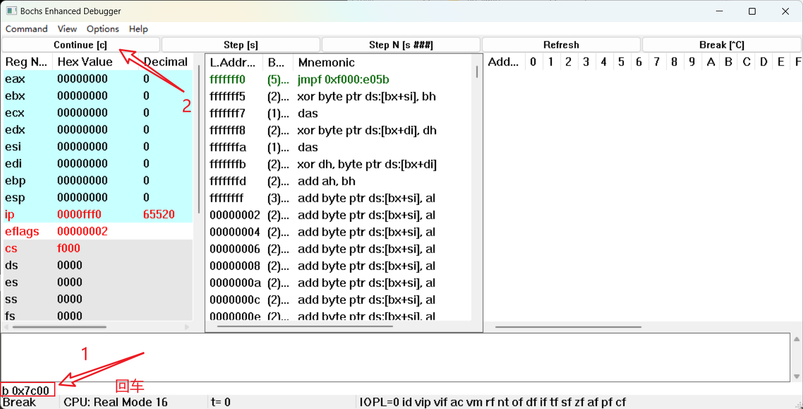

    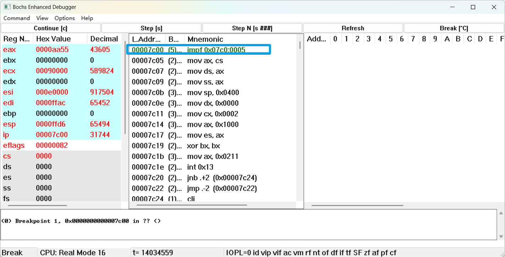

    或者断点设置为虚拟地址 `vb cs:ip` 即 `vb 0:0x7c00`

2.  如何把真正的内核程序从硬盘或软驱装载到自己想要放的地方;

    在计算机上电复位后，当自带的 BIOS 程序完成一系列自检后，他就会自动将启动盘（我们已经设置为软盘A）的引导扇区内容加载到内存的 `0:0x7C00` 处，从这里开始执行。

    引导程序首先设置段寄存器，将数据段和栈段设为 `0x7C0`（人为规定的地址），将栈顶设置到一个空闲位置，保证栈空间够用即可。然后调用BIOS提供的磁盘中断`int 0x13`将软盘上的系统内核程序（即`head.s`汇编后的二进制目标代码）加载到内存`0x010000`处。为什么不放在`0x0`处呢？因为中断向量表在这，往这放的话，中断向量表被覆盖了，`0x13`将不能正常执行。

    然后呢？然后现在引导文件的功能已经执行完了，BIOS也不再使用了，那就把这块空间让出来给内核程序吧，还能把基地址改成0x0，真香。防止被奇怪的中断打断，所以先屏蔽中断，在将`head.s`从`0x010000`移动到`0x0`。这部分工作是内核程序`head.s`完成的。

3.  如何查看实模式的中断程序？

    `0:0` 处存的是实模式下的中断向量表，可以通过查看中断向量表来查看中断程序。

    >**系统寄存器：**
    >
    >一些寄存器是为 OS 设计的。这些寄存器不会为计算保存值。只会保存 OS 的数据结构所需要的一些信息。因此他们的角色是支持整个框架。
    >
    >-   cr0，cr4 存储不同的处理器模式和虚拟内存；
    >-   cr2，cr3 被用来支持虚拟内存
    >-   cr8(别名 astpr)被用来调整中断策略
    >-   efer 是另一个 flag 寄存器，用来控制处理器模式和扩展(e.g. 长模式和系统调用处理)
    >-   idtr 保存了中断描述符表的地址
    >-   gdtr 和 ldtr 保存了描述符表的地址
    >
    >**通用寄存器：**
    >
    >通用寄存器可用于传送和暂存数据，也可参与算术逻辑运算，并保存运算结果。除此之外，它们还各自具有一些特殊功能。
    >
    >*   数据寄存器
    >*   变址寄存器
    >*   指针寄存器
    >*   段寄存器
    >*   指令指针寄存器

4.  如何静态创建 `gdt` 与 `idt` ？

    用`.word`等数据分配语句在汇编程序中将GDT/IDT的内容提前写好，被汇编器处理成二进制文件加载到内存中，然后用lgdt/lidt指令指定它们的物理地址即可。

5.  如何从实模式切换到保护模式？

    在引导程序中，首先静态配置GDT和IDT，这里只是象征性的配置一下，只配置了需要使用的部分内容，后面在内核程序中还会重新配置完整的GDT和IDT表。（引导扇区就那么大点，只需要实现必要需求。）

    ```asm
    gdt:	.word	0,0,0,0		! dummy
    
    	.word	0x07FF		! 8Mb - limit=2047 (2048*4096=8Mb)
    	.word	0x0000		! base address=0x00000
    	.word	0x9A00		! code read/exec
    	.word	0x00C0		! granularity=4096, 386
    
    	.word	0x07FF		! 8Mb - limit=2047 (2048*4096=8Mb)
    	.word	0x0000		! base address=0x00000
    	.word	0x9200		! data read/write
    	.word	0x00C0		! granularity=4096, 386
    
    idt_48: .word	0		! idt limit=0
    	.word	0,0		! idt base=0L
    gdt_48: .word	0x7ff		! gdt limit=2048, 256 GDT entries
    	.word	0x7c00+gdt,0	! gdt base = 07xxx
    ```

    设置 IDT 时，你会发现 idt_48 处的 48 位字（3 个 word）是全 0 的，这里只是把 IDTR 初始化成全 0，后面在内核里还会设置真正的 IDT 。

    看标号 gdt_48 处的48字节，低 16 位是（GDT 大小）是 0x7FF，大小设置为 2048。高 32 位，是 GDT 的起始物理地址，值就是标号 gdt 对应的物理地址（ 0x7C00 + gdt ）。lgdt 就是把 gdt_48 处的这 48 位字装进 GDTR。

    第 0 个描述符必须是全 `0`（这是规定）

    第 1 个描述符对应一个大小 8MB、基址从线性地址 0x00000000 开始的代码段我们在跳到内核程序时，就要让 CS 对应这个代码段描述符。这个描述符对应的选择子是 16 位整数 `0x08`，0x08 的低 2 位为 0（特权级 =0），第 2 位为 0（GDT 描述符），高 13 位为 0x01（GDT 的索引为 1 的描述符，就是这个代码段描述符）。

    第 2 个描述符和刚才类似，对应一个大小 8MB、基址从线性地址 0x00000000 开始的数据段，对应的选择子是 16 位整数 `0x10`。

    设置完 GDTR 和 IDTR 后，就要进入保护模式了，将控制寄存器 CR0 的第 0 位（PE）置 1，这里用了一个 lmsw 指令设置 CR0 的低 16 位：

    ```asm
    ! absolute address 0x00000, in 32-bit protected mode.
    	mov	ax,#0x0001	! protected mode (PE) bit
    	lmsw	ax		! This is it!
    ```

    此时已经进入保护模式，我们要跳到内核程序入口`0x0`处，要让 CS 对应代码段描述符，并将 EIP 设为0，而代码段描述符对应的选择子是 `0x08` 。我们只需要将 16 位整数 0x08 给 CS 赋值，处理器就会自动地令 CS 对应 0x08 作为段选择子对应的段描述符。能够同时给 CS 和 IP 赋值的指令是什么？是远转移！因此：

    ```asm
    	jmpi	0,8		! jmp offset 0 of segment 8 (cs)
    ```

    >   一定要正确区分这几种跳转（本质上都是能够修改 CS 和 EIP 的行为）：普通跳转、中断、中断返回、带特权级变换的跳转、任务切换。其中，中断和中断返回往往具有特权级变换，任务切换也可以有但也可以没有。

6.  调试跟踪 `jmpi 0,8` ，解释如何寻址？

    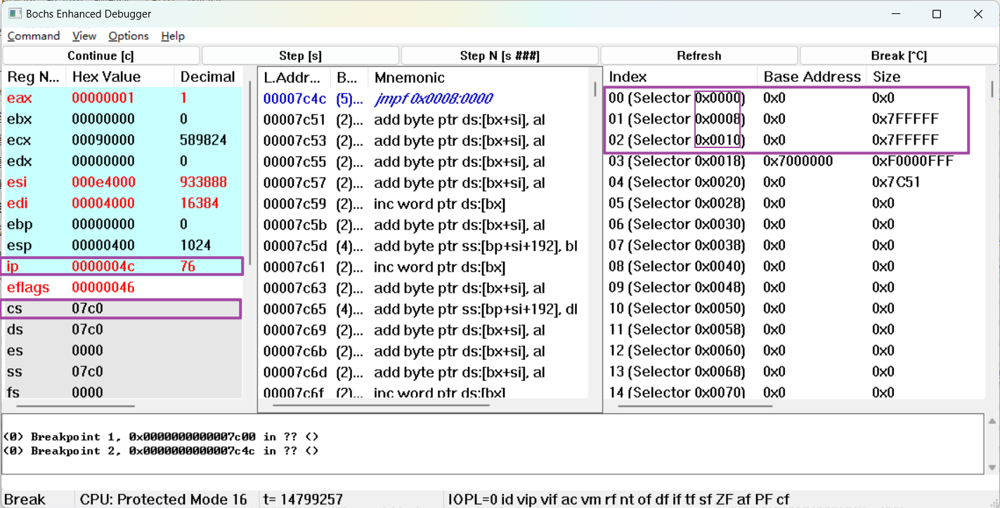
    
    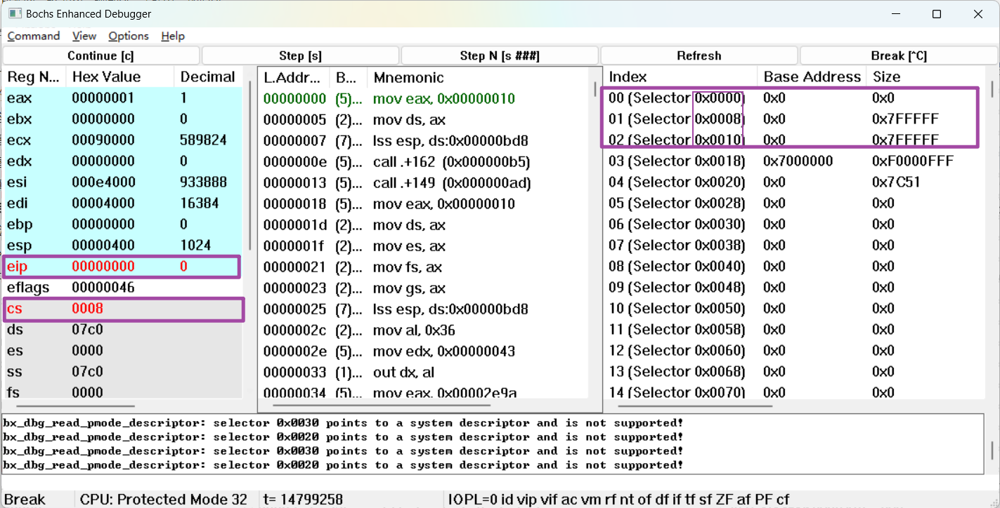
    
    通过长跳转指令修改 cs 和 eip 来寻址。

## 1.3. 实验报告

通过仔细的调试与跟踪程序，完成以下任务：

1.  请简述 `head.s` 的工作原理

    head. $s$ 包含 32 位保护模式初始化设置代码、时钟中断代码、系统调用中断代码和两个任务的代码。在

    初始化完成之后程序移动到任务 0 开始执行, 并在时钟中断控制下进行任务 0 和 1 之间的切换操作。

    1.   在新的位置重新设置 IDT 和 GDT 表。
    2.   设置 8253 定时芯片。把计数器通道 0 设置成每隔 10 毫秒向中断控制器发送一个中断请求信号。
    3.   在 IDT 表第 8（0x08）和第 128（0x80）项处分别设置定时中断门描述符和系统调用陷阱门描述符。
    4.   为移动到任务 0 中执行来操作堆栈内容, 在堆栈中人工建立中断返回时的场景。即设置任务 0 的 TSS（任务状态段）、TR、LDTR等
    5.   跳转到 task0 执行屏幕打印 A 的操作，同时通过中断实现 task0 和 task1 的任务切换。

2.  请记录 `head.s` 的内存分布状况，写明每个数据段，代码段，栈段的起始与终止的内存地址

    `head.s` 定义了

    *   3 个栈空间。
    *   IDT、GDT 数据空间； TSS0 和 LDT0 静态数据段等
    *   设置时钟中断等代码段

    ```asm
    startup_32: # 首先加载数据段寄存器 DS、堆栈段寄存器 SS 和堆栈段指针 ESP。所有段的线性基地址都是 0.
    	movl $0x10,%eax 	# 0x10 是 GDT 中数据段选择符
    	mov %ax,%ds
    #	mov %ax,%es
    	lss init_stack,%esp
    ```

    ```asm
    # 刚进入保护模式时用于加载 SS:ESP 堆栈指针值
    init_stack:                          # Will be used as user stack for task0.
    	.long init_stack	# 堆栈段偏移值
    	.word 0x10			# 堆栈段同内核数据段
    ```

    其中，`init_stack` 是他在 `head.s` 里静态设置的一段数据区，这段数据区在刚才的加载时会随着内核被搬运。`lss` 就是把 `init_stack` 位置处的 32 位字和接下来的 16 位字（栈段选择子，即数据段选择子 `0x10`）装入 `ESP` 和 `SS`，这里的 32 位字就是地址 `init_stack` ，也就是说，`ESP` 初始指向 `init_stack`，要注意栈顶是向低地址方向增长的，因此用 `.fill` 语句在这个地址的前面分配 128*4=512 字节的初始为全 0 的栈空间。`head.s` 里定义了 3 个类似的栈空间，这里的栈空间 init_stack 是专门给内核初始化代码和 task0 任务使用的。

    ```asm
    end_gdt:
    	.fill 128,4,0
    init_stack:                          # Will be used as user stack for task0.
    	# 刚进入保护模式时用于加载 SS:ESP 堆栈指针值
    	.long init_stack	# 堆栈段偏移值
    	.word 0x10			# 堆栈段同内核数据段
    ```

    之后调用了两个函数 `setup_idt` 和 `setup_gdt` 来设置新的 GDT 和 IDT，设置完后，把数据段选择子重新装入到除 CS 外的段寄存器里：

    ```asm
    # setup base fields of descriptors. 重新设置 IDT 和 GDT 表。
    	call setup_idt	# 设置 IDT。先把 256 个中断门都填默认处理过程的描述符
    	call setup_gdt	# 设置 GDT
    	movl $0x10,%eax	# reload all the segment registers after changing gdt.
    	mov %ax,%ds		
    	mov %ax,%es
    	mov %ax,%fs
    	mov %ax,%gs
    	lss init_stack,%esp
    ```

    下面看 GDT 的静态数据：

    ```asm
    lgdt_opcode:
    	.word (end_gdt-gdt)-1	# so does gdt
    	.long gdt		# This will be rewrite by code.
    
    	.align 8
    idt:	.fill 256,8,0		# IDT 空间。共 256 个门描述符, 每个 8 字节, 共占用 2KB 。
    
    gdt:	.quad 0x0000000000000000	/* NULL descriptor */
    	.quad 0x00c09a00000007ff		/* 8Mb 0x08, base = 0x00000 */
    	.quad 0x00c09200000007ff		/* 8Mb 0x10 */
    	.quad 0x00c0920b80000002		/* screen 0x18 - for display */
    
    	.word 0x0068, tss0, 0xe900, 0x0	# TSS0 descr 0x20
    	.word 0x0040, ldt0, 0xe200, 0x0	# LDT0 descr 0x28
    	.word 0x0068, tss1, 0xe900, 0x0	# TSS1 descr 0x30
    	.word 0x0040, ldt1, 0xe200, 0x0	# LDT1 descr 0x38
    end_gdt:
    ```

    装入 GDTR 的 48 位字在 lgdt_opcode 处，这里设置了 GDT 大小，就是静态 GDT 数据的字节数（`end_gdt-gdt`，8 个 64 位描述符）。物理地址等于标号 gdt（因为 `head.s` 的二进制内容被搬运到 0x00000000 处了，数据和代码段基址都是 0，因此 `head.s` 的标号就等于偏移地址，等于线性地址，等于物理地址！）。这里的 GDT 具有 8MB 的数据和代码段。代码段选择子依旧是 0x08，数据段选择子是 0x10），这里多了 5 个描述符，其解释如下：

    *    GDT 表。第 1 个描述符不用。全零。
    *   第 2 个是内核代码段描述符。其选择符是 `0x08`
    *   第 3 个是内核数据段描述符。其选择符是 `0x10`
    *   第 4 个是显示内存段描述符。其选择符是 `0x18`
    *   第 5 个是 TSS0 段的描述符。其选择符是 `0x20`
    *   第 6 个是 LDT0 段的描述符。其选择符是 `0x28`
    *   第 7 个是 TSS1 段的描述符。其选择符是 `0x30`
    *   第 8 个是 LDT1 段的描述符。其选择符是 `0x38`

    下面看 IDT 的静态数据：

    `lidt_opcode`，类似的，这里的要装入 IDTR 的 48 位字的意义是，IDT 的物理地址是标签 idt，IDT 大小是 2048 字节（256 个 64 位描述符，对应 256 种中断）。然后标签 `idt` 处他用 `.fill` 语句分配了 256*8=2048 字节的全 0 的静态数据

    ```asm
    lidt_opcode:
    	.word 256*8-1		# idt contains 256 entries
    	.long idt		# This will be rewrite by code.
    ```

    后面在设置 IDT 时会手动把 IDT 描述符填进去，如下：

    ```asm
    # 把所有 256 个中断门描述符设置为使用默认处理过程。 设置方法与设置定时中断门描述符的方法一样。 选择符为 0x0008。
    setup_idt:
    	lea ignore_int,%edx		# 设置方法与设置定时中断门描述符的方法一样
    	movl $0x00080000,%eax	
    	movw %dx,%ax		/* selector = 0x0008 = cs */
    	movw $0x8E00,%dx	/* interrupt gate - dpl=0, present 中断门类型，特权级为 0 */
    	lea idt,%edi
    	mov $256,%ecx		# 循环设置所有 256 个门描述符
    rp_sidt:
    	movl %eax,(%edi)
    	movl %edx,4(%edi)
    	addl $8,%edi
    	dec %ecx
    	jne rp_sidt
    	lidt lidt_opcode	# 最后的 6 字节操作数加载 IDTR 寄存器
    	ret
    ```

    这段代码暂时设置 IDT 表中所有 256 个中断门描述符都为同一个默认值，均使用默认的中断处理过程 `ignore_int`。设置的具体方法是：首先在 `eax` 和 `edx` 寄存器对中分别设置好默认中断门描述符的 0-3 字节和 4-7 字节的内容，然后利用该寄存器对 循环往 IDT 表中填充默认中断门描述符内容。

    

    继续看内核初始化代码段，设置 8253 定时芯片。把计数器通道 0 设置成每隔 10 毫秒向中断控制器发送一个中断请求信号（产生中断号为 0x08 的时钟中断）：

    ```asm
    # setup up timer 8253 chip.
    	movb $0x36, %al
    	movl $0x43, %edx
    	outb %al, %dx
    	movl $11930, %eax        # timer frequency 100 HZ
    	movl $0x40, %edx
    	outb %al, %dx
    	movb %ah, %al
    	outb %al, %dx
    ```

    接下的代码段仍然在设置 IDT,在 IDT 表第 8(0x08) 和第 128(0x80) 项处分别设置定时中断门描述符和系统调用陷阱门描述符：

    >   即门描述符指向中断处理程序的入口地址（timer_interrupt、system_interrupt），然后把们描述符分别放在 IDT 的第 0x08 和第 0x80 项。

    ```asm
    # setup timer & system call interrupt descriptors.
    	movl $0x00080000, %eax
    	movw $timer_interrupt, %ax	# timer_interrupt (0x08)
    	movw $0x8E00, %dx
    	movl $0x08, %ecx            # The PC default timer int.
    	lea idt(,%ecx,8), %esi
    	movl %eax,(%esi)
    	movl %edx,4(%esi)
    	movw $system_interrupt, %ax	# system_interrupt (0x80)
    	movw $0xef00, %dx
    	movl $0x80, %ecx
    	lea idt(,%ecx,8), %esi
    	movl %eax,(%esi)
    	movl %edx,4(%esi)
    ```

    <font color=red>重点：</font>

    接下来几行是 `head.s` 中最重要的部分之一，作用是设置任务 0 的 TSS 和 LDT，然后在任务 0 下跳转到用户态。

    下面 3 行我们为移动到任务 0 中执行来操作堆栈内容，在堆栈中人工建立中断返回时的场景。 EFLAGS 的 NT 标志位（第 14 位）置 0（通过栈修改 EFLAGS 是常见操作，pushfl 和 popfl 是对 EFLAGS 的压栈/出栈指令），NT=1 表明当前任务是嵌套的，之后会切换回原任务的 TSS。这里将 NT 清 0，因为接下来要设置的第一个任务之前没有旧的任务，显然不是嵌套的。

    ```asm
    # Move to user mode (task 0)
    	pushfl	# 复位标志寄存器 EFLAGS 中的嵌套任务标志
    	andl $0xffffbfff, (%esp)
    	popfl
    ```

    接下来 5 行是设置任务 0 的 TSS 和 LDT，其实就是通过 ltr 和 lldt 指令将 TSS0 和 LDT0 的段选择子装入TR 和 LDTR 中。current 对应一个内存单元，其目的是告诉后面的时钟中断处理程序现在在哪个任务，以实现正确切换任务。

    ```asm
    SCRN_SEL	= 0x18 		# 屏幕显示内存段选择符
    TSS0_SEL	= 0x20 		# 任务 0 的 TSS 段选择符
    LDT0_SEL	= 0x28		# 任务 0 的 LDT 段选...
    	movl $TSS0_SEL, %eax
    	ltr %ax
    	movl $LDT0_SEL, %eax
    	lldt %ax
    	movl $0, current
    	sti
    ```

    在对应标号处来看一下 TSS0 和 LDT0 的静态数据：

    ```asm
    ldt0:	.quad 0x0000000000000000
    	.quad 0x00c0fa00000003ff	# 0x0f, base = 0x00000
    	.quad 0x00c0f200000003ff	# 0x17
    
    tss0:	.long 0 				/* back link */
    	.long krn_stk0, 0x10		/* esp0, ss0 */
    	.long 0, 0, 0, 0, 0			/* esp1, ss1, esp2, ss2, cr3 */
    	.long 0, 0, 0, 0, 0			/* eip, eflags, eax, ecx, edx */
    	.long 0, 0, 0, 0, 0			/* ebx esp, ebp, esi, edi */
    	.long 0, 0, 0, 0, 0, 0 		/* es, cs, ss, ds, fs, gs */
    	.long LDT0_SEL, 0x8000000	/* ldt, trace bitmap */
    ```

    这里的 LDT 具有两个有效的段描述符，基地址都是 0，大小都是 8MB，分别对应代码段和数据段。描述符的特权级字段为 3，能够被用户态程序访问和使用（GDT 里只能被特权级 `=0` 的内核程序使用）。因此，用户代码段选择子就是 `0x0F`，用户数据段选择子就是 `0x17`。

    tss0 处是 TSS0 的初始数据，这里只专门指定了 3 个字段的值：

    *   一个是特权级变到 0 时应切换到的 SS 和 ESP，也就是任务 0 的内核栈栈顶（在中断处理程序中使用）：
        *   ESP 对应标号 krn_stk0 处的内存区
        *   SS 对应 GDT 中的内核数据段选择子 `0x10`。

    *   另外一个是任务 0 的 LDT 选择子 LDT0_SEL。剩下的字段就都初始化为 0 了。

    >   改变特权级并不代表任务的切换，这往往是在同一任务之下进行的。任务切换的本质是 TR 指向的 TSS 从旧的 TSS 变到新的 TSS。也就是说，TR 里的选择子对应的 TSS 就是当前任务的 TSS。在切换过程中，所有寄存器状态被保存到旧 TSS 的对应字段中（我们在后面马上就会看到），而寄存器们会被更新为新 TSS 里的字段指定的值。而不同的任务除了拥有自己的 TSS，还拥有自己的 LDT，不同任务自己的地址空间的段描述符可以在自己的 LDT（局部描述符表）中，而不是在 GDT（全局描述符表，所有任务共享）中。任务切换时，LDTR 也会切换到 TSS 指定的 LDT 选择子。

    如果在任务 0 的用户程序运行时发生了中断，特权级变换到 0，由于 TSS0 的 ss0 和 esp0 字段是 `0x10` 和 `krn_stk0`，所以 SS 和

    ESP 会被其赋值。即 SS 和 ESP 在从高特权级切换到低特权级（从特权级 3 变到特权级 0）时，`SS:ESP` 指向的栈顶会自动切换到当前 TSS 为对应特权级 指定的位置上。

    TSS1  的静态数据如下：

    ```asm
    tss1:	.long 0 				/* back link */
    	.long krn_stk1, 0x10		/* esp0, ss0 */
    	.long 0, 0, 0, 0, 0			/* esp1, ss1, esp2, ss2, cr3 */
    	.long task1, 0x200			/* eip, eflags */
    	.long 0, 0, 0, 0			/* eax, ecx, edx, ebx */
    	.long usr_stk1, 0, 0, 0		/* esp, ebp, esi, edi */
    	.long 0x17,0x0f,0x17,0x17,0x17,0x17 /* es, cs, ss, ds, fs, gs */
    	.long LDT1_SEL, 0x8000000	/* ldt, trace bitmap */
    ```

    现在已经通过初始化（注意这里并不是任务切换），现在已经让处理器处于任务 0 之下了。接下来就要跳转到任务 0 的用户程序了，既然是“用户程序”，它应该运行在特权级 3，也就是说我们要进行一个带有特权级变换的跳转。来看代码：

    ```asm
    	sti
    	pushl $0x17			# 把任务 0 当前局部空间数据段（堆栈段）选择符入栈
    	pushl $init_stack	# 把堆栈指针入栈（也可以直接把 ESP 入栈）
    	pushfl				# 把标志寄存器值入栈
    	pushl $0x0f			# 把当前局部空间代码段选择符入栈
    	pushl $task0		# 把代码指针入栈
    	iret				# 执行中断返回指令，从而切换到特权级 3 的任务 0 中执行
    ```

    第一行 sti 指令是将标志位 IF 置 1，允许中断，因为后面需要能接收时钟中断。然后是 5 个 push：

    *   首先，将 `0x17` 和 init_stack 标号地址压入栈顶

        `0x17` 是刚才在 LDT 里创建的用户数据段的选择子

        `init_stack` 是我们前面分配的其中一个栈空间栈底的地址

        即跳转后把栈顶切换到地址 `0x17:init_stack` 处

    *   通过 pushfl 指令将 EFLAGS 压栈

    *   将 `0x0F` 和 `task0` 标号地址压入栈顶

        `0x0F` 就是刚才在 LDT 里创建的用户代码段的选择子

        `task0` 标号就是任务 0 用户程序的入口

        `0x0F:task0` 就是我们跳转的目的地址！

    *   执行 iret 指令，iret 本来是用于中断返回的，但是我们不这么用他，而是精心构造一个栈顶，让处理器以“中断返回”的方式实现带有特权级变换的跳转（因为中断和中断返回是最为典型的带特权级变换的跳转）。

    iret 会把栈顶弹出，更新 CS 和 IP，然后把下一个栈顶弹出，更新 EFLAGS，然后把下两个栈顶弹出，更新SS 和 ESP（所谓的栈切换），这就是为什么我们要进行 5 个 push 的原因。

    剩下的部分就是进程切换的精髓，即通过定时器中断，在 task0 和 task1 之间进行任务切换，这部分后面会说到。

3.  简述 `head.s` `57` 至 `62` 行在做什么？

    ```asm
    	pushl $0x17			# 把任务 0 当前局部空间数据段（堆栈段）选择符入栈
    	pushl $init_stack	# 把堆栈指针入栈（也可以直接把 ESP 入栈）
    	pushfl				# 把标志寄存器值入栈
    	pushl $0x0f			# 把当前局部空间代码段选择符入栈
    	pushl $task0		# 把代码指针入栈
    	iret				# 执行中断返回指令，从而切换到特权级 3 的任务 0 中执行
    ```

    精心构造一个栈顶，通过中断返回的方式实现特权级由大到小的切换，并切换到 task0。

4.  简述 `iret` 执行后， `pc` 如何找到下一条指令？

    调用中断时，会保护现场，将栈顶指针，EFLAGS，下一条指令地址等寄存器信息压栈，然后执行完中断程序 `iret` 时，弹栈恢复寄存器的值，`pc` 指向栈顶弹出的地址信息。

5.  记录 `iret` 执行前后，栈是如何变化的？

    `iret` 执行前弹栈恢复寄存器（场景复原），最后弹出的栈指针将栈指向下一要执行的栈顶位置。

    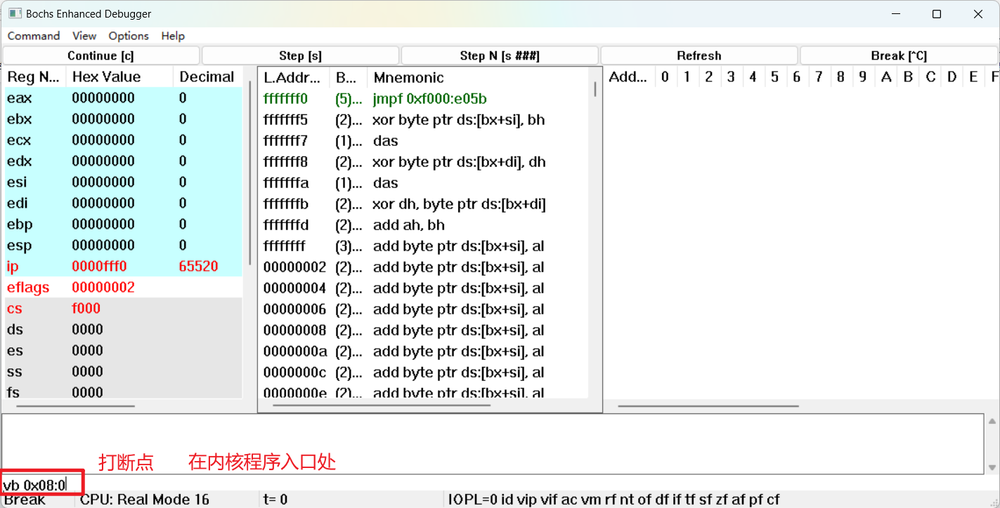

    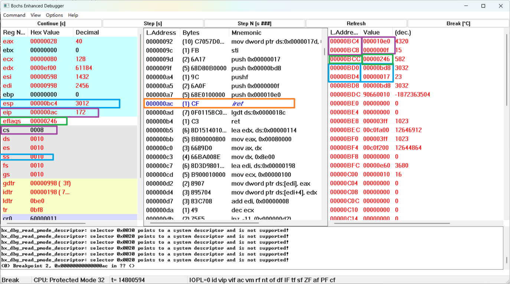

    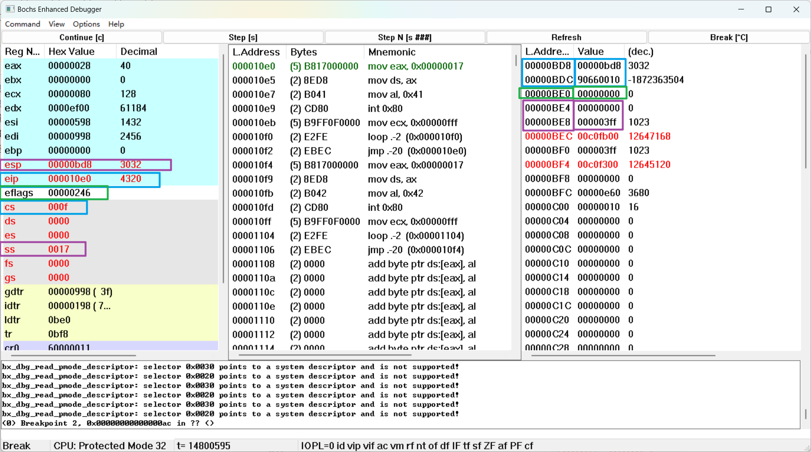

    栈顶 `SS:ESP` 自动切换为了我们之前指定的用户栈栈顶 `0x17:0x0BD8`

    而且 `CS:EIP` 跳转到了 `0x0F:0x10E0` 执行。这就是具有特权级变换的跳转。

6.  当任务进行系统调用时，即 `int 0x80` 时，记录栈的变化情况。

    ```
    vb 0x0f:0x010e9
    c
    ```

    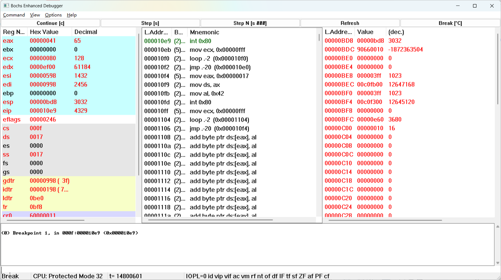

     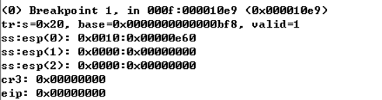

     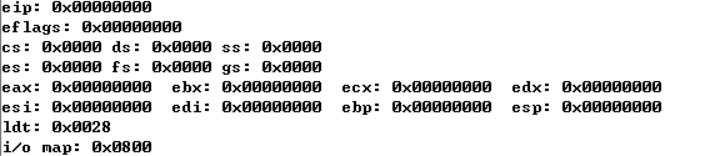

    可以发现，现在栈顶 `SS:ESP` 还是指向 `0x17:0x0BD8`，此时 `CS:EIP=0x0F:0x10E9`，然后我们点 Step[s]，执行这条指令，观察栈的变化：

    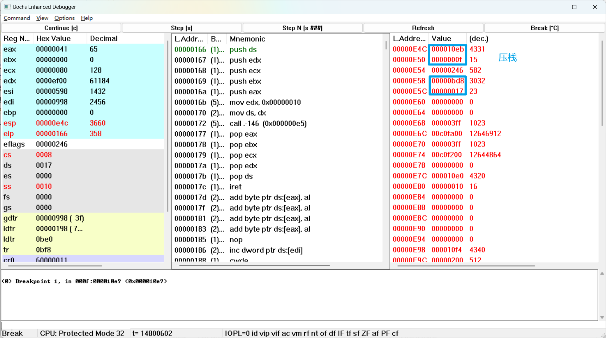

    我们发现 `SS:ESP` 自动切换到了任务 0 内核栈 `0x10:0x0E4C` 处，并且 `CS:EIP` 跳转到了系统调用中断处理程序入口（标号 system_interrupt）地址 `0x08:0x0166` 处。并且，可以发现原来的用户栈栈顶地址 `0x17:0x0BD8` 和中断返回地址 `0x0F:0x10EB `被压到了内核栈栈顶。
    
    为什么此时 `SS:ESP` 会自动发生切换呢？进行带有特权级变换的跳转时，如果是从高特权级跳到低特权级，会将栈顶地址 `SS:ESP` 切换到 TSS 对应字段指示的值。验证一下，在底下的文本框里输入调试命令 `info tss` 查看当前 TSS 信息：
    
     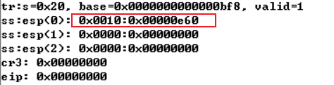
    
     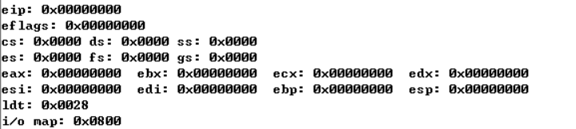
    
    为什么 TSS 中 `SS:ESP` 是 `0x010:0x0e60` 而不是 `0x10:0x0E4C` 因为还要向栈中压入用户栈顶、EFLAGS 和 用户程序返回地址共 5 个 32 位字，即 20 个字节(0x14)。而栈又是向低地址生长的，所以 `0x0e60-0x14=0x0E4C` 。

## 1.4 熟悉实验环境

### 1.4.1 Linux 环境下

安装测试环境：

```
git clone https://gitee.com/guojunos/Linux000.git
```

```
bochs -q -f ./linux000_gui.bxrc
```

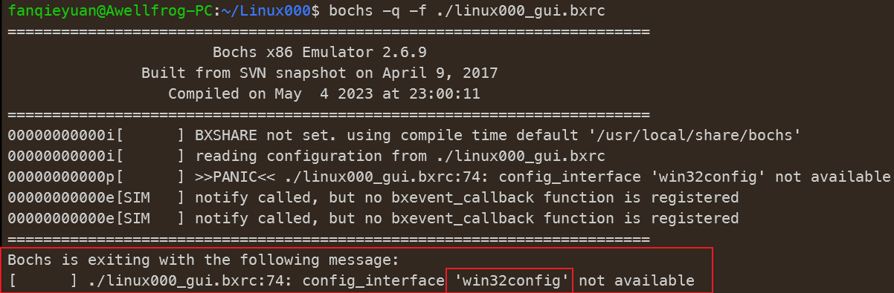

发现在Linux环境下报错了，要修改配置为 Linux，查看 `linux000_gui.bxrc` ：

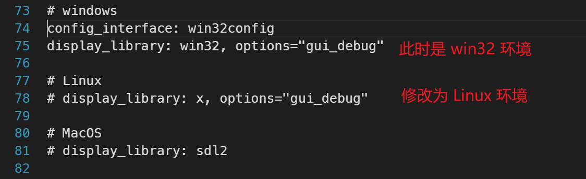

运行命令，看到窗口弹出

```
bochs -q -f ./linux000_gui.bxrc
```

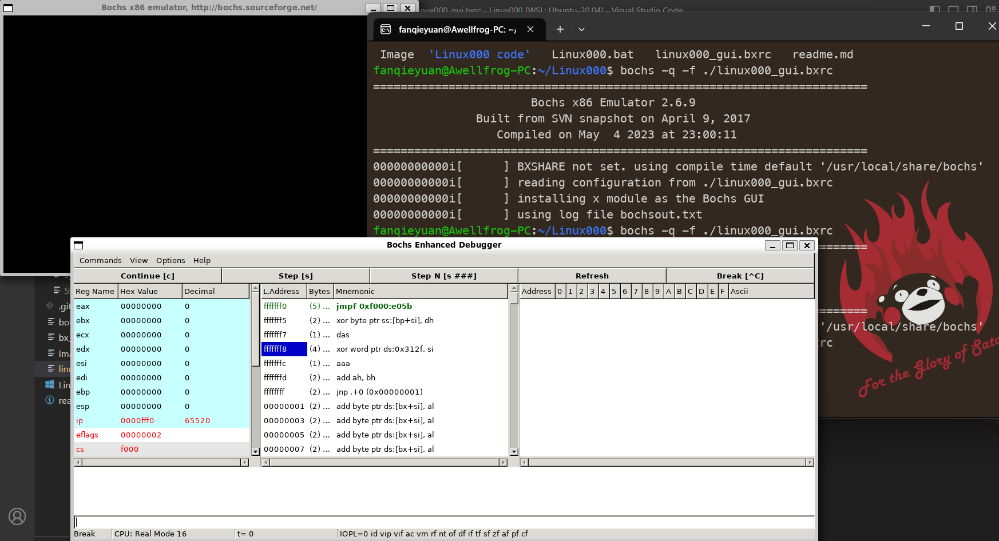

点击 `Continue[c]` 可以看到窗口中反复打印着 `AB`

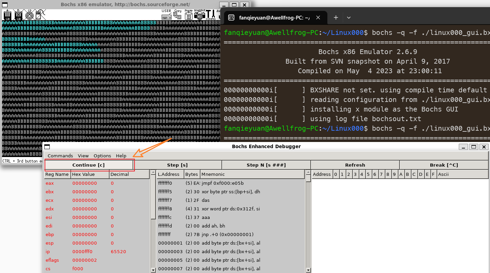

### 1.4.2 Windows 环境下

按照老师的提示：

>   `windows` 下可直接运行 `Linux000.bat`

双击后发现直接闪退。

查看其命令：

```
bochsdbg -q -f Linux000_gui.bxrc
```

在 `Linux000_gui.bxrc` 路径下的命令行执行该语句，报错：让确认路径是否正确。

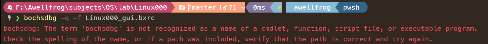

用 everything 找到该文件路径，然后用绝对路径尝试：

```
C:\Bochs\bochsdbg.exe -q -f Linux000_gui.bxrc
```

就可以正常运行了

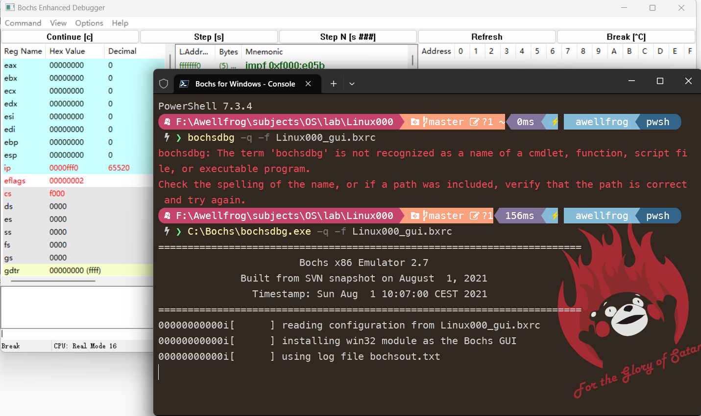

但是点击 `continue[c]` 还是有问题：

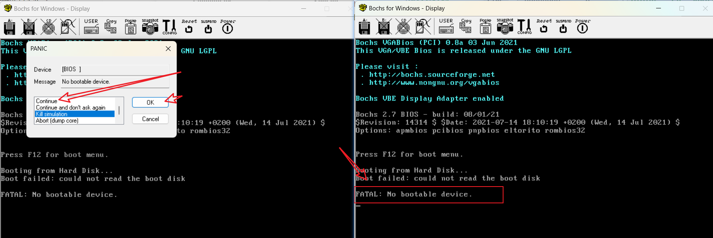

不知道改什么了，把整个文件删了重新 git 就好了。。。

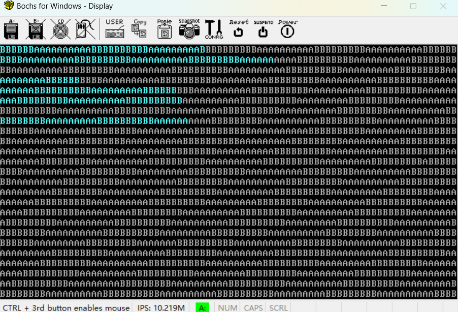
