# 2. 调试分析 Linux 0.00 多任务切换

## 2.1. 实验目的

-   通过调试一个简单的多任务内核实例，使大家可以熟练的掌握调试系统内核的方法；
-   掌握Bochs虚拟机的调试技巧；
-   通过调试和记录，理解操作系统及应用程序在内存中是如何进行分配与管理的；

## 2.2. 实验内容

通过调试一个简单的多任务内核实例，使大家可以熟练的掌握调试系统内核的方法。 这个内核示例中包含两个特权级 `3` 的用户任务和一个系统调用中断过程。我们首先说明这个简单内核的基本结构和加载运行的基本原理，然后描述它是如何被加载进机器 `RAM` 内存中以及两个任务是如何进行切换运行的。

### 2.2.1. 掌握Bochs虚拟机的调试技巧

-   如何单步跟踪？
-   如何设置断点进行调试？
-   如何查看通用寄存器的值？
-   如何查看系统寄存器的值？
-   如何查看内存指定位置的值？
-   如何查看各种表，如 `gdt` ，`idt` ，`ldt` 等？
-   如何查看 `TSS`？
-   如何查看栈中的内容？
-   如何在内存指定地方进行反汇编？

## 2.3. 实验报告

通过仔细的调试与跟踪程序，完成以下任务：

1.  当执行完 `system_interrupt` 函数，执行 `153` 行 `iret` 时，记录栈的变化情况。

    `int 0x80` 查 IDT 跳转到 system_interrupt 的程序入口地址：

    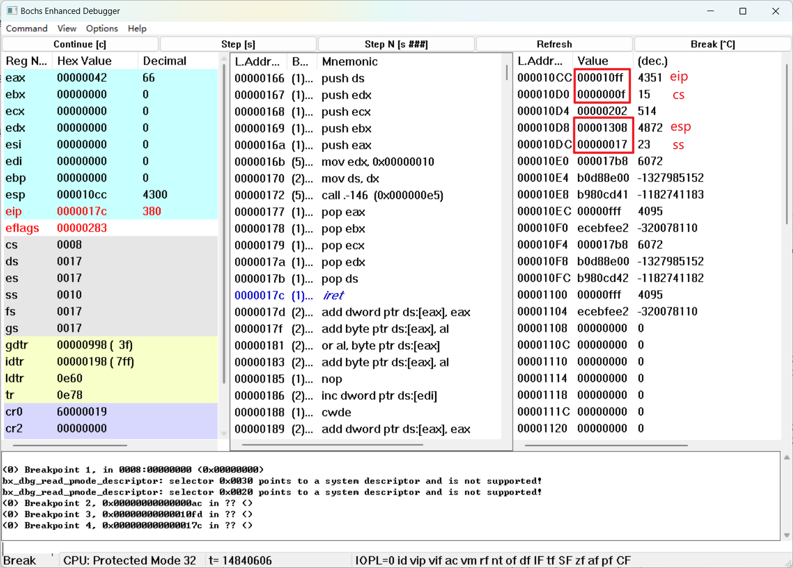

     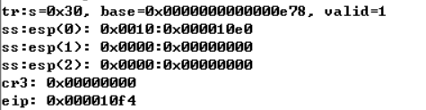

     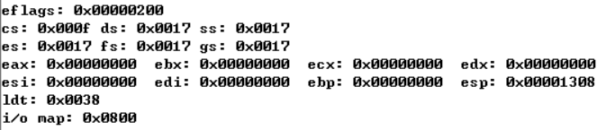

    可以看到 `iret` 执行后，利用栈中的信息进行场景恢复，将寄存器的值进行修改。

    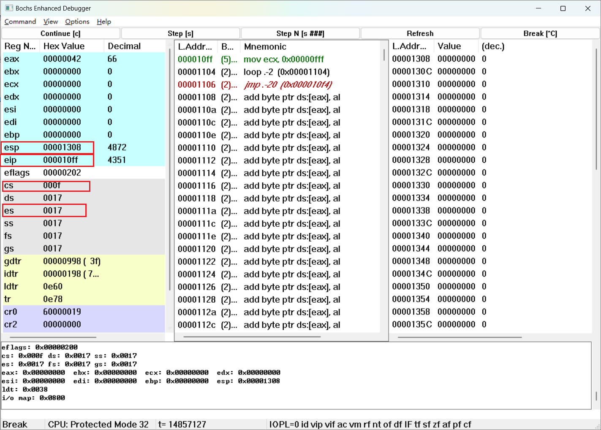

     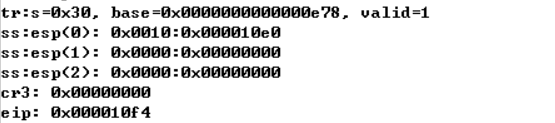

     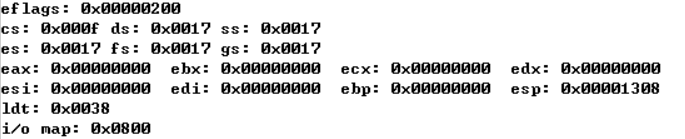

2.  当进入和退出 `system_interrupt` 时，都发生了模式切换，请总结模式切换时，特权级是如何改变的？栈切换吗？如何进行切换的？

    **进入 system_interrupt 时：**

    在用户模式（特权级为3）想要打印一些字符信息，就要调用 `int 0x80` ，前面已经设置好的 `IDT`，处理器会去 `IDT` 中查找中断号 `0x80` 对应的门描述符，我们已经设置好了，该门描述符入口地址指向 `0x08:system_interrupt`，也就是说，要跳转到这里，并且由于 `0x08` 这个选择子（内核代码段）的特权级为 0，程序之后会运行在特权级为0 的内核态。

    由于特权级变到 0 了，而此时 `TSS0 `刚好被设置为 ：`TSS0` 中 `ss0` 字段值为 `0x10`（内核数据段选择子），`esp0` 字段值为 `krn_stk0` 标号地址（任务 0 的内核栈栈底地址，对应一个我们分配的 512 字节栈空间），也就是说，发生中断时会把栈顶切换到内核栈处。然后在内核栈中保护进入前的用户现场。

    **出 system_interrupt  时：**

    用 iret 进行中断返回，要从内核栈栈顶弹出返回地址、EFLAGS、返回后切换的栈顶（切换回用户栈），这时特权值也被修改为用户模式（特权级为3）。

3.  当时钟中断发生，进入到 `timer_interrupt` 程序，请详细记录从任务 `0` 切换到任务 `1` 的过程。

    ```asm
    /* Timer interrupt handler */
    .align 2
    timer_interrupt:
    	push %ds
    	pushl %eax
    	movl $0x10, %eax
    	mov %ax, %ds
    	movb $0x20, %al
    	outb %al, $0x20
    	movl $1, %eax
    	cmpl %eax, current
    	je 1f
    	movl %eax, current
    	ljmp $TSS1_SEL, $0
    	jmp 2f
    1:	movl $0, current
    	ljmp $TSS0_SEL, $0
    2:	popl %eax
    	pop %ds
    	iret
    ```

    假设任务 1 从未执行过，现在还处于任务 0，因此会去执行 `ljmp $TSS1_SEL, $0` 。`TSS1_SEL=0x30`，就是 `GDT` 里定义的 `TSS1` 描述符的选择子，也就是说，使用一个远转移指令，试图将这个 `TSS1` 选择子装到 CS 中,这本质上就是任务切换的一种实现方式。执行完这条指令后，TR 会自动指向 `TSS1` 的选择子。处理器内所有寄存器的值（现场）都会保存到 `TSS0` 的字段里（值得一提的是，此时 `CS:EIP` 暂时还指向下一条指令 `jmp 2f`，这个代码地址也会被保存到 `TSS0` 里，这在后面很重要！）

    和 `TSS0` 不同，`TSS1` 有更多的字段初值不是 0，是专门设置过的，这是因为 `TSS0` 是一开始初始化的任务，其各个寄存器字段初值并不怒重要，因为用不到，只需要留出空间让任务切换时寄存器现场的值可以自动存入其中即可。但是第一次用到 `TSS1` 就要用到它的各个字段的初值。`esp0` 和 `ss0` 与 `TSS0` 的类似，表示在任务 1 下发生中断使得特权级变换到 0 时，需要将栈切换到`0x10:krn_stk1` 位置处（`0x10` 是内核数据段选择子），这个便是任务 1 的内核栈（所以，你会发现，同样是内核态，处于任务 0 和处于任务 1 时使用的内核栈是不同的！）。`CS` 和 `EIP` 也是初始专门指定的，指向 `0x0F:task1`，和任务 0 一样（这俩任务的 `LDT` 是一模一样的），任务 1 的用户代码段选择子也是 `0x0F`，而标号 `task1` 处的就是任务 1 的用户程序。所以，执行完任务切换后，因为 `CS` 和 `EIP` 被改成了它们，就相当于执行了一个带有特权级变换的跳转，直接跳到任务 1 的用户程序执行。然后他还指定了其它段寄存器的值都要被改成任务 1 的用户数据段选择子 `0x17`，ESP 要改成 `usr_stk1`（这个就是任务 1 的用户栈），以及 `LDTR` 应该指向任务 1 的 `LDT`。

    ```
    b 0x12c
    c
    ```

    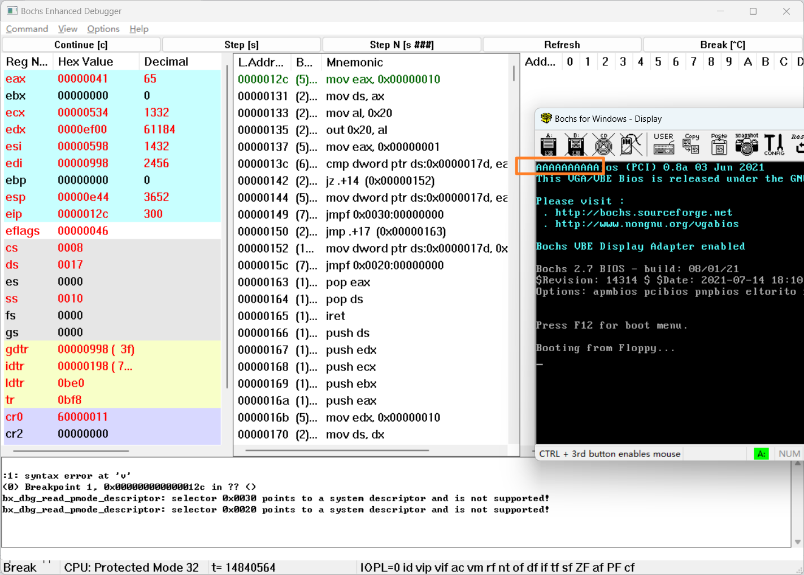

    此时任务 0 已经打出来几个 A 了，任务 1 还没有开始执行。

    点 Step[s] 跟踪中断处理程序的执行，直到它将要执行某条远转移指令 `jmpf`（就是 `head.s` 里写的 `ljmp`，不同风格写法不一样，但都是一样的指令）。点 `View-GDT` 顺便再看一下 `GDT`：

    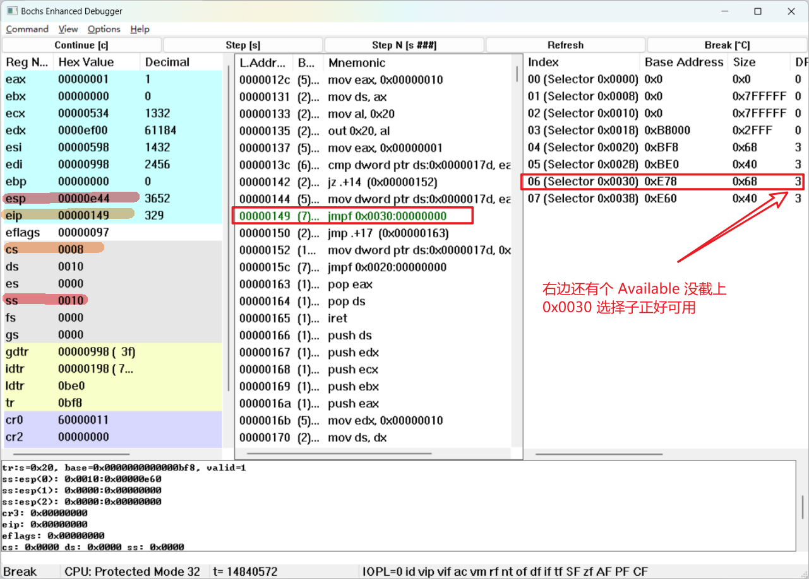

    现在处理器将要执行位于 `0x08:0x0149` 处的远转移指令“`jmpf 0x30:0`”。之前分析过了，这条远转移指令意图将一个 `TSS` 选择子装入 CS，实际上就是为了将任务切换到这个 `TSS` 。我们看这条指令的选择子是 `0x30`，看右边显示的 `GDT` ，`0x30` 恰好就是一个还未执行的 `TSS` 选择子。这个时候我们再在底下输入调试命令“`info tss`”，看一下任务切换前的 `TSS` 。

    点 Step[s]，执行这条任务切换指令，观察寄存器状态的变化：

    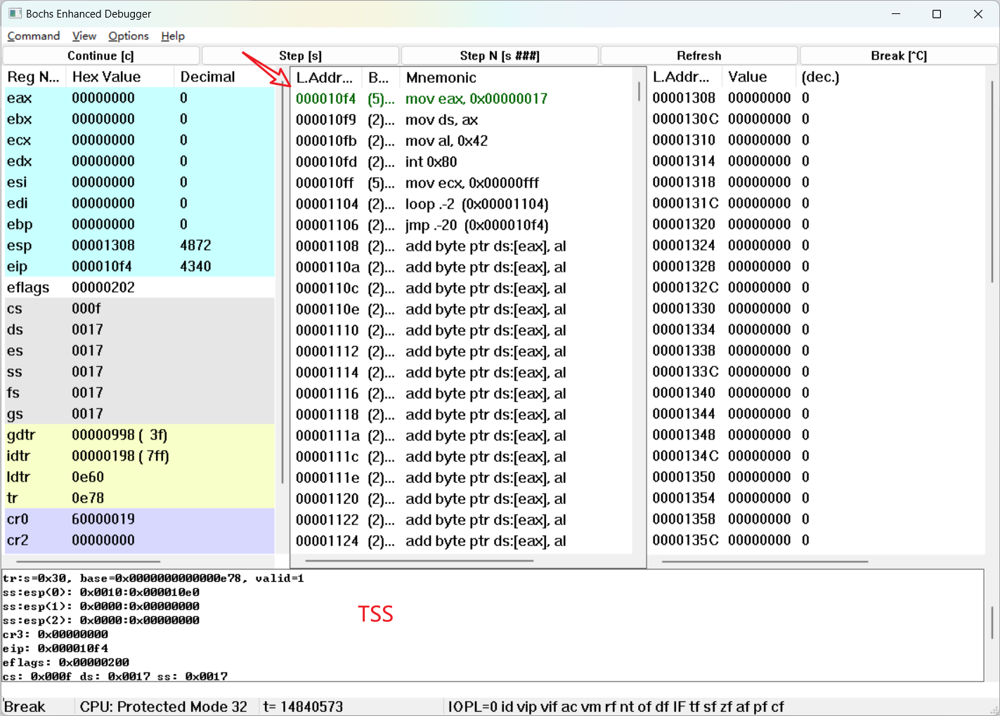

    现在，我们已经切换到任务 1 了，由于任务 1 是第一次执行，直接跳转到了用户程序 `task1` 的入口处。可以发现相比于前面，各个寄存器的值发生了很大变化。然后我们再输入调试命令“`info tss`”，并查看现在的 `TSS`。

4.  又过了 `10ms` ，从任务1切换回到任务 `0` ，整个流程是怎样的？ `TSS` 是如何变化的？各个寄存器的值是如何变化的？

    又过了 `10ms` 任务 1 被定时器中断打断，将切换到内核段，将任务 1 的现场保护在内核栈 1 中，顺序执行中断程序跳转至第 17 行，切换到 `TSS0` ，这个时候直接利用 `TSS0` 中存放的寄存器值，将场景恢复至上一次从 `TSS0` 切换到 `TSS1` 时的场景，同时将 `TSS1` 当前的场景存在 `TSS1` 中。`SS:ESP` 指向的是任务 0 的内核栈，`CS:EIP` 指向的是下一条指令 `jmp 2f`，各个通用寄存器的值都是任务 0 进入中断处理程序时的值。`TSS0` 从上面代码第 15 行继续执行，弹出内核栈 0 的栈顶，即指向任务 0 被中断打断的位置，从而回到任务 0 继续执行，仿佛什么都没有发生过一样。

    调试查看过程如下：

    承接上一问，已经从任务 0 切换到任务 1 了，正好我们已经在时钟中断处理程序入口处设置了断点，那就直接点 Continue，运行到下一次时钟中断发生为止

    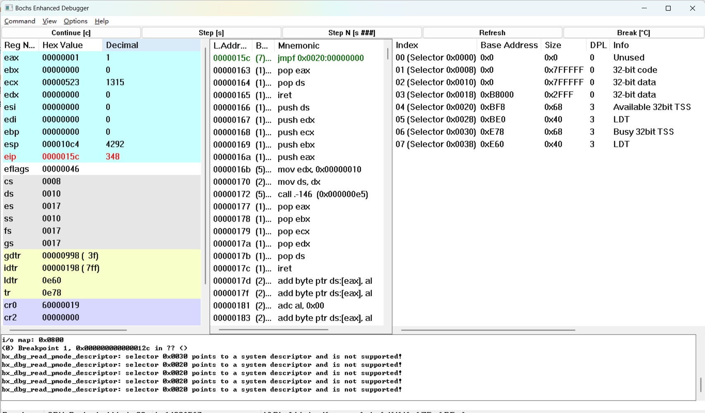

    此时，它将要执行的是另一条 `jmpf` 指令，使用的选择子是 `0x20`，看右边的 `GDT`，`0x20` 刚好就是另一个 `TSS` 选择子（`TSS0`）。现在我们再输入“`info tss`”看一下当前的 `TSS`：

     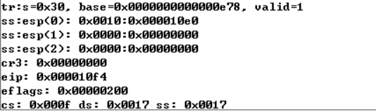

    点 Step[s] 执行任务切换，观察寄存器状态的变化：

    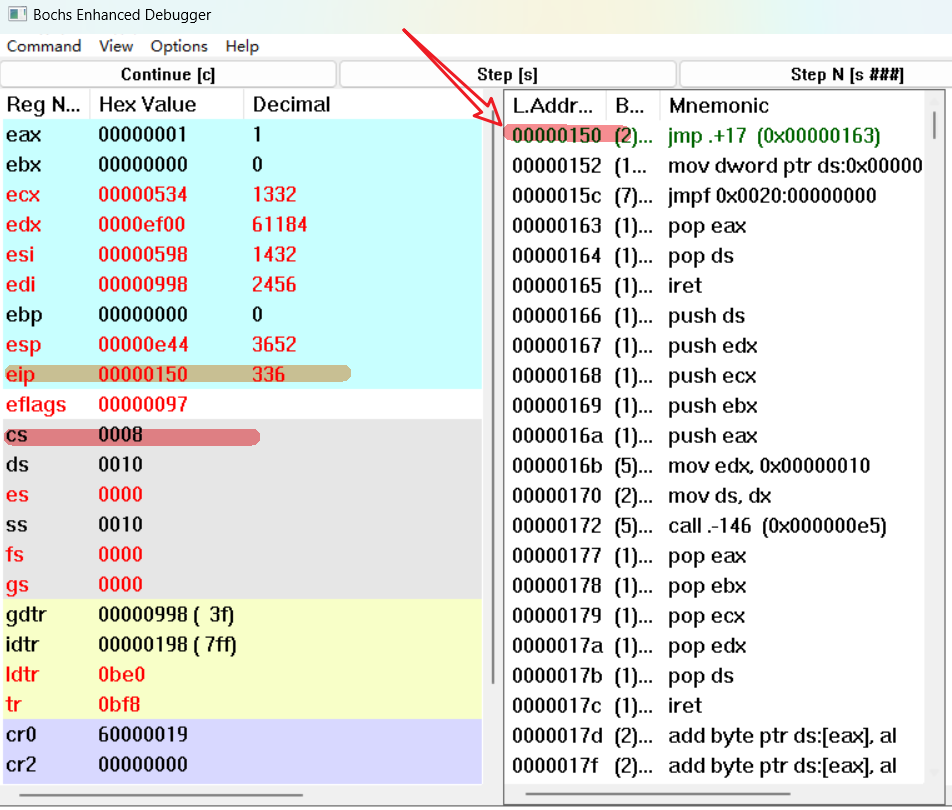

    第二次任务切换后，由于第一次任务切换时将寄存器现场保存到了 `TSS0` 里，因此将 `TSS0` 切换回来后，`CS:EIP` 会指向第一次任务切换的下一条地址，也就是 `0x08:0x0150`。为了证明这一点我们输入命令“`info tss`”看一下 `TSS`：

    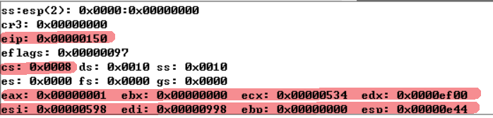

    可以发现，此时的寄存器值和 `TSS` 的字段是一致的，`TSS0` 的大部分字段初值都是 0，但在这里不是，因为它们保存了第一次任务切换时的现场。

    们再点几下 Step[s]，执行到了 `iret` 指令，自然的中断返回，此时点 View-Stack 顺便看一下栈顶内容：

    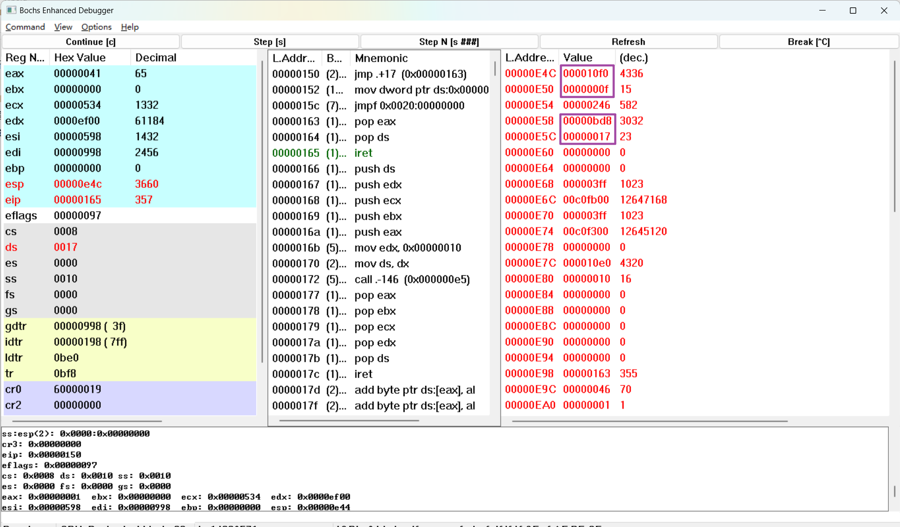

    此时内核栈栈顶恰好就是任务 0 发生中断时的返回地址和用户栈栈顶（当然我们这里之前没看，其实最好在第一次时钟中断发生时顺便看一下栈），点 Step[s] 执行 `iret` 后，我们发现果然返回了任务 0 用户程序原来发生中断的地方。在任务 0 用户程序看来，好像什么都没发生过一样，但其实从发生中断到中断返回这段时间内，已然发生过两次内核实现的任务切换。

    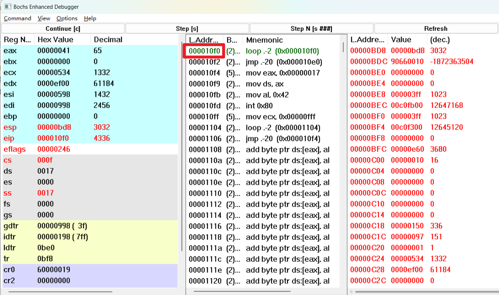

5.  请详细总结任务切换的过程。

    任务切换过程流程如下图：

    1.   从内核程序进入用户模式，执行任务 0
    2.   任务 0 执行打印程序，`10ms` 后来了个中断，`嘣~` ，进入时钟中断处理程序
    3.   `TSS0` 时钟中断执行到某处，执行任务切换，进入任务 1
    4.   任务 1 执行打印任务，`10ms` 后，`蹦~` 被时钟中断打断，进入中断执行程序
    5.   `TSS1` 时钟中断执行到某处，进行任务切换，切换到任务 0，但此时任务 0 被中断打断了，根据 TSS0 恢复到 TSS0 切换至 TSS1 之前的中断场景继续执行 `TSS0` 中断
    6.   `TSS0` 完成中断后 `iret` 回到任务 1
    7.   任务1继续其任务`10ms` `蹦~` 又被中断打断了，进入 `TSS0` 中断执行程序
    8.   `TSS0` 执行至任务切换处，通过 `TSS1` 恢复至 `TSS1` 切换至 `TSS0` 时的场景
    9.   `TSS1` 继续执行中断程序，直到 `iret` 返回任务 1 
    10.   继续执行任务 1。回到第 4 条反复循环。

    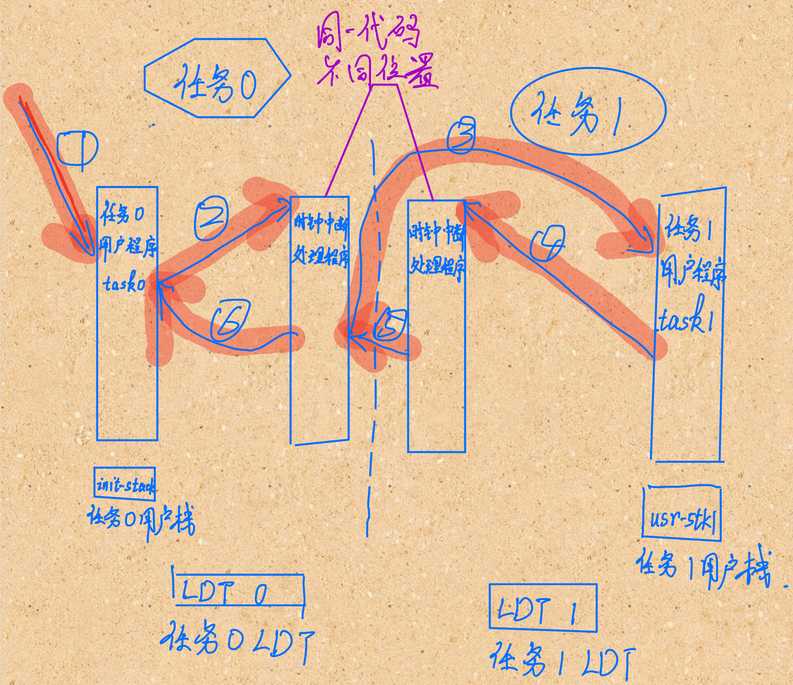

