# 3. 操作系统的引导

由于室友都用的老师的实验环境，为了方便交流，于是乎，我也改用了老师的实验环境。

## 3.1. 实验目的

-   熟悉实验环境；
-   建立对操作系统引导过程的深入认识；
-   掌握操作系统的基本开发过程；
-   能对操作系统代码进行简单的控制，揭开操作系统的神秘面纱。

## 3.2. 实验内容

1.  阅读《Linux内核完全注释》的第 `6` 章，对计算机和 `Linux 0.11` 的引导过程进行初步的了解；
2.  按照下面的要求改写 `Linux 0.11` 的引导程序 `bootsect.s` ;
3.  有兴趣同学可以做做进入保护模式前的设置程序 `setup.s` 。

### 3.2.1. 改写 `bootsect.s` 主要完成如下功能：

1.  `bootsect.s` 能在屏幕上打印一段提示信息

```
XXX is booting...
```

其中 `XXX` 是你给自己的操作系统起的名字，也可以显示一个特色 `logo` ，以表示自己操作系统的与众不同。

### 3.2.2. 改写 `setup.s` 主要完成如下功能：

1.  `bootsect.s` 能完成 `setup.s` 的载入，并跳转到 `setup.s` 开始地址执行。而 `setup.s` 向屏幕输出一行

```
Now we are in SETUP
```

1.  `setup.s` 能获取至少一个基本的硬件参数（如内存参数、显卡参数、硬盘参数等）， 将其存放在内存的特定地址，并输出到屏幕上。
2.  `setup.s` 不再加载Linux内核，保持上述信息显示在屏幕上即可。

## 3.3. 实验报告

在实验报告中回答如下问题：

1.  有时，继承传统意味着别手蹩脚。 `x86` 计算机为了向下兼容，导致启动过程比较复杂。 请找出 `x86` 计算机启动过程中，被硬件强制，软件必须遵守的两个“多此一举”的步骤（多找几个也无妨），说说它们为什么多此一举，并设计更简洁的替代方案。

## 3.4. 实验提示

操作系统的 `boot` 代码有很多，并且大部分是相似的。 本实验仿照 `Linux-0.11/boot` 目录下的 `bootsect.s` 和 `setup.s` ，以剪裁它们为主线。当然，如果能完全从头编写，并实现实验所要求的功能，是再好不过了。

同济大学赵炯博士的《Linux内核0.11完全注释（V5.0）》（以后简称《注释》）的第 `6` 章是非常有帮助的参考，实验中可能遇到的各种问题，几乎都能找到答案。

需要注意的是， `oslab` 中的汇编代码使用 `as86` 编译，语法和汇编课上所授稍有不同。

下面将给出一些更具体的 **提示**。这些提示并不是实验的一步一步的指导，而是罗列了一些实验中可能遇到的困难，并给予相关提示。它们肯定不会涵盖所有问题，也不保证其中的每个字都对完成实验有帮助。 所以，它们更适合在你遇到问题时查阅，而不是当作指南一样地亦步亦趋。本书所有实验的提示都是秉承这个思想编写的。

### 3.4.1. Linux 0.11相关代码详解

`boot/bootsect.s` 、 `boot/setup.s` 和 `tools/build.c` 是本实验会涉及到的源文件。 它们的功能详见《注释》的 `6.2` 、 `6.3` 节和 `16` 章。

### 3.4.2. 引导程序的运行环境

引导程序由 `BIOS` 加载并运行。 它活动时，操作系统还不存在，整台计算机的所有资源都由它掌控，而能利用的功能只有 `BIOS` 中断调用。

### 3.4.3. 完成 bootsect.s 的屏幕输出功能

首先来看完成屏幕显示的关键代码如下：

```asm
! 首先读入光标位置
    mov    ah,#0x03
    xor    bh,bh
    int    0x10

    ! 显示字符串“XXXos is running...”
    mov    cx,#25            ! 要显示的字符串长度
    mov    bx,#0x0007        ! page 0, attribute 7 (normal)
    mov    bp,#msg1
    mov    ax,#0x1301        ! write string, move cursor
    int    0x10

inf_loop:
    jmp    inf_loop        ! 后面都不是正经代码了，得往回跳呀
    ! msg1处放置字符串

msg1:
    .byte 13,10            ! 换行+回车
    .ascii "XXX os is running..."
    .byte 13,10,13,10            ! 两对换行+回车
    !设置引导扇区标记0xAA55
    .org 510
boot_flag:
    .word 0xAA55            ! 必须有它，才能引导
```

接下来，将完成屏幕显示的代码在开发环境中编译，并使用 `linux-0.11/tools/build.c` 将编译后的目标文件做成 `Image` 文件。

### 3.4.4. 编译和运行

Ubuntu上先从终端进入 `~/oslab/linux-0.11/boot/` 目录。 执行下面两个命令编译和链接 `bootsect.s` ：

```
as86 -0 -a -o bootsect.o bootsect.s
ld86 -0 -s -o bootsect bootsect.o
```

其中：

-   -0

    （注意：这是数字 `0` ，不是字母 `O` ）表示生成 `8086` 的16位目标程序

-   -a

    表示生成与 `GNU as` 和 `ld` 部分兼容的代码

-   -s

    告诉链接器 `ld86` 去除最后生成的可执行文件中的符号信息

如果这两个命令没有任何输出，说明编译与链接都通过了。 Ubuntu下用 `ls -l` 可列出下面的信息：


其中:

`bootsect.o` 是中间文件。 `bootsect` 是编译、链接后的目标文件。

需要留意的文件是 `bootsect` 的文件大小是 `544` 字节，而引导程序必须要正好占用一个磁盘扇区，即 `512` 个字节。 造成多了 `32` 个字节的原因是 `ld86` 产生的是 `Minix` 可执行文件格式， 这样的可执行文件处理文本段、数据段等部分以外，还包括一个 `Minix` 可执行文件头部，它的结构如下：

```c
struct exec {
    unsigned char a_magic[2];  //执行文件数
    unsigned char a_flags;
    unsigned char a_cpu;       //CPU标识号
    unsigned char a_hdrlen;    //头部长度，32字节或48字节
    unsigned char a_unused;
    unsigned short a_version;
    long a_text; long a_data; long a_bss; //代码段长度、数据段长度、堆长度
    long a_entry;    //执行入口地址
    long a_total;    //分配的内存总量
    long a_syms;     //符号表大小
};
```

算一算： `6 char(6字节)+1 short(2字节)+6 long(24字节)=32` ， 正好是 `32` 个字节，去掉这 `32` 个字节后就可以放入引导扇区了（这是 `tools/build.c` 的用途之一）。

对于上面的 `Minix` 可执行文件， 其 `a_magic[0]=0x01` ， `a_magic[1]=0x03` ， `a_flags=0x10` （可执行文件）， `a_cpu=0x04` （表示 `Intel i8086/8088` ，如果是 `0x17` 则表示 `Sun` 公司的 `SPARC` ），所以 `bootsect` 文件的头几个字节应该是 `01 03 10 04` 。

为了验证一下， `Ubuntu` 下用命令

```
hexdump -C bootsect
```

可以看到：

```
00000000  01 03 10 04 20 00 00 00  00 02 00 00 00 00 00 00  |.... ...........|
00000010  00 00 00 00 00 00 00 00  00 82 00 00 00 00 00 00  |................|
00000020  b8 c0 07 8e d8 b8 00 90  8e c0 b9 00 01 29 f6 29  |.............).)|
00000030  ff f3 a5 ea 18 00 00 90  8c c8 8e d8 8e c0 8e d0  |................|
00000040  bc 00 ff ba 00 00 b9 02  00 bb 00 02 b8 04 02 cd  |................|
00000050  13 73 0a ba 00 00 b8 00  00 cd 13 eb e6 b2 00 b8  |.s..............|
00000060  00 08 cd 13 b5 00 2e 89  0e 3d 01 b8 00 90 8e c0  |.........=......|
00000070  b4 03 30 ff cd 10 b9 18  00 bb 07 00 bd 3f 01 b8  |..0..........?..|
00000080  01 13 cd 10 b8 00 10 8e  c0 e8 32 00 e8 c5 00 2e  |..........2.....|
00000090  a1 fc 01 3d 00 00 75 17  2e 8b 1e 3d 01 b8 08 02  |...=..u....=....|
000000a0  83 fb 0f 74 0a b8 1c 02  83 fb 12 74 02 eb fe 2e  |...t.......t....|
000000b0  a3 fc 01 ea 00 00 20 90  05 00 00 00 00 00 8c c0  |...... .........|
000000c0  a9 ff 0f 75 fe 31 db 8c  c0 3d 00 40 72 01 c3 2e  |...u.1...=.@r...|
000000d0  a1 3d 01 2b 06 98 00 89  c1 c1 e1 09 01 d9 73 09  |.=.+..........s.|
000000e0  74 07 31 c0 29 d8 c1 e8  09 e8 34 00 89 c1 03 06  |t.1.).....4.....|
000000f0  98 00 2e 3b 06 3d 01 75  12 b8 01 00 2b 06 9a 00  |...;.=.u....+...|
00000100  75 04 ff 06 9c 00 a3 9a  00 31 c0 a3 98 00 c1 e1  |u........1......|
00000110  09 01 cb 73 b2 8c c0 05  00 10 8e c0 31 db eb a7  |...s........1...|
00000120  50 53 51 52 8b 16 9c 00  8b 0e 98 00 41 88 d5 8b  |PSQR........A...|
00000130  16 9a 00 88 d6 b2 00 81  e2 00 01 b4 02 cd 13 72  |...............r|
00000140  05 5a 59 5b 58 c3 b8 00  00 ba 00 00 cd 13 5a 59  |.ZY[X.........ZY|
00000150  5b 58 eb cc 52 ba f2 03  b0 00 ee 5a c3 00 00 0d  |[X..R......Z....|
00000160  0a 4c 6f 61 64 69 6e 67  20 73 79 73 74 65 6d 20  |.Loading system |
00000170  2e 2e 2e 0d 0a 0d 0a 00  00 00 00 00 00 00 00 00  |................|
00000180  00 00 00 00 00 00 00 00  00 00 00 00 00 00 00 00  |................|
*
00000210  00 00 00 00 00 00 00 00  00 00 00 00 06 03 55 aa  |..............U.|
00000220
```

接下来干什么呢？是的， 要去掉这 `32` 个字节的文件头部（ `tools/build.c` 的功能之一就是这个） ！随手编个小的文件读写程序都可以去掉它。不过，懒且聪明的人会在Ubuntu下用命令：

```
dd bs=1 if=bootsect of=Image skip=32
```

生成的 `Image` 就是去掉文件头的 `bootsect` 。

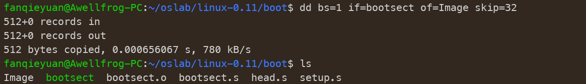

去掉这32个字节后，将生成的文件拷贝到 `linux-0.11` 目录下，并一定要命名为 **Image** （注意大小写）。 然后就 `run` 吧！

```
cp Image ../
cd ..
```

 

```
cd ~/oslab
./run
```

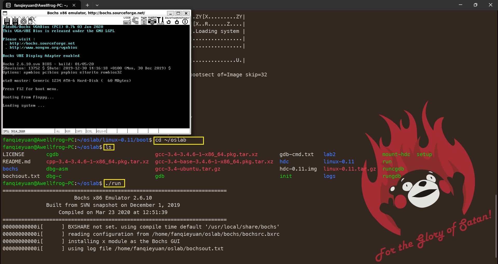

<font color=red size=4>没错，到这里我就不会做了，于是乎转战去看 《Linux内核完全注解》 关于`bootsect.s` 和 `setup.s` 部分。</font>

看完了，我觉得我又行了，继续实验！

### 3.4.5. bootsect.s 读入 setup.s

首先介绍一下这两个文件的作用：

`bootsect.s` 代码是磁盘引导块程序, 驻留在磁盘的第一个扇区中 (引导扇区, 0 磁道 (柱面), 0 磁头, 第 1 个扇区)。在 PC 机加电 ROM BIOS 自检后, ROM BIOS 会把引导扇区代码 bootsect 加载到内存地址 0x7C00 开始处并执行之。在 bootsect 代码执行期间, 它会将自己移动到内存绝对地址 0x90000 开始处并 继续执行。该程序的主要作用是首先把从磁盘第 2 个扇区开始的 4 个扇区的 setup 模块（由 setup.s 编译 而成) 加载到内存紧接着 bootsect 后面位置处 (0x90200), 然后利用 BIOS 中断 0x13 取磁盘参数表中当 前启动引导盘的参数, 接着在屏幕上显示 “Loading system...”字符串。再者把磁盘上 setup 模块后面的 system 模块加载到内存 $0 \times 10000$ 开始的地方。随后确定根文件系统的设备号, 若没有指定, 则根据所保 存的引导盘的每磁道扇区数判别出盘的类型和种类 (是 1.44M A 盘吗? ) 并保存其设备号于 root_dev(引 导块的 508 地址处), 最后长跳转到 setup 程序的开始处 ( $0 x 90200$ ) 执行 setup 程序。在磁盘上, 引导块、 setup 模块和 system 模块的扇区位置和大小示意图如下：

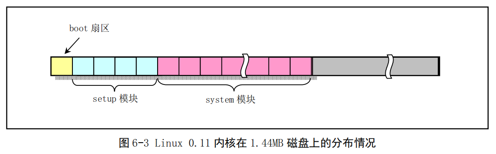

图中示出了 Linux 0.11 内核在 1.44MB 磁盘上所占扇区的分布情况。 $1.44 \mathrm{MB}$ 磁盘共有 2880 个扇区, 其中引导程序代码占用第 1 个扇区, setup 模块占用随后的 4 个扇区, 而 0.11 内核 system 模块大约占随 后的 240 个扇区。还剩下 2630 多个扇区末被使用。这些剩余的末用空间可被利用来存放一个基本的根文 件系统, 从而可以创建出使用单张磁盘就能让系统运转起来的集成盘来。

`setup.s` 是一个操作系统加载程序, 它的主要作用是利用 ROM BIOS 中断读取机器系统数据，并将这些数据保存到 0x90000 开始的位置 (覆盖掉了 bootsect 程序所在的地方)，所取得的参数和保留的内存位置见下表所示。这些参数将被内核中相关程序使用，例如字符设备驱动程序集中的 `console.c` 和 `tty_io.c` 程序等。

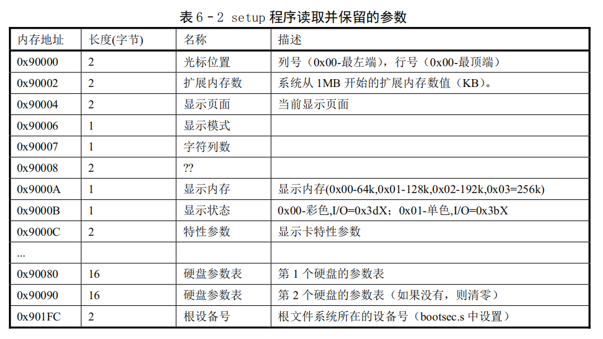

然后 setup 程序将 system 模块从 0x10000 - 0x8ffff (当时认为内核系统模块 system 的长度不会超过此值: 512KB) 整块向下移动到内存绝对地址 0 x 00000 处。接下来加载中断描述符表寄存器(idtr)和全局描述符表寄存器(gdtr)，开启 A20 地址线，重新设置两个中断控制芯片 8259A ，将硬件中断号重新设置为 0x20 - 0x2f。最后设置 CPU 的控制寄存器 CR0 (也称机器状态字)，从而进入 32 位保护模式运行，并跳转到位于 system 模块最前面部分的 head.s 程序继续运行。
为了能让 head.s 在 32 位保护模式下运行，在本程序中临时设置了中断描述符表 (IDT) 和全局描述 符表 (GDT), 并在 GDT 中设置了当前内核代码段的描述符和数据段的描述符。


首先编写一个 `setup.s` ，该 `setup.s` 可以就直接拷贝前面的 `bootsect.s` （可能还需要简单的调整）， 然后将其中的显示的信息改为：

```
Now we are in SETUP
```

接下来需要编写 `bootsect.s` 中载入 `setup.s` 的关键代码。原版 `bootsect.s` 中下面的代码就是做这个的。

```asm
load_setup:
    mov    dx,#0x0000               !设置驱动器和磁头(drive 0, head 0): 软盘0磁头
    mov    cx,#0x0002               !设置扇区号和磁道(sector 2, track 0):0磁头、0磁道、2扇区
    mov    bx,#0x0200               !设置读入的内存地址：BOOTSEG+address = 512，偏移512字节
    mov    ax,#0x0200+SETUPLEN      !设置读入的扇区个数(service 2, nr of sectors)，
                                    !SETUPLEN是读入的扇区个数，Linux 0.11设置的是4，
                                    !我们不需要那么多，我们设置为2
    int    0x13                     !应用0x13号BIOS中断读入2个setup.s扇区
    jnc    ok_load_setup            !读入成功，跳转到ok_load_setup: ok - continue
    mov    dx,#0x0000               !软驱、软盘有问题才会执行到这里。我们的镜像文件比它们可靠多了
    mov    ax,#0x0000               !否则复位软驱 reset the diskette
    int    0x13
    jmp    load_setup               !重新循环，再次尝试读取
ok_load_setup:
                                    !接下来要干什么？当然是跳到setup执行。
```

所有需要的功能在原版 `bootsect.s` 中都是存在的，我们要做的仅仅是删除那些对我们无用的代码。


为了方便测试，Makefile 不熟练还是写个 shell 脚本吧：

`mylab1_run.sh`

```bash
cd ~/oslab/linux-0.11/boot/
as86 -0 -a -o bootsect.o bootsect.s
as86 -0 -a -o setup.o setup.s 
ld86 -0 -s -o bootsect bootsect.o
ld86 -0 -s -o setup setup.o
dd bs=1 if=bootsect of=Image skip=32
dd bs=1 if=setup of=Image skip=32 seek=512
cp Image ../
cd ~/oslab
./run
```

>   注意：
>
>   `bootsect` 和 `setup` 都需要用 `skip=32` 跳过对应的 Minix 头部。`setup` 复制进 Image 时要使用 `seek=512` 跳过前面 512 字节的 `bootsect` 的内容。

`mylab1_clean.sh`

```bash
cd ~/oslab/linux-0.11/
make clean
cd ~/oslab/linux-0.11/boot/
rm Image
```

输入如下命令执行：

```
# 执行
bash ./mylab1_run.sh

# 清除
bash ./mylab1_clean.sh
```

#### 调色整活

>   为了整活，发现下面这句话与屏幕打印字体的颜色有关，于是乎，我测试了很多颜色，，，
>
>   mov $\quad \mathrm{bx}, \# 0 \times 0007 \quad$ ! page 0 , attribute 7 (normal)
>
>   ```
>   bl 低四位：对应字体的颜色，共16种
>   bl 高四位：对应字体的背景色，也是16种，和字体颜色对应的数字是相同的
>   ```
>
>   | bx       | 颜色                                                         |
>   | -------- | ------------------------------------------------------------ |
>   | \#0x0000 |  |
>   | \#0x0001 |  |
>   | \#0x0002 |  |
>   | \#0x0003 |  |
>   | \#0x0004 |  |
>   | \#0x0005 |  |
>   | \#0x0006 |  |
>   | \#0x0007 |  |
>   | \#0x0008 |  |
>   | \#0x0009 |  |
>   | \#0x000a |  |
>   | \#0x000b |  |
>   | \#0x000c |  |
>   | \#0x000d |  |
>   | \#0x000e |  |
>   | \#0x000f |  |
>   | \#0x00fe | <br />bl=e 是黄色的字<br />bh=f 是灰色的底色<br />竟然还有闪烁特效☆*: .｡. o(≧▽≦)o .｡.:*☆ |

`bootsect.s` 此时只需要正常启动，做一些初始化，加载 `setup.s` 并跳转到 `setup.s` 执行即可，不需要其他载入 `system` 的部分。

```asm
.globl begtext, begdata, begbss, endtext, enddata, endbss
.text
begtext:
.data
begdata:
.bss
begbss:
.text

SETUPLEN = 4				! nr of setup-sectors
BOOTSEG  = 0x07c0			! original address of boot-sector
INITSEG  = 0x9000			! we move boot here - out of the way
SETUPSEG = 0x9020			! setup starts here

! ROOT_DEV:	0x000 - same type of floppy as boot.
!		0x301 - first partition on first drive etc
ROOT_DEV = 0x306

entry _start
_start:
	mov	ax,#BOOTSEG
	mov	ds,ax
	mov	ax,#INITSEG
	mov	es,ax
	mov	cx,#256
	sub	si,si
	sub	di,di
	rep
	movw
	jmpi	go,INITSEG
go:	mov	ax,cs
	mov	ds,ax
	mov	es,ax

! load the setup-sectors directly after the bootblock.
! Note that 'es' is already set up.

load_setup:
	mov	dx,#0x0000		! drive 0, head 0
	mov	cx,#0x0002		! sector 2, track 0
	mov	bx,#0x0200		! address = 512, in INITSEG
	mov	ax,#0x0200+SETUPLEN	! service 2, nr of sectors
	int	0x13			! read it
	jnc	ok_load_setup		! ok - continue
	mov	dx,#0x0000
	mov	ax,#0x0000		! reset the diskette
	int	0x13
	j	load_setup

ok_load_setup:
! Print some inane message

	mov	ah,#0x03		! read cursor pos
	xor	bh,bh
	int	0x10
	
	mov	cx,#24
	mov	bx,#0x00fe		! page 0, attribute 7 (normal)
	mov	bp,#msg1
	mov	ax,#0x1301		! write string, move cursor
	int	0x10

! jump to setup.s
	jmpi	0,SETUPSEG

sectors:
	.word 0

msg1:
	.byte 13,10
	.ascii "Loading system ..."
	.byte 13,10,13,10

.org 508
root_dev:
	.word ROOT_DEV
boot_flag:
	.word 0xAA55

.text
endtext:
.data
enddata:
.bss
endbss:
```

`setup.s` 只需要打印一些提示即可，不需要做 `system` 移动到 0x00 ，也不需要在原来 `bootsect` 的位置记录 ROM BIOS 读取的机器系统数据，因为暂时不会被覆盖掉。

```asm
!
!	setup.s		(C) 1991 Linus Torvalds
!
! setup.s is responsible for getting the system data from the BIOS,
! and putting them into the appropriate places in system memory.
! both setup.s and system has been loaded by the bootblock.
!
! This code asks the bios for memory/disk/other parameters, and
! puts them in a "safe" place: 0x90000-0x901FF, ie where the
! boot-block used to be. It is then up to the protected mode
! system to read them from there before the area is overwritten
! for buffer-blocks.
!

! NOTE! These had better be the same as in bootsect.s!

INITSEG  = 0x9000	! we move boot here - out of the way
SETUPSEG = 0x9020	! this is the current segment

.globl begtext, begdata, begbss, endtext, enddata, endbss
.text
begtext:
.data
begdata:
.bss
begbss:
.text

entry start
start:

init_ds_es:
	mov ax,cs
	mov ds,ax
	mov es,ax 

! Print some inane message
print_message:
	mov	ah,#0x03		! read cursor pos
	xor	bh,bh
	int	0x10
	
	mov	cx,#28
	mov	bx,#0x00bc		! page 0, attribute 7 (normal)
	mov	bp,#msg2
	mov	ax,#0x1301		! write string, move cursor
	int	0x10

! Print logo
print_logo:
	mov	ah,#0x03		! read cursor pos
	xor	bh,bh
	int	0x10
	
	mov	cx,#148
	mov	bx,#0x0006		! page 0, attribute 7 (normal)
	mov	bp,#logo
	mov	ax,#0x1301		! write string, move cursor
	int	0x10

! ok, the read went well so we get current cursor position and save it for
! posterity.

	mov	ax,#INITSEG	! this is done in bootsect already, but...
	mov	ds,ax
	mov	ah,#0x03	! read cursor pos
	xor	bh,bh
	int	0x10		! save it in known place, con_init fetches
	mov	[0],dx		! it from 0x90000.
! Get memory size (extended mem, kB)

	mov	ah,#0x88
	int	0x15
	mov	[2],ax

! Get hd0 data

	mov	ax,#0x0000
	mov	ds,ax
	lds	si,[4*0x41]
	mov	ax,#INITSEG
	mov	es,ax
	mov	di,#0x0080
	mov	cx,#0x10
	rep
	movsb


msg2:
	.byte 13,10
	.ascii "Now we are in SETUP..."
	.byte 13,10,13,10
	
logo:
	! '/'->47	'space'->32		'_'->95		'\'->92		'|'->124
	; .ascii "  ______ ______     __"
	; .ascii " |  ____/ __ \ \   / /"
	; .ascii " | |__ | |  | \ \_/ / "
	; .ascii " |  __|| |  | |\   /  "
	; .ascii " | |   | |__| | | |   "
	; .ascii " |_|    \___\_\ |_|   "
	.byte 13,10
	.byte 32, 32, 95, 95, 95, 95, 95, 95, 32, 95, 95, 95, 95, 95, 95, 32, 32, 32, 32, 32, 95, 95
	.byte 13,10
	.byte 32, 124, 32, 32, 95, 95, 95, 95, 47, 32, 95, 95, 32, 92, 32, 92, 32, 32, 32, 47, 32, 47
	.byte 13,10
	.byte 32, 124, 32, 124, 95, 95, 32, 124, 32, 124, 32, 32, 124, 32, 92, 32, 92, 95, 47, 32, 47, 32
	.byte 13,10
	.byte 32, 124, 32, 32, 95, 95, 124, 124, 32, 124, 32, 32, 124, 32, 124, 92, 32, 32, 32, 47, 32, 32
	.byte 13,10
	.byte 32, 124, 32, 124, 32, 32, 32, 124, 32, 124, 95, 95, 124, 32, 124, 32, 124, 32, 124, 32, 32,32
	.byte 13,10
	.byte 32, 124, 95, 124, 32, 32, 32, 32, 92, 95, 95, 95, 92, 95, 92, 32, 124, 95, 124, 32, 32, 32
	.byte 13,10,13,10

here:
	j	here

.text
endtext:
.data
enddata:
.bss
endbss:
```

使用自己写的 shell 脚本运行结果如下：

 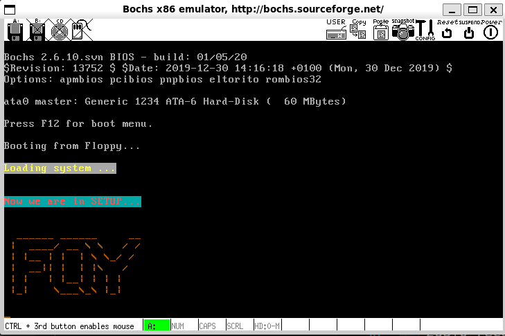

>   写个简单的python脚本把 logo 的字符转换成对应的 ascii 码：
>
>   `logo_ascii2byte.py`
>
>   ```python
>   logo = "  ______ ______     __\n" \
>        + " |  ____/ __ \ \   / /\n" \
>        + " | |__ | |  | \ \_/ / \n" \
>        + " |  __|| |  | |\   /  \n" \
>        + " | |   | |__| | | |   \n" \
>        + " |_|    \___\_\ |_|   \n"
>   logo_ascii = []
>   
>   for str in logo:
>       if str == '\n':
>           print(logo_ascii)
>           logo_ascii.clear()
>       elif str == ' ':
>           logo_ascii.append(32)
>       elif str == '_':
>           logo_ascii.append(95)
>       elif str == '/':
>           logo_ascii.append(47)
>       elif str == '\\':
>           logo_ascii.append(92)
>       elif str == '|':
>           logo_ascii.append(124)
>   ```
>
>   将每行对应的 ascii 填入要打印的位置即可。

### 3.4.6. 再次编译

现在有两个文件都要编译、链接。一个个手工编译，效率低下，所以借助 `Makefile` 是最佳方式。

但是如果使用实验包中带的 `~/oslab/linux-0.11/Makefile` ，会发现有个报错：

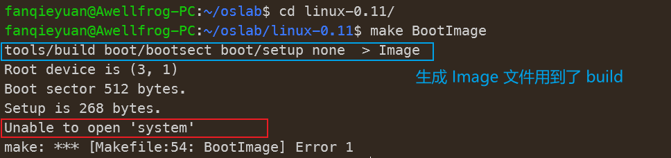

### 3.4.7 修改 `build.c`

查看 `~/oslab/linux-0.11/tools/build.c` 的内容，发现该代码就是实现了上面写的 shell 脚本，通过 build 检查每个文件的设置是否合理，跳过开始的 32 bytes 的 Minix 头部，依次读入 `bootsect` 、`setup`、`system` ，生成 `Image` 文件。根据 Makefile 的指令内容：

```makefile
BootImage: boot/bootsect boot/setup tools/build
	tools/build boot/bootsect boot/setup none $(ROOT_DEV) > Image
	sync
```

此时没有写入 `system` 部分（用 none 代替），所以会出现如图报错，可以小小修改一下 `build.c`，避免这个报错。

补丁如下，如果没有 system 文件，则跳过并提示：

```c
	/* my modification */
	if ((id=open(argv[3],O_RDONLY,0))<0) {
		// 记数归零，用于记录 system 读入的 byte 数
        i = 0;
        // 提示跳过，不向 system 写入
		fprintf(stderr,"☆*: .｡. o(≧▽≦)o .｡.:*☆skip System kernel.\n");
	} else {
		for (i=0 ; (c=read(id,buf,sizeof buf))>0 ; i+=c )
			if (write(1,buf,c)!=c)
				die("Write call failed");
	}
//	if (read(id,buf,GCC_HEADER) != GCC_HEADER)
//		die("Unable to read header of 'system'");
//	if (((long *) buf)[5] != 0)
//		die("Non-GCC header of 'system'");

	close(id);
	fprintf(stderr,"System is %d bytes.\n",i);
	if (i > SYS_SIZE*16)
		die("System is too big");
	return(0);
```

提示情况如下：

 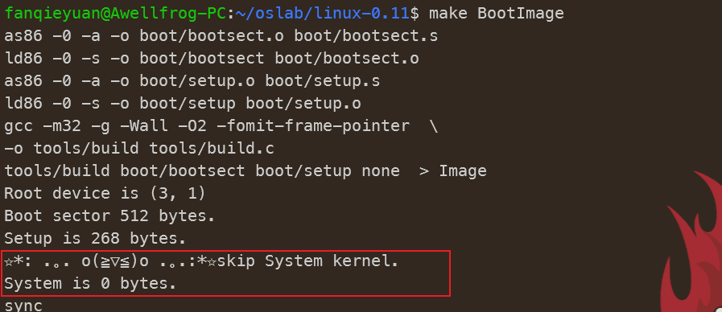

### 3.4.8. `setup.s` 获取基本硬件参数

`setup.s` 将获得硬件参数放在内存的 `0x90000` 处。原版 `setup.s` 中已经完成了光标位置、内存大小、显存大小、显卡参数、第一和第二硬盘参数的保存。

用 `ah=#0x03` 调用 `0x10` 中断可以读出光标的位置，用 `ah=#0x88` 调用 `0x15` 中断可以读出内存的大小。 有些硬件参数的获取要稍微复杂一些，如磁盘参数表。在 `PC` 机中 `BIOS` 设定的中断向量表中 `int 0x41` 的中断向量位置( `4*0x41 = 0x0000:0x0104` )存放的并不是中断程序的地址，而是第一个硬盘的基本参数表。 第二个硬盘的基本参数表入口地址存于 `int 0x46` 中断向量位置处。每个硬盘参数表有 `16` 个字节大小。下表给出了硬盘基本参数表的内容：

表1 磁盘基本参数表

| 位移 | 大小 | 说明         |
| ---- | ---- | ------------ |
| 0x00 | 字   | 柱面数       |
| 0x02 | 字节 | 磁头数       |
| …    | …    | …            |
| 0x0E | 字节 | 每磁道扇区数 |
| 0x0F | 字节 | 保留         |

所以获得磁盘参数的方法就是复制数据。

下面是将硬件参数取出来放在内存 `0x90000` 的关键代码。

```asm
mov    ax,#INITSEG
mov    ds,ax        !设置ds=0x9000
mov    ah,#0x03     !读入光标位置
xor    bh,bh
int    0x10         !调用0x10中断
mov    [0],dx       !将光标位置写入0x90000.

!读入内存大小位置
mov    ah,#0x88
int    0x15
mov    [2],ax

!从0x41处拷贝16个字节（磁盘参数表）
mov    ax,#0x0000
mov    ds,ax
lds    si,[4*0x41]
mov    ax,#INITSEG
mov    es,ax
mov    di,#0x0004
mov    cx,#0x10
rep            !重复16次
movsb
```

现在已经将硬件参数（只包括光标位置、内存大小和硬盘参数，其他硬件参数取出的方法基本相同，此处略去） 取出来放在了 `0x90000` 处，接下来的工作是将这些参数显示在屏幕上。 这些参数都是一些无符号整数，所以需要做的主要工作是用汇编程序在屏幕上将这些整数显示出来。

以十六进制方式显示比较简单。这是因为十六进制与二进制有很好的对应关系（每 `4` 位二进制数和 `1` 位十六进制数存在一一对应关系），显示时只需将原二进制数每 `4` 位划成一组，按组求对应的 `ASCII` 码送显示器即可。 `ASCII` 码与十六进制数字的对应关系为： `0x30~0x39` 对应数字 `0~9` ， `0x41~0x46` 对应数字 `a~f` 。 从数字 `9` 到 `a` ，其 `ASCII` 码间隔了 `7h` ，这一点在转换时要特别注意。 为使一个十六进制数能按高位到低位依次显示，实际编程中，需对 `bx` 中的数每次循环左移一组（ `4` 位二进制）， 然后屏蔽掉当前高 `12` 位，对当前余下的 `4` 位（即 `1` 位十六进制数）求其 `ASCII` 码， 要判断它是 `0~9` 还是 `a~f` ，是前者则加 `0x30` 得对应的 `ASCII` 码，后者则要加 `0x37` 才行，最后送显示器输出。 以上步骤重复 `4` 次，就可以完成 `bx` 中数以 `4` 位十六进制的形式显示出来。

下面是完成显示 `16` 进制数的汇编语言程序的关键代码， 其中用到的 `BIOS` 中断为 `INT 0x10` ，功能号 `0x0E` （显示一个字符）， 即 `AH=0x0E` ， `AL=要显示字符的ASCII码` 。

```asm
!以16进制方式打印栈顶的16位数
print_hex:
    mov    cx,#4         ! 4个十六进制数字
    mov    dx,(bp)       ! 将(bp)所指的值放入dx中，如果bp是指向栈顶的话
print_digit:
    rol    dx,#4         ! 循环以使低4比特用上 !! 取dx的高4比特移到低4比特处。
    mov    ax,#0xe0f     ! ah = 请求的功能值，al = 半字节(4个比特)掩码。
    and    al,dl         ! 取dl的低4比特值。
    add    al,#0x30      ! 给al数字加上十六进制0x30
    cmp    al,#0x3a
    jl     outp          ! 是一个不大于十的数字
    add    al,#0x07      ! 是a～f，要多加7
outp:
    int    0x10
    loop   print_digit
    ret
```

>   ROL（循环左移）指令把所有位都向左移。最高位复制到进位标志位和最低位。该指令格式与 SHL 指令相同：
>
>    

这里用到了一个 `loop` 指令，每次执行 `loop` 指令， `cx` 减 `1` ，然后判断 `cx` 是否等于 `0` 。 如果不为 `0` 则转移到 `loop` 指令后的标号处，实现循环；如果为 `0` 顺序执行。 另外还有一个非常相似的指令： `rep` 指令，每次执行 `rep` 指令， `cx` 减 `1` ，然后判断 `cx` 是否等于 `0` ， 如果不为 `0` 则继续执行 `rep` 指令后的串操作指令，直到 `cx` 为 `0` ，实现重复。

```asm
!打印回车换行
print_nl:
    mov    ax,#0xe0d   ! CR
    int    0x10
    mov    al,#0xa     ! LF
    int    0x10
    ret
```

只要在适当的位置调用 `print_hex` 和 `print_nl` （注意，一定要设置好栈，才能进行函数调用）就能将获得硬件参数打印到屏幕上，完成此次实验的任务。 但事情往往并不总是顺利的，前面的两个实验大多数实验者可能一次就编译调试通过了（这里要提醒大家：编写操作系统的代码一定要认真，因为要调试操作系统并不是一件很方便的事）。 但在这个实验中会出现运行结果不对的情况（为什么呢？因为我们给的代码并不是100%好用的）。 所以接下来要复习一下汇编，并阅读《Bochs使用手册》，学学在 `Bochs` 中如何调试操作系统代码。

#### <font color=blue size=4>首先学一手 Bochs 的调试：</font>

你是不是也向我一样，看到如下的提示：


然后输入命令：

```
cd ~/oslab/bochs
bochs -q -f bochsrc.bxrc
```

然后看着报错陷入沉思：

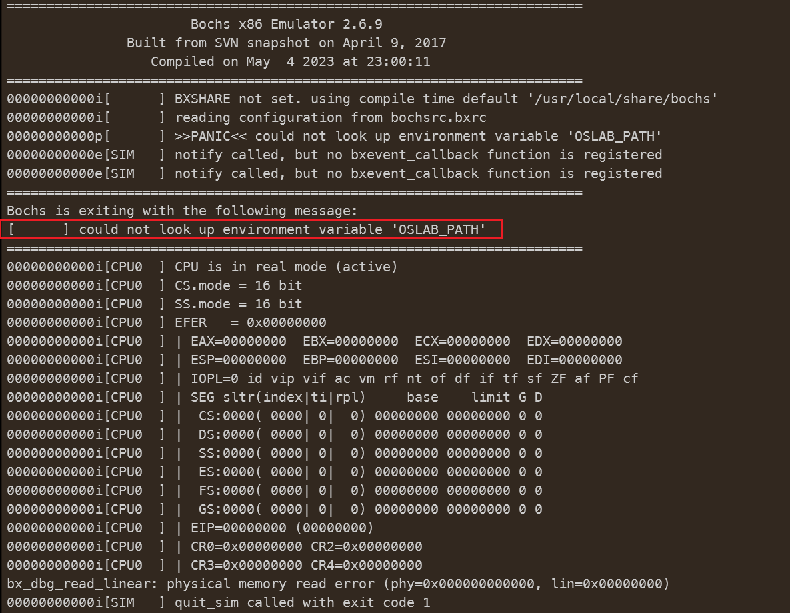

产生这个状态的主要原因是自己太菜了，对这个完全不了解导致的。这个时候应该沉着冷静，看到报错了，去 `bochsrc.bxrc` 中看看问题是啥。

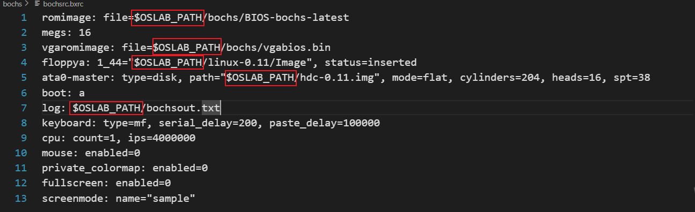

发现 `bochsrc.bxrc` 中多次用到了 `$OSLAB_PTAH` 这个路径变量，却没有定义的地方。那么解决方法有两个，自己手动把这里改成本机的路径，或者...，或者你发现了一个神奇的 `shell` 脚本：`~/oslab/dbg-asm` 你发现，执行该脚本就可以直接正常进入汇编的调试界面：

```bash
cd ~/oslab
./dbg-asm
```

那么看看这个 `dbg-asm` 里面都干了什么呢：

```bash
#!/bin/bash
# 给变量 $OSLAB_PATH 赋值，于是乎后面就可用辣！
export OSLAB_PATH=$(cd $(dirname "${BASH_SOURCE[0]}") >/dev/null && pwd)
# 然后调用命令进入调试界面
$OSLAB_PATH/bochs/bochs-dbg -q -f $OSLAB_PATH/bochs/bochsrc.bxrc
```

>```bash
># 给变量 $OSLAB_PATH 赋值，于是乎后面就可用辣！
>export OSLAB_PATH=$(cd $(dirname "${BASH_SOURCE[0]}") >/dev/null && pwd)
>```
>
>这句命令我是一脸懵逼，参考了两篇文章理解了，我又学到啦！[参考1](https://blog.csdn.net/davidhopper/article/details/78989369) [参考2](https://linuxhandbook.com/dev-null/)
>
>*   `${BASH_SOURCE[0]}`
>
>    表示bash脚本的第一个参数（如果第一个参数是bash，表明这是要执行bash脚本，这时`"${BASH_SOURCE[0]}"`自动转换为第二个参数）
>
>*   `$(dirname "${BASH_SOURCE[0]}")`
>
>    表示执行的文件所在的目录地址
>
>    把 shell 脚本改成这样执行看看就明白了：
>
>    ```bash
>    #!/bin/bash
>    export OSLAB_PATH=$(cd $(dirname "${BASH_SOURCE[0]}") >/dev/null && pwd)
>    echo ${BASH_SOURCE[0]}
>    echo $(dirname "${BASH_SOURCE[0]}")
>    ```
>
>     
>
>     
>
>     
>
>*   `command > /dev/null`
>
>    `/dev/null` 就像一个黑洞，用来将命令执行后的输出重定向到这个黑洞中，这样我们就可以避免多余的提示：
>
>    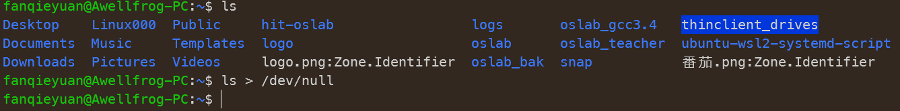
>
>    比如同时执行两个命令，两个命令都有输出，把1个输出蔽掉，只看另一个：
>
>    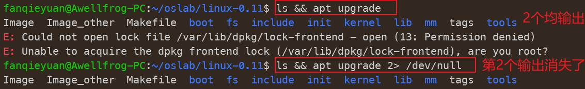

是不是豁然开朗了。

看完了 `~/oslab/dbg-asm` 汇编调试，当然也想试试 `~/oslab/dbg-c` C语言调试，这里的 debug 就是在 C 语言中了，不过 C 语言的调试得等到加载进来 `system` 部分后进入 `main()` 再尝试了。不过先学一下大概怎么用：

```bash
./dbg-c
```

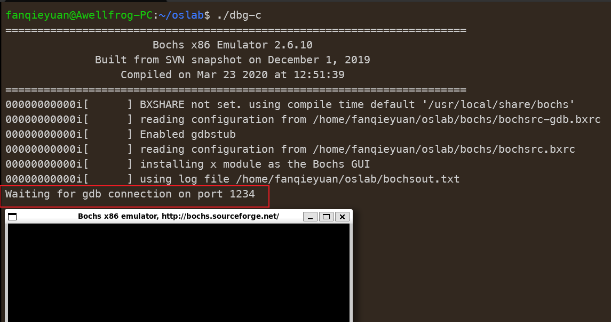

执行命令后，可以看到弹出来个黑框，并且提示等待连接，于是乎，再开一个命令行：

```bash
gdb
target remote localhost:1234
continue
```

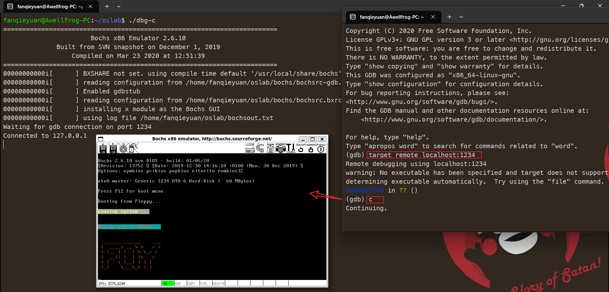

可以看到黑框正常开机执行了，后面应该是在右边的终端中进行 C 语言文件的调试。

<font color=blue size=4>继续实验</font>

可以参考一下这篇[博客](https://zhuanlan.zhihu.com/p/452389902)，写的非常详细：

`setup.s` 如下，`bootsect.s` 同上没有变动

```asm
INITSEG  = 0x9000	! we move boot here - out of the way
SETUPSEG = 0x9020	! this is the current segment

.globl begtext, begdata, begbss, endtext, enddata, endbss
.text
begtext:
.data
begdata:
.bss
begbss:
.text

entry start
start:

init_ds_es:
	mov ax,cs
	mov ds,ax
	mov es,ax 

! Print some inane message
print_message:
	mov	ah,#0x03		! read cursor pos
	xor	bh,bh
	int	0x10
	
	mov	cx,#28
	mov	bx,#0x00bc		! page 0, attribute 7 (normal)
	mov	bp,#msg2
	mov	ax,#0x1301		! write string, move cursor
	int	0x10

! Print logo
print_logo:
	mov	ah,#0x03		! read cursor pos
	xor	bh,bh
	int	0x10
	
	mov	cx,#148
	mov	bx,#0x0006		! page 0, attribute 7 (normal)
	mov	bp,#logo
	mov	ax,#0x1301		! write string, move cursor
	int	0x10

! ok, the read went well so we get current cursor position and save it for
! posterity.
! 获取光标位置 =>  0x9000:0
	mov	ax,#INITSEG	! this is done in bootsect already, but...
	mov	ds,ax
	mov	ah,#0x03	! read cursor pos
	xor	bh,bh
	int	0x10		! save it in known place, con_init fetches
	mov	[0],dx		! it from 0x90000.

! Get memory size (extended mem, kB)
! 获取拓展内存大小 => 0x9000:2
	mov	ah,#0x88
	int	0x15
	mov	[2],ax

! Get hd0 data
! 获取硬盘参数 => 0x9000:80  大小：16B
	mov	ax,#0x0000
	mov	ds,ax
	lds	si,[4*0x41]
	mov	ax,#INITSEG
	mov	es,ax
	mov	di,#0x0080
	mov	cx,#0x10
	rep
	movsb

! 前面修改了ds寄存器，这里将其设置为0x9000
	mov ax,#INITSEG
	mov ds,ax
	mov ax,cs
	mov	es,ax

!显示 Cursor POS: 字符串
	mov	ah,#0x03		! read cursor pos
	xor	bh,bh
	int	0x10
	mov	cx,#18
	mov	bx,#0x0007		! page 0, attribute c 
	mov	bp,#msg_cursor
	mov	ax,#0x1301		! write string, move cursor
	int	0x10
!调用 print_hex 显示具体信息
	mov ax,[0]
	call print_hex
	call print_nl

!显示 Memory SIZE: 字符串
	mov	ah,#0x03		! read cursor pos
	xor	bh,bh
	int	0x10
	mov	cx,#12
	mov	bx,#0x0007		! page 0, attribute c 
	mov	bp,#mem
	mov	ax,#0x1301		! write string, move cursor
	int	0x10
!显示 具体信息
	mov ax,[2]
	call print_hex

!显示相应 提示信息
	mov	ah,#0x03		! read cursor pos
	xor	bh,bh
	int	0x10
	mov	cx,#25
	mov	bx,#0x0007		! page 0, attribute c 
	mov	bp,#cyl
	mov	ax,#0x1301		! write string, move cursor
	int	0x10
!显示具体信息
	mov ax,[0x80]
	call print_hex
	call print_nl

！显示 提示信息
	mov	ah,#0x03		! read cursor pos
	xor	bh,bh
	int	0x10
	mov	cx,#8
	mov	bx,#0x0007		! page 0, attribute c 
	mov	bp,#head
	mov	ax,#0x1301		! write string, move cursor
	int	0x10
！显示 具体信息
	mov ax,[0x80+0x02]
	call print_hex
	call print_nl

！显示 提示信息
	mov	ah,#0x03		! read cursor pos
	xor	bh,bh
	int	0x10
	mov	cx,#8
	mov	bx,#0x0007		! page 0, attribute c 
	mov	bp,#sect
	mov	ax,#0x1301		! write string, move cursor
	int	0x10
！显示 具体信息
	mov ax,[0x80+0x0e]
	call print_hex
	call print_nl

!死循环
here:  
	jmp here

msg2:
	.byte 13,10
	.ascii "Now we are in SETUP..."
	.byte 13,10,13,10
	
logo:
	! '/'->47	'space'->32		'_'->95		'\'->92		'|'->124
	.byte 13,10
	; .ascii "  ______ ______     __"
	.byte 32, 32, 95, 95, 95, 95, 95, 95, 32, 95, 95, 95, 95, 95, 95, 32, 32, 32, 32, 32, 95, 95
	.byte 13,10
	; .ascii " |  ____/ __ \ \   / /"
	.byte 32, 124, 32, 32, 95, 95, 95, 95, 47, 32, 95, 95, 32, 92, 32, 92, 32, 32, 32, 47, 32, 47
	.byte 13,10
	; .ascii " | |__ | |  | \ \_/ / "
	.byte 32, 124, 32, 124, 95, 95, 32, 124, 32, 124, 32, 32, 124, 32, 92, 32, 92, 95, 47, 32, 47, 32
	.byte 13,10
	; .ascii " |  __|| |  | |\   /  "
	.byte 32, 124, 32, 32, 95, 95, 124, 124, 32, 124, 32, 32, 124, 32, 124, 92, 32, 32, 32, 47, 32, 32
	.byte 13,10
	; .ascii " | |   | |__| | | |   "
	.byte 32, 124, 32, 124, 32, 32, 32, 124, 32, 124, 95, 95, 124, 32, 124, 32, 124, 32, 124, 32, 32,32
	.byte 13,10
	; .ascii " |_|    \___\_\ |_|   "
	.byte 32, 124, 95, 124, 32, 32, 32, 32, 92, 95, 95, 95, 92, 95, 92, 32, 124, 95, 124, 32, 32, 32
	.byte 13,10,13,10

!以16进制方式打印ax寄存器里的16位数
print_hex:
	mov cx,#4   ! 4个十六进制数字
	mov dx,ax   ! 将ax所指的值放入dx中，ax作为参数传递寄存器

print_digit:
	rol dx,#4  ! 循环以使低4比特用上 !! 取dx的高4比特移到低4比特处。
	mov ax,#0xe0f  ! ah = 请求的功能值,al = 半字节(4个比特)掩码。
	and al,dl ! 取dl的低4比特值。
	add al,#0x30  ! 给al数字加上十六进制0x30
	cmp al,#0x3a
	jl outp  ! 是一个不大于10的数字
	add al,#0x07  ! 是a~f,要多加7
outp:
	int 0x10
	loop print_digit
	ret

msg_cursor:
    .byte 13,10
    .ascii "Cursor position:"
mem:
	.ascii "Memory SIZE:"
cyl:
	.ascii "KB"
	.byte 13,10,13,10
	.ascii "HD Info"
	.byte 13,10
	.ascii "Cylinders:"
head:
	.ascii "Headers:"
sect:
	.ascii "Secotrs:"

!打印回车换行
print_nl:
	mov ax,#0xe0d
	int 0x10
	mov al,#0xa
	int 0x10
	ret


.text
endtext:
.data
enddata:
.bss
endbss:
```

先来调试一下：

```shell
cd ~/oslab
./dbg-asm
b 0x7c00
c
# 进入 setup 部分
b 0x090200
c
# 查看段寄存器
sreg
```

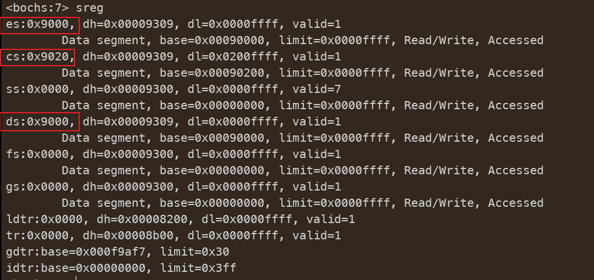

我们发现 `cs` 指向了 `setup` 段，但是 `es` 和 `ds` 还指向 `bootsect` 的起始段，于是乎，一开始就要重置 `es=ds=cs` ，否则执行会出问题。

运行结果如下：（光标这没弄明白，好像怎么调都是1800，感觉是 `cs` 这块哪里没弄明白，回宿舍问问舍友。）

 

`Memory Size` 是 `0x3C00KB` ，算一算刚好是 `15MB` （扩展内存）， 加上 `1MB` 正好是 `16MB` ，看看

Bochs配置文件 `bochs/bochsrc.bxrc` ：

```
……
megs: 16
……
ata0-master: type=disk, mode=flat, cylinders=204, heads=16, spt=38
……
```

这些都和上面打出的参数吻合，表示此次实验是成功的。

## 3.5. 可能遇到的问题

问题：`bochs: could not open hard drive image file “./hdc-0.11.img”`

-   解决办法：删除同目录下的 `hdc-0.11.img.lock` 即可。
