# 4. 系统调用

## 4.1. 实验目的

-   建立对系统调用接口的深入认识
-   掌握系统调用的基本过程
-   能完成系统调用的全面控制
-   为后续实验做准备

## 4.2. 实验内容

此次实验的基本内容是：在 `Linux 0.11` 上添加两个系统调用，并编写两个简单的应用程序测试它们。

### 4.2.1. `iam()`

第一个系统调用是 `iam()` ，其原型为：

```
int iam(const char * name);
```

完成的功能是将字符串参数 `name` 的内容拷贝到内核中保存下来。 要求 `name` 的长度不能超过 `23` 个字符。返回值是拷贝的字符数。 如果 `name` 的字符个数超过了 `23` ，则返回 `-1` ，并置 `errno` 为 `EINVAL` 。

在 `kernal/who.c` 中实现此系统调用。

### 4.2.2. `whoami()`

第二个系统调用是 `whoami()` ，其原型为：

```
int whoami(char* name, unsigned int size);
```

它将内核中由 `iam()` 保存的名字拷贝到 `name` 指向的用户地址空间中， 同时确保不会对 `name` 越界访存（ `name` 的大小由 `size` 说明）。 返回值是拷贝的字符数。如果 `size` 小于需要的空间，则返回 `-1` ，并置 `errno` 为 `EINVAL` 。

也是在 `kernal/who.c` 中实现。

## 4.3 实验过程

### 4.3.1 内核修改

<font color=green>内核部分修改</font>

在 `0.11` 环境下编译 `C` 程序，包含的头文件都在 `/usr/include` 目录下。 该目录下的 `unistd.h` 是标准头文件（它和 `0.11` 源码树中的 `unistd.h` 并不是同一个文件，虽然内容可能相同）， 没有 `__NR_whoami` 和 `__NR_iam` 两个宏，需要手工加上它们，也可以直接从修改过的 `0.11` 源码树中拷贝新的 `unistd.h` 过来。

 

修改系统调用总数 `kernel/system_call.s`

 

显然， `sys_call_table` 一定是一个函数指针数组的起始地址，它定义在 `include/linux/sys.h` 中：

```
fn_ptr sys_call_table[] = { sys_setup, sys_exit, sys_fork, sys_read, // ……
```

增加实验要求的系统调用，需要在这个函数表中增加两个函数引用—— `sys_iam` 和 `sys_whoami` 。 当然该函数在 `sys_call_table` 数组中的位置必须和 `__NR_xxxxxx` 的值对应上。 同时还要仿照此文件中前面各个系统调用的写法，加上：

```c
extern int sys_whoami();
extern int sys_iam();
```

不然，编译会出错的。

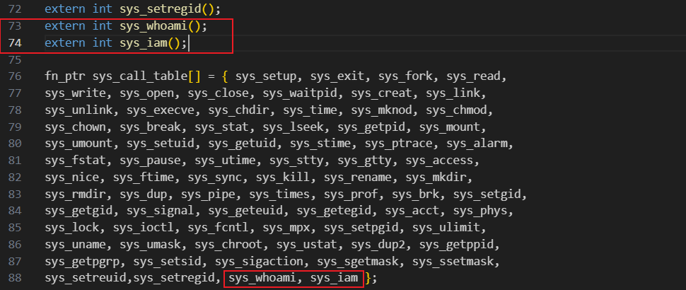

添加系统调用的最后一步，是在内核中实现函数 `sys_iam()` 和 `sys_whoami()` 。

每个系统调用都有一个 `sys_xxxxxx()` 与之对应，它们都是我们学习和模仿的好对象。 比如在 `fs/open.c` 中的 `sys_close(int fd)` ：

```
int sys_close(unsigned int fd)
{
    // ……
    return (0);
}
```

它没有什么特别的，都是实实在在地做 `close()` 该做的事情。所以只要自己创建一个文件： `kernel/who.c` ，然后实现两个函数就万事大吉了。

<font color=green>`kernel/who.c` 实现如下：</font>

```C
#include <asm/segment.h>
#include <errno.h>
#include <string.h>

char _myname[24];

int sys_iam(const char *name)
{ 
    char str[25]; 
    int i = 0; 
    do { 
        // get char from user input 
        str[i] = get_fs_byte(name + i); 
    } while (i <= 25 && str[i++] != '\0'); 
    
    if (i > 24) { 
        errno = EINVAL; 
        return -(EINVAL);
    } else { 
        // copy from user mode to kernel mode 
        strcpy(_myname, str);
    } 
    return i - 1;
}

int sys_whoami(char *name, unsigned int size)
{ 
    int length = strlen(_myname); 
    // printk("%s\n", _myname); 
    if (size < length) { 
        errno = EINVAL; 
        length = -(EINVAL); 
    } else { 
        int i = 0;
        for (i = 0; i < length; i++) { 
            // copy from kernel mode to user mode 
            put_fs_byte(_myname[i], name + i); 
        } 
    } 
    return length;
}
```

<font color=green>修改 `Makefile`</font>

要想让我们添加的 `kernel/who.c` 可以和其它Linux代码编译链接到一起，必须要修改 `Makefile` 文件。 `Makefile` 里记录的是所有源程序文件的编译、链接规则，《注释》 `3.6` 节有简略介绍。 我们之所以简单地运行 `make` 就可以编译整个代码树，是因为 `make` 完全按照 `Makefile` 里的指示工作。

`Makefile` 在代码树中有很多，分别负责不同模块的编译工作。我们要修改的是 `kernel/Makefile` 。 需要修改两处。一处是：

```Makefile
OBJS  = sched.o system_call.o traps.o asm.o fork.o \
	panic.o printk.o vsprintf.o sys.o exit.o \
	signal.o mktime.o
```

修改为：

 

另一处：

```makefile
### Dependencies:
exit.s exit.o: exit.c ../include/errno.h ../include/signal.h \
  ../include/sys/types.h ../include/sys/wait.h ../include/linux/sched.h \
  ../include/linux/head.h ../include/linux/fs.h ../include/linux/mm.h \
  ../include/linux/kernel.h ../include/linux/tty.h ../include/termios.h \
  ../include/asm/segment.h
```

改为：

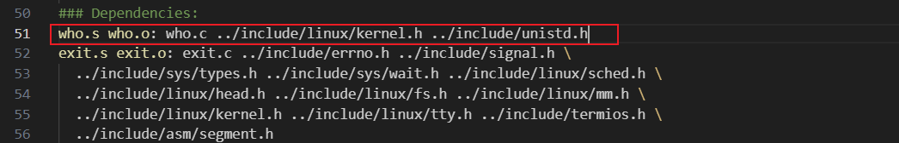

`Makefile` 修改后，和往常一样 `make all` 就能自动把 `who.c` 加入到内核中了。

### 4.3.2 编写测试程序

到此为止，内核中需要修改的部分已经完成，接下来需要编写测试程序来验证新增的系统调用是否已经被编译到 `linux-0.11` 内核可供调用。首先在 oslab 目录下编写 `iam.c`，`whoami.c`

`iam.c`

```c
# define __LIBRARY__
# include <unistd.h>
# include <stdio.h>
# include <errno.h>

_syscall1(int, iam, const char*, name);

int main(int argc, char** argv){
    int wlen = 0;
    if (argc < 1 ){
        printf("not enougth arguments!\n");
    }
    wlen = iam(argv[1]);
    return wlen;
}
```

`whoami.c`

```c
# define __LIBRARY__
# include <unistd.h>
# include <stdio.h>
# include <errno.h>

_syscall2(int, whoami, char*, name, unsigned int, size);

int main() {
	char s[30];
	int rlen = 0;
    /* 这里调用了_syscall2写的whoami函数 */
	rlen = whoami(s, 24);
	printf("%s\n", s);
	return rlen;
}
```

现在启动 `linux-0.11`

```
cd ~/oslab/linux-0.11
make all
cd ..
./run
```

 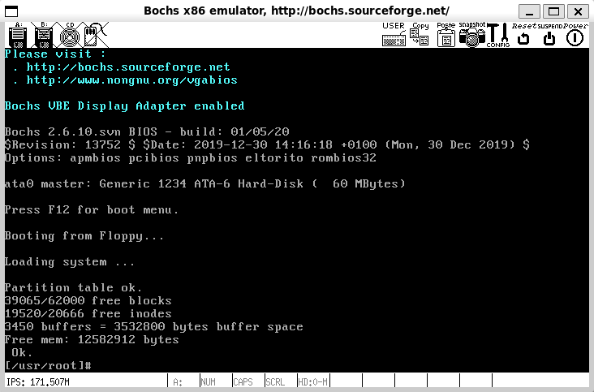

如何将 `iam.c`，`whoami.c` 导入虚拟机中执行呢？

*   方法一：最麻烦的办法，在 `linux-0.11` 中创建  `iam.c`，`whoami.c` 。

     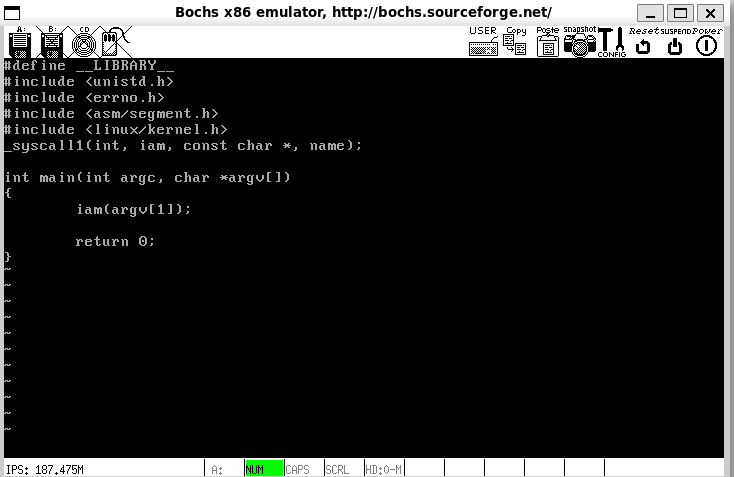

*   方法二：

    采用挂载方式实现宿主机与虚拟机操作系统的文件共享，在 `oslab` 目录下执行以下命令挂载hdc目录到虚拟机操作系统上。

    ```text
    sudo ./mount-hdc 
    ```

    再通过以下命令将上述两个文件拷贝到虚拟机linux-0.11操作系统/usr/root/目录下，命令在oslab/目录下执行：

    ```text
    cp iam.c whoami.c hdc/usr/root
    ```

    如果目标目录下存在对应的两个文件则可启动虚拟机进行测试了。

    >   注意： WSL 没法进行 minix 的挂载，太痛了，手动输入过于麻烦，于是乎，我打开了虚拟机，配置了 liuguojun 老师的环境，好方便！只不过 `./run` 变成了 `./dbg-bochs` ，但是挂载 minix 传送文件真的很方便！

```
gcc -o iam iam.c
```

编译发现报错了：

 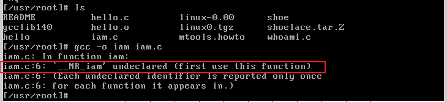

这代表==虚拟机==操作系统中 `/usr/include/unistd.h` 文件中没有新增的系统调用调用号

为新增系统调用设置调用号

```
vi /usr/include/unistd.h
```

 

```
vi /usr/include/linux/sys.h
```

 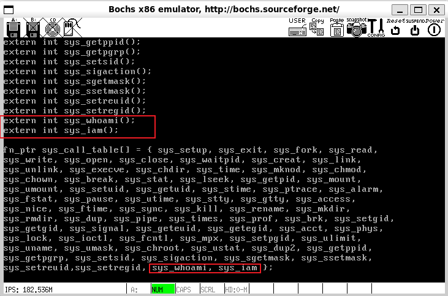

 可以看到再编译运行就正常了：

 

>   为什么这里会打印2次？
>
>   因为在系统内核中执行了 `printk()` 函数，在用户模式下又执行了一次 `printf()` 函数。
>
>   `printk()` 和 `printf()` 的接口和功能基本相同，只是代码上有一点点不同。printk() 需要特别处理一下 `fs` 寄存器，它是专用于用户模式的段寄存器。
>
>   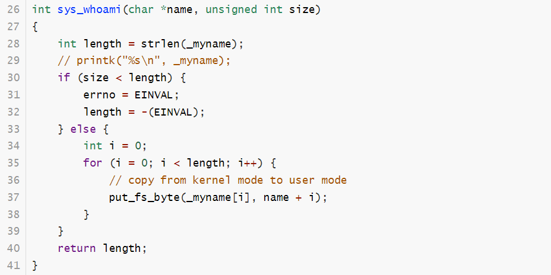
>
>   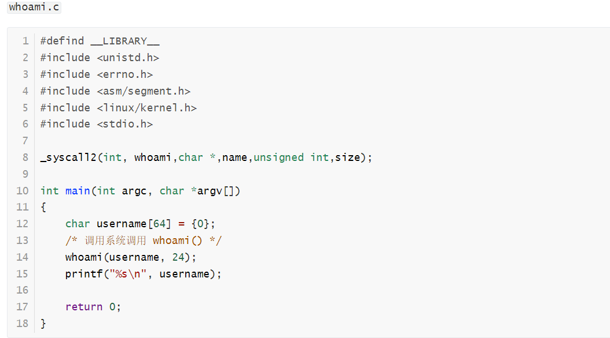
>
>   任意删掉一个就可以，这里为了方便，把 `whoami.c` 中的 printf 删除了：
>
>    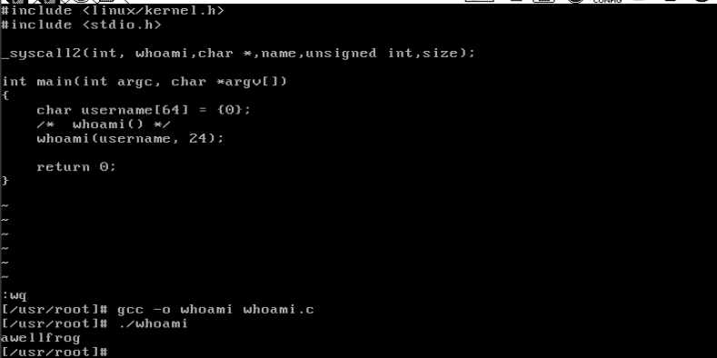
>
>   可以看到再打印就只剩一个从内核读出的内容打印显示了。

### 4.3.3 代码测试

首先将需要用到的文件上传到 `linux-0.11` 

>   guoziyang 学长的测试文件在 `~/oslab/lab2` 中，liuguojun 老师的测试文件在 `~/oslab/files` 中，在对应文件夹下执行如下命令：

```text
cp testlab2.c testlab2.sh ../
cd ..
sudo ./mount-hdc 
```

上传前最好给 `testlab2.sh` 赋予执行的权力，否则在 `linux-0.11` 中会出现下面的问题：

 

```text
chmod +x testlab2.sh
cp testlab2.c testlab2.sh hdc/usr/root
```

如果目标目录下存在对应的两个文件则可启动虚拟机进行测试了。

```
gcc -o testlab2 testlab2.c -Wall
```

 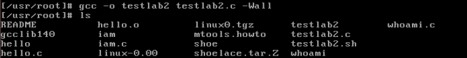

```
./testlab2
```

 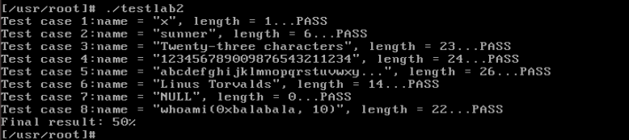

```
./testlab2.sh
```

 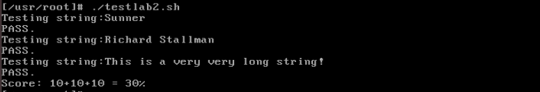

全部通过。

>   提示：`linux-0.11` 不支持 `//` 注释，建议全部改成 `/**/`
>
>    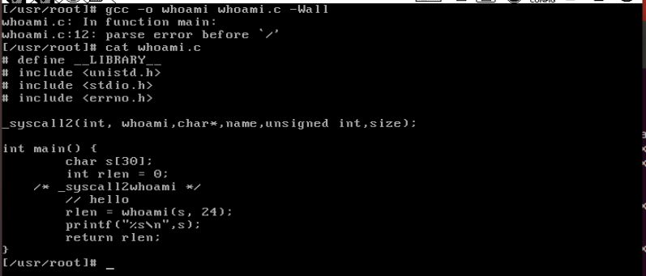

## 4.4 问题回答

在实验报告中回答如下问题：

-   <font color=blue>从 `Linux 0.11` 现在的机制看，它的系统调用最多能传递几个参数？</font>

    从 `linux-0.11/include/unistd.h` 中可以知道 `_syscall` 宏展开的系统调用最多 3 个参数，使用 `ebx`，`ecx`，`edx` 三个寄存器传递参数。

-   <font color=blue>你能想出办法来扩大这个限制吗？</font>

    解决限制的方法：将需要传递的多个参数保存在有特定结构的区间中，并将该用户态地址空间的这个区间的首地址作为一个参数传递给系统调用。最后通过寄存器间接寻址方式便可以访问所有参数。当然，这么做的话，参数合法性验证尤其必要。实际上，linux2.6内核废除了 `_syscall` 宏，而使用 `syscall` 函数，其接受一个可变参数，原理类似，参考《深入理解Linux内核（第三版）》 P409。

-   <font color=blue>用文字简要描述向 `Linux 0.11` 添加一个系统调用 `foo()` 的步骤。</font>

    1.   修改 `include/linux/sys.h` 在 `sys_call_table` 数组最后加入 `sys_foo` ，并仿照上面给出其他系统调用格式加上
         `extern retType sys_foo();`

    2.   修改 `include/unistd.h`

         ```c
         #define __NR_foo num
         ```

         num 为接下来使用的系统调用号

    3.   修改 `kernel/system_call.s` 

         ```c
         nr_system_calls = num
         ```

         num 为在原值加 1 即系统调用总数目加 1

    4.   接着在 kernel 中添加 `foo.c `
         若需要支持内核态与用户态数据交互，则包含 `include/asm/segment.h`，其中有 `put_fs_XXX()`   `get_fs_XXX()` 函数

    5.    `foo.c` 实现系统调用 `sys_foo()`

    6.   修改 kernel 的 Makefile，将 `foo.c` 与内核其它代码编译链接到一起

    7.   系统调用用户界面要 

         ```c
         #define __LIBRARY__
         #include <unistd.h>
         ```

         `_syscallN` 宏展开系统调用，提供用户态的系统调用接口（参数数目确定具体宏）。

## 4.5 实验提示

>   这部分就是把老师的讲解部分粘贴下来，方便以后回忆。

首先，请将 `Linux 0.11` 的源代码恢复到原始状态。

《注释》的 `5.5` 节详细讲述了 `0.11` 如何处理系统调用，是非常有价值的参考。

操作系统实现系统调用的基本过程是：

1.  应用程序调用库函数（ `API` ）；
2.  `API` 将系统调用号存入 `EAX` ，然后通过中断调用使系统进入内核态；
3.  内核中的中断处理函数根据系统调用号，调用对应的内核函数（系统调用）；
4.  系统调用完成相应功能，将返回值存入 `EAX` ，返回到中断处理函数；
5.  中断处理函数返回到 `API` 中；
6.  `API` 将 `EAX` 返回给应用程序。

### 4.4.1. 应用程序如何调用系统调用

在通常情况下，调用系统调用和调用一个普通的自定义函数在代码上并没有什么区别， 但调用后发生的事情有很大不同。 调用自定义函数是通过 `call` 指令直接跳转到该函数的地址，继续运行。 而调用系统调用，是调用系统库中为该系统调用编写的一个接口函数， 叫 **API** （Application Programming Interface）。 `API` 并不能完成系统调用的真正功能，它要做的是去调用真正的系统调用，过程是：

-   把系统调用的编号存入 `EAX`
-   把函数参数存入其它通用寄存器
-   触发 `0x80` 号中断（ `int 0x80` ）

`0.11` 的 `lib` 目录下有一些已经实现的 `API` 。 Linus编写它们的原因是在内核加载完毕后，会切换到用户模式下，做一些初始化工作，然后启动 `shell` 。 而用户模式下的很多工作需要依赖一些系统调用才能完成，因此在内核中实现了这些系统调用的 `API` 。 我们不妨看看 `lib/close.c` ，研究一下 `close()` 的 `API` ：

```
#define __LIBRARY__
#include <unistd.h>
_syscall1(int,close,int,fd)
```

其中 `_syscall1` 是一个宏，在 `include/unistd.h` 中定义。将 `_syscall1(int,close,int,fd)` 进行宏展开，可以得到：

```
int close(int fd)
{
     long __res;
     __asm__ volatile ("int $0x80"
         : "=a" (__res)
         : "0" (__NR_close),"b" ((long)(fd)));
     if (__res >= 0)
         return (int) __res;
     errno = -__res;
     return -1;
}
```

这就是 `API` 的定义。 它先将宏 `__NR_close` 存入 `EAX` ，将参数 `fd` 存入 `EBX` ，然后进行 `0x80` 中断调用。 调用返回后，从 `EAX` 取出返回值，存入 `__res` ，再通过对 `__res` 的判断决定传给API的调用者什么样的返回值。 其中 `__NR_close` 就是系统调用的编号，在 `include/unistd.h` 中定义：

```
#define __NR_close    6
```

所以添加系统调用时需要修改 `include/unistd.h` 文件，使其包含 `__NR_whoami` 和 `__NR_iam` 。而在应用程序中，要有：

```
#define __LIBRARY__                              /* 有它，_syscall1等才有效。详见unistd.h */
#include <unistd.h>                              /* 有它，编译器才能获知自定义的系统调用的编号 */
_syscall1(int, iam, const char*, name);          /* iam()在用户空间的接口函数 */
_syscall2(int, whoami,char*,name,unsigned int,size);    /* whoami()在用户空间的接口函数 */
```

在 `0.11` 环境下编译 `C` 程序，包含的头文件都在 `/usr/include` 目录下。 该目录下的 `unistd.h` 是标准头文件（它和 `0.11` 源码树中的 `unistd.h` 并不是同一个文件，虽然内容可能相同）， 没有 `__NR_whoami` 和 `__NR_iam` 两个宏，需要手工加上它们，也可以直接从修改过的 `0.11` 源码树中拷贝新的 `unistd.h` 过来。

### 4.4.2. 从 `int 0x80` 进入内核函数

`int 0x80` 触发后，接下来就是内核的中断处理了。 先了解一下 `0.11` 处理 `0x80` 号中断的过程。

在内核初始化时，主函数（在 `init/main.c` 中，`Linux` 实验环境下是 `main()` ， `Windows` 下因编译器兼容性问题被换名为 `start()` ）调用了 `sched_init()` 初始化函数：

```
void main(void)
{
    // ……
    time_init();
    sched_init();
    buffer_init(buffer_memory_end);
    // ……
}
```

`sched_init()` 在 `kernel/sched.c` 中定义为：

```
void sched_init(void)
{
    // ……
    set_system_gate(0x80,&system_call);
}
```

`set_system_gate` 是个宏，在 `include/asm/system.h` 中定义为：

```
#define set_system_gate(n,addr) \
    _set_gate(&idt[n],15,3,addr)
```

`_set_gate` 的定义是：

```
#define _set_gate(gate_addr,type,dpl,addr) \
__asm__ ("movw %%dx,%%ax\n\t" \
    "movw %0,%%dx\n\t" \
    "movl %%eax,%1\n\t" \
    "movl %%edx,%2" \
    : \
    : "i" ((short) (0x8000+(dpl<<13)+(type<<8))), \
    "o" (*((char *) (gate_addr))), \
    "o" (*(4+(char *) (gate_addr))), \
    "d" ((char *) (addr)),"a" (0x00080000))
```

虽然看起来挺麻烦，但实际上很简单，就是填写 `IDT` （中断描述符表）， 将 `system_call` 函数地址写到 `0x80` 对应的中断描述符中，也就是在中断 `0x80` 发生后， 自动调用函数 `system_call` 。 具体细节请参考《注释》的第 `4` 章。

接下来看 `system_call` 。该函数纯汇编打造，定义在 `kernel/system_call.s` 中：

```
# ……
nr_system_calls = 72        #这是系统调用总数。如果增删了系统调用，必须做相应修改
# ……
.globl system_call
.align 2
system_call:
    cmpl $nr_system_calls-1,%eax #检查系统调用编号是否在合法范围内
    ja bad_sys_call
    push %ds
    push %es
    push %fs
    pushl %edx
    pushl %ecx
    pushl %ebx        # push %ebx,%ecx,%edx，是传递给系统调用的参数
    movl $0x10,%edx        # 让ds,es指向GDT，内核地址空间
    mov %dx,%ds
    mov %dx,%es
    movl $0x17,%edx        # 让fs指向LDT，用户地址空间
    mov %dx,%fs
    call sys_call_table(,%eax,4)
    pushl %eax
    movl current,%eax
    cmpl $0,state(%eax)
    jne reschedule
    cmpl $0,counter(%eax)
    je reschedule
```

`system_call` 用 `.globl` 修饰为其他函数可见。 `call sys_call_table(,%eax,4)` 之前是一些压栈保护，修改段选择子为内核段， `call sys_call_table(,%eax,4)` 之后是看看是否需要重新调度，这些都与本实验没有直接关系， 此处只关心 `call sys_call_table(,%eax,4)` 这一句。 根据汇编寻址方法它实际上是：

```
call sys_call_table + 4 * %eax   # 其中eax中放的是系统调用号，即__NR_xxxxxx
```

显然， `sys_call_table` 一定是一个函数指针数组的起始地址，它定义在 `include/linux/sys.h` 中：

```
fn_ptr sys_call_table[] = { sys_setup, sys_exit, sys_fork, sys_read, // ……
```

增加实验要求的系统调用，需要在这个函数表中增加两个函数引用—— `sys_iam` 和 `sys_whoami` 。 当然该函数在 `sys_call_table` 数组中的位置必须和 `__NR_xxxxxx` 的值对应上。 同时还要仿照此文件中前面各个系统调用的写法，加上：

```
extern int sys_whoami();
extern int sys_iam();
```

不然，编译会出错的。

### 4.4.3. 实现 `sys_iam()` 和 `sys_whoami()`

添加系统调用的最后一步，是在内核中实现函数 `sys_iam()` 和 `sys_whoami()` 。

每个系统调用都有一个 `sys_xxxxxx()` 与之对应，它们都是我们学习和模仿的好对象。 比如在 `fs/open.c` 中的 `sys_close(int fd)` ：

```
int sys_close(unsigned int fd)
{
    // ……
    return (0);
}
```

它没有什么特别的，都是实实在在地做 `close()` 该做的事情。所以只要自己创建一个文件： `kernel/who.c` ，然后实现两个函数就万事大吉了。

### 4.4.4. 修改 `Makefile`

要想让我们添加的 `kernel/who.c` 可以和其它Linux代码编译链接到一起，必须要修改 `Makefile` 文件。 `Makefile` 里记录的是所有源程序文件的编译、链接规则，《注释》 `3.6` 节有简略介绍。 我们之所以简单地运行 `make` 就可以编译整个代码树，是因为 `make` 完全按照 `Makefile` 里的指示工作。

`Makefile` 在代码树中有很多，分别负责不同模块的编译工作。我们要修改的是 `kernel/Makefile` 。 需要修改两处。一处是：

```
OBJS  = sched.o system_call.o traps.o asm.o fork.o \
        panic.o printk.o vsprintf.o sys.o exit.o \
        signal.o mktime.o
```

改为：

```
OBJS  = sched.o system_call.o traps.o asm.o fork.o \
        panic.o printk.o vsprintf.o sys.o exit.o \
        signal.o mktime.o who.o
```

另一处：

```
### Dependencies:
exit.s exit.o: exit.c ../include/errno.h ../include/signal.h \
  ../include/sys/types.h ../include/sys/wait.h ../include/linux/sched.h \
  ../include/linux/head.h ../include/linux/fs.h ../include/linux/mm.h \
  ../include/linux/kernel.h ../include/linux/tty.h ../include/termios.h \
  ../include/asm/segment.h
```

改为：

```
### Dependencies:
who.s who.o: who.c ../include/linux/kernel.h ../include/unistd.h
exit.s exit.o: exit.c ../include/errno.h ../include/signal.h \
  ../include/sys/types.h ../include/sys/wait.h ../include/linux/sched.h \
  ../include/linux/head.h ../include/linux/fs.h ../include/linux/mm.h \
  ../include/linux/kernel.h ../include/linux/tty.h ../include/termios.h \
  ../include/asm/segment.h
```

`Makefile` 修改后，和往常一样 `make all` 就能自动把 `who.c` 加入到内核中了。 如果编译时提示 `who.c` 有错误，就说明修改生效了。 所以，有意或无意地制造一两个错误也不完全是坏事，至少能证明 `Makefile` 是对的。

### 4.4.5. 用 `printk()` 调试内核

`oslab` 实验环境提供了基于 `C` 语言和汇编语言的两种调试手段。 除此之外，适当地向屏幕输出一些程序运行状态的信息，也是一种很高效、便捷的调试方法， 有时甚至是唯一的方法，被称为 `printf` 法。

要知道到， `printf()` 是一个只能在用户模式下执行的函数，而系统调用是在内核模式中运行， 所以 `printf()` 不可用，要用 `printk()` 。 它和 `printf` 的接口和功能基本相同，只是代码上有一点点不同。 `printk()` 需要特别处理一下 `fs` 寄存器，它是专用于用户模式的段寄存器。 看一看 `printk` 的代码（在 `kernel/printk.c` 中）就知道了：

```
int printk(const char *fmt, ...)
{
    // ……
    __asm__("push %%fs\n\t"
            "push %%ds\n\t"
            "pop %%fs\n\t"
            "pushl %0\n\t"
            "pushl $buf\n\t"
            "pushl $0\n\t"
            "call tty_write\n\t"
            "addl $8,%%esp\n\t"
            "popl %0\n\t"
            "pop %%fs"
            ::"r" (i):"ax","cx","dx");
   // ……
}
```

显然， `printk()` 首先 `push %fs` 保存这个指向用户段的寄存器，在最后 `pop %fs` 将其恢复， `printk` 的核心仍然是调用 `tty_write()` 。 查看 `printf()` 可以看到，它最终也要落实到这个函数上。

### 4.4.6. 编写测试程序

激动地运行一下由你亲手修改过的 `Linux 0.11 pro++` ！然后编写一个简单的应用程序进行测试。 比如在 `sys_iam()` 中向终端 `printk()` 一些信息，让应用程序调用 `iam()` ，从结果可以看出系统调用是否被真的调用到了。

可以直接在Linux 0.11环境下用 `vi` 编写（别忘了经常执行 `sync` 以确保内存缓冲区的数据写入磁盘）， 也可以在 `Ubuntu` 下编完后再传到 `Linux 0.11` 下。无论如何，最终都必须在 `Linux 0.11` 下编译。编译命令是：

```
gcc -o iam iam.c -Wall
```

`gcc` 的 `-Wall` 参数是给出所有的编译警告信息， `-o` 参数指定生成的执行文件名是 `iam` ，用下面命令运行它：

```
./iam
```

如果如愿输出了你的信息，就说明你添加的系统调用生效了。否则，就还要继续调试，祝你好运！

### 4.4.7. 在用户态和核心态之间传递数据

指针参数传递的是应用程序所在地址空间的逻辑地址，在内核中如果直接访问这个地址，访问到的是内核空间中的数据，不会是用户空间的。所以这里还需要一点儿特殊工作，才能在内核中从用户空间得到数据。

要实现的两个系统调用参数中都有字符串指针， 非常象 `open(char *filename, ……)` ，所以我们看一下 `open()` 系统调用是如何处理的。

```
int open(const char * filename, int flag, ...)
{
    // ……
    __asm__("int $0x80"
            :"=a" (res)
            :"0" (__NR_open),"b" (filename),"c" (flag),
            "d" (va_arg(arg,int)));
    // ……
}
```

可以看出，系统调用是用 `eax` 、 `ebx` 、 `ecx` 、 `edx` 寄存器来传递参数的。 其中 `eax` 传递了系统调用号，而 `ebx` 、 `ecx` 、 `edx` 是用来传递函数的参数的，其中 `ebx` 对应第一个参数， `ecx` 对应第二个参数， 依此类推。如 `open` 所传递的文件名指针是由 `ebx` 传递的，也即进入内核后，通过 `ebx` 取出文件名字符串。 `open` 的 `ebx` 指向的数据在用户空间，而当前执行的是内核空间的代码， 如何在用户态和核心态之间传递数据？接下来我们继续看看 `open` 的处理：

```
system_call: # 所有的系统调用都从system_call开始
    # ……
    pushl %edx
    pushl %ecx
    pushl %ebx                 # push %ebx,%ecx,%edx，这是传递给系统调用的参数
    movl $0x10,%edx            # 让ds,es指向GDT，指向核心地址空间
    mov %dx,%ds
    mov %dx,%es
    movl $0x17,%edx            # 让fs指向的是LDT，指向用户地址空间
    mov %dx,%fs
    call sys_call_table(,%eax,4)    # 即call sys_open
```

由上面的代码可以看出，获取用户地址空间（用户数据段）中的数据依靠的就是段寄存器 `fs` ， 下面该转到 `sys_open` 执行了，在 `fs/open.c` 文件中：

```
int sys_open(const char * filename, int flag, int mode)  //filename这些参数从哪里来？
/*是否记得上面的pushl %edx,    pushl %ecx,    pushl %ebx？
  实际上一个C语言函数调用另一个C语言函数时，编译时就是将要
  传递的参数压入栈中（第一个参数最后压，…），然后call …，
  所以汇编程序调用C函数时，需要自己编写这些参数压栈的代码…*/
{
    // ……
    if ((i=open_namei(filename,flag,mode,&inode))<0) {
        // ……
    }
    // ……
}
```

它将参数传给了 `open_namei()` 。 再沿着 `open_namei()` 继续查找，文件名先后又被传给 `dir_namei()` 、 `get_dir()` 。 在 `get_dir()` 中可以看到：

```
static struct m_inode * get_dir(const char * pathname)
{
    // ……
    if ((c=get_fs_byte(pathname))=='/') {
        // ……
    }
    // ……
}
```

处理方法就很显然了：用 `get_fs_byte()` 获得一个字节的用户空间中的数据。 所以，在实现 `iam()` 时，调用 `get_fs_byte()` 即可。 但如何实现 `whoami()` 呢？即如何实现从核心态拷贝数据到用心态内存空间中呢？ 猜一猜，是否有 `put_fs_byte()` ？有！看一看 `include/asm/segment.h` ：

```
extern inline unsigned char get_fs_byte(const char * addr)
{
    unsigned register char _v;
    __asm__ ("movb %%fs:%1,%0":"=r" (_v):"m" (*addr));
    return _v;
}

extern inline void put_fs_byte(char val,char *addr)
{
    __asm__ ("movb %0,%%fs:%1"::"r" (val),"m" (*addr));
}
```

他俩以及所有 `put_fs_xxx()` 和 `get_fs_xxx()` 都是用户空间和内核空间之间的桥梁，在后面的实验中还要经常用到。

### 4.4.8. 运行脚本程序

Linux的一大特色是可以编写功能强大的 `shell` 脚本，提高工作效率。 本实验的部分评分工作由脚本 `testlab2.sh` 完成。它的功能是测试 `iam.c` 和 `whoami.c` 。

首先将 `iam.c` 和 `whoami.c` 分别编译成 `iam` 和 `whoami` ，然后将 `testlab2.sh` 拷贝到同一目录下。 用下面命令为此脚本增加执行权限：

```
chmod +x testlab2.sh
```

然后运行之：

```
./testlab2.sh
```

根据输出，可知 `iam.c` 和 `whoami.c` 的得分。

### 4.4.9. errno

`errno` 是一种传统的错误代码返回机制。当一个函数调用出错时，通常会返回 `-1` 给调用者。 但 `-1` 只能说明出错，不能说明错是什么。为解决此问题，全局变量 `errno` 登场了。 错误值被存放到 `errno` 中，于是调用者就可以通过判断 `errno` 来决定如何应对错误了。 各种系统对 `errno` 的值的含义都有标准定义。 Linux下用 `man errno` 可以看到这些定义。