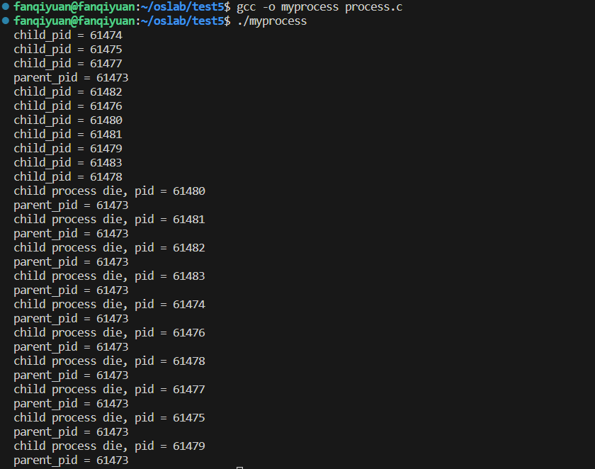
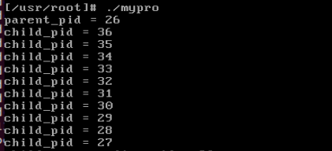
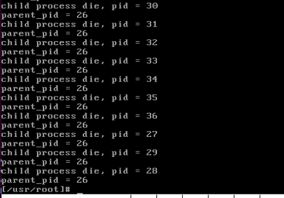

# 5. 进程运行轨迹的跟踪与统计

## 5.1. 实验目的

-   掌握 `Linux` 下的多进程编程技术；
-   通过对进程运行轨迹的跟踪来形象化进程的概念；
-   在进程运行轨迹跟踪的基础上进行相应的数据统计，从而能对进程调度算法进行实际的量化评价， 更进一步加深对调度和调度算法的理解，获得能在实际操作系统上对调度算法进行实验数据对比的直接经验。

## 5.2. 实验内容

进程从创建（ `Linux` 下调用 `fork()` ）到结束的整个过程就是进程的生命期， 进程在其生命期中的运行轨迹实际上就表现为进程状态的多次切换，如进程创建以后会成为就绪态； 当该进程被调度以后会切换到运行态；在运行的过程中如果启动了一个文件读写操作， 操作系统会将该进程切换到阻塞态（等待态）从而让出 `CPU` ； 当文件读写完毕以后，操作系统会在将其切换成就绪态，等待进程调度算法来调度该进程执行……

本次实验包括如下内容：

1.  基于模板 `process.c` 编写多进程的样本程序，实现如下功能：
    -   所有子进程都并行运行，每个子进程的实际运行时间一般不超过 `30` 秒；
    -   父进程向标准输出打印所有子进程的 `id` ，并在所有子进程都退出后才退出；
2.  在 `Linux 0.11` 上实现进程运行轨迹的跟踪。基本任务是在内核中维护一个日志文件 `/var/process.log` ，把从操作系统启动到系统关机过程中所有进程的运行轨迹都记录在这一 `log` 文件中。
3.  在修改过的 `0.11` 上运行样本程序，通过分析 `log` 文件，统计该程序建立的所有进程的等待时间、完成时间（周转时间）和运行时间，然后计算平均等待时间，平均完成时间和吞吐量。可以自己编写统计程序，也可以使用 `python` 脚本程序 `stat_log.py` 进行统计。
4.  修改 `0.11` 进程调度的时间片，然后再运行同样的样本程序，统计同样的时间数据，和原有的情况对比，体会不同时间片带来的差异。

`/var/process.log` 文件的格式必须为：

```
pid X time
```

其中：

-   `pid` 是进程的 `ID` ；
-   `X` 可以是 `N` , `J` , `R` , `W` 和 `E` 中的任意一个，分别表示进程新建( `N` )、进入就绪态( `J` )、进入运行态( `R` )、进入阻塞态( `W` )和退出( `E` )；
-   `time` 表示 `X` 发生的时间。这个时间不是物理时间，而是系统的滴答时间( `tick` )；

三个字段之间用制表符分隔。 例如：

```
12    N    1056
12    J    1057
4     W    1057
12    R    1057
13    N    1058
13    J    1059
14    N    1059
14    J    1060
15    N    1060
15    J    1061
12    W    1061
15    R    1061
15    J    1076
14    R    1076
14    E    1076
……
```

## 5.3. 实验报告

完成实验后，在实验报告中回答如下问题：

1.  结合自己的体会，谈谈从程序设计者的角度看，单进程编程和多进程编程最大的区别是什么？

    *   **执行方式：**
        *   单进程编程是一个进程从上到下顺序进行；
        *   多进程编程可以通过并发执行，即多个进程之间交替执行，如某一个进程正在I/O输入输出而不占用CPU时，可以让CPU去执行另外一个进程，这需要采取某种调度算法。
    *   **数据是否同步：**
        *   单进程的数据是同步的，因为单进程只有一个进程，在进程中改变数据的话，是会影响这个进程的；
        *   多进程的数据是异步的，因为子进程数据是父进程数据在内存另一个位置的拷贝，因此改变其中一个进程的数据，是不会影响到另一个进程的。
    *   **CPU利用率：**
        *   单进程编程的CPU利用率低，因为单进程在等待I/O时，CPU是空闲的；
        *   多进程编程的CPU利用率高，因为当某一进程等待I/O时，CPU会去执行另一个进程，因此CPU的利用率高。
    *   **多进程用途更广泛。**

2.  你是如何修改时间片的？仅针对样本程序建立的进程，在修改时间片前后， `log` 文件的统计结果（不包括Graphic）都是什么样？结合你的修改分析一下为什么会这样变化，或者为什么没变化？

    依次将时间偏设为1，5，10，15，20，25，50，100，150后，经统计分析log文件可以发现：
    1）在一定的范围内，平均等待时间，平均完成时间的变化随着时间片的增大而减小。这是因为在时间片小的情况下，cpu将时间耗费在调度切换上，所以平均等待时间增加。
    2）超过一定的范围之后，这些参数将不再有明显的变化，这是因为在这种情况下，RR轮转调度就变成了FCFS先来先服务了。随着时间片的修改，吞吐量始终没有明显的变化，这是因为在单位时间内，系统所能完成的进程数量是不会变的。

## 5.4 实验过程

### 5.4.1 `process.c` 编写

使用 man 命令查看 `fork()` 函数 和 `wait()` 函数：

`fork()`

```c
#include <sys/types.h>
#include <unistd.h>

pid_t fork(void);
函数的作用：创建子进程
    返回值：
    fork() 的返回值会返回两次。一次在父进程中，一次在子进程中
    	- 在父进程中返回创建的子进程的ID
    	- 在子进程中返回0
    		如何区分父进程和子进程：通过fork的返回值
    	- 在父进程中返回-1，表示子进程失败，并设置errno
```

`wait()`

```c
#include <sys/types.h>
#include <sys/wait.h>

pid_t wait(int *wstatus);
功能：等待任意一个子进程结束，如果任意一个子进程结束了，此函数会回收子进程的资源。
参数：int *wstatus
	进程退出时的状态信息，传入的是一个int类型的地址，传出参数。
返回值：
	- 成功：返回被回收的子进程的id
	- 失败：-1 (所有的子进程都结束，调用函数失败)

调用wait函数的进程会被挂起（阻塞），直到它的一个子进程退出或者收到一个不能被忽略的信号时才被唤醒（相当于继续往下执行）
如果没有子进程了，函数立刻返回，返回-1；如果子进程都已经结束了，也会立即返回，返回-1.
```

`struct tms` 结构体

`struct tms` 结构体定义在 `<sys/times.h>` 头文件里，具体定义如下：

```c
/* Structure describing CPU time used by a process and its children.  */ 
struct tms { 
    clock_t tms_utime ;          /* User CPU time.  用户程序 CPU 时间*/ 
    clock_t tms_stime ;          /* System CPU time. 系统调用所耗费的 CPU 时间 */ 

    clock_t tms_cutime ;         /* User CPU time of dead children. 已死掉子进程的 CPU 时间*/ 
    clock_t tms_cstime ;         /* System CPU time of dead children.  已死掉子进程所耗费的系统调用 CPU 时间*/
}
```

`clock_t`

>   返回时钟滴答数

```c
typedef __clock_t clock_t;
__STD_TYPE __CLOCK_T_TYPE __clock_t;	/* Type of CPU usage counts.  */
#define __CLOCK_T_TYPE		__SYSCALL_SLONG_TYPE
#define __SYSCALL_SLONG_TYPE	__SLONGWORD_TYPE
#define __SLONGWORD_TYPE	long int
```

逐层寻找，最后发现 `clock_t` 其实就是 `long int` 类型

`time_t`

>   返回秒数

```c
/* Return the current time and put it in *TIMER if TIMER is not NULL.  */
extern time_t time (time_t *__timer) __THROW;

typedef __time_t time_t;
__STD_TYPE __TIME_T_TYPE __time_t;	/* Seconds since the Epoch.  */
```

`time.h`

```c
/* This defines CLOCKS_PER_SEC, which is the number of processor clock
   ticks per second, and possibly a number of other constants.   */
#include <bits/time.h>
```

`bit/time.h`

```c
/* ISO/IEC 9899:1999 7.23.1: Components of time
   The macro `CLOCKS_PER_SEC' is an expression with type `clock_t' that is
   the number per second of the value returned by the `clock' function.  */
/* CAE XSH, Issue 4, Version 2: <time.h>
   The value of CLOCKS_PER_SEC is required to be 1 million on all
   XSI-conformant systems. */
#define CLOCKS_PER_SEC  ((__clock_t) 1000000)
```

定义 $HZ=100$，内核的标准时间是 jiffy ，一个 jiffy 就是一个内部时钟周期,而内部时钟周期是由 100HZ 的频率所产生中的,也就是一个时钟滴答，间隔时间是10毫秒(ms)。计算出来的时间也并非真实时间，而是时钟滴答次数，乘以 10ms 可以得到真正的时间。

`process.c`

```c
#include <stdio.h>
#include <unistd.h>
#include <time.h>
#include <sys/times.h>
#include <sys/types.h>
#include <sys/wait.h>

#define HZ 100

void cpuio_bound(int last, int cpu_time, int io_time);

int main(int argc, char *argv[])
{
    /* 有一个父进程，创建 10 个子进程 */
    pid_t pid;
    int i = 0;
    for (i = 0; i < 10; i++) {
        pid = fork();
        if (pid == 0) {
            /* 子进程不用创建进程，直接执行后续指令即可 */ 
            break;
        }
        /* 其余情况继续创建进程直到创建出 10 个子进程为止 */
    }

    if (pid > 0) {
        /* 父进程执行回收子进程的操作 */
        int ret = 0;
        while (1) {
            printf("parent_pid = %d\n", getpid());
            
            ret = wait(NULL);
            /* 没有可回收的子进程，即所有子进程全被回收了，则退出 */
            if (ret == -1) break;

            printf("child process die, pid = %d\n", ret);
        }

    } else if (pid == 0) {
        /* 子进程执行任务 */
        pid_t child_pid = getpid();
        printf("child_pid = %d\n", child_pid);
        cpuio_bound(10, child_pid % 10, 10 - (child_pid % 10));
    }

    return 0;
}

void cpuio_bound(int last, int cpu_time, int io_time)
{
    struct tms start_time, current_time;
    clock_t utime, stime;
    int sleep_time;

    while (last > 0) {

        /* CPU time */
        times(&start_time);
        do {
            times(&current_time);
            utime = current_time.tms_utime - start_time.tms_utime;
            stime = current_time.tms_stime - start_time.tms_stime;
        } while ( (utime + stime) / HZ < cpu_time );
        last -= cpu_time;

        if (last < 0) break;

        /* IO time */
        sleep_time = 0;
        while (sleep_time < io_time) {
            sleep(1);
            sleep_time++;
        }
        last -= sleep_time;
    }
}
```

>   注意：linux-0.11 中只能使用 /**/ 写注释

 

### 5.4.2 开启 log 文件记录

尽早打开 log 文件开始记录，最开始程序在进程 0 中运行，先切换到用户模式，然后全系统第一次使用 `fork()` 创建进程1，进程1调用 `init()` 进行一系列初始化。

```c
setup((void *) &drive_info);        //加载文件系统
(void) open("/dev/tty0",O_RDWR,0);  //打开/dev/tty0，建立文件描述符0和/dev/tty0的关联
(void) dup(0);                      //让文件描述符1也和/dev/tty0关联
(void) dup(0);                      //让文件描述符2也和/dev/tty0关联
```

这段代码建立了文件描述符 `0` 、 `1` 和 `2` ，它们分别就是 `stdin` 、 `stdout` 和 `stderr` 。 这三者的值是系统标准（ `Windows` 也是如此），不可改变。 可以把 `log` 文件的描述符关联到 `3` 。 文件系统初始化，描述符 `0` 、 `1` 和 `2` 关联之后，才能打开 `log` 文件，开始记录进程的运行轨迹。

打开 `log` 文件的参数的含义是建立只写文件，如果文件已存在则清空已有内容。文件的权限是所有人可读可写。

这样，文件描述符 `0` 、 `1` 、 `2` 和 `3` 就在进程 `1` 中建立了。根据 `fork()` 的原理，进程 `1` 之后的进程会继承这些文件描述符，所以就不必再 `open()` 它们。 但实际上， `init()` 的后续代码和 `/bin/sh` 都会重新初始化它们。 所以只有进程 `1` 的文件描述符肯定关联着 `log` 文件，这一点在接下来的写 `log` 中很重要。

在 `main()` 中做如下修改：

>   增加对 log 的写入和权限设置。
>
>   文件描述符 0、1、2、3 就在进程 0 中建立了。根据 `fork()` 的原理，进程 1 会继承这些文件描述符，所以 `init()` 中就不必再 `open()` 它们。此后所有新建的进程都是进程 1 的后代进程，也会继承它们。但实际上，`init()` 的后续代码和 `/bin/sh` 都会重新初始化它们。所以之后进程 0 和进程 1 的文件描述符肯定关联着 log 文件，这一点在接下来的写 log 中很重要。

```c
...
move_to_user_mode();

setup((void *) &drive_info);
(void) open("/dev/tty0",O_RDWR,0);
(void) dup(0);
(void) dup(0);
(void) open("/var/process.log",O_CREAT|O_TRUNC|O_WRONLY,0666);

if (!fork()) {		/* we count on this going ok */
    init();
}
...
```

### 5.4.3 写 `log` 文件

`log` 文件将被用来记录进程的状态转移轨迹。所有的状态转移都是在内核进行的。 在内核状态下， `write()` 功能失效，其原理等同于《系统调用》实验中不能在内核状态调用 `printf()` ， 只能调用 `printk()` 。 编写可在内核调用的 `write()` 的难度较大，所以这里直接给出源码。 它主要参考了 `printk()` 和 `sys_write()` 而写成的：

```c
#include <linux/sched.h>
#include <sys/stat.h>

static char logbuf[1024];
int fprintk(int fd, const char *fmt, ...)
{
    va_list args;
    int count;
    struct file * file;
    struct m_inode * inode;

    va_start(args, fmt);
    count=vsprintf(logbuf, fmt, args);
    va_end(args);

    if (fd < 3)    /* 如果输出到stdout或stderr，直接调用sys_write即可 */
    {
        __asm__("push %%fs\n\t"
            "push %%ds\n\t"
            "pop %%fs\n\t"
            "pushl %0\n\t"
            "pushl $logbuf\n\t" /* 注意对于Windows环境来说，是_logbuf,下同 */
            "pushl %1\n\t"
            "call sys_write\n\t" /* 注意对于Windows环境来说，是_sys_write,下同 */
            "addl $8,%%esp\n\t"
            "popl %0\n\t"
            "pop %%fs"
            ::"r" (count),"r" (fd):"ax","cx","dx");
    }
    else    /* 假定>=3的描述符都与文件关联。事实上，还存在很多其它情况，这里并没有考虑。*/
    {
        // if (!(file=task[0]->filp[fd]))    /* 从进程0的文件描述符表中得到文件句柄 */
        //    return 0;
        
        // 修改为如下：
        // task[1]->filp is not ready or f_inode->i_dev is not ready
        if (!(file=task[1]->filp[fd]) || !task[1]->filp[fd]->f_inode->i_dev) {   /* 从进程1的文件描述符表中得到文件句柄 */
            return 0;
        }
        inode=file->f_inode;

        __asm__("push %%fs\n\t"
            "push %%ds\n\t"
            "pop %%fs\n\t"
            "pushl %0\n\t"
            "pushl $logbuf\n\t"
            "pushl %1\n\t"
            "pushl %2\n\t"
            "call file_write\n\t"
            "addl $12,%%esp\n\t"
            "popl %0\n\t"
            "pop %%fs"
            ::"r" (count),"r" (file),"r" (inode):"ax","cx","dx");
    }
    return count;
}
```

>   *   问题： `kernel panic: trying to get new block from nonexistant device`
>   *   解决：在 `if` 语句增加了判断 `task[1]` 的描述符为fd的文件指针指向的设备是否准备好，如果没准备好这个 `i_dev` 就是 `0` ，然后就会 `return` ，不打印。

因为和 `printk` 的功能近似，建议将此函数放入到 `kernel/printk.c` 中。 `fprintk()` 的使用方式与 `C` 标准库函数 `fprintf()` 相似 ，唯一的区别是第一个参数是文件描述符，而不是文件指针。例如：

```c
fprintk(1, "The ID of running process is %ld", current->pid); //向stdout打印正在运行的进程的ID
fprintk(3, "%ld\t%c\t%ld\n", current->pid, 'R', jiffies); //向log文件输出
```

### 5.4.4 跟踪进程运行轨迹

#### `jiffies` 滴答

`jiffies` 在 `kernel/sched.c` 文件中定义为一个全局变量：

```
long volatile jiffies=0;
```

它记录了从开机到当前时间的时钟中断发生次数。在 `kernel/sched.c` 文件中的 `sched_init()` 函数中， 时钟中断处理函数被设置为：

```
set_intr_gate(0x20,&timer_interrupt);
```

而在 `kernel/system_call.s` 文件中将 `timer_interrupt` 定义为：

```
timer_interrupt:

    incl jiffies     #增加jiffies计数值
```

这说明 `jiffies` 表示从开机时到现在发生的时钟中断次数，这个数也被称为 **滴答数**。

另外，在 `kernel/sched.c` 中的 `sched_init()` 中有下面的代码：

```
outb_p(0x36, 0x43); //设置8253模式
outb_p(LATCH&0xff, 0x40);
outb_p(LATCH>>8, 0x40);
```

这三条语句用来设置每次时钟中断的间隔，即为 `LATCH` ，而 `LATCH` 是定义在文件 `kernel/sched.c` 中的一个宏：

```
#define LATCH  (1193180/HZ)
#define HZ 100  //在include/linux/sched.h中
```

再加上 `PC` 机 `8253` 定时芯片的输入时钟频率为 `1.193180MHz` ，即 `1193180/每秒` ， `LATCH=1193180/100` ， 时钟每跳 `11931.8` 下产生一次时钟中断，即每 `1/100秒（10ms）` 产生一次时钟中断， <font color=red>所以 `jiffies` 实际上记录了从开机以来共经过了多少个 `10ms` 。</font>

#### 寻找状态切换点

必须找到所有发生进程状态切换的代码点，并在这些点添加适当的代码，来输出进程状态变化的情况到 `log` 文件中。 此处要面对的情况比较复杂，需要对 `kernel` 下的 `fork.c` 、 `sched.c` 有通盘的了解，而 `exit.c` 也会涉及到。 我们给出两个例子描述这个工作该如何做，其他情况实验者可仿照完成。

第一个例子是看看如何记录一个进程生命期的开始，当然这个事件就是进程的创建函数 `fork()` ， 由《系统调用》实验可知， `fork()` 功能在内核中实现为 `sys_fork()` ，该“函数”在文件 `kernel/system_call.s` 中实现为：

<font color=blue>修改 `fork.c` 文件</font>

`fork.c` 文件在 kernel 目录下，这里要输出两种状态，分别是“N（新建）”和“J（就绪）”，下面做出两处修改：

```c
int copy_process(int nr, ...)
{
	struct task_struct *p;
	...
	p->start_time = jiffies;

	//新增修改1: 新建进程	
	fprintk(3, "%d\tN\t%d\n", p->pid, jiffies);

	p->tss.back_link = 0;
	...
	p->state = TASK_RUNNING;	/* do this last, just in case */

	//新增修改2: 进程就绪	
	fprintk(3, "%d\tJ\t%d\n", p->pid, jiffies);

	return last_pid;
}
```

<font color=blue>修改 `sched.c` 文件</font>

文件位置：`kernel/sched.c` 

<font color=green>修改 `schedule` 函数</font>

```c
	...
						(*p)->priority;
	}

	//切换到相同的进程不输出
	if(current->pid != task[next] ->pid) {		
		// 新建修改3: 时间片到时程序 => 就绪		
		if(current->state == TASK_RUNNING)			
			fprintk(3,"%d\tJ\t%d\n",current->pid,jiffies);		
		fprintk(3,"%d\tR\t%d\n",task[next]->pid,jiffies);	
	}

	switch_to(next);
	...
    //切换到相同的进程不输出
	if(current->pid != task[next] ->pid) {		
		// 新建修改4--(时间片到时程序 => 就绪)		
		if(current->state == TASK_RUNNING)			
			fprintk(3,"%d\tJ\t%d\n",current->pid,jiffies);		
		fprintk(3,"%d\tR\t%d\n",task[next]->pid,jiffies);	
	}

	// 切换到 next 进程
	switch_to(next);
```

<font color=green>修改 `sys_pause` 函数</font>

```c
int sys_pause(void)
{
	current->state = TASK_INTERRUPTIBLE;
    
	// 修改5--(当前进程  运行 => 可中断睡眠)
	if(current->pid != 0)
		fprintk(3,"%d\tW\t%d\n",current->pid,jiffies);
    
	schedule();
	return 0;
}
```

<font color=green>修改 `sleep_on` 函数</font>

```c
void sleep_on(struct task_struct **p)
{
	struct task_struct *tmp;

	if (!p)
		return;
	if (current == &(init_task.task))
		panic("task[0] trying to sleep");
	tmp = *p;
	*p = current;
	current->state = TASK_UNINTERRUPTIBLE;
    
	// 修改6--(当前进程进程 => 不可中断睡眠)
	fprintk(3, "%d\tW\t%d\n", current->pid, jiffies);
    
	schedule();
	if (tmp) {
		tmp->state=0;
        
		// 修改7--(原等待队列 第一个进程 => 唤醒（就绪）)
		fprintk(3, "%d\tJ\t%d\n", tmp->pid, jiffies);
        
	}

}
```

<font color=green>修改 `interruptible_sleep_on` 函数</font>

```c
void interruptible_sleep_on(struct task_struct **p)
{
	struct task_struct *tmp;

	if (!p)
		return;
	if (current == &(init_task.task))
		panic("task[0] trying to sleep");
	tmp=*p;
	*p=current;
repeat:	current->state = TASK_INTERRUPTIBLE;
    
	// 修改8--(当前进程进程 => 不可中断睡眠) -> 唤醒队列中间进程，过程中使用Wait
	fprintk(3, "%d\tW\t%d\n", current->pid, jiffies);
    
	schedule();
	if (*p && *p != current) {
		(**p).state=0;
        
		// 修改9--(当前进程 => 可中断睡眠)
		fprintk(3, "%d\tJ\t%d\n", (*p)->pid, jiffies);
        
		goto repeat;
	}
	*p=NULL;
	if (tmp) {
		tmp->state=0;
        
		// 修改10--(原等待队列 第一个进程 => 唤醒（就绪）)
		fprintk(3,"%d\tJ\t%d\n",tmp->pid,jiffies);
        
	}

}
```

<font color=green>修改 `wake_up` 函数</font>

```c
void wake_up(struct task_struct **p)
{
	if (p && *p) {
		(**p).state=0;
        
		// 修改11--(唤醒 最后进入等待序列的 进程)
		fprintk(3, "%d\tJ\t%d\n", (*p)->pid, jiffies);
        
		*p=NULL;
	}
}
```

<font color=blue>修改 `exit.c` 文件</font>

当一个进程结束了运行或在半途中终止了运行，那么内核就需要释放该进程所占用的系统资源。这包括进程运行时打开的文件、申请的内存等。

当一个用户程序调用 `exit()` 系统调用时，就会执行内核函数 `do_exit()` 。该函数会首先释放进程代码段和数据段占用的内存页面，关闭进程打开着的所有文件，对进程使用的当前工作目录、根目录和运行程序的`i`节点进行同步操作。如果进程有子进程，则让`init`进程作为其所有子进程的父进程。如果进程是一个会话头进程并且有控制终端，则**释放控制终端(如果按照实验的数据，此时就应该打印了)**，并向属于该会话的所有进程发送挂断信号 SIGHUP，这通常会终止该会话中的所有进程。然后把进程状态置为僵死状态 TASK_ZOMBIE。并向其原父进程发送 SIGCHLD 信号，通知其某个子进程已经终止。最后 `do_exit()` 调用调度函数去执行其他进程。由此可见在进程被终止时，它的任务数据结构仍然保留着。因为其父进程还需要使用其中的信息。

在子进程在执行期间，父进程通常使用`wait()`或 `waitpid()`函数等待其某个子进程终止。当等待的子进程被终止并处于僵死状态时，父进程就会把子进程运行所使用的时间累加到自己进程中。最终释放已终止子进程任务数据结构所占用的内存页面，并置空子进程在任务数组中占用的指针项。

<font color=green>修改 `do_exit` 函数</font>

```c
int do_exit(long code)
{
	...
	current->state = TASK_ZOMBIE;
    
	// 修改12--退出一个进程
	fprintk(3, "%d\tE\t%d\n", current->pid, jiffies);
    
	current->exit_code = code;
    ...
}
```

<font color=green>修改 `sys_waitpid` 函数</font>

```c
int sys_waitpid(pid_t pid,unsigned long * stat_addr, int options)
{
	...
	if (flag) {
		...
		current->state=TASK_INTERRUPTIBLE;

		// 修改13--(当前进程 => 等待)
		fprintk(3, "%d\tW\t%d\n", current->pid, jiffies);

		schedule();
		...
    }
    return -ECHILD;
}
```

总的来说， `Linux 0.11` 支持四种进程状态的转移： 就绪到运行、运行到就绪、运行到睡眠和睡眠到就绪，此外还有新建和退出两种情况。 其中:

-   就绪与运行间的状态转移是通过 `schedule()` （它亦是调度算法所在）完成的；
-   运行到睡眠依靠的是 `sleep_on()` 和 `interruptible_sleep_on()` ，还有进程主动睡觉的系统调用 `sys_pause()` 和 `sys_waitpid()` ；
-   睡眠到就绪的转移依靠的是 `wake_up()` 。所以只要在这些函数的适当位置插入适当的处理语句就能完成进程运行轨迹的全面跟踪了。

为了让生成的 `log` 文件更精准，以下几点请注意：

1.  进程退出的最后一步是通知父进程自己的退出，目的是唤醒正在等待此事件的父进程。从时序上来说，应该是子进程先退出，父进程才醒来。
2.  `schedule()` 找到的 `next` 进程是接下来要运行的进程（注意，一定要分析清楚 `next` 是什么）。如果 `next` 恰好是当前正处于运行态的进程， `swith_to(next)` 也会被调用。这种情况下相当于当前进程的状态没变。
3.  系统无事可做的时候，进程 `0` 会不停地调用 `sys_pause()` ，以激活调度算法。此时它的状态可以是等待态，等待有其它可运行的进程；也可以叫运行态，因为它是唯一一个在 `CPU` 上运行的进程，只不过运行的效果是等待。

#### 运行并生成日志

*   **重新编译**

```
make all
```

*   **编译运行 `process.c`**

将 `process.c` 拷贝到 linux-0.11 系统中，这个过程需要挂载一下系统硬盘、

```
./mount-hdc
cp ./test5/process.c hdc/usr/root
sync
```

挂载拷贝成功后再卸载硬盘，然后启动模拟器进入系统内编译一下 `process.c` 文件

```
./dbg-bochs
```

在 `linux-0.11` 中

```
gcc -o mypro process.c
./mypro
```

 

 

运行 sync 指令进行同步，将缓冲区信息加载到硬盘。

```
sync
```

关闭 linux-0.11 然后将 log 日志从 linux-0.11 拷贝到主机的 `~/oslab/test5/` 目录下：

```
cp ./hdc/var/process.log ./test5/
```

关闭系统硬盘的挂载

```
sudo umount hdc
```

此时可以在本地文件夹看到 `process.log` 日志内容。

```c
1	N	45	// 进程1新建（init()）。此前是进程0建立和运行，但为什么没出现在log文件里？
1	J	46	// 新建后进入就绪队列
0	J	46	// 进程0从运行—>就绪，让出CPU
1	R	46	// 进程1运行
2	N	46	// 进程1运行建立进程2，进程2运行 /etc/rc 脚本，然后退出
2	J	47
1	W	47	// 进程1开始等待（等待进程2退出）
2	R	47	// 进程2运行
3	N	64	// 进程2建立进程3，3是/bin/sh建立的运行脚本的子进程
3	J	65
2	E	70	// 进程2不等进程3退出，先走一步
1	J	70	// 进程1此前在等待进程2退出，被阻塞。进程2退出后，重新进入就绪队列
1	R	70
4	N	70	// 进程1建立进程4，即shell
4	J	71
1	W	71	// 进程1等待shell退出（除非执行exit命令，否则shell不会退出）
3	R	71	// 进程3开始运行
3	W	77
4	R	77
5	N	113	// 进程5是shell建立的不知道做什么的进程
5	J	114
4	W	115
5	R	115
4	J	117
5	E	118	// 进程5很快退出
4	R	118
4	W	124	// shell等待用户输入命令
0	R	124	// 因为无事可做，所以进程0重出江湖
4	J	1867// 用户输入命令，唤醒了shell
4	R	1867
4	W	1868
0	R	1868
4	J	1986
4	R	1986
...
```

### 5.4.5 数据统计

为展示实验结果，需要编写一个数据统计程序，它从 `log` 文件读入原始数据，然后计算平均周转时间、平均等待时间和吞吐率。任何语言都可以编写这样的程序，实验者可自行设计。我们用 `python` 语言编写了一个—— `stat_log.py` （这是 `python` 源程序，可以用任意文本编辑器打开）。

>   在 lgj 老师的环境下，`stat_log.py` 在路径 `~/oslab/files` 下。
>
>   使用的是 python2。
>
>   不用打印进程 `0` 的相关内容。

然后只要给 `stat_log.py` 加上执行权限，就可以直接运行它。

```
chmod +x stat_log.py
```

此程序必须在命令行下加参数执行，直接运行会打印使用说明。

```bash
Usage:
  ./stat_log.py /path/to/process.log [PID1] [PID2] ... [-x PID1 [PID2] ... ] [-m] [-g]
Example:
  # Include process 6, 7, 8 and 9 in statistics only. (Unit: tick)
  ./stat_log.py /path/to/process.log 6 7 8 9
  # Exclude process 0 and 1 from statistics. (Unit: tick)
  ./stat_log.py /path/to/process.log -x 0 1
  # Include process 6 and 7 only. (Unit: millisecond)
  ./stat_log.py /path/to/process.log 6 7 -m
  # Include all processes and print a COOL "graphic"! (Unit: tick)
  ./stat_log.py /path/to/process.log -g
```

运行 `./stat_log.py ../test5/process.log 0 1 2 3 4 5 -g` （只统计 `PID` 为 `0` 、 `1` 、 `2` 、 `3` 、 `4` 和 `5` 的进程）的输出示例：

>   如果命令行程序输出过多，可以用 `command arguments \| more` 的方式运行，结果会一屏一屏地显示。 `more` 在 `Linux` 和 `Windows` 下都有。 `Linux` 下还有一个 `less` ，和 `more` 类似，但功能更强，可以上下翻页、搜索。

```
./stat_log.py ../test5/process.log 0 1 2 3 4 5 -g | more
```

```python
(Unit: tick)
Process   Turnaround   Waiting   CPU Burst   I/O Burst
      0        21057        78           6           0
      1           26         0           2          23
      2           24         0          23           0
      3        24032         6          23       24002
      4        16955         9          63       16882
      5            5         1           3           0
Average:    10349.83     15.67
Throughout: 0.02/s

-----===< COOL GRAPHIC OF SCHEDULER >===-----

             [Symbol]   [Meaning]
         ~~~~~~~~~~~~~~~~~~~~~~~~~~~
             number   PID or tick
              "-"     New or Exit 
              "#"       Running
              "|"        Ready
              ":"       Waiting
                    / Running with 
              "+" -|     Ready 
                    \and/or Waiting

-----===< !!!!!!!!!!!!!!!!!!!!!!!!! >===-----

   40 -0                      
   41 #0                      
   42 #                       
   43 #                       
   44 #                       
   45 #   -1                  
   46 |0  +1  -2              
   47 |   :1  +2   
--更多--
```

>在结果中我们可以看到各个进程的周转时间（Turnaround，指作业从提交到完成所用的总时间）、等待时间等，以及平均周转时间和等待时间。

### 5.4.6 修改时间片

下面是 `0.11` 的调度函数 `schedule` ，在文件 `kernel/sched.c` 中定义为：

```
while (1) {
    c = -1; next = 0; i = NR_TASKS; p = &task[NR_TASKS];
    while (--i) {
        if (!*--p)    continue;
        if ((*p)->state == TASK_RUNNING && (*p)->counter > c)
            c = (*p)->counter, next = i;
    }                //找到counter值最大的就绪态进程
    if (c) break;    //如果有counter值大于0的就绪态进程，则退出
    for(p = &LAST_TASK ; p > &FIRST_TASK ; --p)
          if (*p) (*p)->counter = ((*p)->counter >> 1) + (*p)->priority;
                        //如果没有，所有进程的counter值除以2衰减后再和priority值相加，产生新的时间片
}
switch_to(next);  //切换到next进程
```

分析代码可知， `0.11` 的调度算法是选取 `counter` 值最大的就绪进程进行调度。 其中运行态进程（即 `current` ）的 `counter` 数值会随着时钟中断而不断减 `1` （时钟中断 `10ms` 一次）， 所以是一种比较典型的时间片轮转调度算法。另外，由上面的程序可以看出，当没有 `counter` 值大于 `0` 的就绪进程时， 要对所有的进程做

```
(*p)->counter = ((*p)->counter >> 1) + (*p)->priority
```

其效果是对所有的进程（包括阻塞态进程）都进行 `counter` 的衰减，并再累加 `priority` 值。 这样，对正被阻塞的进程来说，一个进程在阻塞队列中停留的时间越长，其优先级越大，被分配的时间片也就会越大。 所以总的来说， `Linux 0.11` 的进程调度是一种综合考虑进程优先级并能动态反馈调整时间片的轮转调度算法。

此处要求实验者对现有的调度算法进行时间片大小的修改，并进行实验验证。

为完成此工作，我们需要知道两件事情：

1.  进程 `counter` 是如何初始化的？
2.  当进程的时间片用完时，被重新赋成何值？

首先回答第一个问题，显然这个值是在 `fork()` 中设定的。 `Linux 0.11` 的 `fork()` 会调用 `copy_process()` 来完成从父进程信息拷贝（所以才称其为 `fork` ）， 看看 `copy_process()` 的实现（也在 `kernel/fork.c` 文件中），会发现其中有下面两条语句：

```c
*p = *current;             //用来复制父进程的PCB数据信息，包括priority和counter
p->counter = p->priority;  //初始化counter
```

因为父进程的 `counter` 数值已发生变化，而 `priority` 不会， 所以上面的第二句代码将 `p->counter` 设置成 `p->priority` 。 每个进程的 `priority` 都是继承自父亲进程的，除非它自己改变优先级。 查找所有的代码，只有一个地方修改过 `priority` ，那就是 `nice` 系统调用：

```c
int sys_nice(long increment)
{
    if (current->priority-increment>0)
        current->priority -= increment;
    return 0;
}
```

本实验假定没有人调用过 `nice` 系统调用，时间片的初值就是进程 `0` 的 `priority` ，即宏 `INIT_TASK` 中定义的：

```c
#define INIT_TASK \
  { 0,15,15, //分别对应state;counter;和priority;
```

接下来回答第二个问题，当就绪进程的 `counter` 为 `0` 时，不会被调度（ `schedule` 要选取 `counter` 最大的，大于 `0` 的进程），而当所有的就绪态进程的 `counter` 都变成 `0` 时，会执行下面的语句：

```c
(*p)->counter = ((*p)->counter >> 1) + (*p)->priority;
```

显然算出的新的 `counter` 值也等于 `priority` ，即初始时间片的大小。

linux0.11采用的 **调度算法** 是一种综合考虑进程优先级并能动态反馈调整时间片的轮转调度算法。 那么什么是轮转调度算法呢？它为每个进程分配一个时间段，称作它的时间片，即该进程允许运行的时间。如果在时间片结束时进程还在运行，则CPU将被剥夺并分配给另一个进程；如果进程在时间片结束前阻塞或结束，则CPU当即进行切换。调度程序所要做的就是维护一张就绪进程列表，当进程用完它的时间片后，它被移到队列的末尾。那什么是综合考虑进程优先级呢？就是说一个进程在阻塞队列中停留的时间越长，它的优先级就越大，下次就会被分配更大的时间片。
进程之间的切换是需要时间的，如果时间片设定得太小的话，就会发生频繁的进程切换，因此会浪费大量时间在进程切换上，影响效率；如果时间片设定得足够大的话，就不会浪费时间在进程切换上，利用率会更高，但是用户交互性会受到影响。

时间片的初始值是进程0的 priority，是在 `linux-0.11/include/linux/sched.h` 的宏 `INIT_TASK` 中定义的，如下：我们只需要修改宏中的第三个值即可，该值即时间片的初始值。

```c
#define INIT_TASK \
/* state etc */	{ 0,15,15, \
...
```

修改完后再次编译 `make all`，进入模拟器后编译运行测试文件 `process.c`，然后运行统计脚本 `stat_log.py` 查看结果，与之前的结果进行对比。
