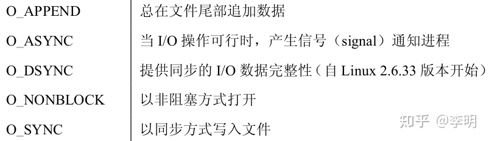

# 6. 信号量的实现和应用

## 6.1. 实验目的

-   加深对进程同步与互斥概念的认识；
-   掌握信号量的使用，并应用它解决生产者——消费者问题；
-   掌握信号量的实现原理。

## 6.2. 实验内容

本次实验的基本内容是：

-   在 `Ubuntu` 下编写程序，用信号量解决生产者——消费者问题；
-   在 `0.11` 中实现信号量，用生产者—消费者程序检验之。
-   用信号量解决生产者—消费者问题

在 `Ubuntu` 上编写应用程序 `pc.c` ，解决经典的生产者—消费者问题，完成下面的功能：

-   建立一个生产者进程， `N` 个消费者进程（ `N>1` ）；
-   用文件建立一个共享缓冲区；
-   生产者进程依次向缓冲区写入整数 `0,1,2,...,M, M>=500` ；
-   消费者进程从缓冲区读数，每次读一个，并将读出的数字从缓冲区删除，然后将本进程 `ID` 和数字输出到标准输出；
-   缓冲区同时最多只能保存 `10` 个数。

一种可能的输出效果是：

```
10: 0
10: 1
10: 2
10: 3
10: 4
11: 5
11: 6
12: 7
10: 8
12: 9
12: 10
12: 11
12: 12
……
11: 498
11: 499
```

其中 `ID` 的顺序会有较大变化，但冒号后的数字一定是从 `0` 开始递增加一的。

`pc.c` 中将会用到 `sem_open()` 、 `sem_close()` 、 `sem_wait()` 和 `sem_post()` 等信号量相关的系统调用，请查阅相关文档。

>   《UNIX环境高级编程》是一本关于 `Unix/Linux` 系统级编程的相当经典的教程。 电子版可在网站上下载，后续实验也用得到。如果你对 `POSIX` 编程感兴趣，建议买一本常备手边。

### 6.2.1. 实现信号量

`Linux` 在 `0.11` 版还没有实现信号量，Linus 把这件富有挑战的工作留给了你。 如果能实现一套山寨版的完全符合 `POSIX` 规范的信号量，无疑是很有成就感的。但时间暂时不允许我们这么做，所以先弄一套缩水版的类 `POSIX` 信号量，它的函数原型和标准并不完全相同，而且只包含如下系统调用：

```c
sem_t *sem_open(const char *name, unsigned int value);
int sem_wait(sem_t *sem);
int sem_post(sem_t *sem);
int sem_unlink(const char *name);
```

`sem_t` 是信号量类型，根据实现的需要自定义。

`sem_open()` 的功能是创建一个信号量，或打开一个已经存在的信号量。

`name` 是信号量的名字。不同的进程可以通过提供同样的 `name` 而共享同一个信号量。如果该信号量不存在，就创建新的名为 `name` 的信号量；如果存在，就打开已经存在的名为 `name` 的信号量。 `value` 是信号量的初值，仅当新建信号量时，此参数才有效，其余情况下它被忽略。 当成功时，返回值是该信号量的唯一标识（比如，在内核的地址、 `ID` 等），由另两个系统调用使用。如失败，返回值是 `NULL` 。 `sem_wait()` 就是信号量的 `P` 原子操作。如果继续运行的条件不满足，则令调用进程等待在信号量 `sem` 上。返回 `0` 表示成功，返回 `-1` 表示失败。

`sem_post()` 就是信号量的 `V` 原子操作。如果有等待 `sem` 的进程，它会唤醒其中的一个。返回 `0` 表示成功，返回 `-1` 表示失败。

`sem_unlink()` 的功能是删除名为 `name` 的信号量。返回 `0` 表示成功，返回 `-1` 表示失败。

在 `kernel` 目录下新建 `sem.c` 文件实现如上功能。然后将 `pc.c` 从 `Ubuntu` 移植到 `0.11` 下，测试自己实现的信号量。

## 6.3. 实验报告

完成实验后，在实验报告中回答如下问题：

-   在 `pc.c` 中去掉所有与信号量有关的代码，再运行程序，执行效果有变化吗？为什么会这样？
-   实验的设计者在第一次编写生产者——消费者程序的时候，是这么做的：

```c
Producer()
{
    P(Mutex);  //互斥信号量
    // 生产一个产品item;
    P(Empty);  //空闲缓存资源
    // 将item放到空闲缓存中;
    V(Full);  //产品资源
    V(Mutex);
}

Consumer()
{
    P(Mutex);
    P(Full);
    // 从缓存区取出一个赋值给item;
    V(Empty);
    // 消费产品item;
    V(Mutex);
}
```

这样可行吗？如果可行，那么它和标准解法在执行效果上会有什么不同？如果不可行，那么它有什么问题使它不可行？

当 Empty=0 ，Producer 阻塞在 `P(Empty)` 而 Consumer 拿不到互斥锁阻塞在 `P(Mutex)` ，造成死锁。

## 6.4 实验过程

### 6.4.0 生产者——消费者问题

系统中有一组生产者进程和一组消费者进程，生产者进程每次生产一个产品放入缓冲区，消费者进程每次从缓冲区中取出一个产品并使用。（注：这里的“产品”理解为某种数据）

生产者、消费者共享一个初始为空、大小为n的缓冲区。

只有缓冲区没满时，生产者才能把产品放入缓冲区，否则必须等待。

只有缓冲区不空时，消费者才能从中取出产品，否则必须等待。

缓冲区是临界资源，各进程必须互斥地访问。

**信号量：**

```c
semaphore mutex = 1; // 互斥信号量，实现对缓冲区的互斥访问
semaphore empty = n; // 同步信号量，表示空闲缓冲区的数量
semaphore full = 0; // 同步信号量，表示产品的数量，即非空缓冲区的数量
```

**生产者：**

```c
producer() {
	while(1) {
		生产一个产品;
		P(empty);
		P(mutex);
		把产品放入缓冲区;
		V(mutex);
		V(full);
	}
}
```

**消费者：**

```c
consumer() {
	while(1) {
		P(full);
		P(mutex);
		从缓冲区取出一个产品;
		V(mutex);
		V(empty);
		使用产品;
	}
}
```

**注意P操作的顺序：**实现互斥的P操作一定要在实现同步的P操作之后，否则可能引发“死锁”。

>   参考 `linux-0.11` 锁的实现，我们可以用开关中断的方式实现原子操作，而调用 `sleep_on()` 和 `wake_up()` 进行进程的睡眠和唤醒。

### 6.4.1 信号量作用

-   `mutex` 是保证互斥访问缓存池
-   `empty` 是缓冲池里空位的剩余个数，即空缓冲区数，初始值为n
-   `full` 是用来记录当前缓冲池中已经占用的缓冲区个数,初始值为0

>   在用户程序中想要使用内核态中的系统调用命令，需要在用户态执行对系统调用命令的调用

通过宏展开：

```c
_syscall2(sem_t*,sem_open,const char *,name,unsigned int,value);
_syscall1(int,sem_wait,sem_t*,sem);
_syscall1(int,sem_post,sem_t*,sem);
_syscall1(int,sem_unlink,const char *,name);
```

其中 `_syscall1` 是一个宏，是在 `include/unistd.h` 中定义的：

```c
#define _syscall1(type,name,atype,a) \
type name(atype a) \
{ \
long __res; \
__asm__ volatile ("int $0x80" \
	: "=a" (__res) \
	: "0" (__NR_##name),"b" ((long)(a))); \
if (__res >= 0) \
	return (type) __res; \
errno = -__res; \
return -1; \
}
```

将 `_syscall1(int,sem_wait,sem_t*,sem);` 进行宏展开，可以得到

```c
int sem_wait(sem_t* a)
{
    long __res;
    __asm__ volatile ("int $0x80"
        : "=a" (__res)
        : "0" (__NR_##sem_wait),"b" ((long)(a)));
    if (__res >= 0)
        return (int) __res;
    errno = -__res;
    return -1;
}
```

由此通过著名的 `int 0x80` 中断进入内核态

### 6.4.2 补充内容

参考知乎[博主](https://zhuanlan.zhihu.com/p/408853088)

#### 1 打开关闭文件

```cpp
#include <fcntl.h>
#include <sys/stat.h>
#include <unistd.h>
// __path 代表文件路径名， __oflag 代表打开方式， mode 代表创建文件的权限
// 返回值为文件描述符序号，若打开文件出错，则返回-1，具体出错原因可以通过全局变量errno确认。
int open (const char *__path, int __oflag, .../*mode_t mode*/);
int close(int fd);
// 以读写方式打开或创建“myfile”文件，打开时会清空文件内容。
// 若创建文件，则文件权限为文件拥有者可以读写。
int fd = open("myfile",O_RDWR|O_CREAT|O_TRUNC,S_IRUSR|S_IWSR);
// 关闭myfile 文件描述符
if(close(fd)==-1) errExit("close");
```

**打开方式 __oflag 包括了如下三组标志：**

-   **文件访问模式标志**


-   **文件创建标志**


-   **已打开文件的状态标志**



**mode 指定了当需要创建文件时，文件的访问权限：**


#### 2 读写文件

```cpp
#include <unistd.h>
// fd 代表文件描述符序号，buffer 代表用户空间缓冲空间，count代表读或写的字节数。
// 返回值为实际读取的字节，如果出现错误则返回-1
ssize_t read(int fd, void *buffer, size_t count);
ssize_t write(int fd, void *buffer, size_t count);
// 从标准输入设备读入字符，写入“myfile”中
#define BUF_SIZE = 256;
char buffer[BUF_SIZE];
if(read(STDIN_FILENO,buffer,MAX_READ)==-1) 
   errExit("read failed"); // tlpi 库函数
int outfd = open("myfile",O_WRONLY|O_CREAT|O_APPEND,S_IRUSR|S_IWUSR);
if(write(outfd,buffer,numRead)==-1){errExit("write failed");}
```

#### 3 文件偏移量

```cpp
#include <unistd.h>
// 每个打开的普通文件都有一个内核级的文件偏移量，代表执行下一个读写操作的起始位置。
// fd 代表指定文件，offset 代表偏移量，whence 偏移的参照基点
// 基点可以取以下三个值：SEEK_SET 文件头部，SEEK_CUR 当前文件偏移量，SEEK_END 文件尾部。
off_t lseek(int fd, off_t offset, int whence);
// 文件头部
lseek(fd,0,SEEK_SET);
// 最后一个字节
lseek(fd,-1,SEEK_END);
// 当前位置向前数第十个字节
lseek(fd,-10,SEEK_CUR);
```

### 6.4.3 用户程序 `pc.c`

```c
#define __LIBRARY__
#include <unistd.h>
#include <linux/sem.h>
#include <sys/types.h>
#include <fcntl.h>
#include <stdio.h>
#include <stdlib.h>

_syscall2(sem_t *, sem_open, const char *, name, unsigned int, value);
_syscall1(int, sem_wait, sem_t *, sem);
_syscall1(int, sem_post, sem_t *, sem);
_syscall1(int, sem_unlink, const char *, name);

#define NUMBER 520 /* 打出数字总数 */
#define CUSTOMERS 5 /* 消费者进程数 */
#define BUFSIZE 10 /* 缓冲区大小 */

sem_t *empty, *full, *mutex;
int fd; /* 文件描述符 */

int main()
{
    int i, j, k;
    int  data;
    pid_t p;
    int buf_out = 0; /* 从缓冲区读取上次读取后记录的位置 */
    int buf_in = 0; /* 写入缓冲区的位置 */

    /* 打开信号量 */
    if ( (mutex = sem_open("carmutex", 1)) == SEM_FAILED ) {
        perror("sem_open(mutex) error!\n");
        return -1;
    }
    if ( (empty = sem_open("carempty", BUFSIZE)) == SEM_FAILED ) {
        perror("sem_open(empty) error!\n");
        return -1;
    }
    if ( (full = sem_open("carfull", 0)) == SEM_FAILED ) {
        perror("sem_open(full) error!\n");
        return -1; 
    }

    fd = open("buffer.dat", O_CREAT | O_RDWR | O_TRUNC, 0666);
    /* 将读取指针移动到缓冲区的大小 10*4 个字节之后 */
    lseek(fd, BUFSIZE * sizeof(int), SEEK_SET);
    /* 写入 buf_out 记录下次读取的起始位置 */
    write(fd, (char *)&buf_out, sizeof(int));

    /* 生产者进程 */
    if ( (p = fork()) == 0 ) {
        /* 只有一个生产者，需要在 BUF 的空间中循环生成 NUMBER 个 */
        for (i = 0; i < NUMBER; i++) {
            sem_wait(empty);
            sem_wait(mutex);
            /* 写入一个字符 */
            lseek(fd, buf_in * sizeof(int), SEEK_SET);
            write(fd, (char *)&i, sizeof(int));
            /* 生产资源 */
            printf("pid=%d(producer):\t %d\n", getpid(), i);
            fflush(stdout); 
            buf_in = (buf_in + 1) % BUFSIZE;

            sem_post(mutex);
            sem_post(full);
        }
        return 0;
    } else if (p < 0) {
        perror("Fail to fork!\n");
        return -1;
    }
    
    /* 消费者进程 */
    for (j = 0; j < CUSTOMERS; j++) {
        if ( (p = fork()) == 0 ) {
            int avg_num = NUMBER / CUSTOMERS;
            for (k = 0; k < avg_num; k++) {
                sem_wait(full);
                sem_wait(mutex);
                /* 去 BUF 后的第一个位置，获得读取位置 */
                lseek(fd, BUFSIZE * sizeof(int), SEEK_SET);
                read(fd, (char *)&buf_out, sizeof(int));

                /* 读取数据 */
                lseek(fd, buf_out * sizeof(int), SEEK_SET);
                read(fd, (char *)&data, sizeof(int));

                /* 更新并写入读取位置 */
                buf_out = (buf_out + 1) % BUFSIZE;
                lseek(fd, BUFSIZE * sizeof(int), SEEK_SET);
                write(fd, (char *)&buf_out, sizeof(int));

                /* 消费资源 */
                printf("pid=%d(customer):\t %d\n", getpid(), data);
                fflush(stdout); /* 将输出强制写到终端，保持各个进程数据同步 */

                sem_post(mutex);
                sem_post(empty);
            }
            return 0;
        } else if (p < 0) {
            perror("Fail to fork!\n");
            return -1;
        }
    }

    wait(NULL);
    /* 释放信号量 */
    sem_unlink("carfull");
    sem_unlink("carempty");
    sem_unlink("carmutex");
    /* 释放资源 */
    close(fd);

    return 0;
}
```


### 6.4.4 修改内核

#### 1)编写 `sem.h`

文件位置：`oslab/linux-0.11/include/linux`

```c
#ifndef _SEM_H
#define _SEM_H

#include <linux/sched.h>

#define QUE_LEN 16
#define SEM_FAILED  (void*) 0

struct semaphore_queue {
	int front;
	int rear;
	struct task_struct *wait_tasks[QUE_LEN];
};
typedef struct semaphore_queue sem_queue;

struct semaphore_t {
    int value;
    int occupied;
    char name[16];
    struct semaphore_queue wait_queue;
};
typedef struct semaphore_t sem_t;

#endif
```


#### 2)编写 `sem.c`

文件位置：`oslab/linux-0.11/kernel`

```c
#define __LIBRARY__
#include <sem.h>
#include <unistd.h>
#include <linux/sched.h>
#include <linux/kernel.h>
#include <asm/segment.h>
#include <asm/system.h>

#define SEM_COUNT 32
sem_t semaphores[SEM_COUNT];
/* 队列相关操作，rear始终是下一个待写入的位置，front始终是队列第一个元素 */
void init_queue(sem_queue *q)
{
    q->front = q->rear = 0;
}

int is_empty(sem_queue *q)
{
    return q->front == q->rear ? 1 : 0;
}

/* 留下标 QUE_LEN - 1 不用，判断是否满 */
int is_full(sem_queue *q)
{
    return (q->rear + 1) % QUE_LEN == q->front ? 1 : 0;
}

/* 获得队列头第一个任务 */
struct task_struct *get_task(sem_queue *q)
{
    if (is_empty(q)) {
        printk("Queue is empty!\n");
        return NULL;
    }
    struct task_struct *tmp = q->wait_tasks[q->front];
    q->front = (q->front + 1) % QUE_LEN;
    return tmp;
}

/* 任务插入队列尾部 */
int insert_task(struct task_struct *p, sem_queue *q)
{
    if (is_full(q)) {
        printk("Queue is full!\n");
        return -1;
    }
    q->wait_tasks[q->rear] = p;
    q->rear = (q->rear + 1) % QUE_LEN;
    return 1;
}

/* 判断信号量是否已打开，返回其位置 */
int sem_location(const char *name)
{
    int i;
    for (i = 0; i < SEM_COUNT; i++) {
        if (strcmp(name, semaphores[i].name) == 0 && semaphores[i].occupied == 1) {
            return i;
        }
    }
    return -1;
}

/* 打开信号量 */
sem_t *sys_sem_open(const char* name, unsigned int value)
{
    char tmp[16];
    char c;
    int i;
    for (i = 0; i < QUE_LEN; i++) {
        c = get_fs_byte(name + i);
        tmp[i] = c;
        if (c == '\0') break;
    }
    if (c >= 16) {
        printk("Semaphore name is too long!");
        return NULL;
    }
    /* 找到了信号量直接返回对应位置 */
    if ((i = sem_location(tmp)) != -1) {
        return &semaphores[i];
    }
    /* 没找到则将该新信号量记录下来 */
    for (i = 0; i < SEM_COUNT; i++) {
        if (!semaphores[i].occupied) {
            strcpy(semaphores[i].name, tmp);
            semaphores[i].occupied = 1;
            semaphores[i].value = value;
            init_queue(&(semaphores[i].wait_queue));
            
            return &semaphores[i];
        }
    }

    printk("Numbers of semaphores are limited!\n");
    return NULL;
}

/* P原子操作 */
int sys_sem_wait(sem_t *sem)
{
    cli();
    while (sem->value <= 0) {
        /* 参见 sleep_on() */
		current->state = TASK_UNINTERRUPTIBLE;
		insert_task(current,&(sem->wait_queue));
		schedule();
    }
    sem->value--;
    sti();
    return 0;
}

/* V原子操作 */
int sys_sem_post(sem_t *sem)
{
    cli();
    struct task_struct *p;
    sem->value++;
    if (sem->value <= 0) {
        p = get_task(&(sem->wait_queue));
        if (p != NULL) {
            (*p).state = TASK_RUNNING;
        }
    }
    sti();
    return 0;
}

/* 释放信号量 */
int sys_sem_unlink(const char *name)
{
    char tmp[16];
    char c;
    int i;
    for (i = 0; i < 16; i++) {
        c = get_fs_byte(name + i);
        tmp[i] = c;
        if (c == '\0') break;
    }
    if (c >= 16) {
        printk("Semphore name is too long!");
        return -1;
    }
    int ret = 0;
    ret = sem_location(tmp);
    if (ret != -1) {
        semaphores[ret].value = 0;
        strcpy(semaphores[ret].name, "\0");
        semaphores[ret].occupied = 0;
        return 0;
    }
    return -1;
}
```


#### 3)添加系统调用号

文件位置：`oslab/linux-0.11/include/unistd.h`

```c
...
#define __NR_setregid	71
#define __NR_sem_open 	72
#define __NR_sem_wait	73
#define __NR_sem_post	74
#define __NR_sem_unlink 75
```


#### 4)改写系统调用数

文件位置：`oslab/linux-0.11/kernel/system_call.s`

```c
...
nr_system_calls = 76
...
```


#### 5)添加系统调用的定义

文件位置：`oslab/linux-0.11/include/linux/sys.h`

```c
...
extern int sys_setregid();

extern int sys_sem_open();
extern int sys_sem_wait();
extern int sys_sem_post();
extern int sys_sem_unlink();

fn_ptr sys_call_table[] = { sys_setup, sys_exit, sys_fork, sys_read,
...
sys_setregid,sys_sem_open,sys_sem_wait,sys_sem_post,sys_sem_unlink };

```


#### 6)修改工程文件的编译规则

文件位置：`oslab/linux-0.11/kernel/Makefile`

```Makefile
...
OBJS  = sched.o system_call.o traps.o asm.o fork.o \
	panic.o printk.o vsprintf.o sys.o exit.o \
	signal.o mktime.o sem.o
...
sem.s sem.o: sem.c ../include/linux/kernel.h ../include/unistd.h \
  ../include/linux/sem.h ../include/linux/sched.h
exit.s exit.o: exit.c ../include/errno.h ../include/signal.h \
...
```


### 6.4.5 运行程序

*   编译程序

```
make all
```


*   挂载文件

```bash
sudo ./mount-hdc 
cp ./linux-0.11/include/unistd.h ./hdc/usr/include/
cp ./linux-0.11/include/linux/sem.h ./hdc/usr/include/linux/
cp ./test6/pc.c ./hdc/usr/root/
sudo umount hdc/
```

*   测试

启动新编译的 linux-0.11 内核，用 `pc.c` 测试实现的信号量

```bash
gcc -o mypc pc.c
./mypc > fqy.txt
sync
```

关闭 linux-0.11 后，将结果拷贝到主机查看：

```
sudo ./mount-hdc 
sudo cp hdc/usr/root/fqy.txt ./test6/
sudo umount hdc/
```

可以看到开始和过程中的生产消费过程都是正确合理的

 

但是可以看到最后并没有按照要求产生了 520 个产品：

 

经过尝试，即便是将生产数量减少到 400、300 也还是会有缺失，应该是信号量写的有问题，等复习好了参考下面的学长再试试。

## 参考

这位学长对信号量的解释很详细，而且实验结果看上去也没有问题。复习完如果有时间回来修正一下答案。

https://github.com/Wangzhike/HIT-Linux-0.11/tree/master/5-semaphore
