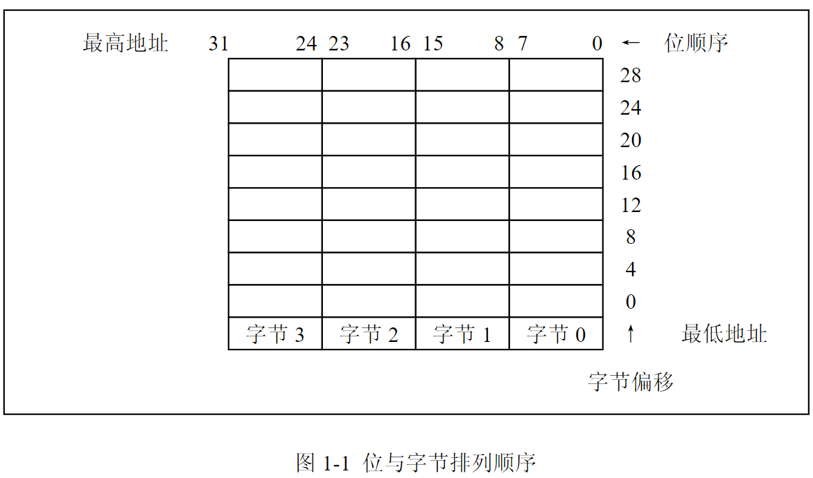
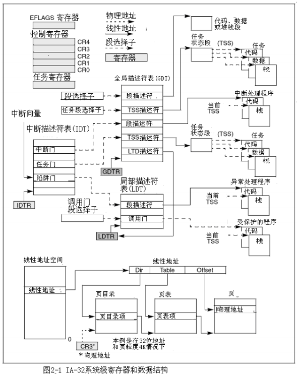
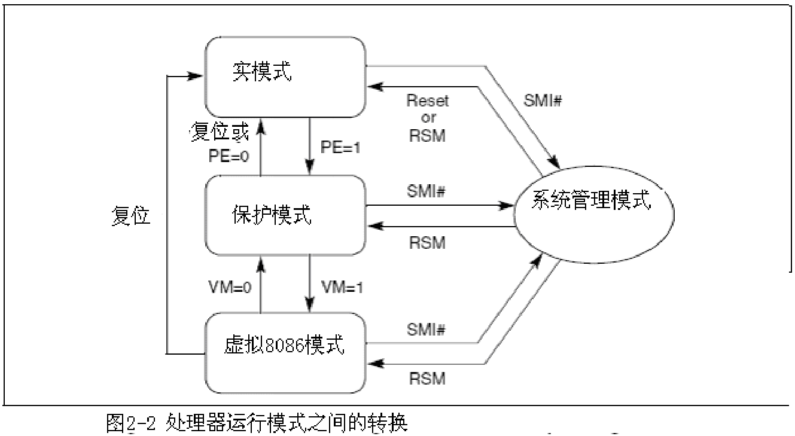
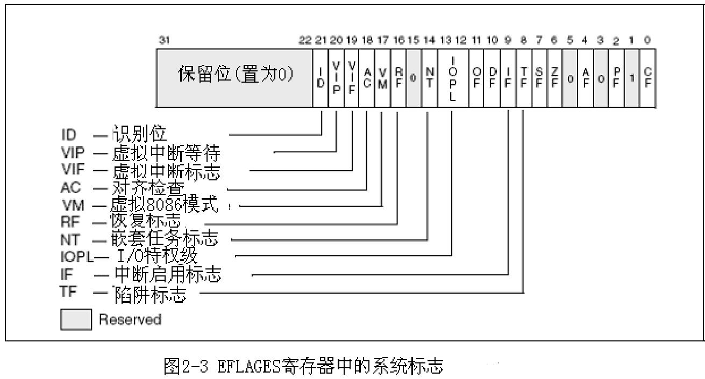
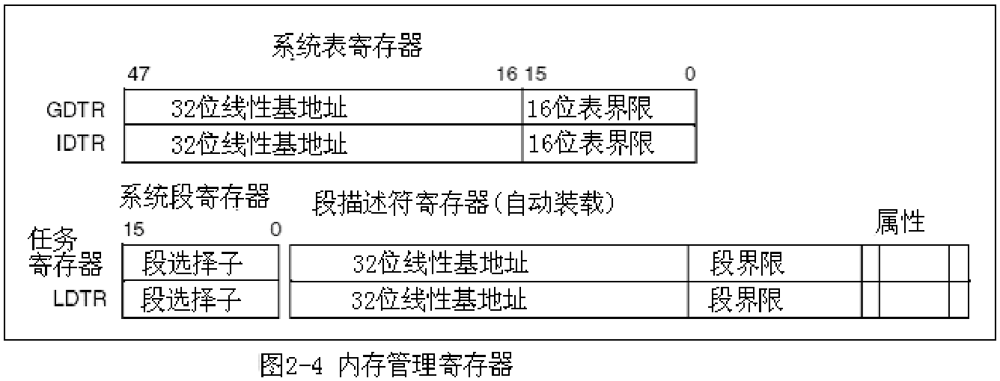
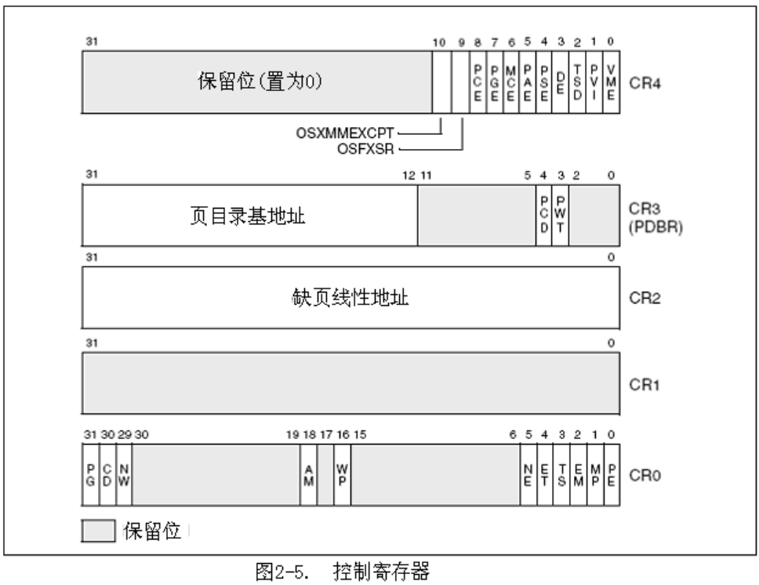
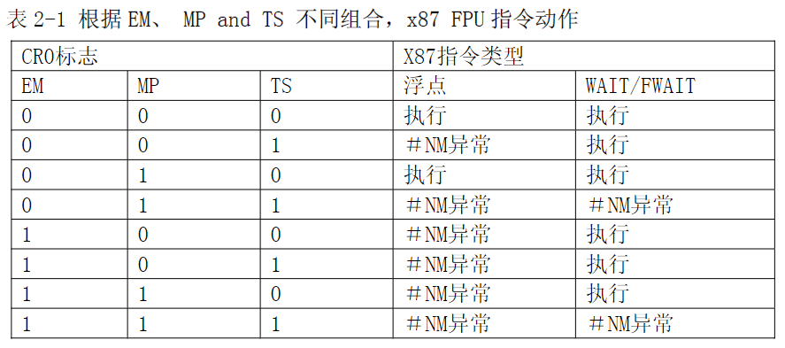
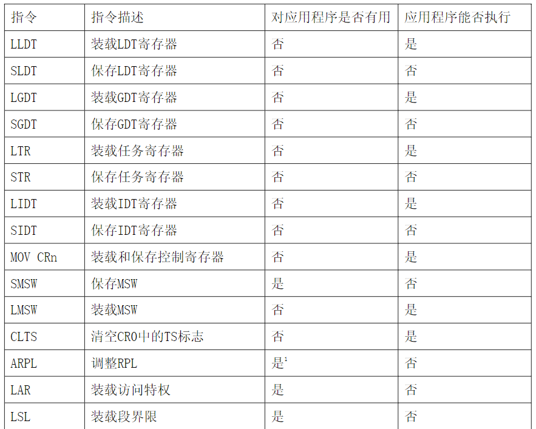
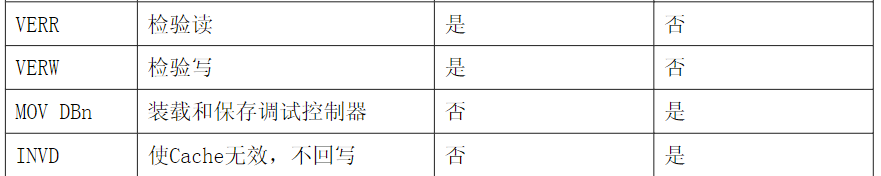
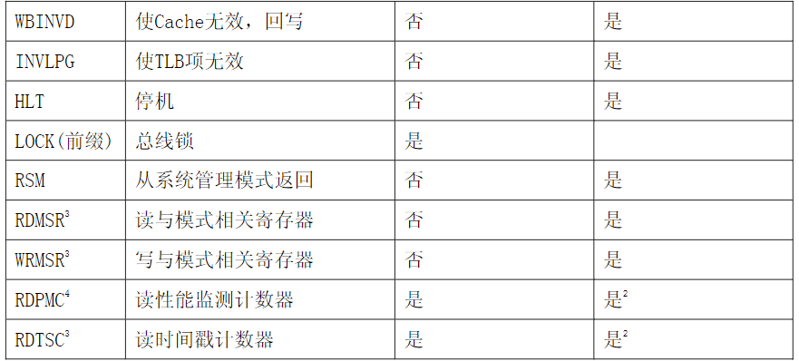

# 0. 前言

## 三卷分别对应的内容

三卷描述了IA-32 intel所有处理器的架构与开发环境。

*   卷1 **基本架构** 描述了IA-32的基本架构与开发环境。
*   卷2 **指令集参考** 描述了处理器的指令集和操作码结构。

这两卷是针对在操作系统下开发的应用开发人员。

*   卷3 **系统编程指南** 描述了 IA-32 处理器对操作系统的支持，包括内存管理、保护、任务管理、中断和异常处理和系统管理模式。它也提供了关于IA-32处理器兼容的资料。

这一卷是针对操作系统与BIOS的设计人员和开发人员的。

<font color=red size=4>本阅读笔记内容仅包含卷三</font>

## 符号惯例

本手册对数据结构格式使用了特定的符号，对于指令的助记符，十六进制和二进制数字的表示也是如此，了解这些惯例就很容易阅读本手册。

### 1) 位和字节顺序

在内存数据结构的示意图中，低地址部分位于图的底部，地址朝上增大。位的位置是从右至左进行排列的。一个给定位所代表的数值等于2的这个位的位置的幂。IA-32处理器是“小结尾”(little-endian)，这意味着一个字(共两个字节)的字节是从最低位开始的，图1-1说明这种惯例：



### 2) 保留位与软件兼容

在许多寄存器和内存布局描述中，某些位标记为“保留”(Reserved)，当有位标记为“保留”时，说明这些位是为将来处理器兼容而设的，软件在处理这些位时，要好比它将来要有某个值，虽然现在还不知道。修改保留位的后果并不能仅仅认为是未定义的，而是不可预测的。软件在涉及保留位时，应该遵守以下规定

*   在测试寄存器是否包含某些位时，不要依赖于任何保留位，在测试之前应该把这些位屏蔽掉
*   当保存到内存或者保存到寄存器时，不要依赖于任何保留位
*   不要依赖于保留位保存信息的能力
*   当装载一个寄存器时，文档中如果对保留位的值有要求，就一定要装载这些值，或者就重新装载以前从同一寄存器读出的值

>   注意：
>
>   要避免软件依赖于IA-32中的保留位的状态，依赖于保留位将会导致软件就相当于依赖了一种不可预测的方式，这是由处理器处理这些位时的方式决定的。那些依赖于保留位的软件有可能与将来的处理器不兼容。

### 3) 指令操作数

当用字符来代表指令时，使用了 IA-32 汇编语言的一个子集，在这个子集中指令遵循以下格式：

```
标签(label)：助记参数 1、参数 2、参数 3
```

*   标签(label)是标识符，后面紧跟着一个冒号
*   助记符是与指令有着相同功能的保留字
*   参数 1、参数 2、参数 3 是可选的，根指令的不同可能有 0-3 个参数，有参数时，它或采用文字或采用标识符来代表数据项。参数标识符或是寄存器保留字或是其它程序中声明的被赋值的数据项（本例中没有这部分说明）。

当算术或逻辑指令有两个操作数时，右边的操作数是源操作数，左边的是目的操作数。

>   例如：
>   `LOADREG: MOV EAX、SUBTOTAL`
>   在本例中 LOADREG 是一个标签，MOV 是指令助记符，EAX 是目的操作数，SUBTOTAL 是源操作数

### 4) 十六进制和二进制数

基16数字(十六进制)是用十六进制数字表示的，后面跟有一个字母 H（比如F82EH）

基2数字(二进制)是用1和0的数字串来表示的，有时后面跟有一个字母 B（比如 1010B），这个“B”只在可能会引起混淆的情况下使用。

### 5) 分段寻址

处理器是按字节编址的，这意味着内存是按照着字节顺序进行组织和访问的，在访问一个或多个字节时，用字节地址进行定位它（们）在内存中的位置，内存可以被访问的范围就叫作寻址空间。
处理器也支持分段寻址。这种寻址方式是指程序可以有多个独立的寻址空间，叫作段，比如一个程序可以把它的指令和堆栈分别保存在独立的段中。代码地址总是指向代码段，堆栈地址总是指向栈空间。当访问段中的地址中，采用下面的方式：

`段寄存器：字节地址`

>   例如：下面的段地址代表 DS 寄存器指向的段中的 FF79H 地址
>   `DS:FF79H`
>   下面段地址代表代码段中的代码地址。CS 寄存器指向代码段，EIP 寄存器包含着指令地址。
>   `CS:EIP`

### 6) 异常

异常通常是指由指令引起的错误事件，例如除0就会引起一个异常。然而有些异常，比如断点，在其它条件下出现。有些类型的异常可能会有错误代码，该代码包含了关于这个错误的额外信息。下面是一个异常和错误代码的表示方法：
`#PF(错误代码)`
这个例子是一个缺页异常，这时的错误代码叫做错误类型。在某些条件下，产生错误代码的异常可能不会提供准确的代码，在这种情况下，错误代码就是0，就像下面的通用保护异常
`#GP(0)`

# 1. x86系统架构概览

IA-32架构（从 Intel386 处理器系列开始）为操作系统提供了广泛的支持。这些支持是IA-32系统级架构的一部分，包括下面的几个部分：

*   内存管理
*   软件模块保护
*   多任务
*   异常和中断处理
*   多处理器技术
*   高速缓存管理
*   硬件资源和电源管理
*   调试和性能监测

## 1.1 系统级体系结构概览

IA-32 系统级架构是由寄存器、数据结构和指令组成，这些指令是用来支持系统级操作的，比如内存管理、中断处理、任务管理和多处理器控制(多处理器技术)。图 2.1 给出了一个系统寄存器和数据结构的概况。

 

### 1.1.1 Global and Local Descriptor Tables（全局和局部描述符表)

在保护模式下操作时，所有的内存访问要么通过全局描述符表(GDT)要么通过局部(可选)描述符表(LDT)，如图 2-1 所示。在这些描述符表里是段描述符，段描述符里包含了段的基地址、访问特权、类型和用法信息。每个段描述符都有一个与之相关的段选择符。段选择符包含了 GDT 或 LDT(与它相关的段描述符)里的一个索引、一个全局/局部标志(决定段选择符是指向 GDT 还是指向 LDT)和访问特权等信息。 **要想访问段中的内容，必须同时提供段选择符和偏移地址，段选择符为段(在 GDT 或者 LDT 中)的描述符提供了一个访问途径。** 对于段描述符，处理器包含了线性地址空间里的基地址，偏移量确定了相对于基地址的字节地址。如果在处理器运行的当前特权级(CPL-Current Privilege Level)上可以访问段的话(CPL 被定义为当前执行代码段的保护级)，那么就可以通过这种机制来访问在 GDT 或 LDT中的各种合法代码、数据或者堆栈段。

>   在图 2-1 中实心箭头代表线性地址，虚线箭头代表段选择符，点划线箭头代表物理地址。

为了便于描述，许多段选择符被简化成直接指向段。然而实际上从段选择符到相应的段都是通过 GDT 或者 LDT。GDT 的线性地址是在 GDT 寄存器中(GDTR)，LDT 线性地址是在 LDT 寄存器中(LDTR)。

### 1.1.2 System Segments, Segment Descriptors, and Gates（系统段，段描述符和门）

除了代码、数据和堆栈段是构成程序运行环境之外，系统架构还定义了两个系统段：任务状态段(TSS)和LDT。(GDT不被看作段因为它不能通过段选择符和段描述符访问)。这些段类型都有一个专门为它们定义的描述符。

系统架构也定义了一套称为门的描述符(调用门、中断门、陷阱门和任务门)，这些门提供了一种访问运行在不同于应用程序特权级的系统过程和处理程序的方法。例如一个对调用门的调用可以访问与当前代码段特权相同或者数字更低(特权更高)的代码段中的过程。通过调用门访问，调用程序必须提供调用门的选择符。执行访问特权检查的处理器比较调用门的特权和调用门指向的目的代码的 CPL。如果允许访问，处理器从调用门得到目标代码段的选择符和偏移地址。如果调用需要进行特权级的改变，处理器也切换到那个级别的堆栈(新堆栈的段选择符是通过当前运行任务的 TSS 获得的)。调用门也使得 16 位和 32 位之间的转换变得更加容易，反之亦然。

### 1.1.3 Task-State Segments and Task Gates（任务状态段和任务门）

TSS(如图 2-1)定义了任务执行环境的状态。这些状态包括通用寄存器、段寄存器、EFLAGS寄存器、EIP 寄存器和段选择符以及三个堆栈段(特权 0、1、2 各一个堆栈)的指针的状态。它也包括了与任务相应的 LDT 的选择符和页表的基地址。

所有运行在保护模式下程序，都是一个称作当前任务的上下文中进行的。当前任务的 TSS 的段选择符保存在任务寄存器中。切换到一个任务的最简单的方法是进行 CALL 或 JMP 到那个任务中。新任务的 TSS 的段选择符是通过 CALL 或 JMP 指令给出。在进行任务切换时，处理器按照下面的次序进行：

	1. 保存当前 TSS 中当前任务的状态
	1. 装载新任务段选择符的任务寄存器
	1. 通过 GDT 中段选择符访问新的 TSS
	1. 将新 TSS 中新任务的状态装载到通用寄存器、段寄存器、LDTR、控制寄存器 CR3(页表基地址)、EFLAGS 寄存器和 EIP 寄存器
	1. 开始执行新任务

任务也可以通过任务门访，任务门与调用门很相似，除了它是提供(通过选择符)对 TSS 而不是对代码段的访问。

### 1.1.4 Interrupt and Exception Handling（中断和异常处理）

外部中断、软件中断和异常是通过中断描述符表(IDT)处理的，如图2-1。IDT包含了访问中断和异常处理程序的门描述表的集合。像GDT一样，IDT不是一个段，IDT的线性基地址包含在IDT寄存器中(IDTR)。IDT中的门描述符包括有中断-、陷阱-、或任务门类型。在运行中断或异常处理程序时，处理器必须先从内部硬件、外部中断控制器、或通过执行INT，INTO，INT 3或BOUND指令的软件中断中接到一个中断向量(中断数字)。中断向量包含了IDT中的门描述符的索引。如果选中的门描述符是一个中断门或者陷阱门，相应的处理程序是通过非常类似于通过调用门调用过程了。如果描述符是一个任务门，处理程序是通过任务切换进行的。

### 1.1.5 Memory Management（内存管理）

系统架构支持直接物理地址内存或者虚拟内存（通过分页）。当用直接物理地址时，线性地址就是物理地址，当使用分页时，所有代码、堆栈、系统段、GDT、IDT都可以将最近访问过页驻留在内存中而进行分页。页（在IA-32架构有时被称作页框）在物理内存中的位置保存在两个类型的系统数据结构中（页目录和页表），这两个数据结构都保存物理内存中（如图2－1）。页目录包含有页表的物理地址、访问特权、内存管理信息，页表中包含有页框的物理地址、访问特权和内存管理信息。页目录的基地址保存在控制寄存器CR3中。为使用分页机制，一个线性地址被分为三个部分：页目录、页表和页框中的偏移量。一个系统可以有一个或者多个页目录，比如每个任务都可以有自己的页目录。

### 1.1.6 System Registers（系统寄存器）

为了有助于初使化处理器及控制系统的运行，架构在EFLAGES寄存器内提供了系统标志和几个系统寄存器：

*   EFLAGES寄存器内的系统标志和IOPL域，控制着任务和模式切换、中断处理、指令跟踪和访问特权。
*   控制寄存器（CR0、CR2、CR4）包含了若干标志和数据域用于控制系统级的操作。这些寄存器内的其它标志指明了操作系统对处理器的兼容。
*   调试寄存器（图2-1内没有列出）允许在调试软件和系统软件内设置断点。
*   GDTR、LDTR和IDTR寄存器内包含了各个表的线性地址和尺寸（界限）。
*   任务寄存器包含了当前任务的TSS的线性地址和界限。
*   模式相关的寄存器（图2-1内没有列出）

模式相关寄存器（MSRs）是一组主要用于操作系统的寄存器（也就是代码运行在0级特权下）。这些寄存器控制着如调试扩展、性能监测计数器、机器检测架构和内存类型范围（MTRRs）这些寄存器的个数和功能，在IA-32架构系列的处理器中的各处理器各有不同。

大多数的系统都限制应用程序访问所有的系统寄存器（而不是 EFLAGES 寄存器）。然而系统也可以设计成所有程序均运行在最高特权（0 级）上，在这种情况下应用程序可以修改所有系统寄存器。

### 1.1.7 其他系统资源

除了前几节介绍的系统寄存器和数据结构，系统架构还提供了下面的资源：

*   操作系统指令
*   性能监测计数器（图2-1没有列出）
*   内部高速缓存和缓冲区（图2-1没有列出）

性能监测计数器是事件计数器，它可以编程用来记录诸如指令解码个数、接收的中断个数或者高速缓存装载次数等。处理器提供几个内部高速缓存和缓冲区，这些高速缓存用来保存数据和指令，缓冲区用来保存比如解码的系统地址和应用程序段以及等待的写操作等。

## 1.2 实模式和保护模式转换

<font color=blue size=4>保护模式</font> 保护模式是处理器的原生模式，在该模式下，涵盖了处理器所有的特点和指令，有着最好的性能。对所有新应用程序和操作系统推荐使用该模式。

<font color=blue size=4>实模式</font> 这个模式提供了intel8086的编程模式和一些扩展（比如切换到保护模式或系统管理模式）

<font color=blue size=4>系统管理模式（SMM）</font> 在所有的IA-32体系中是一个标准的架构特征，它首先在intel 386SL处理器中出现。这种模式为操作系统实现电源和OEM专有特征提供的一种透明的机制。SMM模式是通过激活外部系统中断针（SMI＃）而进入的，激活产生了一个系统中断（SMI）。

<font color=blue size=4>虚拟 8086 模式</font> 在保护模式中，处理器提供了一种准模式叫作虚拟 8086 模式。这种模式允许在多任务的保护模式下处理执行 8086 程序。



处理器在上电或重启后自动进入到实模式，控制寄存器 CR0 中的 PE 标志控制着处理是在实模式下还是在保护模式下。EFLAGES 寄存器中的 VM 标志决定了处理器是在保护模式下还是在虚拟 8086 模式下，保护模式和虚拟 8086 模式之间的切换是作为任务切换或从中断和异常处理程序返回的一部分。

不论处理器是处在实模式还是处在保护模式、虚拟 8086 模式下，只要接收到 SMI 它就切换到 SMM 模式，执行完 RSM 指令，处理器再返回进入 SMI 模式之前的模式。

## 1.3 80x86系统指令寄存器

### 1.3.1 EFLAGES寄存器中的系统标志和域

EFLAGES中的系统标志和IOPL域用于控制I/O、可屏蔽硬件中断、调试、任务切换和虚拟8086模式（见图2-3）。只有特权代码（通常是操作系统代码）可以修改这些位，系统标志和IOPL的作用如下：



*   <font color=green size=4>TF</font> 

    陷阱（第8位）置1是调试状态下的单步执行，置0是禁用单步执行。在单步执行模式下处理器在每条指令后产生一个调试异常，这样在每条指令执行后都可以查看执行程序的状态。如果程序用POPF、POPFD或者IRET指令修改TF标志，那么调试异常就在执行POPF、POPFD或者IRET指令后产生。

*   <font color=green size=4>IF</font>

    中断允许（位9）控制着处理器对可屏蔽硬件中断请求的响应。置1是响应可屏蔽硬件中断，置0为禁止响应可屏蔽硬件中断，IF标志并不影响异常和不可屏蔽中断（NMI）的产生。控制寄存器CR4中的CPL、IOPL和VME标志决定着IF标志是可否可以由指令CLI、STTI、POPF、POPFD和IRET修改。

*   <font color=green size=4>IOPL</font>

    I/O特权域（位12和位13）指出当前程序或任务的I/O特权级别。当前程序或任务的CPL必须小于或等于IOPL才可以访问I/O地址空间。当运行在0级特权时，该域只能由的POPF和IRET指令修改。卷1里有对IOPL和I/O操作之间的关系详细的介绍。当虚拟模式扩展起作用时（控制寄存器CR4中的VME置位时），IOPL也是控制IF标志的修改以及控制虚拟8086模式下中断的处理方式的机制之一。

*   <font color=green size=4>NT</font>

    嵌套任务（位14）控制被中断和被调用的任务的链接。处理器在调用一个由CALL指令、中断或者异常触发的任务时设置该位。当任务因调用IRET指令而返回时，处理器检测并修改该位。该标志可以由POPF/POPFD指令直接置位或清零，然而在应用程序中修改该标志的状态会产生不可预料的异常。

*   <font color=green size=4>RF</font>

    恢复（位16）控制着处理器对断点指令条件的响应。当置1时，该标志可以临时禁用由于指令断点而产生调试异常（＃DE），但是其它的异常条件仍可以产生异常。置0时指令断点产生调试异常。

    RF标志的主要功能是重新执行由指令断点而引发的调试异常后面的指令。调试器软件必须在程序调用IRET指令返回之前，将栈中的EFLAGES映象该位置为1，以阻止指令断点产生另外的调试异常。在返回到已成功执行的指令之后，处理器会自动地将该位清零，从而可以继续产生指令断点。

*   <font color=green size=4>VM</font>

    虚拟8086模式（位17）置1进入虚拟8086模式，置0返回保护模式。

*   <font color=green size=4>AC</font>

    对齐检查（位18）。将该位置1的同时，将控制寄存器中CR0中的AM标志置1就启用了对内存引用的对齐检查。将AC标志和/或AM标志清零就禁用了对齐检查。当引用一个没有对齐的操作数时，将会产生一个对齐检查的异常，比如在奇地址引用一个字地址或在不是4的倍数的地址引用一个双字地址。对齐检查异常只在用户模式（3级特权）下产生。默认特权为0的内存引用，比如段描述表的装载，并不产生这个异常，虽然它在用户模式会产生。对齐检查异常可以用于检查数据的对齐，这对于当和其它处理器交换数据时是有用的，交换数据需要所有数据对齐。对齐检查异常也可以被解释程序用来将某些指针标记不对齐从而成为特殊指针，这样就减轻了对每个指针进行对齐检查的负担，只要对使用的特殊指针进行就可以了。

*   <font color=green size=4>VIF</font>

    虚拟中断（位 19）包含了一个 IF 标志的虚拟映象。这个标志是和 VIP 标志一起使用的。当控制寄存器 CR4 中的 VME 或者 PVI 标志置为 1 且 IOPL 小于 3 时，处理器只识别 VIF 标志（VME 标志用来启用虚拟 8086 模式扩展，PVI 标志启用保护模式下的虚拟中断）。

*   <font color=green size=4>VIP</font>

    虚拟中断等待(pending)（位20）由软件置1表明有一个中断是正在等待被处理,置0表明没有等待处理的中断,该标志和VIF一起使用。处理器读取该标志但从来不修改它,当VME标志或者控制寄存器CR4中的PVI标志置1且IOPL小于3时，处理器只识别VIP标志。（VME标志启用虚拟8086模式扩展，PVI标志启用保护模式虚拟中断）。

*   <font color=green size=4>ID</font>

    识别（位21）软件置1或0表明是否支持CPUID指令。

### 1.3.2 内存管理寄存器

处理器提供了4个内存管理寄存器（GDTR、LDTR、IDTR和TR），这些寄存器指明了那些控制分段内存的数据结构的位置（如图2.4）有专门的指令来装载和保存这些寄存器。



#### 1) 全局描述符表寄存器（GDTR）

GDTR寄存器保存了GDT的32位基地址和16位表界限。基地址是指GDT的0字节的线性地址，表界限是指表中的字节个数。LGDT和SGDT指令是用来分别装载和保存GDTR寄存器的。处理器一上电或复位，基地址就被设为缺省的0，表界限设为FFFFH。对于保护模式的操作，作为处理器初使化过程的一部分，一个新的基地址必须装入GDTR。

#### 2) 局部描述符表寄存器（LDTR）

LDTR寄存器保存了16位段选择符、32位基地址、16位段界限和LDT描述符属性。基地址是指LDT段的0字节的线性地址，段界限是指段中的字节个数。LLDT和SLDT指令是专门分别用来装载和保存LDTR寄存器段选择符那部分的。包含LDT的段必须在GDT中有一个段描述符。当LLDT指令装载一个LDTR中的段选择符时，LDT描述符的基地址、界限和描述符属性就自动装载到LDTR中。当进行任务切换时，LDTR就会自动被装载连同新任务的段选择符和描述符。在写新的LDT信息到寄存器前，LDTR的内容前并不会自动的保存。处理器一上电或复位，段选择符和基地址都被设缺省的0，界限被设为FFFFH。

#### 3) 中断描述符表寄存器（IDTR）

IDTR寄存器保存了IDT的32位基地址和16位表界限。基地址是指IDT的字节0的线性地址，表界限是指表中的字节个数。LIDT和SIDT是专门分别用来装载和保存IDTR寄存器的指令。处理器一上电或复位，基地址就被设为缺省的0，界限就被设为FFFFH。作为处理器初使化过程的一部分，寄存器中的基地址和界限可以改变。

#### 4) 任务寄存器（TR）

任务寄存器保存着16位的段选择符，32位基地址，16位段界限和当前任务的TSS描述符属性。它引用GDT中的TSS描述符。基地址指明TSS中的0字节的线性地址，段界限指明TSS中的字节个数。

LTR 和 STR 指令是分别用来装载和保存任务寄存器段选择符部分的。当用 LTR 装载一个任务寄存器中的段选择符时，基地址、界限和 TSS 描述符都被自动的装载到任务寄存器。处理器上电或复位后，基地址设成默认的 0，界限被设成 FFFFH。进行任务切换时，任务寄存器就自动装载新任务的段选择符和 TSS 描述符。在往任务寄存器写新的内容时，任务寄存器并不会自动保存。

### 1.3.3 控制寄存器

控制寄存器（CR0、CR1、CR2、CR3和CR4见图2-5）决定了处理器的运行模式和当前正在执行的任务的特征，具体如下：



**CR0**－包含系统控制标志，这些标志控制着处理器的运行模式和状态。

**CR1**－保留

**CR2**－包含缺页的线性地址（引起缺页的线性地址）

**CR3**－包含了页目录的基地址和两个标志（PCD和PWT）。该寄存器也被称为页目录基地址寄存器（PDBR）。页目录基地址只有高20位确定，低12位是0，所以页目录地址必须是页边界对齐的（4K字节）。PCD和PWT标志控制着页目录在处理器内部数据缓冲区的缓存（它们不控制TLB页目录信息的缓存）。当使用物理地址扩展时，CR3寄存器包含了页目录指针表的基地址。

**CR4**－包含了一组标志，这些标志启用了架构方面的几个扩展，并指明了系统对某些处理器支持的能力。这个控制寄存器可以通过用MOV指令“从寄存器读或者写到寄存器”的方式进行读取或者装载（修改）。在保护模式下，MOV指令允许读取或者装载控制寄存器（在0级特权下）。这个限制意味着应用程序或者操作系统过程（运行在1、2、3级特权下）不能读取或者装载控制寄存器。装载控制寄存器时，保留位应该保持以前读取的值。

**控制寄存器中标志的作用如下：**

*   <font color=green size=4>PG</font>

    分页（CR0的31位）置1启用分页，置0不启用分页。当禁用分页时，所有的线性地址都可以当作物理地址对待。如果PE标志（CR0中位0）没有置1，PG标志将不起作用，实际上，如果在PE标志为0的情况下，将PG标志置1会产生一个一般保护异常（＃GP）。

*   <font color=green size=4>CD</font>

    禁用高速缓存（CR0的位30）当CD和NW标志为0时，处理器中内部（和外部）内存位置的高速缓存将启用。当CD标志置1时，高速缓存将会被禁用。为阻止处理器访问和修改它的高速缓存，必须将CD标志置1并且使缓存失效，这样就不会命中高速缓存了。

*   <font color=green size=4>NW</font>

    不直写（CR0位29）当NW和CD标志都置0时，回写（即write-back，主要是对 Pentium4、Intel Xeon、P6系列、和Pentium处理器而言）或直写（即write-through，对Intel486处理器而言）被用来写命中缓存时的数据，并且启用失效循环。

*   <font color=green size=4>AM</font>

    对齐屏蔽（CR0的位18）置1时启用自动对齐检查，置0时禁用对齐检查。对齐检查只有在AM标志、EFLAGES中的AC标志置1时并且CPL是3、处理器运行在保护模式下或者虚拟8086方式下才进行。

*   <font color=green size=4>WP</font>

    写保护（CR0的位16）置1时禁止管理级的过程往用户级只读页中写，置0时允许管理级的过程往用户级只读页中写。这个标志是用来在创建（forking）一个新进程时实现写拷贝（COW-copy on write），在UNIX操作系统中就是如此。

*   <font color=green size=4>NE</font>

    数值错误（CR0中的位5）置1时启用原生的（内部的）x87FPU错误报告机制，置0时启用类PC的x87FPU错误报告机制。当NE标志置0且检查(ASSERT)IGNNE#输入时，一个未屏蔽处理的x87FPU错误，会引起处理器检查FERR#针来产生一个外部中断，并且在执行下一条等待浮点指令或WAIT/FWAIT指令之前，立即停止指令的执行。FERR#针是用来驱动输入到外部中断控制器的（FERR＃模拟intel 287和intel387DX数学处理器的ERROR#针的）。NE标志、IGNNE＃针和FERR＃针和外部逻辑一起被用来实现类PC的错误报告机制的时，具体实现所依赖的东西）。

*   <font color=green size=4>ET</font>

    扩展类型（CR0的位4）在Pentium 4、Intel Xeon、P6系列、和Pentium 处理器中为保留位，被硬编码为1。在intel 386和intel486处理器中，这个标志置1表示对intel 387DX数学协处理器指令的支持。

*   <font color=green size=4>TS</font>

    任务切换（CR0的位3）允许当一个任务切换延迟至x87 FPU、MMX、SSE或SSE指令被新任务执行时，保存x87 FPU，MMX，SSE和SSE2的上下文。处理器在每次任务切换时设置该位，并且当执行x87 FPU，MMX，SSE和SSE2指令时测试该位。

    *   如果TS标志置1并且EM标志（CR0的位2）置0时，那么在x87 FPU、MMX、SSE和SSE2指令执行前， “设备不可使用”异常（＃NM）会产生，但是这些指令并不包括PAUSE、PREFETCH*h*、SFENCE、LFENCE、MFENCE、MOVNTI和CLFLUSH指令。
    *   如果TS标志置1并且MP标志（CR0的位1）和EM标志都置0时，那么在执行x87 FPU WAIT/FWAIT指令之前＃NM异常并不会产生。
    *   如果EM标志置1，TS标志的值对x87 FPU、MMX、SSE和SSE2指令的执行就没有什么影响。

    表2-1列出了处理器遇到x87 FPU指令时，根据TS、EM、MP标志的值所作出的不同反应。

     

    处理器在进行任务切换时并不会自动保存x87 FPU、XMM、和MXCSR寄存器的内容。相反地处理器将TS标志置为1，这样在新任务的指令流中，无论处理器何时遇到x87FPU、MMX、SSE或SSE2 指令（前面列出的指令除外），就会引起＃NM异常。＃NM异常处理程序可以用来清除TS标志（用CLTS指令）并且保存x87 FPU、XMM的上下文和MXCSR寄存器。如果任务从未遇到x87 FPU、MMX、SSE或者SSE2指令，那么x87FPU、MMX、SSE和SSE2的上下文就从不保存。

*   <font color=green size=4>EM</font>

    仿真（CR0的位2）置1时表明处理器没有内部或者外部的x87 FPU，置0时表明有x87FPU。这个标志也影响MMX、SSE和SSE2指令的执行。当EM为1时x87指令的执行会产生一个“设备不可使用”的异常(#NM)。当处理器没有x87 FPU或者没有连接到外部数学协处理器时，必须将该位置为1。设置该位将强制所有的浮点指令由软件仿真。表9-2根据IA-32处理器和x87 FPU或者系统中有的数学协处理器，列出了该标志的推荐值。表2-1列出了EM、MP和TS标志的相互影响。另外当EM标志为1时，执行MMX指令将会产生个非法操作码的异常(#ND)(见表11-1)。所以如果IA-32处理器要想利用MMX技术，EM标志必须设置为0以便于MMX指令的执行。对于SSE和SSE2扩展也是一样，当EM为1时，大多数SSE和SSE2指令的执行都会产生一个非法操作码异常(#UD)(见表12-1)。所以如果IA-32处理器要想利用SSE和SSE2扩展，EM就必须置为0以便于运行这些指令。不受EM的值影响的SSE和SSE2指令有PAUSE、REFETCH*h*、SFENCE、LFENCE、MFENCE、MOVNTI和CLFLUSH指令。

*   <font color=green size=4>MP</font>

    监测协处理器(CR0的位1)控制WAIT(或者FWAIT)指令与TS标志(CR0的位3)的相互作用。如果MP标志是1，WAIT指令将会“设备不可使用”的异常(#NM)如果TS标志是1。如果MP标志是0，WAIT指令就会忽略TS标志的值。表2-1列出了MP、EM和TS标志的相互作用。

*   <font color=green size=4>PE</font>

    启用保护模式（CR0的位0）置1时启用保护模式，置0时启用实模式。这个标志并不直接启用分页机制。它只是启用了段级保护。要是启用分页机制，必须将PE和PG标志都设为1。

*   <font color=green size=4>PCD</font>

    禁用页级缓存（CR3的位4）控制当前页目录是否缓存。置1时禁止页目录缓存，置0启用页目录缓存。这个标志只影响处理器内部缓存（L1和L2都存在的情况下）。如果没有启用分页机制 (CR0中的PG标志置0)或者CR0中的CD（禁用缓存）标志置0，处理器将忽略这个标志。

*   <font color=green size=4>PWT</font>

    页级透明写（CR3中的位3）控制着当页目录的直写或回写的缓存机制。如果PWT标志置1，则用直写，置0启用回写缓存。这个标志只影响内部缓存（在L1和L2都存在的情况下），如果没有启用分页机制（CR0中的PG标志为0）或者CR0中的CD（禁用缓存）标志为1，处理器将忽略这个标志。

*   <font color=green size=4>VME</font>

    虚拟8086模式扩展（CR4中的位0）置1时则在虚拟8086模式下，启用中断和异常处理扩展。置0时禁用扩展功能。虚拟模式扩展的应用是通过减少虚拟8086监控程序对8086程序执行过程中出现的中断和异常的处理，并且重定向中断和异常到8086程序的处理程序，从而改进虚拟8086模式下应用程序的性能。对于虚拟中断标志（VIF）它也提供了硬件支持来改进在多任务及多处理器环境下执行8086程序的可靠性。

*   <font color=green size=4>PVI</font>

    保护模式下的虚拟中断（CR4中的位1）置1时对于虚拟中断标志（VIF）在保护模式下启用硬件支持，置0时在保护模式下禁用VIF标志。

*   <font color=green size=4>TSD</font>

    禁用时间戳（CR4中的位2）。置1时将限制运行在0级特权下的程序执行RDTSC指令。置0时则允许任何特权程序执行这一指令。

*   <font color=green size=4>DE</font>

    调试扩展功能（CR4的位3）置1时，对调试寄存器DR4和DR5的引用会引起一个未定义的操作码(#UD)异常；置0时为了与运行在早期IA-32处理器上面的程序兼容，处理器会混淆对DR4和DR5的引用。

*   <font color=green size=4>PSE</font>

    页尺寸扩展(CR4中的位4 )置1时页大小为4M字节，置0时页大小为4K字节。

*   <font color=green size=4>PAE</font>

    物理地址扩展(CR4中的位5)置1时启用分页机制来引用36位物理地址；置0时只可引用32位地址。

*   <font color=green size=4>MCE</font>

    启用机器检测(CR4中的位6)置1时启用机器检测(machine-check)异常，置0时禁用机器检测异常。

*   <font color=green size=4>PGE</font>

    启用全局页(CR4中的位7)(在P6系列处理器中引入)置1时启用全局页，置0时禁用全局页。全局页这一特征能够使那些经常被使用或共享的页对所有的用户标志为全局的(通过页目录或者页表项中的第8位-全局标志来实现)。在任务切换或者往CR3寄存器写时，全局页并不从TLB中刷新。当启用全局页这一特征时，在设置PGE标志之前，必须先启用分页机制(通过设置CR0中的PG标志)。如果将这个顺序颠倒了，可能会影响程序的正确性以及处理器的性能会受损。

*   <font color=green size=4>PCE</font>

    启用性能监测计数器(CR4中的位8)置1时，允许RDPMC指令执行，不论程序运行哪个特权级别。置0时RDPMC指令只能运行在0级特权上。

*   <font color=green size=4>OSFXSR</font>

    操作系统对FXSAVE和FXRSTOR指令的支持(CR4中的位9)置1时，这一标志具有下列功能：

    1.   表明操作系统支持FXSAVE和FXRSTOR指令
    2.   启用FXSAVE和FXRSTOR指令来保存和恢复XMM和MXCSR寄存器连同x87 FPU和MMX寄存器的内容
    3.   允许处理器执行除了PAUSE、PREFETCH*h*、SFENCE、LFENCE，MFENCE、MOVNTI和CLFLUSH指令之外的任何SSE和SSE2指令。

    如果这一标志置0，则FXSAVE和FXRSTOR指令保存和恢复x87FPU和MMX寄存器的内容，但可能不保存和恢复XMM和MXCSR寄存器的内容。另外，如果这一标志置0，当处理器企图执行除了PAUSE、PREFETCH*h*、SFENCE、LFENCE、MFENCE、MOVNTI和CLFLUSH指令之外的任何SSE和SSE2指令时，都将会产生一个非法操作码异常(#UD)，操作系统必须正确地设置这一标志。

    >   **注意：**
    >
    >   CPUID特征标志FXSR、SSE和SSE2(位24、25、26)分别表示在特定的IA-32处理器上，是否具有FXSAVE/FXRESTOR指令，SSE扩展以及SSE2扩展。OSFXSR位则为操作系统启用这些特征提供了途径以及并指明了操作系统是否支持这些特征。

*   <font color=green size=4>OSXMMEXCPT</font>

    操作系统支持未屏蔽的SIMD浮点异常(CR4中的位10)，表明操作系统通过异常处理程序支持非屏蔽的SIMD浮点异常的处理，该异常处理程序在SIMD浮点异常产生时被调用。操作系统必须正确的设置这一标志，如果这一标志没有设置，当处理器检测到非屏蔽SIMD浮点异常时，将会产生一个非法操作码异常(#UD)。

<font color=blue size=5>CPUID 识别控制寄存器标志</font>

控制寄存器 CR4 中的 VME、PVI、TSD、DE、PSE、PAE、MCE、PGE、PCE、OSFXSR 和 OSXMMEXCPT都是与模式相关的。所有的这些标志(除了 PCE 标志)在使用之前都可以通过 CPUID 指令来检查它们处理器是否已经实现。

## 1.4 系统指令

系统指令是用来处理系统级的功能，比如装载系统寄存器、管理高速缓冲存储器、管理中断或者设置调试寄存器。许多这种指令只能被操作系统执行(即运行在0级特权上)。其它的指令则是可以在任何特权级别上运行，应用程序也可以执行它们。表2-2列出了系统指令，并表明了它们对于应用程序是否有用以及能否执行。这些指令在卷2中的第3章指令集参考中有详细说明。







>   **注意：**
>   1．对CPL是1或2的应用程序有用
>   2．由CPL是3的应用程序通过控制寄存器CR4中的TSD和PCE标志访问这些指令
>   3．这些指令是在IA-32架构中的Pentium处理器引入的
>   4．这个指令是在IA-32架构中的Pentium Pro 处理器和Pentium® MMX™ 处理器中引入的。

### 1.4.1 装载和保存系统寄存器

GDTR、LDTR、IDTR和TS寄存器每个都有装载和保存指令用来从寄存器中装载或者保存到寄存器中去的指令：

| 系统指令                 | 作用                                                         |
| ------------------------ | ------------------------------------------------------------ |
| **LGDT(装载GDTR寄存器)** | 把GDT基地址和界限从内存中装载到GDTR寄存器中。                |
| **SGDT(保存GDTR寄存器)** | 把GDTR寄存器中的GDT基地址和界限保存到内存中                  |
| **LIDT(装载IDTR寄存器)** | 把IDT基地址和界限从内存装载到IDTR寄存器中                    |
| **SIDT(保存IDTR寄存器)** | IDTR寄存器的IDT基地址和界限保存到内存中。                    |
| **LLDT(装载LDT寄存器)**  | 从内存中装载LDT段选择符和段描述符到LDTR。(段选择符操作数也可以位于通用寄存器。) |
| **SLDT(保存LDT寄存器)**  | 把LDTR寄存器中的LDT段选择符保存内存中或者通用寄存器中。      |
| **LTR(装载任务寄存器)**  | 把TSS的段选择符和段描述符从内存中装载到任务寄存器中(段选择符操作数也可以位于通用寄存器中)。 |
| **STR(保存任务寄存器)**  | 把当前任务的任务寄存器中的段选择符保存到内存或者通用寄存器中。 |

LMSW(装载机器状态字)和SMWS(保存机器状态字)指令操作控制寄存器CR0的0到15位。这些指令是为兼容16位intel 286处理器而提供的。运行在32位IA-32处理器上的程序不应该再使用这些指令，相反应该用MOV指令来访问CR0。

CLTS(将CR0中的TS标志清零)指令为处理“设备不可使用”异常(#NM)而提供的，该异常在TS标志为1且当处理器试图执行浮点指令时出现。这一指令允许TS标志在x87 FPU上下文保存以后清零，从而避免进一步出现#NM异常。

控制寄存器(CR0、CR1、CR2、CR3和CR4)都是用MOV指令来装载的。这一指令可以从通用寄存器中装载控制寄存器，也可以把控制寄存器保存到通用寄存器中。

### 1.4.2 检查访问特权

处理器提供了几条指令用来检查段选择符和段描述符，看是否允许访问与它们相关联的段。这些指令自动进行访问特权和类型检查，与处理器的作法一样，这样就使操作系统阻止了异常的产生。ARPL(调整RPL)指令调整段选择符的RPL(请求访问特权)来匹配那些提供该段选择符的程序。

LAR(装载访问特权)指令检查某个段是否可以访问以及从段描述符中装载访问特权到通用寄存器中。软件可以检查访问特权，看看段类型是否与它将要用的兼容。

LSL(装载段界限)指令检查某个段是否可以访问，并从段描述符中装载段界限到通用寄存器。软件可以比较段界限和段内偏移，看看段内偏移是否在段内。

VERR(读校验)和VERW(写校验)指令是分别校验选定的段，在某个CPL上是否可读的或可写的。

### 1.4.3 装载和保存调试寄存器

处理器的内部调试方法是由一组8位调试寄存器控制的(DR0到DR7)。通过MOV指令可以从这些寄存器中装载或保存。

### 1.4.4 使Cache和TLB无效

处理器有几条指令用于使Cache和TLB无效。

*   INVD(使Cache无效，无回写)指令使内部Cache中的所有数据和指令无效，并给外部的Cache发送信号以指明它们也应该无效。
*   WBINVD(使Cache无效，有回写)指令执行与INVD同样的功能，除了在使Cache无效之前它将内部Cache中修改的行回写到内存。使内部有Cache无效后，它给外部Cache发信号，让它们回写修改的数据并使它们的内容无效。
*   INVLPG(使TLB无效)指令针对特定的页使TLB无效。

### 1.4.5 控制处理器

HLT(暂停处理器)指令暂停处理器直至接收到一个启用中断(比如NMI或SMI，这些都是启用中断)、调试异常、BINIT#信号、NINT#信号或RESET#信号。处理器产生一个特殊的总线循环以指明进入暂停模式。硬件对这个信号的响应有几种方式，前面板上的指示灯可能会打
开，产生一个用于记录诊断的NMI中断。复位初使化被调用(注意BINIT#针是在Pentium Pro处理器引入的)。they will be handled after the wake event from shutdown is processed(比如A20M中断)。在修改内存操作时，LOCK前缀调用锁住的读-修改-写操作(原子的)。这个机制在多处理器系统中用于处理器之间进行可靠的通讯。在Pentium和早期的IA-32处理器中，LOCK前缀会使处理器在执行那些总是引起显式总线锁出现的指令时，检测LOCK#信号。在Pentium 4、Intel Xeon和P6系列处理器中，锁操作是通过一个Cache锁或总线锁来处理。如果内存访问是可以缓存的话，并且只影响一个单独的缓存线，那么就会调用缓存锁，系统总线和系统中内存中真正的内存位置在操作中不会被锁定。这里，其它的总线上的Pentium 4、Intel Xeon或者P6系列处理器回写所有的已修改数据并使它们的缓存无效，以保证系统内存的一致性。如果内存访问不能缓存且/或它跨越了缓存线的边界，那么这个处理器的LOCK#信号就会被检查并且处理器在上锁期间不会响应总线控制请求。RSM(从SMM返回)指令还原处理器(从上下文中)到系统管理模式(SMM)中断之前的状态。

### 1.4.6 读取性能监测和时间戳计数器

RDPMC(读取性能监测计数)和RDTSC(读取时间戳计数器)指令允许应用程序分别读取处理器的性能监测和时间戳计数器。Pentium 4和Intel Xeon处理器有18个40位的性能监测计数器，P6系列处理器有2个40位的计数器。这些计数器可用来记录事件的发生及持续的时间。这些可以监视的事件都是模式相关的，并且包含解码的指令条数，接收的中断个数、装载高速缓存的次数。每个计数器都能用来监测一个不同的事件，用系统指令WRMSR可以在45ESCR和18 CCCRMSRs ，或者在PerfEvtSel0 or the PerfEvtSel1 MSR(对P6系列处理器)写入数值。RDPMC指令从计数器中装载当前计数值到`EDX：EAX`寄存器中。

时间戳计数器是一个模式相关的64位计数器，每次处理器复位后，它都置为0。如果没有复位，处理器在200MHZ时钟频率下运行，计数器将每年增加~6.3 x 1015。在这一频率下它将运行2000年才会溢出。RDTSC指令装载当前时间戳计数器的值到`EDX：EAX`寄存器中。参见15.8节“性能监测概况”和15.7节“时间戳计数”中对性能监测和时间戳计数器的详细信息。RDTSC指令是随着Pentium引入IA-32架构的。RDPMC指令是随着Pentium Pro 和Pentium MMX处理器引入IA-32架构的。早期的Pentium有两个性能监测计数器，但是它们只能用RDMSR指令读取，并且只运行在0级特权上。

### 1.4.7 读写模式相关寄存器

RDMSR(读模式寄存器)和 WRMSR(写模式相关寄存器)允许分别对处理器的 64 位模式相关寄存器(MSRs)进行读写。

进行读写模式相关寄存器时，其值是在 ECX 寄存器中。

*   RDMSR 指令把特定的 MSR 的值读取到 EDX：ECX 寄存器中；
*   WRMSR 把 EDX：EAX 寄存器中的值写入特定的 MSR 中。
