# 2 保护模式内存管理

## 2.1 内存管理概览

Intel 体系结构的内存管理可分为两部分： **分段** 和 **分页** 。在保护模式下，分段机制是必须的，分页机制则是可选的。

可以对分页和分段机制进行配置以支持简单的单任务系统，多任务系统或者使用共享内存的多处理器系统。

如图 3－1 所示，分段将处理器可寻址空间（即线性地址）分为较小的受保护的地址空间： **段** 。

分段：

*   分段提供了一种机制，这种机制可以为每个程序或者任务提供单独的代码、数据和栈模块,这就保证了多个进程或者任务能够在同一个处理器上运行而不会互相干扰。

*   段可以被用来装载一个程序的代码，数据或者堆栈，亦或装载系统的数据结构（如 TSS、LDT 等）。当处理器上运行多个进程时，可以为每个进程分配属于它自己的段（集合）。处理器会强制规定这些段的边界，以确保不会因为一个进程对属于另一个程序的段进行误写而互相干扰执行。这种分段机制可以对段进行了分类，这样就能够限制对特定类型段的操作。

 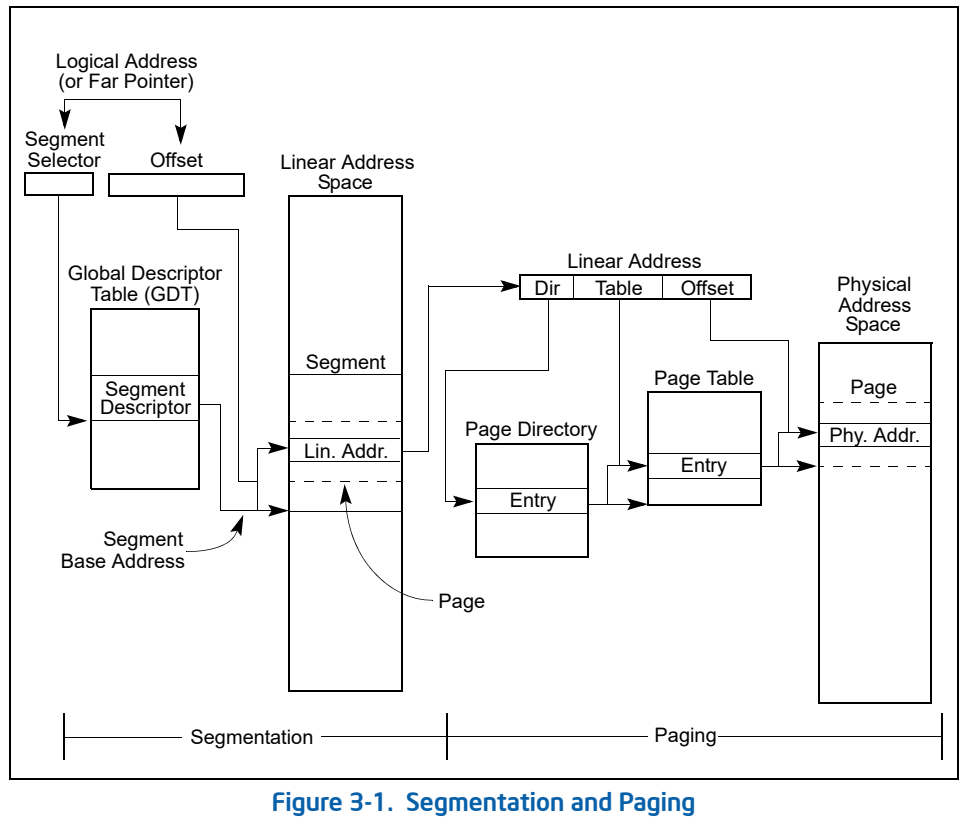

系统中所有的段都在处理器的线性地址空间内。只有逻辑地址（有时逻辑地址也称为远指针）才能确定一个字节在一个特定段中的位置。逻辑地址由段选择符和偏移量组成。段选择符是一个段的唯一标识。其中段描述符中包含了描述符表中的偏移（就像全局描述符表一样 GDT），该偏移指向叫作段描述符的一种数据结构。每个段有一个段描述符。段描述符描述了一个段的各种属性，比如段的大小，访问权限，段的优先权，段的类型以及该段的第一个字节在线性地址空间的位置（也称为段基址）等。通过将逻辑地址中的偏移量部分加上段基址就可以定位这个地址在段中的字节位置。段基址加偏移量就构成了处理器线性地址空间的线性地址。

如果系统没有采用分页机制，线性地址空间就可以直接映射到物理地址空间。物理地址空间被定义为处理器能够在地址总线上产生的地址范围。

*   逻辑地址：逻辑地址由段选择符和偏移量组成。（有时逻辑地址也称为远指针）能确定一个字节在一个特定段中的位置。
*   线性地址：段基址加偏移量就构成了处理器线性地址空间
*   物理地址空间：被定义为处理器能够在地址总线上产生的地址范围。

 

在多任务计算系统中，通常会定义一个比实际物理内存空间大的多的线性地址空间。因此需要使用一些方法来虚拟化线性地址空间。线性地址空间的虚拟化由处理器的分页机制来完成。

分页机制：

*   分页机制实现了传统的请求调页虚拟内存系统，在这种系统中，程序的执行代码按需要被映射到物理内存中。分页机制同样可以用来隔离多个任务。

*   分页机制支持一种虚拟内存环境。虚拟内存通过一个较小的物理内存（RAM 和 ROM）以及一些磁盘存储空间来模拟一个很大的线性地址空间。使用分页机制时，每个段被分成很多页（通常一个页大小为 4KB），这些页或者在物理内存中，或者在磁盘上。操作系统会维护一个页目录和一组页表来跟踪这些页。当一个进程试图访问线性地址空间的一个地址时，处理器通过页目录和页表将线性地址转换成物理地址，然后对其执行相应的操作（读或写）。如果被访问的页不在当前的物理内存中，处理器会中断这个进程（产生一个缺页异常）。之后，操作系统会从磁盘上读取这个页到内存中，接着执行这个程序。
*   当操作系统实现分页管理后，内存与磁盘之间的页交换对一个程序的正确执行来说是透明的。即使是为 16 位的 intel 处理器所写的程序，运行在虚拟 8086 模式下也可以被透明地分页的。

## 2.2 分段机制

intel 架构所支持的分段机制被用来实现各种不同的系统设计。这些设计可以是平坦模型，即仅仅利用分段来保护程序。也可以是充分利用分段机制来实现一个健壮的操作系统，让多个程序安全可靠的运行。

以下给出了几个例子，说明如何在一个系统中应用分段机制来改进内存管理的性能和可靠性。

### 2.2.1 基本平坦 model

对一个系统而言，最简单的内存模型就是基本的平坦模型。在平坦模型中，操作系统和应用程序可以访问一个连续的、没有分段的地址空间。无论对系统设计者还是应用程序员，平坦模型在最大程度上隐藏了 intel 架构的分段机制。

在 intel 架构中实现一个基本的平坦模型，至少要建立两个段描述符，一个指向代码段，一个指向数据段（具体请参考图 3－2）。这两个段都要被映射到整个线性地址空间，也就是说，这两个段描述符都是以地址 0 为基址，有同样的段限长 4GB。当段限长设置为 4GB时，即使所访问的地址处并没有物理内存时，处理器也不会产生“超出内存范围”异常。ROM（EPROM）的地址通常位于物理地址空间的高端，因为处理器从 0xfffffff0 处开始执行。RAM（DRAM）位于地址空间的低端，因为复位初始化后，数据段 DS 的初始基地址被置为 0。

 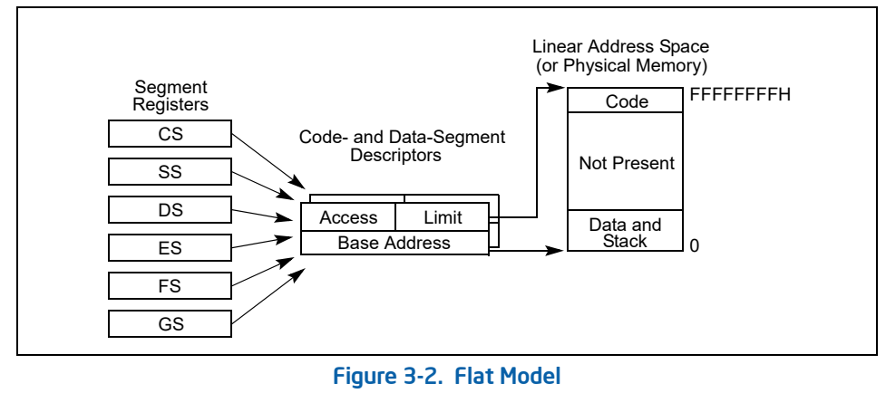

### 2.2.2 受保护的平坦模型

受保护的平坦模型与基本平坦模型类似，只是段限长被设定为在实际物理内存范围内（详细请参考图 3-3）。如果试图访问实际内存范围以外的地址，会产生一个通用保护异常(#GP)。这个模型稍微利用了一点硬件的保护机制来防止一些程序的错误。

 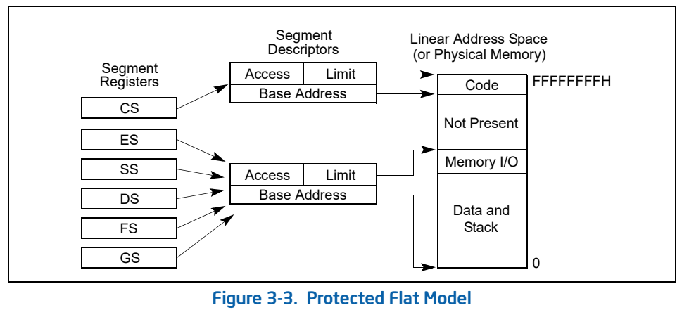

当然，也可以使这个受保护的平坦模型更加复杂以提供更多的保护。比如，为了能在分页机制中分离普通用户和超级用户的代码和数据，需要定义 4 个段：优先权为 3（普通用户）的代码段和数据段，还有优先权为 0（超级用户）的代码段和数据段。一般来说，这些段都是互相重叠的，并且都从线性地址空间地址 0x00000000 开始。这个平坦分段模型加上一个简单的分页结构就可以在操作系统和应用程序之间起到保护作用。而且,如果为每一个进程都分配一个页结构，这样就可以在应用程序之间起到保护作用。

### 2.2.3 多段模型

多段模型（如图 3－4 所示），充分利用了分段机制，提供了对代码，数据结构，以及程序的硬件级的强制保护。在这里，每个进程（或者任务）都被分配了自己的段描述符表以及自己的段。进程可以完全独自拥有这些分配到的段，也可以与其他进程共享这些段。单独的程序对段和执行环境的访问由硬件控制。

 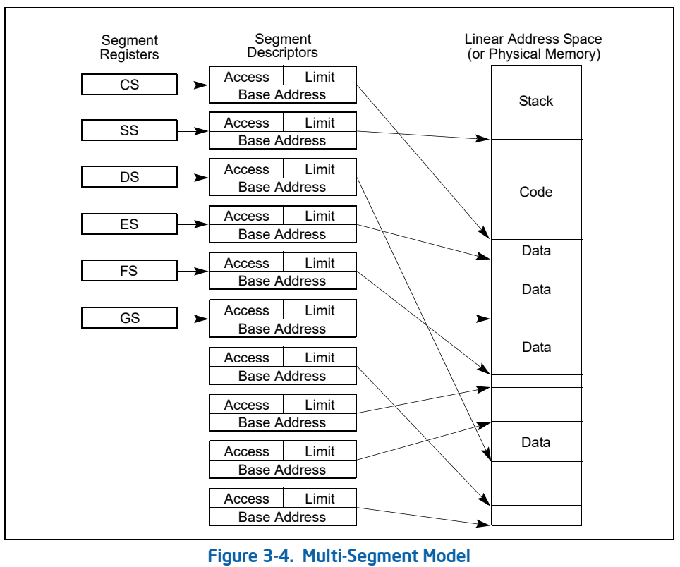

访问检查机制不仅可以避免对段限长之外的地址进行寻址，也可以避免对特定段执行非法操作。比如，因为代码段被指定为只读的，所以由硬件来防止对代码段写入数据。为段而产生的访问权限信息也可以被用来建立保护级别。保护级别也可以防止操作系统的例程被未授权的应用进程访问。

### 2.2.4 分页与分段

分页机制可以与图 3－2，3－3，3－4 所描述的任何一种段模型配合使用。处理器的分页机制把线性地址空间分成很多页（如图 3－1 所示）.这些线性地址空间里的页再被映射到物理地址空间上的页。分页机制提供了一些页层次的保护措施，这些措施可以与段保护措施配合 i 或者取代段的保护措施。分页机制还可以提供两级保护即用户级和管理级的保护，这些保护也可以通过页偏移来指定。

## 2.3 逻辑地址和线性地址的转换

>物理地址空间
>
>在保护模式下，intel架构提供最大 4GB（232字节）的物理地址空间。这是处理器能够在地址总线上寻址的范围。这个地址空间是平坦的（未分段的），范围从 0x00000000 到0xFFFFFFFF。这个地址空间可以映射到读写内存、只读内存以及I/O内存。本章所描述的内存映射措施可以将物理内存分割成段或者页。（在Pentium Pro处理器采用）Intel架构现在也支持物理内存空间扩展至 236字节（64GB），
>其最大物理地址为FFFFFFFFFH。这个扩展由两种方式来完成：
>
>*   使用物理地址扩展（PAE）标记来控制，这个标记是控制寄存器 CR4 的位 5
>*   使用 36 位页尺寸扩展（PSE－36）特征(在奔腾 3 处理器中引入这个特征)。

在保护模式下的系统架构，处理器分两步进行地址转换以最后得到物理地址：逻辑地址转换机制和线性地址空间的分页机制。

即使最小程度的使用段机制，处理器地址空间内的每一个字节都是通过逻辑地址访问的。

一个逻辑地址由一个 16 位的段选择符和一个 32 位的偏移量组成（参考图 3－5）。段选择符确定该字节位于哪个段，偏移量确定这个字节相对于段基址在这个段中的位置。

 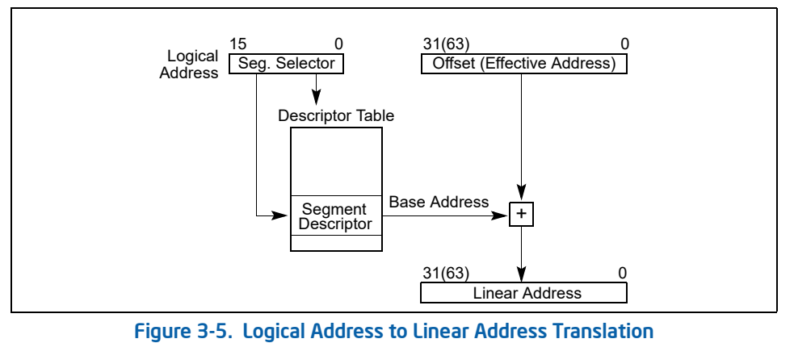

处理器将逻辑地址转换为线性地址。线性地址是处理器线性地址空间内的 32 位的地址。线性地址与物理地址一样，是平坦的（不分段的），空间大小为 232字节，从地址 00000000H到FFFFFFFFH。线性地址空间包含了所有的段以及为系统而定义的各种系统表。

处理器通过如下几个步骤将 **逻辑地址转换为线性地址** ：

1.   通过段选择符中的偏移量，在 GDT 或者 LDT 中定位该段的段描述符。（仅当一个新的段选择符被读入段寄存器时才执行这一步）
2.   检查段描述符中的访问权限和段的地址范围以确保该段是可访问的，偏移量是在段限长范围内的。
3.   将段描述符中的段基址与偏移量相加以构成线性地址。

如果没有使用分页，处理器直接将线性地址映射为物理地址（也就是说，这个线性地址可以直接送到处理器的地址总线上）。如果在线性地址空间启用了分页机制，就需要再一次进行地址转换，将线性地址转换为物理地址。

### 2.3.1 段选择符

段选择符是一个 16 位的段标识符（请参照图 3－6）。它并不直接指向该段，而是指向定义该段的段描述符。一个段选择符包含以下项目：

*   **Index** （位 3～15）。选中 GDT 或 LDT 中 8192 个描述符中的某个描述符。处理器将索引值乘以 8（段描述符的字节数），然后加上 GDT 或 LDT 的基地址（基地址在GDTR 或者 LDTR 寄存器中）。
*   **TI（table indicator）** 标记（位 2）。确定使用哪一个描述符表：将这个标记置 0，表示用 GDT。将这个标记置 1，表示用 LDT。
*   **请求的特权级（RPL）** （位 0 和 1）。确定该选择符的特权级。特权级从 0－3，0 为最高特权级。有关任务的 RPL 与 CPL 之间关系的描述以及该段选择符所指向的描述符的描述符特权级（DPL）。

 

GDT 中的第一项是不用的。指向 GDT 中第一项的段选择符（即选择符中的索引为 0，TI标记置为 0）被视为空（null）段选择符。当段寄存器（CS 或 DS）被赋值为空选择符时，处理器并不产生一个异常。然而当使用值为空选择符的寄存器来访问内存时，处理器会产生一个异常。空选择符可以用来初始化未使用的段寄存器。对 CS 或者 SS 赋予一个空选择符会导致处理器产生一个通用保护异常 (#GP)。

对应用程序而言，段选择符作为指针变量的一部分，是可见的。但是其值由连接程序赋予或者更改，而不是应用程序。

### 2.3.2 段寄存器

为了减少地址转换的时间和代码复杂度，处理器提供了 6 个段寄存器来保存段选择符（具体请参见图 3－7）。每个段寄存器都支持某个特定类型的内存寻址（代码，堆栈，数据等等）。实际上，对任何程序的执行而言，至少要将代码段寄存器（CS），数据段寄存器（DS）和堆栈段寄存器（SS）赋予有效的段选择符。此外，处理器还提供了另外 3 个数据段寄存器（ES，FS 和 GS）供进程使用。

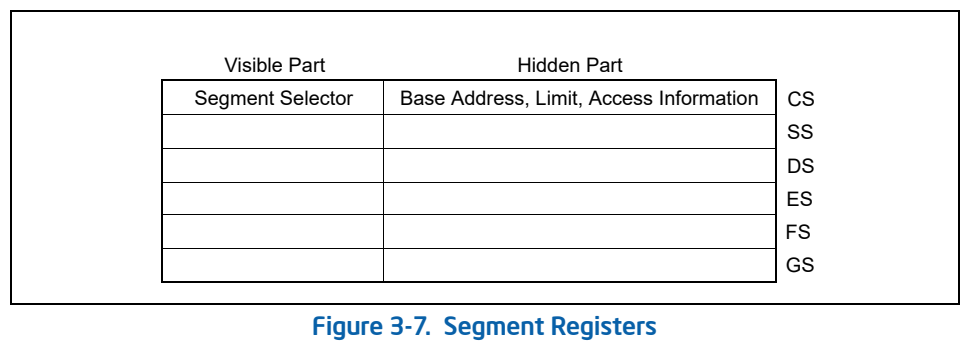

当一个进程要访问某个段的时候，这个段的段选择符必须被赋值到某一个段寄存器中。因此，尽管系统定义了数千个段，只有 6 个段是可以被直接使用的。其他段只有在他们的段选择符被置入这些寄存器中时才可以被使用。

每个段寄存器都由“可见“部分和”不可见“部分组成。（有时，不可见部分也被称为“描述符缓存”或者“影子寄存器”）。当段选择符被加载到一个段寄存器的可见部分时，处理器也通过段选择符所指向的段描述符获取了这个段寄存器的不可见信息：段基址，段限长和访问权限。段寄存器保存的信息（可见或不可见的）使得处理器在进行地址转换时，不需要花费额外的总线周期来从段描述符中获取段基址和段限长。在一个允许多个进程访问同一个描述符表的系统中，当描述符表被改变后，软件应该重新载入段寄存器。如果不这么做，当存储位置信息（its memory-resident version）发生变化后，用到的将是缓存在段寄存器中的旧的描述符信息。

有两种载入段寄存器的指令：

1.   直接载入指令，如：MOV，POP，LDS，LES，LSS，LGS和LFS。这些指令明确指定了相应的寄存器。
2.   隐含的载入指令，如远指针版的CALL，JMP，RET指令，SYSENTER和SYSEXIT指令，还有IRET，INTn，INTO和INT3指令。伴随这些指令的操作，他们改变了CS寄存器的内容，有时也会改变其他段寄存器的内容。

MOV指令也可以用于将一个段寄存器的可见部分保存到一个通用寄存器中。

### 2.3.3 段描述符

段描述符是GDT或LDT中的一个数据结构，它为处理器提供诸如段基址，段大小，访问权限及状态等信息。段描述符主要是由编译器，连接器，装载器或者操作系统构造的，而不是由应用程序产生的。图3－8说明了各类段描述符的一般格式。

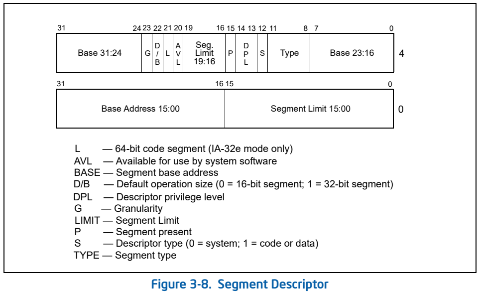

段描述符中的标志和字段如下：

*   **段限长字段：**

    指定了段的大小。处理器将这两个段限长域组合成一个20位的段限长值。根据标志位G（粒度）的不同，处理器按两种不同的方式处理段限长：

    *   若G标志位为0，则该段大小可以从1字节到1M字节，段长增量单位为字节
    *   若G标志位为1，则该段大小可以从4K字节到4G字节，段长增量单位为4K字节

    根据段是“向上扩展段”还是“向下扩展段”，处理器对段限长做不同的处理。在向上扩展段中，逻辑地址中的偏移量范围从0到段限长。超过段限长的偏移量会导致#GP或#SS异常。在向下扩展段，段限长的作用正好相反；偏移量的范围从段限长到FFFFFFFFH或者FFFFH，最大偏移量到底是FFFFFFFFH还是FFFFH，取决于B标志位的值，小于段限长的偏移量会导致GP异常或SS异常。减少向下扩展段的段限长将会在段地址空间的底部而不是顶部为该段分配新的内存空间。IA32架构中的栈总是向下增长的，采用这种机制便于实现可扩展的栈。

*   **基地址域：**

    确定该段的第0字节在4GB线性地址空间中的位置。处理器将这3个基地址域组合在一起构成了一个32位地址值。段基址应当是16字节边界对齐的。16字节边界对齐不是必须的，但这种段边界的对齐能够使程序的性能最大化。

*   **类型域：**

    指明段或者门的类型，确定段的范围权限和增长方向。如何解释这个域，取决于该描述符是应用描述符（代码或数据）还是系统描述符，这由描述符类型标志（S 标记）所确定。代码段，数据段和系统段对类型域有不同的意义。

*   **S（描述符类型）标志：**

    确定段描述符是系统描述符（S 标记为0）或者代码，数据段描述符（S 标记为1）。

*   **DPL（描述符特权级）域：**

    指明该段的特权级。特权级从0～3，0为最高特权级。DPL用来控制对该段的访问。

*   **P（段存在）标志：**

    标志指出该段当前是否在内存中（1表示在内存中，0表示不在）。当指向该段描述符的段选择符装载人段寄存器时，如果这个标志为0，处理器会产生一个段不存在异常（NP）。内存管理软件可以通过这个标志，来控制在某个特定时间有哪些段是真正的被载入物理内存，这样对于管理虚拟内存而言，除了分页机制还提供了另一种控制方法。

*   **D/B(默认操作数大小/默认栈指针大小和/或上限)标志：**

    根据这个段描述符所指的是一个可执行代码段，一个向下扩展的数据段还是一个堆栈段，这个标志完成不同的功能。（对32位的代码和数据段，这个标志总是被置为1，而16位的代码和数据段，这个标志总是被置为0）

    *   **可执行代码段**

        这个标志被称为D标志，它指明该段中的指令所涉及的有效地址值的缺省位位数和操作符的缺省位位数。如果该标志为1，缺省为32位的地址，32位或者8位的操作符；若为0，缺省为16位的地址，16位或者8位的操作符。指令前缀66H可以指定操作符的长度而不使用缺省长度。用前缀67H来指定地址值长度。

    *   **堆栈段（由SS寄存器所指向的数据段）**

        这个标志被称为B（big）标志，它为隐含的栈操作（如push，pop和call）确定栈指针值的位位数。如果该标志为1，则使用的是32位的栈指针，该指针放在32位的ESP寄存器中；若该标志为0，则使用的是放在16位 SP寄存器中的16位的栈指针。如果该堆栈段为一个向下扩展的数据段（见下一段的说明），B标志还确定了该堆栈段的地址上界。

    *   **向下扩展的数据段**

        这个标志称为B标志，它确定了该段的地址上界。如果该标志为1，段地址上界为FFFFFFFFH（4GB）；若该标志为0，段地址上界为FFFFH（64KB）。

        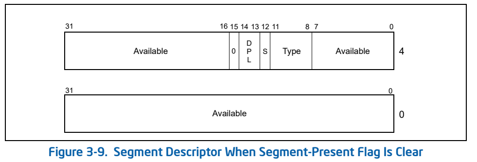

*   **G（粒度）标志：**

    确定段限长扩展的增量。当G标志为0，段限长以字节为单位；G标志为1，段限长以4KB为单位。（这个标志不影响段基址的粒度，段基址的粒度永远是字节）如果G标志为1，那么当检测偏移量是否超越段限长时，不用测试偏移量的低12位。例如，如果G标志为1，0段限长意味着有效偏移量为从0到4095。

*   **可用及保留的位：**

    段描述符的第二个双字的20位可以被系统软件使用，21位被保留，并且应该设置为0。

## 2.4 描述符的分类

### 2.4.1 代码和数据段类型的描述符

当段描述符中的 **S** 标志（描述符类型）为1时，该描述符为代码段描述符或者数据段描述符。类型域的最高位（段描述符的第二个双字的第11位）将决定该描述符为数据段描述符（为0）或者代码段描述符（为1）。

**对于数据段而言** ，描述符的类型域的低3位（位8，9，10）被解释为访问控制（A），是否可写（W），扩展方向（E）。参考表3－1对代码和数据段描述符类型域的解码描述。数据段可以是只读或者可读写的段，这取决与“是否可写”标志。

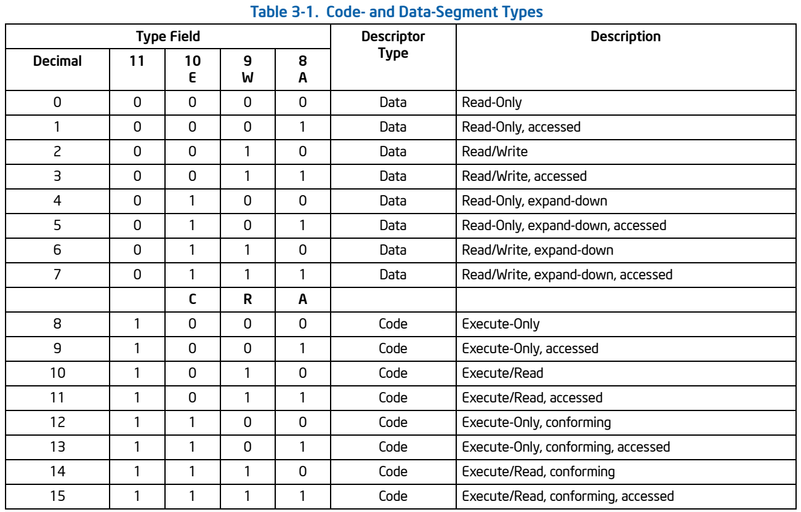

堆栈段必须是可读写的数据段。将一个不可写的数据段选择符置入SS寄存器会导致通用保护异常（GP） 。 如果堆栈段的大小需要动态变化，可以将其置为向下扩展数据段（扩展方向标志为1）。这里，动态改变段限长将导致栈空间朝着栈底部空间扩展。如果段的长度保持不变，堆栈段可以是向上扩展的，也可以是向下扩展的。

堆栈段必须是可读写的数据段。将一个不可写的数据段选择符置入SS寄存器会导致通用保护异常（GP） 。 如果堆栈段的大小需要动态变化，可以将其置为向下扩展数据段（扩展方向标志为1）。这里，动态改变段限长将导致栈空间朝着栈底部空间扩展。如果段的长度保持不变，堆栈段可以是向上扩展的，也可以是向下扩展的。

访问位（access 位）表示访问位自最后一次被操作系统清零后，该段是否被访问过。每当处理器将该段的段选择符置入某个段寄存器时，就将访问位置为1。该位一直保持为1直到被显式清零。该位可以用于虚拟内存管理和debug。

**对于代码段而言** ，类型域的低3位被解释为访问位（A），可读位（R），一致位（C）。根据可读位的设置，代码段可以为“只执行”或者“可执行可读”。当有常量或者其他静态数据与指令代码一起在ROM中时，必须使用“可执行可读“的段。要从代码段读取数据，可以通过带有CS前缀的指令或者将代码段选择符置入数据段寄存器（DS，ES，FS或者GS寄存器）。在保护模式中，代码段是不可写的。

代码段可以是一致的，也可以是不一致的。进程的执行转入一个具有更高特权级的一致段可以使代码在当前特权级继续运行。除非使用了调用门或者任务门，进程将转入一个不同特权级的非一致段将使处理器产生一个“一般保护异常”(#GP)。不访问受保护的程序和某类异常处理程序（比如除法错或者溢出）的系统程序可以被载入一致的代码段。不能被更低特权级的进程访问的程序应该被载入非一致的代码段。

>   注意：
>
>   无论目标段是否为一致代码段，进程都不能因为call或jump而转入一个低特权级（特权值较大）的代码段执行。试图进行这样的执行转换将导致一个通用保护异常（GP）。所有的数据段都是非一致的，这就意味着数据段不能被更低特权级的进程访问（特权值较大的执行代码）。然而，和代码段不同，数据段可以被更高优先级的程序或者过程（特权级值较小的执行代码）访问，不需要使用特别的访问门。
>
>   如果GDT或者一个LDT中的段描述符在ROM中，当程序或者处理器试图更改在ROM中的段描述符时，处理器将进入一个无限循环。为了防止此类问题的发生，可以将所有在ROM中的段描述符的访问位置位。同时，除去所有操作系统代码中试图更改ROM中的段描述符的代码。

### 2.4.2 系统描述符类型

当段描述符的S标志（描述符类型）为0，该描述符为系统描述符。处理器可以识别以下类型的系统描述符：

*   局部描述符表描述符 Local descriptor-table (LDT) segment descriptor

    是保护模式下存储器寻址的一种数据表，它包含了与某个任务相关联的段描述符，在设计操作系统时，通常每个任务有一个独立的LDT。LDT提供了将一任务的代码段、数据段与操作系统的其余部分相隔离的机制。

*   任务状态段描述符 Task-state segment (TSS) descriptor

    任务寄存器拥有当前任务的TSS的段选择符和段描述符（32位基地址，16位段界限和描述符参数）。任务寄存器具有可见部分（软件可以读和写）和不可见部分（只能被处理器访问，软件不能读写）。可见部分中的段选择符指向GDT中TSS描述符。不可见部分缓存TSS的描述符。指令LTR（加载任务寄存器）和STR（保存任务寄存器）加载和保存任务寄存器的可见部分。LTR指令让任务寄存器加载TSS描述符的段选择符，该指令只能运行在特权级0，该指令通常用来系统初始化时初始化任务寄存器。指令STR可以将任务寄存器的可见部分保存到通用寄存器或内存中。该指令可以运行在任何特权级。

*   调用门描述符 Call-gate descriptor

    Intel设置的“任务”切换的手段。

*   中断门描述符 Interrupt-gate descriptor

    用于中断处理，其类型码为110，中断门包含了一个外设中断或故障中断的处理程序所在段的选择子和段内偏移量。当控制权通过中断门进入中断处理程序时，处理器清IF标志，即关中断，以避免嵌套中断的发生。中断门中的DPL（Descriptor Privilege Level）为0，因此用户态的进程不能访问中断门。所有的中断处理程序都由中断门激活，并全部限制在内核态。

*   陷阱门描述符 Trap-gate descriptor

    用于系统调用，其类型码为111，与中断门类似，其唯一的区别是，控制权通过陷阱门进入处理程序时维持IF标志位不变，也就是说，不关中断。

*   任务门描述符 Task-gate descriptor

    Intel设置的“任务”切换的手段。

**这些描述符又可以分为两类：系统段描述符和门描述符。**

*   系统段描述符指向系统段（LDT和TSS段）。
*   门描述符它们自身就是“门“，它们或者持有指向在代码段的过程的入口点的指针，或者持有TSS（任务门）的段选择符。

表3－2显示了对系统段描述符和门描述的类型域的译码。

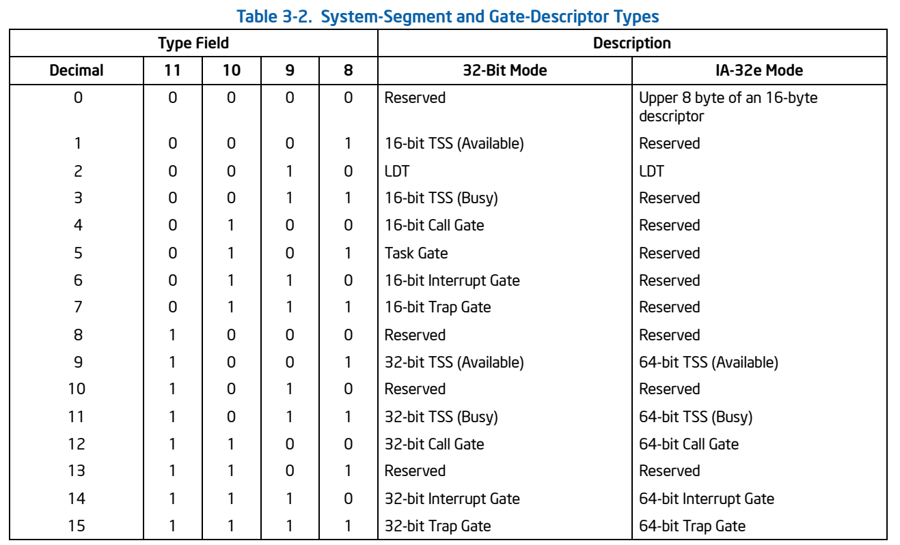

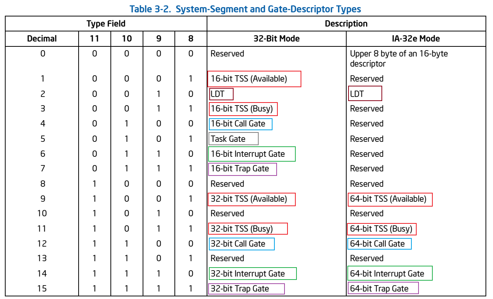

### 2.4.3 段描述符表

一个段描述符表是一个段描述符的数组（参看图3－10）。段描述符表的长度不固定，可以最多包含8192（213）个8字节的描述符。有两种描述符表：

*   全局描述符表（GDT）
*   局部描述符表（LDT）

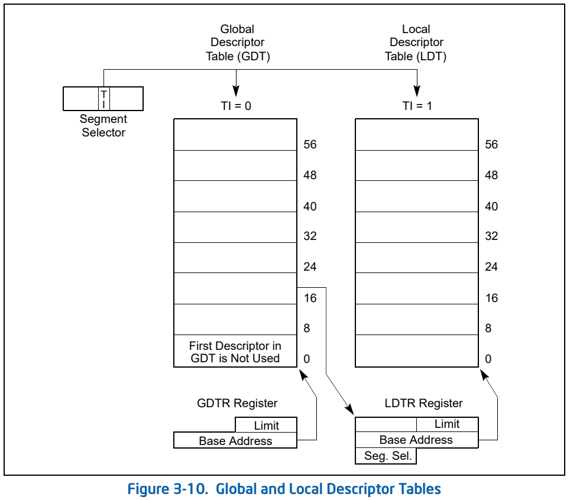

系统必须定义一个GDT，以备所有的进程或者任务使用。也可以定义一个或者多个LDT。比如，可以为每个正在运行的任务定义一个LDT,也可以所有的任务共享一个LDT。

GDT本身不是一个段，而是线性地址空间中的一个数据结构。GDT的线性基地址和限长必须被装载入GDTR寄存器。GDT的基址应当按照8字节方式对齐，这样可以获得最好的处理器性能。GDT的限长值是按比特计算的。在段中，段限长加上段基址可以用获取段中最后一个比特的有效地址。0限长值表示只有一个有效的比特。因为段描述符总是8比特长，GDT的限长应该总是八的整数倍减一（即8N－1）。

处理器并不使用GDT中的第一个描述符。当指向这个NULL描述符的段选择符被装载入数据段寄存器（DS，ES，FS或者GS）时，处理器并不产生异常。但是如果使用这个NULL描述符来访问内存，处理器就会产生一个通用保护异常（GP）。使用这个指向NULL描述符的段选择符来初始化段寄存器，这样可以确保在不经意地引用未使用的段寄存器时，处理器能产生一个异常。

LDT位于类型为LDT的系统段内。GDT必须包含一个指向LDT段的段描述符。如果系统支持多个LDT，那么每个LDT段都要有一个段选择符，都要在GDT中有一个段描述符。LDT的段描述符可以位于GDT中的的任何地方。

LDT是通过它的段选择符来访问的。为了避免在访问LDT时进行地址翻译，LDT的段选择符，线性基地址，段限长和访问权限都放在LDTR寄存器中。

LDT是通过它的段选择符来访问的。为了消除在访问LDT时的地址转换，LDT的段选择符，线性基址，段限长和访问权限都存放在LDTR寄存器中。

当GDTR寄存器被装载时（使用SGDT指令），一个48位的伪描述符也被放入内存中（参看图3－11）。为了避免在用户模式下（特权级为3）发生对齐检查错误，伪描述符应该放在一个奇数字地址上（即，该地址对4取模的结果为2）。这样可以使处理器存一个对齐的字，后面紧跟着一个对齐的双字。用户模式下的程序通常并不保存伪描述符，但是通过这种方式对齐伪描述符可以避免发生对齐检查错误。在使用SIDT指令装载IDTR寄存器的时候，也应该使用同样的对齐方法。当装载LDTR或者任务寄存器时（分别使用SLTR和STR指令），伪描述符应该被放在一个双字地址上（即，该地址对4取模的结果为0）。

### 2.4.4 门描述符

为了能够访问不同特权级的代码段，处理器提供了一个特殊的描述符集合，叫做门描述符。以下是四种
门描述符：

*   调用门
*   陷阱门
*   中断门
*   任务门

任务门用于任务切换，陷阱门和中断门是特别的调用门，用来调用异常和中断处理程序。

调用门为不同特权级间的进程控制转换提供了便利。它们一般只用在操作系统中或者使用特权级保护机制的程序里。调用门也可用于 16bit 和 32bit 代码段之间的进程控制转换。

