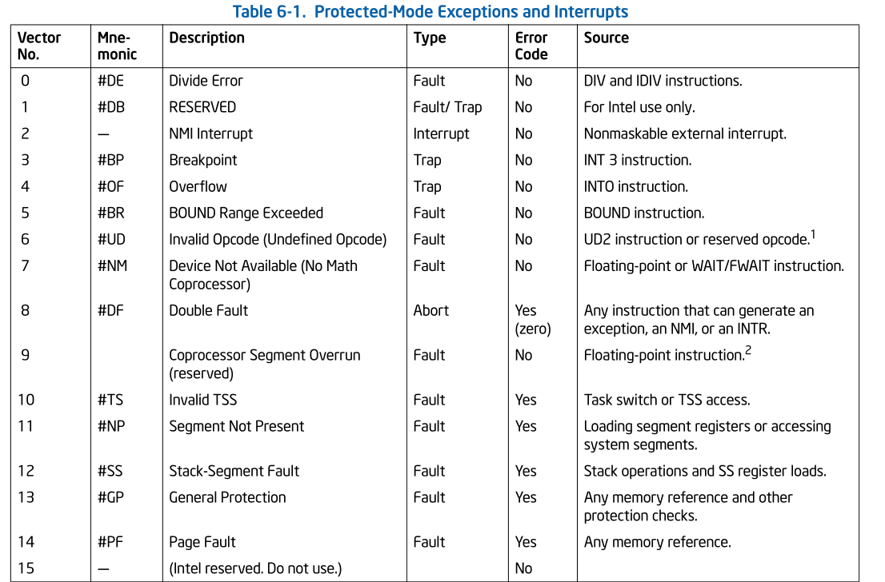
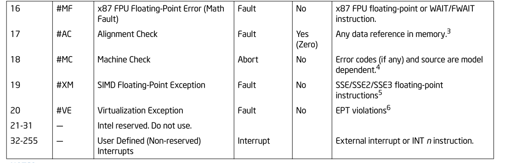
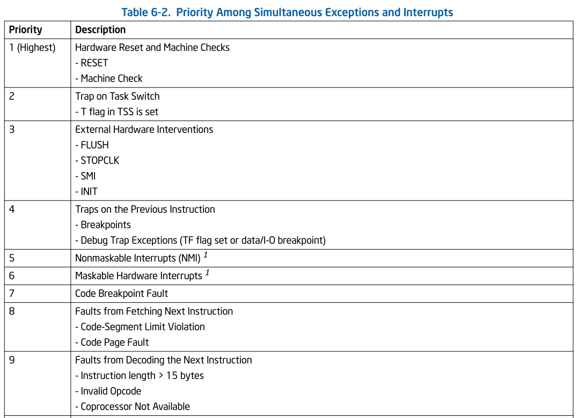
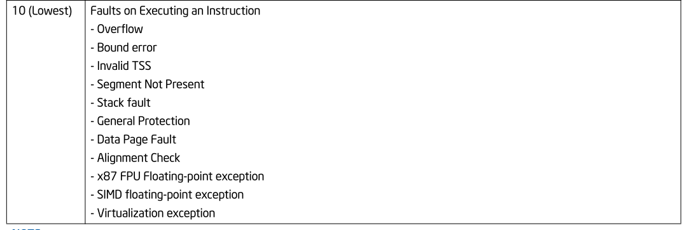
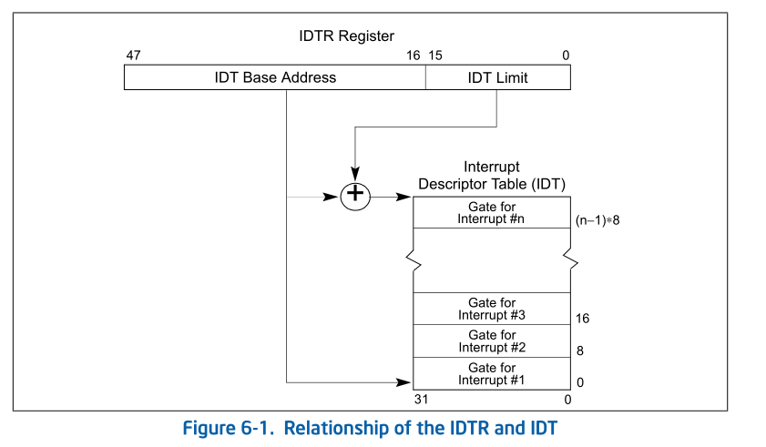
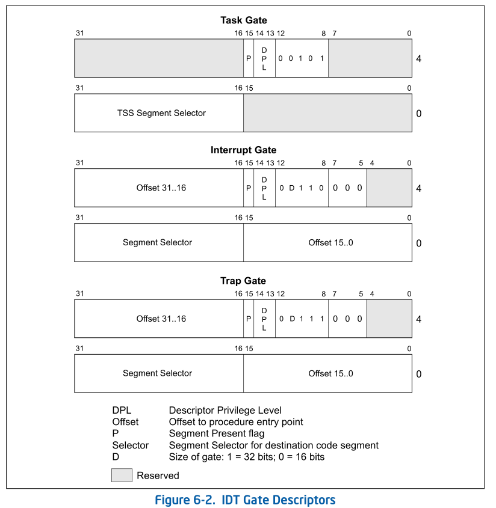
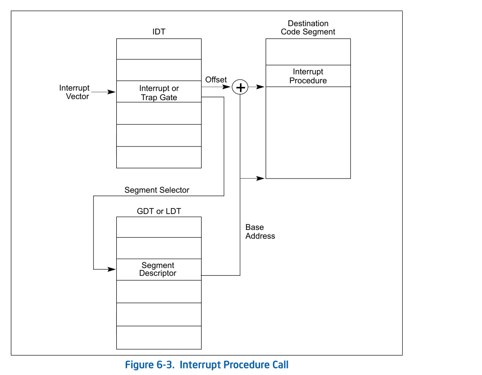
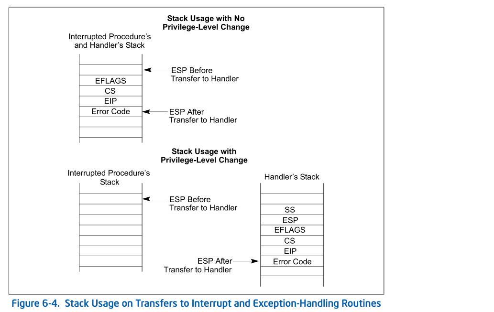

# 3. 中断和异常处理

## 3.1. 中断和异常处理概述

-   <font face="华文琥珀" size=5>什么是中断和异常？</font>

    中断和异常是强制性的执行流的转移，从当前正在执行的程序或任务转移到一个特殊的称作句柄的例程或任务。

    *   中断：有硬件（外部）中断和软件中断，常用来处理外设请求。

        当硬件发出信号时，便产生中断，中断的产生同正在执行的程序是异步的，即中断的产生是随机的。其用于处理处理器的外部事件，比如为外设服务的请求。使用 INT n 指令，软件也可以产生中断。

    *   异常：异常是在处理器执行指令的过程中发现错误而产生的。

        比如除数为零。处理器可以检测出多种不同的错误，包括保护异常，页错误，内部机器错误。Pentium 4, Intel Xeon, P6 家族和 Pentium 处理器还允许当出现硬件错误和总线错误时产生硬件检测异常。

-   <font face="华文琥珀" size=5>处理器如何处理？</font>

    处理器的中断和异常处理机制使中断和异常的处理对于应用程序和操作系统或可执行程序来说是透明的。当处理器收到中断信号或检测到异常时，便挂起当前正在运行的进程或任务，而转去执行中断或异常处理例程。中断或异常处理例程执行完之后，处理器继续被中断的进程或任务。被中断的进程或任务继续执行，就像从未被打断过一样，只有两种情况例外：无法从发生的异常恢复，中断使当前的程序终止。

思考：实模式和保护模式下，中断向量表一样吗？


## 3.2. 有关中断和异常了解性的内容

-   <font face="华文琥珀" size=5>异常和中断向量</font>

    处理器为每个异常和中断分配了一个识别码，称作向量。表 6-1 列出了异常和中断向量的分配情况，该表还提供了每个向量的异常类型，某个异常是否含有出错码，并给出了异常和中断源。向量号从 0 到 31 被分配给异常和 NMI 中断使用。但目前的处理器还未使用完全部的这 32个向量。未使用的向量号保留给将来使用。不要将其移做它用。32 到 255 之间的向量号提供给用户使用。这些中断不在 Intel 的保留部分之列，一般被分配给外部 I/O 设备，允许它们通过某个外部硬件中断机制向处理器传递信号。

    

    

-   <font face="华文琥珀" size=5>中断源和异常源</font>

    *   **中断源：**

        1.   外部（硬件产生的）中断

             外部中断是通过处理器的引脚接收的，也可以通过局部 APIC 串行总线接收。

             >   **可屏蔽硬件中断**
             >   任何通过 INTR 引脚或局部 APIC 传递到处理器的外部中断都被称作可屏蔽硬件中断。通过INTR 引脚传递的可屏蔽硬件中断可使用所有 Intel 架构定义的中断向量(0~255)；而通过局部 APIC 传递的部分只能使用 16~255 号向量。使用  EFLAGS 寄存器的 IF 位就可以屏蔽全部可屏蔽硬件中断。
             >
             >   **不可屏蔽中断（NMI）**
             >
             >   在两种情况下产生不可屏蔽中断（NMI）：
             >
             >   1.   外部硬件向 NMI 引脚发信号
             >   2.   处理器从 APIC 串行总线上收到 NMI 模式的信号
             >
             >   当处理器从这两种中的任一种收到 NMI 时，便立即作出响应，调用由 2 号中断向量指向的处理例程。处理器还会调整某些硬件以保证在当前 NMI 处理例程完成前，不再接收任何中断信号，包括 NMI 中断。
             >
             >   NMI 不能被 EFLAGS 的 IF 位屏蔽。
             >
             >   可以将一个可屏蔽硬件中断重定向到 2 号向量，以调用 NMI 处理例程；但是，这种中断不是真正的 NMI 中断。真正的 NMI 可以激活处理器的硬件处理部分，只能由上面提到的两种情况产生 NMI。当NMI处理例程执行时，处理器会禁止响应后继产生的NMI请求，知道有IRET指令执行。建议使用中断门来调用NMI中断处理例程，以屏蔽可屏蔽硬件中断。

        2.   软件产生的中断

             将中断向量号作为 INT 指令的操作数即可通过 INT 指令在程序中产生中断。0 到 255 号中断均可使用 INT 指令调用。但是，当处理器预先定义好的 NMI 中断被这样调用时，处理器作出的响应与真正 NMI 中断发生时的响应并不一样。也就是说，执行 INT 2(NMI的向量号)时，NMI 处理例程被调用，但是处理器的 NMI 硬件处理并未被激活。

             >   **注意：** EFLAGS 的 IF 位并不能屏蔽由 INT 指令产生的中断。

    *   **异常源：**

        1.   处理器检测到的程序错误异常

             在应用程序执行过程中，或操作系统执行中，当检测到程序错误时，处理器产生一个或多个异常。

        2.   软件产生的异常

             INT n 指令可以在软件中用来模拟某个异常

             INTO,INT 3 和 BOUND 指令允许在软件中产生异常。这些指令允许在指令流中检测指定的异常条件。例如，INT 3 产生一个中断异常。

             >   但有一点要注意。若该指令中的 n 指向 Intel定义的某个异常，处理器便会产生一个指向相应的中断，接着就是调用相应的处理例程。这其实就相当于一个中断，处理器并不将出错码压入堆栈。于是，即便该异常原本有一个出错码，这时也被略去了。但对于那些带有出错码的异常处理例程，它们退出时会试图去弹出一个并不存在的出错码。此时，处理例程将 EIP 认为是错误码而弹出，而将一个无关的值弹出给 EIP，于是程序返回到一个错误的地方去了。

        3.   机器检测异常

             P6 系列和 Pentium 处理器同时提供了内部和外部的机器检测机制，用来检查内部芯片部件的操作和总线传输。这些机制组成了扩展异常机制（并不能独立完成）。当检测到一个机器检测错误时，处理器发出一个机器检测异常（18 号向量），并返回一个出错码。

-   <font face="华文琥珀" size=5>异常的分类：故障（faults）、陷阱（traps）和中止（aborts）</font>

    *   **Faults：** 

        <font color=blue>故障是一种通常可以纠正的异常</font>，一旦纠正，就可以重新启动程序，而不会失去连续性。当故障被报告时，处理器将机器状态恢复到开始执行故障指令之前的状态。<font color=green>故障处理程序的返回地址（CS和EIP寄存器保存的内容）指向故障指令</font>，而不是指向故障指令之后的指令。

    *   **Traps：** 

        <font color=blue>陷阱是在执行陷阱指令之后立即报告的异常。</font>陷阱允许继续执行程序或任务而不会失去程序的连续性。<font color=green>陷阱处理程序的返回地址指向在陷阱指令之后要执行的指令。</font>

    *   **Aborts：** 

        abort是一种异常，它不总是报告导致异常的指令的精确位置，也不允许重新启动导致异常的程序或任务。种止（abort）用于报告严重的错误，例如硬件错误和系统表中不一致或非法的值。

        >   提示：
        >
        >   通常作为故障（Faults）报告的一个异常子集是不可重启的。只有少数几个异常被报告为故障，but under architectural corner cases,它们是不可恢复的，且处理器的上下文中的内容也会有部分丢失。一个例子：当执行 POPAD 指令是堆栈越过了堆栈段的尾部。异常处理例程会看到 CS：EIP 恢复原样，就好象 POPAD 从未执行，但处理器状态却被改变了（通用寄存器）。这种情况被视为程序错误，若应用程序产生这样的故障则会被操作系统终止。

-   <font face="华文琥珀" size=5>程序或任务的重新执行</font>

    为了允许在处理异常或中断后重新启动程序或任务，除“终止（abort）”之外的所有异常均严格地在前一条指令结束而下一条指令未开始执行时被报告，中断也是在该时刻被检测的。

    **对于错误（Faults）类的异常** ，返回地址指向产生 Faults 的指令。所以当从 Faults 处理例程返回时，产生 Faults 的指令将重新被执行。重新执行产生 Faults 的指令通常用来处理当访问操作数受挫时的异常情况。最常见的例子是页 Faults 异常（#PF），当某一进程或任务访问某一页中的操作数而该页并不在内存中时，将会发生这种异常。这时，异常处理例程在将所引用的页面加载到内存后，被中断的进程会从产生错误的指令处重新开始执行。处理器保存必要的寄存器和栈指针，以便被中断的进程或任务恢复到产生 Faults 之前的状态，这就保证了出错指令的重新执行对被中断的进程或任务来说是透明的。

    **对陷阱类异常（Traps）来说** ，返回地址指针指向的是产生 Traps 指令的下一条指令。当一条转移指令执行过程中检测到 Traps 时，返回地址指针则反映了执行转向的情况。例如，当执行 JMP 指令时，检测到有 Traps 异常，返回地址指针指向的是 JMP 的目的地址，而不是JMP指令后的下一条指令。所有的陷阱异常保证进程或任务的继续执行不失连续性。例如，溢出异常就属于陷阱。当这种异常发生时，返回地址指针指向的是 INTO 指令的下一条指令，该指令的作用是检查 EFLAGS 寄存器的 OF 位（溢出位）。该异常的陷阱处理例程解决(解析)了溢出条件。（The trap handler for this exception resolves the overflow condition.） 从 Traps 处理例程返回时，进程或任务从 INTO 指令的下一条指令处开始执行。

    **终止（Aborts）类异常不支持进程或任务的继续执行。**  Aborts 处理例程的作用是：当有 Aborts 异常发生时，收集处理器的各种相关诊断信息，并关闭进程或系统。

    **中断** 则绝对保证了在不失连续性的条件下，使被中断的进程和任务能继续执行。返回地址指针指向发生中断时的下一条指令。对于带重复前缀的指令，中断发生在两次循环之间。

-   <font face="华文琥珀" size=5>开启和禁止中断</font>

    根据处理器的状态和 EFLAGS 的 IF 位和 RF 位，处理器可以禁止某些中断的产生。详见下面的描述。

    1.   **屏蔽可屏蔽硬件中断**

         IF 标志可以禁用从处理器的 INTR 引脚或通过本地 APIC 接收的可屏蔽硬件中断的服务。当 IF 标志被清除时，处理器禁止发送到 INTR 引脚或通过本地 APIC 产生内部中断请求的中断；当设置 IF 标志时，传递给 INTR 或通过本地 APIC 引脚的中断被当作正常的外部中断处理。

         IF 标志不影响传递到 NMI 引脚的非掩码中断（NMI）或通过本地 APIC 传递的 NMI 消息的传递模式，也不影响处理器生成的异常。与 EFLAGS 寄存器中的其他标志一样，处理器清除 IF 标志以响应硬件复位。

         可屏蔽硬件中断组包括保留的中断和异常向量0到32这一事实可能会引起混淆。在架构上，当 IF 标志被设置时，从0到32的任何向量的中断都可以通过 INTR 引脚传递给处理器，从16到32的任何向量都可以通过本地 APIC 传递。然后处理器将生成一个中断，并调用由向量号指向的中断或异常处理程序。因此，例如，可以通过 INTR 引脚调用页面错误处理程序（通过向量14）；然而，这并不是一个真正的页面错误异常。这是一个中断。与 INT n 指令一样，当通过 INTR 引脚到异常向量生成中断时，处理器不会将错误代码推送到堆栈上，因此异常处理程序可能无法正确操作。

         IF 标志可以通过 STI (set interrupt-enable flag) 和 CLI (clear interrupt-enable flag) 指令分别设置或清除。只有当 CPL 等于或小于 IOPL 时，才能执行这些指令。如果它们在 CPL 大于 IOPL 时执行，则会生成一个通用保护异常(#GP)。(通过在控制寄存器 CR4 中设置 VME 标志来启用虚拟模式扩展时， IOPL 对这些指令的影响略有改变。行为也受到 PVI 标志的影响。

         IF标志还受以下操作的影响：

         *   PUSHF 指令将所有标志存储在堆栈中，可以对它们进行检查和修改。POPF 指令可用于将修改后的标志加载回 EFLAGS 寄存器。
         *   请求开关、POPF 和 IRET 指令加载 EFLAGS 寄存器；因此，它们可以用来修改 IF 标志的设置。
         *   当中断通过中断门处理时，IF标志被自动清除，这禁用了可屏蔽的硬件中断。(如果中断是通过陷阱门处理的，IF 标志不会被清除。)

    2.   **屏蔽指令断点**

         EFLAG 寄存器中的 RF (恢复)标志控制处理器对指令断点条件的响应。

         当设置时，它防止指令断点生成调试异常(#DB)；清除时，指令断点将生成调试异常。RF 标志的主要功能是防止处理器在指令断点上进入调试异常循环。

    3.   **在切换堆栈时屏蔽异常和中断**

         为了切换到不同的堆栈段，软件通常使用一对指令，例如:

         ```
         MOV SS, AX
         MOV ESP, StackTop
         ```

         如果中断或异常发生在段选择器被加载到 SS 寄存器之后，但在 ESP 寄存器被加载之前，那么在中断或异常处理程序的持续时间内，进入堆栈空间的逻辑地址的这两个部分是不一致的。

         为了防止这种情况，处理器在 `MOV to SS` 指令或 `POP to SS` 指令之后禁止中断、调试异常和单步陷阱异常，直到到达下一条指令之后的指令边界。可能还会产生其他故障。如果使用 LSS 指令修改 SS 寄存器的内容（这是修改该寄存器的推荐方法），则不会出现此问题。

-   <font face="华文琥珀" size=5>并发异常和中断的优先级</font>

    如果在指令边界处挂起多个异常或中断，处理器将以可预测的顺序为它们提供服务。异常源和中断源的优先级如表6-2所示。

    

    

    虽然表6-2中列出的这些类的优先级在整个体系结构中是一致的，但每个类中的异常是依赖于实现的，并且可能因处理器而异。处理器优先服务来自具有最高优先级的类的待挂异常或中断，将执行转移到处理程序的第一条指令。较低优先级的异常被丢弃；较低优先级的中断被挂起。

    当中断处理程序将执行返回到程序或任务中发生异常和/或中断的点时，将重新生成丢弃的异常。

## 3.3. 中断描述符表

-   <font face="华文琥珀" size=5>如何构成？</font>

    中断描述符表（IDT）为每一个异常或中断向量对应的例程或任务分配了一个门描述符。同GDT 和诸多 LDT 一样，IDT 也是由一系列由 8 个字节组成的描述符组成的（在保护模式下）。和 GDT 不同的是，IDT 中的第一个元不是 NULL 描述符。异常或中断向量号乘上 8 即可得到IDT 中的描述符的索引（即门描述符包含的字节数）。由于只有 256 个中断或异常向量，所以 IDT 不必包含多于 256 个描述符。并且可以包含不足 256 个的描述符，因为只有那些确实发生的异常或中断才需要一个描述符。所有 IDT 中的空描述符须将存在位置位 0。

-   <font face="华文琥珀" size=5>如何获得中断处理程序的地址？</font>

    异常或中断向量号乘上 8 即可得到IDT 中的描述符的索引（即门描述符包含的字节数）。

    IDT 的基址应该在8字节的边界上对齐，以最大化 cache line 填充的性能。限长以字节为单位，其与段基的和即为最后一个合法字节的地址。若限长为0，则合法字节只有一个。因为IDT总是包含8字节的描述符项，所以限长为8的倍数减一。

    IDT 可存在于线性地址空间的任意位置。如图6-1,处理器使用 IDTR 寄存器寻址 IDT 。该寄存器包含32位的基址和16位的限长。

    

-   如何设置中断描述符表寄存器（IDTR ）？

    LIDT 和 SIDT 指令分别用来装载和保存 IDTR 寄存器的值。LIDT 指令使用包含基址和限长的内存操作数装载 IDTR 寄存器。该指令只有当CPL为0时才能使用。通常在操作系统的初始化代码中创建IDT时才被用到。SIDT指令将IDTR寄存器中的基址和限长保存到内存操作数中。可在任何特权级上使用。

    如果引用的向量超过了IDT的限长，将发生通用保护错误（#GP）。

>因为中断只被传递到处理器核心一次，不正确配置的 IDT 可能导致不完整的中断处理和/或中断传递阻塞。

## 3.4. IDT 描述符

掌握以下描述符格式：

*   <font face="华文琥珀" size=4>任务门</font><font face="Times New Roman" size=4>（Task-gate descriptor）</font>

-   <font face="华文琥珀" size=4>中断门</font><font face="Times New Roman" size=4>（ Interrupt-gate descriptor）</font>
-   <font face="华文琥珀" size=4>陷阱门</font><font face="Times New Roman" size=4>（Trap-gate descriptor）</font>

图 6-2 示出了任务门，中断门和陷阱门三种描述符的格式。IDT 中使用的任务门的格式同 GDT 或 LDT 中使用的任务门的完全一样。任务门中包含异常或中断处理任务的 TSS 的段选择符。

 

中断门和陷阱门同调用门非常相似。它们包含一个远指针（段选择符和位移），处理器用其来将执行流转移至异常或中断处理代码段中的处理例程。这些门在处理器处理 EFLAGS 的 IF 位的方式上有所不同。

## 3.5. 中断与异常处理

-   <font face="华文琥珀" size=5>中断过程调用的流程是怎样的？</font>

    <font color=blue>中断流程调用的过程一般分为以下几个步骤：</font>

    1.  <font color=blue>处理器执行指令，检测到中断事件。</font>
    2.  <font color=blue>处理器将下一条指令的地址（程序计数器）保存在堆栈中，并跳转到中断服务程序。</font>
    3.  <font color=blue>中断服务程序处理中断事件并保存相关寄存器的值。</font>
    4.  <font color=blue>中断服务程序执行完毕后，从堆栈中恢复被保存的程序计数器并返回到原任务。</font>

    处理器对异常和中断调用的处理方式与用 CALL 指令调用例程和任务的处理十分相近。响应异常和中断时，处理器将异常或中断向量作为 IDT 中描述符的索引。若该索引指向一个中断门或陷阱门，那么处理器会象处理 CALL 指令引用调用门一样，引用异常或中断例程。若该索引指向的是任务门，处理器会执行任务切换，切换到异常或中断处理例程，与用 CALL 指令调用一个任务门相近。

    中断门或陷阱门引用一个异常或中断处理例程，这个例程运行于当前执行任务的上下文中(参考图 6-3 )。门中的段选择符指向位于 GDT 或当前 LDT 中的可执行代码段的段描述符。门描述符中的偏移字段指向异常或中断处理例程的入口。

    

    当处理器转去执行一个异常或中断处理例程时 ，会将 EFLAGS 寄存器，CS 寄存器，EIP 寄存器的当前值保存进栈（参考图 5-4）。（CS 和 EIP 寄存器为中断提供了一个返回地址指针。）如果异常同时产生了一个出错码，则该值也会压入栈中，位于 EIP 之后。

-   <font face="华文琥珀" size=5>如何判断中断处理过程与被中断任务的优先级？</font>

    <font color=blue>判断中断处理过程与被中断任务的优先级通常使用中断向量表或者中断控制器。每个中断事件都会被分配一个唯一的中断号或向量号，对应着中断向量表中的一个入口。每个中断入口都包含着一个指向中断处理程序的地址，当中断事件发生时，中断向量表就能够根据中断号找到对应的中断处理程序。</font>

    >   从图 6-4，可以看到，若未发生特权级的改变，被中断的进程和处理例程使用的是同一个堆栈；即被中断进程的堆栈；而特权级发生改变时，则被中断的进程和处理例程将使用是不同的堆栈，而此时堆栈的指针由 TSS 中的相应字段给出。即处理例程使用的是被中断进程的高特权级堆栈，每个任务都有自己的独立的高特权级堆栈。

    

    如果处理例程和被中断的进程处于同一特权级，则处理例程使用当前堆栈。

-   <font face="华文琥珀" size=5>不同优先级上，处理方式一样吗？</font>

    <font color=blue>不同优先级的中断处理方式可能是不一样的，一般来说，高优先级的中断会打断低优先级的中断处理程序，而低优先级的中断则不能打断正在执行的高优先级中断处理程序。</font>

-   <font face="华文琥珀" size=5>如果发生堆栈切换，处理器会做哪些操作？</font>

    <font color=blue>如果发生堆栈切换，处理器会将当前任务的上下文环境保存到当前任务的堆栈中，然后加载中断处理程序的上下文环境并开始执行中断处理程序。</font>

    若当处理例程将运行于更高一级的特权级上时，堆栈发生切换。这时，指向返回后使用的栈指针也被压入栈中。（SS 和 ESP 用作处理例程返回后的栈指针。）而处理例程要使用的堆栈段选择符和栈指针则从当前进程的 TSS 中得到。处理器将 EFLAGS，SS，ESP，CS，EIP，还有出错码从当前进程的堆栈拷贝到处理例程的堆栈。

    从异常或中断处理例程返回必须使用 IRET（或 IRETD）指令。IRET 指令与 RET 指令的唯一不同在于前者将恢复标志位。只有当 CPL 为 0 时，EFLAGS 寄存器的 IOPL 位才恢复。IF 位只有在 CPL 小于或等于 IOPL 时才改变。

    如果在调用处理例程时堆栈发生了切换，则在返回时，IRET 指令还将切换回被中断进程的堆栈。

-   <font face="华文琥珀" size=5>如果没发生堆栈切换，处理器会做哪些操作？</font>

    <font color=blue>如果没有堆栈切换，则处理器只需要将当前任务的上下文环境保存在处理器内部寄存器中，然后加载中断处理程序的上下文环境并开始执行中断处理程序。</font>

-   <font face="华文琥珀" size=5>中断处理过程后，如何返回，处理器做了哪些操作？</font>

    <font color=blue>中断处理程序执行完毕后，处理器会恢复被保存的寄存器值和程序计数器，并从堆栈中弹出被保存的上下文环境，返回到原任务。</font>

    若当处理例程将运行于更高一级的特权级上时，堆栈发生切换。这时，指向返回后使用的栈指针也被压入栈中。（SS 和 ESP 用作处理例程返回后的栈指针。）

-   <font face="华文琥珀" size=5>异常和中断处理过程的保护</font>

    <font color=blue>为了保护异常和中断处理过程，一般采用以下几种方法：</font>

    1.  <font color=blue>禁止嵌套中断：在处理一个中断期间，禁止发生其他中断或异常。</font>
    2.  <font color=blue>屏蔽中断：可以通过设置特殊的屏蔽位来屏蔽某些中断事件，以便于处理更紧急的中断事件。</font>
    3.  <font color=blue>预先分配堆栈空间：在系统初始化阶段，预先为每个中断号分配一个固定大小的堆栈空间，以保证中断处理程序能够正常执行。</font>

    异常和中断处理例程的特权级保护，同通过调用门的普通进程调用的特权级保护相似。如果异常和中断处理例程的特权级比 CPL 低，则处理器不允许这种调用发生。否则将产生通用保护异常（#GP）。异常和中断处理例程的保护机制在以下几方面有差异：

    *   因为中断和异常向量没有 RPL，所以当发生中断和异常时，并不检查 RPL。
    *   仅当中断或异常由 INT n, INT 3，或 INTO 指令产生时，处理器才检查中断或陷阱门的DPL。此时，CPL 必须小于或等于门的 DPL。这种限制防止了运行于 3 级的应用程序或进程使用软件中断来访问异常处理的关键代码，如页错误处理例程，因为这些例程位于更高一级的代码段中（数值上更小的特权级）。对于由硬件产生的中断和处理器检测到的异常，处理器则忽略掉中断或陷阱门中的 DPL。

    异常和中断的发生通常是随机的，这些特权规则有效地为异常和中断处理例程能运行在哪些特权级加上了限制。下面提到的任一种技术都可避免特权级违例。

    可以将异常或中断处理例程放到一致代码段中。这种技术只适用于仅访问堆栈上数据的处理例程（例如，除法错误异常）。如果该例程需要访问数据段中的数据，则此数据段必须能够被处在 3 级特权级的程序访问，这会导致数据无法处于保护之中。

    可以将处理例程放到 0 特权级的非一致代码段中。则不管当前被中断进程或任务处于何级 CPL，处理例程总能够运行。

-   <font face="华文琥珀" size=5>异常和中断处理过程的标志使用方式</font>

    当通过中断门或陷阱门访问异常或中断处理例程时，在将 EFLAGS 寄存器的内容保存进栈后，处理器会清 EFLAGS 寄存器的 TF 位。（当调用异常和中断处理例程时，处理器在将 EFLAGS寄存器的内容保存进栈后，还会清 VM，RF，和 NT 位。）清 TF 位则可以禁止指令跟踪，以使中断响应不受影响。后继的 IRET 指令则使用保存在栈中的 EFLAGS 寄存器中的值，恢复TF（和 VM，RF，及 NT）位。

-   <font face="华文琥珀" size=5>中断门与陷阱门的唯一区别是什么？</font>

    中断门和陷阱门的唯一区别在于处理器处理 EFLAGS 寄存器的 IF 位的方式。当通过中断门访问异常或中断处理例程时，处理器清除 IF 位，以阻止另外的中断干扰当前的中断处理例程。后继的 IRET 指令用存储在栈中的 EFLAGS 的内容恢复 IF 的值。而通过陷阱门调用处理例程时，IF 位不受影响。