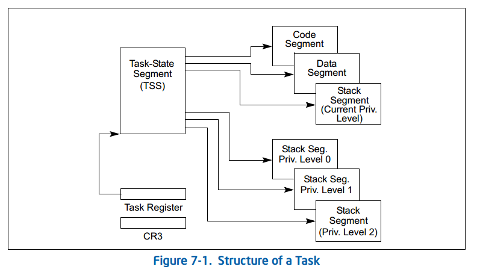
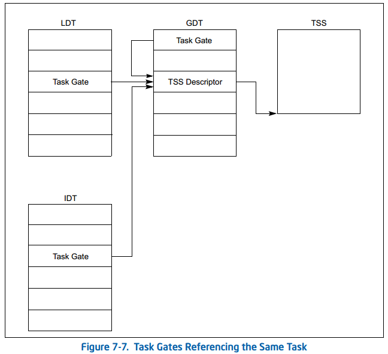

# 4. 任务管理

这一章描述 IA-32 架构下的任务管理工具。这些工具只有当处理器运行于保护模式下时才是可用的。

## 4.1. 任务管理概述

-   什么是任务？

    一个任务就是一个工作单元，处理器可对其进行调度、执行和挂起。任务可被用来执行一个程序、一个进程、一个操作系统服务例程、一个中断或异常处理例程，或一个内核或管理程序的实用程序。

-   `80x86` 提供了哪些硬件支持？

    *   任务状态段（Task-State Segment, TSS）
    *   任务门描述符（Task-Gate Descriptor）
    *   任务寄存器等

-   描述符表中与任务相关的描述符有哪些？

    TSS描述符、局部描述符表（Local Descriptor Table, LDT）描述符和任务门描述符。

-   任务切换与过程调用的区别是什么？

    任务切换和过程调用的区别在于任务切换会涉及到堆栈、处理器状态等更多的内容，在进行任务切换时需要保留原有任务的执行状态，而过程调用则不需要进行这些操作。

### 4.1.1. 任务的结构

-   一个任务由几部分构成？

    一个任务由两部分构成：

    *   任务执行空间
    *   任务状态段（TSS）

-   任务执行空间包括什么？

    任务执行空间由代码段、栈段、一个或多个的数据段组成（参考图 7-1）

     

-   为什么会有多个特权级栈空间？

    为了实现不同特权级之间的切换，需要使用不同特权级下的堆栈空间。

    若操作系统或管理程序使用了处理器的特权级保护机制，则执行空间还要为每一特权级提供一个独立的栈。

### 4.1.2. 任务状态

-   当前正在执行的任务状态包括哪些内容？

    当前正在执行的任务状态包括处理器状态、任务状态、堆栈指针等内容。

-   掌握每一个被包含内容的含义？

    *   任务的当前执行空间，由段寄存器（CS、DS、SS、ES、FS 和 GS）中的段选择子指定。
    *   通用寄存器的状态。
    *   EFLAGS 寄存器的状态。
    *   EIP 寄存器的状态。
    *   控制寄存器 CR3 的状态。
    *   任务寄存器的状态。
    *   LDTR 寄存器的状态。
    *   I/O 位图基地址和 I/O 位图（位于 TSS 中）。
    *   特权级 0、特权级 1 和特权级 2 的栈指针（位于 TSS 中）。
    *   指向前一个执行过的任务的链接（位于 TSS 中）。

    任务调度之前，除了任务寄存器的状态之外，所有上面这些项都保存在将要被调度的任务的 TSS 里。另外，TSS 中不包含完整的 LDTR 寄存器的内容，只有 LDT 的段选择子。

-   为什么要包含这些内容？

    包含这些内容是为了确保任务在被切换出去后，能够回到正确的执行状态。

### 4.1.3. 任务的执行

-   任务的执行方式有几种？

    软件或处理器可以用以下方式中的任何一种来调度任务执行：

    *   用 CALL 指令显式地调用任务。
    *   用 JMP 指令显式地跳转到任务。
    *   （由处理器）隐式地调用中断处理程序任务。
    *   隐式地调用异常处理程序任务。
    *   EFLAGS 寄存器的 NT 标志置位时的任务返回（由 IRET 指令发出）。

-   熟悉掌握每一种执行方式的过程

    所有这些调度方法都是用指向任务门或任务 TSS 的段选择子来识别被调度的任务的。当用 CALL 或 JMP 指令调度任务时，指令中的选择子可以直接指向 TSS，也可以指向包含 TSS 选择子的任务门。通过调度任务来处理中断或异常时，相应中断或异常对应的 IDT 项必须包含一个任务门，门中含有指向中断或异常处理程序任务的 TSS 的选择子。

    一个任务被调度执行时，会自动地在当前任务和被调任务之间发生任务切换。切换时，当前任务的执行环境（称做任务状态或场境（context））保存进其 TSS 中，该任务随即被挂起。然后，处理器加载被调任务的场境到各个寄存器中，从刚加载的 EIP 寄存器指向的指令处开始执行新任务。若该任务是系统上次初始化以来的首次执行，则 EIP 指向任务代码的第一条指令；否则，指向任务上次被挂起时执行的最后一条指令的下一条指令。

    如果是由当前任务（调用任务）调用了被调度的任务（被调任务）而发生了任务切换，则把调用任务的 TSS 的选择子保存到被调任务的 TSS 中，以提供返回调用任务的链接。

-   `Linux 0.00` 用的是哪种方式？

    *   用 CALL 指令显式地调用任务。
    *   用 JMP 指令显式地跳转到任务。

-   任务可以递归调用吗？为什么？

    所有 IA-32 架构的处理器都不允许任务递归。
    
    一个任务不能调用或跳转到它自身。

## 4.2. 任务的数据结构

处理器定义了 5 种数据结构来处理与任务相关的活动：

*   任务状态段（TSS）。
*   任务门描述符。
*   TSS 描述符。
*   任务寄存器。
*   EFLAGS 寄存器的 NT 标志。

当工作于保护模式时，要为至少一个任务创建 TSS 和 TSS 描述符，并把它的 TSS 的段选择子加载到任务寄存器中（使用 LTR 指令）。

-   任务状态段 Task-State Segment (TSS)

    恢复任务所需的处理器状态信息保存在一个称做任务状态段（TSS）的系统段中。图 7-2 显示了为 32 位 CPU 设计的任务 TSS 的格式。（为了和 16 位的 Intel 286 处理器任务兼容，还提供了另外一种 TSS，见图 7-9。）TSS 的域分为两部分：

    *   动态域

        任务切换时，处理器自动更新被挂起任务的动态域。下面是动态域：

        *   通用寄存器域
            任务切换前 EAX、ECX、EDX、EBX、ESP、EBP、ESI 和 EDI 等寄存器的状态。
        *   段选择子域
            任务切换前保存在 ES、CS、SS、DS、FS 和 GS 等寄存器中的段选择子。
        *   EFLAGS 寄存器域
            任务切换前 EFLAGS 寄存器的状态。
        *   EIP（指令指针）域
            任务切换前 EIP 寄存器的状态。
        *   前一个任务链接域
            包含前一个任务的 TSS 的段选择子（在由调用、中断或异常引起的任务切换时更新的）。该域（常称做返回链接域）允许调用 IRET 指令切换回前一个任务。

    *   静态域

        处理器读取静态域的数据，但通常不改变它们。这些域的内容是在创建任务时设置的。下面的是静态域：

        *   LDT 段选择子域
            包含任务 LDT 的段选择子。
        *   CR3 控制寄存器域
            包含任务使用的页目录表的物理基地址。控制寄存器 CR3 也被称做页目录表基地址寄存器（PDBR）。
        *   特权级 0、1、2 的栈指针域
            这些栈指针中包含由栈段（SS0、SS1 和 SS2）的段选择子和栈中偏移（ESP0、ESP1 和 ESP2）组成的逻辑地址。注意，对某个任务来说，这些域中的值是静态的。但是，如果任务中发生栈切换，则 SS 和 ESP 的值会改变。
        *   T（调试陷阱）标志（第 100 字节的第 0 位）
            当切换到 T 标志置位的任务时，将导致处理器产生一个调试异常。
        *   I/O 位图基地址域
            包含一个从 TSS 基地址到 I/O 许可位图和中断重定向位图的 16 位偏移。当这些位图存在时，它们存储在 TSS 的高地址区。I/O 位图基地址指向 I/O 许可位图的起始地址和中断重定向位图的末地址。

        任务转换时，处理器要读取 TSS 的部分内容（最前端的 104 字节）。如果开启了分页机制，必须注意避免使 TSS 的这部分跨越两个页面。如果确实出现这种情况，那么这两个内存页必须同时存在于内存中，且是连续的。

        这种限制的原因是，在任务切换中访问 TSS 时，处理器是从 TSS 第一个字节的物理地址开始连续读取和写入 104 个字节的。如果页边界正好出现在这个里面，则在页边界处不能进行地址转换（也就是说，后面一页的线性地址与前面一页未必连续。如果这样的话，则后面页不是前面页的后续页）。于是，在访问 TSS 时，如果 104 个字节的部分内容未在内存中，或存在但不连续，处理器将访问不正确的 TSS 信息，而不产生页故障异常。此后的任务切换会因为读取这些错误信息而导致不可恢复的异常事件。

        而且，如果使用了分页的话，则前一个任务的 TSS 和当前任务的 TSS 相应的页以及它们的描述符项都应该标为“读/写”。如果在任务切换之前包含所有这些数据结构的页都在内存中，则任务切换将会比较快。

     

     

-   `TSS` 描述符

    像所有其它段一样，TSS 也是通过段描述符定义的。图 7-3 显示了 TSS 描述符的格式。TSS 描述符只能放在 GDT 中，而不能放在 LDT 或者 IDT 中。

    在执行 CALL 或者 JMP 期间，试图用一个 TI 标志置位（表示在当前 LDT 中）的段选择子访问 TSS 会引起一般保护异常（#GP），并在执行 IRET 时引起非法 TSS 异常（#TS）。如果把 TSS 的段选择子加载进段寄存器，则会产生一般保护异常。

    类型域中的忙（B）标志指出任务是否忙。一个忙的任务当前正在运行或者被挂起。1001B 这个类型值表明是一个不活动的任务，1011B 表明是一个忙的任务。任务自身不能递归调用。处理器使用忙标志去探测对已经被中断任务的调用企图。为确保一个任务只有一个忙标志与之相关，每个 TSS 只能有一个 TSS 描述符指向它。

     

    基地址、界限、DPL、粒度、存在标志等域的作用与它们在数据段描述符中的用法类似。对 32 位 TSS 来说，如果 TSS 描述符中的 G 标志为 0，则界限域的值必须等于或大于 67H，也就是 TSS 最小长度少一个字节的数值。试图切换到TSS 描述符小于 67H 的任务将产生一个非法 TSS 异常（#TS）。如果 I/O 许可位图包含在TSS 中的话，则需要一个较大的界限。如果操作系统保存额外的数据在 TSS 中，则需要一个更大的界限。任务切换时，处理器不检验大于 67H 的界限，但是，当访问 I/O 许可位图或者中断重定向位图时，则要做检验的。

    任何一个可以访问 TSS 描述符的进程或者例程（也就是它的 CPL 的数值等于或者小于 TSS 描述符的 DPL）都可以通过调用或者跳转来调度这个任务。

    在大部分系统中，TSS 描述符的 DPL 应该设为比 3 小的值，因而只有特权软件可以执行任务切换。但是，在多任务应用系统中，可以把某些 TSS 描述符的 DPL 设为 3，以允许在应用程序特权级（用户态）进行任务切换。

     

-   任务寄存器

    任务寄存器保存 16 位段选择子和当前任务的 TSS 描述符的全部内容（32 位基地址、16 位段界限和描述符属性）。这些信息是从 GDT 中的当前任务的 TSS 描述符中复制出来的。图7-5显示了处理器访问TSS的路径（使用任务寄存器中的信息）。

     

    任务寄存器包括两个部分，一部分看得见（可被软件读或者修改），一部分看不见（由处理器维护，软件不可访问）。看得见部分的段选择子指向 GDT 中的 TSS 描述符。处理器使用任务寄存器中看不见的部分来高速缓存 TSS 的段描述符。高速缓存这些值使得任务的执行更加有效率，因为，处理器不需要从内存中取这些值来引用当前任务的 TSS 了。

    LTR（加载任务寄存器）和 STR（保存任务寄存器）指令用来加载和读取任务寄存器的可见部分。LTR 加载指向 GDT 中 TSS 描述符的段选择子（源操作数）到任务寄存器中，并且从 TSS 描述符中把不可见部分也加载进任务寄存器中。这是个特权指令，只有 CPL 为 0 时才能执行。LTR 指令一般用于系统初始化时期放置一个初始值在任务寄存器中。之后，任务寄存器的内容是在任务切换期间隐式的改变的。

    STR 指令把任务寄存器中看得见的部分保存进通用寄存器或者内存中。这个指令可以在任何特权级的代码中运行，用来识别当前运行任务。但是，它通常用于操作系统软件。

    在加电或者处理器复位的时候，任务寄存器的段选择子和基地址设为默认值 0，界限设为 FFFFH。

-   任务门描述符 Task-Gate Descriptor

    任务门描述符提供了对任务的间接、受保护的引用（参见图7-6）。它可以放置在GDT、LDT或IDT中。任务门描述符中的TSS段选择器字段指向GDT中的TSS描述符。没有使用此段选择器中的RPL。
    
     
    
    任务门描述符中的 DPL 控制着任务切换期间对 TSS 描述符的访问。当一个进程或者例程通过任务门调用或者跳转到一个任务时，它们的 CPL 和指向这个任务门的门选择子的 RPL 域必须小于或等于这个任务门描述符的 DPL。（注意，使用任务门的时候，不使用目标 TSS 描述符的 DPL。）
    
    只可通过任务门描述符或者 TSS 描述符来访问一个任务。这两种结构都用来满足下列需要：
    
    *   一个任务只有一个忙标志的需要。因为任务的这个忙标志是保存在 TSS 描述符中的，而每个任务应该只有一个 TSS 描述符。但是，可能有好几个任务门指向同一个 TSS 描述符。
    *   提供对任务选择性访问的需要。任务门满足了这个要求，因为它们可以放置在 LDT 中，并且有一个不同于 TSS 描述符 DPL 的 DPL。缺乏足够特权去访问 GDT 中某个任务的 TSS 描述符（它的 DPL 通常为 0）的进程或者例程，却可能通过具有较高 DPL 的任务门来访问这个任务。任务门给了操作系统较大的权限来限制对特定任务的访问。
    
    *   通过一个独立的任务来处理中断或异常的需要。任务门可以放置在 IDT 中，这就允许用一个处理程序任务来处理中断或者异常。当中断或者异常向量指向一个任务门时，处理器就切换到指定的任务。
    
    图7-7说明了LDT中的任务门、GDT中的任务门和IDT中的任务门是如何指向同一个任务的。
    
     

## 4.3. 任务切换

此部分内容重点掌握：

-   什么时候发生任务切换？

    下列四种方式中的任何一种都会导致处理器转移执行到另外一个任务：

    *   当前进程、任务或者例程执行一个 JMP 或者 CALL 指令到 GDT 中的一个 TSS 描述符。
    *   当前进程、任务或者例程执行一个 JMP 或者 CALL 指令到 GDT 或者当前 LDT 中的一个任务门描述符。
    *   一个中断或者异常向量，它指向 IDT 中的一个任务门描述符。
    *   当前任务执行了一个 IRET，此时 EFLAGS 寄存器中的 NT 标志是置位的。

    JMP、CALL 和 IRET 指令以及中断和异常都是重定向进程的通用机制。TSS 描述符或者任务门的引用（调用或者跳转到一个任务时）或者 NT 标志的状态（执行一个 IRET 指令时）决定着任务切换是否发生。

-   发生任务切换时，处理器会执行哪些操作？

    当往一个新任务切换时，处理器执行下列操作：

    1.   从 JMP 或 CALL 指令的操作数、任务门、前一个任务链接域（对于 IRET 指令引起的任务切换来说）等中获取新任务的 TSS 段选择子。
    2.   检验当前（老）任务是否允许切换到新任务。将数据访问特权规则应用于 JMP 和 CALL 指令。当前（老）任务的 CPL 和新任务段选择子的 RPL 必须小于或等于被访问的 TSS 描述符或任务门的 DPL。允许异常、中断（INT n 指令产生的中断除外）和 IRET 指令等切换任务而不管目的任务门或 TSS 描述符的 DPL。对于 INT n 指令产生的中断，是要检验 DPL 的。
    3.   检验新任务的 TSS 描述符标有“存在”标志并且界限合法（大于或者等于 67H）。
    4.   检验新任务是可用（调用、跳转、异常或中断）或者忙（IRET 返回）的。
    5.   检验当前（老）TSS、新 TSS 和所有用于任务切换的段描述符都被分页到系统内存中。
    6.   如果是由 JMP 或者 IRET 指令发动的任务切换，则处理器清除当前（老）任务的 TSS 描述符的忙（B）标志；如果是由 CALL 指令、异常或者中断发动的，则忙（B）标志还保持置位。
    7.   如果是由 IRET 指令发动的任务切换，则处理器清除临时保存的 EFLAGS 寄存器映像中的 NT 标志；如果是由 CALL 指令、JMP 指令、异常或者中断发动的，则映像中的NT 标志还保持不变。
    8.   保存当前（老）任务的状态到当前任务的 TSS 中。处理器从任务寄存器中找出当前 TSS 的基地址，然后复制下列寄存器的状态到当前 TSS 中：所有的通用寄存器、段寄存器中的段选择子、临时保存的 EFLAGS 寄存器映像和指令指针寄存器（EIP）。
    9.   如果是由 CALL 指令、异常或者中断发动的任务切换，处理器将设置从新任务中加载的 EFLAGS 寄存器中的 NT 标志。如果是由 IRET 指令、JMP 指令发动的，则 NT 标志将反映出从新任务中加载的 EFLAGS 寄存器中的 NT 标志的状态。
    10.   如果是由 CALL 指令、JMP 指令、异常或者中断发动的任务切换，处理器将置位新任务的 TSS 描述符中的忙（B）标志；如果是由 IRET 指令发动的，则忙（B）标志保持置位。
    11.   用段选择子和新任务的 TSS 描述符加载任务寄存器。
    12.   TSS 状态加进处理器，包括：LDTR 寄存器、PDBR（控制寄存器 CR3）、EFLAGS 寄存器、EIP 寄存器、通用寄存器和段选择子。注意，加载过程中的故障会破坏架构状态。
    13.   与段选择子相关的描述符被加载和考核。这个加载和考核过程中出现的任何错误都是发生在新任务的场境中。
    14.   开始执行新任务。（对异常处理程序来说，新任务的第一条指令好像还没被执行。）

    >**注意：**
    >此时，如果所有的检验和保存都成功完成，则处理器提交任务切换。如果在第 1 到 11 步中出现不可恢复的错误，处理器不完成任务切换并且确保处理器回到发动任务切换那条指令执行之前的状态。如果在第 12 步出现不可恢复的错误，架构状态可能被破坏，但是会试图在前执行环境中处理错误。如果在提交点（第 13 步）之后发生不可恢复的错误，则处理器完成任务切换（不会执行额外的访问和段可用性检验）并且在开始执行新任务之前产生一个合适的异常。如果异常发生在提交点之后，则异常处理程序本身必须在开始执行新任务的执行之前完成任务切换。

    当任务成功切换时，当前运行任务的状态总是被保存了。如果任务是重新执行的，则从保存的 EIP 的值所指的指令开始执行，寄存器都恢复成任务挂起时候的拥有值。
    当切换任务时，新任务不继承挂起任务的特权级。新任务在 CS 寄存器中的 CPL 域所指定的特权级上执行，这个值是从 TSS 中加载的。因为任务是通过它们各自的地空间和 TSS 等隔绝开的，也因为特权规则控制着对 TSS 的访问，所以任务切换时软件不需要显式地检验特权规则。

-   中断或异常向量指向 `IDT` 表中的中断门或陷阱门，会发生任务切换吗？

    处理器切换任务时检查的异常情况如表7-1所示。它还显示了在检测到错误时为每次检查生成的异常以及错误代码引用的段。
    
    （表中检查的顺序是P6系列处理器中使用的顺序。确切的顺序是特定型号的，可能与其他IA-32处理器不同。）如果设计用于处理这些异常的异常处理程序试图重新加载生成异常的段选择器，则可能会受到递归调用的影响。应该在重新加载选择器之前修复异常的原因（或多个原因中的第一个）。
    
     
    
     
    
    **备注：**
    1．#NP 是段不存在异常，#GP 是一般保护异常，#TS 是非法 TSS 异常，#SF 是栈故障异常。
    2．错误码包含一个对本栏所述段的描述符的索引。
    3．如果段选择子位于相容类型的表（GDT 或者 LDT）中，占据着表段界限内的一个地址，并且指向一个相容类型的描述符（比如，仅当 CS 寄存器中的段选择子指向一个代码段描述符时才是合法的）时，则它是合法的。
    一旦任务切换发生时，CR0 寄存器中的 TS（任务切换）标志就被置位。当处理器的其余部分产生浮点异常时，系统软件使用 TS 标志来协调浮点单元的操作。TS 标志指出浮点单元的场境可能不同于当前任务。

## 4.4. 任务链

-   如何判断任务是否嵌套？

    NT 标志表明当前任务是否在另外一个任务执行中的嵌套执行。

-   什么情况会发生任务嵌套？

    当 CALL 指令、中断或者异常引起任务切换时。

    >   **注意：**
    >   当 JMP 指令引起任务切换时，新任务是不嵌套的。也就是，NT 标志置零，前一个任务链接域不使用。当不希望嵌套时，使用 JMP 指令来调度任务。

-   任务嵌套时修改了哪些标志位？

    处理器复制当前 TSS 的段选择子到新任务的 TSS 中的前一个任务链接域中，然后置位 EFALGS 寄存器中的 NT 标志。NT 标志表明当前 TSS 的前一个任务链接域已经加载了已保存的 TSS 段选择子。

-   任务嵌套时，如何返回前一任务？

    TSS 的前一个任务链接域（有时称作“返回链接”）和 EFLAGS 寄存器的 NT 标志用于返回执行到前一个任务。
    
    如果软件使用 IRET 指令挂起一个新任务，则处理器使用前一个任务链接域中的值和 NT 标志返回到前一个任务。也就是，如果 NT 标志是置位的，则处理器执行任务切换至前一个任务链接域中指定的任务。

 

表 6-2 总结了任务切换期间忙标志（在 TSS 段描述符中）、NT 标志、前一个任务链接域和 TS 标志（在控制寄存器 CR0 中）等的用法。注意，NT 标志可被运行在任何特权级上的软件修改。进程设置自己的 NT 标志，然后执行一个 IRET 指令去调用当前任务TSS 的前一个任务链接域指定的任务，这是有可能的。为防止成功地进行虚假的任务切换，操作系统应该把它创建的每个 TSS 的前一个任务链接域初始化为 0。

 

 

## 4.5. 任务地址空间

-   什么是任务地址空间？

    任务地址空间是操作系统为每个任务分配的虚拟内存地址空间。

-   任务地址空间包括什么？

    任务的地址空间由任务可以访问的段构成，包括：TSS 中引用的代码、数据、栈、系统等段，以及任务代码访问的其它段。

-   了解把任务映射到线性和物理地址空间的方法？

    用下列两种方法之一可以映射任务到线性地址空间和物理地址空间：

    *   所有任务共享同一种线性——物理地址空间映射方法。当关闭分页时，这是唯一的选择。没有分页，所有的线性地址映射到相同的物理地址。当开启分页时，为所有任务使用一张页目录表也可以获得这种线性——物理地址空间映射方法。如果支持请求分页虚拟内存的话，则线性地址空间会超过可用的物理空间。
    *   每个任务有它自己的映射到物理地址空间的线性地址空间。通过为每个任务使用一个不同的页目录表可以做到这种形式的映射。因为每次任务切换时都要加载 PDBR（CR3 控制寄存器），每个任务可以有一个不同的页目录表。

    不同任务的线性地址空间可以映射到完全不同的物理地址中。如果不同的页目录表项指向不同的页表，页表指向不同的物理页，那么，任务之间就不会共享任何物理地址。不管用两种方法中的哪一种映射任务的线性地址空间，所有任务的 TSS 必须放置在一个共享的物理区域中，以便所有任务都可访问。这种映射是需要的，以便任务切换期间处理器读取和修改 TSS 的时候，TSS 的地址映射不改变。由 GDT 映射的线性地址空间也应该映射到共享物理空间区域，否则，GDT的目的就失败了。图7-9展示了两个任务的线性地址空间如何通过共享页表在物理空间中重叠。

    

-   了解任务逻辑地址空间，及如何在任务之间共享数据的方法？

    为了在任务间共享数据，使用下列任何一种技术都可建立针对数据段的共享逻辑——物理地址空间映射：
    
    *   通过 GDT 中的段描述符。所有任务都必须具有访问 GDT 中段描述符的权限。如果 GDT 中有段描述符指向的线性地址空间中的段映射到共享物理地址空间（对所有任务而言）中，那么，所有任务都可共享这些数据和代码段。
    *   通过一个共享的 LDT。两个或多个任务可以使用同样的 LDT，只要它们的 TSS 中的 LDT 域指向同一个 LDT。如果共享 LDT 中的某些段描述符指向的段被映射到物理地址空间中的同一个区域，则这些段中的数据和代码可在这些共享 LDT 的任务中共享。这种共享方法比通过 GDT 共享更具选择性，因为共享可以被限制到某些特定的任务上。系统中的其它任务可以有不同的 LDT，因为不给它们访问共享段的权限。
    *   通过不同 LDT 中映射到同一个线性地址空间中的段描述符。如果对每个任务来说，这同一线性地址空间被映射到同一物理地址空间，则这些段描述符就允许任务共享这些段。这些段描述符通常被称为别名。这种共享方法比前面列出的两种更具选择性，因为 LDT 中的其它段描述符可以指向不共享的独立线性地址。