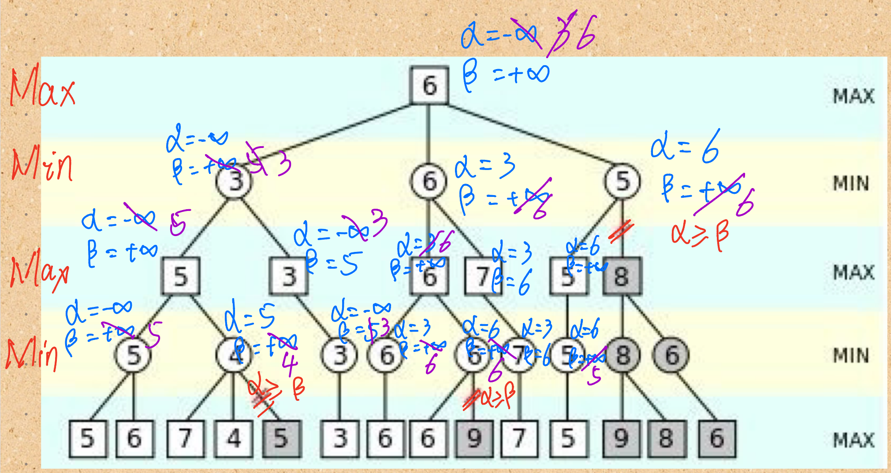

# $\alpha - \beta 剪枝$

## 题目

 

根据上图推导alpha-beta剪枝算法计算过程

## 推导过程

首先将根节点置为$\alpha = -\infty \space \beta=+\infty$,先递归传递到左侧最后的MIN层，然后以递归的方式一条分支一条分支遍历。递归时传递前一层结点的 $\alpha \space \beta$ 值，回溯时更新父节点的 $\alpha \space \beta$ 值。更新规则如下：

$\alpha=max{\{\alpha_{当前节点},\alpha_{回溯来源子节点},\beta_{回溯来源子节点}\}}$ 

$\beta = min{\{\beta_{当前节点},\alpha_{回溯来源子节点},\beta_{回溯来源子节点}\}}$

Max层只更新$\alpha$，Min层只更新$\beta$

当$\alpha >= \beta$时，该节点的右子树被剪枝。

## 原理

1. α代表的是你的收益将不小于α

2. β代表的是你的收益将不大于β

   当α大于β时表示此时的收益将比α大，比β小，明显是个空集。所以这个时候进行剪枝

   等于的时候，当前结点的收益已经完全确定，当前结点的未探索的儿子们就都不需要探索了

## 模拟过程

蓝色为递归过程向下传递父节点的值，紫色是向上回溯更新值。红色双斜线是剪枝。

