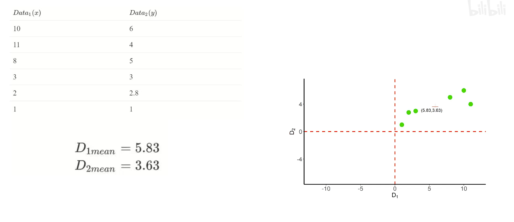
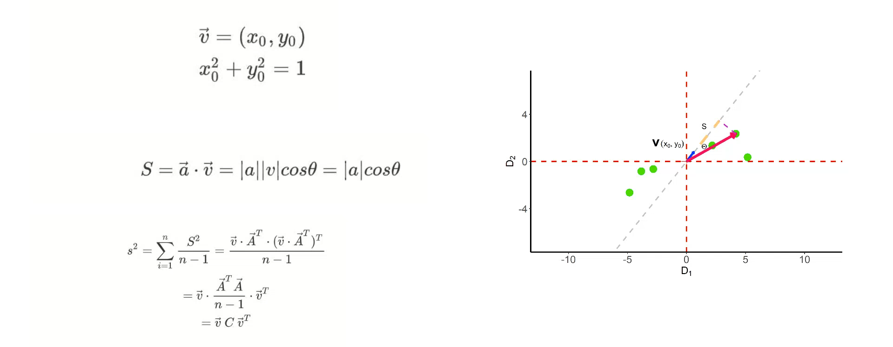
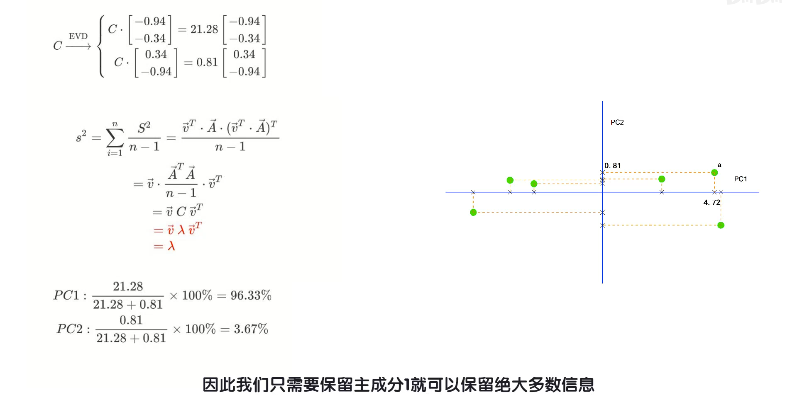

[TOC]

<head>
    
    
</head>

# 无监督学习

## 学习

[主成分分析（PCA）的原理和简单推导_哔哩哔哩_bilibili](https://www.bilibili.com/video/BV1X54y1R7g7/?spm_id_from=333.337.search-card.all.click&vd_source=fcc159fddd96c65e388dd46f651ad556)

## 题目

> PCA 的算法步骤：
>
> 1. 将原始数据按列组成 n 行 m 列矩阵 X；
> 2. 将 X 的每一列进行零均值化，即减去这一列的均值；
> 3. 求出协方差矩阵 $C=\frac{1}{m}X^TX$ ；
> 4. 求出协方差矩阵的特征值及对应的特征向量；
> 5. 将特征向量按对应特征值大小从上到下按列排列成矩阵，取前 k 列组成矩阵 P；
> 6. Y=PX 即为降维到 k 维后的数据。
>
> 求下面左边数据的降维的结果为右边数据

1. 将原始数据按列组成 n 行 m 列矩阵 X；

$$
X = \left[
 \begin{matrix}
 	x & y 	\\ 
	10 & 9 	\\
	2 & 3	\\
	1 & 2	\\
	7 & 6.5 \\
	3 & 2.5 \\
  \end{matrix}
  \right]
$$

2. 将 X 的每一列进行零均值化，即减去这一列的均值；

$$
\overline{x} = 4.6
$$

$$
\overline{y} = 4.6
$$

$$
X = \left[
 \begin{matrix}
 	x & y 	\\ 
	5.4 & 4.4 	\\
	-2.6 & -1.6	\\
	-3.6 & -2.6	\\
	2.4 & 1.9 \\
	-1.6 & -2.1 \\
  \end{matrix}
  \right]
$$

3. 求出协方差矩阵 $C=\frac{1}{m}X^TX$ ；

$$
C = \frac{1}{m}X^TX =
\left [
 \begin{matrix}
   	11.44 & 9.04 \\
  	9.04 & 7.34 \\
  \end{matrix}
\right]
$$

4. 求出协方差矩阵的特征值及对应的特征向量；

协方差矩阵**特征值**
$$
\left[
	\begin{matrix}
	18.65952534 & 0.12047466
	\end{matrix}
\right]
$$

协方差矩阵的**特征向量**是：
$$
\left[
	\begin{matrix}
	0.78139452 &  -0.62403734 \\
	0.62403734 &  0.78139452
	\end{matrix}
\right]
$$
**特征值**从大到小排序的序列号是：
$$
\left [
	\begin{matrix}
	0 & 1
	\end{matrix}
\right ]
$$

5. 将特征向量按对应特征值大小从上到下按列排列成矩阵，取前 k 列组成矩阵 P；

$$
P = \left[
	\begin{matrix}
	0.78139452 \\
    0.62403734
	\end{matrix}
\right]
$$

6. Y=PX 即为降维到 k 维后的数据。

降维后的数据是：
$$
\left [
	\begin{matrix}
	  6.96529471 \\
      -3.0300855 \\
      -4.43551736\\
       3.0610178 \\
      -2.56070965\\

	\end{matrix}
\right ]
$$

特征向量本身就是一个族，所以特征向量中 A = kA

上式乘个-1就和目标特征向量一致了

$$
\left [
	\begin{matrix}
	  -6.96529471 \\
      3.0300855 \\
      4.43551736\\
      -3.0610178 \\
      2.56070965\\

	\end{matrix}
\right ]
$$
