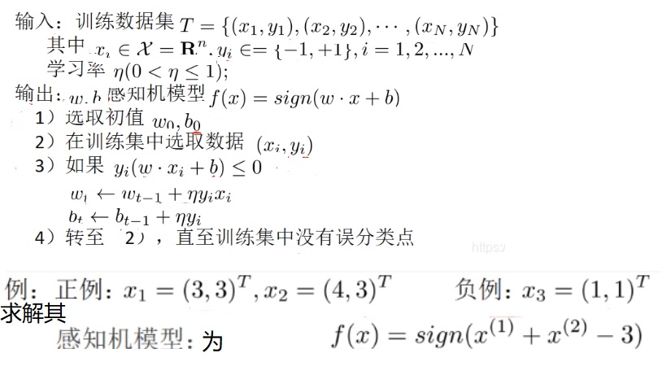
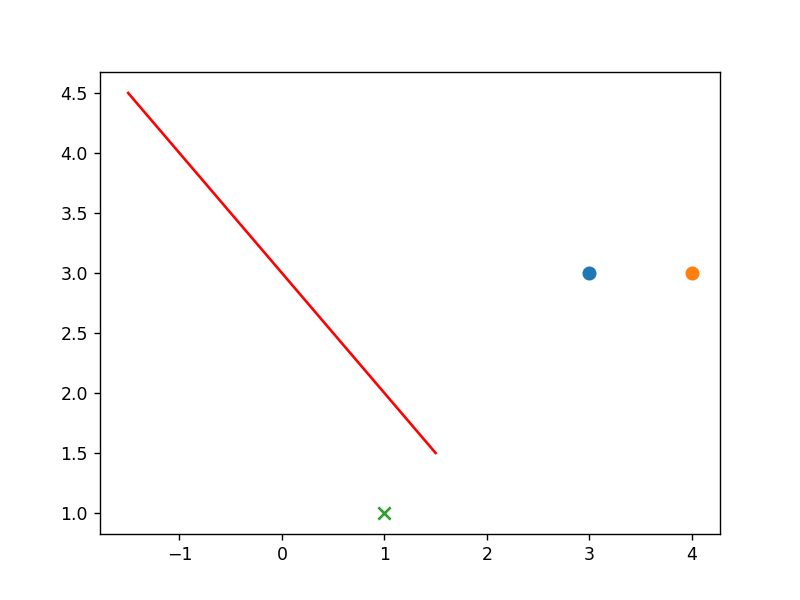

​	

[TOC]

# 人工神经网络-感知机

## 学习

[一文读懂感知机算法 - 知乎 (zhihu.com)](https://zhuanlan.zhihu.com/p/72040253)

## 题目

 

**解：**

感知机模型为

 
$$
f(x) = sign(x_1 *w_0 + x_2*w_1 - 3)
$$

 

1. 选取初值 $w_0=1$，$w_1=1$，$b_0=-1，$$lr=0.5$

2. 选取数据$(x_1,x_2,y)$$(3,3,1) (4,3,1) (1,1,-1)$

3.  
    $$
    如果 y_i * sign(x_1 *w_0 + x_2*w_1 - 3) \Leftarrow 0
    $$

$$
w[0] = w[0] + lr * y * x1
$$

$$
w[1] = w[1] + lr * y * x2
$$

$$
b = b + lr * y
$$

4. 转至 2 ，继续选取数据更新，直到训练集中没有误分类的点

**代码执行如下**

迭代 100 轮之后得到

$w_0 = 0.5$ 

$w_1=0.5$ 

$b=-1.5$

以此为划分的图像如下

 