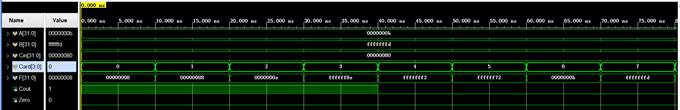
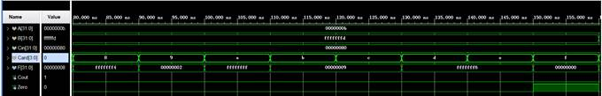

# **实验要求**

1．  实验必须提前预习，不预习不允许参加实验。

2．  实验内容按时完成，教师在课上根据完成情况给出成绩。

3．  实验不得缺席，否则将不参加最终成绩的评定；任何一个实验题目不能完成也不参加最终成绩的评定。

4．  实验环节考核不通过者，不得参加考试，也不参加最终成绩的评定。

5．  实验如果不能在指定时间完成，需降低评分，但要求必须完成。

6．  可根据设计的创新情况作适当加分处理。

7．  按时完成实验报告，在每个实验结束后一周内完成实验报告。


# **实验报告撰写规范**

1．  实验方案部分包括系统设计要求、系统概述、技术方案、关键技术和进度安排等内容。

2．  实验设计部分包括结构设计（含系统框图和各部件功能概述）、系统工作原理描述（工作过程简述）、外接口定义（管脚定义及功能）、系统详细设计（各部件功能详述，设计方法，Verilog程序等）、系统测试（测试方案，测试波形等）等内容。

3．  实验测试部分包括测试准备条件、系统功能概述、系统功能测试（每项功能作为一个部分，要包括功能描述、测试过程和期望的测试结果）。

#  **实验项目表**

| 序号 | 实 验 项 目              | 学时 | 实验要求 | 实验类别 | 每组人数 |
| ---- | ------------------------ | ---- | -------- | -------- | -------- |
| 1    | ALU（算术逻辑单元）设计  | 3    | 必修     | 设计     | 1        |
| 2    | 给定指令系统的处理器设计 | 12   | 必修     | 设计     | 1        |
| 3    | 流水线处理器设计         | 6    | 必修     | 设计     | 3        |
| 4    | 指令Cache的设计与实现    | 3    | 必修     | 设计     | 1        |

# **实验一 ALU（算术逻辑单元）设计**

| 预习成绩 | 实验成绩 | 报告成绩 | 总成绩 | 教师签字 |
| -------- | -------- | -------- | ------ | -------- |
|          |          |          |        |          |

## 一、实验目的

1．掌握Vivado集成开发环境

2．掌握Verilog语言基本知识

3．掌握Verilog语言设计并实现组合逻辑电路

## 二、实验预习

1．写出ALU（算术逻辑单元）的16种运算的编码

```verilog
1.	`define ADD             5'b00000
2.	`define ADD_CIN         5'b00001
3.	`define A_SUB_B         5'b00010
4.	`define A_SUB_B_CIN     5'b00011
5.	`define B_SUB_A         5'b00100
6.	`define B_SUB_A_CIN     5'b00101
7.	`define IS_A            5'b00110
8.	`define IS_B            5'b00111
9.	`define NOT_A           5'b01000
10.	`define NOT_B           5'b01001
11.	`define OR              5'b01010
12.	`define AND             5'b01011
13.	`define XNOT            5'b01100
14.	`define XOR             5'b01101
15.	`define NOT_AB          5'b01111
16.	`define IS_ZERO         5'b10000
```

## 三、实验环境（实验设备、开发环境）（预习）

实验设备： 笔记本电脑

开发环境： Vivado 2019.2

 ## 四、实验设计

写出带有详细注释的Verilog实现代码：

`LAB1_ALU.v`

```verilog
`define ADD             4'b0000
`define ADD_CIN         4'b0001
`define A_SUB_B         4'b0010
`define A_SUB_B_CIN     4'b0011
`define B_SUB_A         4'b0100
`define B_SUB_A_CIN     4'b0101
`define IS_A            4'b0110
`define IS_B            4'b0111
`define NOT_A           4'b1000
`define NOT_B           4'b1001
`define OR              4'b1010
`define AND             4'b1011
`define XNOT            4'b1100
`define XOR             4'b1101
`define NOT_AB          4'b1110
`define IS_ZERO         4'b1111
	
module LAB3_ALU(
    input [31:0] A ,     // 操作数
    input [31:0] B ,     // 操作数
    input [31:0]Cin ,    // 进位
    input [3 :0] Card ,  // 操作码
    output [31:0] F ,    // 运算结果
    output Cout ,        // 结果进位
    output Zero          // 零标志位
    );
	    
    // 保存16种运算各自的结果
    wire [31:0] add_ans;
    wire [31:0] add_cin_ans;
    wire [31:0] a_sub_b_ans;
    wire [31:0] a_sub_b_sub_cin_ans;
    wire [31:0] b_sub_a_ans;
    wire [31:0] b_sub_a_sub_cin_ans;
    wire [31:0] is_a_ans;
    wire [31:0] is_b_ans;
    wire [31:0] not_a_ans;
    wire [31:0] not_b_ans;
    wire [31:0] a_or_b_ans;
    wire [31:0] a_and_b_ans;
    wire [31:0] a_xnor_b_ans;
    wire [31:0] a_xor_b_ans;
    wire [31:0] not_ab_ans;
    wire [31:0] zero_ans;
	
    //  进位
    wire [1:0] Cout_a;
    wire [1:0] Cout_b;
    wire [1:0] Cout_c;
    wire [1:0] Cout_d;
    wire [1:0] Cout_e;
    wire [1:0] Cout_f;
 
    //  连续赋值
    assign {Cout_a, add_ans} = A + B;
    assign {Cout_b, add_cin_ans} = A + B + Cin;
    assign {Cout_c, a_sub_b_ans} = A - B;
    assign {Cout_d, a_sub_b_sub_cin_ans} = A - B - Cin;
    assign {Cout_e, b_sub_a_ans} = B - A;
    assign {Cout_f, b_sub_a_sub_cin_ans} = B - A - Cin;
    assign is_a_ans = A;
    assign is_b_ans = B;
    assign not_a_ans = ~A;
    assign not_b_ans = ~B;
    assign a_or_b_ans = A | B;
    assign a_and_b_ans = A & B;
    assign a_xnor_b_ans = ~(A ^ B);
    assign a_xor_b_ans = A ^ B;
    assign not_ab_ans = ~(A & B);
    assign zero_ans = 0;
 
    //  计算结果：通过Card对应的运算，在多个计算结果中选择正确的运算赋值给F
    assign F =  ({32{Card == `ADD}} & add_ans) |
                ({32{Card == `ADD_CIN}} & add_cin_ans) | 
                ({32{Card == `A_SUB_B}} & a_sub_b_ans) | 
                ({32{Card == `A_SUB_B_CIN}} & a_sub_b_sub_cin_ans) | 
                ({32{Card == `B_SUB_A}} & b_sub_a_ans) | 
                ({32{Card == `B_SUB_A_CIN}} & b_sub_a_sub_cin_ans) | 
                ({32{Card == `IS_A}} & is_a_ans) | 
                ({32{Card == `IS_B}} & is_b_ans) | 
                ({32{Card == `NOT_A}} & not_a_ans) | 
                ({32{Card == `NOT_B}} & not_b_ans) | 
                ({32{Card == `OR}} & a_or_b_ans) | 
                ({32{Card == `AND}} & a_and_b_ans) | 
                ({32{Card == `XNOT}} & a_xnor_b_ans) | 
                ({32{Card == `XOR}} & a_xor_b_ans) | 
                ({32{Card == `NOT_AB}} & not_ab_ans) | 
                ({32{Card == `IS_ZERO}} & zero_ans);
	 
    //  判断是否产生进位
    assign Cout =  (Card == `ADD && Cout_a != 0)|
        (Card == `ADD_CIN && Cout_b != 0) |
        (Card == `A_SUB_B && Cout_c != 0) |
        (Card == `A_SUB_B_CIN && Cout_d != 0) |
        (Card == `B_SUB_A && Cout_e != 0) |
        (Card == `B_SUB_A_CIN && Cout_f != 0);

    //  判断结果是否位0
    assign Zero = F == 0;
	
	endmodule
```

`ALU_tb.v`

```verilog
`timescale 1ns / 1ns

module ALU_tb;
    // Inputs，由于本实现中，只输入一次，利用寄存器类型记录输入
    reg [31:0] A;
    reg [31:0] B;
    reg [31:0] Cin;
    reg [3:0] Card;

    // Outputs，由于输出要实时改变，利用wire类型，及时捕捉计算结果的更改
    wire [31:0] F;
    wire Cout;
    wire Zero;

    // Instantiate the Unit Under LAB3_ALU (Init_Alu)
    LAB3_ALU Init_Alu (
        .A(A), 
        .B(B), 
        .Cin(Cin), 
        .Card(Card), 

        .F(F), 
        .Cout(Cout), 
        .Zero(Zero)
    );

	initial begin
        // Initialize Inputs
        A = {32'b1011};  // +11
        B = {-32'b11};   // -3
        Cin = $random() % (32'h0000_00ff); // 随机一个输入进位值
        Card = 4'b0000 ; // 从第一种运算方式开始计算

        #160 ; // 计算出第一轮的结果后，更新输入，重新计算
        A = {32'b1011}; // +11
        B = {32'b11};   // +3
    end
 
     always begin // 对不同的输入分别计算一次，每10ns输出一种结果，160ns完成一组输入的计算
         #10 Card = (Card + 1) % 16 ;
         if ($time >= 320) $finish ;
     end
endmodule
```

## **五、**测试结果及实验分析

测试波形与测试结果：

 

 


| 运算功能     | A(H)      | B(H)      | Cin       | 操作码  （五位） | F(H)      | Zero |
| ------------ | --------- | --------- | --------- | ---------------- | --------- | ---- |
| F=A加B       | 0000_000b | ffff_fffd | 0000_0080 | 5’b00000         | 0000_0008 | 0    |
| F=A加B加Cin  | 0000_000b | ffff_fffd | 0000_0080 | 5’b00001         | 0000_0088 | 0    |
| F=A减B       | 0000_000b | ffff_fffd | 0000_0080 | 5’b00010         | 0000_000e | 0    |
| F=A减B减Cin  | 0000_000b | ffff_fffd | 0000_0080 | 5’b00011         | ffff_ff8e | 0    |
| F=B减A       | 0000_000b | ffff_fffd | 0000_0080 | 5’b00100         | ffff_fff2 | 0    |
| F= B减A减Cin | 0000_000b | ffff_fffd | 0000_0080 | 5’b00101         | ffff_ff72 | 0    |
| F=A          | 0000_000b | ffff_fffd | 0000_0080 | 5’b00110         | 0000_000b | 0    |
| F=B          | 0000_000b | ffff_fffd | 0000_0080 | 5’b00111         | ffff_fffd | 0    |
| F=/A         | 0000_000b | ffff_fffd | 0000_0080 | 5’b01000         | ffff_fff4 | 0    |
| F=/B         | 0000_000b | ffff_fffd | 0000_0080 | 5’b01001         | 0000_0002 | 0    |
| F=A+B        | 0000_000b | ffff_fffd | 0000_0080 | 5’b01010         | ffff_ffff | 0    |
| F=AB         | 0000_000b | ffff_fffd | 0000_0080 | 5’b01011         | 0000_0009 | 0    |
| F=A⊙B        | 0000_000b | ffff_fffd | 0000_0080 | 5’b01100         | 0000_0009 | 0    |
| F=A⊕B        | 0000_000b | ffff_fffd | 0000_0080 | 5’b01101         | ffff_fff6 | 0    |
| F=/(AB)      | 0000_000b | ffff_fffd | 0000_0080 | 5’b01110         | ffff_fff6 | 0    |
| F=0          | 0000_000b | ffff_fffd | 0000_0080 | 5’b01111         | 0000_0000 | 0    |

实验结果分析：

1.   两个32位有符号数加减：
      $[X]_补 = X_s X_{30}X_{29}…X_1X_0$
      $[Y]_补 = Y_s Y_{30}Y_{29}…Y_1Y_0$
      其和（差）为：$[S]_补 = S_s S_{30}S_{29}…S_1S_0$
      当 $X_s = Y_s = 0$，$S_s = 1$ 时，产生正溢。
      当 $X_s = Y_s = 1$，$S_s = 0$ 时，产生负溢。
      result次高位与S符号位保持一致，$result = S_sS_s S_{30}S_{29}…S_1S_0$。

2.   两个32位无符号数加减
     $ [X]_补 = 0X_{31}X_{30}X_{29}…X_1X_0$
     $ [Y]_补 = 0Y_{31}Y_{30}Y_{29}…Y_1Y_0$
     $ [-Y]_补 = 1Y_{31}’Y_{30}’Y_{29}’…Y_1’Y_0’$
      其和（差）为：$[S]_补 = S_s S_{31}S_{30}S_{29}…S_1S_0$
      加法：当 $S_s = 1$ 时，产生正溢。
      减法：当 $S_s = 0$ 时，产生正溢。
      result最高位符号位恒置0，$result = 0S_{31}S_{30}S_{29}…S_1S_0$。

根据实验结果可以看出整数运算的有符号和无符号数运算都可以兼容，且计算结果正确。

对输入进位Cin随即赋值，得到的加减计算的结果也均正确。

Cout在加减运算时有赋值，其余计算中没有用到，所以处于0状态。

Zero在 F=0 运算中拉高，其余计算中没有用到。

16种运算操作，有4位操作码就够用了，因为刚开始学不是很懂，可能是全零位有别的用处吧。

## 六、实验总结

在本次实验中，初步了解了verilog的基本语法，实现了一个具有16种运算功能的简单ALU。

对位运算有了进一步的了解。