# 实验二测试环境说明

lab2文件夹为计算机组织与体系结构课程实验2-非流水线CPU实验测试环境。

## 目录
```
├── lab_2
│   ├── lab_2.srcs             所有用户编写的源码、仿真文件与约束文件，你在项目中创建的文件可以在这里找到
│   ├── lab2.data              自动化测试所使用的trace文件的文件夹
│   │   ├── cpu_trace          用于对比验证的的trace文件
│   │   ├── data_data.txt      数据缓冲存储器的初始化文件
│   │   ├── inst_data.txt      指令缓冲存储器的初始化文件
│   └── lab_2.xpr              实验所用的项目，直接双击即可打开完整的实验 Vivado 工程
└── readme.md                  本文档
```

## 测试样例

测试所用的指令序列：

```
数据缓冲：
for i in range(0, 84, 4):
    Mem[i] = i >> 2

指令缓冲：
0x0000:  8C 01 00 04    LW   $1,  4($0)
0x0004:  8C 02 00 08    LW   $2,  8($0)
0x0008:  00 22 18 20    ADD  $3,  $1,  $2
0x000c:  00 22 20 22    SUB  $4,  $1,  $2
0x0010:  00 22 28 24    AND  $5,  $1,  $2
0x0014:  00 22 30 25    OR   $6,  $1,  $2
0x0018:  00 22 38 26    XOR  $7,  $1,  $2
0x001c:  00 22 40 2A    SLT  $8,  $1,  $2
0x0020:  AC 01 00 08    SW   $1,  8($0)
0x0024:  AC 02 00 04    SW   $2,  4($0)
0x0028:  10 05 00 02    BEQ  $0,  $5,  0x2  // taken to 0x34
0x002c:  AC 01 00 00    SW   $1,  0($0)
0x0030:  08 00 00 00    J    0              // back to start
0x0034:  08 00 00 0F    J    0x15           // jumps to 0x3c
0x0038:  AC 01 00 00    SW   $1,  0($0)
0x003c:  8C 00 00 00    LW   $0,  0($0)
0x0040:  00 00 00 00    NOP
0x0044:  08 00 00 00    J    0              // back to start
```

trace:

| pc       | addr | data     |
| -------- | ---- | -------- |
|          |      |          |
| 00000000 | 01   | 00000001 |
| 00000004 | 02   | 00000002 |
| 00000008 | 03   | 00000003 |
| 0000000c | 04   | ffffffff |
| 00000010 | 05   | 00000000 |
| 00000014 | 06   | 00000003 |
| 00000018 | 07   | 00000003 |
| 0000001c | 08   | 00000001 |
| 00000030 | 00   | 00000000 |
| 0000003c | 00   | 00000000 |

## 一、实验目的

1．掌握 Vivado 集成开发环境

2．掌握Verilog语言

3．掌握FPGA编程方法及硬件调试手段

4．深刻理解处理器结构和计算机系统的整体工作原理

## 二、实验环境（实验设备、开发环境）

• Windows10

• Vivado 集成开发环境和龙芯 Artix-7 实验平台

## 三、设计思想（实验预习）<font color=green size=5>* 多周期CPU设计</font>

1\. CPU接口信号定义，写下表

| 信号名            | 位数 | 方向（I/O） | 来源/去向                              | 意义                             |
| ----------------- | ---- | ----------- | -------------------------------------- | -------------------------------- |
| clk               | 1    | I           | cpu_top/Decoder, PC, regfile, data_mem | 时钟频率100MHz                   |
| resetn            | 1    | I           | cpu_top/Decoder, PC, regfile, data_mem | 数据重置                         |
| Debug_wb_pc       | 32   | O           | /instr_mem，PC，Strcat                 | 当前正在执行的指令的PC           |
| Debug_wb_rf_wen   | 1    | O           | /Decoder，regfile                      | 当前通用寄存器组的写使能信号     |
| Debug_wb_rf_addr  | 5    | O           | /regfile                               | 当前通用寄存器组写回的寄存器编号 |
| Debug_wb_rf_wdata | 32   | O           | /regfile, mux                          | 当前指令需要写回的数据           |

**CPU的设计主要完成两件事**

1. 根据所设计的所有汇编指令的功能及指令格式，完成CPU的数据通路设计
2. 根据指令功能和数据通路设计控制部件

### 1. 数据通路设计

### （1） 指令格式设计

R类指令的  OPcode 均为 6‘b000000

| 指令格式           | Function   | 具体操作                                            | 附加描述                              |
| :----------------- | :--------- | :-------------------------------------------------- | :------------------------------------ |
| `add $d,$s,$t`     | `100000`   | `$d = $s + $ t`                                     | `32位,加，有符号，可以捕获到溢出状态` |
| `sub $d,$s,$t`     | `100010`   | `$d=$s-$t`                                          | `减法运算`                            |
| `and $d, $s, $t`   | `100100`   | `$d = $s & $t`                                      | `按位与`                              |
| `or $d, $s, $t`    | `100101`   | `$d =$s|$t`                                         | `按位或`                              |
| `xor $d, $s, $t`   | `100110`   | `$d=$s^$t`                                          | `异或运算`                            |
| `slt $d,$s,$t`     | `101010`   | `if($s<$t) $d=1 ; else $d=0`                        | `有符号比较`                          |
| `movz $d, $s, $t`  | `001010`   | `if($rt == 0) $d = $s`                              | `条件移动指令`                        |
|                    |            |                                                     |                                       |
| **指令格式**       | **OpCode** | **具体操作**                                        | **附加描述**                          |
| `lw $t,offset($s)` | `100011`   | `$t=MEM[$s+offset]`                                 | `从内存读取一个字`                    |
| `sw $t,offset($s)` | `101011`   | `MEM[$s+offset] = $t`                               | `将一个字拷到内存`                    |
| `j target`         | `000010`   | `PC = nPC; nPC = (PC & 0xf0000000) | (target « 2);` | `跳到一个计算过的地址，并执行`        |

### （2）处理器结构设计框图及功能描述

多周期CPU设计的基本原则是，

* 首先，在多周期CPU中的某些资源可以复用，比如

  * ALU，既可以完成算数和逻辑运算，也可以用于PC的增值运算，因为它们的操作在不同的周期中完成，所以可以复用ALU。

  * 可以使用一个指令和数据公用的存储器，里面有指令内存和数据内存，由于读取指令和读取操作数的操作是在不同的周期中。

* 其次，每个周期结束时要把本周期的结果保存到某个寄存器中，以便下个周期可使用。所以增加了一个指令寄存器IR和一个暂存器Y。
  * IR的作用是存放读出的指令，供以后的周期使用
  * Y的作用是存放ALU运算的结果，供以后的周期使用

 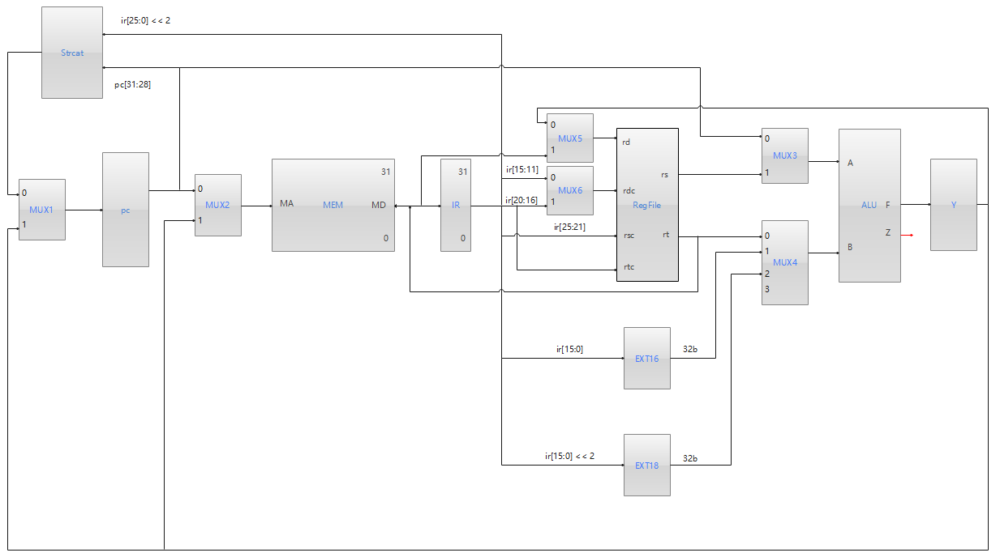

### 2. 控制器设计

> 用有限状态机实现多周期CPU的控制部件，可以用时序电路来实现多周期CPU的控制部件，主要工作是确定状态转移图及输出逻辑。
>
> 结构逻辑图如下

 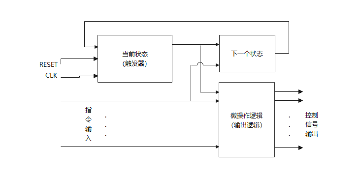

需要把指令完全拆分，最后可以在每个时钟周期内完成指令的一部分

<font color=blue size=4>先将指令拆分成 取指 + 执行 </font>

#### 1）画指令流程图

<font color=green size=5>运算指令</font>

##### R类指令

###### **ADD**

 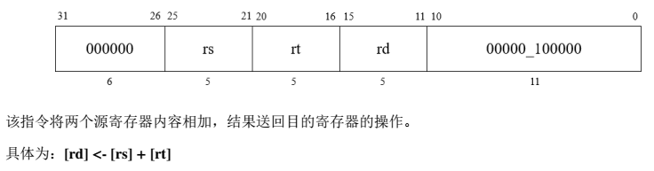

* **取指令**

  * T1
    * pc -> MA		// 先将 pc 的地址送到存储器 MEM 的MA上，然后对 MEM 发送一个读信号 (M_R)
    * pc+4 -> Y		// pc 送到 ALU 完成加 4 后送入暂存器Y 
    * MD -> IR		// 将指令从 MEM 读出 (MD) 送入IR

  * T2
    * Y -> pc			// 暂存器Y的内容送回 pc，完成 pc 增值

* **执行指令**

  * T3
    * rs + rt -> Y	// 先将 rs 和 rt 的内容送到 ALU ，完成 ADD 运算后，送入Y
  * T4
    * Y -> rd			// 将Y中内容写回 rd
  * END

###### **SUB**

 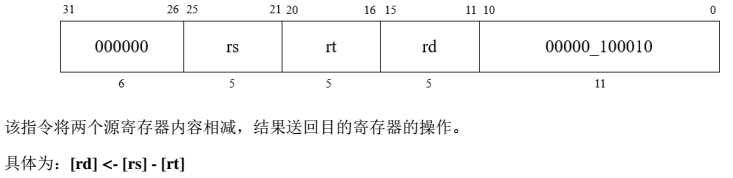

* **取指令**

  * T1
    * pc -> MA		// 先将 pc 的地址送到存储器 MEM 的MA上，然后对 MEM 发送一个读信号 (M_R)
    * pc+4 -> Y		// pc 送到 ALU 完成加 4 后送入暂存器Y 
    * MD -> IR		// 将指令从 MEM 读出 (MD) 送入IR

  * T2
    * Y -> pc			// 暂存器Y的内容送回 pc，完成 pc 增值

* **执行指令**

  * T3
    * rs - rt -> Y	// 先将 rs 和 rt 的内容送到 ALU ，完成 SUB 运算后，送入Y
  * T4
    * Y -> rd			// 将Y中内容写回 rd
  * END

###### **AND**

 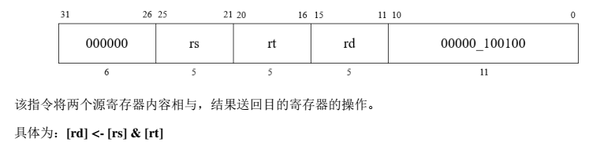

* **取指令**

  * T1
    * pc -> MA		// 先将 pc 的地址送到存储器 MEM 的MA上，然后对 MEM 发送一个读信号 (M_R)
    * pc+4 -> Y		// pc 送到 ALU 完成加 4 后送入暂存器Y 
    * MD -> IR		// 将指令从 MEM 读出 (MD) 送入IR

  * T2
    * Y -> pc			// 暂存器Y的内容送回 pc，完成 pc 增值

* **执行指令**

  * T3
    * rs + rt -> Y	// 先将 rs 和 rt 的内容送到 ALU ，完成 AND 运算后，送入Y
  * T4
    * Y -> rd			// 将Y中内容写回 rd
  * END

###### **OR**

 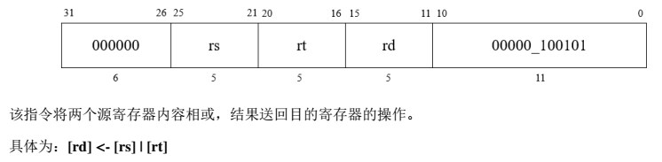

* **取指令**

  * T1
    * pc -> MA		// 先将 pc 的地址送到存储器 MEM 的MA上，然后对 MEM 发送一个读信号 (M_R)
    * pc+4 -> Y		// pc 送到 ALU 完成加 4 后送入暂存器Y 
    * MD -> IR		// 将指令从 MEM 读出 (MD) 送入IR

  * T2
    * Y -> pc			// 暂存器Y的内容送回 pc，完成 pc 增值

* **执行指令**

  * T3
    * rs + rt -> Y	// 先将 rs 和 rt 的内容送到 ALU ，完成 OR 运算后，送入Y
  * T4
    * Y -> rd			// 将Y中内容写回 rd
  * END

###### **XOR**

 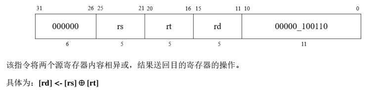

* **取指令**

  * T1
    * pc -> MA		// 先将 pc 的地址送到存储器 MEM 的MA上，然后对 MEM 发送一个读信号 (M_R)
    * pc+4 -> Y		// pc 送到 ALU 完成加 4 后送入暂存器Y 
    * MD -> IR		// 将指令从 MEM 读出 (MD) 送入IR

  * T2
    * Y -> pc			// 暂存器Y的内容送回 pc，完成 pc 增值

* **执行指令**

  * T3
    * rs + rt -> Y	// 先将 rs 和 rt 的内容送到 ALU，完成 XOR 运算后，送入Y
  * T4
    * Y -> rd			// 将Y中内容写回 rd
  * END

###### **SLT**

 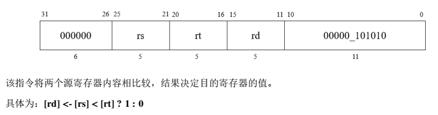

* **取指令**

  * T1
    * pc -> MA		// 先将 pc 的地址送到存储器 MEM 的MA上，然后对 MEM 发送一个读信号 (M_R)
    * pc+4 -> Y		// pc 送到 ALU 完成加 4 后送入暂存器Y 
    * MD -> IR		// 将指令从 MEM 读出 (MD) 送入IR

  * T2
    * Y -> pc			// 暂存器Y的内容送回 pc，完成 pc 增值

* **执行指令**

  * T3
    * rs + rt -> Y	// 先将 rs 和 rt 的内容送到 ALU ，完成 SLT 运算后，送入Y
  * T4
    * Y -> rd			// 将Y中内容写回 rd
  * END

###### **MOVZ**

 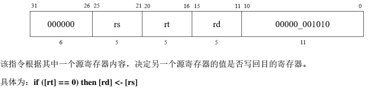

* **取指令**

  * T1
    * pc -> MA		// 先将 pc 的地址送到存储器 MEM 的MA上，然后对 MEM 发送一个读信号 (M_R)
    * pc+4 -> Y		// pc 送到 ALU 完成加 4 后送入暂存器Y 
    * MD -> IR		// 将指令从 MEM 读出 (MD) 送入IR

  * T2
    * Y -> pc			// 暂存器Y的内容送回 pc，完成 pc 增值

* **执行指令**

  * T3
    * rs + rt -> Y	// 先将 rs 和 rt 的内容送到 ALU ，完成 MOVZ 运算后，送入Y
  * T4
    * Y -> rd			// 将Y中内容写回 rd
  * END

##### <font color=green size=5>I类指令</font>

 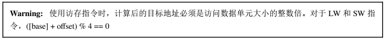

###### **LW**

 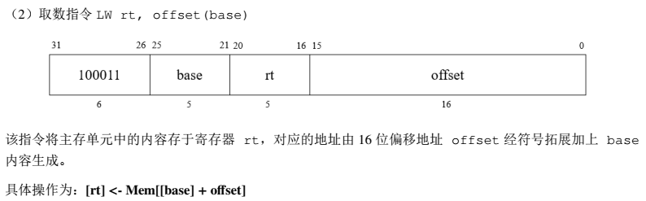

* **取指令**

  * T1
    * pc -> MA		// 先将 pc 的地址送到存储器 MEM 的MA上，然后对 MEM 发送一个读信号 (M_R)
    * pc+4 -> Y		// pc 送到 ALU 完成加 4 后送入暂存器Y 
    * MD -> IR		// 将指令从 MEM 读出 (MD) 送入IR

  * T2
    * Y -> pc			// 暂存器Y的内容送回 pc，完成 pc 增值

* **执行指令**

  * T3
    * base + Sign_ext_offset -> Y	// 将 base 和 offset 经过 EXT16 扩展为32位后的地址偏移送入 ALU ，完成 ADD 运算后，将计算得到的有效地址送入Y
  * T4
    * Y -> rd			// 将Y中内容送到 MEM 的地址 MA 上，然后对 MEM 发送一个读信号 (M_R)，将操作数从 MEM 中的 MD 送到 rd
  * END  

###### **SW**

 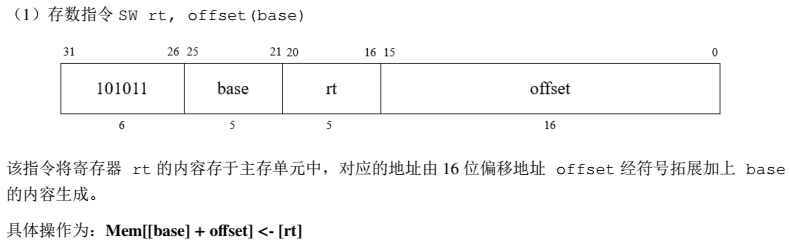

* **取指令**

  * T1
    * pc -> MA		// 先将 pc 的地址送到存储器 MEM 的MA上，然后对 MEM 发送一个读信号 (M_R)
    * pc+4 -> Y		// pc 送到 ALU 完成加 4 后送入暂存器Y 
    * MD -> IR		// 将指令从 MEM 读出 (MD) 送入IR

  * T2
    * Y -> pc			// 暂存器Y的内容送回 pc，完成 pc 增值

* **执行指令**

  * T3
    * base + Sign_ext（offset） -> Y	// 将 base 和 offset 经过 EXT16 扩展为32位后的地址偏移送入 ALU ，完成 ADD 运算后，将计算得到的有效地址送入Y
  * T4
    * Y -> rd			// 将Y中内容送到 MEM 的地址 MA 上，发送一个写信号 (M_W) ，将 rt 操作数写入 MEM
  * END  

 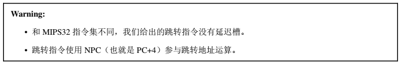

###### **BEQ**

 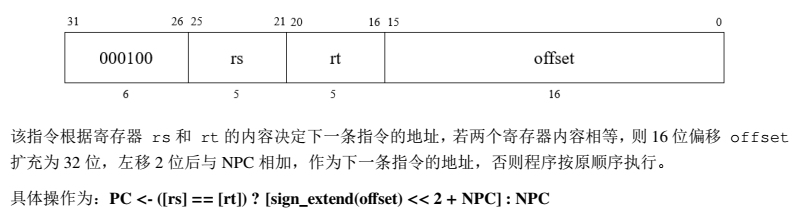

* * T1
    * pc -> MA		// 先将 pc 的地址送到存储器 MEM 的MA上，然后对 MEM 发送一个读信号 (M_R)
    * pc+4 -> Y		// pc 送到 ALU 完成加 4 后送入暂存器Y 
    * MD -> IR		// 将指令从 MEM 读出 (MD) 送入IR

  * T2
    * Y -> pc			// 暂存器Y的内容送回 pc，完成 pc 增值

* **执行指令**

  * T3
    * rs - rt == 0	// yes 则继续执行 T4、T5 ，否则指令执行结束
  * T4
    * pc + Sign_ext(offset << 2) -> Y	// 将 pc 和经过右移两位后的 18 位地址偏移 offset 经过 EXT18 符号扩展为 32 位后一起送入 ALU ，完成 ADD 运算，将形成的有效地址送入 Y
  * T5
    * Y -> pc		// 将 BEQ 执行的跳转地址送入 pc
  * END  

##### <font color=green size=5>J类指令</font>

###### **J**

 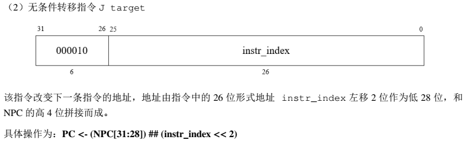

* **取指令**

  * T1
    * pc -> MA		// 先将 pc 的地址送到存储器 MEM 的MA上，然后对 MEM 发送一个读信号 (M_R)
    * pc+4 -> Y		// pc 送到 ALU 完成加 4 后送入暂存器Y 
    * MD -> IR		// 将指令从 MEM 读出 (MD) 送入IR

  * T2
    * Y -> pc			// 暂存器Y的内容送回 pc，完成 pc 增值

* **执行指令**
  * T3
    * pc[31:28] ## (instruction[25:0] << 2) -> pc	// 计算出 jump 的跳转地址
  * END  

#### 2）编排指令操作时间表

先将数据通路中的所有控制信号列出一张表，再依据每条指令的操作流程图，结合数据通路，将每套指令执行时所需的控制信号填入表中。

1. 将数据通路中所有控制信号列成一张表
   | 控制信号（微操作） | 控制信号说明                       |
   | ------------------ | ---------------------------------- |
   | PC_out             | pc 输出控制信号                    |
   | M2                 | MUX2 选择器控制信号                |
   | M_R                | 主存储器读信号                     |
   | IR_in              | 指令存储器读入信号                 |
   | PC_in              | pc 输入信号                        |
   | Rsc4-0             | rs 寄存器选择输入控制信号          |
   | Rtc4-0             | rt 寄存器选择输入控制信号          |
   | Rs_R               | rs 读信号                          |
   | Rt_R               | rt 读信号                          |
   | M3                 | MUX3 选择器控制信号                |
   | M4_0               | MUX4 选择器控制信号0               |
   | M4_1               | MUX4 选择器控制信号1               |
   | ALUC_0             | ALU 控制端0                        |
   | ALUC_1             | ALU 控制端1                        |
   | ALUC_2             | ALU 控制端2                        |
   | Y_in               | Y 暂存器输入信号                   |
   | Y_out              | Y 暂存器输出信号                   |
   | M5                 | MUX5 选择器控制信号                |
   | Rdc4-0             | rd 寄存器选择输入控制端            |
   | Rd_W               | rd 写信号                          |
   | M_W                | 主存储器写信号                     |
   | M1                 | MUX1 选择器控制信号                |
   | S                  | S == 1 符号扩展，S == 0 无符号扩展 |


 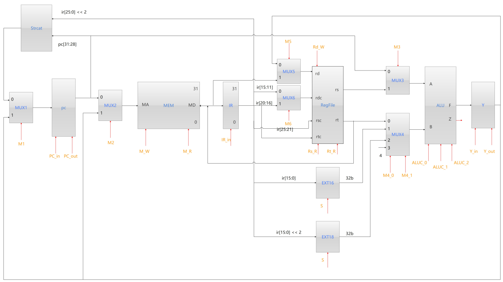

| 控制信号     | 取指 | 取指 | ADD       | ADD       | SUB       | SUB       | AND       | AND       | OR        | OR        | XOR       | XOR       | SLT       | SLT       | MOVZ      | MOVZ      | LW        | LW        | SW        | SW   | BEQ（Z=1） | BEQ（Z=1） | BEQ（Z=1） | J    |
| ------------ | ---- | ---- | --------- | --------- | --------- | --------- | --------- | --------- | --------- | --------- | --------- | --------- | --------- | --------- | --------- | --------- | --------- | --------- | --------- | ---- | ---------- | ---------- | ---------- | ---- |
| **(微操作)** | T1   | T2   | T3        | T4        | T3        | T4        | T3        | T4        | T3        | T4        | T3        | T4        | T3        | T4        | T3        | T4        | T3        | T4        | T3        | T4   | T3         | T4         | T5         | T3   |
| PC_out       | 1    | 0    | 0         | 0         | 0         | 0         | 0         | 0         | 0         | 0         | 0         | 0         | 0         | 0         | 0         | 0         | 0         | 0         | 0         | 0    | 0          | 1          | 0          | 1    |
| M2           | 0    | 0    | 0         | 0         | 0         | 0         | 0         | 0         | 0         | 0         | 0         | 0         | 0         | 0         | 0         | 0         | 0         | 1         | 0         | 1    | 0          | 0          | 0          | 0    |
| M_R          | 1    | 0    | 0         | 0         | 0         | 0         | 0         | 0         | 0         | 0         | 0         | 0         | 0         | 0         | 0         | 0         | 0         | 1         | 0         | 0    | 0          | 0          | 0          | 0    |
| IR_in        | 1    | 0    | 0         | 0         | 0         | 0         | 0         | 0         | 0         | 0         | 0         | 0         | 0         | 0         | 0         | 0         | 0         | 0         | 0         | 0    | 0          | 0          | 0          | 0    |
| PC_in        | 0    | 1    | 0         | 0         | 0         | 0         | 0         | 0         | 0         | 0         | 0         | 0         | 0         | 0         | 0         | 0         | 0         | 0         | 0         | 0    | 0          | 0          | 1          | 1    |
| Rsc4-0       |      |      | ir[25:21] |           | ir[25:21] |           | ir[25:21] |           | ir[25:21] |           | ir[25:21] |           | ir[25:21] |           | ir[25:21] |           | ir[25:21] |           | ir[25:21] |      | ir[25:21]  |            |            |      |
| Rtc4-0       |      |      | ir[20:16] |           | ir[20:16] |           | ir[20:16] |           | ir[20:16] |           | ir[20:16] |           | ir[20:16] |           | ir[20:16] |           |           |           |           |      | ir[20:16]  |            |            |      |
| Rs_R         | 0    | 0    | 1         | 0         | 1         | 0         | 1         | 0         | 1         | 0         | 1         | 0         | 1         | 0         | 1         | 0         | 1         | 0         | 1         | 0    | 1          | 0          | 0          | 0    |
| Rt_R         | 0    | 0    | 1         | 0         | 1         | 0         | 1         | 0         | 1         | 0         | 1         | 0         | 1         | 0         | 1         | 0         | 0         | 0         | 0         | 1    | 1          | 0          | 0          | 0    |
| M3           | 0    | 0    | 1         | 0         | 1         | 0         | 1         | 0         | 1         | 0         | 1         | 0         | 1         | 0         | 1         | 0         | 1         | 0         | 1         | 0    | 1          | 1          | 0          | 0    |
| M4_1         | 1    | 0    | 0         | 0         | 0         | 0         | 0         | 0         | 0         | 0         | 0         | 0         | 0         | 0         | 0         | 0         | 0         | 0         | 0         | 0    | 0          | 1          | 0          | 0    |
| M4_0         | 1    | 0    | 0         | 0         | 0         | 0         | 0         | 0         | 0         | 0         | 0         | 0         | 0         | 0         | 0         | 0         | 1         | 0         | 1         | 0    | 0          | 0          | 0          | 0    |
| ALUC_2       | 0    | 0    | 0         | 0         | 0         | 0         | 0         | 0         | 0         | 0         | 1         | 0         | 1         | 0         | 1         | 0         | 0         | 0         | 0         | 0    | 0          | 0          | 0          | 0    |
| ALUC_1       | 0    | 0    | 0         | 0         | 0         | 0         | 1         | 0         | 1         | 0         | 0         | 0         | 0         | 0         | 1         | 0         | 0         | 0         | 0         | 0    | 0          | 0          | 0          | 0    |
| ALUC_0       | 0    | 0    | 0         | 0         | 1         | 0         | 0         | 0         | 1         | 0         | 0         | 0         | 1         | 0         | 0         | 0         | 0         | 0         | 0         | 0    | 1          | 0          | 0          | 0    |
| Y_in         | 1    | 0    | 1         | 0         | 1         | 0         | 1         | 0         | 1         | 0         | 1         | 0         | 1         | 0         | 1         | 0         | 1         | 0         | 1         | 0    | 0          | 1          | 0          | 0    |
| Y_out        | 0    | 1    | 0         | 1         | 0         | 1         | 0         | 1         | 0         | 1         | 0         | 1         | 0         | 1         | 0         | 1         | 0         | 1         | 0         | 1    | 0          | 0          | 1          | 0    |
| M5           | 0    | 0    | 0         | 0         | 0         | 0         | 0         | 0         | 0         | 0         | 0         | 0         | 0         | 0         | 0         | 0         | 0         | 1         | 0         | 0    | 0          | 0          | 0          | 0    |
| M6           | 0    | 0    | 0         | 0         | 0         | 0         | 0         | 0         | 0         | 0         | 0         | 0         | 0         | 0         | 0         | 0         | 0         | 1         | 0         | 0    | 0          | 0          | 0          | 0    |
| Rdc4-0       |      |      |           | ir[15:11] |           | ir[15:11] |           | ir[15:11] |           | ir[15:11] |           | ir[15:11] |           | ir[15:11] |           | ir[15:11] |           | ir[20:16] |           |      |            |            |            |      |
| Rd_W         | 0    | 0    | 0         | 1         | 0         | 1         | 0         | 1         | 0         | 1         | 0         | 1         | 0         | 1         | 0         | 1         | 0         | 1         | 0         | 0    | 0          | 0          | 0          | 0    |
| M_W          | 0    | 0    | 0         | 0         | 0         | 0         | 0         | 0         | 0         | 0         | 0         | 0         | 0         | 0         | 0         | 0         | 0         | 0         | 0         | 1    | 0          | 0          | 0          | 0    |
| M1           | 0    | 1    | 0         | 0         | 0         | 0         | 0         | 0         | 0         | 0         | 0         | 0         | 0         | 0         | 0         | 0         | 0         | 0         | 0         | 0    | 0          | 0          | 0          | 0    |
| S            | 0    | 0    | 0         | 0         | 0         | 0         | 0         | 0         | 0         | 0         | 0         | 0         | 0         | 0         | 0         | 0         | 1         | 0         | 1         | 0    | 0          | 0          | 0          | 0    |

#### 3）进行微操作综合

按照所有机器指令的操作时间表，把相同的微操作综合起来，得到每个微操作的逻辑表达式。

共 24 个控制信号

1. **PC_out** = T1 | (T4&BEQ) | (T3&J)
2. **M2** = T4 & (LW | SW)
3. **M_R** = T1 | (T4 & LW)
4. **IR_in** = T1
5. **PC_in** = T2 | (T5 & BEQ) | (T3 & J)
6. **Rsc4-0** = ir[25:21]
7. **Rtc4-0** = ir[20:16]
8. **Rs_R** = T3 & (ADD | SUB | AND | OR | XOR | SLT | MOVZ | BEQ | LW | SW)
9. **Rt_R** = [T3 & (ADD | SUB | AND | OR | XOR | SLT | MOVZ | BEQ | LW)] | (T4 & SW)
10. **M3** = [T3 & (ADD | SUB | AND | OR | XOR | SLT | MOVZ | BEQ | LW | SW)] | (T4 & BEQ)
11. **M4_1** = T1 | (T4 & BEQ)
12. **M4_0** = T1 | [T3 & (LW | SW)]
13. **ALUC_2** = T3 & (XOR | SLT | MOVZ)
14. **ALUC_1** = T3 & (AND| OR | MOVZ)
15. **ALUC_0** = T3 & (SUB| OR | SLT | BEQ)
16. **Y_in** = T1 | [T3 & (ADD | SUB | AND | OR | XOR | SLT | MOVZ | LW | SW)] | (T4&BEQ)
17. **Y_out** = T2 | [T4 & (ADD | SUB | AND | OR | XOR | SLT | MOVZ | LW | SW)] | (T5&BEQ)
18. **M5** = (T4 & LW)
19. **M6** = (T4 & LW)
20. **Rdc4-0** = `ir[15:11]`(ADD | SUB | AND | OR | XOR | SLT | MOVZ | LW | SW) + `ir[20:16]`LW
21. **Rd_W** = T4 & (ADD | SUB | AND | OR | XOR | SLT | MOVZ | LW) 
22. **M_W** = S_W
23. **M1** = T2 | (T5&BEQ)
24. **S** = T3 & (LW | SW)

#### 4）多周期 CPU 的控制部件的状态转移图

 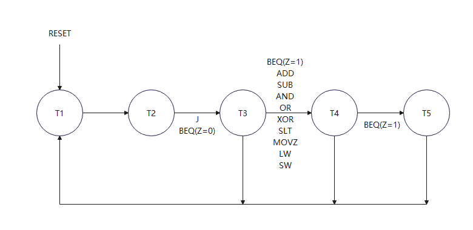

<font face="华文琥珀" size=4>11条指令有限状态机转移表</font>

| 当前状态 | 输入                                      | 输入 | 输入 | 输入 | 下个状态 |
| -------- | ----------------------------------------- | ---- | ---- | ---- | -------- |
| T        | ADD、SUB、AND、OR、XOR、SLT、MOVZ、LW、SW | J    | BEQ  | Z    | T'       |
| T1       | X                                         | X    | X    | X    | T2       |
| T2       | X                                         | X    | X    | X    | T3       |
| T3       | 0                                         | 0    | 1    | 0    | T1       |
| T3       | 0                                         | 0    | 1    | 1    | T4       |
| T3       | 0                                         | 1    | 0    | 0    | T1       |
| T3       | 1                                         | 0    | 0    | 0    | T4       |
| T4       | 1                                         | X    | 0    | X    | T1       |
| T4       | 0                                         | 0    | 1    | X    | T5       |


<font face="华文琥珀" size=4>二进制11条指令有限状态机转移表</font>

| 当前状态 | 当前状态 | 当前状态 | 输入                                      | 输入 | 输入 | 输入 | 下个状态 | 下个状态 | 下个状态 |
| -------- | -------- | -------- | ----------------------------------------- | ---- | ---- | ---- | -------- | -------- | -------- |
| t2       | t1       | t0       | ADD、SUB、AND、OR、XOR、SLT、MOVZ、LW、SW | J    | BEQ  | Z    | t2'      | t1'      | t0'      |
| 0        | 0        | 0        | X                                         | X    | X    | X    | 0        | 0        | 1        |
| 0        | 0        | 1        | X                                         | X    | X    | X    | 0        | 1        | 0        |
| 0        | 1        | 0        | 0                                         | 0    | 1    | 0    | 0        | 0        | 0        |
| 0        | 1        | 0        | 0                                         | 0    | 1    | 1    | 0        | 1        | 1        |
| 0        | 1        | 0        | 0                                         | 1    | 0    | 0    | 0        | 0        | 0        |
| 0        | 1        | 0        | 1                                         | 0    | 0    | 0    | 0        | 1        | 1        |
| 0        | 1        | 1        | 1                                         | X    | 0    | X    | 0        | 0        | 0        |
| 0        | 1        | 1        | 0                                         | 0    | 1    | X    | 1        | 0        | 0        |

根据上表列出状态转换的逻辑表达式
$$
t_0' = \overline{t_2}\space\overline{t_1}\space\overline{t_0}+\overline{t_2}t_1\overline{t_0}BEQ\Z+\overline{t_2}t_1\overline{t_0}(ADD+SUB+AND+OR+XOR+SLT+MOVZ+LW+SW)
$$

$$
t_1'=\overline{t_2}\space\overline{t_1}t_0 + overline{t_2}t_1\overline{t_0}BEQ\Z+\overline{t_2}t1\overline{t_0}(ADD+SUB+AND+OR+XOR+SLT+MOVZ+LW+SW)
$$

$$
t_2' = \overline{t_2}t_1t_0BEQ
$$

上面三个逻辑表达式可以由当前状态形成下一个状态，“当前状态”由 D 触发器构成，保存当前状态

 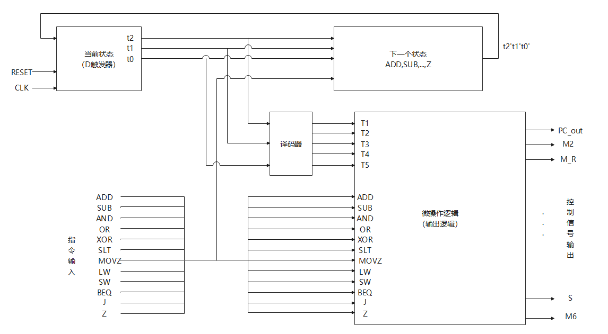

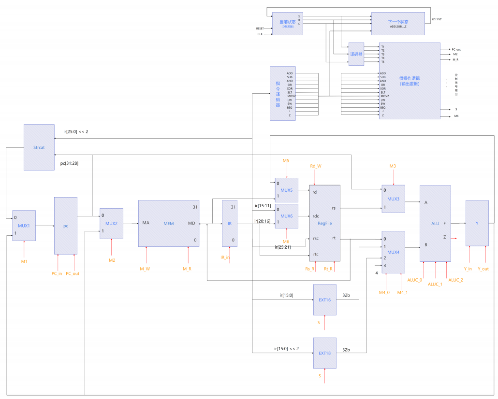

### 3. 代码实现

只有思路哦
