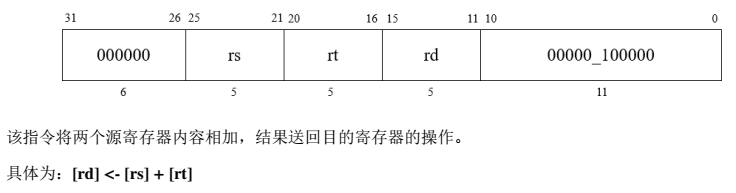
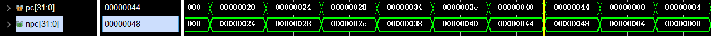
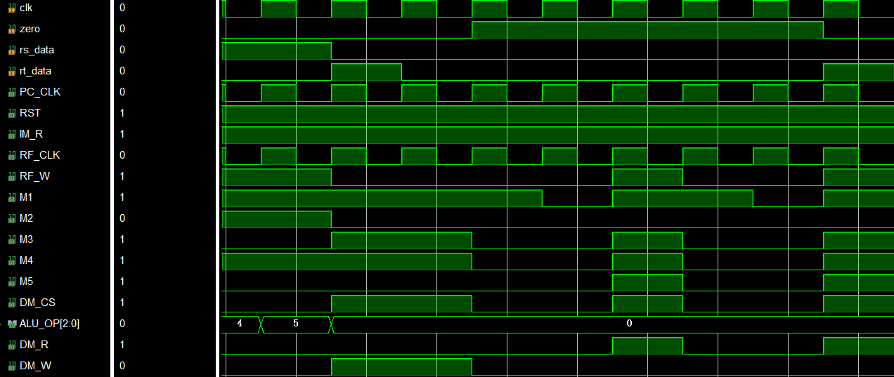
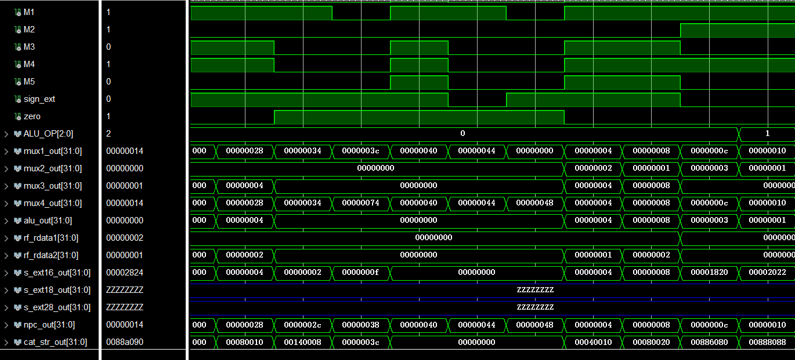
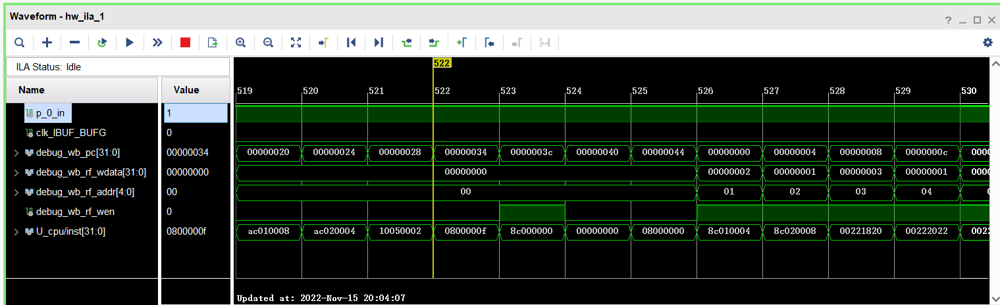
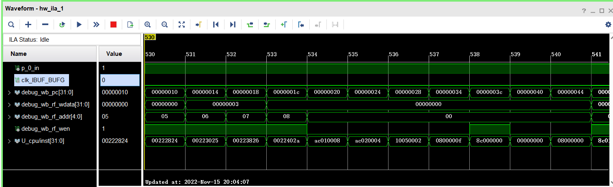

[TOC]

# **实验二 给定指令系统的处理器设计**

​	<font face="华文琥珀" size=4>樊启元 - 7203610712</font>

## 零、实验二测试环境说明

lab2文件夹为计算机组织与体系结构课程实验2-非流水线CPU实验测试环境。

### 目录

```
├── lab_2
│   ├── lab_2.srcs             所有用户编写的源码、仿真文件与约束文件，你在项目中创建的文件可以在这里找到
│   ├── lab2.data              自动化测试所使用的trace文件的文件夹
│   │   ├── cpu_trace          用于对比验证的的trace文件
│   │   ├── data_data.txt      数据缓冲存储器的初始化文件
│   │   ├── inst_data.txt      指令缓冲存储器的初始化文件
│   └── lab_2.xpr              实验所用的项目，直接双击即可打开完整的实验 Vivado 工程
└── readme.md                  本文档
```

### 测试样例

测试所用的指令序列：

```
数据缓冲：
for i in range(0, 84, 4):
    Mem[i] = i >> 2

指令缓冲：
0x0000:  8C 01 00 04    LW   $1,  4($0)
0x0004:  8C 02 00 08    LW   $2,  8($0)
0x0008:  00 22 18 20    ADD  $3,  $1,  $2
0x000c:  00 22 20 22    SUB  $4,  $1,  $2
0x0010:  00 22 28 24    AND  $5,  $1,  $2
0x0014:  00 22 30 25    OR   $6,  $1,  $2
0x0018:  00 22 38 26    XOR  $7,  $1,  $2
0x001c:  00 22 40 2A    SLT  $8,  $1,  $2
0x0020:  AC 01 00 08    SW   $1,  8($0)
0x0024:  AC 02 00 04    SW   $2,  4($0)
0x0028:  10 05 00 02    BEQ  $0,  $5,  0x2  // taken to 0x34
0x002c:  AC 01 00 00    SW   $1,  0($0)
0x0030:  08 00 00 00    J    0              // back to start
0x0034:  08 00 00 0F    J    0x15           // jumps to 0x3c
0x0038:  AC 01 00 00    SW   $1,  0($0)
0x003c:  8C 00 00 00    LW   $0,  0($0)
0x0040:  00 00 00 00    NOP
0x0044:  08 00 00 00    J    0              // back to start
```

trace:
| pc   | addr | data |
| ---- | ---- | ---- |
|00000000|01|00000001|
|00000004|02|00000002|
|00000008|03|00000003|
|0000000c|04|ffffffff|
|00000010|05|00000000|
|00000014|06|00000003|
|00000018|07|00000003|
|0000001c|08|00000001|
|00000030|00|00000000|
|0000003c|00|00000000|

## 一、实验目的

1．掌握 Vivado 集成开发环境

2．掌握Verilog语言

3．掌握FPGA编程方法及硬件调试手段

4．深刻理解处理器结构和计算机系统的整体工作原理

## 二、实验环境（实验设备、开发环境）

• Windows10

• Vivado 集成开发环境和龙芯 Artix-7 实验平台

## 三、设计思想（实验预习）<font color=green size=5>* 单周期CPU设计</font>

1\. CPU接口信号定义，写下表

| 信号名            | 位数 | 方向（I/O） | 来源/去向                              | 意义                             |
| ----------------- | ---- | ----------- | -------------------------------------- | -------------------------------- |
| clk               | 1    | I           | cpu_top/Decoder, PC, regfile, data_mem | 时钟频率100MHz                   |
| resetn            | 1    | I           | cpu_top/Decoder, PC, regfile, data_mem | 数据重置                         |
| Debug_wb_pc       | 32   | O           | /instr_mem，PC，Strcat                 | 当前正在执行的指令的PC           |
| Debug_wb_rf_wen   | 1    | O           | /Decoder，regfile                      | 当前通用寄存器组的写使能信号     |
| Debug_wb_rf_addr  | 5    | O           | /regfile                               | 当前通用寄存器组写回的寄存器编号 |
| Debug_wb_rf_wdata | 32   | O           | /regfile, mux                          | 当前指令需要写回的数据           |

1． 给出处理器的设计方案，设计方案要求包括：

### **（1） 指令格式设计**

R类指令的  OPcode 均为 6‘b000000

| 指令格式           | Function   | 具体操作                                            | 附加描述                              |
| :----------------- | :--------- | :-------------------------------------------------- | :------------------------------------ |
| `add $d,$s,$t`     | `100000`   | `$d = $s + $ t`                                     | `32位,加，有符号，可以捕获到溢出状态` |
| `sub $d,$s,$t`     | `100010`   | `$d=$s-$t`                                          | `减法运算`                            |
| `and $d, $s, $t`   | `100100`   | `$d = $s & $t`                                      | `按位与`                              |
| `or $d, $s, $t`    | `100101`   | `$d =$s|$t`                                         | `按位或`                              |
| `xor $d, $s, $t`   | `100110`   | `$d=$s^$t`                                          | `异或运算`                            |
| `slt $d,$s,$t`     | `101010`   | `if($s<$t) $d=1 ; else $d=0`                        | `有符号比较`                          |
| `movz $d, $s, $t`  | `001010`   | `if($rt == 0) $d = $s`                              | `条件移动指令`                        |
|                    |            |                                                     |                                       |
| **指令格式**       | **OpCode** | **具体操作**                                        | **附加描述**                          |
| `lw $t,offset($s)` | `100011`   | `$t=MEM[$s+offset]`                                 | `从内存读取一个字`                    |
| `sw $t,offset($s)` | `101011`   | `MEM[$s+offset] = $t`                               | `将一个字拷到内存`                    |
| `j target`         | `000010`   | `PC = nPC; nPC = (PC & 0xf0000000) | (target « 2);` | `跳到一个计算过的地址，并执行`        |


### **（2）处理器结构设计框图及功能描述**

单周期CPU中，一个指令的执行在一个时钟周期内完成。通常指令的执行分为5个步骤：

* IF-取指令。根据PC中的地址在指令内存中取出一条指令。

* ID-指令译码。由取出的指令送到译码器 Decoder ，译码并生成各个部分的控制信号，明确该指令及各个功能单元要进行的行为。

* EX-执行。对指令的各种操作数进行对应的运算。

* MEM-存储器访问。将数据写入存储器或从存储器中读出数据。

* WB-写回。将指令运算结果存入指定的寄存器。

由PC指引指令存储单元读取指令，送入寄存器堆和控制单元一同实现译码操作，将译码结果送入ALU执行，执行结果后可以选择访存和写回操作。

### **（3）各功能模块结构设计框图及功能描述**

> 各模块输入输出接口信号定义（以表格形式给出，表格内容包括信号名称、位数、方向、来源/去向和信号意义）

**CPU的设计主要完成两件事**

1. 根据所设计的所有汇编指令的功能及指令格式，完成CPU的数据通路设计
2. 根据指令功能和数据通路设计控制部件

#### 0. 功能模块设计

##### 1) PC

 

**功能：**PC，用于存放当前要执行的指令的地址。

| 信号名   | 位数 | 方向 | 来源/去向            | 意义                       |
| -------- | ---- | ---- | -------------------- | -------------------------- |
| PC_CLK   | 1    | I    | Decoder/             | 时钟上升沿                 |
| RESET    | 1    | I    | Decoder/             | 复位信号，低电平有效       |
| mux1_out | 32   | I    | Mux1/                | 传入当前执行的指令地址     |
| pc       | 32   | O    | /NPC, InstructionMem | 指向下一条要执行的指令地址 |

##### 2) InstructionMem

 

**功能：**指令存储单元，用于从指令缓冲存储器种读取所有要执行的指令。

| 信号名      | 位数 | 方向 | 来源/去向                               | 意义                 |
| ----------- | ---- | ---- | --------------------------------------- | -------------------- |
| IM_R        | 1    | I    | Decoder/                                | 指令读有效           |
| pc          | 32   | I    | PC/                                     | 当前要读取的指令地址 |
| instruction | 32   | O    | /Decoder, Mux5, <br />RegFile, Extender | 当前指令             |

##### 3) DataMem

 

**功能：**用于从数据缓冲存储器种访存读出数据，或者将结果写入内存

| 信号名 | 位数 | 方向 | 来源/去向 | 意义         |
| ------ | ---- | ---- | --------- | ------------ |
| CS     | 1    | I    | Decoder/  | 片选有效     |
| DM_R   | 1    | I    | Decoder/  | 内存读有效   |
| DM_W   | 32   | I    | Decoder/  | 内存写有效   |
| addr   | 8    | I    | Alu/      | 访存的地址   |
| wdata  | 32   | I    | RegFile/  | 要写入的数据 |
| rdata  | 32   | O    | /Mux2     | 读出的数据   |

##### 4) RegFile

 

**功能：**寄存器组，用来存储当前指令对应的操作数

| 信号名   | 位数 | 方向 | 来源/去向       | 意义                      |
| -------- | ---- | ---- | --------------- | ------------------------- |
| RF_CLK   | 1    | I    | Decoder/        | 时钟信号                  |
| RESET    | 1    | I    | Decoder/        | 复位信号，低电平有效      |
| RF_W     | 1    | I    | Decoder/        | 寄存器写有效              |
| mux2_out | 32   | I    | Mux2/           | 要写入寄存器的`$rd`的数据 |
| Rsc      | 5    | I    | InstructionMem/ | instruction[15:11]        |
| Rtc      | 5    | I    | InstructionMem/ | instruction[20:16]        |
| Rdc      | 5    | I    | InstructionMem/ | instruction[25:21]        |
| rs       | 32   | O    | /Alu            | Mem(Rsc)                  |
| rt       | 32   | O    | /Mux3, DataMem  | Mem(Rtc)                  |

##### 5) Alu

 

**功能：**算数运算单元，执行和指令相关的一些计算。

| 信号名   | 位数 | 方向 | 来源/去向      | 意义                   |
| -------- | ---- | ---- | -------------- | ---------------------- |
| ALU_OP   | 3    | I    | Decoder/       | 运算单元的运算种类使能 |
| rs       | 32   | I    | RegFile/       | 操作数1                |
| mux3_out | 32   | I    | Mux3/          | 操作数2                |
| Zero     | 1    | O    | /Decoder       | 操作数相减为0          |
| Alu_out  | 32   | O    | /DataMem, Mux2 | 运算结果               |

##### 6) Decoder

 

**功能：**译码器，将通过对指令译码输出各个功能模块的使能信号。

| 信号名      | 位数 | 方向 | 来源/去向       | 意义                       |
| ----------- | ---- | ---- | --------------- | -------------------------- |
| CLK         | 1    | I    | cpu/            | 输入时钟信号               |
| Zero        | 1    | I    | Alu/            | 复位信号，低电平有效       |
| instruction | 32   | I    | InstructionMem  | 指向当前执行的指令地址     |
| PC_CLK      | 1    | O    | /PC             | 指向下一条要执行的指令地址 |
| RST         | 1    | O    | /PC, RegFile    | 复位，低电平有效           |
| IM_R        | 1    | O    | /InstructionMem | 指令读取使能有效           |
| RF_CLK      | 1    | O    | /RegFile        | 输出给RegFIle的时钟信号    |
| RF_W        | 1    | O    | /RegFile        | RegFile的写使能            |
| M1~5        | 1    | O    | /Mux1~5         | 选择器写使能               |
| Signal_Ext  | 1    | O    | /Extender       | 有符号扩展使能             |
| ALU_OP      | 1    | O    | /Alu            | 操作指令使能               |
| CS          | 3    | O    | /DataMem        | 内存单元片选               |
| DM_R        | 1    | O    | /DataMem        | 读内存使能                 |
| DM_W        | 1    | O    | /DataMem        | 写内存使能                 |

##### 7) Mux

 

**功能：**数据选择器，对输入的数据二选一输出。

| 信号名  | 位数 | 方向 | 来源/去向 | 意义                 |
| ------- | ---- | ---- | --------- | -------------------- |
| M       | 1    | I    | Decoder/  | M = 1，选择b作为输出 |
| a       | 32   | I    | .../      | 输入数据 a           |
| b       | 32   | I    | .../      | 输入数据 b           |
| mux_out | 32   | O    | /...      | 被选中输出的数据     |

##### 8) Extender

 

**功能：**位数拓展，有符号或无符号拓展为特定的位数。

| 信号名       | 位数 | 方向 | 来源/去向       | 意义               |
| ------------ | ---- | ---- | --------------- | ------------------ |
| Signal_Ext   | 1    | I    | Decoder/        | 按有符号扩展       |
| offset       | 16   | I    | InstructionMem/ | 16位地址偏移量     |
| extender_out | 32   | O    | /Mux3, Mux4     | 扩展为32位后的输出 |

##### 9) Strcat

 

**功能：**字符拼接，通过对输入数据特定位数的拼接获得目标数据（地址）。

| 信号名     | 位数 | 方向 | 来源/去向       | 意义                   |
| ---------- | ---- | ---- | --------------- | ---------------------- |
| imm26 << 2 | 28   | I    | InstructionMem/ | J指令跳转的地址偏移量  |
| npc[31:28] | 4    | I    | NPC/            | pc+4的高4位            |
| Jaddr      | 32   | O    | /Mux1           | 指向jump指令跳转的地址 |

##### 10) ADD

 

**功能：**加法单元。

| 信号名 | 位数 | 方向 | 来源/去向   | 意义     |
| ------ | ---- | ---- | ----------- | -------- |
| a      | 32   | I    | Extender16/ | 加数 a   |
| b      | 32   | I    | NPC/        | 加数 b   |
| result | 32   | O    | /Mux4       | 加和结果 |

#### 1. 数据通路设计

<font color=green size=5>运算指令</font>

##### R类指令


| 信号名      | 位数 | 方向 | 来源/去向 | 意义                       |
| ----------- | ---- | ---- | --------- | -------------------------- |
| clk         | 1    | I    | CPU       | 上升沿有效                 |
| reset       | 1    | I    | CPU       | 复位信号，低电平有效       |
| new_addr    | 32   | I    | Mux_PC    | 指向当前执行的指令地址     |
| output_addr | 32   | O    | IM        | 指向下一条要执行的指令地址 |

* **ADD**

 

`pc -> npc`

`npc -> pc`

`pc -> instruction_mem ` : 根据 pc 的内容到 instruction_mem 取指令

`rs -> ALU` : 从 RegFile 送操作数1到ALU

`rt -> ALU` : 从 RegFile 送操作数2到ALU

`ALU -> rd` : 将加和结果送回 RegFile 的 rd

* **SUB**

 

`pc -> npc`

`npc -> pc`

`pc -> instruction_mem ` : 根据 pc 的内容到 instruction_mem 取指令

`rs -> ALU` : 从 RegFile 送操作数1到ALU

`rt -> ALU` : 从 RegFile 送操作数2到ALU

`ALU -> rd` : 将 rt - rd 结果送回 RegFile 的 rd

* **AND**

 

`pc -> npc`

`npc -> pc`

`pc -> instruction_mem ` : 根据 pc 的内容到 instruction_mem 取指令

`rs -> ALU` : 从 RegFile 送操作数1到ALU

`rt -> ALU` : 从 RegFile 送操作数2到ALU

`ALU -> rd` : 将 rt & rd 结果送回 RegFile 的 rd

* **OR**

 

`pc -> npc`

`npc -> pc`

`pc -> instruction_mem ` : 根据 pc 的内容到 instruction_mem 取指令

`rs -> ALU` : 从 RegFile 送操作数1到ALU

`rt -> ALU` : 从 RegFile 送操作数2到ALU

`ALU -> rd` : 将 rt | rd 结果送回 RegFile 的 rd

* **XOR**

 

`pc -> npc`

`npc -> pc`

`pc -> instruction_mem ` : 根据 pc 的内容到 instruction_mem 取指令

`rs -> ALU` : 从 RegFile 送操作数1到ALU

`rt -> ALU` : 从 RegFile 送操作数2到ALU

`ALU -> rd` : 将 rt ^ rd 结果送回 RegFile 的 rd

* **SLT**

 

`pc -> npc`

`npc -> pc`

`pc -> instruction_mem ` : 根据 pc 的内容到 instruction_mem 取指令

`rs -> ALU` : 从 RegFile 送操作数1到ALU

`rt -> ALU` : 从 RegFile 送操作数2到ALU

`ALU -> rd` : 如果 rt < rd 将1送回 RegFile 的 rd， 否则送回 0

* **MOVZ**

 

`pc -> npc`

`npc -> pc`

`pc -> instruction_mem ` : 根据 pc 的内容到 instruction_mem 取指令

`rs -> ALU` : 从 RegFile 送操作数1到ALU

`rt -> ALU` : 从 RegFile 送操作数2到ALU

`ALU -> rd` : 如果 [rt] == 0 将 rs 送回 RegFile 的 rd， 否则不进行 move 操作

##### <font color=green size=5>I类指令</font>

 

* **LW**

 

`pc -> npc`

`npc -> pc`

`pc -> instruction_mem ` : 根据 pc 的内容到 instruction_mem 取指令

`rs(base) -> ALU` : 基址

`offset -> S_EXT16` : 偏移地址送到16位立即数的符号拓展单元

`S_EXT16 -> ALU` : 将符号拓展后的32位偏移地址送到 ALU

`ALU -> DMEM` : 将要读取的数据地址送入 DMEM

`Data -> RegFile(rd)` : 将读取到的数据送回 RegFile 的目的寄存器

* **SW**

 

`pc -> npc`

`npc -> pc`

`pc -> instruction_mem ` : 根据 pc 的内容到 instruction_mem 取指令

`rs(base) -> ALU` : 基址

`offset -> S_EXT16` : 偏移地址送到16位立即数的符号拓展单元

`S_EXT16 -> ALU` : 将符号拓展后的32位偏移地址送到 ALU

`ALU -> DMEM` : 将要存储数据的地址送入 DMEM

`rt -> Data` : 将要存储的数据送入 DMEM

 

 

* **BEQ**

 

`pc -> npc`

`npc -> MUX`

`ADD(S_EXT18(offset << 2), npc) -> MUX`

`rs -> ALU`

`rt -> ALU	`

 

##### <font color=green size=5>J类指令</font>

* **J**

 

`pc -> npc`

`npc -> MUX`

`(instr_index << 2) -> S_EXT28` : 将26位形式地址 instr_index 左移两位后作为低28位，有符号扩展为32位

`S_EXT28 -> ADD` : 将32位形式地址 instr_index，送入加法器拼接

`pc[31:28] -> ADD` : 取出 pc 高4位送入 ADD 拼接

`ADD -> MUX` : 将拼接成的32位地址送入 MUX

 

#### 2. 设计控制部件

完整的数据通路如下：

 

还需要一些控制指令，下面补充控制指令：

 

### 四、实验设计及测试

**用 Verilog 语言实现处理器设计**

要求采用结构化设计方法，用Verilog语言实现处理器的设计。设计包括：

#### 1）各模块的详细设计（Verilog语言实现）

* **PC**

```verilog
module PC(
    input clk,
    input rst,
    input [31:0] data_in,
    output reg [31:0] data_out
    );
    integer i = 0;
    always@(posedge clk) begin
        if (!rst)
            data_out <= 31'b0;
        else
            data_out <= data_in;
    end
    
endmodule

```

* **NPC**

```verilog
module NPC(
    input [31:0] pc,
    output [31:0] npc
    );

    assign npc = pc + 32'd4;
endmodule
```

* **InstructionMem**

```verilog
module instr_mem(
    input clk,
    input [31:0] addr,
    input IM_R,
    input rst,
    output [31:0]instruction
    );

    reg [31:0] ROM [255:0]; // 256 * 32bit, only need 8bits to find address
    
    always@(posedge clk) begin // There is a little error, program starts half of a cycle before posedge rst, but it's ok for test.
        if (!rst) begin
            $readmemh("F:/my_learning/lab2/lab_2/lab2.data/inst_data.txt", RAM);
        end
    end

    assign instruction = (IM_R) ? ROM[addr[7:2]] : 32'bx; // get instruction

endmodule
```

* **DataMem**

```verilog
module data_mem(
    input clk,
    input rst,
    input CS,
    input DM_W, // Write enable
    input DM_R, // Read enable
    input [31:0] addr,
    input [31:0] wdata, // SW wite data
    output [31:0] rdata // LW read data
    );
    
    reg  [31:0] RAM [255:0]; // 255 = 2^8 256*32bit, only need 8 bit to find address
    // initial begin
    //     // #2000;
    //     // $readmemh("../../../../lab2.data/data_data.txt", ROM);
    //     $readmemh("F:/my_learning/lab2/lab_2/lab2.data/data_data.txt", ROM);
    // end
    always@(posedge clk) begin
        if (!rst) begin
            $readmemh("F:/my_learning/lab2/lab_2/lab2.data/data_data.txt", RAM);
        end
    end

    /*
        requirement:  LW & SW : ([base] + offset) % 4 == 0
                addr[31:0] / 4 <==> addr[31:2]
    */
    assign rdata = (CS & DM_R) ? RAM[addr[7:2]] : 32'h0; // LW

    // always @(negedge clk) begin // SW use the negedge avoid be interrupted, make negedge useful
    always @(posedge clk) begin // SW use the negedge avoid be interrupted, make negedge useful
        if (CS) begin
            if(DM_W)
                RAM[addr[7:2]] <= wdata;
        end
    end

endmodule
```

* **RegFile**

```verilog
module regfile(
    input clk,
    input rst,
    input rf_w,
    input [4:0] raddr1, // rsc
    input [4:0] raddr2, // rtc
    input [4:0] waddr,  // rdc
    input [31:0] wdata, // rd
    output [31:0] rdata1, // rs
    output [31:0] rdata2 // rt
    );
    reg [31:0] array_reg[31:0];
//    (*mark_debug = "true"*) reg [31:0] array_reg[31:0];
    integer i;

    always@(negedge clk) begin
        if (!rst) begin
            i = 0;
            while (i < 32) begin
                array_reg[i] = 0;
                i = i + 1;
            end
        end
        if (rf_w) begin
            if (waddr != 0)
                array_reg[waddr] = wdata;
        end     
    end

    assign rdata1 = array_reg[raddr1];
    assign rdata2 = array_reg[raddr2];

endmodule
```

* **Alu**

```verilog
module alu(
    input [31:0] a,
    input [31:0] b,
    input [2:0]  alu_op,
    output [31:0] r,
    output zero
    );

    reg [31:0] result;

    always@(*) begin
        case(alu_op)
            `ADD:
                result = a + b;
            `SUB:
                result = a - b;
            `AND:
                result = a & b;
            `OR:
                result = a | b;
            `XOR:
                result = a ^ b;
            `SLT:
                if (a < b) result = 1;
                else result = 0;
            `MOVZ:
                if (b == 0) result = a;
            default: ;
        endcase
    end

    assign r = result;
    assign zero = r ? 1'b0 : 1'b1;

endmodule
```

* **Decoder**

```verilog
module Decoder(
    input [31:0] instruction,
    input clk,
    input zero,
    input [31:0] rs_data,
    input [31:0] rt_data,
    output IM_R,
    output RF_W,
    output M1,
    output M2,
    output M3,
    output M4,
    output M5,
    output DM_CS,
    output [2:0] ALU_OP,
    output DM_R,
    output DM_W,
    output sign_ext
    );

    wire [5:0] func = instruction[5:0];
    wire [5:0] op = instruction[31:26];
    wire [4:0] rs = instruction[25:21];
    wire [4:0] rt = instruction[20:16];
    wire R_type = ~|op; // if op == 6'b000000, is R type instruction
    // ~(op[0] | op[1] | op[2] | ... | op[31])
    wire ADD_, SUB_, AND_, OR_, XOR_, SLT_, MOVZ_; // R
    wire LW_, SW_; // I
    wire BEQ_, J_; // J

    // ADD  func: 6'b100000 op: b'000000
    assign ADD_ = R_type & func[5] & ~func[4] & ~func[3] & ~func[2] & ~func[1] & ~func[0];
    // SUB  func: 6'b100010 op: b'000000
    assign SUB_ = R_type & func[5] & ~func[4] & ~func[3] & ~func[2] & func[1] & ~func[0];
    // AND  func: 6'b100100 op: b'000000
    assign AND_ = R_type & func[5] & ~func[4] & ~func[3] & func[2] & ~func[1] & ~func[0];
    // OR   func: 6'b100101 op: b'000000
    assign OR_ = R_type & func[5] & ~func[4] & ~func[3] & func[2] & ~func[1] & func[0];
    // XOR  func: 6'b100110 op: b'000000
    assign XOR_ = R_type & func[5] & ~func[4] & ~func[3] & func[2] & func[1] & ~func[0];
    // SLT  func: 6'b101010 op: b'000000
    assign SLT_ = R_type & func[5] & ~func[4] & func[3] & ~func[2] & func[1] & ~func[0];
    // MOVZ func: 6'b001010 op: b'000000
    assign MOVZ_ = R_type & ~func[5] & ~func[4] & func[3] & ~func[2] & func[1] & ~func[0];
    // LW   op: b'100011
    assign LW_ = ~R_type & op[5] & ~op[4] & ~op[3] & ~op[2] & op[1] & op[0];
    // SW   op: b'101011
    assign SW_ = ~R_type & op[5] & ~op[4] & op[3] & ~op[2] & op[1] & op[0];
    // BEQ  op: b'000100
    assign BEQ_ = ~R_type & ~op[5] & ~op[4] & ~op[3] & op[2] & ~op[1] & ~op[0];
    // J    op: b'000010
    assign J_ = ~R_type & ~op[5] & ~op[4] & ~op[3] & ~op[2] & op[1] & ~op[0];

    assign IM_R = 1;
    
    assign RF_W = ADD_ | SUB_ | AND_ | OR_ | XOR_ | SLT_ | MOVZ_ | LW_;
    
    assign DM_CS = LW_ | SW_;
    assign DM_R = LW_;
    assign DM_W = SW_;

    assign ALU_OP[2] = XOR_ | SLT_ | MOVZ_;
    assign ALU_OP[1] = AND_ | OR_ | MOVZ_;
    assign ALU_OP[0] = SUB_ | OR_ | SLT_;

    assign M1 = ADD_ | SUB_ | AND_ | OR_ | XOR_ | SLT_ | MOVZ_ | LW_ | SW_ | BEQ_ | !(ADD_ | SUB_ | AND_ | OR_ | XOR_ | SLT_ | MOVZ_ | LW_ | SW_ | BEQ_ | J_); // only J-> M1 = 0
    assign M2 = ADD_ | SUB_ | AND_ | OR_ | XOR_ | SLT_ | MOVZ_; // only LW -> M2 = 0
    assign M3 = LW_ | SW_; // only LW & SW -> imm16 => imm32
    assign M4 = ADD_ | SUB_ | AND_ | OR_ | XOR_ | SLT_ | MOVZ_ | LW_ | SW_ | (BEQ_ && rs_data != rt_data); // only BEQ: M4 = 0
    assign M5 = LW_; // only LW write back -> M5 = 1

    assign sign_ext = LW_ | SW_ | BEQ_ | J_; // enable sign : signed extend 

endmodule
```

* **Mux**

```verilog
module mux#(parameter WIDTH = 32)(
    input [WIDTH - 1:0] a,
    input [WIDTH - 1:0] b,
    input select,
    output reg [WIDTH - 1:0] r
    );

    always @(*) begin
        case(select)
        1'b0:
            r = a;
        1'b1:
            r = b;
        endcase
    end
    
endmodule
```

* **Extender**

```verilog
module S_EXT16#(parameter DEPTH = 16)(
    input [DEPTH - 1:0] a,
    input sign_ext,
    output reg [31:0] b
    );

    always@(a or sign_ext) begin
        if (sign_ext == 1 && a[DEPTH - 1] == 1) begin
            b[31:0] = 32'hffffffff;
            b[DEPTH - 1:0] = a[DEPTH - 1:0];
        end
        else begin
            b[31:0] = 32'h00000000;
            b[DEPTH - 1:0] = a[DEPTH - 1:0];
        end
    end

endmodule
```

* **Strcat**

```verilog
module Strcat(
    input [27:0] addr28,
    input [3:0] npc_high4,
    output [31:0] jump2addr
    );

    assign jump2addr[31:28] = npc_high4;
    assign jump2addr[27:0] = addr28;
    
endmodule
```

#### 2）各模块的功能测试（每个模块作为一个部分，包括测试方案、测试过程和测试波形等）

* **PC**


* **NPC**




* **InstructionMem**


* **DataMem**


* **RegFile**


* **Alu**


* **Decoder**





* **Mux**

以 Mux2 为例


* **Extender**


* **Strcat**


#### 3）系统的详细设计（包括系统功能详述，设计方法，Verilog语言实现等）

* **cpu**

```verilog
module cpu(
    input clk,
    input reset,

    // debug signals
    output [31:0]   debug_wb_pc         ,   // current PC
    output          debug_wb_rf_wen     ,   // Regfile write enable signal
    output [4 :0]   debug_wb_rf_addr    ,   // address of regfile writing
    output [31:0]   debug_wb_rf_wdata       // data of regfile writing
    );
    
    wire [31:0] inst;
    wire IM_R;
    wire [31:0] rdata;
    wire [31:0] wdata;
    wire DM_CS;
    wire DM_R;
    wire DM_W;
    wire [31:0] mrdata;
    wire [31:0] mwdata;
    wire [31:0] maddr;
    
    wire RF_W, M1, M2, M3, M4, M5, sign_ext, zero;
    wire [2:0] ALU_OP;
    wire [31:0] mux1_out, mux2_out, mux3_out, mux4_out, alu_out;
    wire [31:0] rf_rdata1, rf_rdata2; // regfile
    wire [31:0] s_ext16_out, s_ext18_out, s_ext28_out;
    wire [31:0] npc_out;
    wire [31:0] cat_str_out;
    wire [27:0] temp1;
    wire [17:0] temp2;
    wire [4:0] rs, rt;
    wire [31:0] alu_r;

    assign rs = inst[25:21]; // rs
    assign rt = inst[20:16]; // rt

    assign alu_r = alu_out;
    assign maddr = alu_out;
    assign mwdata = rf_rdata2;
    assign temp1 = inst[25:0] << 2; // J
    assign temp2 = inst[15:0] << 2; // BEQ


    instr_mem instr_mem(.addr(debug_wb_pc), .IM_R(IM_R), .instruction(inst));

    Decoder cup_decoder(.instruction(inst), .clk(clk), .zero(zero), .rs_data(rf_rdata1), .rt_data(rf_rdata2), 
                        .PC_CLK(clk), .RST(reset), .IM_R(IM_R), 
                        .RF_CLK(clk), .RF_W(RF_W), .M1(M1), .M2(M2), .M3(M3), .M4(M4), .M5(M5), 
                        .DM_CS(DM_CS), .ALU_OP(ALU_OP), .DM_R(DM_R), .DM_W(DM_W), .sign_ext(sign_ext)
                        );
    
    PC cpu_pc(.clk(clk), .rst(reset), .data_in(mux1_out), .data_out(debug_wb_pc));
    NPC cpu_npc(.pc(debug_wb_pc), .npc(npc_out));

    Strcat cpu_strcat(.addr28(temp1), .npc_high4(debug_wb_pc[31:28]), .jump2addr(cat_str_out)); // get J's goal addr
    
    assign debug_wb_rf_addr = M5 ? rt : inst[15:11];
    assign debug_wb_rf_wdata = mux2_out;
    assign debug_wb_rf_wen = RF_W;
    regfile cpu_regfile(.clk(clk), .rst(reset), .rf_w(RF_W), .raddr1(inst[25:21]), .raddr2(inst[20:16]),
     .waddr(debug_wb_rf_addr), .wdata(mux2_out), .rdata1(rf_rdata1), .rdata2(rf_rdata2));
    
    alu cpu_alu(.a(rf_rdata1), .b(mux3_out), .alu_op(ALU_OP), .r(alu_out), .zero(zero));

    S_EXT16 cpu_s_ext16(.a(inst[15:0]), .sign_ext(sign_ext), .b(s_ext16_out)); // LW, SW

    mux mux1(.a(cat_str_out), .b(mux4_out), .select(M1), .r(mux1_out));
    mux mux2(.a(mrdata), .b(alu_out), .select(M2), .r(mux2_out));
    mux mux3(.a(rf_rdata2), .b(s_ext16_out), .select(M3), .r(mux3_out));
    mux mux4(.a((s_ext16_out<<2)+npc_out), .b(npc_out), .select(M4), .r(mux4_out));
    // mux #(.WIDTH(5)) mux5(.a(inst[15:11]), .b(rt), .select(M5), .r(mux5_out));

    data_mem scDmem(.clk(clk), .CS(DM_CS), .DM_W(DM_W), .DM_R(DM_R), 
                .addr(maddr), .wdata(mwdata), .rdata(mrdata));
                
endmodule
```

#### 4）系统的功能测试（包括系统整体功能的测试方案、测试过程和测试波形等）





### 五、测试结果及实验分析

#### 1．处理器仿真测试波形（整体）


#### 2．FPGA编程下载

##### (1) 编写处理器功能测试程序，包括助记符和二进制代码。

**功能测试程序**

```verilog
//////////////////////////////////////////////////////////////////////////////////
//  @Copyright HIT team
//  CPU Automated testing environment
//////////////////////////////////////////////////////////////////////////////////
`timescale 1ns / 1ps

// `define TRACE_FILE_PATH "../../../../lab2.data/cpu_trace"
`define TRACE_FILE_PATH "F:/my_learning/lab2/lab_2/lab2.data/cpu_trace" // Synthesis need to use absolute address
`define TEST_COUNT 10

module cpu_top(
    input         clk     ,
    input         reset   ,
//    (*mark_debug = "true"*) input         clk     ,
//    (*mark_debug = "true"*) input         reset   ,
    output [15 :0] leds   
);

    // Initialize trace file registers
    reg [71:0] trace_data [`TEST_COUNT - 1 :0];

    initial begin
        $readmemh(`TRACE_FILE_PATH , trace_data);
    end

    // Instantiate the cpu
    wire [31:0] debug_wb_pc;
    wire        debug_wb_rf_wen;
    wire [4 :0] debug_wb_rf_addr;
    wire [31:0] debug_wb_rf_wdata;
//    (*mark_debug = "true"*) wire [31:0] debug_wb_pc;
//    (*mark_debug = "true"*) wire        debug_wb_rf_wen;
//    (*mark_debug = "true"*) wire [4 :0] debug_wb_rf_addr;
//    (*mark_debug = "true"*) wire [31:0] debug_wb_rf_wdata;

    cpu U_cpu(
        .clk               (clk               ),
        .reset             (reset             ),
        .debug_wb_pc       (debug_wb_pc       ),
        .debug_wb_rf_wen   (debug_wb_rf_wen   ),
        .debug_wb_rf_addr  (debug_wb_rf_addr  ),
        .debug_wb_rf_wdata (debug_wb_rf_wdata )
    );
    
    // Compare the cpu data to the reference data
    reg         test_err;
    reg         test_pass;
    reg [31:0] test_counter;
    reg [15 :0] leds_reg;

    wire [31:0] ref_wb_pc       = trace_data[test_counter][71:40];
    wire [4 :0] ref_wb_rf_addr  = trace_data[test_counter][36:32];
    wire [31:0] ref_wb_rf_wdata = trace_data[test_counter][31: 0];
    
    assign leds = leds_reg;

    always @ (posedge clk) begin
        if (!reset) begin
            leds_reg     <= 16'hffff;
            test_err     <= 1'b0;
            test_pass    <= 1'b0;
            test_counter <= 0;
        end
        else if (debug_wb_pc == 32'h00000040 && !test_err) begin
                $display("    ----PASS!!!");
                $display("Test end!");
                $display("==============================================================");
                test_pass <= 1'b1;
                leds_reg  <= 16'h0000;
                #5;
                $finish;
        end
        else if (debug_wb_rf_wen && |debug_wb_rf_addr && !test_pass) begin
            if (debug_wb_pc != ref_wb_pc || debug_wb_rf_addr != ref_wb_rf_addr || debug_wb_rf_wdata != ref_wb_rf_wdata) begin
                $display("--------------------------------------------------------------");
                $display("Error!!!");
                $display("    Reference : PC = 0x%8h, write back reg number = %2d, write back data = 0x%8h", ref_wb_pc, ref_wb_rf_addr, ref_wb_rf_wdata);
                $display("    Error     : PC = 0x%8h, write back reg number = %2d, write back data = 0x%8h", debug_wb_pc, debug_wb_rf_addr, debug_wb_rf_wdata);
                $display("--------------------------------------------------------------");
                $display("==============================================================");
                test_err     <= 1'b1;
                #5;
                $finish;
            end
            else begin
                test_counter <= test_counter + 1;
            end
        end
    end

endmodule
```

**助记符**

```
数据缓冲：
for i in range(0, 84, 4):
    Mem[i] = i >> 2

指令缓冲：
0x0000:  8C 01 00 04    LW   $1,  4($0)
0x0004:  8C 02 00 08    LW   $2,  8($0)
0x0008:  00 22 18 20    ADD  $3,  $1,  $2
0x000c:  00 22 20 22    SUB  $4,  $1,  $2
0x0010:  00 22 28 24    AND  $5,  $1,  $2
0x0014:  00 22 30 25    OR   $6,  $1,  $2
0x0018:  00 22 38 26    XOR  $7,  $1,  $2
0x001c:  00 22 40 2A    SLT  $8,  $1,  $2
0x0020:  AC 01 00 08    SW   $1,  8($0)
0x0024:  AC 02 00 04    SW   $2,  4($0)
0x0028:  10 05 00 02    BEQ  $0,  $5,  0x2  // taken to 0x34
0x002c:  AC 01 00 00    SW   $1,  0($0)
0x0030:  08 00 00 00    J    0              // back to start
0x0034:  08 00 00 0F    J    0x15           // jumps to 0x3c
0x0038:  AC 01 00 00    SW   $1,  0($0)
0x003c:  8C 00 00 00    LW   $0,  0($0)
0x0040:  00 00 00 00    NOP
0x0044:  08 00 00 00    J    0              // back to start
```

`cpu_trace`

```
000000000100000001
000000040200000002
000000080300000003
0000000c04ffffffff
000000100500000000
000000140600000003
000000180700000003
0000001c0800000001
000000300000000000
0000003c0000000000
```

##### (2) 上板波形记录与解释






可以通过上板抓取到的信号与仿真信号做比较，发现计算结果和指令执行顺序的均一致。

第1拍 LW 从内存中将偏移为4的数据读出放入寄存器 1

第2拍 LW 从内存中将偏移为8的数据读出放入寄存器 2

第3拍 对寄存器1，2的数据做加法，结果放入寄存器3

第4拍 对寄存器1，2的数据做减法，结果放入寄存器4

第5拍 对寄存器1，2的数据做AND，结果放入寄存器5

第6拍 对寄存器1，2的数据做OR，结果放入寄存器6

第7拍 对寄存器1，2的数据做XOR，结果放入寄存器7

第8拍 对寄存器1，2的数据做SLT，结果放入寄存器8

第9拍 将寄存器1的数据存入内存中偏移为8的位置

第10拍 将寄存器2的数据存入内存中偏移为4的位置

第11拍 判断寄存器0和寄存器5中的数据是否相等， 相等则跳转到地址0x34，而样例中正好满足，发生跳转

第12拍 无条件跳转至0x3c

第13拍 将内存中地址偏移为0的数据读入寄存器0

第14拍 空拍不执行

第15拍 无条件跳转至开头，重复上述过程，两次一个循环


### 六、实验总结

在本次实验设计过程中，逐步熟悉了 MIPS 指令集，对 CPU 内部的指令执行过程有了初步的认识。入门了 `verilog` 的编程与 `vivado` 的编译、仿真调试及上板调试等。在反复的调试过程中，熟悉了 CPU 取指、译码、执行、访存、写回五个阶段的具体工作过程。硬件调试需要大量的时间，敏锐的找出问题所在可以大大提升效率。

## MIPS指令集（全）

from: https://rootkiter.com/2016/11/20/MIPS%E5%AD%A6%E4%B9%A0%E7%AC%94%E8%AE%B0.html

 

### 0. 寄存器

**32个通用寄存器**

MIPS规定了32个通用寄存器，分别对应为编号0到编号31，每个寄存器还配有一个别名，俗称“助记符”。对应表格如下：

| 寄存器号 | 助记符     | 描述原文                                                     | 译文                                                         |
| :------- | :--------- | :----------------------------------------------------------- | :----------------------------------------------------------- |
| `0`      | `zero`     | `the value 0`                                                | `该寄存器的值永为0`                                          |
| `1`      | `$at`      | `(assembler temporary) reserved by the assembler`            | `汇编器的保留变量`                                           |
| `2-3`    | `$v0,$v1`  | `(values) from expression evaluation and function results`   | `表达式求值结果，或函数调用的返回结果`                       |
| `4-7`    | `$a0-$a3`  | `(arguments) First four parameters for subroutine.Not preserved across procedure calls` | `子函数调用时的前4个参数`                                    |
| `8-15`   | `$t0-$t7`  | `(temporaries) Caller saved if needed. Subroutines can use w/out saving.Not preserved across procedure calls` | `临时寄存器，供调用过程中使用。`                             |
| `16-23`  | `$s0-$s7`  | `(saved values) - Caller saved.A subroutine using one of these must save original and restore it before exiting.Preserved across procedure calls.` | `函数调用时，调用方将当前寄存器状态依次保存起来，子函数退出时，依赖这些值进行寄存器还原。` |
| `24-25`  | `$t8-$t9`  | `(temporaries) Caller saved if needed. Subroutines can use w/out saving.These are in addition to $t0 - $t7 above.Not preserved across procedure calls.` | `临时寄存器，对$t0-$t7寄存器的补充。`                        |
| `26-27`  | `$k0-$k1`  | `reserved for use by the interrupt/trap handler`             | `中断信号的保留寄存器`                                       |
| `28`     | `$gp`      | `global pointer.Points to the middle of the 64K block of memory in the static data segment.` | `全局指针，指向静态数据区，方便全局变量的存取`               |
| `29`     | `$sp`      | `stack pointer.Points to last location on the stack.`        | `堆栈指针，指向当前的堆顶`                                   |
| `30`     | `$/s8/$fp` | `saved value / frame pointer.Preserved across procedure calls` | `第9个s寄存器，或帧指针。`                                   |
| `31`     | `$ra`      | `return address`                                             | `子函数返回地址`                                             |

**特殊寄存器**

MIPS定义了两个特殊的寄存器（Lo和Hi）用于保存乘法和除法的结果。 这两个寄存器无法直接使用，只能通过两个独立的指令访问(mfhi–从Hi取值 , mflo–从Lo取值）

### 1. **R类型指令**

在所有被操作参数均为寄存器时，使用的指令类型。编码格式如下所示：

| OpCode | Reg s  | Reg t  | reg d  | shift(shamt) | function |
| :----- | :----- | :----- | :----- | :----------- | :------- |
| 6 bits | 5 bits | 5 bits | 5 bits | 5 bits       | 6 bits   |

> 在R型指令中，OpCode 永为0 ，指令的区分以 function 字段为主。

> “Reg s/ Reg t / Reg d “ 三个字段为寄存器编号，可参考寄存器表格进行对应。

> shift字段在移位操作时，会用到，其他情况永远为0

| 指令格式          | Function | 具体操作                     | 附加描述                              |
| :---------------- | :------- | :--------------------------- | :------------------------------------ |
| `add $d,$s,$t`    | `100000` | `$d = $s + $ t`              | `32位,加，有符号，可以捕获到溢出状态` |
| `addu $d,$s,$t`   | `100001` | `$t = $s + $t`               | `32位，加，无符号，不捕获溢出`        |
| `and $d, $s, $t`  | `100100` | `$d = $s & $t`               | `按位与`                              |
| `break`           | `001101` | `???`                        | `???`                                 |
| `div $s, $t`      | `011010` | `$Lo= $s/$t ; $Hi = $s%$t`   | `除法操作，有符号`                    |
| `divu $s, $t`     | `011011` | `$Lo= $s/$t ; $Hi = $s%$t`   | `除法操作，无符号`                    |
| `jalr $d,$s`      | `001001` | `$d=PC+4 ;PC=$s`             | `跳转并备份返回地址`                  |
| `jr $s`           | `001000` | `jump $s`                    | `跳转指令，目标地址在 $s 寄存器中`    |
| `mfhi $d`         | `010000` | `$d = $Hi`                   | `从特殊寄存器取值到 $s`               |
| `mflo $d`         | `010010` | `$d = $Lo`                   | `从特殊寄存器取值到 $s`               |
| `mthi $d`         | ``       | `$Hi = $d`                   | `为特殊寄存器赋值`                    |
| `mtlo $d`         | ``       | `$Lo = $d`                   | `为特殊寄存器赋值`                    |
| `mult $s, $t`     | `011000` | `$Lo=$s*$t`                  | `乘法指令，有符号`                    |
| `multu $s,$t`     | `011001` | `$Lo=$s*$t`                  | `乘法指令，无符号`                    |
| `nor $d,$s,$t`    | `100111` | `???`                        | `???`                                 |
| `or $d, $s, $t`   | `100101` | `$d =$s|$t`                  | `按位或`                              |
| `sll $d, $t, h`   | `000000` | `$d =$t « h`                 | `逻辑左移`                            |
| `sllv $d, $t, $s` | `000100` | `$d=$t « $s`                 | `逻辑左移`                            |
| `slt $d,$s,$t`    | `101010` | `if($s<$t) $d=1 ; else $d=0` | `有符号比较`                          |
| `sltu $d, $s, $t` | `101011` | `if($s<$t) $d=1 ; else $d=0` | `无符号比较`                          |
| `sra $d, $t, h`   | `000011` | `$d=$t >> h`                 | `算数右移`                            |
| `srav $d,$s,$t`   | `000111` | `$d=$s«$t`                   | `算数右移`                            |
| `srl $d, $t, h`   | `000010` | `$d=$t » h`                  | `逻辑右移`                            |
| `srlv $d,$t,$s`   | `000110` | `$d=$t » $s`                 | `逻辑右移`                            |
| `sub $d,$s,$t`    | `100010` | `$d=$s-$t`                   | `减法运算`                            |
| `subu $d,$s,$t`   | `100011` | `$d=$s-$t`                   | `减法，无符号`                        |
| `syscall`         | `001100` | ``                           | `生成一个软件中断`                    |
| `xor $d, $s, $t`  | `100110` | `$d=$s^$t`                   | `异或运算`                            |

### 2. **I类型指令**

当操作数中有立即数时使用，立即数最高16位，编码格式如下：

| OpCode | Reg s  | Reg t  | imm     |
| :----- | :----- | :----- | :------ |
| 6 bits | 5 bits | 5 bits | 16 bits |

常见 I 型指令，及含义，如下表所示：

| 指令格式             | OpCode   | 具体操作                        | 附加描述                                  |
| :------------------- | :------- | :------------------------------ | :---------------------------------------- |
| `addi $t,$s,imm`     | `001000` | `$t = $s + imm`                 | `32位,加，有符号，16位立即数，捕获溢出`   |
| `addiu $t,$s,imm`    | `001001` | `$t = $s + imm`                 | `32位,加，无符号，16位立即数，不捕获溢出` |
| `andi $t,$s,imm`     | `001100` | `$t = $s & imm`                 | `按位与`                                  |
| `beq $s,$t,offset`   | `000100` | `if($s==$t) jump (offset « 2)`  | `相等则跳转`                              |
| `bgez $s,offset`     | `000001` | `if($s>=0) jump(offset « 2)`    | `不小于（大于等于）0 则跳转`              |
| `bgtz $s,offset`     | `000111` | `if($s> 0) jump(offset « 2)`    | `大于0 则跳转`                            |
| `blez $s,offset`     | `000110` | `if($s<=0) jump(offset « 2)`    | `不大于（小于等于) 0 则跳转`              |
| `bltz $s,offset`     | `000001` | `if($s< 0) jump(offset « 2)`    | `小于0 则跳转`                            |
| `bne $s,$t, offset`  | `000101` | `if($s != $t) jump(offset « 2)` | `不相等则跳转`                            |
| `lb $t,offset($s)`   | `100000` | `$t=MEM[$s+offset]`             | `从内存地址读取一个字节`                  |
| `lbu $t,offset($s)`  | `100100` | `???`                           | `???`                                     |
| `lh $t,offset($s)`   | `100001` | `???`                           | `???`                                     |
| `lhu $t,offset($s)`  | `100101` | `???`                           | `???`                                     |
| `lui $t,imm`         | `001111` | `$t=(imm « 16)`                 | `将立即数左移16位，低16位补零`            |
| `lw $t,offset($s)`   | `100011` | `$t=MEM[$s+offset]`             | `从内存读取一个字`                        |
| `lwc1 $t,offset($s)` | `110001` | `???`                           | `???`                                     |
| `ori $t,$s,imm`      | `001101` | `$t = $s | imm`                 | `带立即数的或`                            |
| `sb $t,offset($s)`   | `101000` | `MEM[$s+offset]=(0xff & $t)`    | `将一个字节拷到内存`                      |
| `slti $t,$s,imm`     | `001010` | `if($s < imm) $t=1;else $t=0`   | `有符号比较`                              |
| `sltiu $t,$s,imm`    | `001011` | `if($s < imm) $t=1;else $t=0`   | `无符号比较`                              |
| `sh $t,offset($s)`   | `101001` | `???`                           | `???`                                     |
| `sw $t,offset($s)`   | `101011` | `MEM[$s+offset] = $t`           | `将一个字拷到内存`                        |
| `swc1 $t,offset($s)` | `111001` | `???`                           | `???`                                     |
| `xori $t, $s, imm`   | `001110` | `$t=$s^imm`                     | `带立即数的 异或`                         |

### 3. **J类型指令**

J-type是“跳转类型(jump type)”的缩写，有些类似于X86系指令的call指令，编码格式如下:

| OpCode | Pseudo-Address |
| :----- | :------------- |
| 6 bits | 26 bits        |

常见 J 型指令，及含义，如下表所示：

| 指令格式     | OpCode   | 具体操作                                                     | 附加描述                                              |
| :----------- | :------- | :----------------------------------------------------------- | :---------------------------------------------------- |
| `j target`   | `000010` | `PC = nPC; nPC = (PC & 0xf0000000) | (target « 2);`          | `跳到一个计算过的地址，并执行`                        |
| `jal target` | `000011` | `$31 = PC + 8 (or nPC + 4); PC = nPC; nPC = (PC & 0xf0000000) | (target « 2);` | `跳到一个计算过的地址，并把返回地址放在 $31 寄存器中` |

