[TOC]


# 实验三： 流水线处理器

## 零、实验三测试环境说明

lab3文件夹为计算机组织与体系结构课程实验3-流水线CPU实验测试环境的目录

### 目录

```
├── lab_3
│   ├── lab_3.srcs                 所有用户编写的源码、仿真文件与约束文件，你在项目中创建的文件可以在这里找到
│   ├── lab3.data                  自动化测试所使用的trace文件的文件夹
│   │   ├── additional_cpu_trace1  附加测试1：用于对比验证的的trace文件
│   │   ├── additional_cpu_trace2  附加测试2：用于对比验证的的trace文件
│   │   ├── additional_data_data   附加测试：数据缓冲存储器的初始化文件
│   │   ├── additional_inst_data1  附加测试1：指令缓冲存储器的初始化文件
│   │   ├── additional_inst_data2  附加测试2：指令缓冲存储器的初始化文件
│   │   ├── additional_reg_data    附加测试：寄存器组的初始化文件
│   │   ├── base_cpu_trace         基础测试：用于对比验证的的trace文件
│   │   ├── base_data_data         基础测试：数据缓冲存储器的初始化文件
│   │   ├── base_inst_data         基础测试：指令缓冲存储器的初始化文件
│   │   ├── base_reg_data          基础测试：寄存器组的初始化文件
│   └── lab_3.xpr                  实验所用的项目，直接双击即可打开完整的实验 Vivado 工程
└── readme.md                      本文档
```

### 测试样例

#### 基础测试

```
寄存器：  全0

数据存储器：
for i in range(0, 84, 4):
    Mem[i] = i >> 2

指令缓冲：
0x0000:  8C 01 00 04    lw  $1, 4($0)       // $1 <= 0x1
0x0004:  8C 02 00 08    lw  $2, 8($0)       // $2 <= 0x2
0x0008:  8C 03 00 0C    lw  $3, 0xc($0)     // $3 <= 0x3
0x000c:  8C 04 00 10    lw  $4, 0x10($0)    // $4 <= 0x4
0x0010:  8C 05 00 14    lw  $5, 0x14($0)    // $5 <= 0x5
0x0014:  00 22 20 20    add $4, $1, $2      // $4 <= 0x3
0x0018:  00 23 28 20    add $5, $1, $3      // $5 <= 0x4
0x001c:  8C 01 00 30    lw  $1, 0x30($0)    // $1 <= 0xc
0x0020:  00 00 00 00    nop
0x0024:  00 00 00 00    nop
0x0028:  00 00 00 00    nop
0x002c:  8C 22 00 04    lw  $2, 4($1)       // $2 <= 0x4
0x0030:  8C 23 00 08    lw  $3, 8($1)       // $3 <= 0x5
0x0034:  00 00 00 00    nop
0x0038:  00 00 00 00    nop
0x003c:  00 00 00 00    nop
0x0040:  00 64 28 20    add $5, $3, $4      // $5 <= 0x8
0x0044:  00 62 30 20    add $6, $3, $2      // $6 <= 0x9
0x0048:  00 00 00 00    nop
0x004c:  00 00 00 00    nop
0x0050:  00 00 00 00    nop
0x0054:  00 C5 48 22    sub $9,  $6, $5     // $9  <= 0x1
0x0058:  00 C3 50 22    sub $10, $6, $3     // $10 <= 0x4
0x005c:  00 00 00 00    nop
0x0060:  00 00 00 00    nop
0x0064:  00 00 00 00    nop
0x0068:  8D 4B 00 00    lw  $11, ($10)      // $11 <= 0x1
0x006c:  8D 4C 00 08    lw  $12, 8($10)     // $12 <= 0x3
```

trace:
| pc       | addr | data     |
| -------- | ---- | -------- |
| 00000000 | 01   | 00000001 |
| 00000004 | 02   | 00000002 |
| 00000008 | 03   | 00000003 |
| 0000000c | 04   | 00000004 |
| 00000010 | 05   | 00000005 |
| 00000014 | 04   | 00000003 |
| 00000018 | 05   | 00000004 |
| 0000001c | 01   | 0000000c |
| 0000002c | 02   | 00000004 |
| 00000030 | 03   | 00000005 |
| 00000040 | 05   | 00000008 |
| 00000044 | 06   | 00000009 |
| 00000054 | 09   | 00000001 |
| 00000058 | 0a   | 00000004 |
| 00000068 | 0b   | 00000001 |
| 0000006c | 0c   | 00000003 |

#### 附加测试1

```
寄存器：全0

数据存储器：
for i in range(0, 124, 4):
    Mem[i] = i

指令缓冲：
0x0000:  8C 0A 00 04    lw   $10, 4($0)         // $10 <= 0x4
0x0004:  8D 4C 00 04    lw   $12, 4($10)        // $12 <= 0x8
0x0008:  01 8C 70 20    add  $14, $12, $12      // $14 <= 0x10
0x000c:  8D CA 00 08    lw   $10, 8($14)        // $10 <= 0x18
0x0010:  8D CC 00 0C    lw   $12, 0xc($14)      // $12 <= 0x1c
0x0014:  01 8A 70 20    add  $14, $12, $10      // $14 <= 0x34
0x0018:  8D CA 00 0C    lw   $10, 0xc($14)      // $10 <= 0x40
0x001c:  8D 8C 00 0C    lw   $12, 0xc($12)      // $12 <= 0x28
0x0020:  01 4C 70 20    add  $14, $10, $12      // $14 <= 0x68
0x0024:  8D 8A 00 10    lw   $10, 0x10($12)     // $10 <= 0x38
0x0028:  8D CC 00 10    lw   $12, 0x10($14)     // $12 <= 0x78
0x002c:  01 4A 70 20    add  $14, $10, $10      // $14 <= 0x70
0x0030:  01 CA 78 20    add  $15, $14, $10      // $15 <= 0xa8
0x0034:  01 E0 90 20    add  $18, $15, $0       // $18 <= 0xa8
0x0038:  02 52 78 20    add  $15, $18, $18      // $15 <= 0x150
0x003c:  01 CC 78 20    add  $15, $14, $12      // $15 <= 0xe8
0x0040:  01 EC 90 20    add  $18, $15, $12      // $18 <= 0x160
0x0044:  02 4F 78 20    add  $15, $18, $15      // $15 <= 0x248
0x0048:  01 40 80 20    add  $16, $10, $0       // $16 <= 0x38
0x004c:  02 0A 90 20    add  $18, $16, $10      // $18 <= 0x70
0x0050:  02 00 90 20    add  $18, $16, $0       // $18 <= 0x38
0x0054:  00 0C 78 20    add  $15, $0,  $12      // $15 <= 0x78
0x0058:  01 F2 A0 20    add  $20, $15, $18      // $20 <= 0xb0
0x005c:  02 8F 90 20    add  $18, $20, $15      // $18 <= 0x128
0x0060:  8E 0A 00 04    lw   $10, 4($16)        // $10 <= 0x3c
0x0064:  8D 4C FF FC    lw   $12, -4($10)       // $12 <= 0x38
0x0068:  01 80 98 0A    movz $19, $12, $0       // $19 <= 0x38
0x006c:  8E 6A 00 04    lw   $10, 4($19)        // $10 <= 0x3c
0x0070:  8D 4C 00 08    lw   $12, 8($10)        // $12 <= 0x44
0x0074:  01 8A 98 0A    movz $19, $12, $10      // 不写回
0x0078:  02 10 78 22    sub  $15, $16, $16      // $15 <= 0x0
0x007c:  02 94 90 20    add  $18, $20, $20      // $18 <= 0x160
0x0080:  02 4F 98 0A    movz $19, $18, $15      // $19 <= 0x160
0x0084:  02 0F 78 20    add  $15, $16, $15      // $15 <= 0x38
0x0088:  02 94 90 20    add  $18, $20, $20      // $18 <= 0x160
0x008c:  02 4F 98 0A    movz $19, $18, $15      // 不写回
0x0090:  00 00 88 0A    movz $17, $0,  $0       // $17 <= 0x0
0x0094:  02 32 A0 0A    movz $20, $17, $18      // 不写回
0x0098:  02 91 98 0A    movz $19, $20, $17      // $19 <= 0xb0
```

trace:
| pc       | addr | data     |
| -------- | ---- | -------- |
| 00000000 | 0a   | 00000004 |
| 00000004 | 0c   | 00000008 |
| 00000008 | 0e   | 00000010 |
| 0000000c | 0a   | 00000018 |
| 00000010 | 0c   | 0000001c |
| 00000014 | 0e   | 00000034 |
| 00000018 | 0a   | 00000040 |
| 0000001c | 0c   | 00000028 |
| 00000020 | 0e   | 00000068 |
| 00000024 | 0a   | 00000038 |
| 00000028 | 0c   | 00000078 |
| 0000002c | 0e   | 00000070 |
| 00000030 | 0f   | 000000a8 |
| 00000034 | 12   | 000000a8 |
| 00000038 | 0f   | 00000150 |
| 0000003c | 0f   | 000000e8 |
| 00000040 | 12   | 00000160 |
| 00000044 | 0f   | 00000248 |
| 00000048 | 10   | 00000038 |
| 0000004c | 12   | 00000070 |
| 00000050 | 12   | 00000038 |
| 00000054 | 0f   | 00000078 |
| 00000058 | 14   | 000000b0 |
| 0000005c | 12   | 00000128 |
| 00000060 | 0a   | 0000003c |
| 00000064 | 0c   | 00000038 |
| 00000068 | 13   | 00000038 |
| 0000006c | 0a   | 0000003c |
| 00000070 | 0c   | 00000044 |
| 00000078 | 0f   | 00000000 |
| 0000007c | 12   | 00000160 |
| 00000080 | 13   | 00000160 |
| 00000084 | 0f   | 00000038 |
| 00000088 | 12   | 00000160 |
| 00000090 | 11   | 00000000 |
| 00000098 | 13   | 000000b0 |

#### 附加测试2

```
寄存器：全0

数据存储器：
for i in range(0, 124, 4):
    Mem[i] = i

指令缓冲：
0x0000:  8D 6A 00 04    lw   $10, 4($11)         // $10 <= 0x04
0x0004:  01 4A 60 20    add  $12, $10, $10       // $12 <= 0x08
0x0008:  01 8C 78 20    add  $15, $12, $12       // $15 <= 0x10
0x000c:  8D 6A 00 08    lw   $10, 8($11)         // $10 <= 0x08
0x0010:  01 4A 60 20    add  $12, $10, $10       // $12 <= 0x10
0x0014:  01 8A 78 20    add  $15, $12, $10       // $15 <= 0x18
0x0018:  8D 6A 00 0C    lw   $10, 0xc($11)       // $10 <= 0x0c
0x001c:  01 4A 60 20    add  $12, $10, $10       // $12 <= 0x18
0x0020:  01 4C 78 20    add  $15, $10, $12       // $15 <= 0x24
0x0024:  8D 6A 00 10    lw   $10, 0x10($11)      // $10 <= 0x10
0x0028:  01 4A 60 20    add  $12, $10, $10       // $12 <= 0x20
0x002c:  01 4A 78 20    add  $15, $10, $10       // $15 <= 0x20
0x0030:  02 32 80 20    add  $16, $17, $18       // $16 <= 0x00
0x0034:  8E 93 00 04    lw   $19, 4($20)         // $19 <= 0x04
0x0038:  02 73 50 20    add  $10, $19, $19       // $10 <= 0x08
0x003c:  02 32 80 20    add  $16, $17, $18       // $16 <= 0x00
0x0040:  8E 93 00 08    lw   $19, 8($20)         // $19 <= 0x08
0x0044:  02 70 50 20    add  $10, $19, $16       // $10 <= 0x08
0x0048:  02 32 80 20    add  $16, $17, $18       // $16 <= 0x00
0x004c:  8E 93 00 0C    lw   $19, 0xc($20)       // $19 <= 0x0c
0x0050:  02 13 50 20    add  $10, $16, $19       // $10 <= 0x0c
0x0054:  02 32 80 20    add  $16, $17, $18       // $16 <= 0x00
0x0058:  8E 93 00 10    lw   $19, 0x10($20)      // $19 <= 0x10
0x005c:  02 10 50 20    add  $10, $16, $16       // $10 <= 0x00
0x0060:  01 60 50 0A    movz $10, $11, $0        // $10 <= 0x00
0x0064:  8D 53 00 04    lw   $19, 4($10)         // $19 <= 0x04
0x0068:  01 53 60 20    add  $12, $10, $19       // $12 <= 0x04
0x006c:  01 6B 60 20    add  $12, $11, $11       // $12 <= 0x00
0x0070:  8D 73 00 08    lw   $19, 8($11)         // $19 <= 0x08
0x0074:  02 60 50 0A    movz $10, $19, $0        // $10 <= 0x08
```

trace:
|  pc  | addr |  data  |
00000000  0a   00000004
00000004  0c   00000008
00000008  0f   00000010
0000000c  0a   00000008
00000010  0c   00000010
00000014  0f   00000018
00000018  0a   0000000c
0000001c  0c   00000018
00000020  0f   00000024
00000024  0a   00000010
00000028  0c   00000020
0000002c  0f   00000020
00000030  10   00000000
00000034  13   00000004
00000038  0a   00000008
0000003c  10   00000000
00000040  13   00000008
00000044  0a   00000008
00000048  10   00000000
0000004c  13   0000000c
00000050  0a   0000000c
00000054  10   00000000
00000058  13   00000010
0000005c  0a   00000000
00000060  0a   00000000
00000064  13   00000004
00000068  0c   00000004
0000006c  0c   00000000
00000070  13   00000008
00000074  0a   00000008


## 一、实验目的

1．掌握 Vivado 集成开发环境
2．掌握Verilog语言
3．掌握FPGA编程方法及硬件调试手段
4．深刻理解流水线处理器结构和数据冲突解决技术的工作原理

## 二、实验环境（实验设备、开发环境）

*   Windows10

*   Vivado 集成开发环境和龙芯 Artix-7 实验平台

## 三、设计思想（实验预习）

虽然此次的基础测试样例中只用到了 `add` 、`sub` 、`lw` 、 `nop` 四条指令，后面的附加样例也只多了一个 `movz`  指令，但是前面的食盐中有已经熟悉了 11 条 MIPS 指令，这里还是选择实现多条指令的流水CPU。

### <font color=purple size=4>0． 五段流水CPU的设计框图</font>

##### 将单周期 CPU 划分为 5 个阶段

-   IF - Instruction Fetch：取指令
-   ID - Instruction Decode：指令译码
-   EX - Execute：指令执行
-   MEM - Memory：访存
-   WB - Writeback：结果写回

LW 是典型的 5 周期指令，五阶段的执行过程如下：

 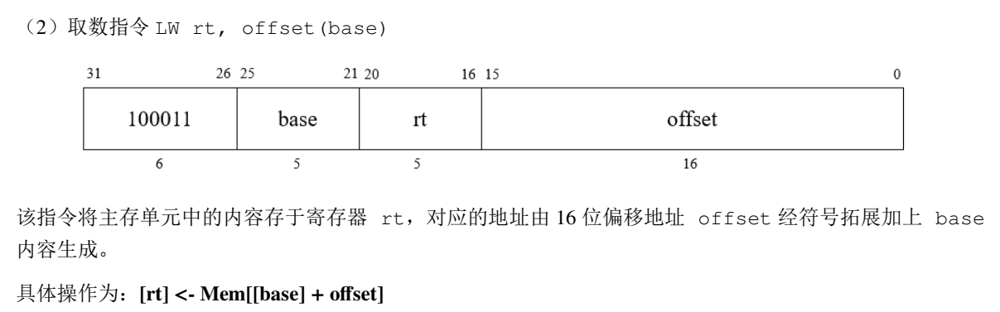

 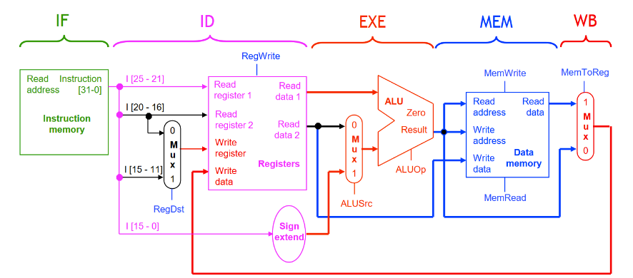

设置段间寄存器，方便流水

流水线 CPU 的提高吞吐量的主要方法就是「让多条指令同时执行」。因此，我们需要在同一个时钟周期内进行多项操作，对于「流水线 CPU」来说，我们也需要复制硬件元件，来让同一个时钟周期中需要多次使用到的硬件能够同时运转。

我们只需要**一个寄存器堆**就能支持 ID 和 WB 阶段，因为「写入」和「读取」分别是通过寄存器堆的不同端口进行的；同时，「写入」操作只发生在一个时钟周期的前半段，而「读取」操作只发生在后半段。

流水线寄存器：Pipeline registers，用来控制整个数据通路中不同流水阶段里信号、数据的传递。五级流水分为 IF、ID、EX、MEM 和 WB 五个阶段，分别设置 **IF/ID**、**ID/EX**、**EX/MEM**、**MEM/WB** 这四个流水线寄存器，用来连接流水的五个阶段。

和之前情况一样，控制信号很多时候一直到指令执行的第五流水阶段才会用到，因此控制信号可以随着其他数据一同在流水线寄存器中进行前递。根据流水线的阶段将控制信号进行分类：

 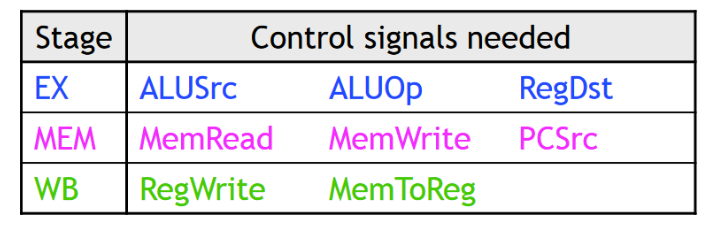

 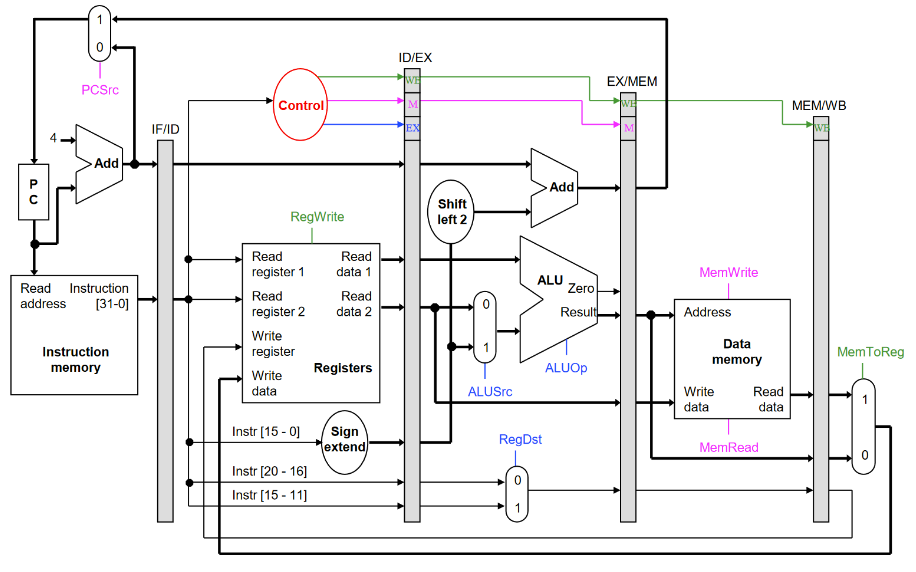

##### 相关问题（Hazards）

流水线 CPU 由于会并行的执行多条指令，因此会产生数据、指令的相关性问题，统称这些相关型问题为：**Hazards**。

*   **Data Hazard —— 数据冲突**

    **数据依赖**

     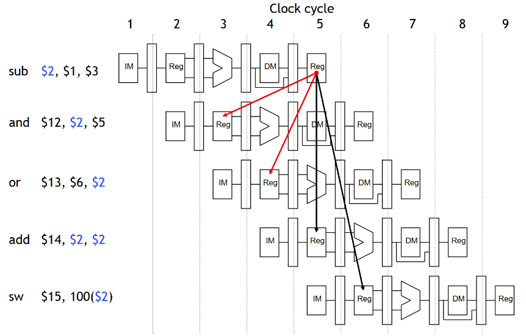

    **解决方法：数据前递（Data Forwarding）**

    新增一个硬件元件：Forwarding Unit（前递组件）专门用来处理数据的前递，在出现 Data Hazard 的时候将 ALU 的输出赋予给正确的输入。EX 阶段算出来的指令可以直接用在下一条指令的 EX 阶段，等第一条指令写执行完写回时再选择是否覆盖原寄存器的内容。

     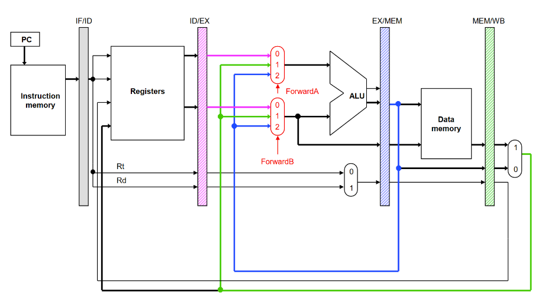

     新增了 Forwarding Unit 的数据通路

    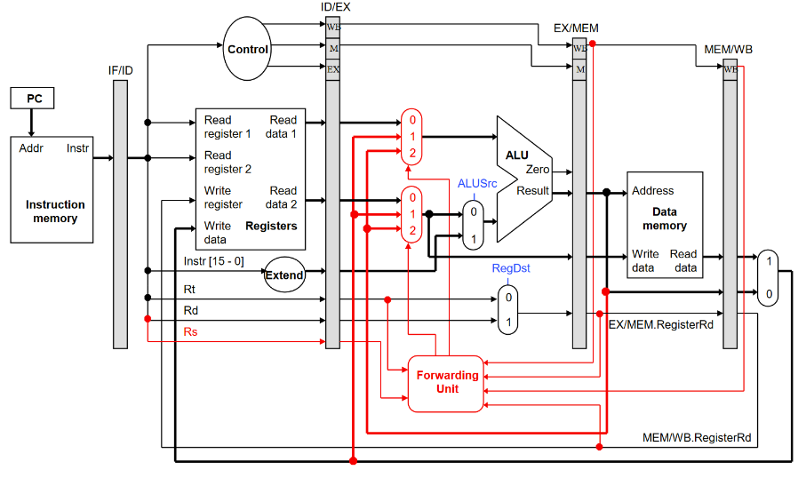

    增加了 Forwarding Unit 的五级流水 CPU 已经能够处理算术运算中涉及到的 Data Hazard，但是对于 LW、SW 等涉及到存储、获取数据存储器中「字」的数据，还是会有尚未解决的问题。

*   **Data Hazard —— 访存冲突**

    对于LW指令，数据冲突相差想数据前递至少相差两个节拍，`WB -> EX` ，无法直接通过数据前递的方式解决冲突。

     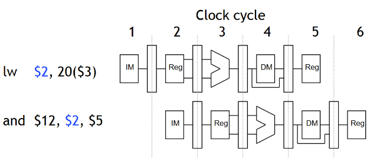

    **解决方法：**

    1.   插入气泡

         可以解决问题，但是要对之后的每条命令都插入一个气泡，开销太大

          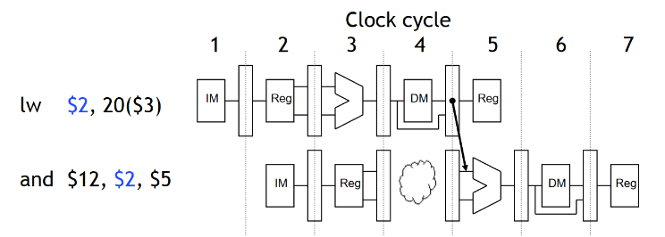

    2.   NOP

          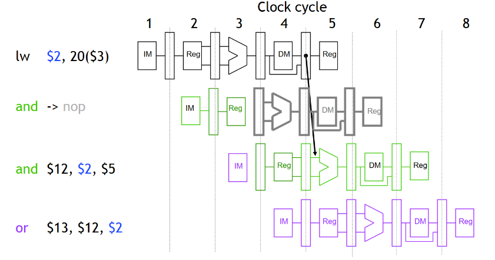

         引入一条空指令，对整体的性能影响不大。

*   **Control Hazard**

    解决方法：

    1.   插入气泡
    2.   分支预测

    为了方便硬件实现，每次分支预测都视为不跳转，如果正确，指令正常执行，`pc+4` ；否则指令跳转，但是首先要处理流水线中已经执行的命令。

    如果正常执行，到EX阶段才能发现预测失败，但是对于 `rs` 和 `rt` 的预测在 ID 阶段就可以执行，这样就可以少向流水线中装载一条错误的命令，此时只需要清理 `BEQ` 的下一条命令即可（清理该指令，用NOP替代）。

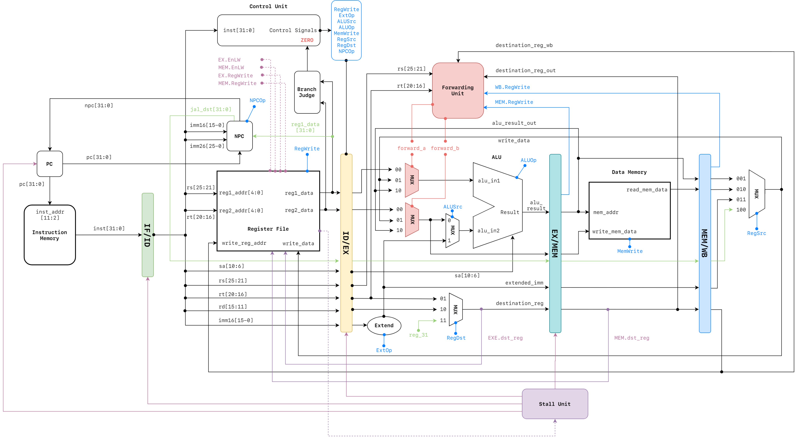

 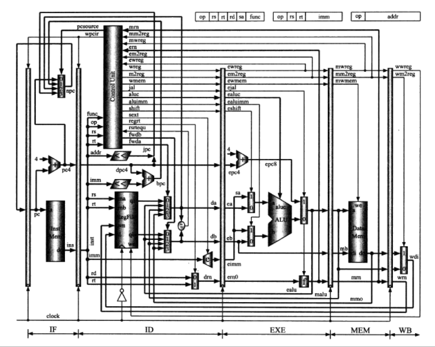

<font color=purple size=4>1． 五段流水线的寄存器文件描述</font>

**IF/ID段**

| 寄存器名         | 位数 | 方向 | 来源/去向                   | 意义                                 |
| ---------------- | ---- | ---- | --------------------------- | ------------------------------------ |
| instructions_out | 32   | O    | Instruction mem/RF,CTRL,NPC | 暂存当前指令，可以继续读取下一条指令 |

**ID/EX段**

| 寄存器名         | 位数      | 方向 | 来源/去向 | 意义                      |
| ---------------- | --------- | ---- | --------- | ------------------------- |
| reg1_data_out    | 32        | O    | RF        | 操作数1                   |
| reg2_data_out    | 32        | O    | RF        | 操作数2                   |
| jmp_dst_out      | 32        | O    | NPC       | J跳转地址                 |
| rs_out           | 5         | O    | RF        | instruction[25:21]        |
| rt_out           | 5         | O    | RF        | instruction[20:16]        |
| rd_out           | 5         | O    | RF        | instruction[15:11]        |
| imm16_out        | 16        | O    | RF        | instruction[15:0]         |
|                  |           |      |           |                           |
| en_reg_write_out | 1         | O    | CU        | 寄存器写回使能            |
| en_lw_id_ex_out  | 1         | O    | CU        | 取数操作信号              |
| cu_ext_op_out    | 1         | O    | CU        | 有符号拓展为32位信号      |
| cu_alu_src_out   | 1         | O    | CU        |                           |
| cu_alu_op_out    | 4（11条） | O    | CU        | alu运算种类信号           |
| en_mem_write_out | 1         | O    | CU        | 内存写使能                |
| cu_reg_src_out   | 4         | O    | CU        | 选择操作数1来源信号       |
| cu_reg_dst_out   | 4         | O    | CU        | 选择操作数/目标寄存器信号 |

**EX/MEM段**

| 寄存器名            | 位数 | 方向 | 来源/去向 | 意义             |
| ------------------- | ---- | ---- | --------- | ---------------- |
| alu_result_out      | 32   | O    | alu       | alu运算结果      |
| reg2_data_out       | 32   | O    | mux       | 写回寄存器地址   |
| jmp_dst_out         | 32   | O    | (ID/EX)   | J跳转地址        |
| extended_imm_out    | 32   | O    | Extend    | 有符号扩展后的值 |
| destination_reg_out | 32   | O    | mux       | 写回内存地址     |
|                     |      |      |           |                  |
| en_mem_write_out    | 1    | O    | CU        | 内存写使能       |
| en_reg_write_out    | 1    | O    | CU        | 寄存器写使能     |
| en_lw_ex_mem_out    | 1    | O    | CU        | 取数使能         |

**MEM/WB段**

| 寄存器名            | 位数 | 方向 | 来源/去向 | 意义                 |
| ------------------- | ---- | ---- | --------- | -------------------- |
| read_mem_data_out   | 32   | O    | DM        | 从DM取出的要写回的数 |
| extended_imm_out    | 32   | O    | (EX/MEM)  | SW写回地址           |
| destination_reg_out | 5    | O    | (EX/MEM)  | LW写回寄存器地址     |
|                     |      |      |           |                      |
| en_reg_write_out    | 1    | O    | CU        | 寄存器写使能         |
| en_lw_mem_wb_out    | 1    | O    | CU        | 取数指令信号         |

<font color=purple size=4>2． 给出定向控制的设计方案，设计方案要求包括：</font>

*   1.   比较和定向操作

| 包含定向源的流水线寄存器 | 定向源相应指令的操作码 | 包含定向目标的流水线寄存器 | 定向目标相应指令的操作码 | 定向的目标 | 比较操作（如果相等就定向） |
| ------------------------ | ---------------------- | -------------------------- | ------------------------ | ---------- | -------------------------- |
| en_ex_mem_regwrite       |                        |                            |                          |            |                            |
| ex_mem_regdes            |                        |                            |                          |            |                            |
| id_ex_rs                 |                        |                            |                          |            |                            |
| id_ex_rt                 |                        |                            |                          |            |                            |
| en_mem_wb_regwrite       |                        |                            |                          |            |                            |
| mem_wb_regdes            |                        |                            |                          |            |                            |
|                          |                        |                            |                          |            |                            |
|                          |                        |                            |                          |            |                            |
|                          |                        |                            |                          |            |                            |
|                          |                        |                            |                          |            |                            |

*   2.   流水线增设的定向路径


*   3.   定向控制设计框图及功能描述


## 四、测试结果及实验分析

1．流水线处理器

1.   处理器仿真测试波形（整体）

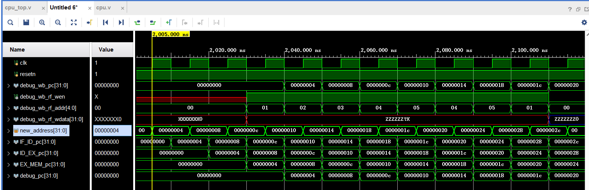

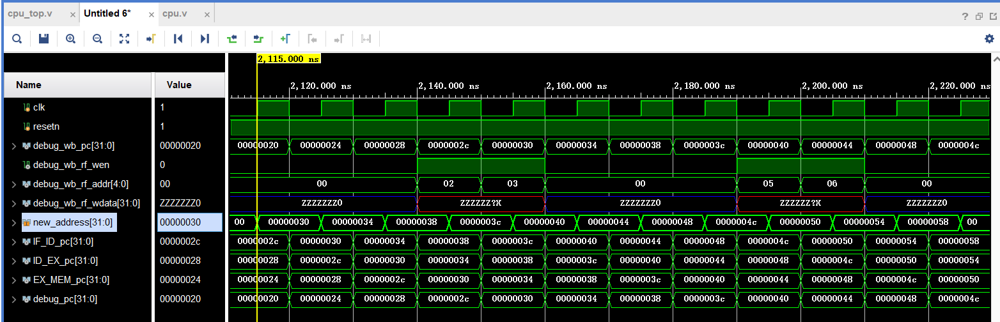

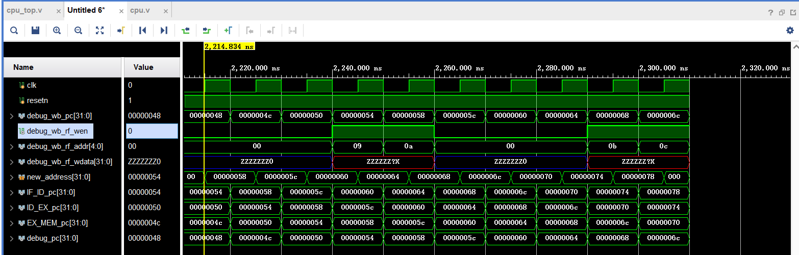

2.   FPGA编程下载

*   编写处理器功能测试程序，包括助记符和二进制代码。

#### 基础测试

```
寄存器：  全0

数据存储器：
for i in range(0, 84, 4):
    Mem[i] = i >> 2

指令缓冲：
0x0000:  8C 01 00 04    lw  $1, 4($0)       // $1 <= 0x1
0x0004:  8C 02 00 08    lw  $2, 8($0)       // $2 <= 0x2
0x0008:  8C 03 00 0C    lw  $3, 0xc($0)     // $3 <= 0x3
0x000c:  8C 04 00 10    lw  $4, 0x10($0)    // $4 <= 0x4
0x0010:  8C 05 00 14    lw  $5, 0x14($0)    // $5 <= 0x5
0x0014:  00 22 20 20    add $4, $1, $2      // $4 <= 0x3
0x0018:  00 23 28 20    add $5, $1, $3      // $5 <= 0x4
0x001c:  8C 01 00 30    lw  $1, 0x30($0)    // $1 <= 0xc
0x0020:  00 00 00 00    nop
0x0024:  00 00 00 00    nop
0x0028:  00 00 00 00    nop
0x002c:  8C 22 00 04    lw  $2, 4($1)       // $2 <= 0x4
0x0030:  8C 23 00 08    lw  $3, 8($1)       // $3 <= 0x5
0x0034:  00 00 00 00    nop
0x0038:  00 00 00 00    nop
0x003c:  00 00 00 00    nop
0x0040:  00 64 28 20    add $5, $3, $4      // $5 <= 0x8
0x0044:  00 62 30 20    add $6, $3, $2      // $6 <= 0x9
0x0048:  00 00 00 00    nop
0x004c:  00 00 00 00    nop
0x0050:  00 00 00 00    nop
0x0054:  00 C5 48 22    sub $9,  $6, $5     // $9  <= 0x1
0x0058:  00 C3 50 22    sub $10, $6, $3     // $10 <= 0x4
0x005c:  00 00 00 00    nop
0x0060:  00 00 00 00    nop
0x0064:  00 00 00 00    nop
0x0068:  8D 4B 00 00    lw  $11, ($10)      // $11 <= 0x1
0x006c:  8D 4C 00 08    lw  $12, 8($10)     // $12 <= 0x3
```

trace:

| pc       | addr | data     |
| -------- | ---- | -------- |
| 00000000 | 01   | 00000001 |
| 00000004 | 02   | 00000002 |
| 00000008 | 03   | 00000003 |
| 0000000c | 04   | 00000004 |
| 00000010 | 05   | 00000005 |
| 00000014 | 04   | 00000003 |
| 00000018 | 05   | 00000004 |
| 0000001c | 01   | 0000000c |
| 0000002c | 02   | 00000004 |
| 00000030 | 03   | 00000005 |
| 00000040 | 05   | 00000008 |
| 00000044 | 06   | 00000009 |
| 00000054 | 09   | 00000001 |
| 00000058 | 0a   | 00000004 |
| 00000068 | 0b   | 00000001 |
| 0000006c | 0c   | 00000003 |

*   上板波形记录与解释

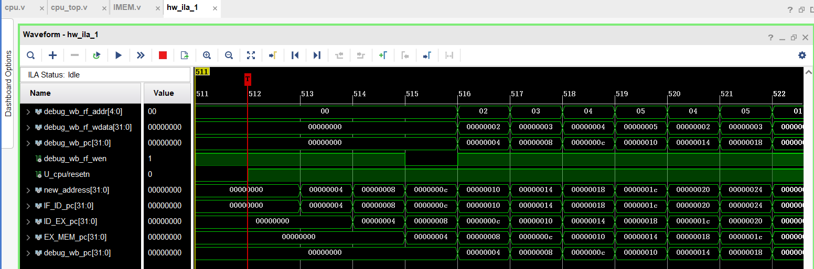

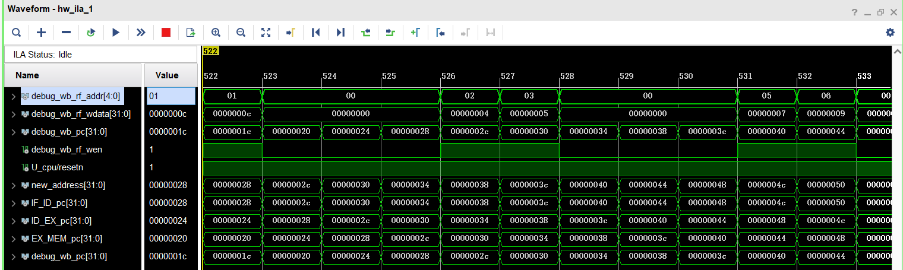

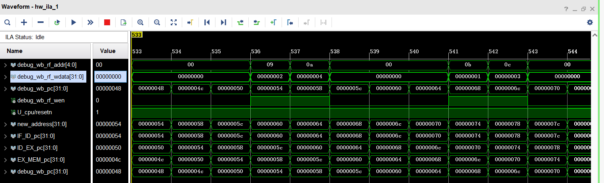

概率事件成功


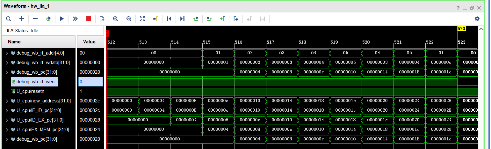

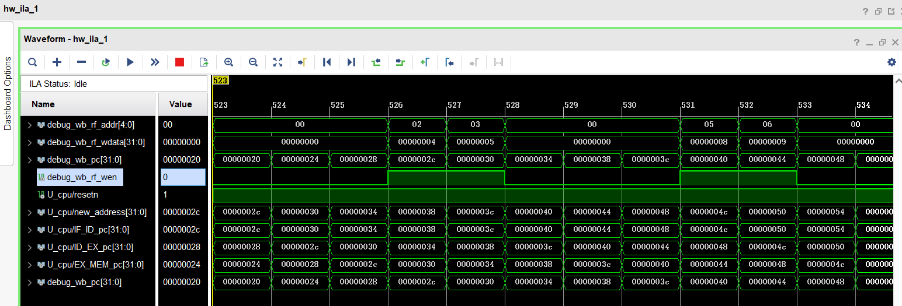

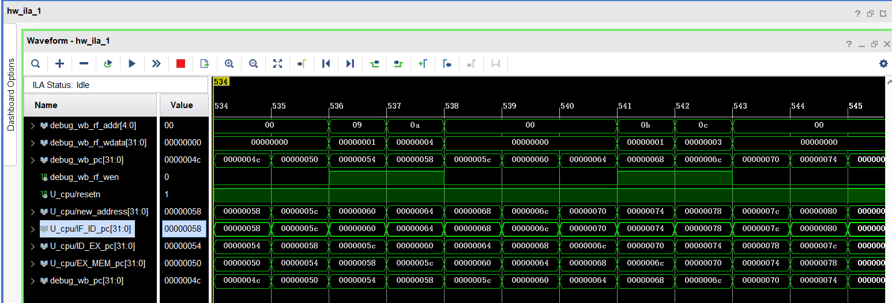

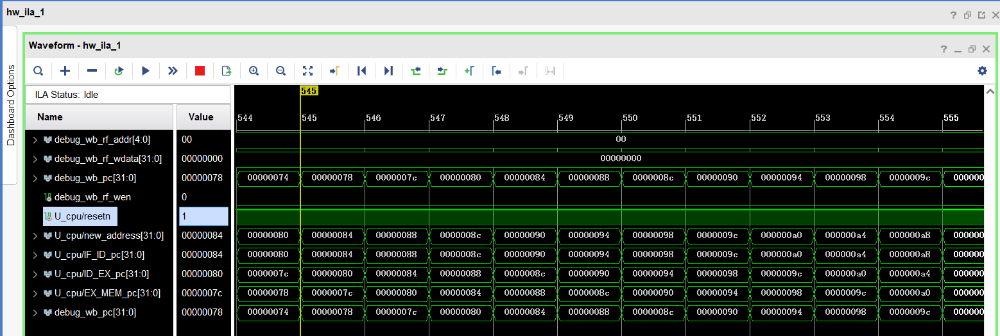


2．暂停和定向控制

2.1 利用暂停解决数据冲突


2.2 利用定向控制解决数据冲突


## 五、实验总结

对流水线的执行过程有了基本的认识，进一步熟悉 vivado 的使用，理解了解决冲突的原理。
