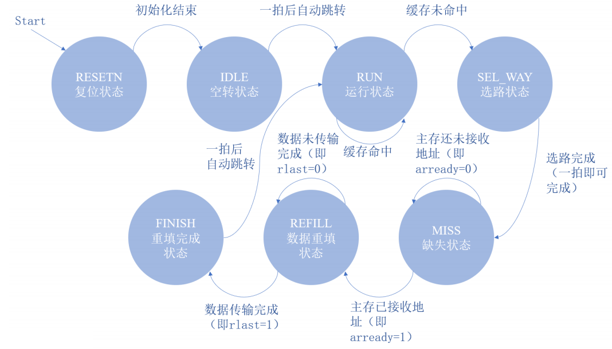
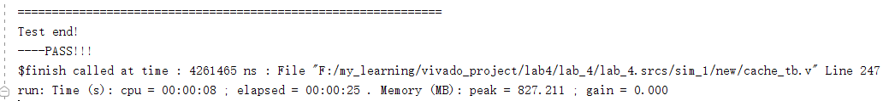
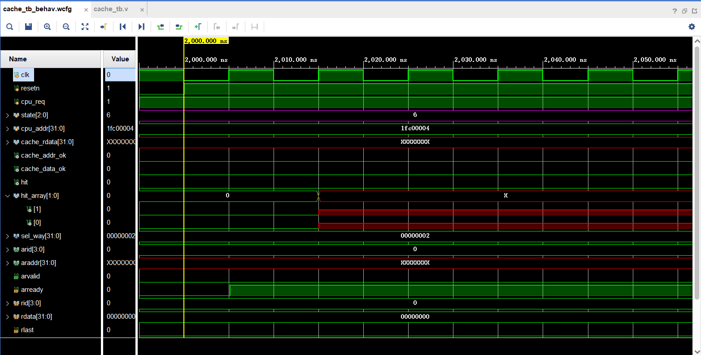
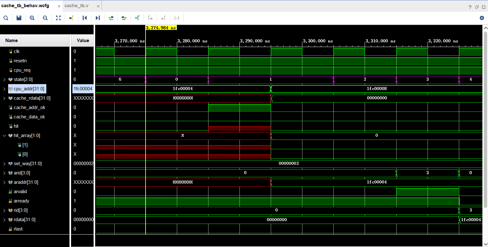
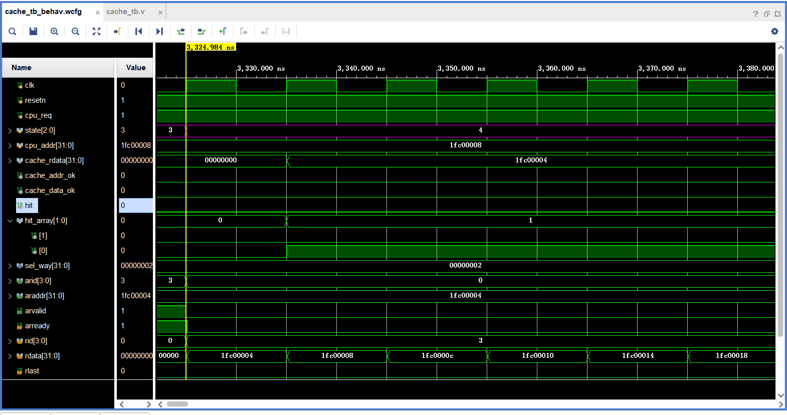
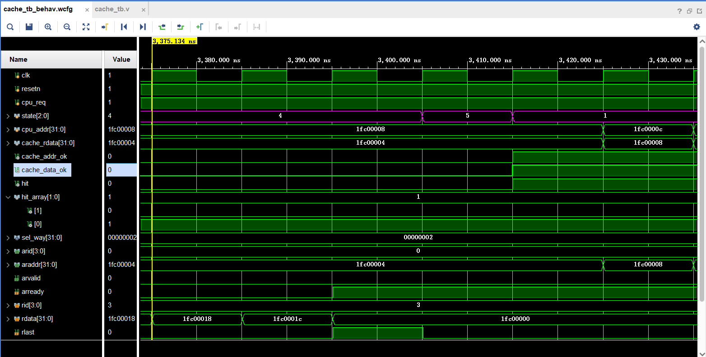
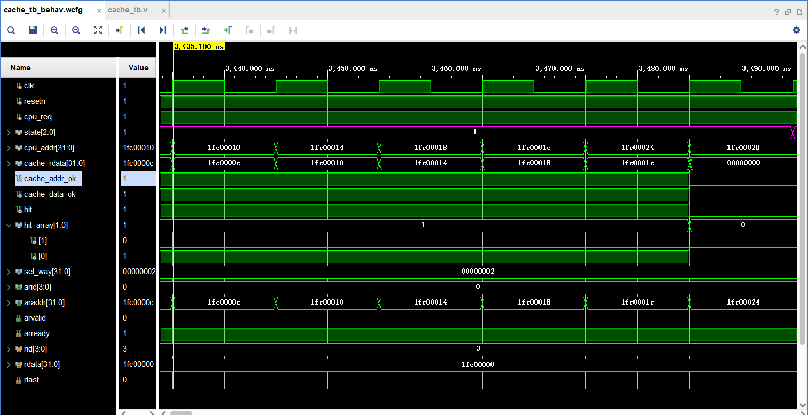
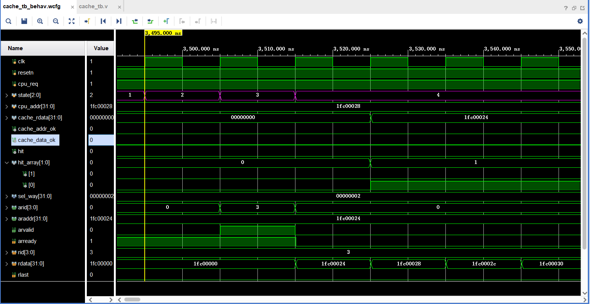

# **实验四 指令Cache的设计与实现**

## 实验四测试环境说明

lab4文件夹为计算机组织与体系结构课程实验4-指令 CACHE 设计与实现实验测试环境的目录

**目录**

```
├── lab_4
│   ├── lab_4.srcs                所有用户编写的源码、仿真文件与约束文件，你在项目中创建的文件可以在这里找到
│   ├── cache_trace.txt           自动化测试所使用的trace文件，存储指令访存的访存地址和数据序列
│   ├── axi_ram.coe               自动化测试所使用的coe文件，用于初始化存储器
│   └── lab_4.xpr                 实验所用的项目，直接双击即可打开完整的实验 Vivado 工程
└── cache.v                       Cache 主模块代码框架
└── readme.md                     本文档
```

## 一、实验目的

1．掌握 Vivado 集成开发环境

2．掌握Verilog语言

3．掌握FPGA编程方法及硬件调试手段

4．深刻理解指令 Cache 的结构和整体工作原理

## 二、实验环境（实验设备、开发环境）

*   Windows10

*   Vivado 集成开发环境和龙芯 Artix-7 实验平台

## 三、设计思想（实验预习）

**1．给出设计的指令Cache的状态转移自动机，解释各个状态，并简要说明Cache在hit和miss时都是如何进行工作的。**

 

| 状态    | 描述                                                         |
| ------- | ------------------------------------------------------------ |
| RESETN  | 初始化状态，当用于处理器初始化时清空 Cache ，持续128个时钟周期，每个周期清空一行。 |
| RUN     | 运行状态，Cache不发生数据缺失正常两拍返回数据的状态。发生数据缺失，即目录表输出`hit = 0`时，会静茹选路状态开始进行 Cache 的替换和更新。 |
| SEL_WAY | 选路状态，如果 Cache 发生数据缺失，就会进入这一状态，并根据 LRU 算法进行选路，为接下来Cache的替换和更新做准备。Cache 每次只会在该状态停留一拍用于确定选路，然后自动跳转到缺失状态。 |
| MISS    | 缺失状态，更新 lru 表，并向主存储器发起读数据请求，即给 AXI 总线发送`arvalid=1`，同时发送数据地址，请求读取Cache 中未命中的行，如果主存储器接受了读请求，即 AXI 总线返回`arready=1`，则 Cache 进入到数据重填状态接收返回的数据。 |
| REFILL  | 数据重填状态， Cache 接收主存储器传回的数据，并根据选路状态给出的选路结果更新目录表和数据块，状态持续到数据传输完成，即 AXI 总线返回`rvalid = 1 && rlast = 1`。 |
| FINISH  | 重填完成状态，标志 Cache 更新完成， Cache 将在下一个时钟周期回到运行状态，重新进行上次未命中的访存。 |
| IDLE    | 空转状态，Cache 恢复正常工作前的缓冲状态，会在下一个时钟周期转移到运行状态。 |

*   Cache 在 hit 时直接两拍返回数据，继续保持在 RUN 状态。

*   Cache 在 miss 时依次执行 `RUN -> SEL_WAY -> MISS -> REFILL -> FINISH -> RUN` ，将要访存的数据读入 Cache 中，并更新目录。

**2．解释你设计的指令Cache是如何实现二/四路组相联的，请简要说明实现的算法。**

这里实现的是二路相连。

在选路的时候，如果当前 Cache 有效位没有标记，即没有存储数据，直接选择当前这路 Cache 存储数据即可；如果 Cache 有效位被标记了，即已经存有数据了，更具最近最少使用原则选择一路进行替换。这里最近最少使用的判断标准非常简单，当前的选中的路即为上次替换的路，则另一条即为当前最近最少使用的路。

## 四、代码实现

**给出实现 Cache 的Verilog代码：**

`icache_tagv.v`

```verilog
`timescale 1ns / 1ps

/* 该目录表仅缓存了一路的    tag，对于两路的设计需要例化两个该目录表    */ 
/* 该目录表需要一拍时间对访存是否命中进行判断    */
/* 该目录表需要一拍时间进行    tag 的写入    */
module icache_tagv(
    input   clk,    // 时钟信号
    input   wen,    // 写使能
    input   valid_wdata,    // 写入有效位的值，在重启刷新 cache 时为 0，其他情况为 1
    input [6 :0] index,     // 查找 tag 或写入时所用的索引
    input [19:0] tag,       // CPU 访存地址的 tag

    output  hit     // 命中结果
    );

    /* --------TagV Ram------- */ 
    //  |  tag  | valid |
    //  |20   1|0     0|
    reg [20:0] tagv_ram[127:0];

    /* --------Write-------- */
    always @(posedge clk) begin
        if (wen) begin
            tagv_ram[index] <= {tag, valid_wdata};
        end
    end

    /* --------Read-------- */
    reg [20:0] reg_tagv;
    reg [19:0] reg_tag;
    always @(posedge clk) begin
        reg_tagv = tagv_ram[index];
        reg_tag = tag;
    end

    assign hit = (reg_tag == reg_tagv[20:1]) && reg_tagv[0];

endmodule
```


`icache_data.v`

```verilog
`timescale 1ns / 1ps

/* 该数据块仅缓存了一路的数据，对于两路的设计需要例化两个该数据块    */ 
/* 该数据块的写入和读取数据均需要一拍的时间    */

`define ICACHE_OFFSET_WIDTH 5

module icache_data(
    input   clk,            //时钟信号
    input   [31:0]  wen,    // 按字节写使能，如 wen == 32'hf000000，则只有写入目标行的 [31:0]
    input   [6 :0]  index,  // 访存或写入的索引
    input   [4 :0]  offset, // 访存的偏移量
    input   [255:0] wdata,  // 写入的数据

    output  [31:0]  rdata   // 访存读出的数据  
    );

    // 由于 Cache 一次读一行，故需要缓存 offset 在读出一行后利用其确定最终的 4 字节
    reg [4:0]   last_offset;
    always @(posedge clk) begin
        last_offset <= offset;
    end

    //-----调用    IP 核搭建    Cache 的数据存储器-----
    wire [31:0] bank_douta[7:0];
    /*
    Cache_Data_RAM: 128 行，每行 32bit，共 8 个 ram 
    接口信号含义：   clka：时钟信号
                    ena: 使能信号，控制整个 ip 核是否工作
                    wea：按字节写使能信号，每次写 4 字节，故 wea 有 4 位 
                    addra：地址信号，说明读/写的地址
                    dina：需要写入的数据，仅在 wea == 1 时有效
                    douta：读取的数据，在 wea == 0 时有效，从地址 addra 处读取出数据
    */
    generate
        genvar i;
        for (i = 0; i < 8; i = i + 1) begin
            inst_ram BANK(
                .clka(clk),
                .ena(1'b1),
                .wea(wen[i*4+3:i*4]),
                .addra(index),
                .dina(wdata[i*32+31:i*32]),
                .douta(bank_douta[7-i])
            );
        end
    endgenerate

    assign rdata = bank_douta[last_offset[`ICACHE_OFFSET_WIDTH-1:2]];
endmodule
```


`cache.v`

```verilog
`timescale 1ns / 1ps

module cache(
    input            clk             ,  // clock, 100MHz
    input            rst             ,  // active low

    //  Sram-Like接口信号定义:
    //  1. cpu_req     标识CPU向Cache发起访存请求的信号，当CPU需要从Cache读取数据时，该信号置为1
    //  2. cpu_addr    CPU需要读取的数据在存储器中的地址,即访存地址
    //  3. cache_rdata 从Cache中读取的数据，由Cache向CPU返回
    //  4. addr_ok     标 识Cache和CPU地址握手成功的信号，值为1表明Cache成功接收CPU发送的地址
    //  5. data_ok     标识Cache和CPU完成数据传送的信号，值为1表明CPU在本时钟周期内完成数据接收
    input         cpu_req      ,    //由CPU发送至Cache
    input  [31:0] cpu_addr     ,    //由CPU发送至Cache
    output [31:0] cache_rdata  ,    //由Cache返回给CPU
    output        cache_addr_ok,    //由Cache返回给CPU
    output        cache_data_ok,    //由Cache返回给CPU

    //  AXI接口信号定义:
    //  Cache与AXI的数据交换分为两个阶段：地址握手阶段和数据握手阶段
    output [3 :0] arid   ,              //Cache向主存发起读请求时使用的AXI信道的id号，设置为0即可
    output [31:0] araddr ,              //Cache向主存发起读请求时所使用的地址
    output        arvalid,              //Cache向主存发起读请求的请求信号
    input         arready,              //读请求能否被接收的握手信号

    input  [3 :0] rid    ,              //主存向Cache返回数据时使用的AXI信道的id号，设置为0即可
    input  [31:0] rdata  ,              //主存向Cache返回的数据
    input         rlast  ,              //是否是主存向Cache返回的最后一个数据
    input         rvalid ,              //主存向Cache返回数据时的数据有效信号
    output        rready                //标识当前的Cache已经准备好可以接收主存返回的数据  
);
    //----------------控制模块------------------
    //-----状态自动机-----
    //  状态机的7个运行状态如下：
    //  IDLE: 		空转状态，在存在写操作的Cache中，这个状态用于调整时序。它会在下一个状态自动转移到RUN状态
    //  RUN:  		运行状态，在这个状态可以接收CPU的读请求。如果在上个周期有读请求且未命中，会转移到SEL_WAY状态进行选路
    //  SEL_WAY: 	Cache未命中，会在SEL_WAY状态根据LRU进行选路，并转移到MISS状态
    //  MISS: 		在这个周期，Cache会更新LRU，并发起AXI请求，从存储器中读取未命中的行，如果从设备（存储器）接受读请求，则Cache进入到接收状态REFILL
    //  REFILL: 	Cache接收AXI传回的数据，如果AXI的数据传输结束，则Cache进入FINISH状态
    //  FINISH: 	数据传输完成，Cache在下一个状态回到IDLE状态
    //  RESETN: 	初始化状态，持续128个时钟周期，直到初始化计数器为127时回到IDLE状态
    /*-----------state-----------*/
    parameter idle    = 0;
    parameter run     = 1;
    parameter sel_way = 2;
    parameter miss    = 3;
    parameter refill  = 4;
    parameter finish  = 5;
    parameter resetn  = 6;

    reg [2:0] state; 
    reg        reg_req ;
    wire [1:0] hit_array;
    reg [6:0] resetn_counter;

    /* DFA */
    always @(posedge clk) begin
        if (!rst) begin
            state <= resetn;
        end
        else begin
            case (state)
                idle:    state <= run;
                //(last_req && !hit)含义为：存在未命中的CPU访存请求，即Cache发生了未命中
                run :    state <= (reg_req && !hit_array)? sel_way :run;
                sel_way: state <= miss;
                //存储器已经成功接收了Cache发送的地址，即存储器与Cache的地址握手完成
                miss :   state <= arready ? refill :miss;//读请求能否被接收的握手信号
                //(rlast && rvalid )信号的含义为：当前的数据传输过程已经结束，即数据握手完成
                refill:  state <= (rlast && rvalid)?finish :refill;//主存向Cache返回数据时的数据有效信号
                finish:  state <= run;
                resetn:  state <= (resetn_counter == 127)?idle:resetn;
                default: state <= idle;
            endcase
        end
    end


    /*-----------RESETN-----------*/
    
    // TODO: 设计一个计数器，从state = RESETN开始从0计数，每一拍加一，当记满128拍后说明初始化完成
    //-----初始化计数器-----
    //  用于初始化,清空TagV模块中的valid位
    //  每次清空一行,需要清空128个周期
    always @(posedge clk) begin
        if (!rst) begin
            resetn_counter <= 7'b0;
        end
        else begin
            resetn_counter <= resetn_counter + 7'b1;
        end
    end

    /*-----------Request Buffer-----------*/
    reg [31:0] reg_addr;
    reg [19:0] reg_tag;
    reg [6 :0] reg_index;
    reg [4 :0] reg_offset;
    
    wire [19:0] tag    = cpu_addr[31:12];
    wire [6 :0] index  = cpu_addr[11:5 ];
    wire [4 :0] offset = cpu_addr[4 :0 ];
    always @(posedge clk) begin
        if (!rst) begin
            /*TODO: 初始化寄存器*/
            reg_req <= 1'b0;
        end
        else if (cache_addr_ok) begin
            /*TODO: 更新寄存器*/
            reg_req <= cpu_req;
            reg_tag <= tag;
            reg_index  <= index;
            reg_offset <= offset;
        end
        else if (cache_data_ok) begin
            reg_req <= 1'b0;
        end
        else begin
            // pass
        end
    end
    


    /*-----------LRU-----------*/
`define ICACHE_GROUP_NUM 128 
    reg [`ICACHE_GROUP_NUM-1:0] lru;

    reg [1  :0] way_sel;
    // LRU Update
    /*在命中的 RUN 状态和不命中的 MISS 状态进行 LRU 的更新*/
    always @(posedge clk) begin
        if (!rst) begin
            lru <= 128'b0;
        end
        else if (state == miss) begin
            case (way_sel)
                2'b01: lru[reg_index] <= 1;
                2'b10: lru[reg_index] <= 0;
                default:;
            endcase
        end
        else begin
        end
    end
    // LRU Select Way
    /*在 SEL_WAY 状态进行选路*/
    always @(posedge clk) begin
        if (!rst) begin
            way_sel <= 2'b0;
        end
        else if (state == sel_way) begin
            case (lru[reg_index])
                1'b0: way_sel <= 2'b01;
                1'b1: way_sel <= 2'b10;
            endcase
        end 
        else begin
        end
    end    


    /*-----------Refill-----------*/
    /*计数器，用于记录当前refill的指令个数*/
    reg  [2  :0] refill_counter;
    always @(posedge clk) begin
        if (!rst) begin
            refill_counter <= 3'b0;
        end
        else if (state == miss) begin
            refill_counter <= reg_offset[4:2];
        end
        else if (rvalid ) begin
            refill_counter <= refill_counter + 3'b1;
        end
        else begin
        end
    end


    /*-----------tagv && data-----------*/
    wire [1 :0] tagv_wen;
    wire [6 :0] tagv_index;
    wire [19:0] tagv_tag;
    wire  valid_wdata;

    wire         hit = !(!hit_array) && (state == run);
    //  使用hit_way信号来判断究竟命中了哪一路，hit_way == 0表示命中第0路，hit_way == 1表示命中第1路。hit_way信号仅在hit为1时才有效
    wire         hit_way = hit_array[1];

    assign tagv_wen      = (state == resetn)?2'b11  :
                           (state == miss  )?way_sel:2'b00;
    assign tagv_index  = (state == resetn)?resetn_counter:
                           (state == run   )?index:reg_index;
    assign tagv_tag    = (state == run   )?tag:(state==resetn)?20'h00000:reg_tag;
    assign valid_wdata = (state == resetn)?1'b0:1'b1;

    wire [31 :0] data_wen [1:0];
    wire [6  :0] data_index;
    wire [4  :0] data_offset;
    wire [255:0] data_wdata;
    wire [31 :0] data_rdata [1:0];

    wire [4:0] refill_wen = refill_counter << 2;
    assign data_wen[0] = (way_sel[0] && rvalid)?(32'hf000_0000 >> refill_wen):32'h0;
    assign data_wen[1] = (way_sel[1] && rvalid)?(32'hf000_0000 >> refill_wen):32'h0;
    assign data_index  = (state == run)?index:reg_index;
    assign data_offset = (state == run)?offset:reg_offset;
    assign data_wdata  = {8{rdata}};

    //-----流水线状态标识-----
    //  pipeline_state是用于标识流水线状态的寄存器
    //  如果当前Cache的流水状态为刚启动的状态，那么地址流水段正常工作(addr_ok == 1)，
    //  而数据流水段还未工作(data_ok == 0)，接下来流水线会正常运行
    //  如果当前Cache的流水状态为即将结束的状态，那么地址流水段不会工作(addr_ok == 0)，
    //  而数据流水段正常工作(data_ok == 1)，接下来流水线会进入到空闲状态
    //  能够打断Cache流水状态的事件有：CPU停止向Cache请求数据、Cache发生未命中
    parameter PIPELINE_RUN  = 1;
    parameter PIPELINE_IDLE = 0;
    reg pipeline_state;
    always @(posedge clk) begin
        if (!rst) begin
            pipeline_state <= PIPELINE_IDLE;
        end
        else if (cache_addr_ok && !cache_data_ok) begin
            pipeline_state <= PIPELINE_RUN;
        end
        else if (!cache_addr_ok && cache_data_ok) begin
            pipeline_state <= PIPELINE_IDLE;
        end
        else begin
        end
    end
    /*------------ CPU<->Cache -------------*/
    assign cache_addr_ok = cpu_req && (state == run) && ((pipeline_state == run) ? cache_data_ok : 1'b1);
    // assign cache_addr_ok = cpu_req && (state == run);

    assign cache_data_ok = reg_req && hit;

    // select way
    assign cache_rdata = data_rdata[hit_way];

    generate
        genvar j;
        for (j = 0 ; j < 2 ; j = j + 1) begin
            icache_tagv Cache_TagV (
                .clk        (clk         ),
                .wen        (tagv_wen[j] ),
                .index      (tagv_index  ),
                .tag        (tagv_tag    ),
                .valid_wdata(valid_wdata ),
                .hit        (hit_array[j])
            );
            icache_data Cache_Data (
                .clk          (clk          ),
                .wen          (data_wen[j]  ),
                .index        (data_index   ),
                .offset       (data_offset  ),
                .wdata        (data_wdata   ),
                .rdata        (data_rdata[j])
            );
        end
    endgenerate
    /*-----------------AXI------------------*/
    // Read
    assign arid    = (state == miss) ? 4'd3 : 4'd0;   
    assign arvalid = (state == miss);         
    assign araddr  = {reg_tag,reg_index,reg_offset[4:2],2'b00};                       
    
    assign rready  = (state == refill);    
endmodule
```


## 五、测试结果及实验分析

**测试结果：** 

| 自动化测试是否通过                                           | 不通过的Miss rate |
| ------------------------------------------------------------ | ----------------- |
|  |                   |

  

 

 

 

 

 

 第一次访存数据肯定不命中，状态 `0->1->2->3->4->5->6->2` 从主存中取出数据放入 Cache 后完成访存，然后连续命中7次后，继续不命中，选一路将主存中的内容替换到 Cache，完成本次访存，此后又连续命中7次。之后重复该过程至测试样例通过。

## 六、实验总结

掌握了简单的 Cache 二路组相联的实现方法，对 ip 核的使用有了初步的了解，对 Cache 的运行机制及 vivado 中状态机的实现有了初步的了解。在实验的过程中，进一步掌握了 Cache 的实现原理。

 