# Software Trace Cache

看一篇论文要注意的地方

>   1.   与其他成果的区别

## 准备工作

### Trace Cache

Trace Cache 技术指在 Cache 缓冲的不是主存中的静态指令序列，而是处理器实际执行的动态指令序列。

这样，一些分支预测的指令序列会随分支预测的有效确认而保存在 Cache 中，从而减小实际指令序列执行的平均命中时间。

传统 Cache 分支跳转到的位置可能位于某 Cache 块的中间，跳出位置可能还没到某 Cache 块的结尾，这样，如果分支跳转成功，分支跳入位置之前的块空间和分支跳出之后的块空间中的指令在实际运行中都不会被执行，等于浪费了 Cache 的空间；而 Trace Cache 则保存的是分支预测的实际运行踪迹，不会产生上述浪费。

Trace Cache 在空间利用率上的缺点是：相同的指令序列可能被不同的条件分支当作不同的踪迹而在 Cache 中重复存储。Trace Cache 是实现代价相对较大的一种技术。

 **Trace Cache** 的工作过程是: 当首次遇到一条**指令轨迹**( **Trace** )时，就在 **Trace Cache** 中为之分配一个 **Cache** 行。如果程序继续执行中再次碰到一条已经缓存的 **Trace** 就直接读取，而不需要从**指令 Cache** 中读取。更详细地说：**Trace Cache** 接收到指令地址后，结合**分支预测**的结果，即可确定该条 **Trace** ，再到 **Trace Cache** 中判断是否命中，若命中该条 **Trace** ，就预取这些指令。

 **Trace Cache** 的核心思想就是：缓存逻辑上的指令流，而不是缓存物理顺序的指令流。从而加快指令的预取。

草率了，选了一篇  2005 年的文章，Trace Cache 在后续 Intel CPU 被放弃了。网上很少能找到 Trace Cache 相关的资料，Software Trace Cache 更是少之又少。

Trace Cache是Pentium 4 NetBurst那时候的事情了，NetBurst长流水线的设计导致分支预测的Fail Penalty太高，那么除了改进分支预测器来提高预测成功率，还可以设计一个Cache事先存储分支预测得到并解码以后的μOPs，CPU执行的时候直接按顺序取来就行。这样不仅提升CPU执行指令的效率，而且预测Fail的时候清空执行阶段的流水线即可，降低Fail Penalty

放弃的原因是Trace Cache复杂度过高，而且Core架构的流水线缩短使得分支预测的Fail Penalty不再那么不可接受。Sandy Bridge以后intel折腾了一个类似Trace Cache的Decode Stream Buffer，存储解码以后的μOPs。

还有一个 Trace Cache 被淘汰的理由如下：

https://www.zhihu.com/question/26603576

wiki 也说 Trace Cache 早就被放弃了，引用的论文也都是03年之前的

https://en.wikipedia.org/wiki/Trace_cache

本文将的是编译器优化，没有了硬件开销，这部分也有其用武之地：

使用指定的算法进行基本块重排。算法参数可以是 "simple"，它不增加代码大小（除了有时由于对齐等次要影响），或者是 "stc"，即 "软件跟踪缓存 "算法，它试图将所有经常执行的代码放在一起，通过制作额外的代码副本来最小化执行的分支数量。

除了在编译的函数中重新排序基本块，以减少所采取的分支数量，将热的和冷的基本块划分到汇编和.o文件的不同部分，以改善分页和缓存定位的性能。

https://zhuanlan.zhihu.com/p/496435946

## Abstract

本文探讨如何使用编译器优化来优化内存中的指令布局。目标是使代码能够更好地利用底层硬件资源，而不管处理器，以提高提取性能。软件跟踪缓存（STC）是一种具有更广泛目标的代码布局算法与以前的布局优化相比。我们的目标不仅是提高指令缓存命中率，而且还增加了获取引擎的有效获取宽度。STC算法将基本块组织成链，试图使顺序执行的基本块驻留在连续的内存位置，然后将基本块链映射到内存中，以尽量减少程序重要部分的冲突缺失。我们详细评估和分析了 STC 和一般代码布局优化对提取性能的三个主要方面的影响：**指令缓存命中率**、**有效提取宽度**和**分支预测准确性**。我们的结果表明，经过布局优化的代码具有一些特殊特性，使它们更适合高性能指令提取：它们具有非常高的未采用分支率并执行长链顺序指令； 此外，它们非常有效地利用指令缓存行，仅映射将及时执行的有用指令，从而增加空间和时间局部性。

## 1. INTRODUCTION

超标量处理器代表了过去几年高性能处理器的主要趋势。 这些处理器自然地从流水线架构演化而来，并试图通过两种方式获得更高的性能：一是同时并行执行几条独立的指令； 其次，通过提高时钟频率来加快指令执行速度。

在设计高性能处理器时，重要的是要使处理器的所有部分保持平衡，尽可能避免瓶颈。 如果我们设计一个能够同时执行五个 ALU 操作的高性能处理器，那么确保我们可以为 ALU 阶段提供数据并在不停止流水线的情况下退出这些指令也很重要。 这意味着每个周期至少获取和解码 5 条指令，以保持 ALU 阶段忙碌，并以足够快的速度写入结果和毕业指令。

但是，获取阶段的行为不像其他流水线阶段,不能通过简单地复制它或添加更多功能单元来扩展它的意义。 此外，它必须遵循尚未执行的分支指令定义的控制路径。 获取阶段迅速发展到包括分支预测，并用它来从推测执行路径中获取指令。

这种独立于执行阶段遵循推测路径的能力导致了处理器的解耦视图。 取指引擎从内存中读取指令，并按照分支预测机制指示的推测路径将它们放置在指令缓冲区中。 然后，执行引擎从缓冲区中读取指令并生成所需的结果，向提取引擎提供有关分支指令实际结果的反馈。

对超标量处理器的解耦视图的分析表明，获取性能有三个主要影响因素：

1)内存延迟：从内存读取指令需要多长时间

计算从内存加载所需指令花费的时间，以及执行指令花费的时间。 如果内存延迟很大，它会很快成为执行时间的主要组成部分。 **减少内存延迟的主要方法是使用高速缓存和预取方案。** 鉴于这种方法的流行，我们将测量指令缓存未命中率，而不是测量指令内存延迟。

2)获取宽度：每个周期我们可以传输多少条指令 

正如我们之前提到的，获取引擎不能通过简单地复制其功能单元来扩展。 每个周期获取一条以上的指令需要一种全新的获取架构，能够选择要获取的指令。 这种提取架构还决定了可以同时提取多少条指令。 随着处理器的发布宽度增加，在单个周期中获取多条指令的能力成为一个更重要的获取性能因素。

3)分支预测准确度：有多少转移的指令属于错误的执行路径。

最后，我们必须考虑分支指令的存在，它会中断流水线中的指令流。 当分支的结果在提取后的几个周期才知道时，就会出现问题，但我们需要继续从推测路径中提取指令。 当分支被解决时，一些错误的路径指令可能已经进入流水线并且可能需要被压缩。 错误路径指令的压缩表示浪费了大量的提取周期并直接影响提取性能。 该事件发生的频率主要取决于分支预测机制的准确性。

鉴于超标量处理器中获取性能的重要性，我们的目标是提高向执行核心提供有用指令的速率。 但是，我们考虑从软件的角度来处理获取性能。 我们考虑使用编译器优化来使现有应用程序适应底层提取架构。 **这种软件方法之所以有吸引力，有两个原因：首先，它的硬件成本为零，不需要额外的晶体管，也不需要额外的电源； 其次，它对现有架构进行了性能改进，使其立即适用。**

本文的其余部分组织如下：在第 2 节中，我们讨论了代码布局优化领域的先前相关工作以及软件跟踪缓存如何改进它们。 第 3 节详细描述了软件跟踪缓存算法。 在第 4 节中，我们描述了使用的不同基准和我们的模拟设置。 第 5 节深入分析了软件跟踪缓存对获取性能的不同因素的性能影响以及对处理器和系统性能的整体影响。 最后，在第 6 节中，我们提出了这项工作的结论。

## 2. RELATED WORK

指令到内存的映射由编译器决定。 此映射不仅确定找到指令的代码页，还确定它将映射到的缓存行（或集合关联缓存中的集合）。 此外，根据后续基本块的放置，将采用或不采用分支。

通过以不同的顺序映射指令，编译器对获取引擎的性能有直接的影响。 在本节中，我们简要描述了为选择每条指令应映射到何处而提出的不同算法。

我们可以将代码布局优化分为三个部分：**例程内基本块的布局**，**将过程拆分为几个不同的例程或跟踪**，**以及地址空间中生成的例程或跟踪的布局**。 在本节中，我们将针对这些优化中的每一个描述一些算法，并指出可以从中获得的好处。

### 2.1 Basic Block Chaining（基本区块链接）

基本块链接将基本块组织成轨迹，将那些倾向于按顺序执行的基本块映射在一起。 已经提出了几种算法来确定哪些基本块应该构建跟踪。

[13]、[23]、[24]、[32] 中使用的链接算法是一种贪心算法，给定种子或起始基本块，只要该基本块具有 执行频率大于 Exec Threshold，并且转换的概率高于给定的 Branch Threshold。这意味着访问由基本块调用的例程或跟随最频繁的控制流出基本块。 如果已经访问了基本块中最可能的路径，则采用下一条可能的路径。 如果基本块没有可能的路径，或者可用路径没有通过 Exec 和 Branch 阈值，则算法停止并选择下一个种子。

第二种替代方法是在 [20] 中提出并在 [5]、[18]、[31] 中使用的自下而上算法。 选择图中权重最重的边（执行次数最多的边）并将两个基本块映射到一起。 下一个最重的边缘以相同的方式被获取和处理，构建基本的区块链。 在所有基本块都映射到链之后，将不同的链按顺序映射，以便条件分支映射到前向通常不采用的分支。

然而，具有加权边的控制流图并不总是导致表示通过子例程的最频繁路径的基本块。 这个问题的解决方案是路径分析 [2]。 路径配置文件计算通过子例程的每条路径被遵循的次数，而不仅仅是采用/未采用分支的次数。 在这种情况下，配置文件数据和应该建立的基础区块链之间的对应关系是即时的。

我们的基本块链接算法源自 [32]。 正如我们在第 3 节中展示的那样，我们通过自动化需要人工干预的算法的某些部分来改进他们的链接算法，例如种子选择，以及选择 Exec 和 Branch 阈值。

### 2.2 Subroutine Splitting（子程序拆分）

在为给定过程建立基本块的重新排序后，经常执行的基本块被映射到过程的顶部，而不经常使用的基本块将移到过程主体的底部。通过拆分程序的不同部分，我们可以显著减小其大小，从而获得更密集的程序包装。

我们可以区分拆分过程体的两种主要方式。粗粒度拆分会将例程拆分为两部分 [5]、[18]、[20]、[31]：一个包含那些在配置文件（热部分）中执行的基本块，另一个包含那些基本块从未被作为配置文件输入部分（冷部分）而执行的块。

细粒度拆分会将每个基本块链拆分为一个单独的过程 [13]、[21]、[32]。 链的末端可以通过无条件控制转移的存在来识别，因为在重新排序之后，假设通常不会采用所有条件分支。 未使用的基本块将形成一条链，并在一个新程序中保存在一起。

拆分产生的过程不遵守通常的调用约定，没有定义的入口或出口点，并且它们不包括寄存器保存/恢复。 这样做是为了避免与标准过程控制传输相关的开销。

正如我们在 [21] 中展示的那样，过程拆分优化的好处并不在于拆分本身：它反映了通过过程放置优化获得的改进。 映射更小的过程使这些优化对指令映射有更细粒度的控制，而不会取消基本块链接优化获得的内容。

### 2.3 Procedure Placement（程序放置）

独立于基本块链接和过程拆分优化，程序中不同例程的映射顺序对使用的代码页数（以及指令 TLB 未命中率）和重叠有重要影响 在不同的程序之间（以及因此，冲突未命中的数量）。

最简单的过程映射算法是按流行顺序映射例程：首先是最重的例程，然后是执行权重递减的顺序。 这限制了两个同样流行的例程之间的冲突。

[5]、[18]、[20]、[21]、[31]中使用的映射算法基于具有加权边的过程的调用图，其中边权重是每个过程调用的次数 执行。 该算法可以扩展为考虑过程和目标缓存大小信息之间的时间关系，如 [10] 中所述。 从最重的边开始，将两个连接的节点映射在一起，并将所有传入/传出边合并在一起。 当包含多个过程的两个节点应该合并时，将检查原始（未合并的）图以查看它们应该以哪种方式加入：这两个组将在原始图中关系最强的点合并，如果出现以下情况，则颠倒其中一个或两个的顺序如果必要的。 例如，如果有两个组，AB 和 CD，并且原始图中最强的关系是 A 和 C 之间的关系，则最终排序将是 BACD。

在 [11]、[14] 中，受寄存器着色技术的启发，通过执行过程到缓存行的颜色映射生成优化的过程布局，同时考虑缓存大小、行大小、过程大小和调用图。

[32]中使用的映射算法遵循完全不同的方法，而不是基于生成过程的调用频率。 在将所有基本块映射到链之后，链按受欢迎程度排序。 最流行的链映射到地址空间的开头，而最不流行的链映射到末尾。

除了将同样流行的链彼此相邻映射之外，通过确保没有其他代码映射到相同的缓存地址范围，为最流行的基本块保留了一小部分指令缓存。 这些基本块被从它们映射到的任何链中拉出并移动到这个特权缓存空间中。这确保了最常用的基本块永远不会在缓存中丢失。 这个保留的高速缓存空间称为无冲突区域 (CFA)。 CFA 的大小是通过实验确定的。

 我们通过将链中的所有基本块放在一起来改进这种映射算法 [24]。 也就是说，我们不是将单个基本块映射到 CFA，而是映射整个链，这增加了空间局部性并避免了分支。 我们还包括一个启发式来自动确定 CFA 大小。

## 3. THE STC ALGORITHM

软件跟踪缓存 (STC) 布局算法主要基于 Torrellas 等人的工作。 [32]，但包括多项改进。 我们不再使用 [23]、[24]、[32] 中使用的 ExecThreshold 和 BranchThreshold 参数。 相反，我们在算法的单次传递中构建所有基本块跟踪，无需任何用户干预来确定阈值。 我们使用自动过程来选择我们的基本块跟踪的起点。 最后，我们将整个基本块轨迹映射到无冲突区域 (CFA)，而不是映射单个基本块。

### 3.1 Seed Selection

我们的算法基于个人资料信息。 在每个基准上运行训练集，我们获得了具有加权边的基本块的有向图。

在我们可以将基本块集组织成轨迹之前，第一步是为这些轨迹选择种子或起点。 在 [32] 中，详细研究了操作系统代码以找到最频繁的入口点并选择了一些子程序。 在 [23] 中，我们分析了关系数据库管理系统 (DBMS) 的代码，并选择不同查询操作的入口点作为种子。

然而，详细分析源代码并不总是可行的。 为此，我们选择了所有子程序入口点作为种子。 我们维护按基本块权重排序的种子列表：从执行频率最高的种子到执行频率最低的种子。 我们依次探索每个种子，忽略那些已经包含在先前跟踪中的种子。

**这种种子的自动选择是 STC 优于以前工作的一个重要优势**，在以前的工作中，用户根据对应用程序动态行为的详细分析或源代码分析来选择种子基本块。

### 3.2 Trace Construction（踪迹建设）

从选定的种子开始，我们继续使用贪心算法，该算法遵循基本块中最可能的路径，并将遵循的路径记录为所需的轨迹。 该算法遵循路径，而不管它们是否跨越子程序边界，从而有效地构建跨越多个子程序的跟踪。 当访问了基本块中的所有目标或遇到主过程的子程序返回时，跟踪结束。

循环以相同的方式处理。 该算法遵循最有可能的路径通过循环体，直到找到向后分支边缘。 后边被识别是因为它指向一个已经访问过的基本块。 分支的主要目标（后边缘）已经被访问过，因此选择次要目标（跌落路径）。 STC 算法不展开循环。

例如，按照图 1 中的图表，算法从种子 A1 开始。 该算法从基本块 A1 中选择最有可能的输出路径，该路径通向块 A2。 从基本块 A2 开始，最有可能的输出路径通向已经探索过的种子 C1。 被丢弃的区块 B1 已经是种子，稍后将进行探索。 然后，从种子 C1 开始并包含块 C1 到 C4（不包括块 C5）的跟踪在块 A2 之后内联。 该算法在下一个顺序块 A3（轨迹 C1-C4 的返回点）处继续。

 

从基本块 A3 开始，最有可能的输出路径通向块 A4。 丢弃的块 A5 被添加到未访问种子列表中，该列表按权重顺序维护。 从基本块 A4 开始，算法访问块 A7 和 A8，将丢弃的块 A6 添加到种子列表中。 图 1 显示了生成的轨迹，包括例程 A 和例程 C 的基本块。

链内联步骤是 STC 在 [13]、[32] 中完成的一项新贡献。 它允许 STC 构建长的基本区块链，而不需要基于源代码分析进行仔细的种子选择，并且不需要使用阈值。

### 3.3 Trace Mapping

如图 2 所示，我们按照创建的顺序映射生成的跟踪：从执行最频繁的跟踪到执行最少的跟踪。 通过这种方式，我们将同样流行的轨迹彼此相邻映射，减少它们之间的冲突。 此外，我们将跟踪分成指令缓存大小的块，并在每个块的开头留出一个空白空间，除了第一个（包含最流行的跟踪的那个）。

 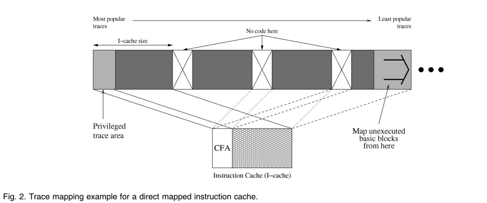

所有代码间隙都映射到指令缓存中的同一位置，因此没有其他代码映射到与最流行的轨迹相同的位置，从而为这些轨迹创建一个完全屏蔽它们免受干扰的无冲突区域 (CFA)。

CFA 的大小是使用此映射算法获得的性能的最重要的决定性因素之一。 更大的 CFA 适合更多最流行的轨迹，使它们免受干扰，从而减少代码最重要部分的冲突未命中。 然而，它在指令高速缓存中为剩余跟踪留下的空间较少，增加了它们之间的冲突未命中。 这两个因素相互平衡，在给定大小后，CFA 大小的进一步增加实际上会降低指令缓存性能。

与以前的工作不同，我们使用启发式方法来确定足够的 CFA 大小，而无需反复试验。 我们采用最流行的痕迹，一次一个。 然后，我们将它收集的总执行时间的百分比与它需要的指令缓存的百分比进行比较。 如果执行百分比高于缓存中占用的空间，我们会将跟踪包含在 CFA 中。 然后我们添加下一个跟踪并考虑它们执行的百分比以及它们需要的缓存部分。 只要执行的分数大于它们所需的指令缓存的分数，我们就会不断向 CFA 添加跟踪，试图平衡这两个因素。 例如，当包含的跟踪收集了 32% 的程序执行时，我们会将 32% 的指令缓存用于 CFA。

这种启发式取决于构建的跟踪的执行频率和指令缓存大小。 对于小缓存，CFA 的大小也将更小，而更大的缓存允许更大的 CFA。 将大部分执行集中在少数跟踪中的较小代码几乎完全适合 CFA，而具有平坦执行配置文件的大型代码对 CFA 几乎没有用处或根本没有用处。

## 4. SIMULATION SETUP（仿真设置）

我们在这项研究中使用了各种各样的工作负载，包括典型的整数应用程序（SPEC'95 整数基准测试的子集）1 [22]、[24]、DSS 工作负载（PostgreSQL 上的 TPC-D）[23]、 [24]，以及一个 OLTP 工作负载（Oracle v8 上的 TPC-B）[21]。 表 1 显示了本文其余部分的每个图中使用的工作负载。

 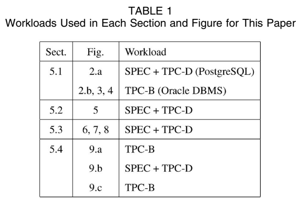

对于我们的 DSS 工作负载，我们使用比例因子为 0.1 的数据库（100MB 原始数据）并运行只读查询的代表性子集。 我**们使用不同的查询子集来获取配置文件数据 (Q3,4,5,6,9,15) 和性能模拟数据 (Q2,3,4,6,11,12,13,14,15,17 ).**

OLTP 工作负载的设置和扩展方式与 [3] 中的方式类似。 我们使用具有 40 个分支且大小超过 900MB 的 TPC-B 数据库。 **为了隐藏 I/O 延迟，我们在本研究中为每个处理器使用八个服务器进程。**

我们的性能评估和分析实验包括**详细的处理器模拟**、**完整系统模拟**和**使用硬件计数器的直接机器测量**。

处理器模拟器源自 SimpleScalar 3.0 工具集，扩展了一个积极的获取引擎，能够在单个周期中获取多个顺序的基本块（[27] 中描述的 SEQ.3 引擎），一个跟踪缓存 [9]，[ 19]、[27] 和去混叠分支预测器，如 agree [30]、bimode [15] 和 gskew [17]。

>   1. 除了go，由于pixie tool和compress的问题，我们无法获取profile信息，我们认为它太小，不具有代表性。

对于完整的系统模拟，我们使用 SimOS 环境的 Alpha 端口 [26]。 SimOS-Alpha 是一个模拟环境，它足够详细地模拟 Alpha 多处理器硬件（处理器、MMU、磁盘、缓存）以运行系统级硬件和未修改的应用程序代码。 我们的模拟从 OLTP 工作负载处于稳定状态时获取的检查点运行，并在模拟的 4 处理器 Alpha 系统上运行 500 个额外事务。 我们的 SimOS 设置使用具有 64KB、2 路指令和数据缓存以及 1.5MB 统一二级缓存的 1GHz 单发流水线处理器。 内存延迟假定芯片级集成：12 周期 L2 命中，80 周期本地内存，120-150 周期用于 2 跳和 3 跳远程内存。 我们还使用 SimOS 获取用于详细分析指令缓存行为的应用程序跟踪。

论文中包含的最重要的结果是在真实机器上使用真正优化的应用程序获得的结果。 通过此设置获得的结果与通过模拟获得的结果非常吻合，这一事实使我们对研究的有效性充满信心。

我们的硬件实验包括为 5000 个事务运行我们的 OLTP 基准。 使用 DCPI [1]，我们测量了执行时间、指令缓存未命中和指令 TLB 性能。 我们在两个不同的 Alpha 平台上进行了这些实验：一个 8 处理器 21164 和一个双处理器 21264。

## 5. PERFORMANCE  IMPACT（性能影响）

本节介绍我们对 STC 和其他代码布局优化对获取性能所有三个方面的影响的分析。 使用特定组件的详细模拟和间接性能指标，我们能够解释获得性能改进的原因。

我们的结果表明，代码布局优化不仅通过避免冲突未命中来提高指令缓存性能，而且还可以更好地利用可用缓存空间，从而减少容量未命中，并且空间局部性是优化代码的主要优势。

我们还表明，在优化之后，即使是最激进的超标量处理器也可以通过只读取顺序指令链来提供数据。

我们对布局优化对分支预测机制的影响的分析表明，它们可以对简单的两级自适应预测器产生积极影响，对去混叠预测器产生小的负面影响。 但是，提取性能其他方面的改进克服了预测准确性的轻微下降。

最后，我们分析了布局优化对获取引擎之外的其他元素的影响，发现它们不仅对指令内存层次结构有积极影响，而且由于减少了指令和数据之间的干扰，它们还提高了数据内存性能。

### 5.1 Impact on the Instruction Cache

在本节中，我们将研究代码布局优化对指令内存延迟的影响，即从内存中获取指令需要多长时间。 因为减少内存延迟的主要方法是使用缓存，所以我们使用的性能指标是指令缓存未命中率。

图 3a 显示了基准缓存设置（直接映射）的 SPECint95 和 PostgreSQL 数据库的平均指令缓存未命中率与运行优化代码的相同缓存和两个硬件优化设置的比较。 探索的代码布局优化是由 Pettis 和 Hansen (PH)[20]、Torrellas 等人提出的。 (TXD) [32]，以及软件跟踪缓存 (STC)。 硬件优化设置是一个 2 路组关联缓存和一个 16 路完全关联的受害者缓冲区。 没有硬件优化设置使用优化代码布局。

 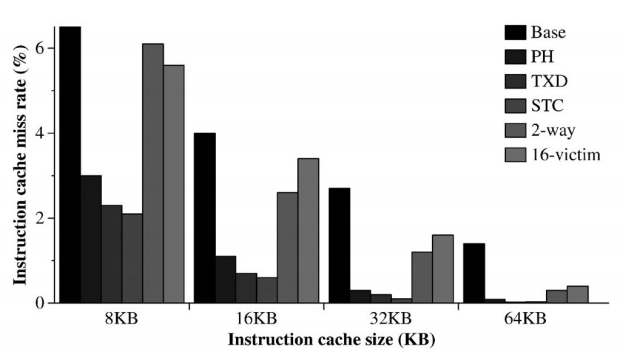

>   图 3. 使用不同的硬件和代码布局优化时，各种缓存配置的指令缓存未命中。
>
>   (a) 未命中率与其他软件和硬件优化的比较。

图 3a 中的结果表明，代码布局优化对所有探索的缓存大小的指令缓存未命中率都有非常显着的影响，远大于探索的两种硬件优化。 运行优化代码的 16KB 指令缓存的指令缓存未命中率低于运行未优化代码的 64KB 缓存。 这表明优化代码更有效地利用可用缓存空间，需要更小的缓存来适应指令工作集。

将 STC 与其他代码布局优化进行比较，我们的结果表明，STC 提供的指令缓存未命中率低于 Pettis 和 Hansen 或 Torrellas 等人。 优化，尤其是对于较小的缓存大小。

代码布局优化在降低指令缓存未命中率方面非常有效。 对这种未命中率降低的通常解释是，仔细布局例程可以减少冲突未命中的数量，这是代码布局优化彼此不同的主要方面。 然而，我们将展示布局优化不仅对冲突未命中有影响。

图 3b 显示了运行 OLTP 工作负载 (TPC-B) 的商业数据库管理系统 (DBMS) 的两个版本的指令缓存未命中数。 商业数据库是非常大的代码，具有平坦的执行配置文件，它们遭受大容量问题而不是冲突未命中。

 

>   (b) DBMS 应用程序中的指令缓存未命中。

图 3b 中的结果表明，代码布局优化对此类大工作负载的未命中数也有显着影响，尽管冲突未命中数无法减少，因为工作集太大，无论例程如何布局都无法放入缓存。

与未优化代码相比，检查优化 DBMS 应用程序的相对未命中数也很有趣，也就是说，对于每个指令缓存和行大小，优化应用程序中仍然存在的未命中百分比。 例如，在具有 128 字节行的 64KB 缓存上，优化后的二进制代码的未命中率仅为未优化代码的 45%。

分析表明，（对于具有 256 字节行的 512KB 缓存减少高达 76%）。

对这些结果的进一步分析表明，较大的缓存可更好地减少未命中。 在我们目前的案例中，这种趋势适用于 512KB 缓存，因为工作负载已经适合那里，即使是未优化的形式。 指令高速缓存行大小也存在相同的趋势：较长的高速缓存行可更好地减少未命中。 图 3b 中的结果表明，随着缓存行和大小的增加，未优化的应用程序确实提高了性能，但优化后的应用程序比基线提高得更快。

这种趋势表明布局优化代码比未优化的代码更好地利用更大的缓存和更长的缓存行。 接下来，我们从空间和时间局部性的角度分析这些改进的原因。

#### 5.1.1 Spatial Locality（空间局部性）

代码布局优化修改了基本块映射，使分支向未采用的方向对齐，从而增加了顺序执行指令的数量。 序列长度的增加立即转化为空间局部性的增加。

我们在商业 DBMS 系统上的结果表明，从基线到优化应用程序，平均序列长度显着增加：从 7 条指令增加到 10 条指令。 但是，这种增加不足以证明指令缓存性能的所有改进都是合理的。

图 4a 显示了两个二进制文件每个长度的序列数量的详细分类。该图显示，长度为 1 的序列数量减少了 30%，长度为 17 的序列数量大幅增加。也就是说，我们正在减少短序列的数量，增加长序列的数量。然而，与基本块链接优化所解释的空间局部性相比，仍然存在更多空间局部性。

 

>   图 4. 空间局部性增加的原因：商业 DBMS 系统中代码顺序增加和缓存行使用增加。 
>
>   (a) 代码布局优化增加了顺序执行指令的数量。

图 4b 显示了在替换之前在 128 字节缓存行中使用多个唯一字的次数百分比（每个缓存行 32 条指令），对于基线和优化应用程序都是如此。

 

>(b) 布局优化代码在替换之前使用缓存行中的所有指令。

图 4b 中的结果表明，优化后的应用程序在超过 60% 的时间内使用了整个缓存行。 也就是说，在大多数情况下，缓存行中的所有指令将在该缓存行被替换之前至少执行一次。 这种行为在未优化的应用程序中不存在，并且可以解释改进的指令缓存性能。

单独的基本块链接优化并不能解释缓存行的这种完全使用，因为大多数执行的序列的长度不足以填满整个缓存行。 正是例程拆分和过程排序优化的结合导致了如此高百分比的高速缓存行被完全使用。

例程拆分优化将有用的指令与很少或从不执行的指令分开，从而减小了过程的大小。 然后，过程排序将无用的指令移走，并将执行时间接近的过程映射到彼此相邻的位置。 在这种优化之后，我们不仅可以执行更长的指令序列，而且，当一个序列终止时，目标序列很可能在同一个缓存行中。

通过减小过程的大小，优化代码能够通过不浪费空间来存储不会被执行的指令而更好地利用更大尺寸的高速缓存。 而且，他们从更长的缓存行中获得更高的改进，因为他们利用了显著增加的空间局部性。

#### 5.1.2 Temporal Locality（时间局部性）

我们已经证明，优化后的代码会在减少的缓存行中压缩有用的代码部分，将代码中未使用的部分移至程序底部。 这种减小的大小可能会影响指令的临时重用。

图 5 显示了给定行在被替换之前已存在于高速缓存中的周期数。 也就是说，我们测量缓存行从加载到缓存中到被逐出的时间的生命周期。 请注意，显示生命周期的 X 轴采用对数刻度：通过轴的一步表示缓存行处于活动状态的时间增加了一倍。

 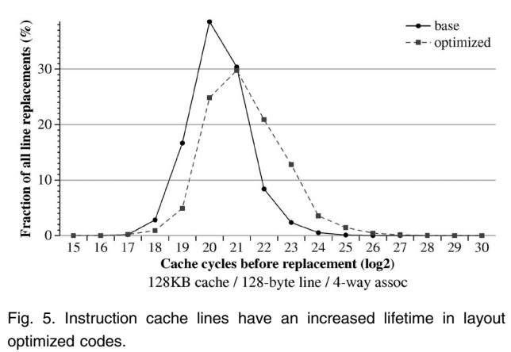

>图 5. 指令缓存行在布局优化代码中具有更长的生命周期。

我们的结果表明，缓存行在优化后的二进制文件中具有更长的生命周期。 平均寿命已从 219 个周期增加到 220 个或更多周期，这意味着高速缓存行的可用周期数是原来的两倍。 因为我们需要更少的缓存行，所以我们可以在更换之前将给定的缓存行保留更长时间，从而为指令的临时重用提供更多机会。

我们还测量了给定指令每次加载到缓存中时使用的平均次数。 也就是说，每次我们加载缓存行时，我们都会计算在该行被替换之前每条指令被使用的次数。

我们的结果表明，基准（未优化）应用程序未使用超过 50% 的加载到缓存中的内容，而优化后的应用程序使用了超过 80% 的加载内容（只有 18% 未使用）。 这反映了我们在上一节中看到的代码压缩。

如果我们检查被多次使用的指令的百分比，我们会发现优化应用程序的重用率有所提高：所有指令中有 16% 被使用了两次，而在未优化的代码中只有 10%。 由于缓存行的生命周期延长，优化后的应用程序中所有其他重用类别的指令百分比都有所增加。

### 5.2 Impact on the Fetch Width（对取指宽度的影响）

内存中基本块的布局也可能对有效读取宽度产生影响。

分支的存在扰乱了提取序列，但实际上中断它的是分支。 很难在同一个周期中同时获取已采取的分支及其目标，就像在分支地址缓存 [33] 和折叠缓冲区 [6] 中所做的那样。 它需要每个周期获取多个缓存行和一个复杂的指令对齐网络，这可能会增加额外的流水线阶段。

同时，很容易在同一周期中获取未采用的分支及其目标，因为它们位于连续的内存位置。 无需获取额外的高速缓存行，也无需重新对齐指令以反映实际执行流程。

如第 5.3 节所示，代码布局优化非常成功地将分支对齐到它们未采用的方向，在条件分支中达到 80% 的未采用率。 此外，60% 的所有已执行分支始终未被采用。

图 6 显示了代码布局优化对每个周期能够提取多达三个顺序基本块的提取引擎（[27] 中描述的 SEQ.3 引擎）和跟踪缓存架构的影响。

 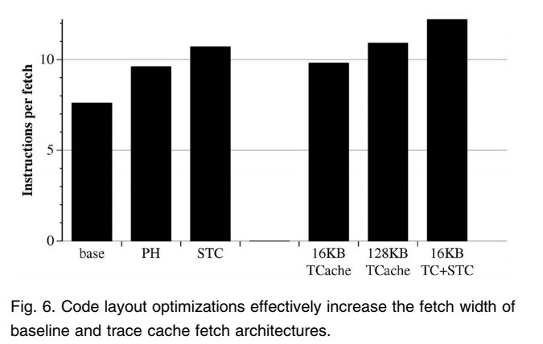

>   图 6. 代码布局优化有效地增加了基线和跟踪缓存提取架构的提取宽度。

图 6 中的结果表明，代码布局优化（例如 Pettis 和 Hansen [20] 和软件跟踪缓存提出的优化）有效地增加了提取引擎每个周期提供的指令数量，达到了接近于 跟踪缓存。

将 STC 与 Pettis 和 Hansen 优化代码进行比较，我们的结果表明，除了在上一节中观察到的改进的指令缓存未命中率之外，STC 还提供了更好的提取宽度。

但是，代码布局优化的好处并不局限于获取连续基本块的架构。 跟踪缓存允许获取引擎在单个周期内获取不连续的基本块，但在与代码布局优化相结合时，它也会体验到显着的性能提升。 我们的结果表明，在布局优化代码上使用的 16KB 小跟踪缓存比使用未优化代码的大得多的跟踪缓存具有更好的性能。

跟踪缓存读取动态指令流，因此不受内存中指令布局的影响。 但是，跟踪缓存不是独立的提取机制。 如果请求的跟踪不存在于跟踪缓存中，则必须从辅助提取路径（通常是顺序提取引擎）中提取它。 正是在这些情况下，代码布局优化有助于小型跟踪缓存提高性能：如果辅助提取引擎的性能接近跟踪缓存的性能，则跟踪缓存中的未命中就不那么重要了。 在 [24]、[25] 中可以找到 STC 和跟踪缓存的获取性能的完整比较。

### 5.3 Impact on the Branch Predictor（对分支预测器的影响）

我们已经证明代码布局优化对指令缓存性能有积极影响，并且它们增加了有效提取宽度，但我们还没有检查代码布局对分支预测机制的影响。 在本节中，我们提供了这样一个深入的分析，扩展了 [4]、[12] 中所做的工作。

更好的指令缓存性能意味着可以更快地提供指令，而无需等待较低的内存层次结构级别。 增加的取指宽度意味着，每次我们取指时，都会提供更多的指令。 但是，如果我们对分支预测的准确性产生负面影响，我们将非常快速、非常广泛地获取数据，但会从错误的推测路径中获取数据。

#### 5.3.1 Effect on Static Prediction（对静态预测的影响）

在本节中，我们将检查一些简单的静态分支预测方案为检查的基准实现的预测准确性。 检查的静态策略是：预测将采用所有分支，预测将不采用所有分支，预测将采用后向分支而不会采用前向分支，并预测分支将始终采用其最通常的方向配置文件信息 [8]、[29]。

图 7 显示了一些简单的静态分支预测策略的分支预测准确性：始终采用、始终不采用、向后向前不采用 (BTFNT) 和基于配置文件的预测器，用于原始代码布局和编译器优化布局 . 对于优化布局，我们展示了用于训练（自优化）的相同输入集和不同输入集（交叉优化）的结果。 显示 8KB gshare 预测器 [16] 的预测精度以进行比较。

 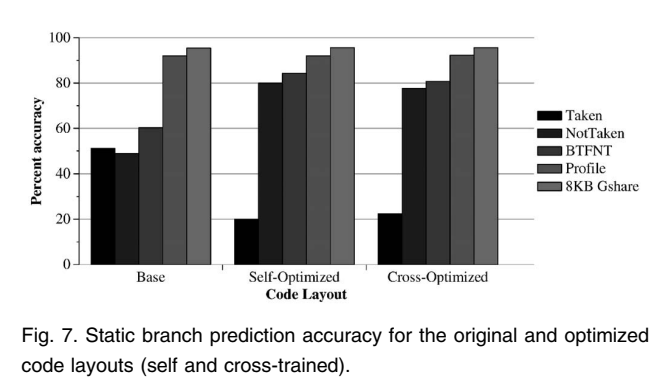

>   图 7. 原始和优化代码布局（自训练和交叉训练）的静态分支预测准确度。

事实证明，简单的静态预测方法对于预测准确率接近 50% 的基线代码布局毫无用处，只有 BTFNT 预测器达到 60%，并且在任何研究的基准测试中都不会低于 50%（未显示单个基准测试结果）。 另一方面，剖面静态预测器证明非常准确，正确预测了 90% 以上的分支。 这表明可以静态预测分支，但不能使用这种简单的策略。

**我们使用软件跟踪缓存 (STC) 算法优化代码布局，该算法的目标是增加代码的顺序性，即重新排序基本块，以便不采用分支。**

一旦我们优化了代码布局，静态分支预测的准确性就会发生巨大变化。 Not Taken 和 BTFNT 预测器现在可以正确预测超过 80% 的分支，在交叉训练测试中失去了一些准确性。 这个 80% 的预测准确率表明静态分支预测对于这些优化的代码布局可以非常准确，但仍然远低于现代两级自适应分支预测器（如 gshare）所能达到的水平。

为了进一步了解优化二进制文件的这种高度可预测性，我们深入探讨了代码布局优化引入的分支行为变化。

检查原始代码布局的分支分类，我们观察到 36% 的分支始终未被执行，而 32% 的分支始终被执行。 其余分支均匀分布在所有已采用的百分比值中，采用 50% 的分支的峰值略高。 这解释了由于分支似乎不遵循如此简单的行为规则而获得的低预测准确性。

通过优化代码布局，我们可以反转那些占用时间超过 50% 的分支的方向。 这样，80% 的时间都被采用的分支现在只有 20% 的时间被采用。

优化代码布局的分类表明，我们非常成功地反转了那些通常采用的分支的分支方向。 总是采用的分支的比例从 32% 减少到 10%，并且大多数超过 50% 的类别也出现了分支数量的减少。 这导致始终未采用的分支数量显着增加，从 36% 增加到 59%。 由于大多数高度偏向的分支位于未采用的一侧，而大多数其他分支从超过 50% 的采用变为大部分未采用，因此始终未采用（或 BTFNT）预测器的预测准确性显着提高，如图 7 所示。

由于算法的限制，并非所有大多数采用的分支都可以反转。 例如，循环终止不能逆转（除非我们执行循环展开）2，并且在算法后期探索的条件分支可能会发现它们自己只有一个开放路径可以遵循，对应于所采用的目标。 这些解释了为什么我们只能将始终采用的分支从 32% 减少到 10%。

通常不采用的分支数量的增加解释了两种代码布局在静态分支预测方面的不同行为。 可以预期代码布局优化会进一步提高静态预测精度，该代码布局优化明确针对特定分支预测器，如 BTFNT 预测器，或使用代码复制技术在其静态预测中使用路径信息。

接下来，我们将研究分支方向的这种变化如何影响动态分支预测。

#### 5.3.2 Effect on Two-Level Adaptive Predictors（对两级自适应预测器的影响）

图 8a 显示了代码重新排序对 gshare [16]、PAg [34]、[35] 和双峰预测器 [29] 的动态预测精度的影响。 针对基线（虚线）和优化代码布局（实线）探索了从 512 字节到 16KB 的预测变量大小。

 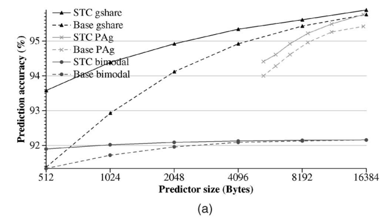

>   图 8. 代码布局优化对两级自适应分支预测器的影响。 
>
>   (a) 使用两级预测变量的预测准确性。

显然，STC 提高了检查的分支预测器的预测准确性，尤其是对于较小的预测器大小。 gshare 和双峰预测器似乎都收敛于无限大的预测器，这表明使用 STC 的好处与预测表干扰有关。 表格越大，干扰越少，两种布局的预测精度就越接近。

图 8b 显示了在具有基线和优化代码布局的 gshare 分支预测器的预测表中引入冲突的动态分支的百分比。 我们将冲突分为三类：当冲突不改变预测时的中性干扰，如果冲突改变预测的好坏则为积极或消极。

 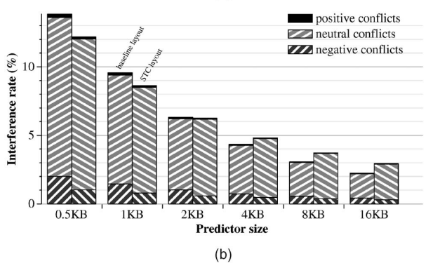

>   (b) 对 gshare 预测表造成干扰的动态分支。

正如预期的那样，当 STC 布局与 gshare 分支预测器一起使用时，负面冲突的数量会显着减少。 例如，使用优化的代码布局，1KB 的 gshare 的负面冲突从 1.45% 下降到 0.79%。

直观上，未采用分支数量的增加有利于正向干扰，因为更有可能的是，当两个分支发生干扰时，它们的行为相同（均未采用），从而导致正向或中性冲突。

冲突总量显示出不同的行为。 优化后的代码布局对于较小的预测器大小具有较少的中性冲突，但对于最大的配置最终会产生大量的中性干扰。

我们将在下一节中进一步研究这种中性干扰增加，我们将在其中检查去混叠分支预测方案。

#### 5.3.3 Effect on Dealiased Predictors（对去混叠预测变量的影响）

鉴于优化代码布局的使用正在减少动态预测表中发现的负面干扰，检查现代分支预测器会发生什么是很有趣的，这些分支预测器已经被组织起来以最小化这种干扰，比如 agree [30]，双模 [ 15] 和 gskew [17]、[28] 预测变量。 我们将这些预测器称为去混叠分支预测方案。

图 9 显示了具有基线和优化代码布局的去混叠预测器的预测精度。 显示具有优化布局的 gshare 预测器的预测精度以供参考。

 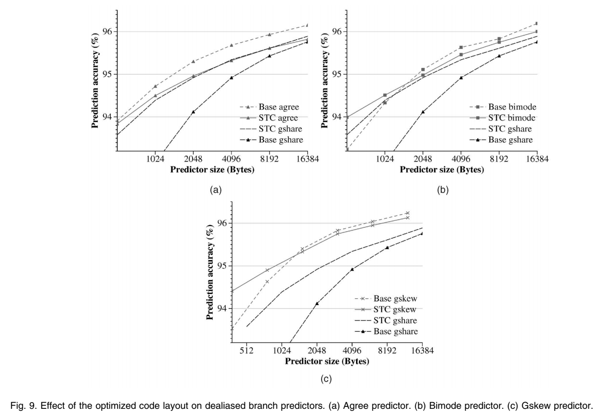

>图 9. 优化代码布局对去别名分支预测器的影响。 (a) 同意预测。 (b) 双模预测器。 (c) Gskew 预测器。

这些结果表明，对于小的预测器大小，使用优化的代码布局可以获得相同或更高的精度，即使在去别名的分支预测器中也是如此。 优化布局的优势在 0.4KB gskew 预测器中尤为明显，它将预测精度从 93.5% 提高到 94.4%。

对于中型和大型预测器大小，所有去别名分支预测器都使用基线代码布局获得更高的准确度，16KB 一致预测器的差异尤为显着，其使用基线布局获得 96.2% 的准确度，使用优化代码获得 95.8% 的准确度。

一个更重要的结果表明，使用具有优化代码布局的大同意或双模预测器不会产生比 gshare 预测器显着的改进。 在使用优化的代码布局时，只有 gskew 预测器获得比 gshare 预测器明显更好的结果。

我们还检查了在具有优化代码布局的 gshare 分支预测器和使用这两种代码布局的同意预测器的预测表中引入冲突的动态分支的百分比。

这些结果表明，与优化代码布局相比，具有非优化布局的一致预测方案获得了稍微更好的负面干扰减少。 令人惊讶的是，使用同意预测器，优化后的代码布局比基线具有更多的负面冲突。

从这些结果来看，去别名预测器似乎证明比优化代码布局更有效地减少干扰，但更重要的结果是，减少优化二进制文件中的冲突似乎更加困难。 优化的代码布局对较大的预测器大小具有更多的总干扰这一事实可以解释这种更高比例的负面冲突。

事实上，像 agree 这样的去混叠预测器使用优化的二进制文件，获得的结果比 gshare 预测器更差，这表明存在一些其他因素阻碍了这些预测器的性能。

在优化的代码布局中发现高比例的未采用分支（80% 的所有分支未采用）可能会阻碍 BHR 中的分支分布。 当使用优化的二进制文件时，BHR 往往会充满零，导致许多可能的 BHR 值从未或很少被使用，导致更糟糕的分支分布和有用信息的丢失，无法做出正确的预测。

我们通过计算在两种代码布局的 11 位全局历史预测器中找到每个可能的历史值的次数来分析此 BHR 分布因子。 结果表明，基线代码均匀地分布了所有可能的 BHR 值的使用，在全 1 的值（所有采用的分支）处具有高峰，而 STC 布局在具有许多 0 的值中具有更高的使用集中度 （所有 BHR 值的 85% 有八个或更多个 0，20% 全部为 0）。

这种负面影响在 GAg 预测器中尤为明显，它完全取决于 BHR 值的正确分布。 干扰减少无法补偿不良的值分布，导致使用优化代码时的准确性损失。

这在 gshare 预测器中不会发生，因为它将分支地址与分支历史进行异或，隐藏了这种效果并导致干扰减少效果占主导地位。

去混叠预测器不会从干扰减少效果中获益，因为它们本身非常擅长减少干扰，因此它们只会遭受负面的 BHR 影响，并且会因优化的代码布局而失去准确性。

### 5.4 Overall Performance Impact（整体性能影响）

在本节中，我们将研究代码布局优化对整体处理器和系统性能的影响。 尽管代码布局优化通常以 L1 指令缓存性能为目标，但它们对获取引擎的其他组件和内存层次结构的其他级别有重大影响。

图 10a 显示了使用未优化和优化代码运行 OLTP 基准测试的商业数据库管理系统的指令 TLB 和共享 L2 缓存中的未命中数。 共享 L2 高速缓存中的未命中已分类为指令未命中或数据未命中。

 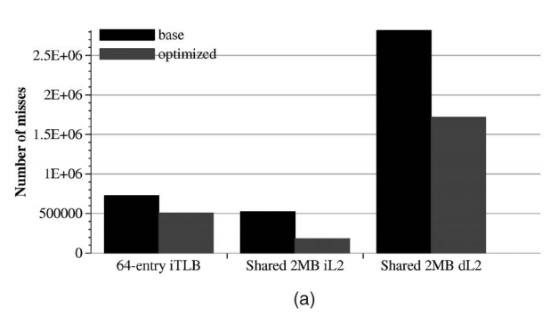

>图 10. 代码布局优化对整体性能的影响。
>(a) 对内存层次结构的影响。

我们的结果显示指令 TLB 未命中数减少了。 过程放置优化将未使用的例程移到过程的末尾，将有用的代码压缩在更少的页面中，这解释了这个结果。

由于例程和基本块的仔细布局，L2 共享缓存显着减少了指令未命中数。 为避免 L1 中的冲突而映射的代码也将避免更大的 L2 中的冲突。

一个更令人惊讶的结果是 L2 数据缺失的显着减少。 指令空间局部性的增加使得代码适合更少的代码页，而 L1 和 L2 指令未命中率的降低在共享的 L2 缓存中留下了更多空间，以便数据更舒适地放置，减少了数据和指令之间的冲突，从而减少了 数据丢失。

这些结果表明，代码布局优化不仅对 L1 指令缓存有积极影响，而且对内存层次结构的所有级别都有积极影响。 这使得性能改进超越了仅通过提高指令高速缓存未命中率所能获得的性能改进。

图 10b 显示了 SPECint95 基准测试的平均处理器性能，以每周期指令数 (IPC) 为单位，使用针对各种指令缓存大小和完美指令缓存的未优化和优化代码。 显示了具有真实分支预测器和完美分支预测器的处理器的结果。

 

>(b) 对处理器 IPC (SPEC-Int) 的影响。

图 10b 中的结果表明，**使用布局优化代码的处理器性能高于使用两倍大小的指令缓存的未优化代码。** 此外，未优化的二进制文件的性能在 128KB 专用于指令缓存后达到饱和，而具有 32KB 缓存的优化代码的性能高于使用完美指令缓存的未优化代码。

不仅仅是指令缓存性能改进需要考虑：提取宽度的增加、更好的分支预测准确性、更低的 TLB 缺失率以及更少的 L2 数据缺失都有助于提高性能。

当使用完美分支预测时，优化二进制文件提高预测精度的优势消失了，未优化的代码可以达到更高的性能。 尽管如此，使用 32KB 指令缓存的优化代码仍可达到与使用 128KB 缓存的未优化代码相同的性能。

图 10c 显示了我们的商业数据库应用程序的相对执行时间，因为我们包括不同的代码布局优化。 探索的优化组合包括：单独的过程排序（porder）、单独的基本块链接（chain）、带有过程拆分的基本块链接（chain+split）、带有过程排序的基本块链（chain+porder），以及所有优化一起（ 链接、拆分和排序）。 我们展示了在两个不同的 Alpha 平台上真机运行的结果。

 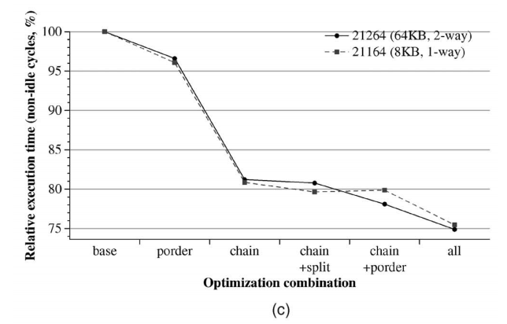

>(c) 对整体系统性能（OLTP）的影响。

我们的结果表明，获得的大部分性能改进来自基本的块链优化，这主要是增加空间局部性的原因。 当我们在基本块链之上添加例程拆分和过程排序时，会遇到性能的下一个重大进步。 例程拆分为过程排序优化提供了额外的自由度，现在可以移走例程中未使用的部分，压缩代码，以便大多数缓存行仅包含有用的指令。

总体而言，我们的结果表明，代码布局优化可以在商业数据库等困难而重要的工作负载领域中将执行时间减少 25%。 此外，我们的结果表明，获得的性能改进在不同的处理器世代中是一致的。

## 6. CONCLUSIONS

在本文中，我们描述了软件跟踪缓存 (STC)，这是一种代码布局优化，其目标不仅是指令缓存性能，还包括获取引擎的有效获取宽度。

我们分析了软件跟踪缓存和其他代码布局优化对提取性能所有三个方面的性能影响：指令缓存未命中率、有效提取宽度和分支预测准确性。

我们的结果表明，代码布局优化为指令缓存性能提供了显着改进，而不仅限于减少冲突未命中。 优化后的代码可以更有效地利用可用的缓存空间，仅将有用的指令打包到缓存行中，并将代码中未使用的部分移至可执行文件的末尾。 这种指令的紧密打包导致空间局部性的大幅增加和缓存行的生命周期增加，这为时间重用提供了扩展的机会。

我们还展示了布局优化可以增加前端引擎的有效提取宽度。 能够获取多个连续基本块的获取引擎将性能提高到接近跟踪缓存的水平，并且使用优化代码的小型跟踪缓存的性能高于运行未优化应用程序的更大跟踪缓存的性能。

如果我们降低分支预测的准确性，对指令缓存和提取宽度产生积极影响可能毫无价值。 但是，我们表明情况并非如此。 布局优化代码更适合使用静态分支预测器或简单的 2 级自适应分支预测器进行分支预测。 只有去混叠的分支预测器，我们在分支预测器中遇到了轻微的性能下降。 然而，预测准确性的损失被增加的缓存命中率和提取宽度所补偿。

最后，我们还检查了代码布局优化对整个内存层次结构的影响，发现优化后的代码不仅具有更好的指令内存性能，而且由于数据和指令之间的冲突率降低，数据内存性能也更好。 我们的结果表明，处理器性能的提高超出了单纯的指令缓存性能提高所能提供的范围，证实了获取宽度、分支预测准确性和数据内存性能也是代码布局优化对性能的重要贡献。 我们对在真实机器上运行 OLTP 工作负载的商业数据库应用程序进行的实验表明，布局优化代码可以将执行时间减少 25%。

在本文中，我们提倡使用编译器优化来提高提取和处理器性能，而无需进行复杂且昂贵的硬件修改。 我们改进了之前使用 STC 进行的代码布局优化工作，并详细分析了获取和处理器性能提高的原因。 我们的结果表明，通过使软件适应底层硬件的特性，可以显着提高性能。

## ACKNOWLEDGMENTS（致谢）

如果没有来自伊利诺伊大学香槟分校的 Josep Torrellas、Luiz Barroso、Kourosh Gharachorloo、Robert Cohn、Geoffrey Lowney 和整个西方研究实验室的合作，这项工作是不可能完成的。 团队。 这项工作还得到了西班牙科学技术部根据合同 TIC-2001-0995-C02-01、Generalitat de Catalunya 根据赠款 1998FI-00306-APTIND 和 CEPBA 的支持。