[TOC]

# 计网实验二

## 0. 参考

实验基础知识与实现思路 [哈工大 计算机网络 实验二 可靠数据传输协议（停等协议与GBN协议）_Johngo学长 (johngo689.com)](https://www.johngo689.com/117967/)

## 1. 实验目标

* **必做**
  1. 基于UDP实现一个简单的GBN协议，实现单向可靠数据传输（服务器到客户端的传输）
  2. 模拟引入数据包的丢失，验证所设计实验的有效性。

* **选做**
  1. 改进所设计的GBN协议，支持双向数据传输
  2. 基于所设计的等停协议，实现一个C/S结构的文件传输应用
  3. 将设计的GBN协议改进为SR协议
     * 展示GBN和SR协议的代码

## 2. 调通书上的代码

### 代码理解

* **INADDR_ANY**

  ```cpp
  #define INADDR_ANY              (u_long)0x00000000
  #define INADDR_LOOPBACK         0x7f000001
  #define INADDR_BROADCAST        (u_long)0xffffffff
  ```

  - **INADDR_ANY选项**
    一般情况下，如果你要建立网络服务器应用程序，则你要通知服务器操作系统：请在某地址 xxx.xxx.xxx.xxx上的某端口 yyyy上进行侦听，并且把侦听到的数据包发送给我。这个过程，你是通过bind()系统调用完成的。在服务端中，常常将需要绑定IP地址设置为INADDR_ANY。

    INADDR_ANY代表指定地址为0.0.0.0的地址，这个地址事实上表示不确定地址，或“所有地址”、“任意地址”;表示本地上所有的IP地址。

    因为有些机子不止一块网卡，多网卡的情况下，这个就表示所有网卡ip地址的意思。

    比如一台电脑有3块网卡，分别连接三个网络，那么这台电脑就有3个ip地址了，如果某个应用程序需要监听某个端口，那他要监听哪个网卡地址的端口呢？如果绑定某个具体的ip地址，你只能监听你所设置的ip地址所在的网卡的端口，其它两块网卡无法监听端口，如果我需要三个网卡都监听，那就需要绑定3个ip，也就等于需要管理3个套接字进行数据交换，这样岂不是很繁琐？
    所以你只需绑定INADDR_ANY，管理一个套接字就行，不管数据是从哪个网卡过来的，只要是绑定的端口号过来的数据，都可以接收到。

  - **INADDR_LOOPBACK选项**
    INADDR_LOOPBACK, 总是代表经由回环设备的本地主机，往往是127.0.0.1, 表示只能收到127.0.0.1上面的连接请求，表示客户端和服务端在同一个机器上。

  - **INADDR_BROADCAST选项**
    INADDR_BROADCAST 代表255.255.255.255的广播地址，广播消息不会在当前路由器进行转发，作用范围只能在当前局域网。

    当在客户端网络编程中，如绑定的地址是INADDR_BROADCAST表示是广播通信。

* **WSACleanup()**

  ```CPP
  int PASCAL FAR WSACleanup ( void );
  ```

  应用程序或DLL在使用Windows Sockets服务之前必须要进行一次成功的WSAStartup()调用.当它完成了Windows Sockets的使用后,应用程序或DLL必须调用WSACleanup()将其从Windows Sockets的实现中注销,并且该实现释放为应用程序或DLL分配的任何资源.任何打开的并已建立连接的SOCK_STREAM类型套接口在调用WSACleanup()时会重置; 而已经由closesocket()关闭却仍有要发送的悬而未决数据的套接口则不会受影响－ 该数据仍要发送.

   对应于一个任务进行的每一次WSAStartup()调用,必须有一个WSACleanup()调用.只有最后的WSACleanup()做实际的清除工作;前面的调用仅仅将Windows Sockets DLL中的内置引用计数递减.一个简单的应用程序为确保WSACleanup()调用了足够的次数,可以在一个循环中不断调用WSACleanup()直至返回WSANOTINITIALISED.

  返回值:  0 操作成功.   SOCKET_ERROR 否则.同时可以调用WSAGetLastError()获得错误代码.

### 解决代码在 Visual Studio 中不能正常运行的情况

主要报错是代码中的函数太老了，不兼容，解决方法如下

**方法一：禁用SDL检查**

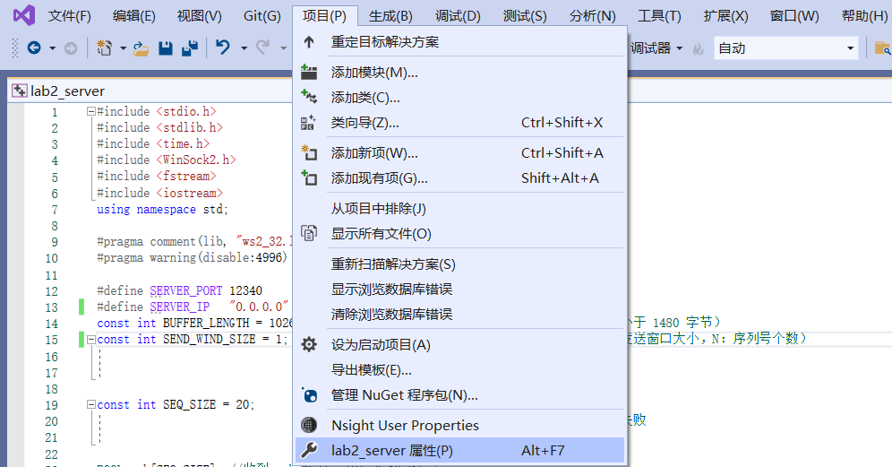

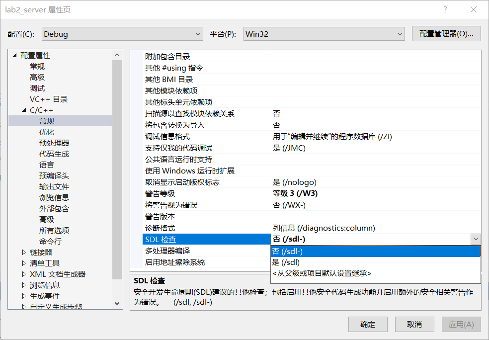

**方法二：**

>既然是由于编辑器的安全检查而引起的报错，那么我们是不是可以选择去掉这项安全检查，而实现代码正常运行呢？
>答案是可以的！
>通过观察报错提示，可以看到错误提示号为：4996，我们可以在代码的头部加上如下的定义，来去掉该条报错

```cpp
# pragma warning(disable:4996)
```

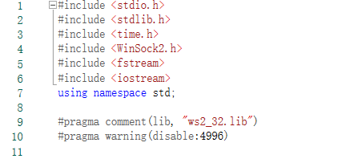

**方法三：在源文件开头添加如下代码**

```cpp
#define _CRT_SECURE_NO_WARNINGS 1
```


## 3. 代码运行演示结果

### 必做部分

**GBN流程图**

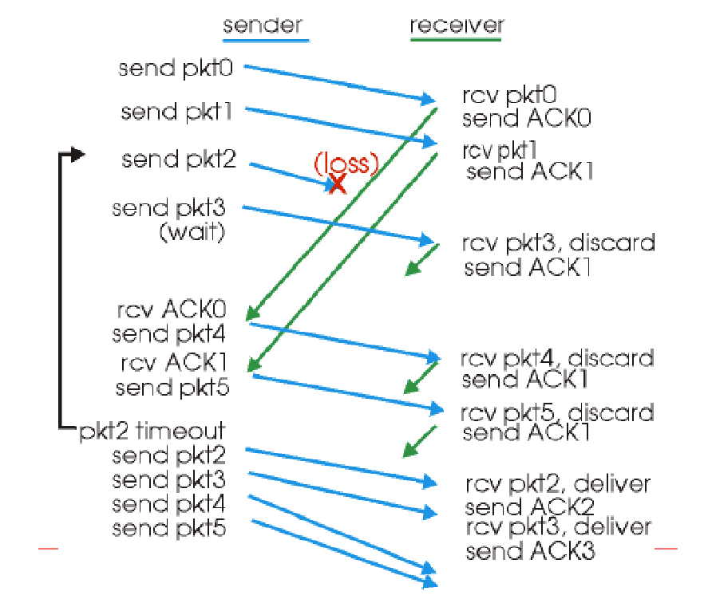

#### - 1. 基于UDP实现一个简单的GBN协议，实现单向可靠数据传输（服务器到客户端的传输）

> 初始化将所有的 `ack[index] = true;` ，每次发送数据之后 `ack[index] = false;` ，这样，当传输超过窗口大小，取模回到窗口前几位时，如果 `ack` 为 `false`，则上一轮接收还未成功，不能接收新的数据。

* <font color=green size=4>停等协议</font>

将GBN协议的窗口大小改为 1 即可。

> 停等协议中，服务器一次发送一个数据报，收到对应的$ack$后再发送下一个数据报；如果超时没有收到$ack$,服务器重新发送该数据报，至接收到客户端发来的对应的$ack$，或者超时次数达到设定的上限，停止发送。

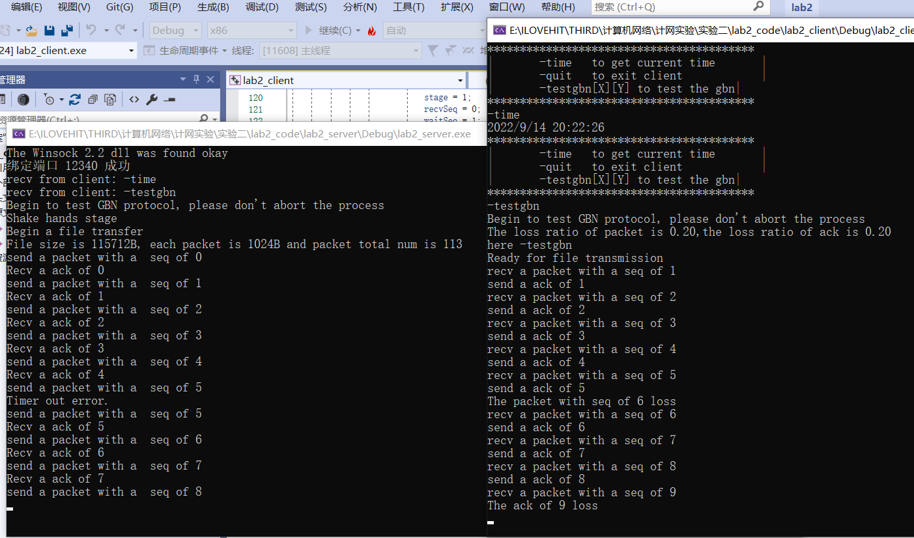

* <font color=green size=4>GBN实现单向可靠传输（服务器到客户端）</font>

  可以从运行结果看出，个别ack丢失后，由于累加判断的机制，接收到后面的ack仍然可以保证数据收发的正常进行。

  但是如果发生数据报传输过程中丢失，客户端接收不到对应的数据报，ack的序号保持为丢失的数据报的序号，停止发送ack，服务器收不到ack，等待超时后，将整个窗口中的内容重新发送。

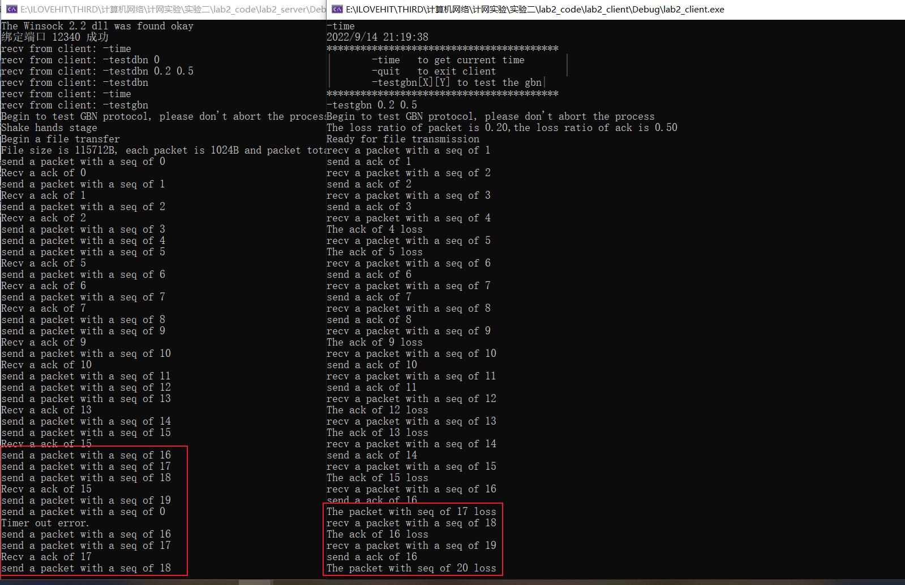

#### - 2. 模拟引入数据包的丢失，验证所设计实验的有效性。

第一问的测试中已经体现了，可以设置数据包丢失的概率和ACK丢失的概率。

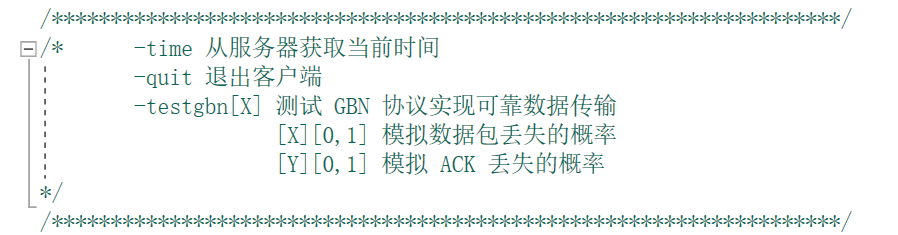

### 选做部分

#### - 选做一：改进所设计的GBN协议，支持双向数据传输

<font color=blue>实现客户端向服务器上传文件(client_send.txt ==> server_recv.txt)</font>


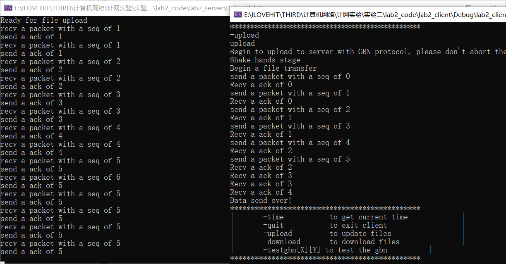

再去对应文件下检查，发现已经成功上传了


<font color=blue>实现客户端从服务器下载文件(server_send.txt ==> client_recv.txt)</font>

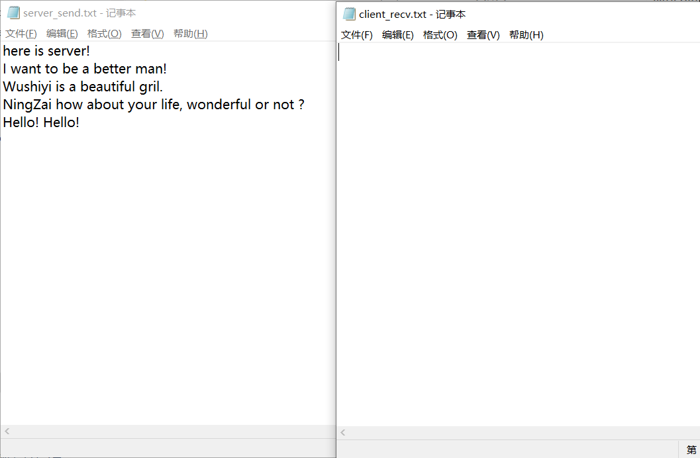

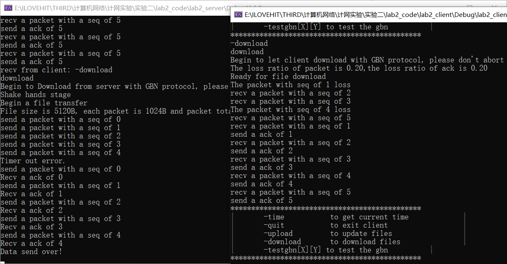

再去检查，发现下载成功了。


#### - 选做二：基于所设计的等停协议，实现一个C/S结构的文件传输应用

只需要将选作一中的窗口大小设置为 1 即，将 GBN 协议转变为停等协议，支持双向数据传输就是 C/S 结构的文件传输应用。

* **下载**

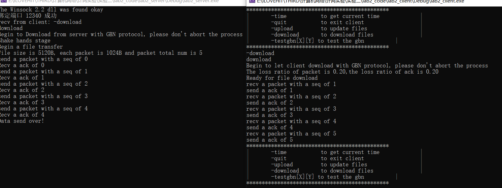


* **上传**

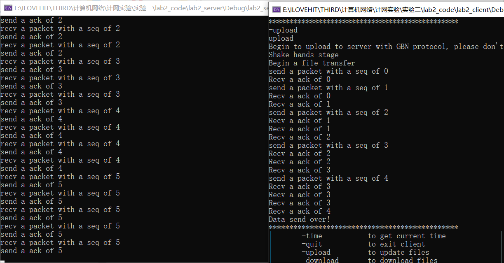


#### - 选做三：将设计的GBN协议改进为SR协议

<font color=green size=4>SR 协议（选择重传协议）</font>

* **SR中的滑动窗口**

 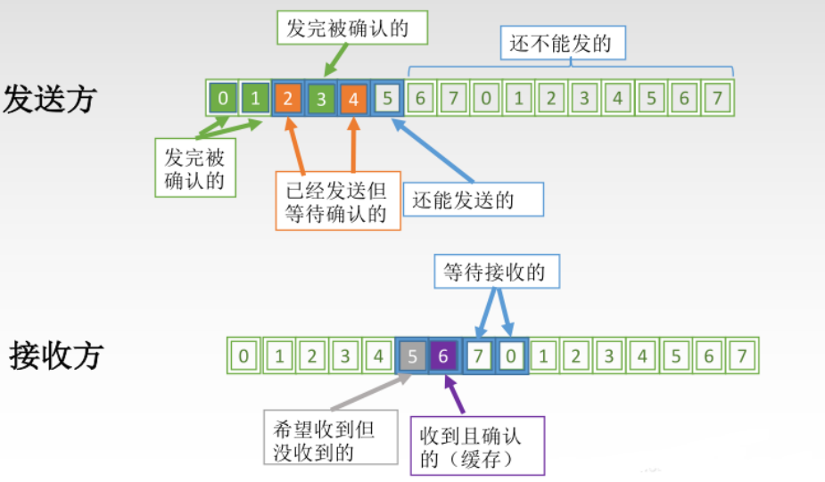

* **SR发送方必须响应的三件事**

 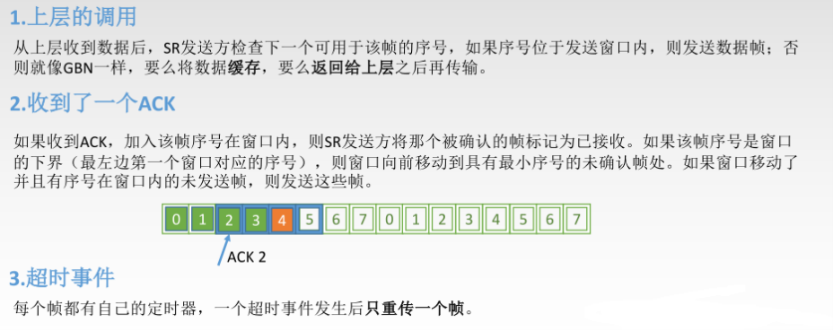

* **SR接收方要做的事**

 

* **SR 运行过程**

 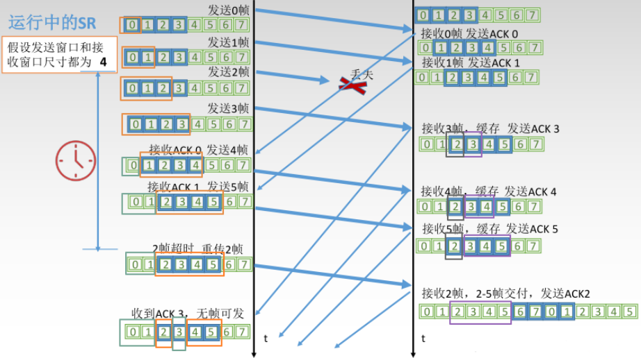

* **窗口大小的选择**

 

<font color=green size=4>SR协议实现结果演示</font>

* **基于SR协议的下载**


* **基于SR协议的上传**

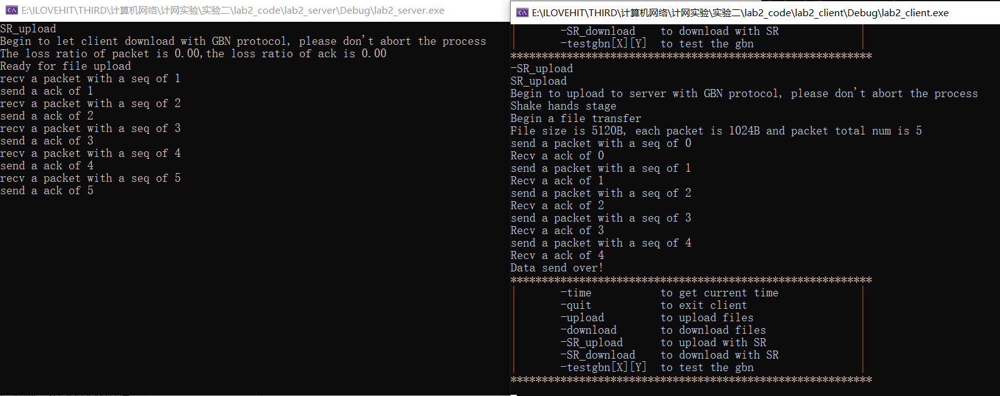


