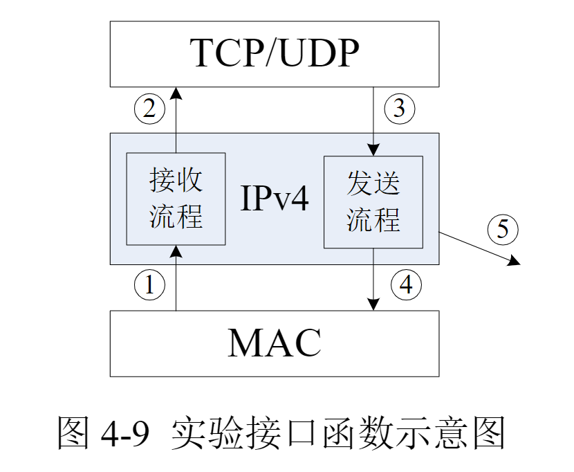
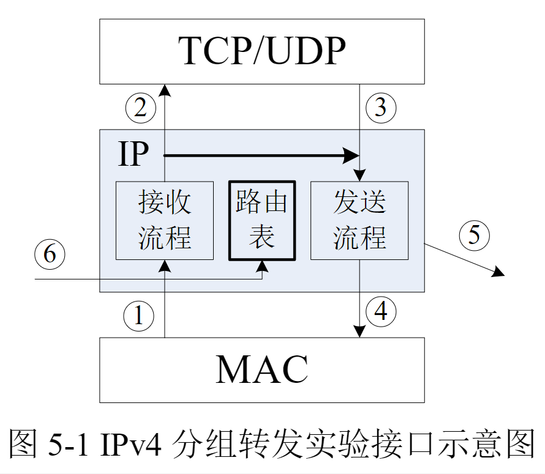

[TOC]

# 实验准备

* **IPV4报文结构**

   

* **ntohs()**

  是一个函数名，作用是将一个16位数由网络字节顺序转换为主机字节顺序 。

# 实验 4：IPv4 分组收发实验

## 实验要求

* **基本要求**

根据计算机网络实验系统所提供的上下层接口函数和协议中分组收发的主要流程，独立设计实现一个简单的 IPv4 分组收发模块。要求实现的主要功能包括：

1) IPv4 分组的基本接收处理，能够检测出接收到的 IP 分组是否存在如下错误：校验和错、TTL 错、版本号错、头部长度错、错误目标地址；
2) IPv4 分组的封装发送；

注：不要求实现 IPv4 协议中的选项和分片处理功能

* **接收流程**

  接收流程
  在接口函数 stud_ip_recv( )中，需要完成下列处理步骤（仅供参考）：

  * ① 检查接收到的 IPv4 分组头部的字段，包括版本号（Version）、头部长度（IP Head length）、生存时间（Time to live）以及头校验和（Header checksum）字段。对于出错的分组调用 ip_DiscardPkt( )丢弃，并说明错误类型。
  * ② 检查 IPv4 分组是否应该由本机接收。如果分组的目的地址是本机地址或广播地址，则说明此分组是发送给本机的；否则调用ip_DiscardPkt( )丢弃，并说明错误类型。
  * ③ 如果 IPV4 分组应该由本机接收，则提取得到上层协议类型，调用 ip_SendtoUp( )接口函数，交给系统进行后续接收处理。

* **发送流程**

  在接口函数 stud_ip_Upsend( )中，需要完成下列处理步骤（仅供参考）：

  * ① 根据所传参数（如数据大小），来确定分配的存储空间的大小并申请分组的存储空间。
  * ② 按 照 IPv4 协 议 标 准 填 写 IPv4 分 组 头 部 各 字 段 ， 标 识 符（Identification）字段可以使用一个随机数来填写。（注意：部分字段内容需要转换成网络字节序）
  * ③ 完成 IPv4 分组的封装后，调用 ip_SendtoLower( )接口函数完成后续的发送处理工作，最终将分组发送到网络中。

 

## 接口函数说明

### 需要实现的接口函数

* **接收接口**

  ```cpp
  int stud_ip_recv(char * pBuffer, unsigned short length)
  参数：
      pBuffer：指向接收缓冲区的指针，指向 IPv4 分组头部
      length：IPv4 分组长度
  返回值：
      0：成功接收 IP 分组并交给上层处理
      1：IP 分组接收失败
  ```

* **发送接口**

  ```cpp
  int stud_ip_Upsend(char* pBuffer, unsigned short len, unsigned int
  srcAddr, unsigned int dstAddr ,byte protocol, byte ttl)
  参数：
      pBuffer：指向发送缓冲区的指针，指向 IPv4 上层协议数据头部
      len：IPv4 上层协议数据长度
      srcAddr：源 IPv4 地址
      dstAddr：目的 IPv4 地址
      protocol：IPv4 上层协议号
      ttl：生存时间（Time To Live）
  返回值：
      0：成功发送 IP 分组
      1：发送 IP 分组失败
  ```

### 系统提供的接口函数

* **丢弃分组**

  ```cpp
  void ip_DiscardPkt(char * pBuffer ,int type)
  参数：
      pBuffer：指向被丢弃分组的指针
      type：分组被丢弃的原因，可取以下值：
      STUD_IP_TEST_CHECKSUM_ERROR //IP 校验和出错
      STUD_IP_TEST_TTL_ERROR //TTL 值出错
      STUD_IP_TEST_VERSION_ERROR //IP 版本号错
      STUD_IP_TEST_HEADLEN_ERROR //头部长度错
      STUD_IP_TEST_DESTINATION_ERROR //目的地址错
  ```

* **发送分组**

  ```cpp
  void ip_SendtoLower(char *pBuffer ,int length)
  参数：
      pBuffer：指向待发送的 IPv4 分组头部的指针
      length：待发送的 IPv4 分组长度
  ```

* **上层接收**

  ```cpp
  void ip_SendtoUp(char *pBuffer, int length)
  参数：
      pBuffer：指向要上交的上层协议报文头部的指针
      length：上交报文长度
  ```

* **获取本机 IPv4 地址**

  ```cpp
  unsigned int getIpv4Address( )
  参数：无
  ```

  

# 实验 5：IPv4 分组转发实验

## 实验要求

在前面 IPv4 分组收发实验的基础上，增加分组转发功能。具体来说，对于每一个到达本机的 IPv4 分组，根据其目的 IPv4 地址决定分组的处理行为，对该分组进行如下的几类操作：
1) 向上层协议上交目的地址为本机地址的分组；
1) 根据路由查找结果，丢弃查不到路由的分组；

3) 根据路由查找结果，向相应接口转发不是本机接收的分组。

## 实验内容

实验的主要流程和系统接口函数与前面“IP 实验”基本相同。

在下层**接收**接口函数 Stud_fwd_deal( )中（图 5-1 中接口函数 1），实现分组接收处理。主要功能是根据分组中目的 IPv4 地址结合对应的路由信息对分组进行处理。

分组需要**上交**，则调用接口函数 Fwd_LocalRcv( )（图 5-1中接口函数 2）；需要丢弃，则调用函数 Fwd_DiscardPkt( )（图 5-1 中函数 5）；需要转发，则进行转发操作。

**转发操作**的实现要点包括，TTL 值减 1，然后重新计算头校验和，最后调用发送接口函数 Fwd_SendtoLower( )（ 图 5-1 中 接 口 函 数 4 ） 将 分 组 发 送 出 去 。 注 意 ， 接 口 函 数Fwd_SendtoLower( )比前面实验增加了一个参数 pNxtHopAddr，要求在调用时传入下一跳的 IPv4 地址，此地址是通过查找路由表得到的。

 

> 一般而言，路由信息包括**地址段、距离、下一跳地址、操作类型**等。

> 在接收到 IPv4 分组后，要通过其目的地址匹配地址段来判断是否为本机地址，如果是则本机接收；如果不是，则通过其目的地址段查找路由表信息，从而得到进一步的操作类型，转发情况下还要获得下一跳的 IPv4地址。发送 IPv4 分组时，也要拿目的地址来查找路由表，得到下一跳的IPv4 地址，然后调用发送接口函数做进一步处理。在前面实验中，发送流程中没有查找路由表来确定下一跳地址的步骤，这项工作由系统来完成了，在本实验中则作为实验内容要求学生实现。

> 需要进一步说明的是，在转发路径中，本路由器可能是路径上的最后一跳，可以直接转发给目的主机，此时下一跳的地址就是 IPv4 分组的目的地址；而非最后一跳的情况下，下一跳的地址是从对应的路由信息中获取的。因此，在路由表中转发类型要区分最后一跳和非最后一跳的情况。

>路由表数据结构的设计是非常重要的，会极大地影响路由表的查找速度，进而影响路由器的分组转发性能。本实验中虽然不会涉及大量分组的处理问题，但良好且高效的数据结构无疑会为后面的实验奠定良好的基础。链表结构是最简单的，但效率比较低；**树型结构**的查找效率会提高很多，但组织和维护有些复杂，可以作为提高的要求。具体数据结构的设计，可以在实践中进一步深入研究。

## 接口函数说明

* **路由表维护**

  需要完成下列分组接收处理步骤：

  ```cpp
  stud_Route_Init( ) // 函数中，对路由表进行初始化。
  stud_route_add( )	// 函数中，完成路由的增加。
  ```

* **转发处理流程**

  在 `stud_fwd_deal( )`函数中，需要完成下列分组接收处理步骤：

  1) 查找路由表。根据相应路由表项的类型来确定下一步操作，错误分组调用函数 fwd_DiscardPkt( )进行丢弃，上交分组调用接口函数 fwd_LocalRcv( )提交给上层协议继续处理，转发分组进行转发处理。注意，转发分组还要从路由表项中获取下一跳的 IPv4地址。
  2) 转发处理流程。对 IPv4 头部中的 TTL 字段减 1，重新计算校验和，然后调用下层接口 fwd_SendtoLower( )进行发送处理。

函数接口表
| 函数名                                     | 说明                                                         | 是否需要学生实现 |
| ------------------------------------------ | ------------------------------------------------------------ | ---------------- |
| <font color=green>`stud_fwd_deal`</font>   | 系统处理收到的 IP 分组的函数，当接收到一个 IP 分组的时候，实验系统会调用该函数进行处理 | 是               |
| `fwd_SendtoLower`                          | 将封装完成的 IP 分组通过链路层发送出去的函数                 | 否               |
| `fwd_LocalRcv`                             | 将 IP 分组上交本机上层协议的函数，即当分组需要上交上层函数的时候调用本函数 | 否               |
| `fwd_DiscardPkt`                           | 丢弃 IP 分组的函数。当需要丢弃一个 IP 分组的时候调用         | 否               |
| <font color=green>`stud_route_add`</font>  | 向路由表添加路由的函数。系统将调用该函数向路由表添加一条 IPv4 路由 | 是               |
| <font color=green>`stud_Route_Init`</font> | 路由表初始化函数，系统初始化的时候将调用此函数对路由表进行初始化操作 | 是               |
| `getIpv4Address`                           | 获取本机的 IPv4 地址，用来判断分组地址和本机地址是否相同     | 否               |

### 系统提供的函数

* **fwd_LocalRcv( )**

  ```cpp
  void fwd_LocalRcv(char *pBuffer, int length)
  参数：
      pBuffer：指向分组的 IP 头
      length：表示分组的长度
  说明：
      本函数是 IPv4 协议接收流程的上层接口函数，在对 IPv4 的分组完
      成解析处理之后，如果分组的目的地址是本机的地址，则调用本函数将
      正确分组提交上层相应协议模块进一步处理。
  ```

* **fwd_SendtoLower( )**

  ```cpp
  void fwd_SendtoLower(char *pBuffer, int length, unsigned int nexthop)
  参数：
      pBuffer：指向所要发送的 IPv4 分组头部
      length：分组长度（包括分组头部）
      nexthop：转发时下一跳的地址。
  说明：
      本函数是发送流程的下层接口函数，在 IPv4 协议模块完成发送封装
      工作后调用该接口函数进行后续发送处理。其中，后续的发送处理过程
      包括分片处理、IPv4 地址到 MAC 地址的映射（ARP 协议）、封装成 MAC
      帧等工作，这部分内容不需要学生完成，由实验系统提供支持。
  ```

* **fwd_DiscardPkt( )**

  ```cpp
  void fwd_DiscardPkt(char * pBuffer, int type)
  参数：
      pBuffer：指向被丢弃的 IPV4 分组头部
      type：表示错误类型，包括 TTL 错误和找不到路由两种错误，定义
  如下：
      STUD_FORWARD_TEST_TTLERROR
      STUD_FORWARD_TEST_NOROUTE
  说明：
      本函数是丢弃分组的函数，在接收流程中检查到错误时调用此函数
      将分组丢弃。
  ```

* **getIpv4Address( )**

  ```cpp
  UINT32 getIpv4Address( )
  说明：
      本函数用于获取本机的 IPv4 地址，学生调用该函数即可返回本机的
      IPv4 地址，可以用来判断 IPV4 分组是否为本机接收。
  返回值：
      本机 IPv4 地址。
  ```

  

### 待实现的函数

* **stud_Route_Init( )** 

  ```cpp
  void stud_Route_Init( )
  参数：
      无。
  说明：
      本函数将在系统启动的时候被调用，学生可将初始化路由表的代码写在这里。
  ```

* **stud_route_add( )**

  ```cpp
  void stud_route_add(stud_route_msg *proute)
  参数：
      proute ： 指向需要添加路由信息的结构体头部，其数据结构
      stud_route_msg 的定义如下：
      typedef struct stud_route_msg
      {
          unsigned int dest;
          unsigned int masklen;
          unsigned int nexthop;
      } stud_route_msg;
  说明：
      本函数为路由表配置接口，系统在配置路由表时需要调用此接口。
      此函数功能为向路由表中增加一个新的表项，将参数所传递的路由信息
      添加到路由表中。
  ```

* **stud_fwd_deal( )**

  ```cpp
  int stud_fwd_deal(char * pBuffer, int length)
  参数：
      pBuffer：指向接收到的 IPv4 分组头部
      length：IPv4 分组的长度
  返回值：
      0 为成功，1 为失败；
  说明：
  	本函数是 IPv4 协议接收流程的下层接口函数，实验系统从网络中接
  	收到分组后会调用本函数。调用该函数之前已完成 IP 报文的合法性检查，
  	因此学生在本函数中应该实现如下功能：
  	a. 判定是否为本机接收的分组，如果是则调用 fwd_LocalRcv( )；
  	b. 按照最长匹配查找路由表获取下一跳，查找失败则调用 fwd_DiscardPkt( )；
  	c.调用 fwd_SendtoLower( )完成报文发送；
  	d.转发过程中注意 TTL 的处理及校验和的变化。
  ```

* 除了以上的函数以外，学生可根据需要自己编写一些实验需要的函数和数据结构，包括路由表的数据结构，对路由表的搜索、初始化等操作函数。

## IPV4子网掩码计算

IP地址与子网掩码1：[IP地址与MAC地址的区别_郭威gowill的博客-CSDN博客_简述ip地址与mac地址的区别](https://blog.csdn.net/guoweimelon/article/details/50858597)

IP地址与子网掩码2：[IP地址和MAC地址的区别和联系是什么？ - 知乎 (zhihu.com)](https://www.zhihu.com/question/49335649)

根据子网掩码长度计算子网掩码：[子网掩码计算_yinhua405的博客-CSDN博客_子网掩码长度怎么算](https://blog.csdn.net/yinhua405/article/details/77098894)


<font face="华文琥珀">IP			：网络部分				  + 主机部分</font>

<font face="华文琥珀">子网掩码：<font color=red>网络部分（全1）</font>	+ 主机部分(全0)</font>

**子网掩码的长度：子网掩码中的网络部分的长度**

`子网掩码 & IP --> 将取出IP中的网络部分`


<font color=green size=4>路由器转发实现细节</font>

from [(157条消息) ip数据包经由路由转发的时候源ip，目的ip是否改变_知之可否的博客-CSDN博客](https://blog.csdn.net/gao1440156051/article/details/51213898)

> **ip数据包经由路由转发的时候源ip，目的ip是否改变？**
>
> 答案是不能改变的，**除非做了nat转换才能改变**。
>
> 不过mac地址是变化的，因为发送端开始不知道目的主机的mac地址，所以每经过一个路由器mac地址是变化的。
>
> **目的mac地址是如何得到的？**
>
> TCP/IP里面是用的ARP协议。比如新建了一个内网，如果一台机器A找机器B，封装FRAME时（OSI的第二层用的数据格式），要封装对方的MAC，开始时A不知道B的MAC，只知道IP，它就发一个ARP包，源IP是自己的，目的IP是B的，源MAC是自己的，目的MAC是广播的。然后这个请求包在内网内被广播，当其他机器接到这个包时，用目的IP和自己的IP比较，不是的话就丢弃。B接到时，发现IP与自己的一样，就答应这个包的请求，把自己的MAC送给A。如果B是其他子网的机器，那么路由器会判断出B是其他子网，然后路由器把自己的MAC返回给A，A以后再给B发包时，目的MAC封装的是路由器的。
>
> **路由转发过程：**
>
> 当主机A发向主机B的数据流在网络层封装成IP数据包，IP数据包的首部包含了源地址和目标地址。**主机A会用本机配置的24位IP网络掩码255.255.255.0与目标地址进行与运算，得出目标网络地址与本机的网络地址是不是在同一个网段中。**如果不是将IP数据包转发到网关。
>
> 在发往网关前主机A还会通过ARP的请求获得默认网关的MAC地址。在主机A数据链路层IP数据包封装成以太网数据帧，然后才发住到网关……也就是路由器上的一个端口。
>
> 当网关路由器接收到以太网数据帧时，发现数据帧中的目标MAC地址是自己的某一个端口的物理地址，这时路由器会把以太网数据帧的封装去掉。路由器认为这个IP数据包是要通过自己进行转发，接着它就在匹配路由表。匹配到路由项后，它就将包发往下一条地址。
>
> 路由器转发数据包就是这样，所以它始终是不会改IP地址的。只会改MAC.
>
> 当有数据包传到路由器时，路由器首先将其的目的地址与路由表进行对比，如果是本地网络，将不会进行转发到外网络，而是直接转发给本地网内的目的主机；**但是如果目的地址经路由表对比，发现不是在本网中，有nat就将改变源地址的IP（原源地址的Ip地址改为了路由器的IP地址），**路由器将数据包转发到相应的端口，进行通信。
>
> 比如：
> 如：A访问B，
> 首先对比是否同一子网，如果是,检查ARP表,有B的MAC就直接发送,没有就发送ARP请求.如果否，发送到默认网关C，源IP为A，源MAC为A，目的IP为B，目的MAC地址为C，
> C接收到这个包，检查路由表，发送到下一跳D，源IP为A，源MAC为C，目的IP为B，目的MAC为D…..
> 如此循环,直到发送到B.
>
> **NAT为特殊应用，会修改源IP为网关自己外网IP。**


## 树型结构优化

>   太菜了，就偷懒了

