[TOC]

# 利用  Wireshark 进行协议分析

## 实验内容

1)  学习 Wireshark 的使用
2)  利用 Wireshark 分析 HTTP 协议
3)  利用 Wireshark 分析 TCP 协议
4)  利用 Wireshark 分析 IP 协议
5)  利用 Wireshark 分析 Ethernet 数据帧 
选做内容：<br>
a)  利用 Wireshark 分析 DNS 协议<br>
b)  利用 Wireshark 分析 UDP 协议<br>
c)  利用 Wireshark 分析 ARP 协议

## 实验过程及结果

### 0. HTTP基础知识

* **HTTP（HyperText Transfer Protocol，超文本传输协议）**

​		HTTP（HyperText Transfer Protocol，超文本传输协议）是Web系统最核心的内容，是Web服务器和客户端直接进行数据传输的规则。HTTP协议是用于从WWW服务器传输超文本到本地浏览器的传送协议。可以使浏览器更加高效，使网络传输减少。不仅保证计算机正确快速地传输超文本文档，还确定传输文档中的哪一部分，以及首先显示(如文本先于图形)等。HTTP是一个应用层协议，有请求和响应构成，是一个标准的客户端服务器模型。HTTP具有以下几个特点：

1. **支持客户/服务器模式**：支持基本认证和安全认证；
2. **简单快速**：客户端向服务器请求服务时，只需传送请求方法和路径。请求方法常用的有GET、HEAD、POST。。由于HTTP协议简单，使得HTTP服务器的程序规模小，因而通信速度很快；
3. **灵活**：HTTP允许传输任意类型的数据对象。正在传输的类型由Content-Type加以标记；
4. **HTTP 0.9和1.0使用非持续连接**：限制每次连接只处理一个请求，服务器处理完客户的请求，并收到客户的应答后，即断开连接。采用这种方式可以节省传输时间。HTTP 1.1使用持续连接：不必为每个web对象创建一个新的连接，一个连接可以传送多个对象；
5. **无状态**：HTTP协议是无状态协议。无状态是指协议对于事务处理没有记忆能力。缺少状态意味着如果后续处理需要前面的信息，则它必须重传，这样可能导致每次连接传送的数据量增大。

* **http 的请求格式**

  HTTP请求信息由3部分组成:
  (1)请求方法URI协议/版本

  * *请求方法URI协议/版本：请求的第一行是"方法URI协议/版本"*

    例如:GET/sample.jsp HTTP/1.1 其中"GET"代表请求方法，"/sample.jsp"表示URI，"HTTP/1.1代表协议和协议的版本。

  * *请求方法的8种方法*

    **OPTIONS**：返回服务器针对特定资源所支持的HTTP请求方法，也可以利用向Web服务器发送"*"的请求来测试服务器的功能性。

    **HEAD**：向服务器索要与GET请求相一致的响应，只不过响应体将不会被返回。这一方法可以在不必传输整个响应内容的情况下，就可以获取包含在响应消息头中的元信息。

    **GET**：向特定的资源发出请求。注意：get方法不应当被用于产生“副作用”的操作中。例如在Web APP中，其中一个原因是GET可能会被网站蜘蛛等随意访问。

    **POST**：向指定资源提交数据进行处理请求（比如提交表单或者上传文件）。数据被包含在请求体中。POST请求可能会导致新的资源的建立或已有资源的修改。

    **PUT**：向指定资源位置上传其最新内容。

    **DELETE**：请求服务器删除Request-URI所标识的资源。

    **TRACE**：回显服务器收到的请求，主要用于测试或者诊断。

    **CONNECT**：HTTP/1.1协议中预留给能够将连接改为管道方式的代理服务器。

  (2) 请求头(Request Header)

  * ```HTML
       - Accept:[表示浏览器可以接受文本，网页图片等]
          
       - Accept-Charaset: [表示接受字符编码]
          
       - Accept-Encoding:[可以接受格式压缩后数据]
          
       - Accept-Language:[浏览器支持的语言为中文]   
          
       - Host:[浏览器要找的主机]
          
       - IF-MODIFIED-Since:[文件在缓存中且指明文件时间]
          
       - Referer:[指明来源]
          
       - User-Agent:[本机浏览器内核]
          
       - Connection:close/Keep-Alive [保持链接,即发完数据后不关闭链接]
          
       - Date:[浏览器发送数据的请求时间]
    ```

  (3) 请求正文

  *  请求头和请求正文之间是一个空行，这个行非常重要，它表示请求头已经结束，接下来的是请求正文。请求正文中包含客户提交的查询字符串信息

* http响应格式

  HTTP请求信息由3部分组成:
  (1)响应首行;

  * 响应首行:包含协议版本，响应状态码，对状态码的解释。
    例如：分析”HTTP/1.1 200 OK”
    其中HTTP/1.1：为协议版本。200 ：为响应状态码，此表示响应成功。OK ：为解释响应状态码200是响应成功。

    >常见状态响应码6个：
    >
    >**200** 请求成功，浏览器把响应回来的信息显示在浏览器端。
    >
    >**404** 客户端出错，在浏览器端请求一个不存在的资源时会出现404状态码。
    >
    >**405** 客户端错误的一种，表示当前的请求方式不支持。如：服务器端只对GET请求做了处理，而客户端的请求是post方式的，这个时候会出现405状态码。
    >
    >**500** 服务器端错误，如：服务器端代码出现空指针等异常，浏览器就会收到服务器发送的500状态码。
    >
    >**302** 表示重定向。如：浏览器访问一个资源，服务器响应给浏览器一个302的状态码，并且通过响应头Location发送了一个新的url，告诉浏览器去请求这个url。这就是重定向。
    >
    >**304** 第一次访问一个资源后，浏览器会将该资源缓存到本地，第二次再访问该资源时，若该资源没有发生改变，则服务器响应给浏览器304状态码，告诉浏览器使用本地缓存的资源。

  (2)响应头信息

  ```
  -Server	：服务器告诉浏览器，当前响应的服务类型和版本。
  
  -Content-Type：服务器告诉浏览器响应内容的类型和字符编码。如：值为text/html;charset=utf-8。说明响应信息的类型是文本类型中的html，使用的字符编码是utf-8。
  
  -Content-Length：服务器告诉浏览器，响应内容的长度字节数。
  
  -Date：表示是服务器是响应回浏览器的时间，注意该时间是按照格林尼治标准时间(GMT)来计算。
  ```

  (3)响应正文。

  ​	空行连接响应头和响应体。响应正文即为返回资源内容。浏览器可以直接识别响应正文html文件。

  

### 1. 学习 Wireshark 的使用

>观察在正在运行协议实体间交换报文的基本工具被称为分组嗅探器（packet sniffer）。
>
>一个分组嗅探器俘获（嗅探）计算机发送和接收的报文。一般情况下，分组嗅探器将存储和显示出被俘获报文的各协议头部字段的内容。
>
>一个**分组嗅探器**的结构如下：
>
> 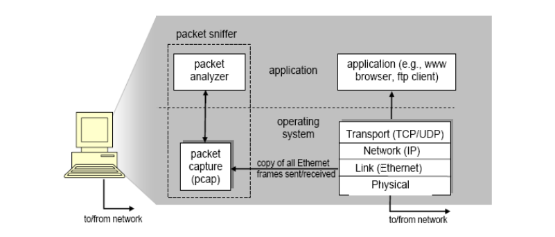
>
>右边是计算机上正常运行的协议（在这里是因特网协议）和应用程序（如：web 浏览器和 ftp 客户端）。分组嗅探器（虚线框中的部 
>分）是附加计算机普通软件上的，主要有两部分组成：
>
>* **分组俘获库（packet capture library）**
>
>  接收计算机发送和接收的每一个链路层帧的拷贝。
>
>  高层 协议（如：HTTP、FTP、TCP、UDP、DNS、IP 等）交换的报文都被封 装在链路层帧中，并沿着物理媒体（如以太网的电缆）传输。假设上图所使用的物理媒体是以太网，上层协议的报文最终封装在以太网帧中。
>
>* **分析器**
>
>  分析器用来显示协议报文所有字段的内容。
>
>  为此，分析器必须能够理解协议所交换的所有报文的结构。例如：我们要显示图中 HTTP 协议所交换的报文的各个字段。 分组分析器理解以太网帧格式，能够识别包含在帧中的 IP 数据报。分组分析器也要理解 IP 数据报的格式，并能从 IP 数据报中提取TCP 报文段。然后，它需要理解 TCP 报文段，并能够从中提取出 HTTP 消息。最后，它需要理解  HTTP 消息。


**(1) 启动 Wireshark 软件，打开浏览器，选择输入接口为`WLAN`**

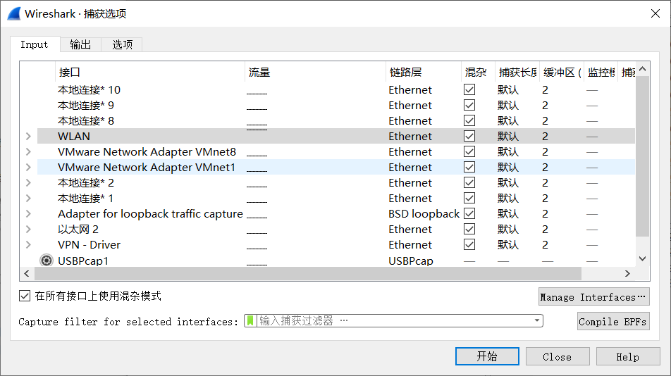


可以在 `Wireshark`窗口中监控到通信使用情况

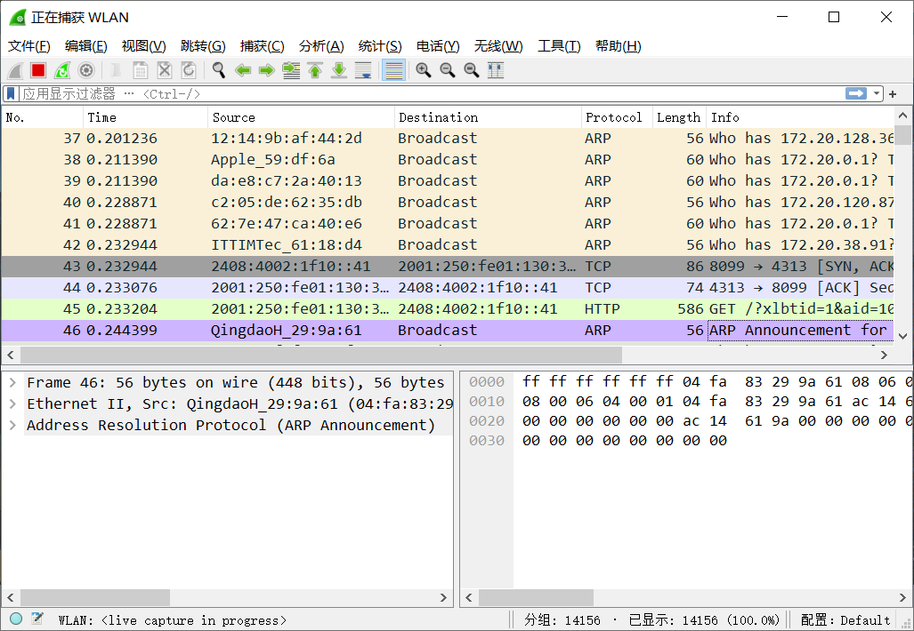

**(2) 浏览器输入网址，使用`Wireshark`抓包，筛选http协议**

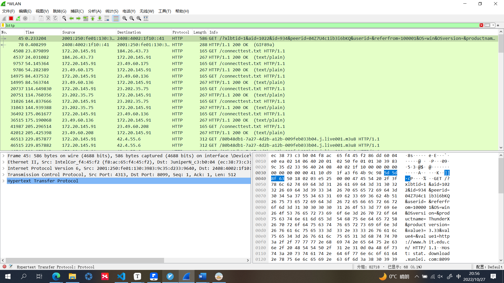

**(3) Wireshark 界面**

> Wireshark 的用户界面主要有  5 部分组成
>
> 1. **命令菜单（command menus）**：
>
>    命令菜单位于窗口的最顶部，是标准的下拉式菜单。最常用菜单命令有两个：File、Capture。File 菜单允许你保存俘获的分组数据或打开一个已被保存的俘获分组数据文件或退出 Wireshark 程序。Capture 菜单允许你开始俘获分组。
>
>    
>
> 2. **俘获分组列表（listing of captured packets）**：
>
>    按行显示已被俘获的分组内容，其中包括：Wireshark 赋予的分组序号、俘获时间、分组的源地址和目的地址、协议类型、分组中所包含的协议说明信息。单击某一列的列名，可以使分组按指定列进行排序。在该列表中，所显示的协议类型是发送或接收分组的最高层协议的类型。
>
>    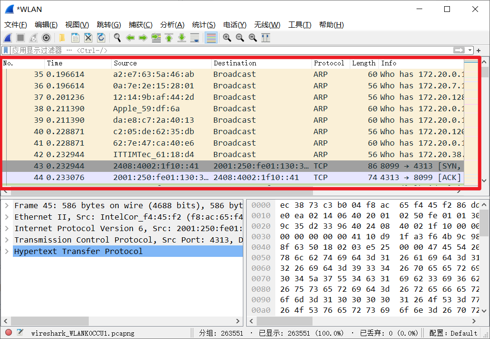
>
> 3. **分组头部明细（details of selected packet header）**：
>
>    显示俘获分组列表窗口中被选中分组的头部详细信息。包括：与以太网帧有关的信息，与包含在该分组中的 IP 数据报有关的信息。单击以太网帧或 IP 数据报所在行左边的向右或向下的箭头可以展开或最小化相关信息。另外，如果利用 TCP 或 UDP 承载分组，Wireshark 也会显示 TCP 或 UDP 协议头部信息。最后，分组最高层协议的头部字段也会显示在此窗口中。
>
>    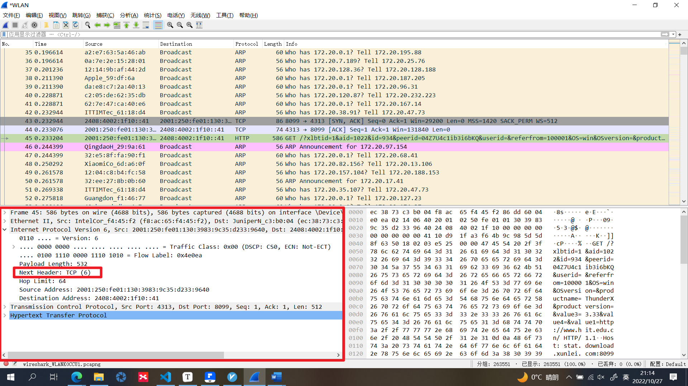
>
> 4. **分组内容窗口（packet content）**：
>
>    以 ASCII 码和十六进制两种格式显示被俘获帧的完整内容。
>
>    
>
> 5. **显示筛选规则（display filter specification）**：
>
>    在该字段中，可以填写协议的名称或其他信息，根据此内容可以对分组列表窗口中的分组进行过滤。
>
>    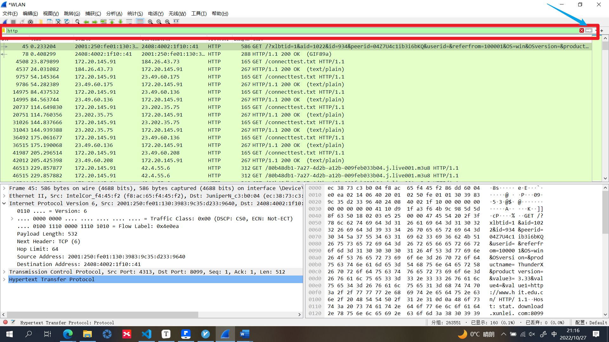


### 2. 利用 Wireshark 分析 HTTP 协议

#### 1）HTTP GET/response 交互

* **你的浏览器运行的是 HTTP1.0，还是 HTTP1.1？你所访问的服务 器所运行 HTTP 协议的版本号是多少？**

​		我的浏览器：HTTP1.1 

​		服务器：HTTP1.1

​		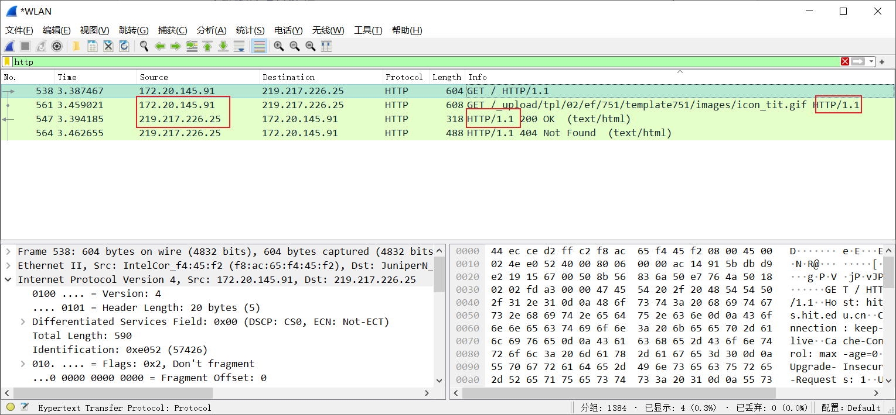

* **你的浏览器向服务器指出它能接收何种语言版本的对象？**

​		zh-CN, zh;

* **你的计算机的 IP 地址是多少？**

​		172.20.145.91

* **服务器 http://hitgs.hit.edu.cn/ 的 IP 地址是多少？** 

​		219.217.226.25

​		

* **从服务器向你的浏览器返回的状态代码是多少？**

​		200 OK

​		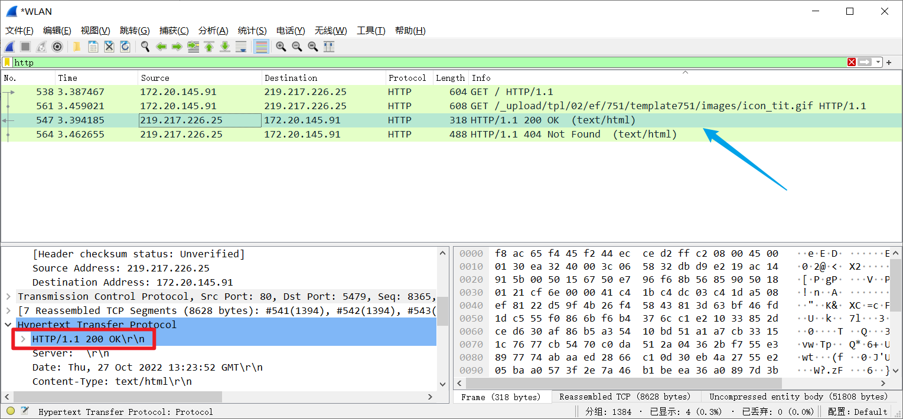

#### 2）HTTP  条件  GET/response 交互

* **分析你的浏览器向服务器发出的第一个 HTTP GET 请求的内容， 在该请求报文中，是否有一行是：IF-MODIFIED-SINCE？**

​		没有

* **分析服务器响应报文的内容，服务器是否明确返回了文件的内容？如何获知？**

​		服务器明确返回了内容 

​		HTTP Status Code（状态代码）为 304时不明确返回文件 

​		HTTP Status Code（状态代码）为 200时明确返回文件

​		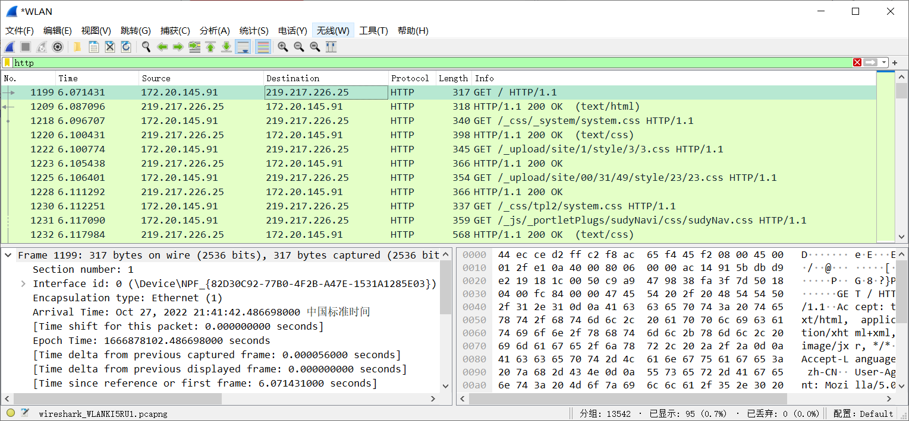

* **分析你的浏览器向服务器发出的较晚的“HTTP GET”请求，在该请 求报文中是否有一行是：IF-MODIFIED-SINCE？如果有，在该首部行后面跟着的信息是什么？** 

​		有。这个字段后面代表的是时间，即咨询服务器在这个时候之后是否有更新

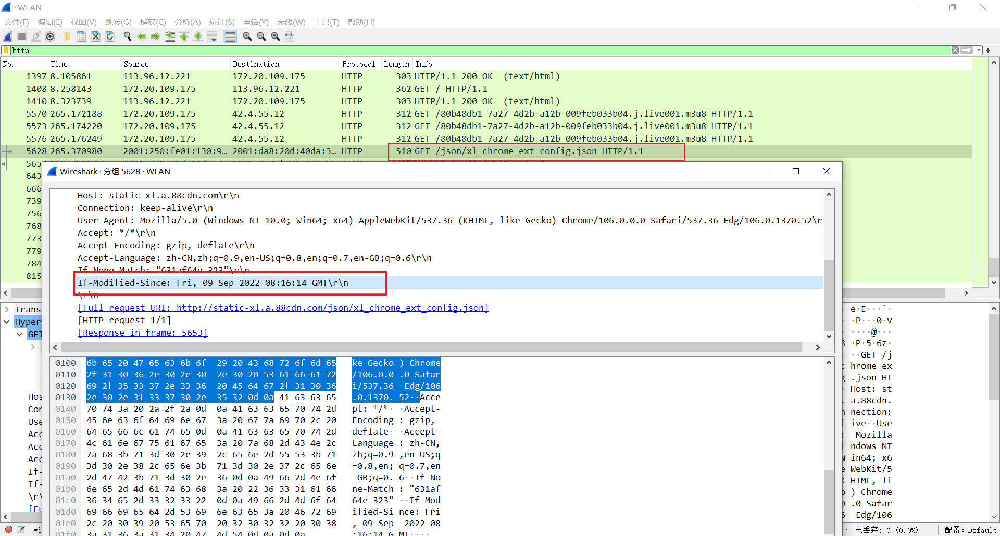

* **服务器对较晚的 HTTP GET 请求的响应中的 HTTP 状态代码是多少？**

​		请求响应中的 HTTP 状态代码为 304。内容没有更新直接从本地缓存中加载。

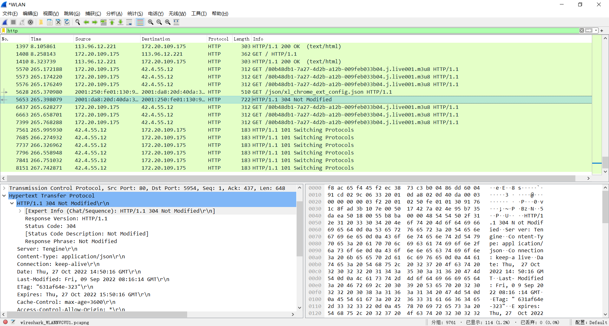

* **服务器是否明确返回了文件的内容？请解释**

​		不会明确返回文件，因为根据之前 HTTP 的 GET 请求中 IF-MODIFIED-SINCE字段内的时间服务器判断结果为 Not Modified，于是客户	端可以使用本地这个没有过期的缓存文件。

这里我没有清理缓存，IE浏览器调不出来这个字段，我使用chrome可以看到，由于没有清理缓存，最后一次修改时间在当前时间的一个月之前。

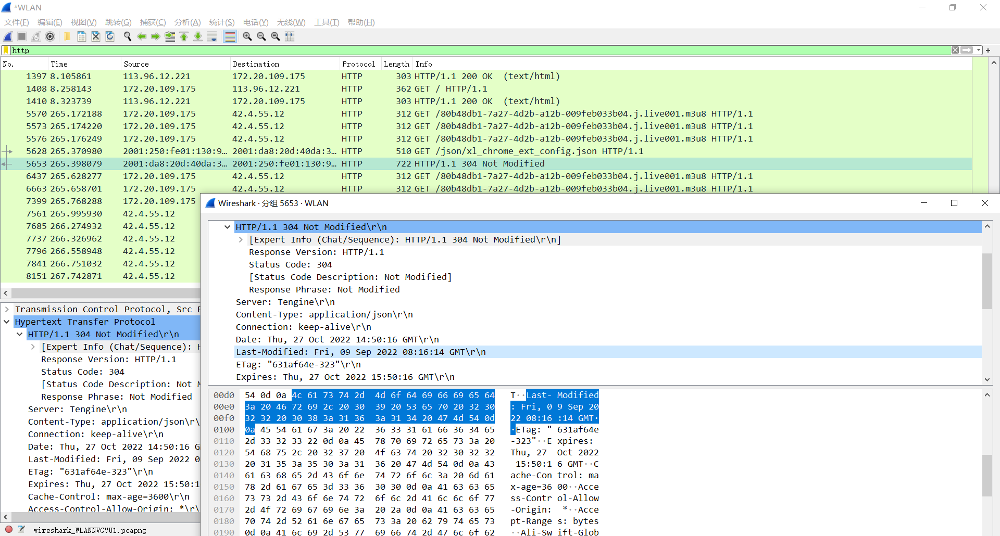

#### 3）利用 Wireshark 分析 TCP 协议

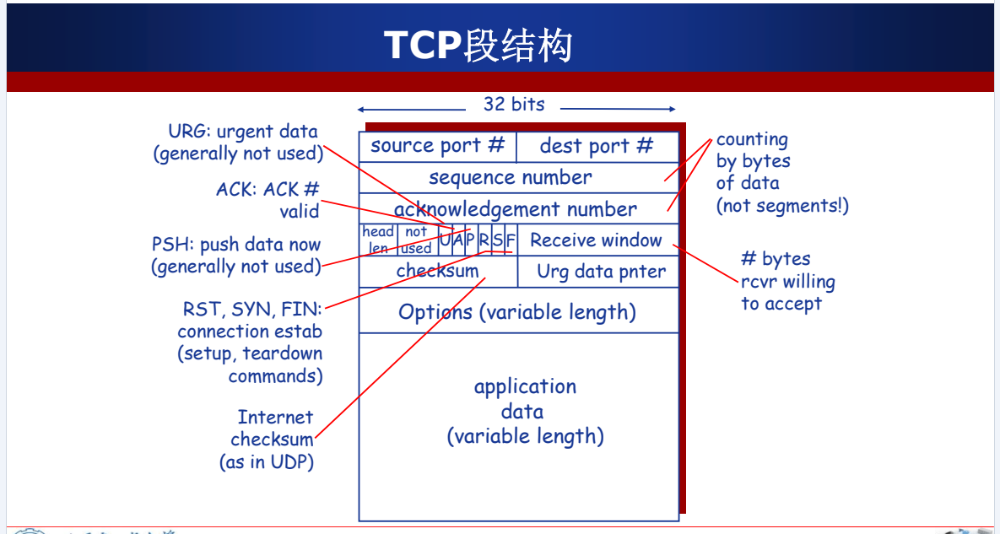

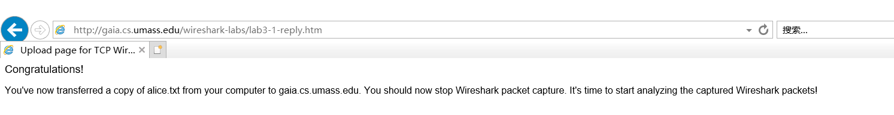

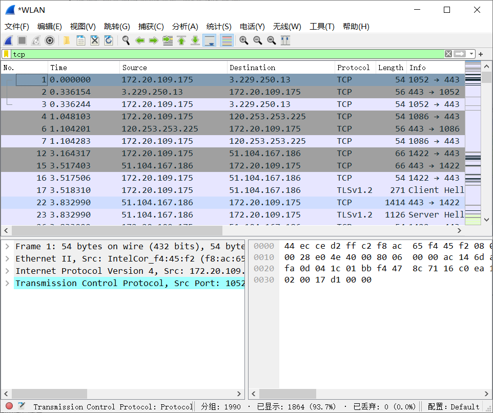

* **向 gaia.cs.umass.edu 服务器传送文件的客户端主机的 IP 地址和 TCP 端口号是多少？**

​		172.20.109.175	2307

* **gaia.cs.umass.edu 服务器的 IP 地址是多少？**

​		128.119.245.12

* **对这一连接，它用来发送和接收 TCP 报文的端口号是多少？**

​		80

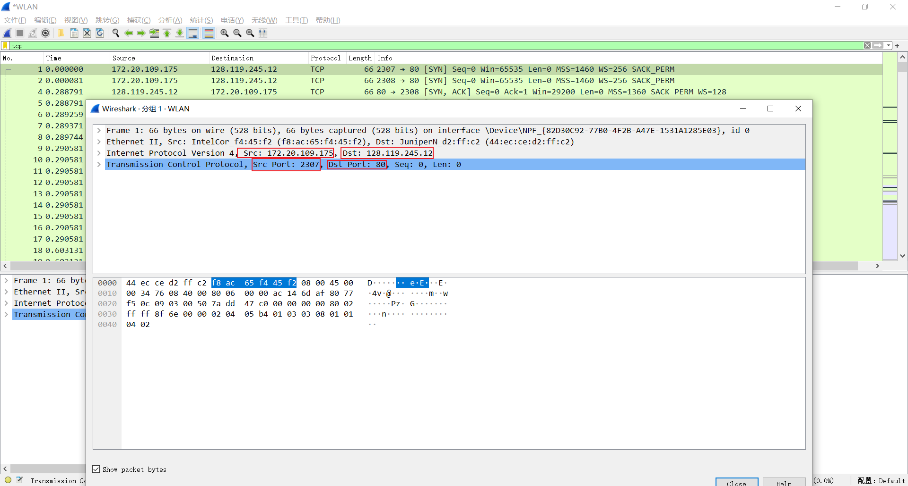

* **客户服务器之间用于初始化 TCP 连接的 TCP SYN 报文段的序号 （sequence number）是多少？在该报文段中，是用什么来标示该报文段是 SYN 报文段的？**

  * TCP 序列号、确认号解释

    Sequence Number (32 bits): 32 位序列号，有两个作用：
    在 SYN flag 置 1 时，此为当前连接的初始序列号（Initial Sequence Number, ISN），数据的第一个字节序号为此 ISN + 1
    在 SYN flag 置 0 时，为当前连接报文段的累计数据包字节数。

    Acknowledgment number (32 bits): 
    32 位确认序号，ACK flag 置 1 时才有效，指接收方期待的下一个报文段的序列号。


​		如图，初始化 TCP 连接的 TCP SYN 报文段的序号是 2061322176；通过 Flags 标志位，将其中的 SYN 位置为 1，表示该报文段是 SYN 报文段

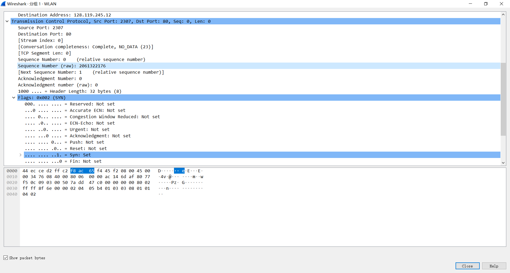

* **服务器向客户端发送的 SYNACK 报文段序号是多少？**

  0x61 2c a6 c0

  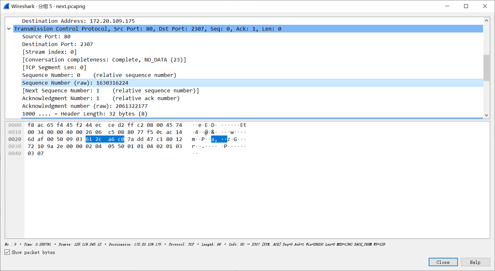

* **该报文段中，Acknowledgement 字段的值是多少？**

  0x7a dd 47 c1

  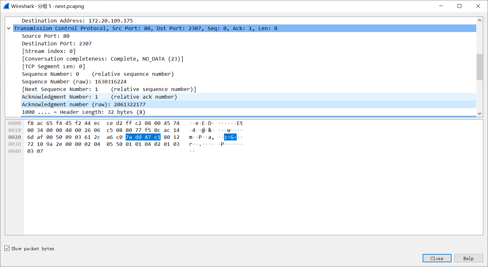

* **Gaia.cs.umass.edu 服务器是如何决定此值的？**

  Gaia.cs.umass.edu 服务器是将SYN报文段序号+1确定的这个值

  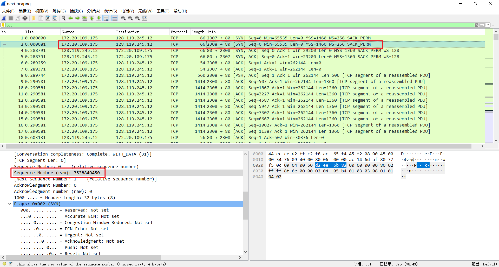

  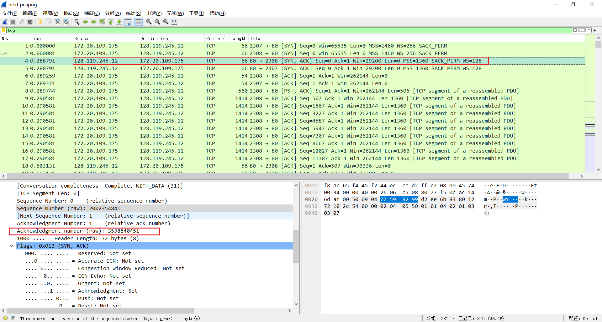

* **在该报文段中，是用什么来标示该报文段是 SYNACK 报文段的？**

  在该报文段中，可以通过 SYN 和 ACK标志位都为1标识该报文段

* **你能从捕获的数据包中分析出 tcp 三次握手过程吗？**

  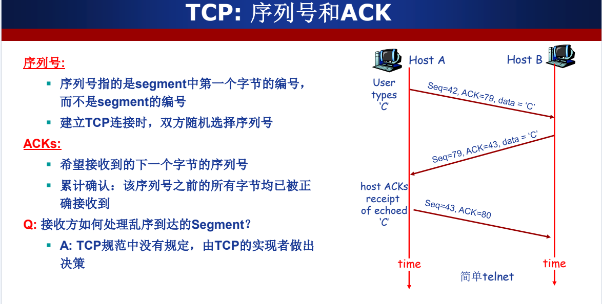

可以看到TCP建立连接的过程中，允许接收乱序到达的序列号

下图可以看到三次握手后通道建立，开始传递数据

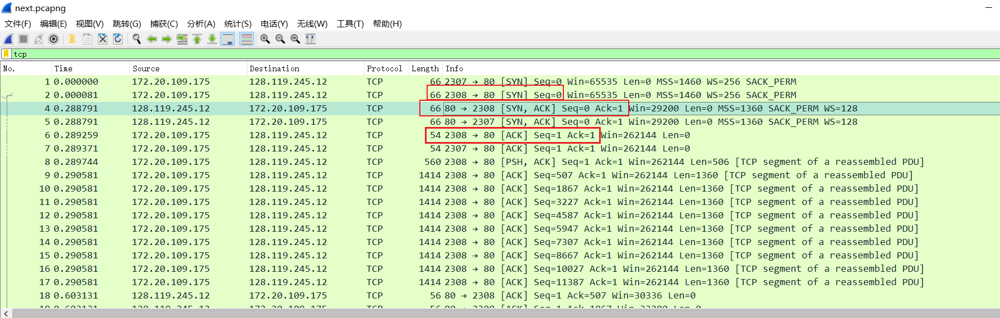

* **包含 HTTP POST 命令的 TCP 报文段的序号是多少？**

  seq: 0xd2 f8 c0 7d

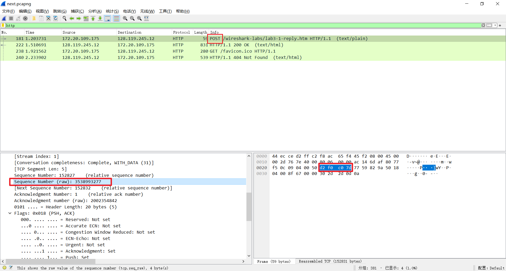

* **该 TCP 连接上的第六个报文段的序号是多少？**

  TCP 连接上的第六个报文段的序号是0xd2 ee 82 bd;

* **是何时发送的？**

  发送时间：该报文段于 TCP 三次握手之后（作为第 9 个 TCP 报文段发送），四次挥手之前发送的；(详细时间见时间戳)

* **该报文段所对应的 ACK 是何时接收的？**

  该报文段所对应的ACK是在第三次握手的时候开始接收的。(详细时间见时间戳)

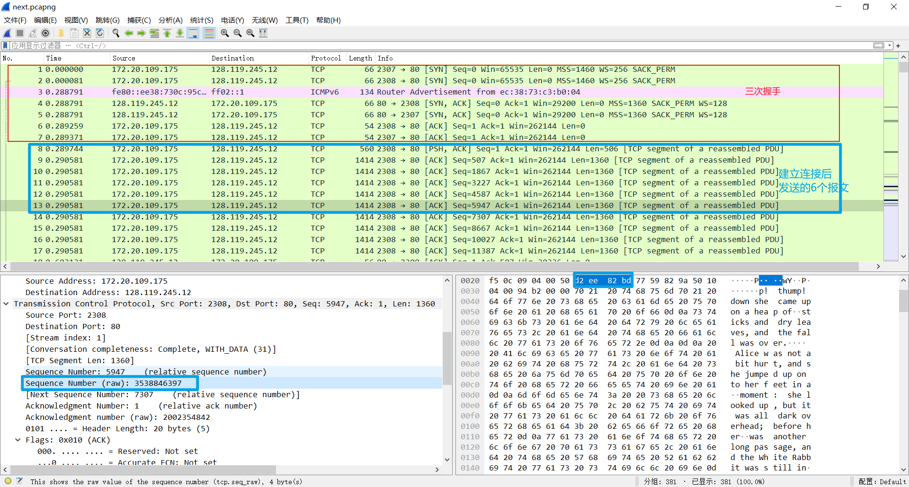

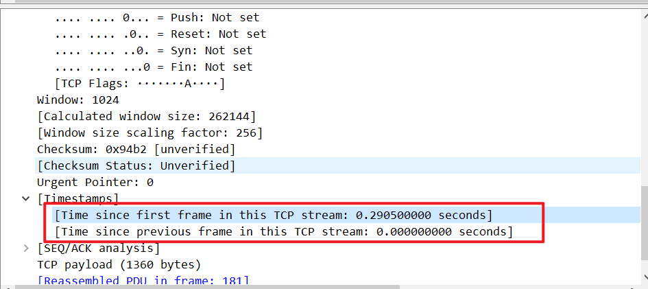

* **前六个 TCP 报文段的长度各是多少？**

  506; 1360; 1360; 1360; 1360; 1360

  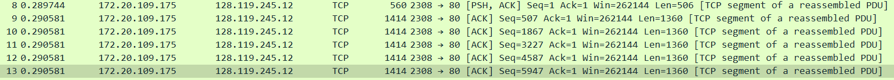

* **在整个跟踪过程中，接收端公示的最小的可用缓存空间是多少？** 

  接收端限制最小可用缓存窗口为 65535

  建立连接后重新确定为 262144

​		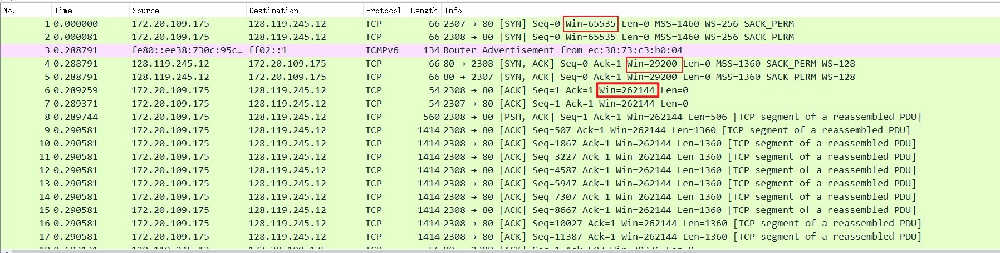

* **限制发送端的传输以后，接收端的缓存是否仍然不够用？**

​		限制发送端传输以后，接收端缓存窗口大小始终保持在 262144，所以接收端缓存够用

​		这里由于数据传输单一，看不到窗口大小根据缓存数据量大小的调整过程。更多详情参考下面博客：

​	[(178条消息) TCP/IP卷一:82---TCP数据流与窗口管理之（零窗口与TCP持续计时器(窗口探测)、糊涂窗口综合征(SWS)、大容量缓存与自动调优）_董哥的黑板报的博客-CSDN博客_零窗口延时时间 持续增加](https://blog.csdn.net/qq_41453285/article/details/104158540)

​		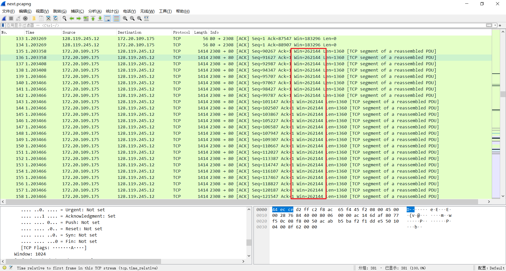

* **在跟踪文件中是否有重传的报文段？进行判断的依据是什么？**

  服务器向客户端有重传

  客户端向服务器端有重传

  根据序列号，客户端收到的序列号一直在增长，中间有重复。

  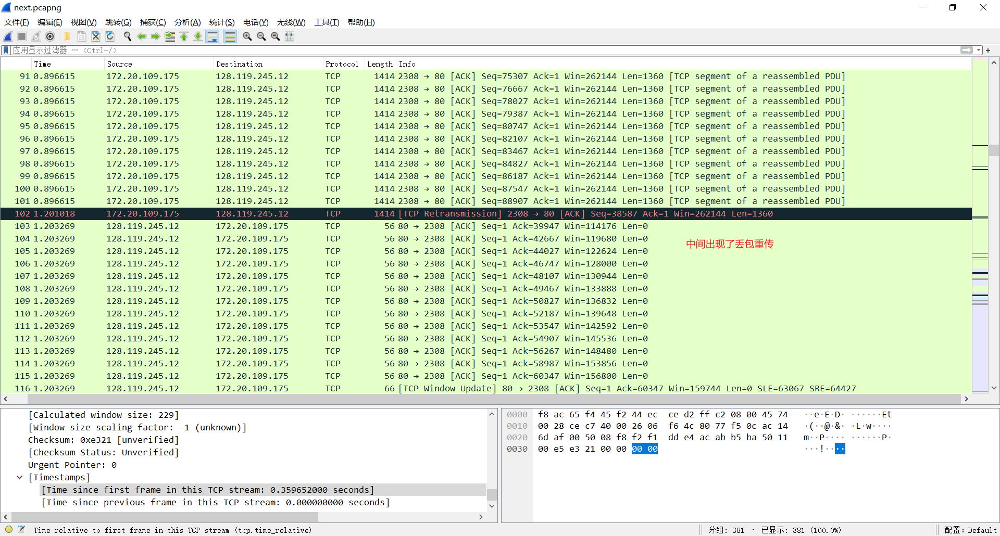

  服务器端出现ACK报文丢失重传现象。

  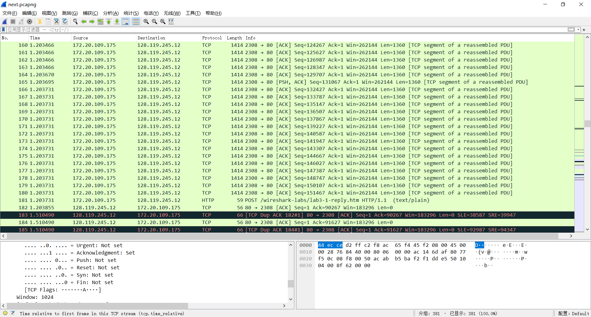

* **TCP 连接的 throughput (bytes transferred per unit time)是多少？请 写出你的计算过程。**

  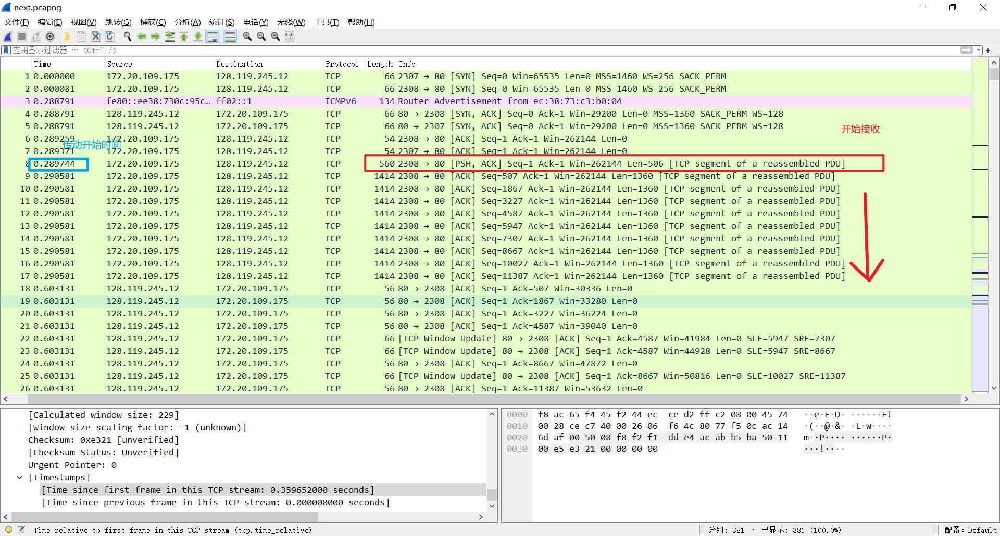

* 

  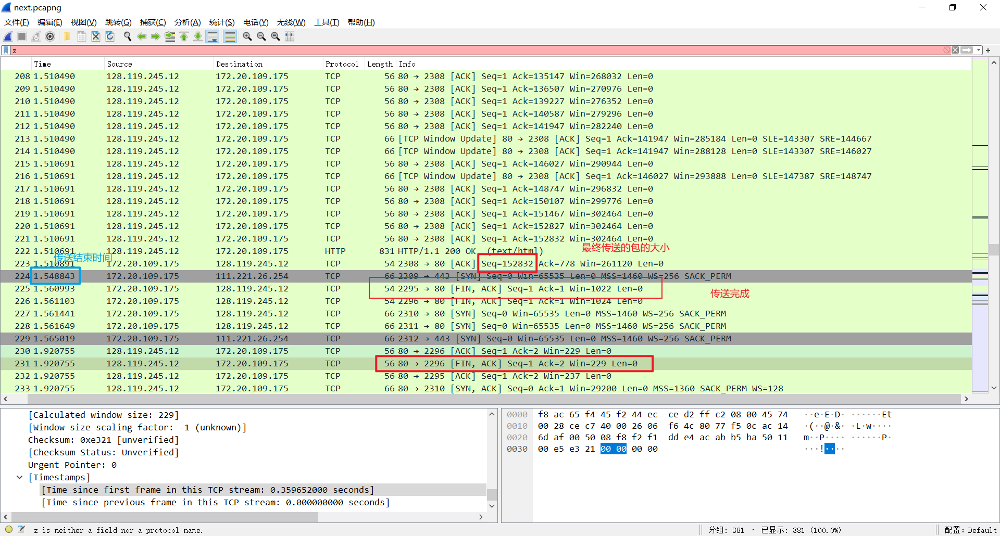

​	上图可以看到最终接收端收到的报文大小是 152832B

​	传送时间是 1.548843 - 0.289744 = 1.259099 s

​	吞吐量： 152832 * 8 bits / 1.259099 bits =  0.971 Mbps

#### 4) 利用 Wireshark 分析 IP 协议

首先简单学一下 IP 报文的格式

[IP数据报的分片与重组分析_ccfxue的博客-CSDN博客](https://blog.csdn.net/ccfxue/article/details/53097849)


[Internet Connection Troubleshooting | PingPlotter](https://www.pingplotter.com/)

首先去上面的网址下载 pingplotter 启动 Standard 或者  Professional , Free 不能修改Packet 的大小（有免费试用期）

下面以 Standard 为例

* 开启 Wireshark 监听

* 首先发送大小为 56 bytes的报文

  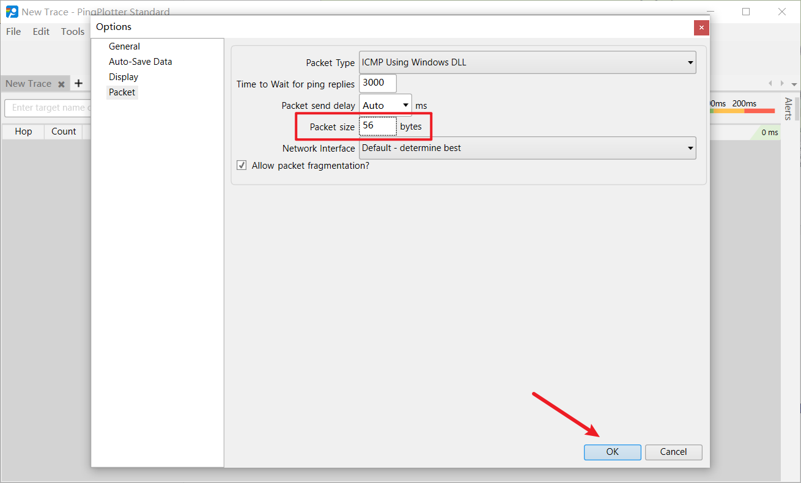

  <font color=green>时间间隔 interval 可以设置的长一些，Count接收到 3 左右就可以按黄色按钮暂停，不用收太多</font>

  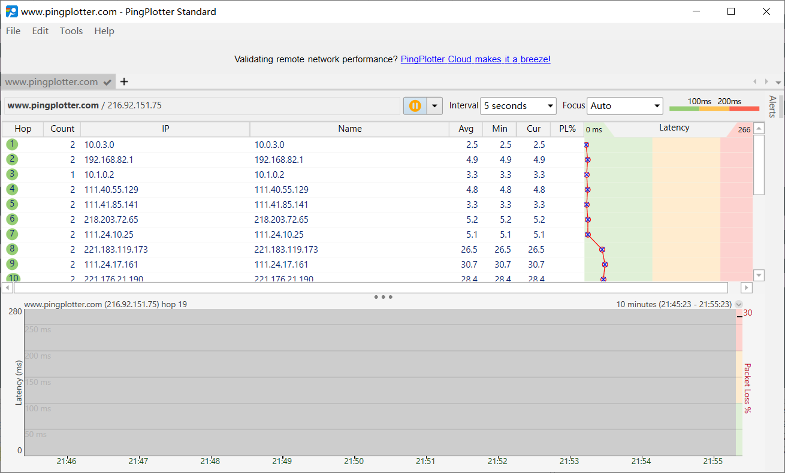

  暂停如下

  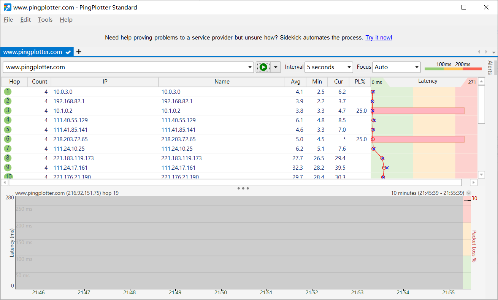

  然后修改 Packet Size 为 2000 bytes，点击绿色按钮继续发送，发送一两组之后再次暂停

  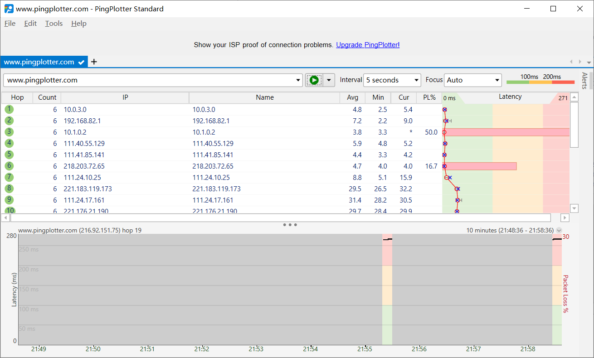

  修改 Packet Size 为 3500 bytes 再发送一两组即可

  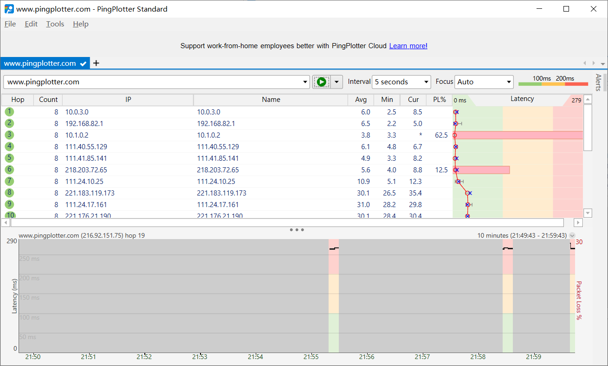

  暂停 Wireshark ，筛选 icmp 可以看到刚刚抓取到的一系列包

  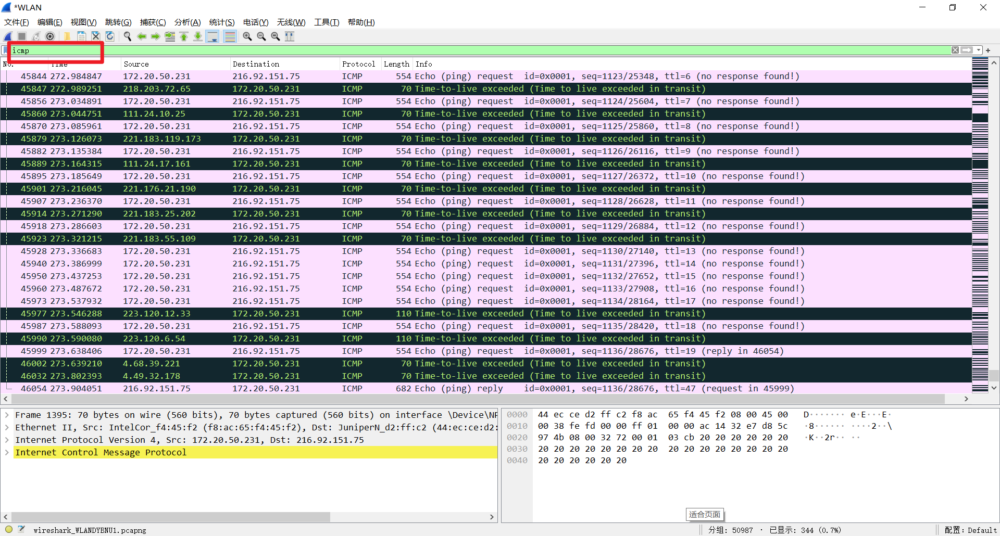

<font color=green size=4>下面对捕获的数据包进行分析</font>


* **你主机的IP地址是什么？**

  172.20.50.231

* **在IP数据包头中，上层协议（upper layer）字段的值是什么？**

  在IP数据包头中，上层协议字段的值是1，表示ICMP协议。

  

* **IP头有多少字节？该IP数据包的净载为多少字节？并解释你是怎样确定该IP数据包的净载大小的？**

   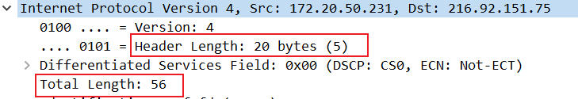

  IP头部有 20 个字节，静载量为 36

  确定方法：Total Length - Header Length

* **该IP数据包分片了吗？解释你是如何确定该P数据包是否进行了分片**

  标志字段在IP报头中占3位，

  * 第1位作为保留，置0;
  * 第2位，分段，有两个不同的取值：该位置0，表示可以分段;该位置1，表示不能分段;
  * 第3位，更多分段，同样有两个取值：该位置0，表示这是数据流中的最后一个分段，该位置1，表示数据流未完，后续还有分段，当一个数据报没有分段时，则该位置0，表示这是唯一的一个分段。

  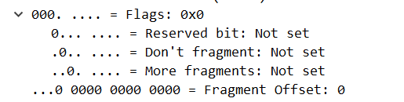

* **你主机发出的一系列 ICMP 消息中 IP 数据报中哪些字段总是发生改变？**

  * 标识ID：标识ID对于每个数据包来说唯一，因此每个数据包的这个字段都不一样；
  * TTL：由于是ICMP的ping探测，因此TTL在不断变大；
  * 首部检验和：由于上述两个字段不断变化，因此首部校验和也需要变化；
  * 数据域：由于数据域中封装有ICMP的报文，而ICMP的头部信息不断变化，因此IP数据报的数据域也需要不断变化

* **哪些字段必须保持常量？哪些字段必须改变？为什么？**

  除了上述四个数据段以外的数据必须保持常值

* **描述你看到的 IP 数据包 Identification 字段值的形式**

  而ID值标识每一个IP字段，是唯一的，因此不断改变，下一个包是上一个的 `Identification + 1`

* **Identification 字段和 TTL 字段的值是什么？**

   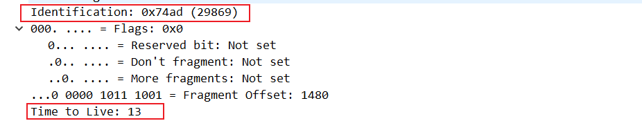

* **最近的路由器（第一跳）返 回给你主机的 ICMP Time-to-live exceeded 消息中这些值是否保持不变？为什么？**

  * TTL保持不点：第一跳路由器设置TTL字段为RFC指定的值，因此始终保持不变；
  * ID字段不断改变：而ID值标识每一个IP字段，是唯一的，因此不断改变

* **该消息是否被分解成不止一个 IP 数据报？**<font color=red>报文大小为 2000 bytes</font>

  筛选 IP 查看报文传输

  由下图可以看出一个大小为 2000 的数据报被分片为 2 个，每个分片大小为 Total Length = 1500 bytes，除去 20 bytes 的头部，还有 1480 bytes 的信息，可以看到第一个分片偏移为 0 ，第二个从分片偏移为 1480， 即第二个报文分片的大小应该再包括 540 bytes，携带 520 bytes 的信息。合起来就是 2000 bytes。

  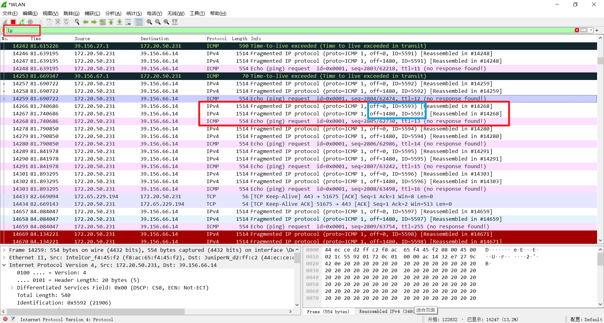

  可以看到每个分片的标志位表示后面还有分片

  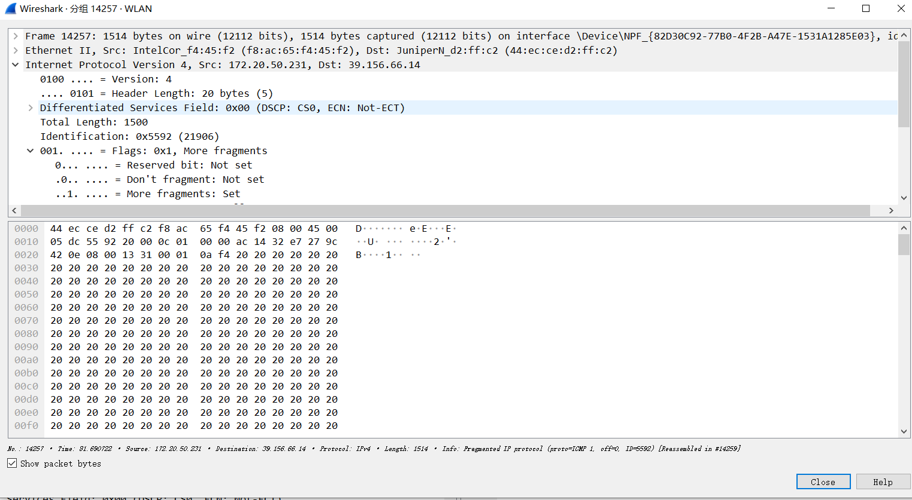

  最后一个 Echo （ping） request 标识出分片接收结束，最后一个分片的大小为 540 bytes。

  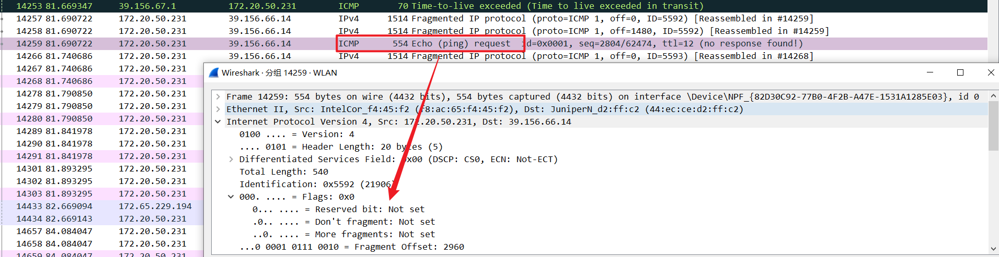

  直接看分段情况，可以看到将 2000 bytes 数据包中的 1800 bytes 的数据部分分为 2 个分片，大小分别为 1480 bytes 和 500 bytes

  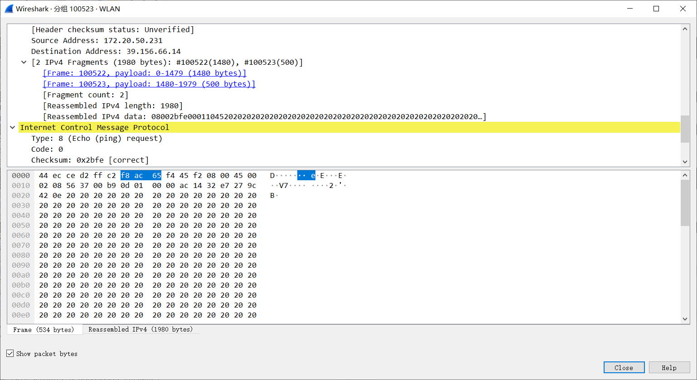

* **原始数据包被分成了多少片？**<font color=red>报文大小为 3500 bytes</font>

  被分为三片

  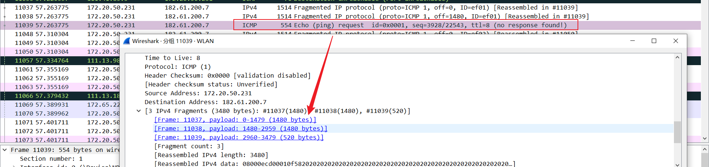

* **这些分片中 IP 数据报头部哪些字段发生了变化？**

  前 2 个分⽚More fragments=1，后两个分⽚offset 变为 1480 和 2960

  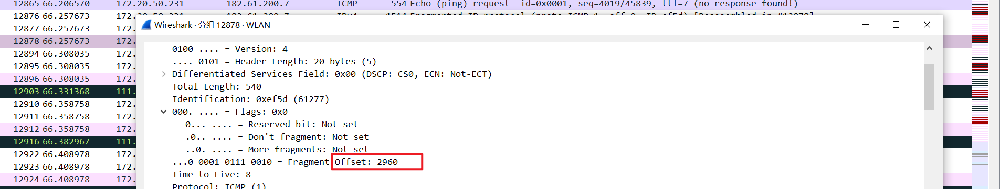

#### 5) 抓取  ARP 数据包

* **利用 c:\windows\system32\arp 查看主机上 ARP 缓存的内容。说明 ARP 缓存中每一列的含义是什么?** 

  输入下面命令查看主机上 ARP 缓存的内容

  ```
  apr –a
  ```

   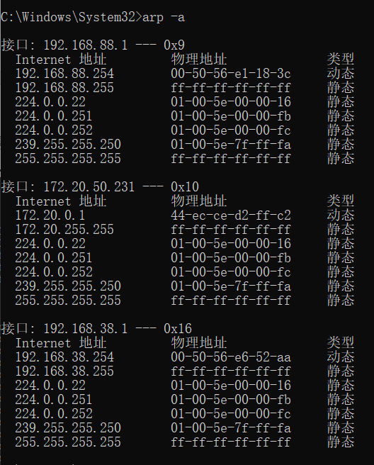

  ARP 缓存中的每一列分别表示 IP 地址所对应的物理地址和类型（动态配置或静态配置）

* **ARP 数据包的格式是怎样的？由几部分构成，各个部分所占的字节数是多少？**

  ARP 数据包格式如下图：

   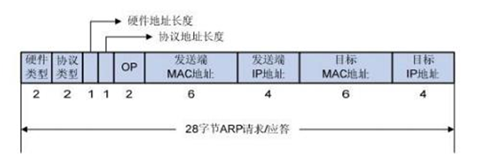

  * 由 9 部分构成

  * 分别是硬件类型（2 字节），协议类型（2 字节），硬件地址长度（1 字节），协议地址长度（1 字节），OP（2 字节)，发送端 MAC 地址（6 字节），发送端 IP 地址（4 字节），目的 MAC 地址（6 字节），目的 IP 地址（4字节）。

  截取的一个 ARP 数据包如下：

  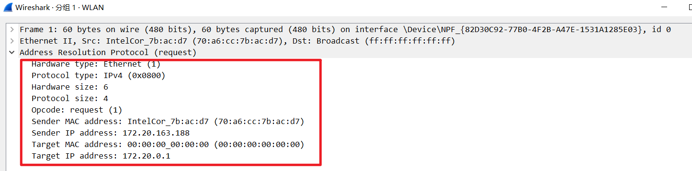

  抓取过程如下

  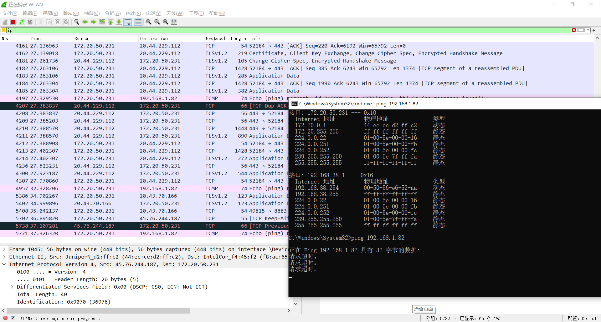

  筛选 arp

  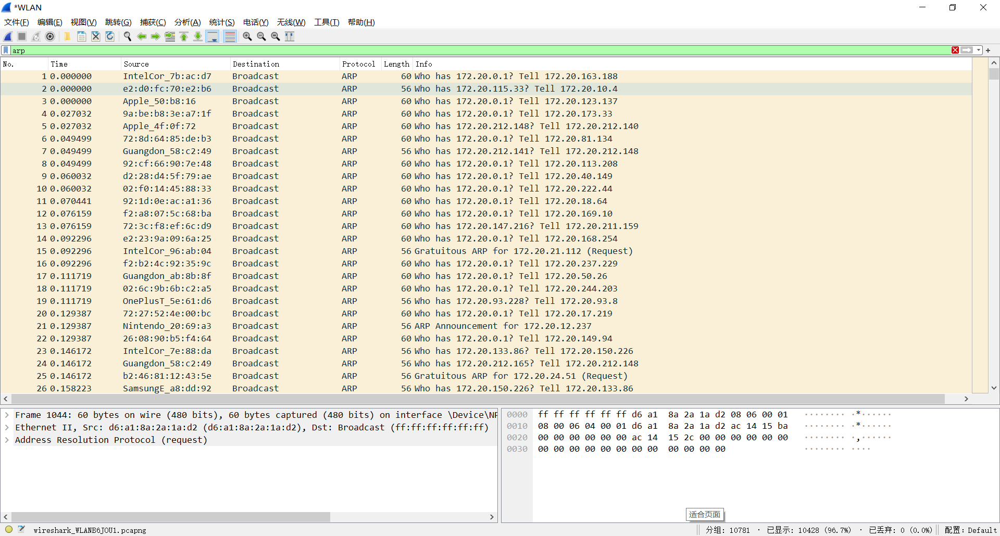

* **如何判断一个 ARP 数据是请求包还是应答包？** 

  通过 OP 字段。当 OP 字段值为 0x0001 时是请求包，当 OP 字段值为 0x0002时是应答包。 

* **为什么 ARP 查询要在广播帧中传送，而 ARP 响应要在一个有着明确目的局域网地址的帧中传送？** 

  因为进行 ARP 查询时并不知道目的 IP 地址对应的 MAC 地址，所以需要广播查询；而 ARP 响应报文知道查询主机的 MAC 地址（通过查询主机发出的查询报文获得），且局域网中的其他主机不需要此次查询的结果（匹配不上故不接收），因此 ARP 响应要在一个有着明确目的局域网地址的帧中传送。

#### 6) 抓取 UDP 数据包

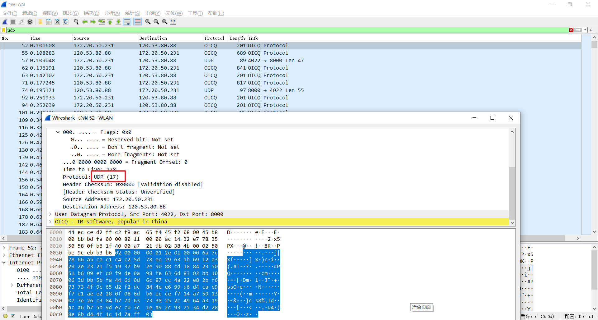

* **消息是基于UDP的还是TCP的？**

  UDP 

* **你的主机ip地址是什么？目的主机ip地址是什么？**

   

* **你的主机发送QQ消息的端口号和QQ服务器的端口号分别是多少？**

   

* **数据报的格式是什么样的？都包含哪些字段，分别占多少字节？**

   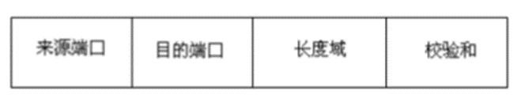

  UDP 数据报格式有首部和数据两个部分。首部很简单，共 8 字节。包括：

  源端口号： 2 字节 

  目的端口号： 2 字节 

  长度： 2 字节， UDP 用户数据报的总长度，以字节为单位。 

  校验和： 2 字节，用于校验 UDP 数据报的数字段和包含 UDP 数据报首部的“伪首部”。 其校验方法同 IP 分组首部中的首部校验和。

* **为什么你发送一个ICQ数据包后，服务器又返回给你的主机一个 ICQ数据包？这与UDP的不可靠数据传输有什么联系？**

  服务器返回ICQ用于确认。这是由于UDP提供的是不可靠的无连接的传输服务，客户端无法确认服务器是否接收到信息，因此需要一个ICQ报文表示收到。

* **对比前面的 TCP协议分析，你能看出UDP是无连接的吗？**

  可以看出UDP是无连接的。这是因为TCP需要三次握手来建立连接，而UDP没有这个过程。同时UDP首部也没有标志位用于客户端与服务器端之间互相确认传输情况。

#### 7）利用 WireShark 进行 DNS 协议分析

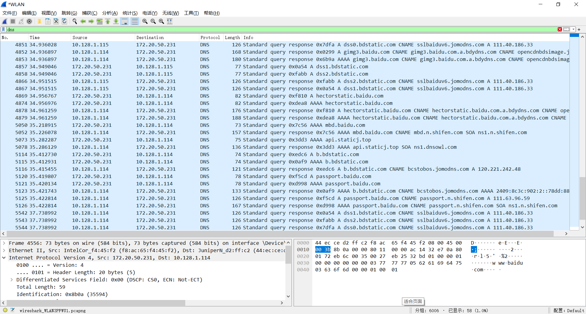

* **本机 IP 地址，目的主机 IP 及端口号**

  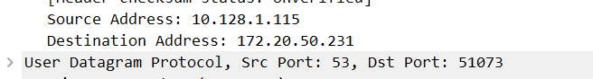

* **DNS消息包括消息头部中的ID，flags等和消息体，具体格式如下：**

   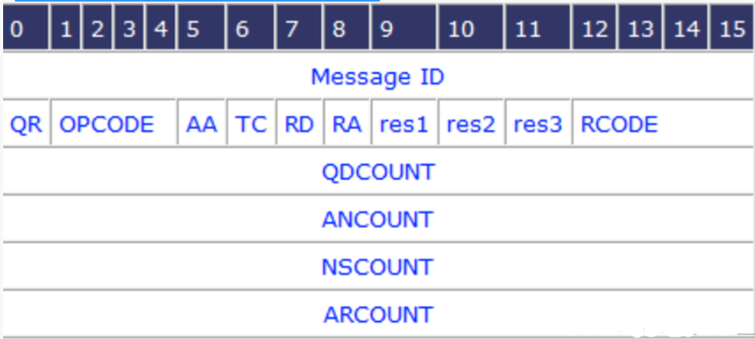

*  **DNS 的下层协议是 UDP 协议，是不可靠无连接的传输服务**

  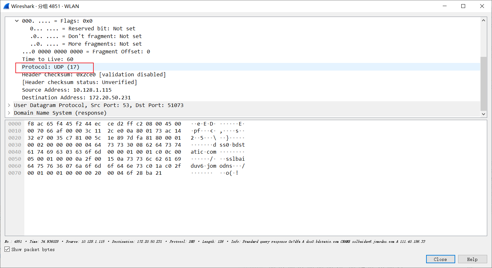

* **DNS使用Transaction ID来标识一次查询和响应报文，长度是2B，可以发现请求和相应的响应报文的ID是一致的。**

  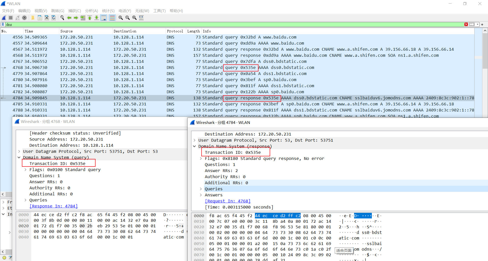

* **DNS记录的不同形式如下图所示：**

   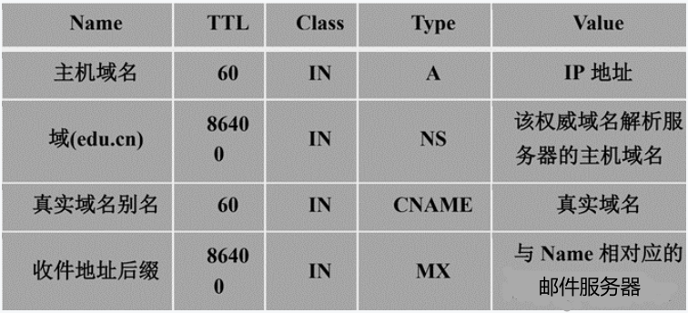

* **DNS查询分为递归查询与迭代查询。**