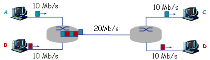
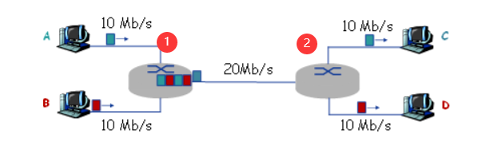

[TOC]

# 作业1

## T1

> 如图所示网络。A在t=0时刻开始向C发送一个2Mbits的文件；B在t=0.1+e秒（e为无限趋近于0的小正实数）向D发送一个1Mbits的文件。忽略传播延迟和结点处理延迟。

请回答下列问题：

> 1）如果图中网络采用存储-转发方式的报文交换，则A将2Mbits的文件交付给C需要多长时间？B将1Mbits的文件交付给D需要多长时间？

**解：** 

给路由器从左到右依次编号为1，2

A报文比B报文先到达路由器1
$$
t_{A\to C} = 2/10 + 2/20 + 2/10 = 0.5s
$$

$$
t_{B \to D} = 1/10 + 0.1(等待A) + 1/20 + 1/10 = 0.35s
$$

>2)如果图中网络采用存储-转发方式的分组交换，分组长度为等长的1kbits，且忽略分组头开销以及报文的拆装开销，则A将2Mbits的文件交付给C需要大约多长时间？B将1Mbits的文件交付给D需要大约多长时间?

**解：**

t = 0s~0.1s只有A报文在传输
$$
10Mb/s * 0.1s = 1Mb
$$
即前0.1sA报文有1Mb已经发出，剩下的1Mb和B的1Mb报文同时传输（分组交替传输）

t > 0.1sA报文和B报文同时传输，直到报文发送完毕

此时A，B报文各有1000个1kb的分组，由于A、B同时占用路由器1，2之间的带宽，且其分组大小相同，所以各占10Mb/s的带宽。
$$
t_{A \to C} = 0.1s(单独发送的部分) + 1000*(1k / 10M)(最后一个分组从A发出) + 2*(1k/10M)(最后一个分组到达C) = 0.2002s
$$

$$
t_{B \to D} = 1000*(1k / 10M)(最后一个分组从B发出) + 2*(1k/10M)(最后一个分组到达D) = 0.1002s
$$

> 3)报文交换与分组交换相比，哪种交换方式更公平？（即传输数据量小用时少，传输数据量大用时长）

**解：**

分组交换更公平，如果直接发送报文，排队时间变长，如果一个大小为1kb的报文排在大小为100Tb的文件后面，可能造成发送时间从0.1s变成1h。

而分组交换每次发送一个小分组，不同报文的分组可以交替发送，等待时间变短，而且同一个报文的各部分同时在数据链路的各个部分发送，可以大大减小延迟。

## T2

> 考虑两台主机A和主机B由一条带宽为R bps、长度为M米的链路互连，信号传播速率为V m/s。假设主机A从t=0时刻开始向主机B发送分组，分组长度为L比特。试求：

> 1. 传播延迟（时延）dp；

$$
d_p = M / V
$$

> 2. 传输延迟dt；

$$
d_t = L / R
$$

> 3. 若忽略结点处理延迟和排队延迟，则端到端延迟de是多少？

$$
d_e = d_p + d_t = M/V + L/R
$$

> 4. 若dp>dt，则t=dt时刻，分组的第一个比特在哪里？

在A处传输线路的末端，传播链路的始端。

> 5. 若V=250000km/s，L=512比特，R=100 Mbps，则使带宽时延积刚好为一个分组长度（即512比特）的链路长度M是多少？

**解：**
$$
时延带宽积 = d_p * R
$$

$$
时延带宽积 = M/V * R = L
$$

解方程得
$$
M = 1280m
$$

## T3

> 假设主机A向主机B以存储-转发的分组交换方式发送一个大文件。主机A到达主机B的路径上有3段链路，其速率分别是R1=500kbps，R2=2Mbps，R3=1Mbps。试求：

> 1) 假设网络没有其他流量，则传送该文件的吞吐量是多少？

**解:**
$$
吞吐量R = min(R1, R2, R3) = R1 = 500kbps 
$$

> 2) 假设文件大小为4MB，则传输该文件到主机B大约需要多少时间？

**解：**

由于后两段链路R1,R2的带宽比第一段R1的带宽大，所以不会对第一段链路的传输造成拥堵

设分组大小为Lbit
$$
t = \frac{4M}{R1}(最后一个分组从A发出) + (\frac{L}{R2} + \frac{L}{R3})(最后一个分组发送到B) = 4M / 500k + L/3M
$$

$$
t = 8s + L/3M \approx 8s
$$
由于分组L的大小一般相对于3M很小，即传输时间大约为8s。