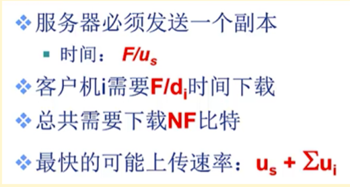
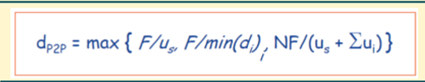

# 题目

考虑向N个对等方（用户）分发F=15Gb的一个文件。该服务器具有us=30Mbps的上传速率，每个对等方的下载速率di=2Mbps，上传速率为u。请分别针对客户-服务器分发模式和P2P分发模式两种情况，对于N=10、100和1000以及u=500kbps、1Mbps和2Mbps的每种组合，绘制最小分发时间图表。**（注：k=10^3、M=10^6、G=10^9）**

CS模式，客户端需要上传N个文件，每个用户只需要下载一个文件：
$$
d_{CS}=max{\{NF/u_s,F/min(d_i)\}}
$$
P2P模式，客户端只需要上传一个文件，每个用户只需要下载一个文件，但是端到端之间需要传输N个文件才能满足每个用户都能接收到文件。
$$
d_{P2P}=max{\{F/u_s,F/min(d_i),NF/(u_s+\sum{u_i}\}}
$$

| N    | u       | CS模式                                   | P2P                                                       |
| ---- | ------- | ---------------------------------------- | --------------------------------------------------------- |
| 10   | 500kbps | 7500s$=max{\{10*15G/30M, 15G/2M\}}$      | 7500s$=max{\{15G/30M,15G/2M,10*15G/(30M+10*500K)\}}$      |
| 10   | 1Mbps   | 7500s                                    | 7500s$=max{\{15G/30M,15G/2M,10*15G/(30M+10*1M)\}}$        |
| 10   | 2Mbps   | 7500s                                    | 7500s$=max{\{15G/30M,15G/2M,10*15G/(30M+10*2M)\}}$        |
| 100  | 500kbps | 50000s$=max{\{100*15G/30M, 15G/2M\}}$    | 18750s$=max{\{15G/30M,15G/2M,100*15G/(30M+100*500K)\}}$   |
| 100  | 1Mbps   | 50000s                                   | 11538s$=max{\{15G/30M,15G/2M,100*15G/(30M+100*1M)\}}$     |
| 100  | 2Mbps   | 50000s                                   | 7500s$=max{\{15G/30M,15G/2M,100*15G/(30M+100*2M)\}}$      |
| 1000 | 500kbps | 500000s=$=max{\{1000*15G/30M, 15G/2M\}}$ | 28302s$=max{\{15G/30M,15G/2M,1000*15G/(30M+1000*500K)\}}$ |
| 1000 | 1Mbps   | 500000s                                  | 14563s$=max{\{15G/30M,15G/2M,1000*15G/(30M+1000*1M)\}}$   |
| 1000 | 2Mbps   | 500000s                                  | 7500s$=max{\{15G/30M,15G/2M,1000*15G/(30M+1000*2M)\}}$    |

 

 