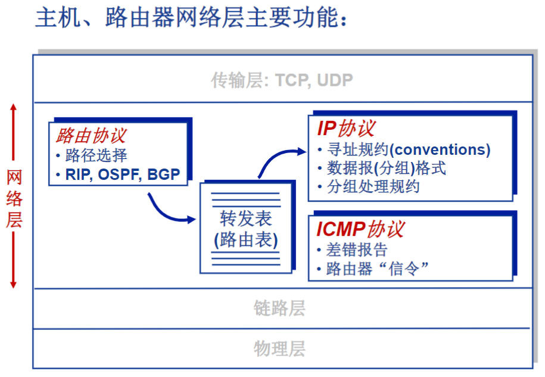
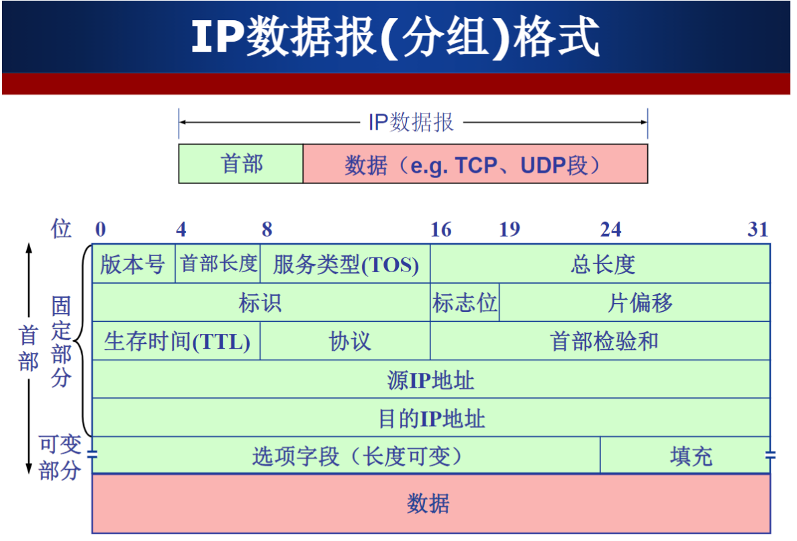
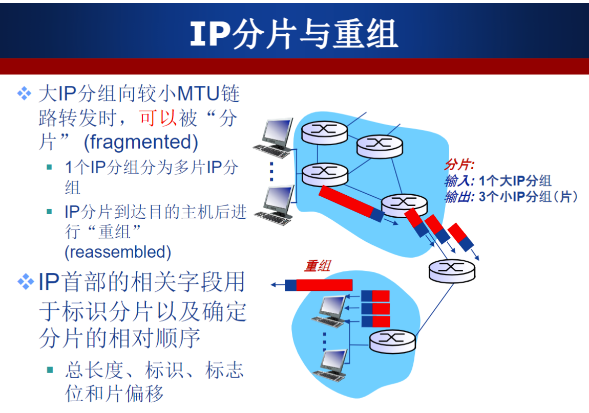
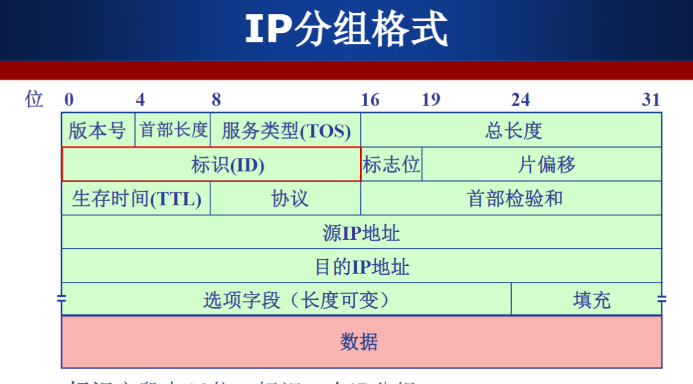
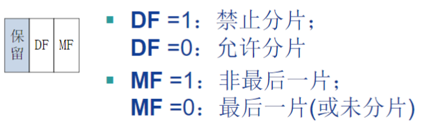
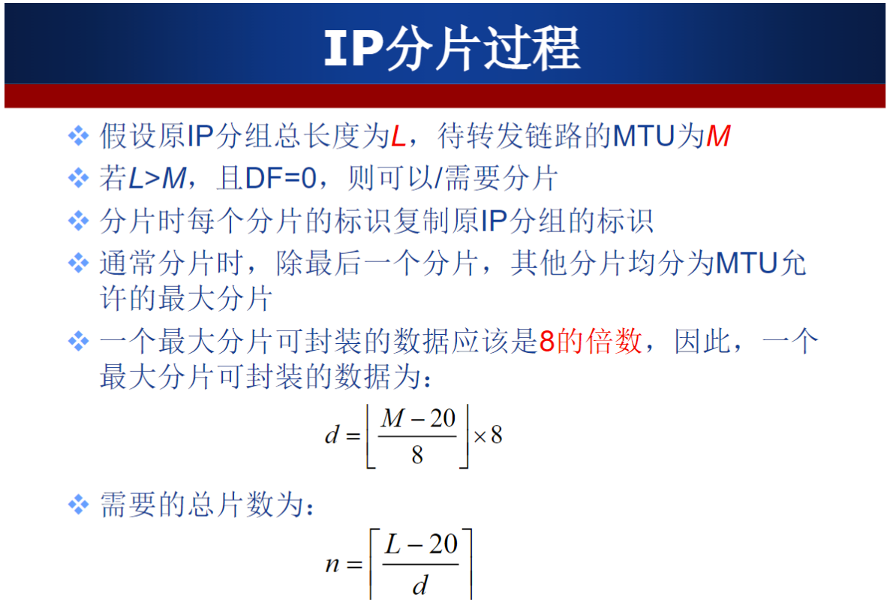
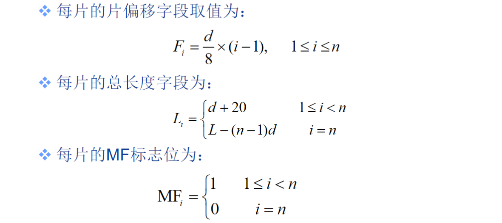
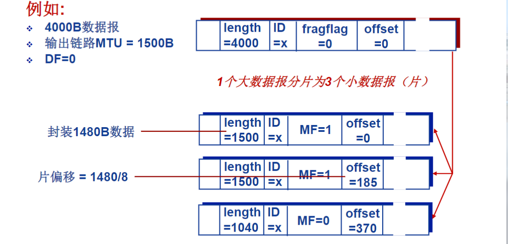

# 作业五(网络层)

## (1)主机在配置IP地址时，其正确的子网掩码和默认网关分别是多少？

* **知识点：**

子网掩码：只有一个作用，就是将某个IP地址划分成网络地址和主机地址两部分。

默认网关：当前局域网内大门（路由器或交换机）的地址

* **解：**

子网掩码：255.255.255.0

默认网关：192.168.1.1

## (2)一个由主机192.168.1.5发送、ID=12345、length=500B、DF=1的IP分组时，则该IP分组首部的哪些字段会被修改？如何修改？

* **知识点：**

必然变化的是 生存时间（TTL）、首部校验和。每经过一跳路由器，TTL值减一；首部校验和是根据首部生成的，TTL字段变化，首部校验和随之也要变化。 可能变化的有 标志、片偏移，数据报总长度。

当主机A发向主机B的数据流在网络层封装成IP数据包，IP数据包的首部包含了源地址和目标地址。主机A会用本机配置的24位IP网络掩码255.255.255.0与目标地址进行与运算，得出目标网络地址与本机的网络地址是不是在同一个网段中。如果不是将IP数据包转发到网关。

* + **版本号**字段占4位：IP协议的版本号
    - E.g. 4->IPv4, 6->IPv6

  - **首部长度**占4位：IP分组的首部长度

    - 以4字节为单位
    - E.g. 5->IP首部长度：表示20（5*4）个字节

  - **服务类型（TOS）** 字段占8位：指示期望获得哪种类型的服务

    - 1998年该字段更名为区分服务
    - 只有在网络提供区分服务（Diffserv）时使用
    - 一般情况下不使用，通常IP分组的该字段（第2字节）的值为00H

  - **总长度**字段占16位，IP分组的总字节数（首部+数据）

    - 最大IP分组的总长度：65535B ($2^{16}-1$)

    - 最小的IP分组首部：20B

      - [ ] **1、为什么首部长度最小是20字节？**

        > 图中每行是32bits(即4字节)，图中标识的固定部分总共有5行，所以IP首部最小是20个字节（5行*4字节每行=20字节）

        **2、为什么说首部长度最大是60个字节？**

        > 首部长度是4bit，而2^4是16，所以它的取值范围是0-15(也可理解为4bit即是4个1，转换成十进制就是15)，图中每行是4个字节(32bits)，所以最大长度就是15\*4=60字节。从中也就得知首部长度最小数字是5，即1001（因为IP首部最小是20字节）。
        > PS: 也有理解说，首部长度就是固定以4个字节为单位。所以总是长度乘4，当然结果是一样的。

        **3、另外记录下图中总长度字段**

        > 总长度总字是16bits，以字节为单位。所以总长度最大是65535个字节，也即是IP分组的最大长度。 总长度=(4*首部长度) + 数据长度

    - IP分组可以封装的最大数据：$65535-20=65515B$

  - **生存时间（TTL）** 字段占8位：IP分组在网络中可以通过的路由器数（或跳步数）

    - 路由器转发一次分组，$TTL--$
    - 如果$TTL==0$，路由器丢弃该分组

  - **协议**字段占8位：指示IP分组封装的是哪个协议的数据报

    - 实现复用/分解
    - E.g. 6为TCP，表示分装的为TCP段；17为UDP，表示封装的是UDP数据报

  - **首部校验和**字段占16位：实现对IP分组首部的差错检验

    参考文章 [IP协议首部校验和 - sun_ning - 博客园 (cnblogs.com)](https://www.cnblogs.com/colourfire/p/15149347.html)

    - **发送时的校验和：**
      1. 把校验和字段清零。
      2. 然后对首部每16位(2字节)进行二进制反码求和,反码求和的意思是先对每16位求和，再将得到的和转为反码。
      3. 把得到的结果存入校验和字段中。
    - **接收时的校验和**
      1. 对首部每16位(2字节)进行二进制求和（包括校验和字段）。
      2. 检查计算出的校验和的结果是否等于0xFFFF（由于校验码与其余部分的和互为反码，相加全一）。等于说明数据正确，否则丢弃。
    - 逐跳计算，逐跳校验

  - **源IP地址、目的IP地址**字段各占32位：分别标识发送分组的源主机/路由器（网络接口）和接收分组的目的主机/路由器（网络接口）的IP地址

    - 源IP地址：标识发送分组的源主机/路由器（网络接口）
    - 目的IP地址：标识接收分组的目的主机/路由器（网络接口）的IP地址

  - **选项**字段占长度可变，范围在1~40B之间：携带安全、源选路径、时间戳和路由记录等内容

    - 实际上很少被应用

  - **填充**字段占长度可变，范围在0~3B之间：目的是补齐整个首部，符合32位对齐，即保证整个首部的长度是4字节的倍数

* 小拓展

from [(157条消息) ip数据包经由路由转发的时候源ip，目的ip是否改变_知之可否的博客-CSDN博客](https://blog.csdn.net/gao1440156051/article/details/51213898)

> **ip数据包经由路由转发的时候源ip，目的ip是否改变？**
>
> 答案是不能改变的，**除非做了nat转换才能改变**。
>
> 不过mac地址是变化的，因为发送端开始不知道目的主机的mac地址，所以每经过一个[路由器](https://so.csdn.net/so/search?q=路由器&spm=1001.2101.3001.7020)mac地址是变化的。
>
> **目的mac地址是如何得到的？**
>
> TCP/IP里面是用的[ARP](https://so.csdn.net/so/search?q=ARP&spm=1001.2101.3001.7020)协议。比如新建了一个内网，如果一台机器A找机器B，封装FRAME时（OSI的第二层用的数据格式），要封装对方的MAC，开始时A不知道B的MAC，只知道IP，它就发一个ARP包，源IP是自己的，目的IP是B的，源MAC是自己的，目的MAC是广播的。然后这个请求包在内网内被广播，当其他机器接到这个包时，用目的IP和自己的IP比较，不是的话就丢弃。B接到时，发现IP与自己的一样，就答应这个包的请求，把自己的MAC送给A。如果B是其他子网的机器，那么路由器会判断出B是其他子网，然后路由器把自己的MAC返回给A，A以后再给B发包时，目的MAC封装的是路由器的。
>
> **路由转发过程：**
>
> 当主机A发向主机B的数据流在网络层封装成IP数据包，IP数据包的首部包含了源地址和目标地址。**主机A会用本机配置的24位IP网络掩码255.255.255.0与目标地址进行与运算，得出目标网络地址与本机的网络地址是不是在同一个网段中。**如果不是将IP数据包转发到网关。
>
> 在发往网关前主机A还会通过ARP的请求获得默认网关的MAC地址。在主机A数据链路层IP数据包封装成以太网数据帧，然后才发住到网关……也就是路由器上的一个端口。
>
> 当网关路由器接收到以太网数据帧时，发现数据帧中的目标MAC地址是自己的某一个端口的物理地址，这时路由器会把以太网数据帧的封装去掉。路由器认为这个IP数据包是要通过自己进行转发，接着它就在匹配路由表。匹配到路由项后，它就将包发往下一条地址。
>
> 路由器转发数据包就是这样，所以它始终是不会改IP地址的。只会改MAC.
>
> 当有数据包传到路由器时，路由器首先将其的目的地址与路由表进行对比，如果是本地网络，将不会进行转发到外网络，而是直接转发给本地网内的目的主机；**但是如果目的地址经路由表对比，发现不是在本网中，有nat就将改变源地址的IP（原源地址的Ip地址改为了路由器的IP地址），**路由器将数据包转发到相应的端口，进行通信。
>
> 比如：
> 如：A访问B，
> 首先对比是否同一子网，如果是,检查ARP表,有B的MAC就直接发送,没有就发送ARP请求.如果否，发送到默认网关C，源IP为A，源MAC为A，目的IP为B，目的MAC地址为C，
> C接收到这个包，检查路由表，发送到下一跳D，源IP为A，源MAC为C，目的IP为B，目的MAC为D…..
> 如此循环,直到发送到B.
>
> **NAT为特殊应用，会修改源IP为网关自己外网IP。**

* **解：**

1. TTL要发生修改，每转发一次减一

2. 首部校验和是根据首部生成的，TTL字段变化，首部校验和随之也要变化。
3. IP 分组首部的源 IP 地址要发生修改，经过第一个路由器转发后，由 `192.168.1.0` 变为 `192.168.1.1` 

## (3)若主机192.168.1.10向互联网ID=6789、length=1500B、DF=0的IP分组时，路由器需要将该IP分组分为几片（每片尽可能封装为最大片）？给出分片结果，包括每片的ID、DF、MF、length、offset的取值。

* **知识点**

* + **标识**字段占16位：标识一个IP分组

    - IP协议利用一个计数器，每产生一个IP分组，计数器加1，作为该IP分组的标识

  + **标志位**占3位：

    + **DF**(Don't Fragment)
    + **MF**(More Fragment)

     

  + **片偏移**字段占13位：一个IP分组分片封装原IP分组数据的相对偏移量

    + 片偏移字段以8字节为单位

* **解：**

$M=MTU=512B$

$L = length=1500B$

最大分片可封装的数据为
$$
d = \lfloor \frac{512B - 20}{8}\rfloor * 8 = 488
$$
需要的总片数为
$$
n = \lceil \frac{1500 - 20}{488}\rceil = 4
$$
向上取整，共分为4片

偏移量

 
$$
offset_i = \frac{488}{8}*(i - 1) = 61 * (i-1)
$$
除最后一片外，其余片总长度 
$$
L_i = d + 20 = 508B
$$
最后一片的总长度 
$$
L_n = 1500B - 488B*3 = 36B
$$

所以分片结果如下

第 1 片：$\{ID=6789，DF=0，MF=1，length=508,	offset=0\}$  
第 2 片：$\{ID=6789，DF=0，MF=1，length=508,offset=61\}$  
第 3 片：$\{ID=6789，DF=0，MF=1，length=508,offset=122\}$  
第 4 片：$\{ID=6789，DF=0，MF=0，length=36,\space offset=183\}$
