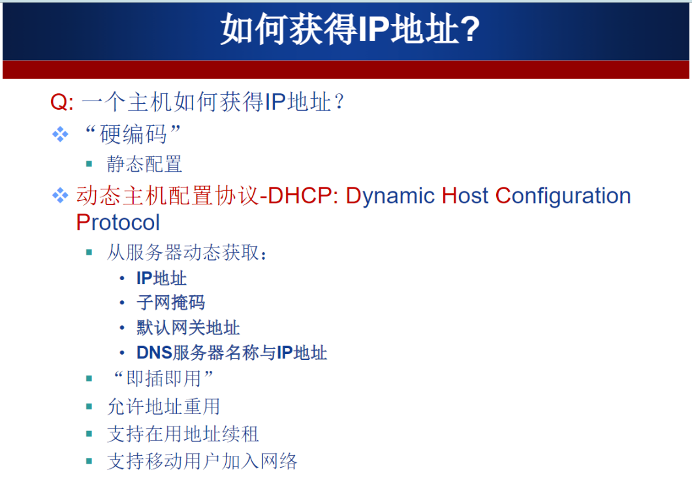
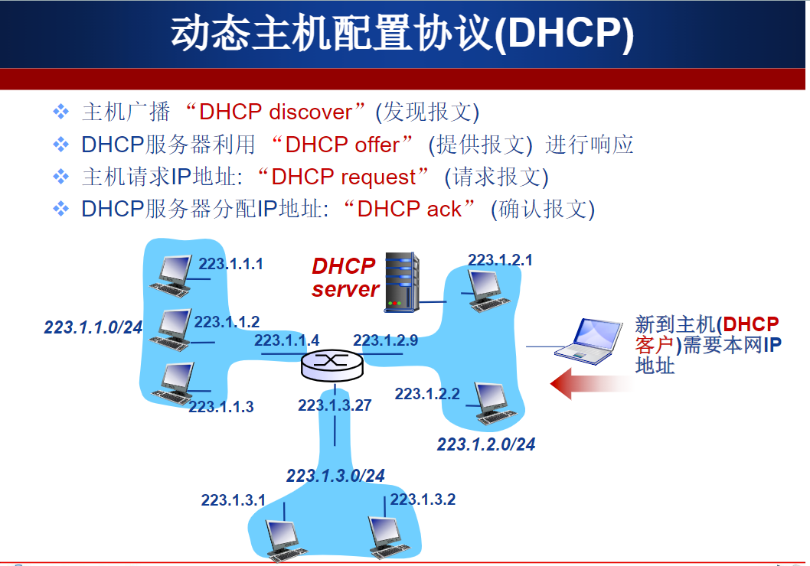
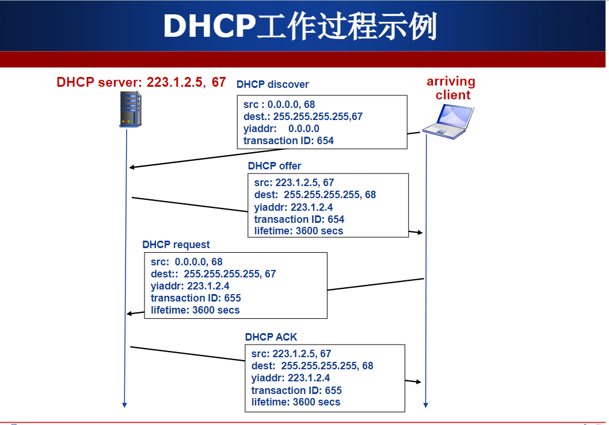
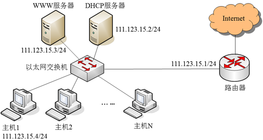
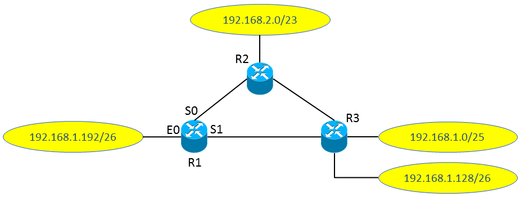

[TOC]

# 作业6 ： 网络层（下）

## 学习

* **DHCP协议**： Dynamic Host Configuration Protocol

    

   

 

## 题目

> 1. **某网络拓扑如图所示，其中路由器内网接口、DHCP服务器、WWW服务器与主机1均采用静态IP地址配置，相关地址信息见图中标注；主机2～主机N通过DHCP服务器动态获取IP地址等配置信息。**

**请回答下列问题。**

**（1）DHCP服务器可为主机2～主机N动态分配IP地址的最大范围是什么？主机2使用DHCP协议获取IP地址的过程中，发送的封装DHCP Discover报文的IP分组的源IP地址和目的IP地址分别是什么？**

**解：**

最大范围： 111.123.15.5 \~ 111.123.15.254

DHCP Discover报文中的IP分组的

源IP地址：	0.0.0.0	

目的IP地址：255.255.255.255

**（2）主机2在通过DHCP服务器获取IP地址的同时还可以获取哪些IP地址配置所必须的信息？**

子网掩码（255.255.255.0）

默认网关（111.123.15.1）

域名服务器 IP 地址

**（3）若主机1的子网掩码和默认网关分别配置为255.255.255.0和111.123.15.2，则该主机是否能访问WWW服务器？是否能访问Internet？请说明理由。**

主机 1 能访问 WWW 服务器，但不能访问 Internet。

由于主机 1 的子网掩码配置正确而默认网关 IP 地址被错误地配置为 111.123.15.2（正确 IP 地址是 111.123.15.1），所以主机1 可以访问在同一个子网内的 WWW 服务器，但当主机 1 访问 Internet 时，主机 1 发出的 IP 分组会被路由到错误的默认网关（111.123.15.2），从而无法到达目的主机。

> 2. **如图所示网络拓扑，所有路由器均采用距离向量路由算法计算到达两个子网的路由（注：到达子网的路由度量采用跳步数）。** 

**假设路由表结构如下表所示。**

| 目的网络‍ | 接口‍ |
| -------- | ---- |

**请回答下列问题：**

**（1）若所有路由器均已收敛，请给出R1的路由表，要求包括到达图中所有子网的路由，且路由表中的路由项尽可能少。**

RI路由表如下

| 目的网络         | 接口 |
| ---------------- | ---- |
| 192.168.1.192/26 | E0   |
| 192.168.2.0/23   | S0   |
| 192.168.1.0/24   | S1   |

**（2）在所有路由器均已收敛的状态下，R3突然检测到子网192.168.1.128/26不可到达，若接下来R2和R3同时向R1交换距离向量，则R1更新后的路由表是什么？更新后的R1距离向量是什么？**

| 目的网络         | 接口 | 距离向量 |
| ---------------- | ---- | -------- |
| 192.168.1.192/26 | E0   | 1        |
| 192.168.2.0/23   | S0   | 2        |
| 192.168.1.0/25   | S1   | 2        |
| 192.168.1.128/26 | S1   | 3        |

