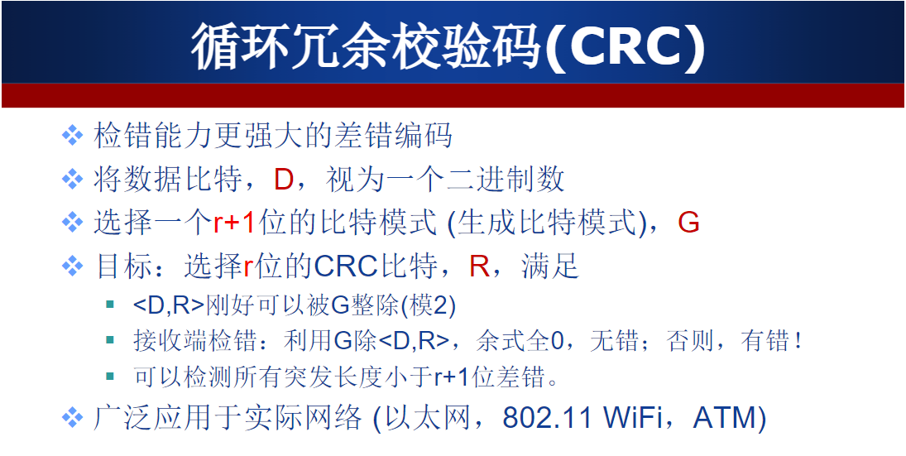
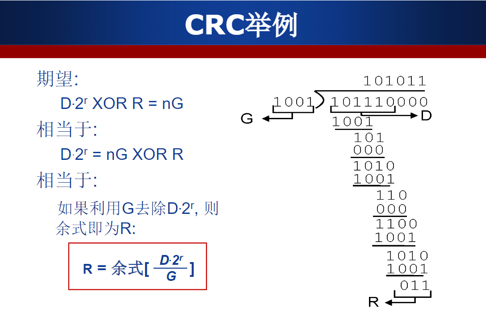
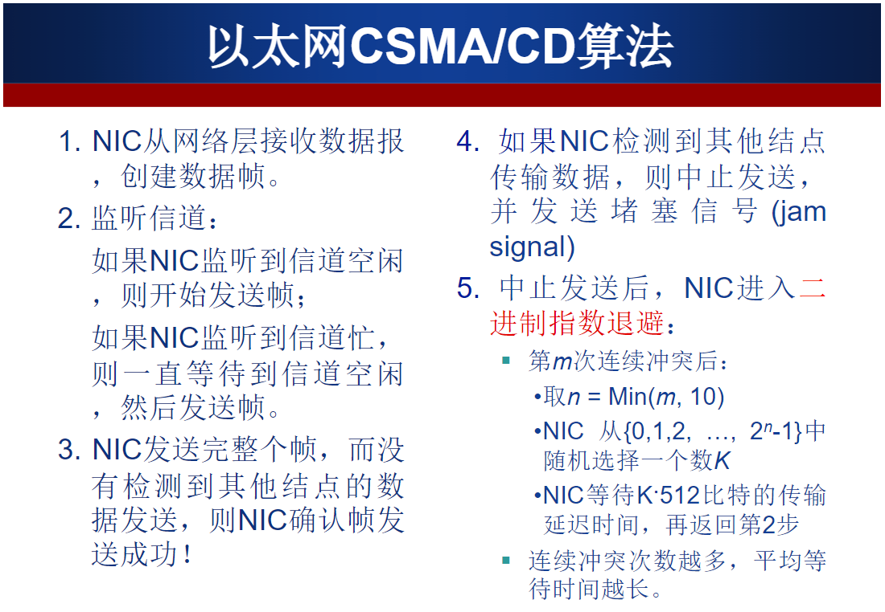

[TOC]

# 作业7

## 学习

1. CRC循环冗余校验码

   

   

   2. 以太网
   
       
   
   

## 题目

* **第一题**

假设CRC编码的生成比特模式G=10011。请回答下列问题：

> （1）如果数据D=1010101010，则CRC编码后<D,R>=？

**解：** 

G 是 r + 1 位

r = 4
$$
\frac{D << r}{G}=[\frac{1010101010\space0000}{10011}]=100
$$

$$
R = 0100
$$

$$
<D, R> = 1010101010 \space 0100
$$

> （2）如果数据D=1010100000，则CRC编码后<D,R>=？

**‌解：**
$$
\frac{D << r}{G}=[\frac{1010100000\space0000}{10011}]=1001
$$

$$
R = 1001
$$

$$
<D, R> = 1010101010 \space 1001
$$

> （3）如果接收端收到码字01011010101001，则该码字在传输过程中是否发生差错？ 

**‌解：**
$$
\frac{D}{G}=[\frac{01011010101001}{10011}]=0110
$$
不为0000，码字在传输过程中发生差错

> （4）如果接收端收到码字10010101010000, 则该码字在传输过程中是否发生差错？

**‌解：**
$$
\frac{D}{G}=[\frac{10010101010000}{10011}]=0000
$$
余码为0000，码字传输正确。

* **第二题**

> 假设在采用广播链路的10Mbps以太网中，回答下列问题：

> （1）某结点连续第5次冲突后，按二进制指数退避算法，选择K=4的概率是多少？相应地延迟多久再次重新尝试发送帧？

**‍解：**

二进制指数退避算法：第 N 次冲突后，取 $M = min \{N，10\}$ ，K 在 $0$ \~ $2^M$ 中随机选取。

由于连续发生5次冲突
$$
n = min(5, 10)=5
$$
从集合 $M = \{0, 1, ..., 30, 31\}$，即 $\{0,1,...,2^5-1\}$ 中选择 $K = 4$ 的概率为 $\frac{1}{32}$ 

延迟时间

**因为对于以太网，一个结点等待的实际时间量是K×512比特时间（即发送512比特进入以太网所需时间的K倍），**
$$
t = \frac{K * 512}{带宽} = \frac{4 * 512}{10*10^6}=204.8 us
$$

> （2）如果连续第12次冲突，该结点最多延迟多久再次重新尝试发送帧？

**‍解：**
$$
n = min(12, 10) = 10
$$
从集合 $M = \{1, 2, 3, ..., 1023\}$ 中选一个 $K$,由于要延迟最长，所以 $K = 1023$

延迟时间为
$$
t = \frac{1023 * 512}{10 * 10^6} = 52377.6 us
$$

* **第三题**

> 某局域网采用CSMA/CD协议实现介质访问控制，数据传输速率为10 Mbps，主机甲和主机乙之间的距离为2km，信号传播速度是200000km/s。请回答下列问题：

> （1）若主机甲和主机乙发送数据时发生冲突，则从开始发送数据时刻起，到两台主机均检测到冲突时刻止，最短需经过多长时间？最长需经过多长时间？（假设主机甲和主机乙发送数据过程中，其他主机不发送数据）

**‎解：**

最短检测到冲突的时间为

同时发送，同时达到，只需要经过一个单向传播时间。
$$
t_{min} = \frac{d_{max}}{v}=\frac{2km}{200000km/s}=10us
$$
最长检测到冲突的时间为

当主机甲向主机乙发送一个数据，在即将到达主机乙时，主机乙发送数据，则立即发生数据碰撞，检测到冲突，此时已过去一个单向传播用时10us,而主机乙发送的数据继续经过一个单向传播距离到达甲，此时，主机甲得知产生数据碰撞冲突。

 
$$
t_{max}=\frac{2*d_{max}}{v} =\frac{2*2km}{200000km/s}=20us
$$

> （2）若网络不存在任何冲突与差错，主机甲总是以标准的最长以太网数据帧向主机乙发送数据，主机乙每成功收到一个数据帧后立即向主机甲发送一个64字节的确认帧，主机甲收到确认帧后方可发送下一个数据帧。此时主机甲的有效数据（上层协议数据）传输速率是多少？（不考虑以太网帧的前导码）

**解：**

标准最长以太网数据帧为$1518B$

发送最长以太网帧用时$t_1 = 1518*8/10Mbps=1214.4us$

发送确认帧用时$t_2 = 64*8/10Mbps=51.2us$

主机甲发送数据帧到接收到确认帧用时为 $t = t_1 + t_2 = 1285.6us$

有效数据帧长度 $L = 1518B - 18B = 1500B$

有效数据帧传输速率 $1500 * 8 / 1285.6  \approx 9.33Mbps$