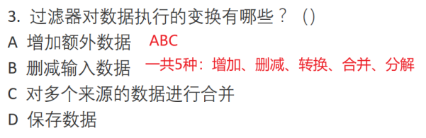
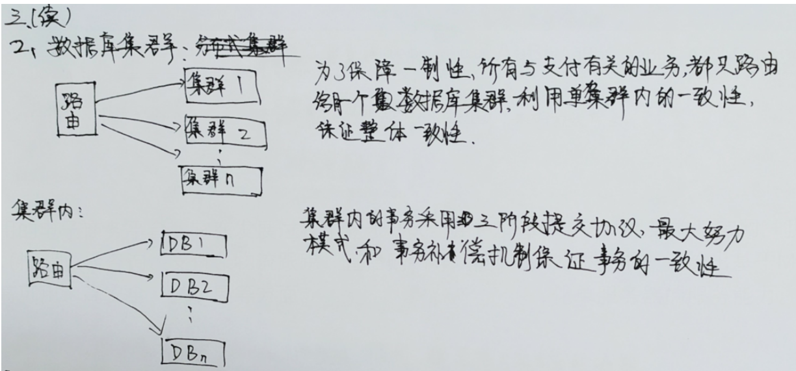
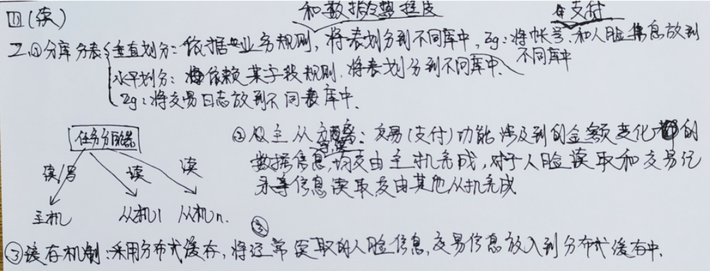

# 软件架构一天突击

对我是考查课，两天突击，万望别挂（双手合十）。

>   这是从某个学长的github上下载的，但是 word 格式我觉得有点拥挤，所以重新排版一下。非常感谢学长，千万别挂科呀。
>
>   下面是两位学长的火炬，搭配食用更棒：
>
>   https://github.com/mzm1183710118/SoftwareArchitecture/tree/main
>
>   https://github.com/1191000814/SA-Materials

## 1. 雨课堂习题

 

 

## 2. 2020 期末卷

 

 

 

 

 

 

 

 

 

 

 

 

三、设计题（30分，每题10分）
需求描述：某宝网是一个广泛应用的电子商务平台，它在发展过程中逐步壮大，用户群体已经遍及全球。它具有商品搜索（推荐）、咨询、支付、物流跟踪、直播购物等功能，在非功能需求上需要考虑高性能、高可用、高安全、高扩展等方面。

1. 针对早期的某宝网，我们要赋予用户通过Web访问该系统的能力，配备了一台主流性能的服务器。请给出基于MVC风格的设计方案。设计方案应从不同视图进行考虑，应充分优化单服务器的服务能力。

    GPT-4:

    1. **模型**（Model）：这是数据和业务逻辑的核心。我们需要定义数据结构，例如用户信息、商品信息、订单信息等，并且实现了与这些数据相关的业务逻辑。为了优化单服务器的服务能力，我们可以使用一些方法，例如数据缓存、数据库索引优化等。**视图**（View）：这是用户界面。在这里，我们需要设计并实现用户可以看到和交互的界面，例如商品列表、购物车、订单等。为了优化单服务器的服务能力，我们可以采用一些方法，例如使用CDN减少服务器的负载、优化前端资源等。**控制器：**Controller）：这是模型和视图之间的接口。我们需要根据用户的操作来更新模型，并更新视图。为了优化单服务器的服务能力，我们可以使用一些方法，例如优化请求处理的逻辑、使用非阻塞I/O等。
    
    当 client 发送一个新连接时，main reactor 会接收交给某个子进程。子进程会创建一个新handler会完成read->业务处理->send。其中业务处理为上述的MVC框架。handler处理完成后，生成HTML返回一个Http response给client。

    把下图中关于视图-模型-控制器的部分修改为上面gpt的回答即可。

2. 针对某宝网，要提供一个全球10亿用户可用的支付子系统。为保证系统的数据一致性，请设计该子系统的架构，请阐述设计理念和能够保障数据一致性的理由。

    GPT-4:

    这种架构可能包括以下部分：

    *   分布式数据库：为了保证数据一致性和可扩展性，我们可以使用分布式数据库。这样的数据库可以跨越多个服务器或数据中心，从而提供高可用性和数据一致性。
    *   分布式事物：为了处理可能会影响数据一致性的操作，需要使用分布式事物。一种可能的方法是使用两阶段提交（2PC）或者三阶段提交（3PC）。
    *   消息队列：为了解耦系统的各个部分，并提高系统的可扩展性，我们可以使用消息队列。
    *   服务分离：我们可以将支付子系统分解为多个微服务，每个微服务负责一部分功能，例如订单处理、支付处理、账户管理等。
    
    2.
    
    1)为了保障一致性，所有与支付有关的业务，都只为路由给同一个数据库集群，利用单集群内的一致性，保证整体一致性。
    
    2)集群内的事物采用三阶段提交协议，最大努力模式和事务补偿机制保证事务的一致性。

 

3. 针对某宝网，我们需要进行架构评审和测试，以决定如何完善系统。请基于ATAM评审方法，给出针对支付子系统的效用树设计。对于评审结果和测试结论的不同可能给出改进策略。

    **风险：**存在单点故障，多个业务集中在一台服务器速度慢，业务与数据库耦合度高，不能防御恶意连接申请，数据可能存在不一致；**非风险：**响应时间过长；**关键点：**SA中的架构设计；**折中点：**高可用、高扩展、高性能、高安全不能并存；

    **解决方案：** **单点故障：** 通过冗余一台服务器解决。**速度慢：**通过分布式集群集中算力；**业务与数据耦合度高：**解耦合，业务和数据通过中间件进行连接E.g.Myabatis；**恶意攻击：**在服务器集群中引入F5，可防御攻击；**数据不一致：**一致性保障，e.g.CP；**SA中的架构设计：**改用分布式架构。

  

四、综合应用题（20分）
你是某独角兽公司的首席架构师，刚刚接下了一个软件大单，要为支付宝刷脸支付平台提供人脸验证的服务系统。该验证服务系统支持：1）全球范围的海量用户高并发访问能力；2）多种终端访问能力，e.g. 手机端、Pos机；3）低延时，应答时间不超过2秒。请综合运用课程知识从下面各个角度提供架构设计方案。

1. 如何在计算层实现高性能、高扩展和高可用？请从单机优化、负载均衡、消息处理等角度进行考虑和设计。（8分）

  

  

2. 如何在数据层提供快速、稳定的数据访问能力？请从分库分表、主从分离、数据缓存等角度进行考虑和设计。（8分）

  

3. 如何为各异的终端用户提供友好、快捷的展示？请从异步内容加载、自适应适配等角度进行考虑和设计（4分）

  

## 3. 课堂知识回溯

1- **模型**（Model）：这是数据和业务逻辑的核心。我们需要定义数据结构，例如用户信息、商品信息、订单信息等，并且实现了与这些数据相关的业务逻辑。为了优化单服务器的服务能力，我们可以使用一些方法，例如数据缓存、数据库索引优化等。**视图**（View）：这是用户界面。在这里，我们需要设计并实现用户可以看到和交互的界面，例如商品列表、购物车、订单等。为了优化单服务器的服务能力，我们可以采用一些方法，例如使用CDN减少服务器的负载、优化前端资源等。**控制器：**Controller）：这是模型和视图之间的接口。我们需要根据用户的操作来更新模型，并更新视图。为了优化单服务器的服务能力，我们可以使用一些方法，例如优化请求处理的逻辑、使用非阻塞I/O等。

当 client 发送一个新连接时，main reactor 会接收交给某个子进程。子进程会创建一个新handler会完成read->业务处理->send。其中业务处理为上述的MVC框架。handler处理完成后，生成HTML返回一个Http response给client。

2-1)为了保障一致性，所有与支付有关的业务，都只为路由给同一个数据库集群，利用单集群内的一致性，保证整体一致性。 2)集群内的事物采用三阶段提交协议，最大努力模式和事务补偿机制保证事务的一致性。
3-**风险：**存在单点故障，多个业务集中在一台服务器速度慢，业务与数据库耦合度高，不能防御恶意连接申请，数据可能存在不一致；**非风险：**响应时间过长；**关键点：**SA中的架构设计；**折中点：**高可用、高扩展、高性能、高安全不能并存；

**解决方案：** **单点故障：** 通过冗余一台服务器解决。**速度慢：**通过分布式集群集中算力；**业务与数据耦合度高：**解耦合，业务和数据通过中间件进行连接E.g.Myabatis；**恶意攻击：**在服务器集群中引入F5，可防御攻击；**数据不一致：**一致性保障，e.g.CP；**SA中的架构设计：**改用分布式架构。

## 4. 考后回忆

题量巨大，和上面这套模拟题相比，多了5道填空，多了5道简答，直接写麻。PPT 一定要大致看一遍，最好能理解一些这样简答的时候就不用找了，密密麻麻的一直开卷真的很难找得到（说到这提醒一句，学校打印机不太行，建议去校外的打印店比如纸张记忆，一张一毛还巨清晰。）。大题也完全不一样了，设计题从单服务器性能提升变成了分布式系统，综合题也不一样了。但是考察的点似乎变化没有特别大，反正我是找概念，凭借对分布式的一点了解和 bilibili 软件架构概念速通课的帮助下，尽量找概念，写理由让逻辑闭环，放弃了两道填空题，勉强画完，希望别挂。。。
